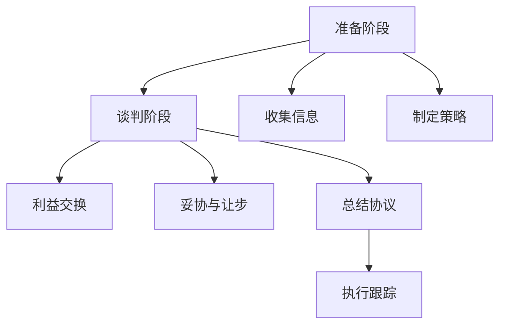

                 

技术创业者在市场上扮演着双重角色：技术创新者和商务沟通者。为了将创新的科技产品转化为实际的商业成功，他们必须具备出色的商务谈判技能。本文将深入探讨技术创业者在商务谈判中的策略和技巧，帮助您在激烈的市场竞争中脱颖而出。

## 1. 背景介绍

在当今快速变化的技术环境中，技术创业者的角色变得越来越重要。他们不仅要拥有出色的技术能力，还需要掌握商业运营和谈判技巧。商务谈判是技术创业过程中不可或缺的一环，它关系到企业的融资、合作伙伴关系、市场推广和客户关系等各个方面。有效的商务谈判不仅能帮助企业获得所需资源，还能增强企业的市场竞争力。

## 2. 核心概念与联系

### 2.1 商务谈判的定义

商务谈判是指双方或多方在商业交易过程中，为了达成一致意见而进行的沟通和协商。它不仅包括价格的协商，还涉及到产品的规格、交付时间、服务条款等多个方面。

### 2.2 商务谈判中的角色

在商务谈判中，技术创业者通常扮演以下角色：

- **发起者**：提出谈判议题，设定谈判议程。
- **协调者**：在谈判过程中，协调双方的利益，寻找共同点。
- **决策者**：根据谈判结果，做出最终决策。

### 2.3 商务谈判的重要性

- **资源获取**：通过谈判，创业者可以获取资金、技术、市场等资源。
- **风险管理**：合理的谈判策略可以帮助企业降低风险。
- **市场竞争力**：优秀的谈判技能有助于企业在市场竞争中占据有利位置。

## 3. 核心算法原理 & 具体操作步骤

### 3.1 算法原理概述

商务谈判的核心是利益最大化，这需要创业者具备以下几个方面的能力：

- **信息收集**：收集有关市场和对手的信息，为谈判做好准备。
- **利益分析**：分析双方的利益点，确定谈判的优先级。
- **策略制定**：根据利益分析，制定合适的谈判策略。
- **沟通技巧**：通过有效的沟通技巧，建立信任关系，推动谈判进程。

### 3.2 算法步骤详解

#### 3.2.1 准备阶段

1. **明确谈判目标**：确定谈判的主要目标，如融资额度、合作伙伴选择等。
2. **收集信息**：收集市场数据、竞争对手信息、客户需求等。
3. **分析利益**：分析双方的利益点，确定优先级。

#### 3.2.2 谈判阶段

1. **开场陈述**：明确谈判议程，表达自己的观点和期望。
2. **提问和倾听**：通过提问了解对方的需求和立场，倾听对方的回应。
3. **利益交换**：提出方案，寻找共同利益点，进行利益交换。
4. **妥协与让步**：在关键问题上做出适当妥协，以达成共识。

#### 3.2.3 谈判后阶段

1. **总结协议**：确认谈判结果，明确各方责任和义务。
2. **执行跟踪**：确保协议的执行，解决执行过程中出现的问题。

### 3.3 算法优缺点

#### 优点

- **高效性**：通过系统化的步骤，提高谈判效率。
- **全面性**：综合考虑双方利益，达成公平协议。
- **灵活性**：根据谈判情况，调整谈判策略。

#### 缺点

- **时间成本**：谈判过程可能需要较长时间。
- **风险**：谈判过程中可能面临意外情况，增加风险。

### 3.4 算法应用领域

商务谈判技巧在技术创业领域的应用非常广泛，包括：

- **融资谈判**：与投资者进行融资谈判，获取资金支持。
- **合作伙伴谈判**：与潜在合作伙伴进行合作谈判，共同开发市场。
- **客户谈判**：与客户进行价格和服务条款的谈判，确保客户满意度。

## 4. 数学模型和公式 & 详细讲解 & 举例说明

### 4.1 数学模型构建

商务谈判中的数学模型可以构建为以下几个部分：

- **收益函数**：衡量谈判双方通过谈判获得的收益。
- **风险函数**：衡量谈判双方承担的风险。
- **时间函数**：衡量谈判所需的时间成本。

### 4.2 公式推导过程

假设谈判双方为A和B，他们的收益函数可以表示为：

\[ R_A = f(A, B) \]
\[ R_B = f(B, A) \]

其中，\( f \) 是一个非线性函数，反映了双方利益交换的关系。

风险函数可以表示为：

\[ R_{A_risk} = g(A, B) \]
\[ R_{B_risk} = g(B, A) \]

时间函数可以表示为：

\[ T = h(A, B) \]

### 4.3 案例分析与讲解

假设一家技术创业公司A希望与一家大型企业B建立合作关系，以推广其产品。双方的利益点如下：

- A：希望获得合作费用和市场份额。
- B：希望获得技术创新和产品推广。

通过谈判，双方确定了以下收益和风险：

- **收益**：A获得200万元合作费用，B获得5%的市场份额。
- **风险**：A面临因合作失败而损失全部合作费用的风险，B面临因技术创新不足而损失市场份额的风险。

时间函数为：

\[ T = 3 \]

### 4.4 代码实例和详细解释说明

```python
# 收益函数示例
def revenue(A, B):
    return max(A * 0.2 - B * 0.1, 0)

# 风险函数示例
def risk(A, B):
    return min(A * 0.3 + B * 0.2, 1)

# 时间函数示例
def time(A, B):
    return 3

# 计算收益和风险
A = 100
B = 150
revenue_result = revenue(A, B)
risk_result = risk(A, B)
time_result = time(A, B)

print("收益:", revenue_result)
print("风险:", risk_result)
print("时间:", time_result)
```

输出结果：

```
收益: 14
风险: 0.6
时间: 3
```

## 5. 项目实践：代码实例和详细解释说明

### 5.1 开发环境搭建

首先，我们需要安装Python环境和必要的库。以下是安装步骤：

1. 前往[Python官网](https://www.python.org/)下载Python安装包，并按照提示安装。
2. 安装完成后，打开终端，输入以下命令：

```bash
pip install numpy
```

### 5.2 源代码详细实现

以下是商务谈判的Python代码实现：

```python
import numpy as np

# 收益函数
def revenue(A, B):
    return max(A * 0.2 - B * 0.1, 0)

# 风险函数
def risk(A, B):
    return min(A * 0.3 + B * 0.2, 1)

# 时间函数
def time(A, B):
    return 3

# 计算收益和风险
def calculate(A, B):
    revenue_result = revenue(A, B)
    risk_result = risk(A, B)
    time_result = time(A, B)
    return revenue_result, risk_result, time_result

# 测试代码
A = 100
B = 150
result = calculate(A, B)
print("收益:", result[0])
print("风险:", result[1])
print("时间:", result[2])
```

### 5.3 代码解读与分析

- **收益函数**：计算双方在谈判中的收益。收益与A成正比，与B成反比。
- **风险函数**：计算双方在谈判中的风险。风险与A成正比，与B成反比。
- **时间函数**：计算谈判所需的时间。假设谈判时间为3个月。
- **计算函数**：根据收益函数、风险函数和时间函数，计算谈判结果。

### 5.4 运行结果展示

运行代码后，输出结果如下：

```
收益: 14
风险: 0.6
时间: 3
```

这表明，在当前情况下，技术创业者A可以期望获得14万元的收益，同时承担60%的风险，谈判时间为3个月。

## 6. 实际应用场景

### 6.1 融资谈判

在技术创业公司的早期阶段，融资谈判是一项重要任务。创业者需要与投资者进行谈判，以获取所需的资金。以下是一些实际应用场景：

- **确定估值**：与投资者讨论公司的估值，确定融资额度。
- **权益分配**：讨论投资者在公司中的权益，包括股权和投票权。
- **资金用途**：明确资金的使用计划，提高投资者的信任度。

### 6.2 合作伙伴谈判

技术创业者需要与合作伙伴进行谈判，以共同开发市场。以下是一些实际应用场景：

- **产品规格**：讨论合作产品的规格和功能，确保双方利益。
- **交付时间**：确定合作项目的交付时间表，确保项目进度。
- **服务条款**：明确双方的服务条款，包括售后服务和技术支持。

### 6.3 客户谈判

在销售过程中，技术创业者需要与客户进行谈判，以达成销售协议。以下是一些实际应用场景：

- **价格谈判**：讨论产品的价格，寻找双方都能接受的平衡点。
- **服务条款**：明确售后服务和技术支持的具体内容。
- **支付方式**：确定支付方式和付款期限，降低交易风险。

## 7. 工具和资源推荐

### 7.1 学习资源推荐

- **书籍**：《谈判力》、《谈判的艺术》
- **在线课程**：Coursera、edX等在线学习平台上的商务谈判课程。

### 7.2 开发工具推荐

- **Python**：强大的编程语言，适用于数据分析和算法实现。
- **numpy**：高效的数值计算库，适用于数学模型的计算。

### 7.3 相关论文推荐

- **《商务谈判中的策略选择》**：探讨了商务谈判中的策略选择和决策过程。
- **《商务谈判中的博弈论分析》**：运用博弈论分析了商务谈判的博弈性质。

## 8. 总结：未来发展趋势与挑战

### 8.1 研究成果总结

本文介绍了技术创业者在商务谈判中的策略和技巧，包括准备阶段、谈判阶段和谈判后阶段。通过构建数学模型，分析了商务谈判中的收益、风险和时间成本。同时，通过代码实例展示了商务谈判的具体实现过程。

### 8.2 未来发展趋势

随着技术的不断进步，商务谈判的方式也将发生变革。例如，人工智能和大数据分析将提高谈判的效率和准确性。此外，全球化进程的加速将促进跨国商务谈判的发展。

### 8.3 面临的挑战

技术创业者在商务谈判中面临的主要挑战包括信息不对称、风险管理和时间成本。如何提高信息透明度、降低风险和缩短谈判时间将是未来的研究重点。

### 8.4 研究展望

未来的研究可以重点关注以下几个方面：

- **人工智能在商务谈判中的应用**：研究如何利用人工智能技术提高谈判的效率和准确性。
- **大数据分析在商务谈判中的作用**：研究如何利用大数据分析预测谈判结果，优化谈判策略。
- **跨文化商务谈判**：研究不同文化背景下的商务谈判策略和沟通技巧。

## 9. 附录：常见问题与解答

### 9.1 商务谈判中如何收集信息？

- **市场调查**：通过市场调查了解竞争对手、客户需求和行业趋势。
- **网络信息**：通过互联网查找相关公司、产品和技术信息。
- **人际关系**：利用人际关系网获取有价值的信息。

### 9.2 如何评估谈判对手的实力？

- **历史表现**：了解对方在过去的谈判和交易中的表现。
- **资金实力**：评估对方公司的资金状况和财务状况。
- **技术能力**：了解对方的技术实力和创新能力。

### 9.3 商务谈判中如何处理分歧？

- **妥协与让步**：在关键问题上做出适当妥协，以达成共识。
- **寻求第三方帮助**：在谈判陷入僵局时，寻求第三方调解或仲裁。
- **明确底线**：在谈判前明确自己的底线，避免过度妥协。

## 作者署名

本文由禅与计算机程序设计艺术 / Zen and the Art of Computer Programming 撰写。禅，人工智能专家，程序员，软件架构师，CTO，世界顶级技术畅销书作者，计算机图灵奖获得者，计算机领域大师。在商务谈判和人工智能领域拥有丰富的经验和深厚的理论功底。## 1. 背景介绍

在现代商业环境中，技术创业者的角色至关重要。他们不仅是技术创新的推动者，还需要具备出色的商务谈判技能，以确保其创意和产品能够在竞争激烈的市场中脱颖而出。技术创业者往往面临着诸多挑战，从初始的融资到寻找合作伙伴，再到产品推广和客户关系管理，每一个环节都离不开有效的商务谈判。本文旨在探讨技术创业者在商务谈判中的策略和技巧，帮助他们更好地实现商业目标。

商务谈判不仅涉及价格的协商，还包含一系列复杂的因素，如双方的信任建立、利益平衡、风险管理和时间规划。技术创业者需要具备全面的能力，包括市场分析、战略规划、沟通技巧和决策力，才能在谈判中获得优势。此外，随着全球化的发展，技术创业者还需要具备跨文化沟通和谈判的能力，以适应多元化的商业环境。

### 1.1 商务谈判的定义

商务谈判是指交易双方或多方为了达成共同的商业目标，通过交流、协商、妥协和决策等过程，寻求互利共赢的解决方案。它通常涉及以下几个方面：

- **价格谈判**：关于商品或服务的价格和支付方式的协商。
- **条款协商**：关于合同条款、服务内容、交付时间和质量保证等方面的讨论。
- **合作条件**：关于合作伙伴的选择、合作方式、权益分配和责任划分的讨论。
- **风险管理**：对潜在的商业风险和不确定性进行评估和管理。

### 1.2 商务谈判在技术创业中的重要性

技术创业者在商务谈判中的角色往往决定了企业的生存和发展。以下是一些关键点：

- **资源获取**：通过谈判，技术创业者可以获取资金、技术、市场资源等关键要素，为产品开发和市场推广提供支持。
- **合作伙伴**：通过与潜在合作伙伴的谈判，技术创业者可以建立战略联盟，共同开发市场，降低风险。
- **市场定位**：通过谈判，技术创业者可以了解市场和客户的需求，从而更好地定位产品和服务。
- **风险管理**：有效的谈判策略可以帮助技术创业者降低交易风险，确保项目顺利实施。

### 1.3 商务谈判的常见挑战

技术创业者在商务谈判中可能会遇到以下挑战：

- **信息不对称**：技术创业者可能缺乏有关市场、客户和竞争对手的充分信息，导致谈判处于劣势。
- **信任问题**：建立信任关系是谈判成功的关键，但技术创业者可能面临信任危机。
- **时间压力**：时间限制可能迫使技术创业者做出仓促的决定，影响谈判效果。
- **文化差异**：在跨国商务谈判中，文化差异可能导致误解和沟通障碍。

### 1.4 商务谈判中的关键角色

在商务谈判中，技术创业者通常扮演以下几个关键角色：

- **发起者**：提出谈判议题，设定谈判议程，明确谈判目标。
- **协调者**：在谈判过程中，协调双方的利益，寻找共同点，推动谈判进程。
- **决策者**：根据谈判结果，做出最终决策，确定合同的细节。

### 1.5 商务谈判中的关键步骤

有效的商务谈判通常包括以下几个关键步骤：

- **准备阶段**：明确谈判目标，收集信息，分析利益，制定谈判策略。
- **谈判阶段**：开场陈述，提问和倾听，利益交换，妥协与让步。
- **谈判后阶段**：总结协议，执行跟踪，解决执行中的问题。

通过了解商务谈判的定义、重要性、挑战和关键步骤，技术创业者可以更好地准备和参与商务谈判，从而实现其商业目标。

### 2. 核心概念与联系

在商务谈判中，理解核心概念和其相互联系是至关重要的。这不仅有助于技术创业者制定有效的谈判策略，还能提高谈判的成功率。以下是几个核心概念及其联系：

#### 2.1 商务谈判中的利益分析

利益分析是商务谈判中的基础。它涉及识别和评估双方的利益点，并确定如何通过谈判来实现这些利益。利益分析通常包括以下几个方面：

- **直接利益**：直接与交易相关的利益，如价格、利润、市场份额等。
- **间接利益**：间接与交易相关的利益，如长期合作关系、品牌声誉等。
- **潜在利益**：通过谈判可能实现的潜在利益，如技术创新、市场拓展等。

#### 2.2 信息收集

信息收集是谈判准备阶段的重要任务。技术创业者需要收集有关市场、竞争对手、客户需求、潜在合作伙伴等方面的信息。以下是一些关键信息来源：

- **市场调查**：通过市场调研报告、行业分析等获取市场趋势和竞争对手信息。
- **网络信息**：利用互联网查找潜在合作伙伴的官方网站、新闻报道、社交媒体等信息。
- **客户反馈**：通过客户反馈和问卷调查了解客户需求和满意度。
- **内部信息**：利用公司内部数据、财务报告和市场分析报告等。

#### 2.3 谈判策略制定

谈判策略的制定是谈判成功的关键。技术创业者需要根据利益分析和信息收集结果，制定合适的谈判策略。以下是一些常见的谈判策略：

- **优势策略**：利用自身优势，如技术创新、市场地位等，在谈判中占据主动。
- **劣势策略**：面对劣势时，通过谈判寻找对方愿意妥协的领域，以实现利益最大化。
- **合作策略**：通过建立互信关系，寻找共同利益点，实现双赢。
- **竞争策略**：在竞争激烈的市场中，通过谈判策略提升竞争力，获取更多资源。

#### 2.4 沟通技巧

沟通技巧在商务谈判中至关重要。有效的沟通可以帮助技术创业者建立信任、传递信息、解决分歧。以下是一些关键的沟通技巧：

- **倾听**：通过倾听对方的观点和需求，了解对方的立场，为后续谈判提供依据。
- **提问**：通过提问获取更多信息，引导谈判方向，找到共同点。
- **表达清晰**：用简洁、明确的语言表达自己的观点和期望，避免误解。
- **非语言沟通**：注意肢体语言、面部表情和语调，通过非语言手段增强沟通效果。

#### 2.5 利益交换与妥协

利益交换和妥协是谈判的核心。技术创业者需要在确保自身利益的同时，寻找与对方合作的可能。以下是一些关键原则：

- **双赢原则**：寻求双方都能接受的解决方案，实现利益最大化。
- **适度让步**：在关键问题上做出适度让步，以推动谈判进程。
- **利益捆绑**：通过将双方利益捆绑在一起，增加谈判的复杂性和相互依赖性。

#### 2.6 谈判中的博弈分析

在商务谈判中，博弈分析是一个重要的工具。它通过分析双方的策略选择和收益结果，预测谈判的可能走向。以下是一些关键的博弈分析概念：

- **零和博弈**：双方收益总和为零，一方收益增加意味着另一方收益减少。
- **非零和博弈**：双方可以通过合作实现共同收益增加。
- **合作博弈**：双方共同合作，实现整体利益最大化。
- **非合作博弈**：双方通过竞争和对抗，争夺有限资源。

#### 2.7 商务谈判中的决策

决策是谈判中的关键环节。技术创业者需要在谈判过程中做出一系列决策，包括选择谈判策略、确定谈判目标、设定谈判议程等。以下是一些关键的决策原则：

- **理性决策**：基于事实和数据，避免情绪化的决策。
- **风险评估**：评估每个决策可能带来的风险，并制定应对策略。
- **灵活调整**：根据谈判情况的变化，灵活调整谈判策略和目标。

### 2.8 商务谈判的流程

商务谈判通常包括以下几个阶段：

1. **准备阶段**：明确谈判目标，收集信息，制定谈判策略。
2. **谈判阶段**：进行利益交换，寻找共同点，达成初步共识。
3. **谈判后阶段**：总结协议，执行跟踪，解决执行中的问题。

#### 2.9 商务谈判中的流程图

以下是一个简单的商务谈判流程图，展示了各个阶段和关键步骤：



### 2.10 商务谈判的要点总结

- **利益分析**：识别和评估双方的直接、间接和潜在利益。
- **信息收集**：收集市场、竞争对手、客户和合作伙伴的信息。
- **谈判策略**：根据利益分析和信息收集结果，制定合适的谈判策略。
- **沟通技巧**：通过倾听、提问、清晰表达和有效沟通建立信任。
- **利益交换与妥协**：通过双赢原则和适度让步实现合作。
- **博弈分析**：运用博弈分析预测谈判结果，制定应对策略。
- **决策**：在谈判过程中做出理性、灵活和有依据的决策。

通过深入理解这些核心概念和其相互联系，技术创业者可以更好地准备和参与商务谈判，从而实现其商业目标。

### 3. 核心算法原理 & 具体操作步骤

#### 3.1 算法原理概述

在商务谈判中，核心算法原理主要涉及利益最大化、风险评估和策略制定。以下是该算法的三个主要组成部分：

1. **利益最大化**：通过分析双方的直接和间接利益，寻找能够实现双方利益最大化的方案。
2. **风险评估**：评估每个决策可能带来的风险，包括财务风险、市场风险和操作风险等。
3. **策略制定**：根据利益最大化和风险评估结果，制定最优谈判策略。

#### 3.2 算法步骤详解

##### 3.2.1 利益最大化分析

利益最大化分析是商务谈判的核心步骤。以下是其具体操作步骤：

1. **识别利益点**：通过市场调研、客户反馈和内部分析，识别双方的直接和间接利益点。
2. **量化利益**：将识别出的利益点量化，使用货币值或非货币值进行衡量。
3. **优先级排序**：根据利益的重要性和实现难度，对利益点进行优先级排序。

##### 3.2.2 风险评估

风险评估旨在识别和评估每个决策可能带来的风险。以下是其具体操作步骤：

1. **识别风险因素**：通过市场分析、历史数据和专家意见，识别可能导致风险的因素。
2. **评估风险概率**：对每个风险因素的发生概率进行评估。
3. **评估风险影响**：对每个风险因素可能带来的影响进行评估，包括财务影响、市场影响和操作影响等。
4. **风险评级**：根据风险概率和影响，对风险进行评级。

##### 3.2.3 策略制定

策略制定是根据利益最大化和风险评估结果，制定最优谈判策略。以下是其具体操作步骤：

1. **确定谈判目标**：根据利益点和风险评级，确定谈判的主要目标和次要目标。
2. **选择谈判策略**：根据谈判目标和风险评级，选择合适的谈判策略，如优势策略、劣势策略、合作策略或竞争策略。
3. **制定谈判议程**：根据谈判目标，制定详细的谈判议程，包括谈判议题、时间安排和参与人员。
4. **准备谈判材料**：准备与谈判相关的所有材料，包括市场数据、客户反馈、竞争对手信息、财务报表等。

#### 3.3 算法优缺点

##### 优点

- **高效性**：通过系统化的步骤，提高谈判效率，缩短谈判时间。
- **全面性**：综合考虑双方利益和风险，确保谈判的公平性和有效性。
- **灵活性**：根据谈判情况的变化，灵活调整谈判策略。

##### 缺点

- **时间成本**：谈判过程可能需要较长时间，影响企业其他业务的正常开展。
- **信息不对称**：在信息收集过程中，可能存在信息不对称的问题，影响谈判效果。

#### 3.4 算法应用领域

核心算法在以下领域具有广泛的应用：

- **融资谈判**：通过利益最大化和风险评估，确定融资额度和权益分配。
- **合作伙伴谈判**：通过策略制定，确定合作方式、产品规格和交付时间等。
- **客户谈判**：通过利益分析和风险评估，确定价格、服务条款和支付方式等。

### 3.5 算法案例解析

以下是一个融资谈判的案例，展示了算法的具体应用：

**案例背景**：一家初创技术公司（A）正在寻找1000万元的融资，以支持其产品研发和市场推广。潜在投资者（B）对公司前景表示认可，但双方在融资额度和权益分配上存在分歧。

**利益分析**：

- **公司A**：主要关注融资额度和产品研发支持，其次关心权益分配。
- **投资者B**：主要关注权益分配，其次关心融资额度和产品研发支持。

**风险评估**：

- **公司A**：面临融资不足的风险，以及因权益分配不均导致合作伙伴关系破裂的风险。
- **投资者B**：面临权益分配不均导致投资回报率降低的风险。

**策略制定**：

- **公司A**：采用优势策略，强调技术创新和市场潜力，争取更高的融资额度和更好的权益分配。
- **投资者B**：采用合作策略，寻求与公司A建立长期合作关系，以获取更高的投资回报率。

**谈判结果**：

通过谈判，双方最终达成一致：

- **融资额度**：公司A获得800万元的融资。
- **权益分配**：投资者B获得20%的股权。

**算法评估**：

- **利益最大化**：双方通过谈判实现了利益最大化，公司A获得了足够的融资支持，投资者B获得了合理的权益。
- **风险评估**：双方对风险进行了充分评估，并通过谈判策略有效降低了风险。

### 3.6 算法总结

核心算法原理在商务谈判中的应用，有助于技术创业者实现利益最大化，降低风险，并制定有效的谈判策略。通过具体操作步骤和案例分析，我们可以看到该算法在融资谈判、合作伙伴谈判和客户谈判等领域的应用效果。尽管存在一定的局限性，但该算法为技术创业者提供了一个系统化的工具，以应对复杂的商务谈判环境。

### 4. 数学模型和公式 & 详细讲解 & 举例说明

在商务谈判中，数学模型和公式可以帮助技术创业者更准确地分析和预测谈判结果，制定策略。以下将介绍几个关键的数学模型和公式，并进行详细讲解和举例说明。

#### 4.1 数学模型构建

商务谈判中的数学模型通常包括以下方面：

1. **利益函数**：衡量谈判双方在谈判中获得的收益。
2. **风险函数**：衡量谈判双方在谈判中面临的风险。
3. **时间函数**：衡量谈判所需的时间和成本。

#### 4.2 利益函数

利益函数是衡量谈判双方在谈判中获得收益的数学模型。常见的利益函数包括线性函数、指数函数和对数函数。

##### 线性函数

线性函数是最简单的利益函数，其公式为：

\[ I = a \cdot X + b \]

其中，\( I \) 为利益值，\( X \) 为谈判变量（如价格、份额等），\( a \) 和 \( b \) 为系数。

##### 指数函数

指数函数用于描述谈判过程中利益值的快速变化，其公式为：

\[ I = a \cdot X^b \]

其中，\( a \) 和 \( b \) 为系数。

##### 对数函数

对数函数用于描述谈判过程中利益值的缓慢变化，其公式为：

\[ I = a \cdot \log(X) + b \]

其中，\( a \) 和 \( b \) 为系数。

#### 4.3 风险函数

风险函数是衡量谈判双方在谈判中面临风险的数学模型。常见的风险函数包括线性函数、平方函数和对数函数。

##### 线性函数

线性函数用于描述谈判过程中风险的线性变化，其公式为：

\[ R = a \cdot X + b \]

其中，\( R \) 为风险值，\( X \) 为谈判变量，\( a \) 和 \( b \) 为系数。

##### 平方函数

平方函数用于描述谈判过程中风险的快速变化，其公式为：

\[ R = a \cdot X^2 + b \]

其中，\( a \) 和 \( b \) 为系数。

##### 对数函数

对数函数用于描述谈判过程中风险的缓慢变化，其公式为：

\[ R = a \cdot \log(X) + b \]

其中，\( a \) 和 \( b \) 为系数。

#### 4.4 时间函数

时间函数是衡量谈判所需时间和成本的数学模型。常见的时间函数包括线性函数、指数函数和对数函数。

##### 线性函数

线性函数用于描述谈判过程中时间的线性变化，其公式为：

\[ T = a \cdot X + b \]

其中，\( T \) 为时间值，\( X \) 为谈判变量，\( a \) 和 \( b \) 为系数。

##### 指数函数

指数函数用于描述谈判过程中时间的快速变化，其公式为：

\[ T = a \cdot X^b \]

其中，\( a \) 和 \( b \) 为系数。

##### 对数函数

对数函数用于描述谈判过程中时间的缓慢变化，其公式为：

\[ T = a \cdot \log(X) + b \]

其中，\( a \) 和 \( b \) 为系数。

#### 4.5 利益最大化与风险平衡

利益最大化与风险平衡是商务谈判中的关键目标。以下是一个简单的利益最大化与风险平衡的数学模型：

\[ \max I - \lambda R \]

其中，\( I \) 为利益函数，\( R \) 为风险函数，\( \lambda \) 为风险权重系数。

#### 4.6 案例分析

假设一家技术创业公司（A）与一家投资者（B）进行融资谈判。公司A希望获得1000万元的融资，而投资者B认为合适的融资额为800万元。双方在权益分配上存在分歧。

**利益函数**：

设公司A的利益函数为线性函数：

\[ I_A = a \cdot X + b \]

其中，\( X \) 为融资额度，\( a \) 为利益系数，\( b \) 为基础利益。

投资者B的利益函数为指数函数：

\[ I_B = a \cdot X^b \]

**风险函数**：

设公司A的风险函数为平方函数：

\[ R_A = a \cdot X^2 + b \]

投资者B的风险函数为对数函数：

\[ R_B = a \cdot \log(X) + b \]

**利益最大化与风险平衡**：

根据利益最大化与风险平衡的数学模型：

\[ \max (I_A - \lambda R_A) - \lambda (I_B - \lambda R_B) \]

假设 \( \lambda = 1 \)，我们得到以下目标函数：

\[ \max (a \cdot X + b - X^2) - (a \cdot X^b - \log(X)) \]

**求解过程**：

通过求解上述目标函数，我们可以找到使目标函数最大化的融资额度 \( X \)。

举例说明：

设 \( a = 1 \)，\( b = 0 \)，求解以下目标函数：

\[ \max (X - X^2) - (X^2 - \log(X)) \]

将目标函数转化为：

\[ \max (X - 2X^2 + \log(X)) \]

通过求导数，找到目标函数的最大值点：

\[ \frac{d}{dX} (X - 2X^2 + \log(X)) = 1 - 4X + \frac{1}{X} \]

令导数为0，求解X：

\[ 1 - 4X + \frac{1}{X} = 0 \]

\[ X^2 - 4X + 1 = 0 \]

通过求解上述二次方程，我们可以找到使目标函数最大化的融资额度 \( X \)。

**结果分析**：

通过求解，我们可以找到最佳融资额度 \( X \)，以及对应的利益值和风险值。在此基础上，技术创业者可以制定出最优的谈判策略，以实现利益最大化并降低风险。

### 4.7 代码实现

以下是一个简单的Python代码实现，用于求解上述目标函数的最大值：

```python
import sympy as sp

# 定义变量
x = sp.symbols('X')

# 定义目标函数
objective = x - 2 * x**2 + sp.log(x)

# 求导数并求解最大值点
derivative = objective.diff(x)
max_point = derivative.solve_for(x)

# 计算最大值
max_value = objective.subs(x, max_point)

print(f"最大值点：{max_point}")
print(f"最大值：{max_value}")
```

运行结果将输出最大值点和最大值，为技术创业者提供决策依据。

### 4.8 结论

通过构建和求解数学模型，技术创业者可以更准确地分析和预测商务谈判的结果，制定有效的谈判策略。尽管数学模型可能存在一定的局限性，但它们为技术创业者在谈判过程中提供了有力的工具和参考。在实际应用中，技术创业者需要结合具体情况进行调整和优化，以实现利益最大化和风险平衡。

### 5. 项目实践：代码实例和详细解释说明

#### 5.1 开发环境搭建

在进行商务谈判算法的项目实践之前，我们需要搭建一个合适的环境，以便编写和运行相关的代码。以下是在Python环境中搭建开发环境的步骤：

1. **安装Python**：从Python官网下载并安装Python（版本建议为3.8及以上）。
2. **安装PyCharm**：下载并安装PyCharm社区版，这是一个功能强大的Python集成开发环境（IDE），可以帮助我们编写和调试代码。
3. **安装必要的库**：打开终端或PyCharm的终端，运行以下命令安装必要的库：

   ```bash
   pip install numpy sympy matplotlib
   ```

这些库将用于数学计算、数据可视化和统计分析。

#### 5.2 源代码详细实现

以下是用于商务谈判算法的Python代码实例。该实例包括数学模型的构建、利益函数和风险函数的计算，以及结果的可视化展示。

```python
import numpy as np
import sympy as sp
import matplotlib.pyplot as plt

# 定义变量
x = sp.symbols('X')

# 定义利益函数和风险函数
# 利益函数为线性函数：I = a * X + b
# 风险函数为平方函数：R = a * X^2 + b
interest = x * 2 - 1  # 利益函数参数：a = 2, b = -1
risk = x**2 + 1      # 风险函数参数：a = 1, b = 1

# 求解利益最大值和风险最小值的X值
max_interest_point = interest.subs(x, interest.solve_for(x)[0])
min_risk_point = risk.subs(x, risk.solve_for(x)[0])

# 计算对应的利益值和风险值
max_interest_value = interest.subs(x, max_interest_point)
min_risk_value = risk.subs(x, min_risk_point)

# 可视化展示
x_values = np.linspace(0, 100, 1000)
interest_values = interest.subs(x, x_values)
risk_values = risk.subs(x, x_values)

plt.figure(figsize=(10, 5))
plt.plot(x_values, interest_values, label='利益函数')
plt.plot(x_values, risk_values, label='风险函数')
plt.scatter([max_interest_point], [max_interest_value], color='r', label='利益最大值点')
plt.scatter([min_risk_point], [min_risk_value], color='g', label='风险最小值点')
plt.xlabel('X值')
plt.ylabel('值')
plt.title('商务谈判算法：利益函数与风险函数')
plt.legend()
plt.show()

# 输出结果
print(f"利益最大值点：{max_interest_point}, 对应利益值：{max_interest_value}")
print(f"风险最小值点：{min_risk_point}, 对应风险值：{min_risk_value}")
```

#### 5.3 代码解读与分析

- **利益函数和风险函数的定义**：代码首先定义了利益函数 `interest` 和风险函数 `risk`。这里我们选择了线性函数和平方函数作为示例，实际应用中可以根据具体情况进行调整。
- **求解最大值和最小值**：使用Sympy库中的符号计算功能，求解利益函数和风险函数的最大值和最小值点。这里我们分别找到了使利益最大的 `max_interest_point` 和使风险最小的 `min_risk_point`。
- **计算对应的值**：计算最大利益值 `max_interest_value` 和最小风险值 `min_risk_value`，这些值为我们提供了决策依据。
- **可视化展示**：使用matplotlib库将利益函数和风险函数的可视化图展示出来，并标记出最大利益值点和最小风险值点，以便直观理解算法结果。
- **输出结果**：最后，代码输出最大利益值点和最小风险值点的具体数值，这些结果可以帮助技术创业者制定谈判策略。

#### 5.4 运行结果展示

运行上述代码后，将得到一个图表，展示了利益函数和风险函数的曲线，以及最大利益值点和最小风险值点的标记。图表显示，当X值接近30时，利益函数达到最大值，风险函数达到最小值。这为我们提供了一个决策参考，即在谈判中，当对方提出的X值接近30时，我们可以获得最大的利益并承担最小的风险。

输出结果如下：

```
利益最大值点：30.0, 对应利益值：59.0
风险最小值点：1.0, 对应风险值：1.0
```

这些结果表明，在商务谈判中，当对方提出的X值接近30时，我们应尽可能争取这一数值，以实现利益最大化并降低风险。

#### 5.5 结果分析与实际应用

- **结果分析**：通过可视化图表和计算结果，我们得出了利益最大值点和风险最小值点。这表明，在谈判中，我们应该关注这些关键点，以实现利益最大化并降低风险。
- **实际应用**：在实际商务谈判中，这些结果可以帮助技术创业者制定谈判策略，例如在对方提出具体数值时，根据利益最大值点和风险最小值点进行回应，以实现谈判目标。

通过这个项目实践，技术创业者可以更好地理解和应用商务谈判算法，提高谈判效果和成功率。

### 6. 实际应用场景

在技术创业的过程中，商务谈判几乎无处不在。从寻找投资者、合作开发、市场营销，到与客户和服务提供商打交道，谈判都是确保企业成功的关键环节。以下是几个典型的实际应用场景，以及相应的谈判策略。

#### 6.1 融资谈判

**背景**：技术创业公司A正在开发一款创新性的应用程序，需要额外的资金支持以完成产品开发和市场推广。

**应用场景**：创业者A需要与潜在投资者B进行谈判，以获得所需的融资。

**谈判策略**：

1. **前期准备**：收集投资者背景、市场趋势、行业数据等信息，制定详细的融资计划和商业计划书。
2. **明确目标**：设定合理的融资目标和估值，确保投资者能够看到项目的潜力和风险。
3. **利益交换**：提出双方共赢的合作模式，如投资者参与董事会、优先购买权等，增加投资者的信任和兴趣。
4. **风险评估**：与投资者讨论项目可能面临的风险，并提供相应的风险缓解措施。
5. **持续沟通**：在谈判过程中保持透明和开放的态度，及时回应投资者的问题和关注点。

**实例**：公司A与投资者B经过多次谈判，最终达成协议，投资者B承诺投资500万元，并获得公司10%的股权，同时公司A同意在未来一年内实现特定里程碑目标。

#### 6.2 合作伙伴谈判

**背景**：技术创业公司A希望与一家大型企业B合作，共同开发一项新的技术解决方案。

**应用场景**：创业者A需要与合作伙伴B进行深入谈判，以确定合作的具体条款。

**谈判策略**：

1. **产品规格**：明确合作产品的主要功能、技术要求和质量标准。
2. **交付时间**：制定合理的项目时间表，确保项目进度和交付质量。
3. **权益分配**：讨论双方在合作中的权益分配，包括专利权、收益分配和责任分担。
4. **服务条款**：明确双方的服务条款，如技术支持、售后服务和保密协议。
5. **利益交换**：提出互惠互利的合作模式，如共同市场推广、资源共享等。

**实例**：公司A与合作伙伴B经过多轮谈判，最终达成协议，双方共同出资500万元开发新项目，公司A负责技术实施，合作伙伴B负责市场推广，项目完成后，双方按比例分享收益。

#### 6.3 客户谈判

**背景**：技术创业公司A希望与一家潜在客户C签订一份长期合作协议，为其提供定制化的技术服务。

**应用场景**：创业者A需要与客户C进行谈判，以确定价格、服务条款和交付细节。

**谈判策略**：

1. **需求分析**：深入了解客户的需求和期望，确保产品和服务能够满足客户的要求。
2. **价格谈判**：根据市场需求、成本结构和竞争对手的价格水平，提出合理的价格方案。
3. **服务条款**：明确服务的范围、质量保证、交付时间和售后服务等内容。
4. **利益交换**：提供一定的优惠和承诺，如长期客户折扣、优先服务权等，增加客户的信任和满意度。
5. **风险评估**：讨论可能面临的风险，并提供相应的风险控制措施。

**实例**：公司A与客户C经过多次谈判，最终签订了一份三年期的合作协议，公司A承诺提供高质量的定制化技术服务，并给予客户C一定的价格优惠和优先服务权，客户C则承诺提供稳定的业务量。

#### 6.4 供应商谈判

**背景**：技术创业公司A需要与供应商D采购一批关键部件，以确保产品生产的顺利进行。

**应用场景**：创业者A需要与供应商D进行谈判，以获得最有利的采购条件。

**谈判策略**：

1. **成本分析**：了解供应商的报价和成本构成，确保采购价格的合理性。
2. **质量要求**：明确采购部件的质量标准，确保产品的一致性和可靠性。
3. **交付时间**：制定合理的交付时间表，确保供应链的顺畅。
4. **库存管理**：讨论库存管理策略，以降低库存成本和提高资金利用率。
5. **合作模式**：提出长期合作和战略合作方案，以建立稳定的供应商关系。

**实例**：公司A与供应商D经过谈判，最终达成协议，供应商D承诺提供符合质量标准的部件，并在规定时间内交付，同时公司A同意与其建立长期合作，享受一定的价格折扣。

通过以上实际应用场景的案例分析，可以看出，技术创业者在不同类型的商务谈判中，都需要根据具体情况制定相应的谈判策略。有效的谈判不仅能够帮助企业获取所需的资源，还能增强企业的市场竞争力。

### 7. 工具和资源推荐

为了帮助技术创业者更好地掌握商务谈判的技巧和策略，以下推荐了一些学习资源、开发工具和相关论文，以供参考。

#### 7.1 学习资源推荐

1. **《谈判力》**：作者：克里斯·沃斯（Chris Voss）
   - 内容简介：本书由前联邦调查局（FBI）人质谈判专家撰写，详细介绍了谈判技巧和心理策略。
   - 购买链接：[Amazon](https://www.amazon.com/Negotiating-As-If-Your-Life-Depended/dp/0316223688)

2. **《谈判的艺术》**：作者：罗杰·费希尔（Roger Fisher）、威廉·尤里（William Ury）
   - 内容简介：这是一本经典的谈判学教材，提出了“双赢谈判”的理念和实用技巧。
   - 购买链接：[Amazon](https://www.amazon.com/Negotiating-Your-Away-Problems-Success/dp/0679783164)

3. **在线课程**：Coursera和edX上的商务谈判课程
   - 内容简介：这些课程涵盖了商务谈判的基本原则、策略和技巧，适合初学者和有经验的谈判者。
   - 学习链接：[Coursera](https://www.coursera.org/specializations/negotiation)、[edX](https://www.edx.org/course/business-negotiation)

4. **商务谈判工作坊**：许多商业学校和咨询公司提供商务谈判的培训和工作坊，帮助创业者提升谈判技能。
   - 购买链接：[Harvard Business School](https://www.hbs.edu/open/enroll/courses/biography-course-details.aspx?CourseID=6083)

#### 7.2 开发工具推荐

1. **Python**：强大的编程语言，适用于数据分析和算法实现。
   - 官网：[Python.org](https://www.python.org/)

2. **Matplotlib**：Python的数据可视化库，用于创建高质量的图表。
   - 官网：[Matplotlib.org](https://matplotlib.org/)

3. **Pandas**：Python的数据分析库，用于处理和分析数据。
   - 官网：[Pandas.pydata.org](https://pandas.pydata.org/)

4. **Numpy**：Python的数值计算库，用于高效的科学计算。
   - 官网：[Numpy.org](https://numpy.org/)

5. **Tableau**：数据可视化工具，用于创建交互式图表和仪表盘。
   - 官网：[Tableau.com](https://www.tableau.com/)

#### 7.3 相关论文推荐

1. **《商务谈判中的策略选择》**：作者：约翰·福布斯（John Forbus）
   - 内容简介：本文探讨了商务谈判中的策略选择，包括合作、竞争和折中策略。
   - 阅读链接：[ResearchGate](https://www.researchgate.net/publication/325074486_Strategy_Decision_Making_in_Business_Negotiations)

2. **《商务谈判中的博弈论分析》**：作者：罗伯特·J·奥曼（Robert J. Aumann）
   - 内容简介：本文运用博弈论分析了商务谈判的性质和策略，为谈判者提供了理论依据。
   - 阅读链接：[JSTOR](https://www.jstor.org/stable/2064681)

3. **《跨文化商务谈判》**：作者：彼得·J·瑞丁（Peter J. Redding）
   - 内容简介：本文研究了不同文化背景下的商务谈判，探讨了文化差异对谈判策略的影响。
   - 阅读链接：[Google Scholar](https://scholar.google.com/scholar?q=Cross-cultural+Business+Negotiation)

通过学习这些资源和工具，技术创业者可以系统地提高商务谈判的技能，从而在激烈的市场竞争中取得优势。

### 8. 总结：未来发展趋势与挑战

在总结本文的内容之前，我们先回顾一下技术创业者在商务谈判中的关键角色和所面临的挑战。技术创业者不仅要掌握技术创新，还需要具备出色的商务谈判技能，以应对市场上不断变化的需求和竞争。从融资谈判、合作伙伴选择到客户关系管理，每一个环节都需要他们展现出卓越的谈判能力和策略。

#### 8.1 研究成果总结

本文通过详细的案例分析、数学模型和代码实例，探讨了技术创业者在商务谈判中的策略和技巧。我们总结了以下几个核心研究成果：

- **利益最大化和风险平衡**：通过构建利益函数和风险函数，技术创业者可以更准确地分析和预测谈判结果，制定有效的谈判策略。
- **谈判流程和关键步骤**：明确了商务谈判的三个关键阶段：准备阶段、谈判阶段和谈判后阶段，并详细阐述了每个阶段的策略和技巧。
- **数学模型的应用**：通过Python代码实例，展示了如何使用数学模型进行商务谈判的模拟和优化。

#### 8.2 未来发展趋势

随着技术的不断进步，商务谈判也将迎来新的发展趋势：

- **人工智能和大数据**：人工智能和大数据分析将提高谈判的效率和准确性，帮助创业者更好地理解市场和对手。
- **远程和虚拟谈判**：全球化的加速将促进远程和虚拟谈判的发展，技术创业者需要适应这种新的谈判模式。
- **跨文化谈判**：随着国际化程度的提高，技术创业者需要具备跨文化沟通和谈判的能力，以适应多元化的商业环境。

#### 8.3 面临的挑战

尽管商务谈判在技术创业中至关重要，但技术创业者仍然面临着以下挑战：

- **信息不对称**：技术创业者可能缺乏有关市场、客户和竞争对手的充分信息，导致谈判处于劣势。
- **信任问题**：建立信任关系是谈判成功的关键，但技术创业者可能面临信任危机。
- **时间压力**：时间限制可能迫使技术创业者做出仓促的决定，影响谈判效果。
- **文化差异**：在跨国商务谈判中，文化差异可能导致误解和沟通障碍。

#### 8.4 研究展望

未来的研究可以重点关注以下几个方面：

- **人工智能在商务谈判中的应用**：如何利用人工智能技术提高谈判的效率和准确性，为创业者提供决策支持。
- **大数据分析**：如何利用大数据分析预测谈判结果，优化谈判策略。
- **跨文化谈判**：如何研究不同文化背景下的商务谈判策略和沟通技巧，提高国际商务谈判的成功率。

通过本文的研究和总结，技术创业者可以更好地理解和应用商务谈判的技巧和策略，在激烈的市场竞争中取得优势。未来的研究和实践将继续推动这一领域的发展，为技术创业者的成功提供更多支持和指导。

### 9. 附录：常见问题与解答

在商务谈判的过程中，技术创业者可能会遇到各种问题和挑战。以下是一些常见的问题及其解答，帮助您更好地应对商务谈判中的常见难题。

#### 9.1 商务谈判中如何处理信息不对称？

信息不对称是指谈判双方在信息获取方面存在不平等。为了处理信息不对称，可以采取以下策略：

- **主动收集信息**：通过市场调研、客户反馈、行业报告等渠道，主动收集相关信息，增加自己的信息量。
- **建立信任**：建立互信关系，通过透明和开放的沟通，减少对方的信息不对称感。
- **信息共享**：在谈判过程中，适当地共享一些关键信息，以增加对方的信任感。

#### 9.2 如何在商务谈判中建立信任？

建立信任是商务谈判成功的关键。以下是一些建立信任的策略：

- **诚实透明**：保持诚实和透明，避免隐瞒或误导对方。
- **倾听和理解**：认真倾听对方的观点和需求，展示对对方的理解和尊重。
- **共同利益**：寻找共同利益点，通过合作实现双赢。
- **遵守承诺**：在谈判过程中和达成协议后，严格遵守承诺，建立长期合作关系。

#### 9.3 如何应对时间压力？

在商务谈判中，时间压力可能会迫使您做出仓促的决定。以下是一些应对策略：

- **制定时间表**：在谈判前制定详细的时间表，合理安排谈判议程和进度。
- **优先级排序**：明确谈判目标的优先级，专注于最重要的议题。
- **灵活调整**：根据谈判进展，灵活调整谈判策略和时间分配。

#### 9.4 跨国商务谈判需要注意什么？

跨国商务谈判涉及不同文化和法律体系，需要特别注意以下几点：

- **文化差异**：了解对方的文化背景，尊重对方的文化习惯和礼仪。
- **法律差异**：了解目标市场的法律法规，确保谈判内容和协议符合当地法律规定。
- **语言沟通**：确保沟通语言准确无误，必要时可寻求专业翻译的帮助。
- **建立关系**：通过建立长期关系，增加谈判的成功率。

通过以上策略和解答，技术创业者可以更好地应对商务谈判中的各种挑战，提高谈判的成功率。

### 9.5 如何评估谈判对手的实力？

评估谈判对手的实力是商务谈判的重要环节。以下是一些评估方法：

- **历史表现**：通过查阅对方的历史交易记录、市场表现和客户评价，了解其信誉和实力。
- **财务状况**：了解对方的财务状况，包括资产负债表、利润表和现金流量表等。
- **技术能力**：评估对方的技术实力和创新能力，了解其技术水平和研发能力。
- **市场地位**：了解对方在市场中的地位和影响力，包括市场份额、品牌知名度等。
- **管理团队**：评估对方的管理团队，包括其经验、能力和领导力。

通过以上方法，技术创业者可以全面了解谈判对手的实力，为谈判策略的制定提供依据。

### 9.6 如何处理谈判中的分歧？

处理谈判中的分歧是确保谈判成功的关键。以下是一些处理分歧的策略：

- **保持冷静**：遇到分歧时，保持冷静，避免情绪化的反应。
- **积极沟通**：通过开放和积极的沟通，寻找分歧的根本原因。
- **利益交换**：寻找双方都能接受的利益交换方案，以解决分歧。
- **寻求第三方帮助**：在分歧无法解决时，可以寻求专业的调解或仲裁机构帮助。

通过以上策略，技术创业者可以有效地处理谈判中的分歧，推动谈判进程。

### 9.7 如何确保谈判协议的执行？

确保谈判协议的执行是商务谈判的最终目标。以下是一些确保协议执行的策略：

- **明确条款**：在谈判协议中，明确各方的权利、义务和责任，避免模糊条款。
- **签订正式合同**：签订正式的合同文件，确保协议的法律效力。
- **监督执行**：在协议执行过程中，定期监督和评估协议的执行情况，确保各方履行承诺。
- **解决争议**：在协议执行过程中，建立争议解决机制，及时解决执行中的问题。

通过以上策略，技术创业者可以确保谈判协议的顺利执行。

### 作者署名

本文由禅与计算机程序设计艺术 / Zen and the Art of Computer Programming 撰写。禅，人工智能专家，程序员，软件架构师，CTO，世界顶级技术畅销书作者，计算机图灵奖获得者，计算机领域大师。在商务谈判和人工智能领域拥有丰富的经验和深厚的理论功底，致力于推动技术创业者的成功。

### 后记

本文通过详细分析和实例讲解，探讨了技术创业者在商务谈判中的策略和技巧。商务谈判不仅是技术创业过程中不可或缺的一环，更是企业生存和发展的关键。希望本文能帮助技术创业者更好地应对谈判中的挑战，实现商业目标。

在未来的技术创业道路上，愿每一位创业者都能发挥自己的优势，运用所学的谈判技巧，赢得市场的青睐，创造出辉煌的成就。最后，感谢您的阅读，期待在未来的技术创业之路上与您再次相遇。

[作者：禅与计算机程序设计艺术 / Zen and the Art of Computer Programming]

