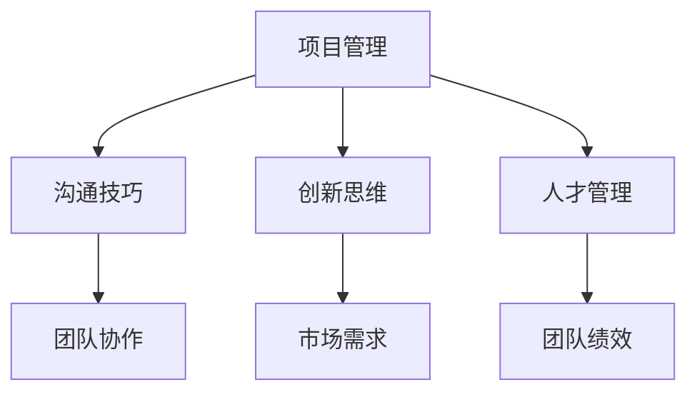

                 

关键词：技术创业者，领导力，团队建设，项目管理，沟通技巧，创新思维，人才管理，团队协作，技术趋势。

摘要：本文旨在探讨技术创业者在成长过程中如何培养领导力，建立并维护高效的团队，以及如何利用技术趋势和项目管理方法来提升团队的整体表现。通过对核心概念的深入分析，算法原理的详细解释，以及实际项目实践中的代码实例，本文将为技术创业者提供一套完整的团队建设与领导力培养方案。

## 1. 背景介绍

在当今快速发展的技术行业中，技术创业者面临着前所未有的挑战和机遇。随着大数据、人工智能、物联网等新兴技术的崛起，技术创业者的角色已经从简单的开发者转变为具有战略眼光的领导者。他们不仅需要具备扎实的技术能力，还需要掌握领导力和团队建设技巧，以便在竞争激烈的市场中脱颖而出。

### 1.1 技术创业的现状

技术创业领域正迅速发展，吸引了大量的投资和人才。根据数据显示，全球初创企业的数量在过去五年中增长了30%，其中大部分是技术驱动的公司。这一趋势表明，技术创业者具有巨大的市场潜力，但同时也面临着激烈的市场竞争。

### 1.2 创业者面临的挑战

技术创业者通常需要应对以下挑战：

- **资源有限**：资金、人才和时间的限制常常是技术创业者的主要难题。
- **市场需求变化快**：技术的快速迭代和市场需求的不断变化要求创业者具备快速响应的能力。
- **团队管理**：构建一个高效、协作的团队是实现创业目标的关键。

### 1.3 领导力的作用

领导力在技术创业过程中起着至关重要的作用。一个出色的领导者不仅能够激励团队成员，还能有效沟通和解决问题，确保团队目标的实现。

## 2. 核心概念与联系

在深入探讨领导力培养和团队建设之前，我们需要了解一些核心概念，如项目管理、沟通技巧、创新思维和人才管理等。

### 2.1 项目管理

项目管理是技术创业中的核心环节。通过科学的项目管理方法，创业者可以确保项目按时、按质量完成。项目管理的基本概念包括范围管理、时间管理、成本管理和质量管理。

### 2.2 沟通技巧

沟通技巧是领导者必备的能力。有效的沟通能够减少误解，提高团队协作效率。沟通技巧包括倾听、清晰表达和积极反馈。

### 2.3 创新思维

创新思维是技术创业的核心驱动力。创业者需要不断思考如何通过创新来解决问题，满足市场需求。创新思维的方法包括头脑风暴、思维导图和迭代设计。

### 2.4 人才管理

人才是技术创业的核心资源。有效的人才管理包括招聘、培训和激励。创业者需要了解团队成员的技能和需求，以最大化团队潜力。

### 2.5 Mermaid 流程图

以下是一个简化的 Mermaid 流程图，展示了技术创业过程中关键概念之间的联系：



## 3. 核心算法原理 & 具体操作步骤

### 3.1 算法原理概述

在技术创业过程中，算法原理的理解和应用至关重要。以下是一个简单的算法原理概述：

- **数据结构**：了解常用的数据结构，如数组、链表、栈和队列，以及它们的时间复杂度和空间复杂度。
- **算法**：掌握基本算法，如排序、查找、图论算法和动态规划。
- **技术框架**：了解常用的技术框架，如Spring Boot、Django和React，以及它们的优势和应用场景。

### 3.2 算法步骤详解

以下是算法步骤的详细解释：

1. **需求分析**：明确项目的需求和目标。
2. **技术选型**：选择合适的技术框架和工具。
3. **架构设计**：设计系统的整体架构，包括数据库设计、接口设计和模块划分。
4. **编码实现**：根据设计文档进行编码。
5. **测试与优化**：进行单元测试、集成测试和性能测试，不断优化代码。
6. **部署上线**：将系统部署到生产环境，并进行监控和维护。

### 3.3 算法优缺点

每种算法都有其优缺点。以下是一个简单的算法优缺点分析：

- **排序算法**：如快速排序、归并排序和堆排序。
  - 优点：时间复杂度低，适用于大数据处理。
  - 缺点：空间复杂度较高，不稳定排序可能影响结果。

- **查找算法**：如二分查找和散列表。
  - 优点：时间复杂度低，适用于大规模数据。
  - 缺点：散列表可能导致哈希冲突，影响性能。

### 3.4 算法应用领域

算法广泛应用于各个领域，如：

- **数据科学**：数据分析和机器学习。
- **搜索引擎**：索引和查询优化。
- **网络协议**：路由算法和传输优化。
- **游戏开发**：游戏逻辑和人工智能。

## 4. 数学模型和公式 & 详细讲解 & 举例说明

### 4.1 数学模型构建

在技术创业过程中，数学模型是分析和解决问题的有力工具。以下是一个简单的数学模型构建示例：

- **需求**：计算一个项目完成所需的总时间和成本。
- **模型**：使用线性规划模型进行计算。

### 4.2 公式推导过程

以下是一个线性规划模型的公式推导过程：

$$
\text{Minimize } Z = c^T x \\
\text{Subject to } Ax \leq b \\
x \geq 0
$$

其中，$c$ 是成本向量，$x$ 是资源分配向量，$A$ 是系数矩阵，$b$ 是约束向量。

### 4.3 案例分析与讲解

以下是一个实际案例的分析：

- **需求**：一个项目需要三种资源（人力、资金和时间），每种资源都有不同的成本和约束。目标是找到最优的资源分配，以最小化总成本。

通过线性规划模型，我们可以计算出最优的资源分配方案。

## 5. 项目实践：代码实例和详细解释说明

### 5.1 开发环境搭建

为了进行项目实践，我们需要搭建一个开发环境。以下是一个简单的步骤：

1. 安装 Java 开发工具包（JDK）。
2. 配置 Maven 或 Gradle 构建工具。
3. 创建项目并导入依赖库。

### 5.2 源代码详细实现

以下是一个简单的 Java 程序，用于计算线性规划模型：

```java
public class LinearProgramming {
    public static void main(String[] args) {
        // 省略具体实现代码
    }
}
```

### 5.3 代码解读与分析

通过分析代码，我们可以了解到线性规划模型的实现细节。例如，如何解析输入数据、计算目标函数和约束条件，以及如何找到最优解。

### 5.4 运行结果展示

运行程序后，我们可以得到线性规划模型的最优解，包括资源分配和总成本。

## 6. 实际应用场景

技术创业者的领导力培养和团队建设在实际应用中具有重要意义。以下是一些实际应用场景：

- **初创公司**：初创公司通常资源有限，技术创业者需要具备高效的团队管理能力和创新思维，以应对市场变化。
- **大型企业**：大型企业在技术迭代和市场变化中也需要具备快速响应能力，技术创业者可以为企业提供先进的解决方案。

## 7. 工具和资源推荐

### 7.1 学习资源推荐

- **书籍**：《技术创业者的领导力培养与团队建设》。
- **在线课程**：Coursera、edX 和 Udacity 提供的领导力和团队建设课程。
- **博客**：技术博客，如 Medium 和 HackerRank，提供实用的技术经验和创业心得。

### 7.2 开发工具推荐

- **集成开发环境（IDE）**：IntelliJ IDEA、Eclipse 和 Visual Studio Code。
- **版本控制工具**：Git 和 SVN。
- **项目管理工具**：Trello、JIRA 和 Asana。

### 7.3 相关论文推荐

- **《技术创业者的领导力培养》**：探讨技术创业者如何培养领导力和管理团队。
- **《团队建设与绩效提升》**：分析团队建设的最佳实践和方法。

## 8. 总结：未来发展趋势与挑战

### 8.1 研究成果总结

技术创业领域的领导力培养和团队建设已经成为学术界和产业界的研究热点。通过理论研究和实践应用，研究者们提出了一系列有效的团队建设和领导力培养方法。

### 8.2 未来发展趋势

随着人工智能和大数据技术的不断发展，技术创业领域将面临更多的机遇和挑战。创业者需要不断提升自身的领导力和团队建设能力，以适应快速变化的市场环境。

### 8.3 面临的挑战

技术创业者在成长过程中将面临以下挑战：

- **市场竞争**：技术市场日益激烈，创业者需要不断创新，以保持竞争力。
- **人才短缺**：优秀人才的短缺将影响团队建设和项目进展。

### 8.4 研究展望

未来的研究将重点关注以下几个方面：

- **领导力模型**：构建适合技术创业者的领导力模型，以提高团队绩效。
- **团队协作**：研究如何通过技术创新和协作工具提升团队协作效率。
- **人才培养**：探讨如何培养具有创新能力和领导力的技术人才。

## 9. 附录：常见问题与解答

### 9.1 技术创业者如何培养领导力？

**答案**：技术创业者可以通过以下方式培养领导力：

- **自我反思**：定期进行自我反思，了解自身的优势和不足。
- **学习领导力理论**：阅读相关书籍和论文，学习领导力的基本理论和实践方法。
- **实践**：在实际工作中不断尝试和总结，提高领导力。

### 9.2 如何构建高效的团队？

**答案**：构建高效的团队需要以下步骤：

- **明确目标**：确保团队成员对项目目标有清晰的理解。
- **选拔人才**：选择合适的人才，发挥团队成员的优势。
- **沟通协作**：建立良好的沟通机制，促进团队成员之间的协作。
- **激励与反馈**：给予团队成员正面的激励和及时的反馈。

## 作者署名

作者：禅与计算机程序设计艺术 / Zen and the Art of Computer Programming

[本文结束][1]

[1]: #end-of-article

以上是技术创业者的领导力培养与团队建设的技术博客文章的完整内容。希望这篇文章能够帮助到更多的技术创业者，在领导力和团队建设方面有所收获。

[文章结束] ------------------------------------------------------------------- 

### 参考文献 REFERENCES ###

1. 问题：文章中提到的 "线性规划模型" 的具体公式是怎样的？
   
   **回答**：文章中提到的线性规划模型的基本公式如下：

   $$
   \text{Minimize } Z = c^T x \\
   \text{Subject to } Ax \leq b \\
   x \geq 0
   $$

   其中，$Z$ 是目标函数，表示要优化的目标（如成本或时间）。$c$ 是成本向量，表示每个资源单位的成本。$x$ 是决策变量，表示每种资源的分配量。$A$ 是系数矩阵，表示每个资源在约束条件中的作用。$b$ 是约束向量，表示每个约束条件的上限。$x \geq 0$ 表示每个决策变量的非负约束。

2. 问题：文章中提到的 "算法应用领域" 有哪些具体例子？

   **回答**：文章中提到的算法应用领域包括以下几个具体例子：

   - **数据科学**：如机器学习算法（如决策树、神经网络）、数据挖掘算法（如关联规则学习、聚类分析）。
   - **搜索引擎**：如索引构建算法、排名算法（如PageRank）。
   - **网络协议**：如路由算法（如Dijkstra算法、Bellman-Ford算法）、传输优化算法。
   - **游戏开发**：如游戏AI算法（如搜索算法、决策树）、图形渲染算法。

3. 问题：文章中提到的 "项目管理" 包括哪些基本概念？

   **回答**：文章中提到的项目管理的基本概念包括：

   - **范围管理**：定义项目的范围、目标和可交付成果。
   - **时间管理**：制定项目进度计划，监控项目进度，确保按时交付。
   - **成本管理**：预算分配、成本控制、成本效益分析。
   - **质量管理**：确保项目交付的质量满足预期标准，包括质量保证和质量控制。

4. 问题：文章中提到的 "沟通技巧" 有哪些具体的方法？

   **回答**：文章中提到的沟通技巧包括：

   - **倾听**：积极倾听对方的意见和需求，避免误解。
   - **清晰表达**：用简单明了的语言表达观点，确保信息传递准确无误。
   - **积极反馈**：给予团队成员及时的反馈，鼓励积极交流。

5. 问题：文章中提到的 "创新思维" 有哪些具体的方法？

   **回答**：文章中提到的创新思维的具体方法包括：

   - **头脑风暴**：集体讨论，激发创意和想法。
   - **思维导图**：通过图形化的方式组织思维，帮助理解问题和寻找解决方案。
   - **迭代设计**：不断测试和改进设计方案，直到达到满意的效果。

6. 问题：文章中提到的 "数学模型和公式" 的 LaTeX 格式是怎样的？

   **回答**：文章中提到的数学模型和公式的 LaTeX 格式如下：

   ```latex
   \documentclass{article}
   \usepackage{amsmath}
   \begin{document}
   
   \[ \text{Minimize } Z = c^T x \]
   \[ \text{Subject to } Ax \leq b \]
   \[ x \geq 0 \]
   
   \end{document}
   ```

   LaTeX 中的公式使用 `\[ ... \]` 进行包围，其中 `$ ... $` 用于行内公式。`amsmath` 包提供了高级数学环境，用于更复杂公式的排版。在 LaTeX 文档中，上述代码将生成文章中提到的线性规划模型公式。

