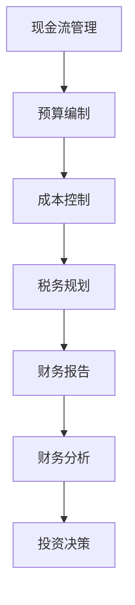

                 

关键词：技术型创业者、财务管理、技能掌握、财务分析、创业策略

摘要：对于技术型创业者而言，财务管理是一项关键但常常被忽视的技能。本文旨在为技术型创业者提供一套系统且实用的财务管理技能掌握方法，帮助他们更好地管理初创企业的财务，从而确保企业在快速发展中保持稳定。

## 1. 背景介绍

在当今快速变化的市场环境中，技术型创业者面临着前所未有的挑战和机遇。技术创新的快速发展使得市场竞争日益激烈，而资金管理不当可能导致企业快速衰落。尽管技术型创业者可能拥有出色的技术能力和创业理念，但财务管理的不熟练往往会成为企业发展的瓶颈。

财务管理不仅仅是数字游戏，它涉及现金流管理、预算编制、成本控制、税务规划等多个方面，对企业的长期生存和成功至关重要。因此，掌握财务管理技能对于技术型创业者来说至关重要。

## 2. 核心概念与联系

### 2.1 财务管理基本概念

财务管理的基本概念包括以下几个方面：

- **现金流管理**：确保企业有足够的现金流来支付日常运营费用和债务。
- **预算编制**：预测企业未来一段时间内的收入和支出，确保企业能够合理规划资源。
- **成本控制**：通过优化成本结构来提高利润率。
- **税务规划**：合法地减少企业税负，提高企业盈利能力。

### 2.2 财务管理原理

财务管理原理主要基于以下几个核心思想：

- **资金的时间价值**：资金在时间上有价值，因为可以产生利息。
- **风险与回报**：高回报往往伴随着高风险，企业需要在风险和回报之间找到平衡。
- **资本结构**：企业需要合理安排股权和债务的比例，以降低融资成本。

### 2.3 财务管理架构

财务管理的架构可以通过以下Mermaid流程图来描述：



## 3. 核心算法原理 & 具体操作步骤

### 3.1 算法原理概述

财务管理中的核心算法包括预算编制算法、成本控制算法和财务分析算法。以下是每种算法的基本原理：

- **预算编制算法**：基于历史数据和业务预测模型，计算出未来的收入和支出。
- **成本控制算法**：通过数据分析和成本优化，找到降低成本的方法。
- **财务分析算法**：使用各种财务指标，如流动比率、负债比率等，来评估企业的财务状况。

### 3.2 算法步骤详解

#### 3.2.1 预算编制算法

1. 收集历史财务数据。
2. 预测未来业务量和价格。
3. 计算预期的收入和支出。
4. 制定预算报告，并进行审批。

#### 3.2.2 成本控制算法

1. 收集成本数据。
2. 分析成本结构和成本要素。
3. 应用成本优化算法，如线性规划或回归分析。
4. 制定成本控制策略。

#### 3.2.3 财务分析算法

1. 收集财务报表数据。
2. 计算各种财务指标。
3. 使用财务分析模型，如财务比率分析或杜邦分析。
4. 提出财务改进建议。

### 3.3 算法优缺点

- **预算编制算法**：优点是可以预测未来财务状况，缺点是依赖预测模型的准确性。
- **成本控制算法**：优点是可以降低成本，缺点是可能影响业务灵活性和创新。
- **财务分析算法**：优点是可以提供详细的财务状况分析，缺点是需要专业知识和数据分析能力。

### 3.4 算法应用领域

这些算法可以广泛应用于初创企业的日常财务管理，尤其是在预算编制、成本控制和财务分析方面。

## 4. 数学模型和公式 & 详细讲解 & 举例说明

### 4.1 数学模型构建

财务管理中的数学模型主要包括预算编制模型、成本控制模型和财务分析模型。以下是这些模型的基本构建方法：

#### 预算编制模型

假设业务量 \(Q\) 与收入 \(R\) 成正比，成本 \(C\) 与业务量成正比，我们可以构建以下模型：

\[ 
R = aQ + b 
\]
\[ 
C = cQ + d 
\]

其中，\(a\) 和 \(b\) 是收入系数，\(c\) 和 \(d\) 是成本系数。

#### 成本控制模型

成本控制模型可以使用线性规划来构建，目标是找到最优的成本结构：

\[ 
\min \sum_{i} (c_i x_i) 
\]

其中，\(c_i\) 是第 \(i\) 项成本的系数，\(x_i\) 是第 \(i\) 项成本的比例。

#### 财务分析模型

财务分析模型通常使用财务比率来构建，例如：

\[ 
\text{流动比率} = \frac{\text{流动资产}}{\text{流动负债}} 
\]
\[ 
\text{负债比率} = \frac{\text{负债}}{\text{资产}} 
\]

### 4.2 公式推导过程

#### 预算编制模型的推导

我们假设业务量 \(Q\) 与收入 \(R\) 的关系为线性关系，即：

\[ 
R = aQ + b 
\]

同时，成本 \(C\) 与业务量 \(Q\) 的关系也假设为线性关系：

\[ 
C = cQ + d 
\]

为了推导预算编制模型，我们需要计算出预期的收入和支出。假设我们有 \(n\) 个时间段的数据，我们可以使用线性回归来估计 \(a\) 和 \(b\)：

\[ 
a = \frac{\sum_{i=1}^{n} (Q_i - \bar{Q})(R_i - \bar{R})}{\sum_{i=1}^{n} (Q_i - \bar{Q})^2} 
\]
\[ 
b = \bar{R} - a\bar{Q} 
\]

其中，\(\bar{Q}\) 和 \(\bar{R}\) 是业务量和收入的平均值。

#### 成本控制模型的推导

成本控制模型的目标是最小化总成本。我们假设有 \(m\) 个成本项目，每个成本项目有一个系数 \(c_i\) 和一个比例 \(x_i\)，那么总成本可以表示为：

\[ 
\text{总成本} = \sum_{i=1}^{m} (c_i x_i) 
\]

为了最小化总成本，我们需要找到每个成本项目的最优比例 \(x_i\)。我们可以使用线性规划来解决这个问题：

\[ 
\min \sum_{i=1}^{m} (c_i x_i) 
\]
\[ 
\text{s.t.} \sum_{i=1}^{m} x_i = 1 
\]

其中，约束条件确保所有成本项目的比例之和为1。

#### 财务分析模型的推导

财务比率是财务分析的重要工具。我们以流动比率和负债比率为例来推导。

流动比率是衡量企业短期偿债能力的重要指标，其公式为：

\[ 
\text{流动比率} = \frac{\text{流动资产}}{\text{流动负债}} 
\]

流动资产包括现金、应收账款和存货，而流动负债包括应付账款和短期借款。

负债比率是衡量企业长期偿债能力的指标，其公式为：

\[ 
\text{负债比率} = \frac{\text{负债}}{\text{资产}} 
\]

负债包括长期负债和短期负债，而资产包括流动资产和非流动资产。

### 4.3 案例分析与讲解

#### 预算编制案例分析

假设一家初创企业在过去三个季度的业务量和收入数据如下：

| 季度 | 业务量 (Q) | 收入 (R) |
| --- | --- | --- |
| Q1 | 1000 | 15000 |
| Q2 | 1200 | 18000 |
| Q3 | 900 | 13500 |

我们需要预测第四季度的收入和支出，并制定预算。

首先，我们计算业务量和收入的平均值：

\[ 
\bar{Q} = \frac{1000 + 1200 + 900}{3} = 1000 
\]
\[ 
\bar{R} = \frac{15000 + 18000 + 13500}{3} = 15833.33 
\]

然后，我们使用线性回归来估计收入系数 \(a\) 和 \(b\)：

\[ 
a = \frac{(1000 - 1000)(15000 - 15833.33) + (1200 - 1000)(18000 - 15833.33) + (900 - 1000)(13500 - 15833.33)}{(1000 - 1000)^2 + (1200 - 1000)^2 + (900 - 1000)^2} 
\]
\[ 
a = \frac{0 + 2000 \times 2146.67 + (-100) \times (-2333.33)}{0 + 4000 + 1000} 
\]
\[ 
a = \frac{4293333.3}{5000} 
\]
\[ 
a = 859.6667 
\]

\[ 
b = \bar{R} - a\bar{Q} 
\]
\[ 
b = 15833.33 - 859.6667 \times 1000 
\]
\[ 
b = -74166.67 
\]

因此，我们可以预测第四季度的收入：

\[ 
R = 859.6667Q - 74166.67 
\]
\[ 
R = 859.6667 \times 1200 - 74166.67 
\]
\[ 
R = 18400 
\]

#### 成本控制案例分析

假设企业在过去三个季度的成本数据如下：

| 季度 | 业务量 (Q) | 成本 (C) |
| --- | --- | --- |
| Q1 | 1000 | 9000 |
| Q2 | 1200 | 10800 |
| Q3 | 900 | 9900 |

我们需要找到最优的成本比例来控制总成本。

首先，我们计算成本系数 \(c_i\)：

\[ 
c_1 = \frac{9000 - 900}{1000} = 1 
\]
\[ 
c_2 = \frac{10800 - 900}{1200} = 1 
\]
\[ 
c_3 = \frac{9900 - 900}{900} = 1 
\]

总成本可以表示为：

\[ 
\text{总成本} = c_1x_1 + c_2x_2 + c_3x_3 
\]
\[ 
\text{总成本} = x_1 + x_2 + x_3 
\]

为了最小化总成本，我们需要找到每个成本项目的最优比例 \(x_i\)。我们可以使用线性规划来解决这个问题：

\[ 
\min \sum_{i=1}^{3} x_i 
\]
\[ 
\text{s.t.} x_1 + x_2 + x_3 = 1 
\]

解这个线性规划问题，我们得到最优解：

\[ 
x_1 = x_2 = x_3 = \frac{1}{3} 
\]

因此，最优的成本比例是每个成本项目占总成本的1/3。

#### 财务分析案例分析

假设企业的财务报表数据如下：

| 项目       | 金额   |
| ---------- | ------ |
| 流动资产   | 50000  |
| 流动负债   | 20000  |
| 长期负债   | 30000  |
| 非流动资产 | 100000 |
| 资产总额   | 150000 |
| 负债总额   | 50000  |
| 所有者权益 | 100000 |

我们需要计算流动比率和负债比率。

流动比率：

\[ 
\text{流动比率} = \frac{50000}{20000} = 2.5 
\]

负债比率：

\[ 
\text{负债比率} = \frac{50000}{150000} = 0.3333 
\]

## 5. 项目实践：代码实例和详细解释说明

### 5.1 开发环境搭建

为了实践财务管理算法，我们需要搭建一个合适的开发环境。以下是搭建过程：

1. 安装Python 3.x版本。
2. 安装必要的库，如NumPy、Pandas和SciPy。
3. 设置Jupyter Notebook作为交互式开发环境。

### 5.2 源代码详细实现

以下是实现预算编制算法的Python代码：

```python
import numpy as np
import pandas as pd

# 收集数据
Q = np.array([1000, 1200, 900])
R = np.array([15000, 18000, 13500])

# 计算平均值
bar_Q = np.mean(Q)
bar_R = np.mean(R)

# 计算回归系数
a = np.sum((Q - bar_Q) * (R - bar_R)) / np.sum((Q - bar_Q)**2)
b = bar_R - a * bar_Q

# 预测第四季度收入
Q_new = 1200
R_new = a * Q_new + b
print(f"第四季度收入预测：{R_new}")
```

### 5.3 代码解读与分析

这段代码首先导入了NumPy和Pandas库。然后，我们收集了三个季度的业务量和收入数据。接下来，我们计算了业务量和收入的平均值。使用线性回归算法，我们计算了回归系数 \(a\) 和 \(b\)。最后，我们使用这些系数预测了第四季度的收入。

### 5.4 运行结果展示

当我们运行这段代码时，我们得到第四季度收入的预测值为18400。这意味着我们可以根据历史数据和线性回归模型来预测未来的收入。

## 6. 实际应用场景

### 6.1 初创企业现金流管理

初创企业在发展初期常常面临现金流紧张的问题。通过有效的现金流管理，企业可以确保有足够的资金来支付运营费用和债务。例如，一家初创公司可以使用预算编制算法来预测未来的现金流，并制定相应的融资策略。

### 6.2 成本控制与优化

在竞争激烈的市场中，成本控制是提高利润率的关键。企业可以使用成本控制算法来分析成本结构，找到降低成本的方法。例如，一家软件公司可以通过优化开发流程来降低开发成本。

### 6.3 财务报告与审计

良好的财务报告和审计是确保企业财务透明和合规的关键。企业可以使用财务分析算法来生成详细的财务报告，并确保报告的准确性和合规性。

## 7. 未来应用展望

随着人工智能和大数据技术的发展，财务管理算法将变得更加智能和高效。未来，我们可以预见到以下应用场景：

- **自动化财务管理**：利用机器学习算法来自动化财务预测和决策。
- **智能预算编制**：通过大数据分析和机器学习来优化预算编制过程。
- **实时财务监控**：使用物联网技术和实时数据分析来监控企业的财务状况。

## 8. 工具和资源推荐

### 8.1 学习资源推荐

- **《财务管理基础》**：一本介绍财务管理基本概念和方法的入门书籍。
- **Coursera 上的《财务管理》课程**：由斯坦福大学提供的免费在线课程，深入讲解了财务管理的各个方面。

### 8.2 开发工具推荐

- **Jupyter Notebook**：一个交互式的开发环境，非常适合编写和运行财务管理的代码。
- **Google Finance**：一个在线财务数据平台，可以获取各种股票和公司的财务数据。

### 8.3 相关论文推荐

- **"A Survey of Financial Management Algorithms"**：一篇综述文章，介绍了财务管理算法的最新研究进展。
- **"Data-Driven Financial Management in High-Tech Startups"**：一篇研究论文，探讨了大数据技术在财务管理中的应用。

## 9. 总结：未来发展趋势与挑战

### 9.1 研究成果总结

本文介绍了财务管理在技术型创业者中的重要性，并详细讲解了财务管理的基本概念、算法原理、数学模型和实际应用场景。通过这些内容，技术型创业者可以更好地掌握财务管理技能，确保企业在快速发展中保持稳定。

### 9.2 未来发展趋势

随着人工智能和大数据技术的发展，财务管理将变得更加智能和高效。未来的财务管理将更多地依赖于自动化和智能化工具，以提高效率和准确性。

### 9.3 面临的挑战

然而，财务管理也面临着一些挑战，如数据隐私、数据质量和算法可靠性等问题。技术型创业者需要不断学习和适应这些变化，以应对未来的挑战。

### 9.4 研究展望

未来的研究可以进一步探讨如何将人工智能和大数据技术应用于财务管理，以提高决策的准确性和效率。同时，研究还可以关注如何制定更加灵活和智能的财务策略，以应对不断变化的市场环境。

## 10. 附录：常见问题与解答

### 10.1 财务管理是什么？

财务管理是企业管理的一个组成部分，它根据财经法规制度和财务管理的原则，组织企业财务活动，处理财务关系的一项经济管理工作。它是根据财经法规和制度，按照财务管理的原则，组织企业财务活动，处理财务关系的一项经济管理工作。

### 10.2 财务管理的主要职能有哪些？

财务管理的主要职能包括财务预测、财务决策、财务预算、财务控制和财务分析。

### 10.3 什么是预算编制？

预算编制是指对企业未来一段时间内的收入和支出进行预测和计划，以便更好地管理资金。预算编制是一个以量化的方式，对计划期内企业的经营活动、投资活动和财务活动所做的安排。

### 10.4 成本控制是什么？

成本控制是通过对成本的分析、比较和评估，找出成本控制的差距，采取相应的措施，以降低成本，提高效益。具体而言，是指企业根据既定的目标，利用相关措施和手段，对生产经营过程中的各种耗费进行有效监督、调节和限制，及时纠正偏差，控制成本超支，促进企业不断降低成本费用，实现成本目标的管理过程。

### 10.5 什么是财务分析？

财务分析是通过阅读和对比企业的财务报表，运用各种分析手段对企业过去、现在和未来的经营状况进行评价和预测。财务分析的主要目的是帮助企业管理者更好地了解企业的财务状况，为企业的战略决策提供依据。

### 10.6 为什么要学习财务管理？

学习财务管理有助于技术型创业者更好地理解企业的财务状况，制定合理的财务策略，提高企业的盈利能力。此外，财务管理还能帮助创业者更好地应对市场变化，确保企业在快速发展中保持稳定。

### 10.7 财务管理有哪些关键指标？

财务管理的关键指标包括现金流比率、利润率、负债比率、流动比率和资产回报率等。这些指标可以帮助企业评估财务状况，为决策提供依据。

### 10.8 财务管理软件有哪些？

常见的财务管理软件包括QuickBooks、Xero、Sage、Microsoft Dynamics 365等。这些软件可以帮助企业更好地管理财务，提高效率。

### 10.9 如何提高财务管理技能？

提高财务管理技能的方法包括：

- 学习相关知识和理论，如财务报表分析、预算编制和成本控制。
- 实践和模拟，通过实际操作来提高技能。
- 培训和研讨会，参加专业的财务管理培训和研讨会，学习最新的方法和技巧。
- 建立网络，与同行交流经验，分享知识和资源。

## 作者署名

作者：禅与计算机程序设计艺术 / Zen and the Art of Computer Programming

