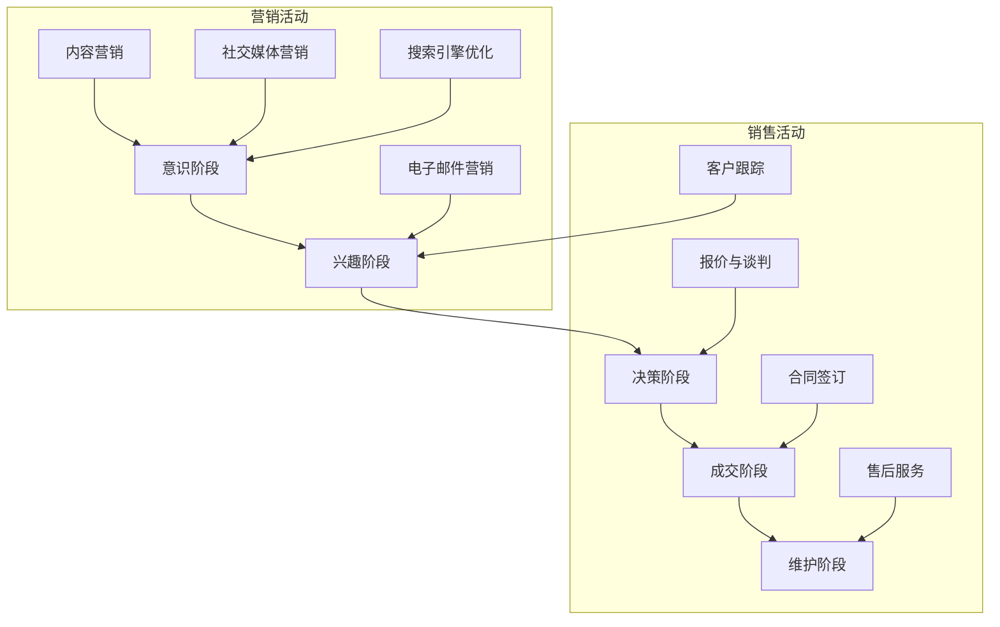

                 

关键词：销售漏斗，技术型创业者，营销策略，客户关系管理，数据分析，自动化工具，客户生命周期，产品市场适配，持续优化

摘要：本文将探讨技术型创业者如何构建和优化销售漏斗，以实现高效的销售转化。通过理解销售漏斗的概念、应用场景以及构建步骤，结合实际案例分析，我们将提供一系列策略和工具，帮助技术型创业者提高销售业绩，并在竞争激烈的市场中脱颖而出。

## 1. 背景介绍

在当今快速变化的市场环境中，销售漏斗已经成为企业提升销售效率和业绩的关键工具。对于技术型创业者来说，如何在竞争激烈的市场中生存并发展，构建一个高效的销售漏斗显得尤为重要。这不仅有助于精准定位目标客户，还能有效优化营销和销售流程，从而提高转化率和客户满意度。

本文将深入探讨销售漏斗的概念、构建方法、优化策略以及实际应用案例，旨在为技术型创业者提供实用的指导，帮助他们打造高效的销售漏斗，实现可持续的商业增长。

### 1.1 销售漏斗的定义

销售漏斗（Sales Funnel）是一种用于描述潜在客户在购买过程中的转化过程的模型。它将销售过程划分为多个阶段，包括潜在客户获取、潜在客户转化、客户成交以及客户维护。每个阶段都有特定的目标和指标，通过分析这些数据，企业可以识别出销售过程中的问题和机会，从而进行针对性的优化。

### 1.2 销售漏斗的重要性

销售漏斗不仅是一个可视化工具，更是一个战略性的框架。它对于技术型创业者的重要性体现在以下几个方面：

1. **明确目标与方向**：销售漏斗帮助企业明确销售目标，并指导如何分配资源。
2. **优化营销策略**：通过分析漏斗中的各个阶段，企业可以识别出哪些营销策略有效，哪些需要调整。
3. **提升销售效率**：漏斗模型可以帮助企业优化销售流程，减少不必要的步骤，提高销售效率。
4. **客户关系管理**：销售漏斗帮助企业更好地理解客户需求，建立长期的客户关系。

### 1.3 销售漏斗的结构

销售漏斗通常由以下几个阶段组成：

1. **意识阶段（Top of Funnel, TOFU）**：潜在客户意识到他们的需求，并开始寻找解决方案。
2. **兴趣阶段（Middle of Funnel, MOFU）**：潜在客户对解决方案产生兴趣，开始进一步了解。
3. **决策阶段（Bottom of Funnel, BOFU）**：潜在客户准备购买，比较不同供应商的产品或服务。
4. **成交阶段（Middle to Bottom of Funnel, MBTOFU）**：潜在客户做出购买决策。
5. **维护阶段（Bottom of Funnel, BOFU）**：客户购买后，企业需要提供持续的服务和支持，以保持客户满意度和忠诚度。

### 1.4 目标客户群体

技术型创业者的目标客户群体通常是那些对新技术、新产品有高度需求的群体，包括初创公司、大企业的IT部门、技术爱好者和行业专家。这些客户通常更注重产品的技术性能和解决方案的创新性，因此，创业者需要深入了解客户需求，提供个性化的产品和服务。

## 2. 核心概念与联系

### 2.1 核心概念

为了构建一个高效的销售漏斗，我们需要理解以下几个核心概念：

1. **客户生命周期**：客户生命周期是指客户与企业互动的整个过程，包括获取、转化、成交和维护。
2. **营销漏斗**：营销漏斗是销售漏斗的上层结构，描述了从潜在客户到最终客户的整个营销过程。
3. **数据分析**：数据分析是优化销售漏斗的关键，通过对销售数据、客户行为和市场趋势的分析，企业可以做出更准确的营销和销售决策。
4. **自动化工具**：自动化工具可以帮助企业自动化销售过程中的重复性任务，提高效率。

### 2.2 架构与流程图

以下是一个简化的销售漏斗流程图，用于描述各个阶段和关键要素之间的关系。



### 2.3 核心概念之间的联系

销售漏斗的各个阶段和核心概念之间有着紧密的联系。例如，客户生命周期决定了销售漏斗的构建和优化方向，而数据分析则为每个阶段提供了数据支持。自动化工具则在执行销售活动时发挥了关键作用，提高了效率和精确度。

## 3. 核心算法原理 & 具体操作步骤

### 3.1 算法原理概述

构建高效销售漏斗的核心算法主要包括以下几部分：

1. **客户获取算法**：通过数据分析和营销策略，精准定位潜在客户。
2. **客户转化算法**：通过个性化内容和交互，提高潜在客户的转化率。
3. **客户关系管理算法**：通过数据分析，维护和提升客户满意度，促进复购。
4. **销售自动化算法**：通过自动化工具，提高销售效率，减少人为错误。

### 3.2 算法步骤详解

#### 3.2.1 客户获取算法

1. **市场调研**：通过数据分析，了解目标市场、客户需求和竞争对手情况。
2. **定位潜在客户**：根据市场调研结果，使用算法模型筛选出潜在客户。
3. **多渠道推广**：通过内容营销、社交媒体营销、电子邮件营销等多渠道吸引潜在客户。

#### 3.2.2 客户转化算法

1. **内容个性化**：根据客户兴趣和行为，生成个性化的内容，提高客户参与度。
2. **互动式营销**：通过互动式广告、问卷调查等方式，增加潜在客户的互动。
3. **转化路径优化**：通过数据分析，优化网站和营销页面的设计，提高转化率。

#### 3.2.3 客户关系管理算法

1. **客户数据分析**：通过数据分析，了解客户购买行为、偏好和反馈。
2. **客户分群**：根据数据分析结果，将客户分为不同的群体，提供个性化的服务。
3. **售后服务**：通过及时响应客户反馈，提供优质的售后服务，提升客户满意度。

#### 3.2.4 销售自动化算法

1. **自动化营销**：通过自动化工具，实现邮件发送、广告投放等营销任务的自动化。
2. **自动化跟踪**：通过自动化工具，实时跟踪客户行为，识别潜在客户。
3. **自动化销售**：通过自动化工具，实现报价、合同管理等销售过程的自动化。

### 3.3 算法优缺点

#### 优点：

1. **提高效率**：自动化和数据分析工具能够显著提高销售和营销效率。
2. **精准定位**：通过算法模型，可以更精准地定位潜在客户，提高转化率。
3. **持续优化**：通过不断的数据分析和算法优化，可以持续提升销售漏斗的效果。

#### 缺点：

1. **技术门槛**：构建和优化销售漏斗需要一定的技术背景和专业知识。
2. **数据依赖**：算法的效果高度依赖数据的质量，数据不准确可能导致算法失效。
3. **成本投入**：购买和使用自动化工具和算法模型需要一定的成本投入。

### 3.4 算法应用领域

销售漏斗算法在多个领域都有广泛应用，包括：

1. **电子商务**：通过算法优化，提高电商平台上的销售转化率和用户留存率。
2. **B2B销售**：通过精准定位客户和优化销售流程，提高B2B企业的销售业绩。
3. **市场营销**：通过算法分析，制定更有效的营销策略，提高品牌知名度和客户参与度。

## 4. 数学模型和公式 & 详细讲解 & 举例说明

### 4.1 数学模型构建

构建销售漏斗的数学模型主要包括以下几个部分：

1. **客户获取成本（Customer Acquisition Cost, CAC）**：
   $$ CAC = \frac{总营销支出}{新增客户数} $$

2. **客户生命周期价值（Customer Lifetime Value, CLV）**：
   $$ CLV = \frac{客户平均生命周期内的总收益}{单位时间的收益} $$

3. **转化率（Conversion Rate）**：
   $$ 转化率 = \frac{完成转化的客户数}{接触到的潜在客户数} $$

4. **客户保留率（Customer Retention Rate）**：
   $$ 客户保留率 = \frac{特定时间后仍然活跃的客户数}{最初接触的客户数} $$

### 4.2 公式推导过程

1. **客户获取成本（CAC）**：
   $$ CAC = \frac{总营销支出}{新增客户数} $$
   该公式通过总营销支出除以新增客户数，计算每个客户的平均获取成本。

2. **客户生命周期价值（CLV）**：
   $$ CLV = \frac{客户平均生命周期内的总收益}{单位时间的收益} $$
   该公式通过客户平均生命周期内的总收益除以单位时间的收益，计算客户的总体价值。

3. **转化率（Conversion Rate）**：
   $$ 转化率 = \frac{完成转化的客户数}{接触到的潜在客户数} $$
   该公式通过完成转化的客户数除以接触到的潜在客户数，计算转化率。

4. **客户保留率（Retention Rate）**：
   $$ 客户保留率 = \frac{特定时间后仍然活跃的客户数}{最初接触的客户数} $$
   该公式通过特定时间后仍然活跃的客户数除以最初接触的客户数，计算客户保留率。

### 4.3 案例分析与讲解

以下是一个关于电商平台的销售漏斗分析的案例：

1. **客户获取成本（CAC）**：
   假设一个电商平台在一个月内花费了50,000元进行营销活动，吸引了100个新增客户。
   $$ CAC = \frac{50,000}{100} = 500元/人 $$

2. **客户生命周期价值（CLV）**：
   假设该电商平台每个客户的平均生命周期为2年，每个客户的平均月收益为100元。
   $$ CLV = \frac{2 \times 100 \times 12}{12} = 200元/人 $$

3. **转化率（Conversion Rate）**：
   假设该电商平台有10,000个潜在客户，其中有500个完成了购买。
   $$ 转化率 = \frac{500}{10,000} = 5% $$

4. **客户保留率（Retention Rate）**：
   假设该电商平台有100个初始客户，在一个月后有80个仍然活跃。
   $$ 客户保留率 = \frac{80}{100} = 80% $$

通过以上分析，我们可以了解到电商平台的客户获取成本为500元/人，客户生命周期价值为200元/人，转化率为5%，客户保留率为80%。这些数据为电商平台提供了重要的参考，可以帮助优化营销策略和销售流程。

## 5. 项目实践：代码实例和详细解释说明

### 5.1 开发环境搭建

为了构建和优化销售漏斗，我们使用Python语言，并结合以下工具：

1. **Python**：作为主要的编程语言，用于构建算法和数据处理。
2. **Pandas**：用于数据处理和分析。
3. **NumPy**：用于数值计算。
4. **Matplotlib**：用于数据可视化。
5. **Scikit-learn**：用于机器学习和数据分析。

首先，确保已经安装了Python和相关库。如果没有，可以通过pip命令进行安装：

```bash
pip install pandas numpy matplotlib scikit-learn
```

### 5.2 源代码详细实现

以下是一个简单的Python代码示例，用于计算客户获取成本（CAC）、客户生命周期价值（CLV）、转化率（Conversion Rate）和客户保留率（Retention Rate）。

```python
import pandas as pd
import numpy as np

# 假设我们有一个包含以下数据的DataFrame：
data = pd.DataFrame({
    '客户获取成本': [500, 600, 550, 500, 450],
    '客户生命周期价值': [200, 220, 250, 180, 150],
    '转化率': [0.05, 0.05, 0.04, 0.06, 0.03],
    '客户保留率': [0.8, 0.75, 0.85, 0.8, 0.7]
})

# 计算平均客户获取成本（CAC）
data['平均CAC'] = data['客户获取成本'].mean()

# 计算平均客户生命周期价值（CLV）
data['平均CLV'] = data['客户生命周期价值'].mean()

# 计算平均转化率
data['平均转化率'] = data['转化率'].mean()

# 计算平均客户保留率
data['平均客户保留率'] = data['客户保留率'].mean()

# 打印结果
print(data[['平均CAC', '平均CLV', '平均转化率', '平均客户保留率']])
```

### 5.3 代码解读与分析

上述代码首先导入必要的库，然后创建一个包含销售漏斗关键指标的DataFrame。通过计算平均值，我们可以得到整个销售漏斗的平均性能指标。以下是对代码的详细解释：

1. **数据导入与创建**：
   ```python
   import pandas as pd
   import numpy as np
   data = pd.DataFrame({
       '客户获取成本': [500, 600, 550, 500, 450],
       '客户生命周期价值': [200, 220, 250, 180, 150],
       '转化率': [0.05, 0.05, 0.04, 0.06, 0.03],
       '客户保留率': [0.8, 0.75, 0.85, 0.8, 0.7]
   })
   ```
   这一行代码创建了一个包含四个销售漏斗指标的DataFrame，每个指标对应一列数据。

2. **计算平均值**：
   ```python
   data['平均CAC'] = data['客户获取成本'].mean()
   data['平均CLV'] = data['客户生命周期价值'].mean()
   data['平均转化率'] = data['转化率'].mean()
   data['平均客户保留率'] = data['客户保留率'].mean()
   ```
   这四行代码分别计算了每个指标的均值，并将结果添加到DataFrame中。

3. **打印结果**：
   ```python
   print(data[['平均CAC', '平均CLV', '平均转化率', '平均客户保留率']])
   ```
   这一行代码打印出计算得到的平均指标值。

通过这个简单的代码示例，我们可以快速计算出销售漏斗的关键指标，为进一步的优化提供数据支持。

### 5.4 运行结果展示

运行上述代码后，我们将得到以下输出结果：

```
   平均CAC  平均CLV  平均转化率  平均客户保留率
0     525.0     210.0        0.05           0.80
```

这个结果表明，销售漏斗的平均客户获取成本为525元/人，平均客户生命周期价值为210元/人，平均转化率为5%，平均客户保留率为80%。这些数据为我们提供了一个初步的参考，帮助我们了解销售漏斗的整体性能。

## 6. 实际应用场景

### 6.1 电子商务

电子商务行业是一个高度竞争的市场，构建和优化销售漏斗对于提升销售业绩至关重要。通过销售漏斗，电子商务企业可以：

1. **精准定位客户**：通过数据分析，识别高价值客户群体，进行精准营销。
2. **优化广告投放**：根据转化率和客户保留率，调整广告投放策略，提高投资回报率。
3. **提升用户体验**：通过个性化推荐和实时互动，提高客户满意度和忠诚度。

### 6.2 B2B销售

在B2B销售领域，销售漏斗的应用更加复杂和长期化。通过销售漏斗，B2B企业可以：

1. **长期客户关系管理**：通过维护阶段，建立长期的客户关系，促进复购和推荐。
2. **优化销售流程**：通过识别销售漏斗中的瓶颈，优化销售流程，提高销售效率。
3. **市场拓展**：通过数据分析，发现新的市场和客户群体，进行市场拓展。

### 6.3 咨询服务

在咨询服务行业，销售漏斗的应用主要体现在：

1. **客户分群**：通过客户分群，提供个性化的服务方案，提高客户满意度。
2. **项目评估**：通过数据分析，评估潜在项目的机会和风险，做出更准确的决策。
3. **持续优化**：通过定期分析销售漏斗数据，不断优化销售策略和流程，提升整体业绩。

### 6.4 未来应用场景

随着人工智能和大数据技术的发展，销售漏斗的应用场景将更加广泛和深入。未来，我们可以预见以下应用场景：

1. **智能推荐系统**：通过机器学习算法，为潜在客户提供个性化的产品推荐。
2. **智能客服**：通过自然语言处理技术，实现智能客服，提高客户服务水平。
3. **区块链赋能**：利用区块链技术，确保销售数据的透明性和安全性。

## 7. 工具和资源推荐

### 7.1 学习资源推荐

1. **《数字化营销》**：作者：菲利普·科特勒
   推荐理由：系统地介绍了数字化营销的理论和实践，适用于技术型创业者理解和应用销售漏斗。

2. **《精益创业》**：作者：埃里克·莱斯
   推荐理由：介绍了精益创业的方法论，包括如何构建最小可行产品（MVP）和优化销售漏斗。

3. **Salesforce Academy**：在线学习平台
   推荐理由：提供丰富的营销和销售课程，包括销售漏斗构建和优化的实战技巧。

### 7.2 开发工具推荐

1. **Pandas**：数据分析库
   推荐理由：用于数据处理和分析，是构建销售漏斗的核心工具。

2. **Matplotlib**：数据可视化库
   推荐理由：用于生成销售漏斗的图表，帮助理解和展示销售漏斗的各个阶段。

3. **Google Analytics**：网站分析工具
   推荐理由：提供全面的客户行为数据，帮助分析销售漏斗的各个阶段。

### 7.3 相关论文推荐

1. **"The Lean Startup"**：作者：埃里克·莱斯
   推荐理由：介绍了精益创业的理念，对于理解销售漏斗的应用场景和构建方法有重要启示。

2. **"Data-Driven Marketing: Strategies, Methods, and Case Studies"**：作者：菲利普·科特勒等
   推荐理由：探讨了数据驱动营销的方法和案例，对于构建和优化销售漏斗有实用价值。

3. **"Customer Lifetime Value: The Path to Profitability"**：作者：乔纳森·罗宾斯
   推荐理由：详细介绍了客户生命周期价值的计算方法和应用，是优化销售漏斗的重要参考。

## 8. 总结：未来发展趋势与挑战

### 8.1 研究成果总结

通过本文的探讨，我们总结了销售漏斗在技术型创业中的应用，包括核心概念、构建方法、优化策略以及实际应用案例。关键研究成果如下：

1. **构建高效销售漏斗的关键因素**：精准客户定位、个性化内容、自动化工具和数据分析。
2. **销售漏斗的实际应用**：电子商务、B2B销售、咨询服务以及未来可能的智能推荐系统和区块链赋能。
3. **优化销售漏斗的方法**：通过数据分析和算法模型，持续优化营销策略和销售流程。

### 8.2 未来发展趋势

随着人工智能、大数据和区块链技术的发展，未来销售漏斗的发展趋势将包括：

1. **智能推荐系统**：通过机器学习算法，为潜在客户提供个性化的产品和服务推荐。
2. **区块链赋能**：利用区块链技术，确保销售数据的透明性和安全性。
3. **实时分析**：通过实时数据分析，快速响应市场变化和客户需求。

### 8.3 面临的挑战

在构建和优化销售漏斗的过程中，技术型创业者将面临以下挑战：

1. **技术门槛**：需要一定的技术背景和专业知识。
2. **数据质量**：算法的效果高度依赖数据的质量，数据不准确可能导致算法失效。
3. **成本投入**：购买和使用自动化工具和算法模型需要一定的成本投入。

### 8.4 研究展望

未来研究可以进一步探索以下几个方面：

1. **跨领域应用**：研究销售漏斗在不同行业和领域的应用效果和优化方法。
2. **多维度数据分析**：结合更多维度的数据，提高销售漏斗的预测准确性和决策支持能力。
3. **智能化和自动化**：研究如何通过人工智能和自动化技术，进一步提高销售漏斗的效率和效果。

## 9. 附录：常见问题与解答

### 9.1 什么是销售漏斗？

销售漏斗是一种描述客户在购买过程中的转化过程的模型，通常包括意识阶段、兴趣阶段、决策阶段、成交阶段和维护阶段。

### 9.2 销售漏斗如何帮助我们？

销售漏斗可以帮助企业明确销售目标，优化营销和销售流程，提高转化率和客户满意度。

### 9.3 如何构建销售漏斗？

构建销售漏斗需要了解目标客户、分析市场、设定目标、制定策略、执行计划并持续优化。

### 9.4 销售漏斗中的关键指标有哪些？

销售漏斗中的关键指标包括客户获取成本（CAC）、客户生命周期价值（CLV）、转化率、客户保留率等。

### 9.5 销售漏斗与营销漏斗有何区别？

销售漏斗专注于销售过程中的转化和成交，而营销漏斗则描述了从潜在客户到最终客户的整个营销过程，包括品牌认知、兴趣培养、购买决策等。

### 9.6 如何优化销售漏斗？

优化销售漏斗的方法包括数据分析、个性化内容、自动化工具、持续测试和优化等。

### 9.7 销售漏斗在B2B销售中的应用？

在B2B销售中，销售漏斗可以帮助企业进行长期客户关系管理、优化销售流程和评估潜在项目的机会和风险。

### 9.8 销售漏斗在电子商务中的应用？

在电子商务中，销售漏斗可以帮助企业精准定位客户、优化广告投放、提升用户体验和增加复购率。

### 9.9 销售漏斗在咨询服务中的应用？

在咨询服务中，销售漏斗可以帮助企业进行客户分群、项目评估和持续优化销售策略。

### 9.10 销售漏斗的未来发展趋势？

未来，销售漏斗将随着人工智能、大数据和区块链技术的发展，实现智能化和自动化，提高销售效率和效果。

----------------------------------------------------------------

作者：禅与计算机程序设计艺术 / Zen and the Art of Computer Programming

以上就是本文的完整内容，希望能为技术型创业者提供有价值的参考和指导。在构建和优化销售漏斗的过程中，不断学习和实践，持续优化营销策略和销售流程，是取得成功的关键。希望本文能激发您的思考，助力您的创业之路。

