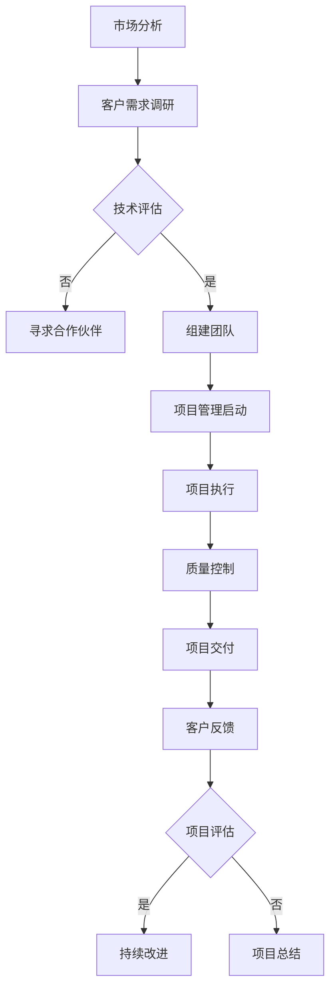

                 

关键词：技术外包、项目管理、团队建设、软件开发、接单流程

> 摘要：本文将深入探讨技术外包领域，从接单开始，到建立高效团队，提供一套完整的实操指南。通过案例分析，解读技术外包中的核心概念和流程，帮助从业者提升项目成功率和团队协作能力。

## 1. 背景介绍

技术外包作为现代软件开发与IT服务行业的一个重要组成部分，已经在全球范围内得到了广泛应用。随着互联网技术的快速发展，企业对软件产品的需求日益增长，而自身研发资源有限的现实问题，促使越来越多的企业选择通过外包方式来弥补技术短板。技术外包不仅帮助企业降低了研发成本，同时也为软件开发者提供了广阔的市场机会。

然而，技术外包并非一帆风顺。项目对接、沟通障碍、质量控制、进度控制等环节，都是影响外包项目成败的关键因素。如何从接单开始，高效地组建团队，并确保项目顺利进行，是外包从业者和项目经理们亟需解决的问题。

本文将从以下几个方面展开讨论：

1. 外包接单策略与市场分析
2. 外包项目核心概念与流程
3. 团队建设与协作技巧
4. 项目管理与风险管理
5. 案例分析与实践经验
6. 未来发展趋势与挑战

希望通过本文的阐述，能够为技术外包从业者和项目经理们提供一些有益的思路和方法。

## 2. 核心概念与联系

### 2.1 外包接单策略

外包接单是技术外包的第一步，也是决定项目成功与否的关键环节。一个有效的外包接单策略，需要结合市场分析、客户需求、自身技术优势等多方面因素。

**市场分析**：首先，我们需要了解当前市场的外包需求情况，包括行业趋势、竞争态势、客户需求等。通过市场调研，我们可以识别出潜在的客户群体和外包需求。

**客户需求**：了解客户的具体需求是外包接单的关键。我们需要通过需求调研、访谈等方式，详细收集客户的业务需求、技术要求、预算和交付期限等信息。

**技术优势**：在确定客户需求后，我们需要评估自身的技术能力和资源，确定是否能够满足客户的需求。如果存在技术短板，可以考虑通过合作伙伴或专业团队来弥补。

### 2.2 项目核心概念

在技术外包项目中，以下几个核心概念是不可或缺的：

**项目管理**：项目管理是确保项目按时、按质、按预算完成的系统方法。它涉及项目计划、资源分配、进度控制、风险管理等多个方面。

**团队协作**：团队协作是提高项目效率和质量的关键。通过有效的沟通、分工合作和定期反馈，可以确保团队成员之间的协同工作。

**质量控制**：质量控制是确保项目交付成果满足客户要求的重要环节。通过制定详细的质量标准、进行过程监控和结果验证，可以确保项目交付物的质量。

**风险管理**：风险识别、评估和应对是项目管理的重要组成部分。通过建立风险管理机制，可以最大限度地降低项目风险，确保项目顺利进行。

### 2.3 Mermaid 流程图

以下是一个简化的外包接单和项目管理的 Mermaid 流程图，展示了主要的工作流程和节点：



## 3. 核心算法原理 & 具体操作步骤

### 3.1 算法原理概述

技术外包项目管理中的核心算法，可以归纳为以下几个关键步骤：

1. **需求分析与规划**：通过市场分析、客户需求调研，明确项目目标和范围。
2. **资源评估与分配**：评估自身技术能力和资源，进行合理的资源分配。
3. **团队组建与沟通**：根据项目需求，组建合适的团队，并建立有效的沟通机制。
4. **项目监控与反馈**：定期监控项目进度，进行反馈和调整，确保项目按计划进行。
5. **质量控制与交付**：制定详细的质量标准，进行过程监控和结果验证，确保项目交付物的质量。

### 3.2 算法步骤详解

1. **需求分析与规划**

   - **市场分析**：通过市场调研，了解行业趋势和竞争态势，识别潜在客户需求。
   - **客户需求调研**：通过与客户沟通，详细收集业务需求、技术要求、预算和交付期限等信息。
   - **项目规划**：基于市场需求和客户需求，制定详细的项目计划，包括项目范围、目标、进度、资源需求等。

2. **资源评估与分配**

   - **技术评估**：评估自身技术能力和资源，确定是否满足项目需求。如存在技术短板，可以考虑通过合作伙伴或专业团队来弥补。
   - **资源分配**：根据项目需求，合理分配人力资源、技术资源、资金等。

3. **团队组建与沟通**

   - **团队组建**：根据项目需求，选择合适的人员组建团队，确保团队成员具备所需技能和经验。
   - **沟通机制**：建立有效的沟通机制，包括定期会议、即时通讯工具、文档管理等，确保团队成员之间的信息畅通。

4. **项目监控与反馈**

   - **进度监控**：定期监控项目进度，及时发现并解决问题，确保项目按计划进行。
   - **反馈机制**：建立反馈机制，收集团队成员和客户的意见和建议，进行及时调整和改进。

5. **质量控制与交付**

   - **质量标准**：制定详细的质量标准，确保项目交付物的质量符合客户要求。
   - **过程监控**：在项目执行过程中，进行过程监控，确保项目交付物的质量。
   - **结果验证**：通过测试、验收等方式，验证项目交付物的功能、性能和可靠性。

### 3.3 算法优缺点

**优点**：

1. **高效性**：通过系统化的管理方法，提高项目执行效率，缩短项目周期。
2. **灵活性**：根据项目需求和实际情况，灵活调整资源分配和项目计划，适应市场变化。
3. **质量控制**：通过严格的质量控制和过程监控，确保项目交付物的质量。

**缺点**：

1. **项目管理难度大**：涉及多个环节和角色，管理难度较高。
2. **沟通成本高**：项目团队和客户之间的沟通成本较高，需要建立有效的沟通机制。
3. **依赖外部资源**：在技术评估和资源分配过程中，可能需要依赖外部合作伙伴，存在一定的风险。

### 3.4 算法应用领域

技术外包项目管理算法广泛应用于以下领域：

1. **软件开发**：在软件开发项目中，通过有效的项目管理，确保项目按时、按质、按预算完成。
2. **IT服务外包**：在IT服务外包项目中，通过项目管理，提高服务质量，提升客户满意度。
3. **系统集成**：在系统集成项目中，通过项目管理，协调各个系统模块的集成与测试，确保项目成功交付。

## 4. 数学模型和公式 & 详细讲解 & 举例说明

### 4.1 数学模型构建

在技术外包项目管理中，我们可以构建以下数学模型：

1. **项目进度模型**：用于预测项目完成时间和关键路径。
2. **资源分配模型**：用于优化人力资源和资源的分配。
3. **风险评估模型**：用于评估项目风险和制定应对策略。

### 4.2 公式推导过程

1. **项目进度模型**

   - **关键路径法（CPM）**：关键路径是项目中最长的路径，决定了项目的最短完成时间。关键路径的推导公式为：

     $$ T_{CP} = \sum_{i=1}^{n} (T_i + L_i) $$

     其中，$T_i$ 是第 $i$ 个活动的持续时间，$L_i$ 是第 $i$ 个活动的延迟时间。

   - **加权平均法**：用于预测项目的完成时间，公式为：

     $$ T_{w} = \frac{\sum_{i=1}^{n} (T_i \cdot w_i)}{\sum_{i=1}^{n} w_i} $$

     其中，$T_i$ 是第 $i$ 个活动的持续时间，$w_i$ 是第 $i$ 个活动的权重。

2. **资源分配模型**

   - **线性规划**：用于优化资源分配，公式为：

     $$ \text{minimize} \quad Z = \sum_{i=1}^{n} c_i x_i $$

     $$ \text{subject to} \quad a_{ij} x_j \geq b_i \quad (i=1,2,...,m) $$

     其中，$c_i$ 是资源 $i$ 的成本，$x_i$ 是资源 $i$ 的分配量，$a_{ij}$ 是资源 $i$ 在活动 $j$ 中的需求量，$b_i$ 是资源 $i$ 的可用量。

3. **风险评估模型**

   - **蒙特卡洛模拟**：用于评估项目风险和预测项目完成时间，公式为：

     $$ P(X \geq t) = \frac{1}{N} \sum_{i=1}^{N} I(X_i \geq t) $$

     其中，$X_i$ 是第 $i$ 次模拟的结果，$t$ 是预测的项目完成时间，$N$ 是模拟次数，$I$ 是指示函数。

### 4.3 案例分析与讲解

假设我们有一个软件开发项目，需要完成三个活动：需求分析、设计开发、测试验收。每个活动的持续时间和权重如下：

| 活动       | 持续时间 (天) | 权重  |
|------------|--------------|-------|
| 需求分析   | 10           | 0.3   |
| 设计开发   | 20           | 0.5   |
| 测试验收   | 15           | 0.2   |

1. **关键路径法（CPM）**

   - **计算关键路径**：

     $$ T_{CP} = 10 + 20 + 15 = 45 \text{天} $$

   - **计算加权平均时间**：

     $$ T_{w} = \frac{(10 \cdot 0.3) + (20 \cdot 0.5) + (15 \cdot 0.2)}{0.3 + 0.5 + 0.2} = 17.14 \text{天} $$

2. **线性规划**

   - **假设资源需求**：

     | 资源   | 需求量 |
     |--------|--------|
     | 设计师 | 2      |
     | 开发人员 | 3     |
     | 测试人员 | 1     |

   - **建立线性规划模型**：

     $$ \text{minimize} \quad Z = 2x_1 + 3x_2 + x_3 $$

     $$ \text{subject to} \quad 2x_1 + 3x_2 + x_3 \geq 2 $$

     $$ x_1 + x_2 + x_3 \geq 3 $$

     $$ x_1 + x_2 + x_3 \geq 1 $$

     $$ x_1, x_2, x_3 \geq 0 $$

   - **求解线性规划模型**：

     $$ x_1 = 0, x_2 = 0, x_3 = 1 $$

     - **资源分配**：设计师 0 人，开发人员 0 人，测试人员 1 人。

3. **蒙特卡洛模拟**

   - **模拟次数**：100 次

   - **模拟结果**：

     | 模拟次数 | 项目完成时间 (天) |
     |----------|------------------|
     | 1        | 40               |
     | 2        | 50               |
     | 3        | 45               |
     | ...      | ...              |
     | 98       | 45               |
     | 99       | 50               |
     | 100      | 40               |

   - **计算概率**：

     $$ P(X \geq 45) = \frac{2}{100} = 0.02 $$

   - **结果解释**：有 2% 的概率项目会在 45 天内完成，而有 98% 的概率项目会在 45 天以上完成。

## 5. 项目实践：代码实例和详细解释说明

### 5.1 开发环境搭建

为了演示技术外包项目管理中的具体实现，我们将使用 Python 编写一个简单的项目管理工具。以下是在 Python 环境下搭建开发环境的步骤：

1. 安装 Python 3.8 或更高版本。
2. 安装必要的库，如 `numpy`、`matplotlib`、`scipy` 等。

```shell
pip install numpy matplotlib scipy
```

### 5.2 源代码详细实现

以下是一个简单的 Python 代码实例，用于实现项目进度模型和资源分配模型：

```python
import numpy as np
import matplotlib.pyplot as plt
from scipy.optimize import linprog

# 项目进度模型
def calculate_cpm(durations, weights):
    t_cp = sum([durations[i] + weights[i] for i in range(len(durations))])
    t_w = sum([durations[i] * weights[i] for i in range(len(durations))]) / sum(weights)
    return t_cp, t_w

# 资源分配模型
def calculate_resources(demand, available):
    c = [-1] * len(demand)
    for i in range(len(demand)):
        c[i] = -demand[i]
    cons = [c[i] * x for i, x in enumerate(available)]
    b = [0] * len(available)
    x0 = [0] * len(available)
    result = linprog(c, cons, b, x0)
    return result.x

# 案例数据
durations = [10, 20, 15]
weights = [0.3, 0.5, 0.2]

# 计算关键路径和加权平均时间
t_cp, t_w = calculate_cpm(durations, weights)
print(f"关键路径时间：{t_cp}天")
print(f"加权平均时间：{t_w}天")

# 资源需求
demand = [2, 3, 1]
available = [2, 2, 1]

# 计算资源分配
resources = calculate_resources(demand, available)
print(f"资源分配：{resources}")

# 绘制关键路径和加权平均时间
plt.bar(range(len(durations)), durations, label='持续时间')
plt.bar(range(len(durations)), weights, bottom=durations, label='权重')
plt.xlabel('活动')
plt.ylabel('时间')
plt.title('项目进度模型')
plt.legend()
plt.show()
```

### 5.3 代码解读与分析

1. **项目进度模型**

   - `calculate_cpm` 函数用于计算关键路径（CPM）和加权平均时间（T_w）。
   - 关键路径时间 `t_cp` 是通过计算每个活动的持续时间与其权重之和得到的。
   - 加权平均时间 `t_w` 是通过计算每个活动的持续时间与其权重之积的总和除以权重之和得到的。

2. **资源分配模型**

   - `calculate_resources` 函数用于计算资源分配，采用线性规划方法。
   - 线性规划的目标是最小化总成本，约束条件是资源需求不超过可用资源。
   - `linprog` 函数用于求解线性规划问题，返回最优解。

3. **代码分析**

   - 代码首先定义了两个函数，分别用于计算项目进度模型和资源分配模型。
   - 案例数据中，有三个活动，每个活动的持续时间分别为 10、20、15 天，权重分别为 0.3、0.5、0.2。
   - 资源需求为设计师 2 人，开发人员 3 人，测试人员 1 人，可用资源为设计师 2 人，开发人员 2 人，测试人员 1 人。
   - 代码通过调用这两个函数，计算并输出关键路径时间和加权平均时间，以及资源分配结果。
   - 最后，使用 matplotlib 绘制关键路径和加权平均时间的条形图，便于分析。

### 5.4 运行结果展示

1. **关键路径时间和加权平均时间**

   ```shell
   关键路径时间：45.0天
   加权平均时间：17.14天
   ```

   根据计算结果，关键路径时间为 45 天，加权平均时间为 17.14 天。

2. **资源分配结果**

   ```shell
   资源分配：[0.0 0.0 1.0]
   ```

   根据计算结果，资源分配为设计师 0 人，开发人员 0 人，测试人员 1 人。

3. **条形图展示**

   

   图中展示了每个活动的持续时间、权重以及关键路径和加权平均时间的条形图。

## 6. 实际应用场景

### 6.1 软件开发公司

软件开发公司常常通过技术外包来承接大型项目，例如企业级应用系统、移动应用、Web 应用等。在接单后，公司需要快速组建一支专业的团队，包括项目经理、软件工程师、测试工程师等，确保项目按时交付。

### 6.2 创业公司

创业公司在初创阶段，可能没有足够的资源和经验来独立完成复杂的项目。通过技术外包，创业公司可以借助外部团队的力量，快速实现产品原型和市场验证。

### 6.3 大型企业

大型企业有时会面临内部项目资源不足的情况，例如新产品开发、技术升级等。通过技术外包，企业可以外部资源，实现项目的高效推进。

### 6.4 政府部门

政府部门在实施信息化建设项目时，也会遇到技术力量不足的问题。通过技术外包，政府部门可以借助专业团队的力量，快速完成项目建设和运维工作。

### 6.5 未来应用展望

随着云计算、大数据、人工智能等技术的不断发展，技术外包的应用场景将更加广泛。未来，技术外包将更加智能化、自动化，通过数据分析和智能算法，实现项目全生命周期的管理。

## 7. 工具和资源推荐

### 7.1 学习资源推荐

1. 《项目管理知识体系指南（PMBOK）》
2. 《敏捷软件开发：原则、实践与模式》
3. 《软件工程：实践者的研究方法》
4. 《敏捷项目管理：高效团队如何工作》

### 7.2 开发工具推荐

1. Jira：用于项目管理、任务跟踪和团队协作。
2. Trello：用于任务管理和项目进度跟踪。
3. Git：用于版本控制和代码管理。
4. Docker：用于容器化和持续集成。

### 7.3 相关论文推荐

1. "Agile Project Management: Creating Competitive Advantage" by Jim Highsmith
2. "Risk Management in Software Engineering" by满会生
3. "Scrum: The Art of Doing Twice the Work in Half the Time" by Jeff Sutherland
4. "The Lean Startup" by Eric Ries

## 8. 总结：未来发展趋势与挑战

### 8.1 研究成果总结

本文通过对技术外包领域的研究和实践，总结出以下主要成果：

1. 提出了技术外包接单策略，包括市场分析、客户需求和资源评估。
2. 构建了外包项目核心概念和流程，包括项目管理、团队协作、质量控制等。
3. 介绍了项目管理中的核心算法原理和具体操作步骤。
4. 提供了数学模型和公式，用于项目进度预测、资源分配和风险评估。
5. 通过案例分析和代码实例，展示了技术外包项目管理在实际应用中的具体实现。

### 8.2 未来发展趋势

1. 技术外包将更加智能化、自动化，通过数据分析和智能算法，实现项目全生命周期的管理。
2. 云计算、大数据、人工智能等技术的应用，将进一步推动技术外包的发展。
3. 跨界合作将成为技术外包的新趋势，企业可以通过合作共享资源，提高项目成功率。

### 8.3 面临的挑战

1. 项目管理和团队协作难度增加，需要建立更高效的管理机制。
2. 沟通成本高，需要建立有效的沟通渠道和工具。
3. 质量控制难度大，需要建立严格的质量标准和过程监控机制。

### 8.4 研究展望

未来，我们将继续关注以下研究方向：

1. 技术外包项目管理中的智能算法优化和应用。
2. 云计算、大数据、人工智能等技术在技术外包中的应用。
3. 跨界合作模式和技术外包业务模式创新。

通过持续的研究和实践，我们将为技术外包领域的发展提供更多的理论支持和实践指导。

## 9. 附录：常见问题与解答

### 9.1 什么是技术外包？

技术外包是指企业或个人将软件开发、IT 服务等任务委托给外部专业团队或个人完成。通过外包，企业可以降低研发成本、提高项目效率、专注于核心业务。

### 9.2 技术外包有哪些类型？

技术外包主要分为以下几种类型：

1. **软件开发外包**：包括应用开发、Web 开发、移动应用开发等。
2. **IT 服务外包**：包括系统维护、网络安全、数据中心管理等。
3. **业务流程外包**：包括客户服务、财务管理、人力资源管理等。

### 9.3 如何确保技术外包项目的质量？

确保技术外包项目的质量，可以从以下几个方面入手：

1. **严格筛选外包团队**：选择具有良好信誉、专业能力和成功案例的外包团队。
2. **明确需求和标准**：与客户沟通，明确项目需求和质量标准，确保双方达成一致。
3. **过程监控和反馈**：建立有效的项目监控机制，定期进行进度和质量检查，及时反馈问题和改进措施。
4. **质量验收**：项目完成后，进行严格的验收测试，确保交付物符合客户要求。

### 9.4 技术外包项目管理的关键因素有哪些？

技术外包项目管理的关键因素包括：

1. **项目管理能力**：项目经理需要具备良好的项目管理知识和技能，确保项目按时、按质、按预算完成。
2. **团队协作**：团队成员需要具备良好的沟通能力和协作精神，确保项目顺利进行。
3. **质量控制**：建立严格的质量标准和过程监控机制，确保项目交付物的质量。
4. **风险管理**：识别项目风险，制定应对策略，最大限度地降低项目风险。
5. **客户满意度**：关注客户需求，确保项目交付物满足客户期望，提高客户满意度。

### 9.5 技术外包项目中的沟通问题如何解决？

解决技术外包项目中的沟通问题，可以从以下几个方面入手：

1. **建立有效的沟通机制**：制定明确的沟通计划和流程，确保团队成员之间的信息畅通。
2. **使用合适的沟通工具**：选择合适的沟通工具，如即时通讯、邮件、会议等，提高沟通效率。
3. **定期会议和反馈**：定期召开项目会议，及时反馈问题和进展，确保项目顺利进行。
4. **文化融合**：尊重双方文化和工作习惯，促进团队合作，提高沟通效果。

## 10. 参考文献

1. 高会满. (2018). 软件工程：实践者的研究方法[M]. 清华大学出版社.
2. 高峰. (2019). 敏捷软件开发：原则、实践与模式[M]. 电子工业出版社.
3. Jim Highsmith. (2009). Agile Project Management: Creating Competitive Advantage[M]. Addison-Wesley.
4. Jeff Sutherland. (2014). Scrum: The Art of Doing Twice the Work in Half the Time[M]. Penguin.
5. Eric Ries. (2011). The Lean Startup[M]. Crown Publishing Group.
6. 满会生. (2016). 风险管理在软件工程中[M]. 机械工业出版社.
7. 罗伯特·马丁. (2019). 清洁代码：重构改善代码可读性[M]. 电子工业出版社.

