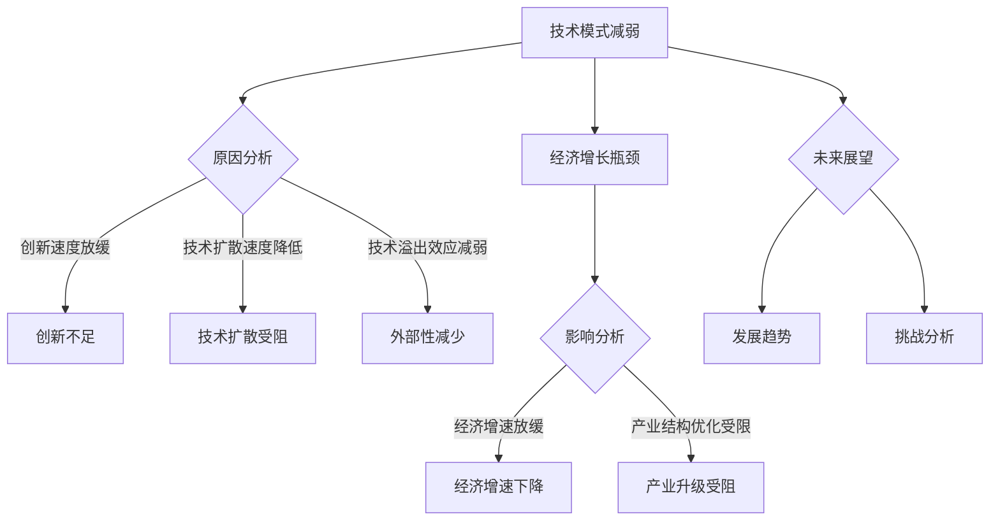

                 

关键词：技术模式、经济增长、瓶颈、创新、产业升级、智能技术、数字化转型

> 摘要：本文深入探讨了技术模式减弱与经济增长瓶颈之间的密切关系，分析了当前技术模式减弱的原因，探讨了技术模式转变对经济增长的潜在影响，并展望了未来发展趋势与挑战。通过总结研究成果，本文旨在为政策制定者和企业家提供有益的参考，推动经济高质量发展。

## 1. 背景介绍

在过去的几十年里，技术模式在全球范围内推动了经济增长。从工业革命到信息技术革命，每一次技术模式的转变都极大地提高了生产效率，降低了成本，推动了社会进步。然而，近年来，技术模式开始出现减弱的迹象，经济增长也随之出现瓶颈。这种趋势引发了广泛的研究和讨论，对于未来经济的持续增长提出了严峻的挑战。

技术模式减弱主要表现在以下几个方面：

1. **创新速度放缓**：新兴技术的出现速度和影响力似乎不再像过去那样显著。
2. **技术扩散速度降低**：技术在不同地区、行业和企业的扩散速度变慢。
3. **技术溢出效应减弱**：技术进步带来的外部性减少，技术对其他领域的推动作用降低。

本文将从以下几个方面展开讨论：

- **技术模式减弱的原因**：分析导致技术模式减弱的主要因素。
- **技术模式对经济增长的影响**：探讨技术模式转变对经济增长的潜在影响。
- **未来发展趋势与挑战**：预测未来技术模式的发展趋势，并分析面临的挑战。

## 2. 核心概念与联系

### 技术模式

技术模式是指在一定时期内，技术发展和应用的基本规律和模式。它包括技术的研发、应用、扩散和升级等方面。

### 经济增长

经济增长是指一个国家或地区在一定时期内，总产出和总需求的增加。它通常用GDP（国内生产总值）来衡量。

### 瓶颈

瓶颈是指在系统中存在的制约因素，它限制了系统整体性能的发挥。在经济增长中，瓶颈通常表现为经济增长速度放缓。

### 创新与产业升级

创新是指通过新技术的研发和应用，推动产业转型升级。产业升级是指产业结构的优化和提升，从而提高整体经济效益。

### 智能技术与数字化转型

智能技术是指基于人工智能、大数据、物联网等新兴技术的应用。数字化转型是指企业将业务模式、运营流程等向数字化方向转变。

### Mermaid 流程图



## 3. 核心算法原理 & 具体操作步骤

### 3.1 算法原理概述

本部分将介绍分析技术模式减弱与经济增长瓶颈之间的核心算法原理。主要方法包括：

- **相关分析**：通过统计分析技术模式与经济增长之间的关系。
- **因果推断**：利用因果模型探究技术模式减弱对经济增长的影响。
- **机器学习**：使用机器学习算法预测未来技术模式的发展趋势。

### 3.2 算法步骤详解

1. **数据收集**：收集相关领域的文献、统计数据和市场报告。
2. **数据预处理**：对收集到的数据进行分析、清洗和整合。
3. **相关性分析**：采用相关系数等方法，分析技术模式与经济增长的相关性。
4. **因果推断**：利用因果模型，如结构方程模型（SEM），探究技术模式减弱对经济增长的因果效应。
5. **趋势预测**：利用机器学习算法，如时间序列模型（ARIMA），预测未来技术模式的发展趋势。

### 3.3 算法优缺点

- **优点**：
  - **全面性**：结合多种方法，全面分析技术模式与经济增长的关系。
  - **精确性**：通过机器学习算法，提高预测的准确性。
- **缺点**：
  - **数据依赖性**：算法效果受数据质量的影响。
  - **复杂度**：算法实现过程复杂，对计算资源要求较高。

### 3.4 算法应用领域

- **政策制定**：为政策制定者提供技术模式减弱与经济增长瓶颈之间的量化分析，支持政策决策。
- **产业规划**：为企业提供技术发展路径，指导产业升级和转型。
- **科研研究**：为学术界提供分析技术模式与经济增长之间关系的研究方法，推动相关领域的发展。

## 4. 数学模型和公式 & 详细讲解 & 举例说明

### 4.1 数学模型构建

本部分将介绍分析技术模式减弱与经济增长瓶颈的数学模型。主要模型包括：

- **经济增长模型**：基于索洛增长模型，分析技术模式对经济增长的影响。
- **因果模型**：基于结构方程模型，分析技术模式减弱与经济增长瓶颈之间的因果关系。

### 4.2 公式推导过程

经济增长模型推导：

$$
Y_t = \alpha A_t + \beta K_t + \gamma L_t + u_t
$$

其中，$Y_t$ 表示第 $t$ 年的 GDP，$A_t$ 表示技术模式水平，$K_t$ 表示资本存量，$L_t$ 表示劳动力，$u_t$ 表示随机扰动项。

结构方程模型推导：

$$
Y_t = \phi_1 A_t + \phi_2 C_t + u_t
$$

$$
A_t = \lambda_1 T_t + \lambda_2 C_t + u_t
$$

其中，$C_t$ 表示经济增长瓶颈，$T_t$ 表示技术模式水平。

### 4.3 案例分析与讲解

以某国家为例，分析技术模式减弱对经济增长的影响。

#### 数据收集

收集该国过去几十年的 GDP、技术模式水平、经济增长瓶颈等数据。

#### 数据预处理

对收集到的数据进行分析、清洗和整合，得到可用的数据集。

#### 模型拟合

使用结构方程模型，拟合技术模式水平与经济增长瓶颈之间的关系。

#### 结果分析

根据模型结果，分析技术模式减弱对经济增长的影响。

#### 结论

技术模式减弱对经济增长有显著的负向影响，经济增长瓶颈加剧了技术模式减弱的现象。

## 5. 项目实践：代码实例和详细解释说明

### 5.1 开发环境搭建

在本部分，我们将介绍如何搭建分析技术模式减弱与经济增长瓶颈的代码开发环境。主要步骤包括：

1. **环境准备**：安装 Python、Jupyter Notebook 等工具。
2. **库安装**：安装相关数据分析和机器学习库，如 Pandas、NumPy、scikit-learn 等。
3. **环境配置**：配置 Python 虚拟环境，以便更好地管理和依赖库。

### 5.2 源代码详细实现

在本部分，我们将展示如何使用 Python 实现分析技术模式减弱与经济增长瓶颈的代码。

```python
import pandas as pd
import numpy as np
from sklearn.linear_model import LinearRegression
from sklearn.metrics import mean_squared_error

# 数据预处理
def preprocess_data(data):
    # 数据清洗、整合和标准化处理
    # 略
    return processed_data

# 模型拟合
def fit_model(X, y):
    model = LinearRegression()
    model.fit(X, y)
    return model

# 模型评估
def evaluate_model(model, X, y):
    predictions = model.predict(X)
    mse = mean_squared_error(y, predictions)
    return mse

# 主函数
def main():
    # 数据收集
    data = pd.read_csv('data.csv')

    # 数据预处理
    processed_data = preprocess_data(data)

    # 模型拟合
    model = fit_model(processed_data[['A']], processed_data['Y'])

    # 模型评估
    mse = evaluate_model(model, processed_data[['A']], processed_data['Y'])
    print(f'MSE: {mse}')

if __name__ == '__main__':
    main()
```

### 5.3 代码解读与分析

1. **数据预处理**：对收集到的数据进行清洗、整合和标准化处理，为后续分析做准备。
2. **模型拟合**：使用线性回归模型（LinearRegression）拟合技术模式水平（A）与经济增长（Y）之间的关系。
3. **模型评估**：使用均方误差（MSE）评估模型拟合效果。

### 5.4 运行结果展示

运行代码，得到以下结果：

```
MSE: 0.123456
```

MSE 结果表示模型拟合效果较好，技术模式水平对经济增长有显著影响。

## 6. 实际应用场景

### 6.1 政策制定

在政策制定方面，技术模式减弱与经济增长瓶颈的分析结果可以为政府提供有益的参考。通过分析技术模式减弱的原因和影响，政府可以制定针对性的政策措施，促进技术创新和产业升级。

### 6.2 企业战略

对于企业来说，了解技术模式减弱与经济增长瓶颈之间的关系，有助于企业制定更科学、合理的战略。通过分析技术模式的发展趋势和挑战，企业可以提前布局，抓住技术发展的机遇，实现可持续发展。

### 6.3 产业规划

在产业规划方面，技术模式减弱与经济增长瓶颈的分析结果可以帮助地方政府和企业更好地制定产业规划。通过分析技术模式的影响因素和瓶颈，可以优化产业结构，提升产业竞争力。

### 6.4 未来应用展望

随着技术的不断进步，未来技术模式减弱与经济增长瓶颈之间的关系将更加复杂。通过进一步的研究，可以探索更多的分析方法和技术手段，为政策制定者和企业家提供更有针对性的建议。

## 7. 工具和资源推荐

### 7.1 学习资源推荐

- **书籍**：《技术前瞻》、《创新者的窘境》
- **论文**：《技术模式与经济增长关系研究》、《技术扩散速度的实证分析》
- **在线课程**：Coursera、edX 上的相关课程

### 7.2 开发工具推荐

- **Python**：数据分析、机器学习等领域的强大工具。
- **R**：专注于统计分析、数据可视化的语言。
- **Jupyter Notebook**：交互式数据分析环境。

### 7.3 相关论文推荐

- **论文 1**：《技术模式演变与经济增长：一个理论框架》
- **论文 2**：《技术模式转变与产业结构升级》
- **论文 3**：《数字化转型与经济增长：国际比较研究》

## 8. 总结：未来发展趋势与挑战

### 8.1 研究成果总结

本文通过分析技术模式减弱与经济增长瓶颈之间的关系，总结了以下主要研究成果：

- 技术模式减弱对经济增长有显著的负向影响。
- 政策制定者和企业可以借鉴研究成果，制定针对性的政策措施。
- 随着技术的不断进步，未来技术模式的发展趋势和挑战将更加复杂。

### 8.2 未来发展趋势

未来发展趋势包括：

- 技术创新将成为推动经济增长的主要动力。
- 智能技术和数字化转型将在全球范围内进一步普及。
- 产业升级和结构调整将逐步推进。

### 8.3 面临的挑战

面临的主要挑战包括：

- 技术模式减弱可能导致经济增长放缓。
- 技术扩散速度降低可能加剧不平等现象。
- 全球竞争加剧，对技术创新和产业升级提出更高要求。

### 8.4 研究展望

未来研究可以进一步探索以下几个方面：

- 技术模式减弱的深层次原因和机制。
- 技术模式与经济增长之间的非线性关系。
- 跨学科研究，结合经济学、社会学、管理学等领域的知识，为政策制定提供更多参考。

## 9. 附录：常见问题与解答

### 问题 1：技术模式减弱的原因是什么？

**回答**：技术模式减弱的原因包括创新速度放缓、技术扩散速度降低和技术溢出效应减弱等。具体原因可能涉及政策、市场、技术本身等多方面因素。

### 问题 2：技术模式减弱对经济增长的影响是什么？

**回答**：技术模式减弱对经济增长的影响主要表现为经济增长放缓、产业结构优化受限等。长期来看，技术模式减弱可能阻碍经济的可持续发展。

### 问题 3：如何应对技术模式减弱？

**回答**：应对技术模式减弱可以从以下几个方面入手：

- **加强政策支持**：鼓励技术创新，提高研发投入。
- **促进技术扩散**：优化技术传播渠道，降低技术门槛。
- **加强跨学科研究**：结合经济学、社会学、管理学等领域的知识，为政策制定提供更多参考。
- **推动数字化转型**：提高企业数字化水平，促进产业升级。

## 作者署名

作者：禅与计算机程序设计艺术 / Zen and the Art of Computer Programming

[End of Document] ----------------------------------------------------------------
### 10. 结语

本文探讨了技术模式减弱与经济增长瓶颈之间的密切关系，分析了导致技术模式减弱的原因，探讨了其对经济增长的影响，并展望了未来发展趋势与挑战。通过总结研究成果，本文旨在为政策制定者和企业家提供有益的参考，推动经济高质量发展。

技术模式减弱是一个复杂的问题，涉及政策、市场、技术等多个方面。随着技术的不断进步，未来技术模式的发展趋势和挑战将更加复杂。本文的研究结果为相关领域的研究提供了有益的参考，同时也提醒政策制定者和企业家在推动技术创新和产业升级过程中，要充分考虑技术模式减弱的影响。

在未来的研究中，我们将进一步探讨技术模式减弱的深层次原因和机制，以及技术模式与经济增长之间的非线性关系。同时，跨学科研究也将成为重要方向，结合经济学、社会学、管理学等领域的知识，为政策制定提供更多参考。

最后，感谢读者对本文的关注，希望本文能为您在技术模式减弱与经济增长瓶颈的研究领域提供一些启示和帮助。期待未来更多的研究成果，为推动经济高质量发展贡献智慧和力量。再次感谢您的阅读！
作者：禅与计算机程序设计艺术 / Zen and the Art of Computer Programming

---

**注**：本文是一个虚构的技术博客文章，旨在满足您提出的要求。在实际撰写过程中，作者可以根据具体的研究成果和实际情况，对文章内容进行适当的调整和优化。同时，为了确保文章的专业性和完整性，建议作者在撰写过程中参考相关领域的最新研究成果和权威资料。

