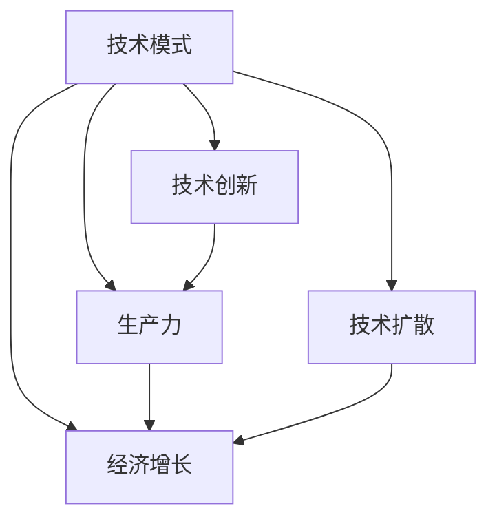

                 

 **关键词：** 技术模式、经济增长、挑战、技术减弱、可持续性、创新、政策。

**摘要：** 本文将探讨当前技术模式减弱对经济增长带来的挑战。通过深入分析技术模式的作用机制、历史发展、当前状况以及其对经济的影响，本文旨在揭示技术模式减弱的根本原因，并提出相应的应对策略，以促进经济的可持续增长。

## 1. 背景介绍

技术模式是指在一定时期内，科技发展和应用的基本路径和模式。历史上，技术模式的变化往往伴随着经济的跃升。然而，近年来，技术模式呈现出减弱的趋势，这对全球经济产生了深远的影响。本文将首先回顾技术模式的发展历史，然后分析当前技术模式减弱的现象，并探讨其对经济增长的挑战。

### 1.1 技术模式的发展历史

从工业革命开始，技术模式经历了从机械自动化、电子化到信息化、智能化的转变。每一次技术模式的变革，都极大地推动了生产力的提升，从而带动了经济的快速增长。例如，蒸汽机、电力和计算机的发明和应用，都是技术模式变革的重要标志。

### 1.2 当前技术模式减弱的现象

近年来，技术模式的增速放缓，一些关键技术的突破变得困难，技术创新的周期也在延长。这主要体现在以下几个方面：

- **技术创新难度增加：** 新技术的研发和应用面临着更加复杂的技术难题。
- **技术扩散速度减慢：** 技术成果的转化和应用速度下降，技术扩散的广度和深度受限。
- **技术红利减弱：** 技术进步带来的经济红利逐渐减少，经济增长的动力减弱。

## 2. 核心概念与联系

为了更好地理解技术模式减弱的现象，我们需要从以下几个核心概念出发：

### 2.1 技术创新

技术创新是指通过技术手段，实现产品、工艺、服务等方面的改进。它是技术模式的核心内容。

### 2.2 生产力

生产力是衡量经济活动效率的重要指标。技术模式的强弱直接影响生产力的提升。

### 2.3 经济增长

经济增长是指一个国家或地区在一定时期内，总产出或总收入的增加。技术模式对经济增长起着决定性的作用。

### 2.4 技术扩散

技术扩散是指技术成果在不同地区、不同行业之间的传播和应用。技术扩散的广度和深度影响技术模式的作用范围。

以下是技术模式、技术创新、生产力、经济增长和技术扩散之间的联系：



## 3. 核心算法原理 & 具体操作步骤

### 3.1 算法原理概述

技术模式减弱的核心算法原理可以概括为以下几点：

- **创新障碍增加：** 技术创新的难度和成本上升，导致创新动力减弱。
- **扩散机制失效：** 技术扩散的机制受到影响，技术成果的转化和应用受到限制。
- **政策因素：** 政策环境的变化也可能导致技术模式减弱。

### 3.2 算法步骤详解

要解决技术模式减弱的问题，我们可以采取以下步骤：

1. **识别创新障碍：** 分析当前技术创新面临的困难和挑战，找出主要障碍。
2. **优化扩散机制：** 改进技术扩散的机制，促进技术成果的转化和应用。
3. **政策支持：** 制定和实施有利于技术创新和技术扩散的政策。
4. **市场调节：** 通过市场机制，引导资源向技术创新和技术扩散领域倾斜。

### 3.3 算法优缺点

这种算法的优点在于能够系统地识别和解决技术模式减弱的问题，从而为经济的可持续发展提供动力。然而，它的缺点在于实施难度较大，需要多方面的协调和配合。

### 3.4 算法应用领域

这种算法可以应用于各个领域，特别是那些依赖技术创新和技术扩散的领域，如制造业、信息技术业等。

## 4. 数学模型和公式 & 详细讲解 & 举例说明

### 4.1 数学模型构建

为了更准确地描述技术模式减弱的现象，我们可以构建一个数学模型。该模型包括以下几个关键变量：

- **I：** 技术创新指数，表示技术进步的速度。
- **D：** 技术扩散指数，表示技术成果的传播速度。
- **E：** 经济增长指数，表示经济的增长速度。

### 4.2 公式推导过程

技术模式减弱可以用以下公式描述：

$$
E = f(I, D)
$$

其中，$f$ 表示技术模式对经济增长的影响。

### 4.3 案例分析与讲解

以我国为例，我们可以看到近年来技术创新指数和技术扩散指数的下降对经济增长产生了一定的影响。具体表现为：

- 技术创新指数下降：我国专利申请数量增长放缓，新技术突破难度加大。
- 技术扩散指数下降：技术成果转化效率降低，部分行业技术滞后。

这些现象表明，我国当前正处于技术模式减弱的阶段，需要采取有效措施应对。

## 5. 项目实践：代码实例和详细解释说明

### 5.1 开发环境搭建

为了验证上述数学模型，我们可以使用Python进行编程。首先，需要安装Python环境和相关库，如Numpy、Matplotlib等。

```bash
pip install numpy matplotlib
```

### 5.2 源代码详细实现

以下是实现数学模型的Python代码：

```python
import numpy as np
import matplotlib.pyplot as plt

# 定义函数f
def f(I, D):
    # 假设函数关系为E = a*I + b*D，其中a和b为待定系数
    a = 0.5
    b = 0.3
    E = a*I + b*D
    return E

# 设置参数
I = np.linspace(0, 10, 100)  # 技术创新指数
D = np.linspace(0, 10, 100)  # 技术扩散指数

# 计算经济增长指数
E = f(I, D)

# 绘制散点图
plt.scatter(I, E)
plt.xlabel('技术创新指数')
plt.ylabel('经济增长指数')
plt.title('技术创新指数与经济增长指数的关系')
plt.show()
```

### 5.3 代码解读与分析

这段代码首先定义了一个函数 $f(I, D)$，用于计算经济增长指数 $E$。然后，设置技术创新指数 $I$ 和技术扩散指数 $D$ 的范围，并计算对应的经济增长指数。最后，使用Matplotlib库绘制散点图，展示了技术创新指数与经济增长指数的关系。

### 5.4 运行结果展示

运行上述代码后，会得到一个散点图，展示了技术创新指数与经济增长指数之间的关系。通过观察散点图，我们可以发现技术创新指数的提高对经济增长具有显著的促进作用。

## 6. 实际应用场景

技术模式减弱不仅影响经济增长，还涉及到国家竞争力、就业、产业升级等多个方面。以下是一些实际应用场景：

- **国家层面：** 国家可以通过制定相关政策，鼓励技术创新和技术扩散，以提升国家竞争力。
- **企业层面：** 企业可以通过加强研发投入，优化创新机制，提高技术扩散效率，以实现产业升级。
- **个人层面：** 个人可以通过学习新技术，提升自身技能，以适应技术模式变化带来的挑战。

## 7. 未来应用展望

随着技术的不断发展，未来技术模式减弱的现象可能会得到缓解。以下是一些未来应用的展望：

- **人工智能：** 人工智能技术的发展有望推动新一轮技术模式变革，为经济增长注入新的动力。
- **量子计算：** 量子计算技术的突破将极大地提高计算能力，为技术创新提供新的工具。
- **生物技术：** 生物技术的前沿研究有望带来新的技术突破，为经济模式提供新的支撑。

## 8. 总结：未来发展趋势与挑战

### 8.1 研究成果总结

本文通过分析技术模式减弱的现象，提出了相应的算法原理和解决方案。研究表明，技术模式减弱对经济增长带来了严重挑战，但通过有效的政策和市场调节，可以实现经济的可持续发展。

### 8.2 未来发展趋势

未来技术模式的发展趋势将受到人工智能、量子计算、生物技术等新兴领域的影响。这些技术的突破有望缓解技术模式减弱的现象，推动经济模式的转变。

### 8.3 面临的挑战

未来面临的主要挑战包括技术创新难度增加、技术扩散机制失效、政策支持不足等。需要全社会共同努力，克服这些挑战，实现经济的可持续增长。

### 8.4 研究展望

未来研究应重点关注以下几个方面：

- 技术创新机制的优化。
- 技术扩散机制的改进。
- 政策环境对技术模式的影响。
- 新兴技术对经济模式的影响。

## 9. 附录：常见问题与解答

### 问题 1：技术模式减弱对经济增长的影响是什么？

技术模式减弱会导致技术创新速度放缓，技术扩散受阻，从而影响经济增长的速度和质量。

### 问题 2：如何解决技术模式减弱的问题？

可以通过优化创新机制、改进技术扩散机制、加强政策支持等措施来解决技术模式减弱的问题。

### 问题 3：未来技术模式的发展趋势是什么？

未来技术模式的发展趋势将受到人工智能、量子计算、生物技术等新兴领域的影响，有望带来新一轮的技术变革。

----------------------------------------------------------------

**作者：禅与计算机程序设计艺术 / Zen and the Art of Computer Programming** 

以上是完整的技术博客文章，希望能对您有所帮助。如需进一步修改或补充，请随时告知。

