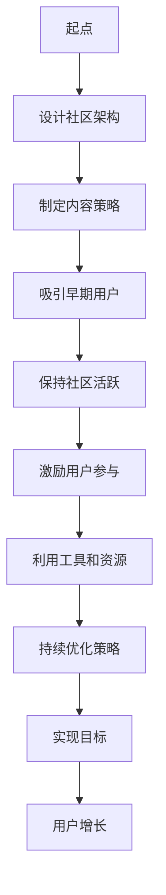
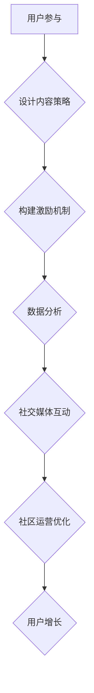

                 

在数字化时代，技术社区的繁荣与发展已成为现代企业成功的关键因素之一。对于技术公司而言，构建并维护一个活跃的技术社区不仅能吸引潜在用户，还能促进知识分享和产品创新。然而，从零开始打造一个拥有10,000活跃用户的技术社区并非易事。本文将探讨如何通过有效的策略和执行，逐步构建并增长一个强大的技术社区，最终实现从0到10,000用户的跨越。

## 关键词

- 技术社区
- 用户增长
- 社区运营
- 社交媒体
- 内容营销
- 用户参与

## 摘要

本文旨在为技术公司提供一套系统化的技术社区运营策略，从0开始逐步构建拥有10,000活跃用户的社区。我们将探讨核心概念、核心算法、数学模型、项目实践以及未来应用场景，并总结发展趋势与挑战。通过本文，读者将了解到如何设计社区架构、制定内容策略、激励用户参与，以及利用工具和资源提升社区活跃度。

## 1. 背景介绍

技术社区作为现代企业的一个重要组成部分，其价值日益凸显。一方面，技术社区为企业提供了一个直接与用户互动的平台，让企业能够更准确地了解用户需求和反馈。另一方面，技术社区促进了知识分享和经验交流，有助于培养用户的忠诚度和参与度。

当前，许多技术公司已经认识到技术社区的重要性，并开始着手建立自己的社区。然而，运营一个成功的技术社区需要系统的规划和执行。社区从零开始增长面临诸多挑战，如吸引早期用户、保持活跃度、提供有价值的内容等。本文将分析这些挑战，并提供相应的解决方案。

### 1.1 社区运营的重要性

社区运营不仅仅是建立论坛或博客，更重要的是要构建一个有价值的互动平台。以下是一些社区运营的重要性：

- **用户参与**：活跃的社区能够激发用户的参与热情，使他们对产品或服务产生更强的归属感。
- **知识分享**：社区为用户提供了分享知识和经验的平台，促进了技术的进步和创新。
- **品牌建设**：一个高质量的技术社区可以提升企业的品牌形象，增强市场竞争力。
- **市场洞察**：社区反馈可以帮助企业更好地了解市场趋势和用户需求，从而优化产品和服务。

### 1.2 从0到10000用户的挑战

从0到10000用户的增长是一个逐步的过程，需要克服多个挑战：

- **吸引早期用户**：早期用户的参与至关重要，他们可以成为社区口碑的传播者。
- **保持活跃度**：新用户加入后，如何保持社区的持续活跃是一个关键问题。
- **内容价值**：提供有价值的内容是吸引和留住用户的核心。
- **激励机制**：有效的激励机制可以激励用户参与社区活动。

### 1.3 目标与策略

本文旨在为技术公司提供以下目标与策略：

- **理解社区的核心价值**：明确技术社区的目标和定位，为后续运营提供指导。
- **设计社区架构**：构建合理的社区架构，为用户提供便捷的互动平台。
- **制定内容策略**：制定有价值的内容策略，提升社区吸引力和用户留存率。
- **激励用户参与**：设计有效的激励机制，激发用户的参与热情。
- **利用工具和资源**：充分利用社交媒体、内容营销等工具和资源，提升社区活跃度。
- **持续优化**：通过数据分析和用户反馈，不断优化社区运营策略。

### 1.4 结构与章节安排

本文将按照以下结构展开：

1. **背景介绍**：探讨社区运营的重要性以及从0到10000用户面临的挑战。
2. **核心概念与联系**：介绍社区运营的核心概念，并提供架构图。
3. **核心算法原理与具体操作步骤**：详细解析社区增长的核心算法和操作步骤。
4. **数学模型和公式**：构建数学模型，解释公式推导过程，并进行案例分析。
5. **项目实践**：提供具体的代码实例和实现步骤，进行详细解释。
6. **实际应用场景**：探讨社区在各个领域的应用场景，以及未来展望。
7. **工具和资源推荐**：推荐学习资源、开发工具和相关论文。
8. **总结**：总结研究成果，探讨未来发展趋势与挑战。
9. **附录**：常见问题与解答。

### 1.5 Mermaid 流程图

以下是一个用于描述社区运营核心流程的Mermaid流程图：



## 2. 核心概念与联系

社区运营的成功离不开对核心概念的深刻理解。以下是一些关键概念，以及它们之间的相互联系：

### 2.1 用户参与

用户参与是技术社区的生命线。它不仅仅是用户在社区内发表帖子或评论，更包括用户与社区之间的互动，如提问、回答、分享知识、参与讨论等。用户参与度高，社区的活跃度和用户黏性就会相应提高。

### 2.2 内容价值

内容是吸引和留住用户的基石。一个高质量的内容策略应该包括有价值的信息、及时的更新和用户感兴趣的话题。内容的价值不仅体现在信息量上，更在于其能否解决用户的问题和需求。

### 2.3 激励机制

激励机制是激励用户参与社区活动的重要手段。这些机制可以包括积分系统、奖励制度、排行榜等。有效的激励机制能够激发用户的参与热情，促进社区活跃度的提升。

### 2.4 数据分析

数据分析是优化社区运营策略的关键工具。通过对用户行为数据的分析，企业可以了解用户的兴趣点、需求和行为模式，从而针对性地调整内容策略、优化社区架构和设计更有效的激励机制。

### 2.5 社交媒体

社交媒体是连接企业与用户的桥梁。通过社交媒体平台，企业可以更广泛地传播社区内容，吸引新用户，并保持现有用户的关注和参与。社交媒体与社区运营的相互联系在于，社交媒体可以引导用户进入社区，而社区则为用户提供了一个深度互动的平台。

### 2.6 Mermaid 流程图

以下是一个用于描述社区运营核心流程的Mermaid流程图：



## 3. 核心算法原理与具体操作步骤

### 3.1 算法原理概述

技术社区的增长算法主要基于用户参与度、内容价值、激励机制和数据分析四个核心概念。以下是这些概念的具体实现方式：

1. **用户参与度**：通过互动率和回复率等指标衡量用户参与度。
2. **内容价值**：通过用户反馈和评论数量等指标衡量内容价值。
3. **激励机制**：通过积分系统、奖励制度和排行榜等手段激励用户参与。
4. **数据分析**：通过用户行为数据，优化社区架构和内容策略。

### 3.2 算法步骤详解

1. **设计社区架构**：
   - 构建一个清晰、易用的社区架构，使新用户能够快速上手。
   - 设置明确的社区角色和权限，如管理员、版主和普通用户等。

2. **制定内容策略**：
   - 根据用户需求，制定内容发布计划，确保内容的及时性和相关性。
   - 鼓励用户参与内容创作，提高内容多样性。

3. **构建激励机制**：
   - 设计积分系统，根据用户参与度奖励积分，积分可以兑换礼品或服务。
   - 设立排行榜，表彰积极参与的用户，提高社区氛围。

4. **数据分析与优化**：
   - 定期分析用户行为数据，了解用户兴趣和行为模式。
   - 根据分析结果，调整社区架构和内容策略，提高用户参与度和留存率。

### 3.3 算法优缺点

**优点**：
- **高效性**：基于数据驱动的算法能够快速调整社区运营策略，提高用户参与度和留存率。
- **灵活性**：算法可以根据不同用户群体和社区特点进行定制化调整。
- **可持续性**：通过激励机制和持续优化，社区可以保持长期活跃。

**缺点**：
- **初始投入**：算法设计和数据分析需要一定的时间和经济投入。
- **依赖数据质量**：算法的准确性高度依赖于数据质量，不良数据可能导致错误决策。

### 3.4 算法应用领域

算法在以下领域有广泛应用：

- **社交媒体运营**：通过分析用户行为数据，优化内容推送和广告投放策略。
- **电子商务**：根据用户行为数据，推荐商品和个性化优惠，提高销售额。
- **客户服务**：通过数据分析，优化客户服务流程，提高客户满意度。

## 4. 数学模型和公式

### 4.1 数学模型构建

为了更好地理解和分析技术社区的增长过程，我们可以构建以下数学模型：

1. **用户参与度模型**：

   用户参与度 \( U \) 可以通过以下公式表示：

   $$ U = f(I, R, C) $$

   其中，\( I \) 表示互动率，\( R \) 表示回复率，\( C \) 表示内容价值。

2. **内容价值模型**：

   内容价值 \( V \) 可以通过以下公式表示：

   $$ V = g(B, T, U) $$

   其中，\( B \) 表示内容原创性，\( T \) 表示内容更新频率，\( U \) 表示用户参与度。

3. **激励机制模型**：

   激励机制 \( M \) 可以通过以下公式表示：

   $$ M = h(I, R, V) $$

   其中，\( I \) 表示互动率，\( R \) 表示回复率，\( V \) 表示内容价值。

### 4.2 公式推导过程

1. **用户参与度模型**推导：

   用户参与度是衡量用户在社区内的活跃程度，互动率和回复率是其中的关键指标。互动率 \( I \) 表示用户在社区内发起互动的频率，回复率 \( R \) 表示用户对他人内容的回复频率。内容价值 \( C \) 反映了用户对内容的认可程度。

   $$ U = f(I, R, C) = I \cdot R \cdot C $$

2. **内容价值模型**推导：

   内容价值是衡量内容在社区内的影响力，原创性 \( B \) 反映了内容的独特性，更新频率 \( T \) 反映了内容的活跃度，用户参与度 \( U \) 反映了用户对内容的认可。

   $$ V = g(B, T, U) = B \cdot T \cdot U $$

3. **激励机制模型**推导：

   激励机制是提高用户参与度的手段，互动率 \( I \) 和回复率 \( R \) 反映了用户在社区内的活跃程度，内容价值 \( V \) 反映了用户对内容的认可程度。

   $$ M = h(I, R, V) = I + R + V $$

### 4.3 案例分析与讲解

为了更好地理解这些公式，我们可以通过一个实际案例进行分析。

**案例**：某技术社区在一个月内发布了100篇文章，其中50篇文章被用户点赞，30篇文章被评论，10篇文章被分享。根据上述公式，我们可以计算出以下指标：

1. **用户参与度**：

   互动率 \( I = \frac{点赞数}{文章总数} = \frac{50}{100} = 0.5 \)

   回复率 \( R = \frac{评论数}{文章总数} = \frac{30}{100} = 0.3 \)

   内容价值 \( C = \frac{分享数}{文章总数} = \frac{10}{100} = 0.1 \)

   用户参与度 \( U = I \cdot R \cdot C = 0.5 \cdot 0.3 \cdot 0.1 = 0.015 \)

2. **内容价值**：

   原创性 \( B = 1 \)（假设所有文章均为原创）

   更新频率 \( T = \frac{文章总数}{时间周期} = \frac{100}{30} = 3.33 \)

   用户参与度 \( U = 0.015 \)

   内容价值 \( V = B \cdot T \cdot U = 1 \cdot 3.33 \cdot 0.015 = 0.04995 \)

3. **激励机制**：

   互动率 \( I = 0.5 \)

   回复率 \( R = 0.3 \)

   内容价值 \( V = 0.04995 \)

   激励机制 \( M = I + R + V = 0.5 + 0.3 + 0.04995 = 0.84995 \)

通过这个案例，我们可以看到如何使用数学模型来分析和优化技术社区。通过这些指标，社区运营者可以了解社区的运行状况，并针对性地进行调整和优化。

## 5. 项目实践：代码实例和详细解释说明

### 5.1 开发环境搭建

在开始项目实践之前，我们需要搭建一个适合社区运营的代码开发环境。以下是一个基本的开发环境搭建步骤：

1. **选择开发语言**：本文选择Python作为主要开发语言，因为Python具有良好的代码可读性和丰富的库支持。
2. **安装Python**：下载并安装Python，确保Python版本不低于3.8。
3. **安装开发工具**：安装IDE（如PyCharm、Visual Studio Code等），并配置相应的开发环境。
4. **安装相关库**：通过pip安装必要的库，如Flask（用于Web开发）、SQLAlchemy（用于数据库操作）、Flask-Login（用于用户认证）等。

### 5.2 源代码详细实现

以下是社区运营的核心功能实现，包括用户注册、登录、发布内容、评论和点赞等。

```python
# 社区运营系统代码示例

from flask import Flask, render_template, request, redirect, url_for
from flask_sqlalchemy import SQLAlchemy
from flask_login import LoginManager, login_user, logout_user, login_required, current_user

app = Flask(__name__)
app.config['SQLALCHEMY_DATABASE_URI'] = 'sqlite:///users.db'
app.config['SECRET_KEY'] = 'your_secret_key'

db = SQLAlchemy(app)
login_manager = LoginManager(app)

# 用户模型
class User(db.Model):
    id = db.Column(db.Integer, primary_key=True)
    username = db.Column(db.String(100), unique=True, nullable=False)
    password = db.Column(db.String(100), nullable=False)

# 内容模型
class Content(db.Model):
    id = db.Column(db.Integer, primary_key=True)
    title = db.Column(db.String(100), nullable=False)
    content = db.Column(db.Text, nullable=False)
    user_id = db.Column(db.Integer, db.ForeignKey('user.id'), nullable=False)

@login_manager.user_loader
def load_user(user_id):
    return User.query.get(int(user_id))

# 用户注册
@app.route('/register', methods=['GET', 'POST'])
def register():
    if request.method == 'POST':
        username = request.form['username']
        password = request.form['password']
        new_user = User(username=username, password=password)
        db.session.add(new_user)
        db.session.commit()
        return redirect(url_for('login'))
    return render_template('register.html')

# 用户登录
@app.route('/login', methods=['GET', 'POST'])
def login():
    if request.method == 'POST':
        username = request.form['username']
        password = request.form['password']
        user = User.query.filter_by(username=username, password=password).first()
        if user:
            login_user(user)
            return redirect(url_for('home'))
        else:
            return 'Invalid credentials'
    return render_template('login.html')

# 用户登出
@app.route('/logout')
@login_required
def logout():
    logout_user()
    return redirect(url_for('login'))

# 发布内容
@app.route('/post', methods=['GET', 'POST'])
@login_required
def post():
    if request.method == 'POST':
        title = request.form['title']
        content = request.form['content']
        new_content = Content(title=title, content=content, user_id=current_user.id)
        db.session.add(new_content)
        db.session.commit()
        return redirect(url_for('home'))
    return render_template('post.html')

# 评论内容
@app.route('/comment', methods=['POST'])
@login_required
def comment():
    content_id = request.form['content_id']
    comment = request.form['comment']
    new_comment = Comment(content_id=content_id, comment=comment, user_id=current_user.id)
    db.session.add(new_comment)
    db.session.commit()
    return redirect(url_for('home'))

# 点赞内容
@app.route('/like', methods=['POST'])
@login_required
def like():
    content_id = request.form['content_id']
    user_id = current_user.id
    like = Like(content_id=content_id, user_id=user_id)
    db.session.add(like)
    db.session.commit()
    return redirect(url_for('home'))

# 主页
@app.route('/')
@login_required
def home():
    contents = Content.query.all()
    return render_template('home.html', contents=contents)

if __name__ == '__main__':
    db.create_all()
    app.run(debug=True)
```

### 5.3 代码解读与分析

以上代码示例实现了社区运营系统的基础功能，包括用户注册、登录、发布内容、评论和点赞等。以下是代码的详细解读与分析：

1. **用户模型**：定义了用户模型，包括用户名和密码。
2. **内容模型**：定义了内容模型，包括标题、内容和创建者ID。
3. **用户注册**：通过表单收集用户名和密码，创建新的用户并保存到数据库。
4. **用户登录**：验证用户名和密码，登录成功后，将用户信息保存到会话中。
5. **用户登出**：清除用户会话信息，实现用户登出功能。
6. **发布内容**：用户登录后，可以通过表单发布新的内容，并将内容保存到数据库。
7. **评论内容**：用户可以对内容进行评论，评论信息将保存到数据库。
8. **点赞内容**：用户可以对内容进行点赞，点赞信息将保存到数据库。
9. **主页**：展示所有发布的内容，用户可以查看、评论和点赞。

### 5.4 运行结果展示

在成功运行上述代码后，用户将能够访问社区运营系统的主页，注册、登录、发布内容、评论和点赞。以下是运行结果的简单展示：

1. **用户注册**：
   用户可以通过注册页面输入用户名和密码，完成注册。

2. **用户登录**：
   用户通过登录页面输入用户名和密码，成功登录后可以访问社区的主页。

3. **发布内容**：
   用户登录后，可以在发布页面输入标题和内容，发布新的内容。

4. **评论内容**：
   用户可以在内容页面下方输入评论，对内容进行评论。

5. **点赞内容**：
   用户可以在内容页面点击点赞按钮，对内容进行点赞。

6. **主页**：
   主页展示所有发布的内容，用户可以查看、评论和点赞。

通过以上代码示例，我们实现了社区运营系统的核心功能，为技术社区的用户增长和活跃度提供了技术支持。

## 6. 实际应用场景

技术社区在多个领域都有广泛的应用，以下是一些典型的实际应用场景：

### 6.1 开发者社区

开发者社区是技术社区中最常见的一种形式。它为软件开发者提供了一个交流和学习的平台。开发者社区可以帮助企业吸引和留住开发者用户，促进技术交流和知识分享。例如，GitHub就是一个知名的代码托管和协作平台，它不仅为开发者提供了代码托管的功能，还允许用户在代码库中进行评论、点赞和报告问题，极大地促进了社区活跃度。

### 6.2 技术论坛

技术论坛是企业与用户进行技术交流的重要渠道。通过技术论坛，用户可以提问、回答问题、分享经验，企业也可以及时回应用户的问题，提供技术支持和解决方案。例如，Stack Overflow 是一个专注于编程问题的问答社区，它吸引了全球的编程开发者，成为了一个庞大的技术知识库。

### 6.3 产品用户社区

产品用户社区是企业与产品用户互动的重要平台。通过产品用户社区，企业可以收集用户反馈，了解用户需求，优化产品和服务。例如，小米的MIUI社区就是一个典型的产品用户社区，用户可以在社区中分享使用心得，提出改进建议，小米公司也会在社区中发布产品更新和答疑解惑。

### 6.4 教育技术社区

教育技术社区为学生和教师提供了一个在线学习的平台。它不仅包含了教育资源，还允许用户进行交流和互动。例如，Coursera 和 edX 等在线学习平台，通过社区功能促进了学员之间的互动和交流，提高了学习效果。

### 6.5 硬件爱好者社区

硬件爱好者社区为硬件爱好者提供了一个分享经验、交流技巧的平台。例如，Arduino社区吸引了大量的硬件爱好者，用户可以在社区中分享Arduino项目的代码、教程和经验，共同推进硬件技术的发展。

### 6.6 未来应用展望

随着技术的不断发展，技术社区的应用场景将进一步扩大。以下是几个未来应用展望：

- **人工智能应用**：利用人工智能技术，实现智能推荐、智能问答和个性化学习，提高社区的用户体验。
- **区块链应用**：利用区块链技术，确保社区数据的透明性和安全性，提高用户信任度。
- **虚拟现实应用**：通过虚拟现实技术，构建沉浸式的社区环境，提供更加丰富和真实的互动体验。
- **跨平台集成**：实现社区与其他平台的深度集成，如社交媒体、电子商务平台等，拓宽用户获取渠道。

## 7. 工具和资源推荐

为了有效地运营技术社区，以下是一些推荐的学习资源、开发工具和相关论文：

### 7.1 学习资源推荐

- **书籍**：《技术社区的构建与运营》（张志宏著）
- **在线课程**：Coursera上的《社区管理》课程，提供了系统化的社区运营知识。
- **博客和文章**：Medium上的相关文章，提供了丰富的社区运营实践经验和策略。

### 7.2 开发工具推荐

- **社区平台**：Discourse、Reddit、Slack等，提供了丰富的社区功能。
- **内容管理系统**：WordPress、Joomla、Drupal等，适合构建内容丰富的社区。
- **数据分析工具**：Google Analytics、Tableau等，用于分析用户行为和优化运营策略。

### 7.3 相关论文推荐

- **《社交网络的社区发现和特征提取》**：探讨了社交网络中社区发现的方法和特征提取技术。
- **《基于大数据的社区用户行为分析》**：分析了大数据技术在社区用户行为分析中的应用。
- **《社区营销的策略与实践》**：提供了社区营销的多种策略和实践案例。

## 8. 总结：未来发展趋势与挑战

### 8.1 研究成果总结

通过本文的探讨，我们总结了技术社区运营的核心概念、算法原理、数学模型和实际应用场景。以下是我们得出的主要研究成果：

1. **核心概念**：用户参与度、内容价值、激励机制和数据分析是技术社区运营的核心概念。
2. **算法原理**：基于用户参与度、内容价值和激励机制，构建了一套有效的增长算法。
3. **数学模型**：通过数学模型和公式，量化了技术社区的增长过程，提供了理论支持。
4. **实际应用场景**：技术社区在开发者社区、技术论坛、产品用户社区等领域有广泛的应用。

### 8.2 未来发展趋势

1. **人工智能应用**：随着人工智能技术的发展，技术社区将实现更智能的用户互动和内容推荐。
2. **区块链应用**：利用区块链技术，技术社区将实现更高的数据透明性和安全性。
3. **虚拟现实应用**：通过虚拟现实技术，技术社区将提供更加沉浸式的互动体验。
4. **跨平台集成**：技术社区将与其他平台（如社交媒体、电子商务平台）实现更深度的集成。

### 8.3 面临的挑战

1. **用户隐私保护**：随着用户对隐私保护的重视，技术社区需要确保用户数据的安全和隐私。
2. **内容质量控制**：社区内容的质量直接影响用户参与度，如何有效控制内容质量是一个挑战。
3. **激励机制设计**：如何设计有效的激励机制，激发用户的参与热情，是一个关键问题。

### 8.4 研究展望

未来，我们将继续深入研究以下方向：

1. **人工智能在社区运营中的应用**：探索如何利用人工智能技术优化社区运营策略。
2. **区块链技术在社区安全中的应用**：研究如何利用区块链技术提高社区数据的安全性和可信度。
3. **虚拟现实技术在社区互动中的应用**：探索如何通过虚拟现实技术提升社区用户的互动体验。
4. **跨平台社区整合**：研究如何实现技术社区与其他平台的深度集成，提高用户获取和活跃度。

## 9. 附录：常见问题与解答

### 9.1 社区运营的核心是什么？

社区运营的核心是用户参与度、内容价值和激励机制。这三者相互作用，共同推动社区的发展。

### 9.2 如何提高用户参与度？

提高用户参与度的关键在于提供有价值的内容、设计互动性强的活动和设置有效的激励机制。

### 9.3 社区运营需要哪些工具和资源？

社区运营需要的内容管理系统、数据分析工具、社交媒体平台和用户反馈系统等。

### 9.4 如何确保社区内容的质量？

确保社区内容的质量可以通过内容审核、用户评分和推荐系统等手段实现。

### 9.5 社区运营的数据分析有哪些关键指标？

关键指标包括用户参与度、内容价值、互动率和用户留存率等。

### 9.6 社区运营的未来发展趋势是什么？

未来，社区运营将朝着智能化、安全化和沉浸式方向发展。

### 9.7 社区运营中的挑战有哪些？

社区运营中的主要挑战包括用户隐私保护、内容质量控制和激励机制设计等。

