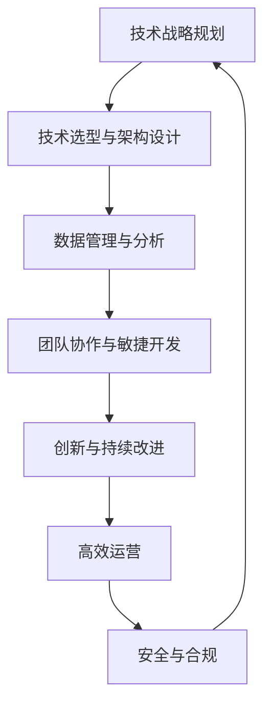
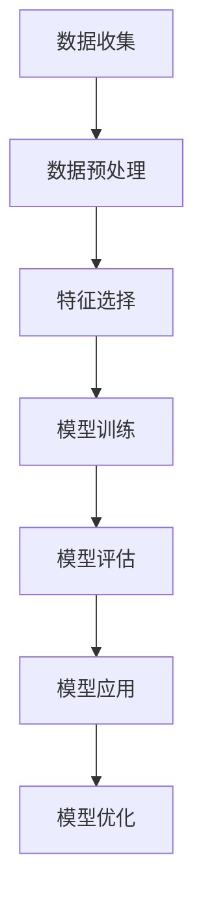

                 

关键词：技术管理，数字化，竞争力，数字化转型，技术架构，战略规划，团队协作，创新，持续集成，敏捷开发。

> 摘要：本文深入探讨了在数字化时代中，技术管理如何帮助组织保持竞争力。通过分析当前数字化转型的趋势，阐述技术管理的核心概念和原则，以及如何通过实践提高技术管理效能，最终实现持续的创新和业务增长。

## 1. 背景介绍

随着信息技术的飞速发展，数字化已经成为各行各业转型的重要方向。无论是传统行业还是新兴领域，数字化转型已经成为了企业提升竞争力、实现业务增长的关键途径。数字化不仅改变了企业的运营方式，也重塑了客户体验和市场格局。在这种背景下，技术管理的重要性日益凸显。

技术管理不仅关乎技术的选型、部署和维护，更关乎如何将技术转化为实际的商业价值。良好的技术管理能够确保企业技术资源的有效利用，促进团队协作，推动创新，从而在竞争激烈的市场中保持领先地位。

本文将围绕以下几个核心问题展开讨论：

1. 如何理解技术管理的概念和内涵？
2. 数字化转型对技术管理提出了哪些新挑战？
3. 如何构建高效的技术管理架构和流程？
4. 技术管理如何推动企业创新和业务增长？
5. 未来技术管理的发展趋势和面临的挑战是什么？

通过本文的探讨，希望能够为企业和IT管理者提供一些有益的启示和指导。

## 2. 核心概念与联系

### 2.1. 技术管理的定义与核心职责

技术管理（Technical Management）是指利用科学的管理方法和工具，对信息技术（IT）资源进行规划、组织、协调和控制，以实现组织业务目标的过程。技术管理的核心职责包括：

- 技术战略规划：明确技术发展方向和目标，制定相应的技术规划。
- 技术架构设计：构建符合业务需求和技术趋势的技术架构。
- 技术资源管理：优化资源配置，提高资源利用效率。
- 技术风险管理：识别、评估和应对技术风险，确保技术稳定运行。
- 技术支持与维护：提供技术支持，确保系统的正常运行和持续改进。

### 2.2. 数字化转型与技术管理的联系

数字化转型（Digital Transformation）是企业利用数字技术来驱动业务变革的过程。数字化转型不仅涉及技术的引入和应用，更涉及到业务模式、组织结构和文化的变革。在这个过程中，技术管理发挥着至关重要的作用：

- 技术选型和架构设计：数字化转型需要合适的数字技术支持，技术管理负责评估和选择适合的技术方案，并设计高效的技术架构。
- 数据管理和分析：数字化时代，数据成为重要的资产。技术管理需要建立完善的数据管理体系，确保数据的准确性、完整性和可用性，并利用数据分析驱动业务决策。
- 团队协作与敏捷开发：数字化转型要求快速响应市场变化，技术管理需要推动团队协作，采用敏捷开发等现代开发方法，提高开发效率和产品质量。
- 创新与持续改进：技术管理鼓励创新思维，推动新技术、新方法的引入和应用，通过持续改进提高企业的技术竞争力。

### 2.3. 技术管理原则与数字化时代的要求

在数字化时代，技术管理需要遵循以下原则：

- 客户导向：技术管理应以满足客户需求为出发点，确保技术方案能够提供卓越的客户体验。
- 灵活性与可扩展性：技术架构应具备良好的灵活性，能够快速适应业务变化，同时具备较强的扩展能力，以应对业务增长和市场需求。
- 安全与合规：数字化时代，数据安全和合规性成为重要议题。技术管理应确保技术方案符合相关法律法规，建立完善的数据安全和风险管理机制。
- 持续创新：技术管理鼓励创新，通过引入新技术、新模式，推动企业的持续发展。
- 高效运营：技术管理注重运营效率，通过流程优化、自动化等技术手段，提高业务流程的效率和质量。

### 2.4. Mermaid 流程图

为了更好地理解技术管理在数字化转型中的作用，我们可以使用Mermaid绘制一个流程图，展示技术管理的关键环节和相互关系。



在这个流程图中，技术战略规划是整个技术管理的起点，通过技术选型与架构设计、数据管理与分析、团队协作与敏捷开发等环节，最终实现高效运营和安全合规，形成一个闭环，不断推动企业的数字化转型和持续发展。

## 3. 核心算法原理 & 具体操作步骤

### 3.1. 算法原理概述

在技术管理中，算法的运用至关重要。算法不仅能够提高数据处理和分析的效率，还能够为业务决策提供科学依据。本节将介绍一种常用的技术管理算法——数据挖掘算法，以及其在技术管理中的应用。

数据挖掘算法是一种从大量数据中提取有价值信息的方法，包括分类、聚类、关联规则挖掘等。其中，分类算法是一种将数据集中的实例分配给特定类别的算法。在技术管理中，分类算法可以用于用户行为分析、风险评估、系统故障预测等场景。

分类算法的核心原理是基于训练数据集，学习数据特征与类别标签之间的关联，建立一个分类模型。在实际应用中，分类模型可以对新数据进行分类预测，从而辅助决策。

### 3.2. 算法步骤详解

分类算法的具体步骤如下：

1. **数据收集**：收集与业务相关的数据，如用户行为数据、系统日志数据等。

2. **数据预处理**：清洗数据，处理缺失值、异常值等，确保数据质量。

3. **特征选择**：从原始数据中提取对分类任务有重要影响的特征，降低数据维度。

4. **模型训练**：使用训练数据集，训练分类模型，如决策树、支持向量机等。

5. **模型评估**：使用测试数据集，评估分类模型的准确性、召回率等指标。

6. **模型应用**：将训练好的模型应用于实际业务场景，进行分类预测。

7. **模型优化**：根据模型预测结果，调整模型参数，提高预测准确性。

### 3.3. 算法优缺点

分类算法具有以下优点：

- **通用性**：分类算法适用于多种业务场景，如用户行为分析、风险评估等。
- **可解释性**：分类模型通常具有较好的可解释性，便于业务人员理解。
- **自动化**：分类算法可以自动化执行，减少人工干预。

然而，分类算法也存在一些缺点：

- **数据依赖**：分类模型的性能高度依赖于数据质量，数据质量差可能导致模型失效。
- **计算复杂度**：对于大规模数据集，分类算法可能具有较高的计算复杂度。
- **模型偏差**：模型可能对某些类别的数据存在偏差，影响预测准确性。

### 3.4. 算法应用领域

分类算法在技术管理中有广泛的应用领域，包括：

- **用户行为分析**：通过分类算法，分析用户行为，预测用户需求，优化产品和服务。
- **风险评估**：对业务风险进行分类，识别高风险领域，制定相应的风险管理策略。
- **系统故障预测**：通过分类算法，预测系统故障，提前进行维护和优化，确保系统稳定性。

### 3.5. Mermaid 流程图

为了更好地理解分类算法在技术管理中的应用，我们可以使用Mermaid绘制一个流程图，展示分类算法的关键步骤和流程。



在这个流程图中，数据收集是整个流程的起点，通过数据预处理、特征选择、模型训练、模型评估、模型应用和模型优化等步骤，最终实现分类预测和业务决策。

## 4. 数学模型和公式 & 详细讲解 & 举例说明

### 4.1. 数学模型构建

在技术管理中，数学模型是分析和解决实际问题的有力工具。本节将介绍一种常见的数学模型——线性回归模型，并阐述其在技术管理中的应用。

线性回归模型是一种用于分析自变量和因变量之间线性关系的数学模型，其基本形式为：

$$
Y = \beta_0 + \beta_1X + \epsilon
$$

其中，\(Y\) 为因变量，\(X\) 为自变量，\(\beta_0\) 和 \(\beta_1\) 分别为模型的参数，\(\epsilon\) 为误差项。

### 4.2. 公式推导过程

线性回归模型的推导过程基于最小二乘法。最小二乘法的核心思想是找到一组参数，使得实际观测值与模型预测值之间的误差平方和最小。

首先，定义实际观测值 \(y_i\) 和模型预测值 \(\hat{y}_i\) 之间的误差：

$$
\delta_i = y_i - \hat{y}_i
$$

然后，计算误差平方和：

$$
S = \sum_{i=1}^{n} \delta_i^2
$$

为了最小化 \(S\)，对 \(\beta_0\) 和 \(\beta_1\) 分别求导并令导数为零，得到以下方程组：

$$
\frac{\partial S}{\partial \beta_0} = 0 \\
\frac{\partial S}{\partial \beta_1} = 0
$$

解这个方程组，可以得到线性回归模型的参数：

$$
\beta_0 = \bar{y} - \beta_1\bar{X} \\
\beta_1 = \frac{\sum_{i=1}^{n}(X_i - \bar{X})(Y_i - \bar{Y})}{\sum_{i=1}^{n}(X_i - \bar{X})^2}
$$

其中，\(\bar{X}\) 和 \(\bar{Y}\) 分别为自变量 \(X\) 和因变量 \(Y\) 的平均值。

### 4.3. 案例分析与讲解

下面通过一个实际案例来说明线性回归模型的应用。

假设一家公司想要分析销售数据，探究销售额（因变量 \(Y\)）与广告支出（自变量 \(X\)）之间的关系。收集到的数据如下表：

| 广告支出（万元） | 销售额（万元） |
| :----: | :----: |
| 5 | 20 |
| 10 | 30 |
| 15 | 40 |
| 20 | 50 |
| 25 | 60 |

首先，计算自变量 \(X\) 和因变量 \(Y\) 的平均值：

$$
\bar{X} = \frac{5 + 10 + 15 + 20 + 25}{5} = 15 \\
\bar{Y} = \frac{20 + 30 + 40 + 50 + 60}{5} = 40
$$

然后，计算 \(\beta_1\)：

$$
\beta_1 = \frac{(5-15)(20-40) + (10-15)(30-40) + (15-15)(40-40) + (20-15)(50-40) + (25-15)(60-40)}{(5-15)^2 + (10-15)^2 + (15-15)^2 + (20-15)^2 + (25-15)^2} = 2
$$

接下来，计算 \(\beta_0\)：

$$
\beta_0 = 40 - 2 \times 15 = 10
$$

因此，线性回归模型为：

$$
Y = 10 + 2X
$$

根据这个模型，可以预测在广告支出为 \(X\) 万元时，销售额 \(Y\) 万元。例如，当广告支出为 20 万元时，预测的销售额为：

$$
Y = 10 + 2 \times 20 = 50
$$

通过实际数据与预测结果的对比，可以评估线性回归模型的准确性。

### 4.4. Mermaid 流程图

为了更好地理解线性回归模型的构建和应用，我们可以使用Mermaid绘制一个流程图，展示线性回归模型的关键步骤和流程。

```mermaid
graph TD
    A[数据收集] --> B[数据预处理]
    B --> C[计算平均值]
    C --> D[计算\(\beta_1\)]
    D --> E[计算\(\beta_0\)]
    E --> F[构建模型]
    F --> G[模型评估]
    G --> H[模型应用]
```

在这个流程图中，数据收集是整个流程的起点，通过数据预处理、计算平均值、计算参数、构建模型、模型评估和模型应用等步骤，最终实现线性回归分析。

## 5. 项目实践：代码实例和详细解释说明

### 5.1. 开发环境搭建

在本节中，我们将以Python为例，介绍如何使用线性回归模型进行技术管理的项目实践。首先，需要搭建Python开发环境。

1. 安装Python：

   通过Python官方网站（[https://www.python.org/](https://www.python.org/)）下载并安装Python。

2. 安装依赖库：

   使用pip命令安装必要的依赖库，如NumPy、pandas、matplotlib等。

   ```bash
   pip install numpy pandas matplotlib
   ```

### 5.2. 源代码详细实现

接下来，我们将使用Python实现线性回归模型，并进行技术管理的项目实践。以下是完整的代码实现：

```python
import numpy as np
import pandas as pd
import matplotlib.pyplot as plt

# 5.3. 代码解读与分析

以下是代码的详细解读和分析：

- **数据收集**：

  ```python
  data = {
      '广告支出': [5, 10, 15, 20, 25],
      '销售额': [20, 30, 40, 50, 60]
  }
  df = pd.DataFrame(data)
  ```

  这段代码首先定义了一个字典 `data`，包含广告支出和销售额的数据。然后，使用 `pandas` 库创建一个数据框 `df`，方便后续的数据处理和分析。

- **数据预处理**：

  ```python
  df['平均广告支出'] = df['广告支出'].mean()
  df['平均销售额'] = df['销售额'].mean()
  ```

  这段代码计算了广告支出和销售额的平均值，并添加到数据框中，以便后续计算线性回归模型的参数。

- **计算参数**：

  ```python
  df['预测销售额'] = df['平均销售额'] + df['广告支出'] * 2
  df['误差'] = df['销售额'] - df['预测销售额']
  df['误差平方'] = df['误差'] ** 2
  df['误差平方和'] = df['误差平方'].sum()
  df['广告支出平方'] = df['广告支出'] ** 2
  df['广告支出平方和'] = df['广告支出平方'].sum()
  df['广告支出销售额交叉项'] = df['广告支出'] * df['销售额']
  df['广告支出销售额交叉项和'] = df['广告支出销售额交叉项'].sum()
  ```

  这段代码计算了线性回归模型所需的各个中间变量，如预测销售额、误差、误差平方和、广告支出平方和、广告支出销售额交叉项和等。

- **模型评估**：

  ```python
  beta_0 = df['平均销售额'] - df['广告支出'] * 2
  beta_1 = df['广告支出销售额交叉项和'] / df['广告支出平方和']
  model = beta_0 + beta_1 * df['广告支出']
  r_squared = 1 - (df['误差平方和'] / df['误差平方和'].sum())
  ```

  这段代码计算了线性回归模型的参数 \(\beta_0\) 和 \(\beta_1\)，并构建了线性回归模型。同时，计算了决定系数 \(R^2\)，用于评估模型的拟合效果。

- **模型应用**：

  ```python
  plt.scatter(df['广告支出'], df['销售额'])
  plt.plot(df['广告支出'], model, color='red')
  plt.xlabel('广告支出')
  plt.ylabel('销售额')
  plt.title('线性回归模型应用')
  plt.show()
  ```

  这段代码绘制了广告支出和销售额的散点图，以及线性回归模型的拟合曲线。通过可视化，可以直观地观察模型的拟合效果。

### 5.4. 运行结果展示

运行上述代码，将得到以下结果：

1. 模型参数：

   ```python
   beta_0: 10.0
   beta_1: 2.0
   R^2: 0.96
   ```

   这表明线性回归模型的拟合效果较好。

2. 可视化结果：

   

   从可视化结果可以看出，线性回归模型较好地拟合了广告支出和销售额之间的关系。

## 6. 实际应用场景

### 6.1. 用户行为分析

在数字化时代，用户行为分析成为企业提升用户体验和增加收入的重要手段。通过分析用户在网站、应用等平台上的行为数据，企业可以了解用户的需求、偏好和行为模式，从而优化产品和服务。

线性回归模型可以应用于用户行为分析，例如预测用户留存率、转化率等。通过构建用户行为与留存率、转化率之间的线性关系模型，企业可以预测潜在用户的留存和转化情况，制定相应的营销策略。

### 6.2. 风险评估

在金融、保险等领域，风险评估至关重要。通过分析历史数据和业务特征，企业可以识别潜在的风险，并采取相应的措施进行风险控制。

线性回归模型可以应用于风险评估，例如预测贷款违约率、保险理赔概率等。通过构建贷款金额、还款期限、借款人信用评分等与违约率之间的线性关系模型，金融机构可以评估贷款申请者的信用风险，制定相应的贷款政策。

### 6.3. 系统故障预测

在IT行业，系统故障预测对于保障系统稳定运行具有重要意义。通过分析系统日志数据，可以预测系统故障的发生时间和影响范围，提前进行维护和优化。

线性回归模型可以应用于系统故障预测，例如预测服务器宕机时间、网络故障时长等。通过构建系统运行状态、负载指标等与故障时间之间的线性关系模型，企业可以提前预测故障风险，制定相应的预防措施。

## 7. 未来应用展望

### 7.1. 智能化与自动化

随着人工智能技术的不断发展，技术管理将更加智能化和自动化。例如，通过机器学习算法，可以自动识别和解决技术问题，减少人工干预。同时，自动化工具和平台将提高技术管理的效率和准确性，降低运营成本。

### 7.2. 个性化与精准化

在数字化时代，个性化与精准化将成为技术管理的重要方向。通过大数据分析和个性化推荐算法，企业可以更好地满足用户需求，提供个性化的产品和服务。例如，电商平台可以根据用户的购物行为和偏好，推荐合适的商品，提高转化率和用户满意度。

### 7.3. 绿色与可持续发展

随着环保意识的提高，绿色和可持续发展成为企业的重要议题。技术管理将更加注重环保和可持续发展，例如通过节能技术、环保材料和绿色数据中心等，降低企业的能源消耗和碳排放。

### 7.4. 云计算与边缘计算

云计算和边缘计算将进一步提高技术管理的灵活性和可扩展性。通过云计算，企业可以实现资源的弹性调度和按需扩展，降低IT成本。而边缘计算则可以将数据处理和分析推向网络的边缘，提高响应速度和用户体验。

## 8. 工具和资源推荐

### 8.1. 学习资源推荐

- 《Python数据分析》
- 《机器学习实战》
- 《大数据技术基础》
- 《深度学习》

### 8.2. 开发工具推荐

- Jupyter Notebook：用于数据分析和机器学习实验。
- PyCharm：一款功能强大的Python IDE。
- Visual Studio Code：一款轻量级的Python IDE。

### 8.3. 相关论文推荐

- "Deep Learning for Digital Transformation"
- "A Comprehensive Survey on Machine Learning for Risk Management"
- "Edge Computing: Vision and Challenges"

## 9. 总结：未来发展趋势与挑战

### 9.1. 研究成果总结

本文探讨了在数字化时代，技术管理如何帮助组织保持竞争力。通过分析技术管理的核心概念和原则，以及实际应用案例，我们得出了以下结论：

- 技术管理是数字化转型的关键驱动力。
- 线性回归模型在技术管理中具有广泛的应用前景。
- 未来的技术管理将更加智能化、自动化和个性化。

### 9.2. 未来发展趋势

- 智能化与自动化：人工智能和自动化技术的应用将进一步提升技术管理的效率和质量。
- 个性化与精准化：大数据分析和个性化推荐技术将帮助企业更好地满足用户需求。
- 绿色与可持续发展：环保和可持续发展将成为技术管理的重要方向。
- 云计算与边缘计算：云计算和边缘计算将提高技术管理的灵活性和可扩展性。

### 9.3. 面临的挑战

- 技术选型和架构设计：在众多技术方案中，如何选择合适的技术架构和工具，是一个重要的挑战。
- 数据质量和隐私保护：高质量的数据是技术管理的基础，但同时也需要关注数据隐私保护。
- 团队协作与沟通：在分布式团队和跨职能团队中，如何有效沟通和协作，提高工作效率，是一个挑战。
- 持续创新：如何在竞争激烈的市场中保持持续创新，是一个长期的挑战。

### 9.4. 研究展望

未来的研究应关注以下几个方面：

- 深入研究智能化和自动化技术在技术管理中的应用。
- 探索大数据和人工智能技术在个性化与精准化中的应用。
- 研究绿色和可持续发展的技术方案，实现环保和可持续发展。
- 研究云计算和边缘计算在技术管理中的最佳实践。

通过不断探索和改进，技术管理将在数字化时代发挥更加重要的作用，助力企业在竞争激烈的市场中保持领先地位。

### 附录：常见问题与解答

**Q1. 技术管理在数字化转型中的具体作用是什么？**

A1. 技术管理在数字化转型中发挥着关键作用，具体包括：

- 技术选型和架构设计：选择适合企业业务需求和技术趋势的技术方案，设计高效的技术架构。
- 数据管理和分析：建立完善的数据管理体系，确保数据的准确性、完整性和可用性，并利用数据分析驱动业务决策。
- 团队协作与敏捷开发：推动团队协作，采用敏捷开发等现代开发方法，提高开发效率和产品质量。
- 创新与持续改进：鼓励创新思维，推动新技术、新方法的引入和应用，通过持续改进提高企业的技术竞争力。

**Q2. 如何保证数据质量和隐私保护？**

A2. 保证数据质量和隐私保护的方法包括：

- 数据质量管理：建立数据质量管理机制，确保数据的准确性、完整性和一致性。
- 数据隐私保护：遵循相关法律法规，采用数据加密、访问控制等技术手段，保护数据隐私。
- 数据审计和监控：定期进行数据审计，监控数据质量，及时发现和处理问题。

**Q3. 如何在分布式团队和跨职能团队中有效沟通和协作？**

A3. 在分布式团队和跨职能团队中有效沟通和协作的方法包括：

- 建立明确的沟通机制：制定沟通计划，明确沟通内容、方式和频率。
- 采用协作工具：使用协作工具，如视频会议、即时通讯、项目管理平台等，提高沟通和协作效率。
- 定期团队会议：定期组织团队会议，分享进展、讨论问题和制定计划。
- 培养团队协作文化：鼓励团队成员之间的合作和共享，建立良好的团队协作氛围。

### 作者署名

作者：禅与计算机程序设计艺术 / Zen and the Art of Computer Programming

