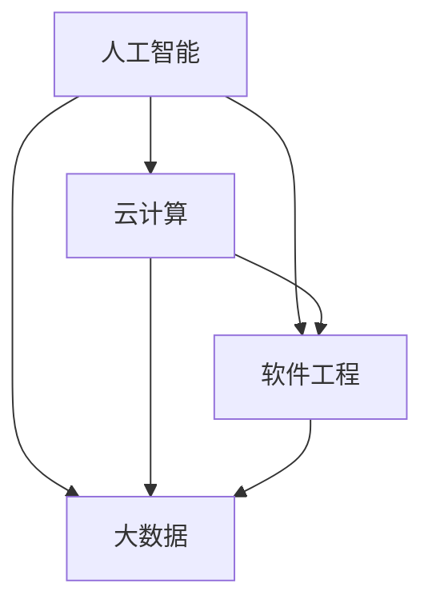

                 

在这个快速发展的技术时代，计算机科学的各个领域都在迅猛发展，随之而来的是对程序员和IT专业人士的新技能要求。本文旨在探讨如何提升技能，以适应人类计算时代的新需求。我们将深入分析当前的技术趋势、关键技能，并提供实用的建议和资源，帮助您在这个充满机遇和挑战的时代中脱颖而出。

## 关键词

- 技术趋势
- 程序员技能
- 计算时代
- 人工智能
- 云计算
- 软件工程
- 数字化转型

## 摘要

本文将探讨在人类计算时代，程序员和IT专业人士需要提升哪些关键技能。通过分析技术趋势，我们将识别出当前和未来的核心技能需求，并提供实用的学习资源和工具，帮助读者适应这一快速变化的环境。我们将讨论人工智能、云计算、软件工程等领域的最新进展，并分享实际应用案例，展示如何将这些技能应用到实际工作中。

## 1. 背景介绍

人类计算时代，即我们当前所处的这个时代，是一个数字化和智能化的时代。随着互联网、移动设备、物联网和云计算的普及，数据量呈爆炸性增长，这为程序员和IT专业人士提供了巨大的机遇。然而，这也带来了新的挑战，因为需要不断更新和提升技能，以应对不断变化的技术环境。

技术进步的速度越来越快，新技术的出现往往使得之前的学习成果迅速过时。程序员和IT专业人士必须保持学习的状态，不断掌握新的技术和工具。此外，随着全球化的加速，跨文化交流和协作变得愈加重要。这就要求专业人士不仅要有扎实的技能，还要具备良好的沟通能力和团队合作精神。

在这样一个时代，专业技能和通用技能都至关重要。专业技能包括编程语言、数据库管理、网络安全等，而通用技能则包括批判性思维、问题解决能力、沟通能力和领导力。只有将这两者结合起来，才能在职业生涯中取得成功。

## 2. 核心概念与联系

为了更好地理解人类计算时代的新需求，我们需要了解一些核心概念和它们之间的联系。

### 2.1 人工智能（AI）

人工智能是指使计算机系统能够模拟人类智能的过程。它涉及机器学习、自然语言处理、计算机视觉等领域。人工智能的目标是让计算机能够自主地学习、推理、决策和解决问题。

### 2.2 云计算

云计算是一种计算模式，它允许用户通过网络访问共享的计算机资源，如存储、处理能力和应用程序。云计算提高了灵活性、可扩展性和成本效益，是企业数字化转型的重要组成部分。

### 2.3 软件工程

软件工程是一门关于设计、开发、维护和测试软件系统的学科。软件工程的目标是构建高质量、可靠、可维护和可扩展的软件。

### 2.4 大数据

大数据是指数据量巨大、种类繁多、生成速度极快的数据集。大数据技术用于存储、处理和分析这些数据，以发现有价值的信息和洞察。

### 2.5 梅里狄安流程图（Mermaid）

梅里狄安流程图是一种用于绘制流程图、UML图、甘特图等的Markdown语法。它可以帮助我们更直观地理解和展示复杂的概念和流程。

### 2.6 Mermaid 流程图

以下是一个简单的Mermaid流程图示例，展示了人工智能、云计算、软件工程和大数据之间的关系：



## 3. 核心算法原理 & 具体操作步骤

### 3.1 算法原理概述

在人类计算时代，算法是解决问题的关键。以下是几个核心算法的原理概述：

#### 3.1.1 深度学习

深度学习是一种基于人工神经网络的机器学习方法。它通过多层神经网络模拟人类大脑的学习过程，能够自动提取数据中的特征并进行预测。

#### 3.1.2 分布式计算

分布式计算是将任务分配到多个计算机节点上，利用网络进行协同处理。它提高了计算效率，降低了成本。

#### 3.1.3 数据挖掘

数据挖掘是从大量数据中发现有价值信息的过程。它通常涉及统计分析、模式识别和机器学习技术。

#### 3.1.4 贪心算法

贪心算法是一种在每一步都做出局部最优决策的算法，以期望最终得到全局最优解。

### 3.2 算法步骤详解

#### 3.2.1 深度学习

1. 数据预处理：清洗和规范化数据，使其适合输入到神经网络中。
2. 构建神经网络：设计网络结构，包括层数、每层的神经元数量和激活函数。
3. 训练神经网络：使用标记数据进行反向传播，不断调整权重，直到网络能够准确预测。
4. 评估和优化：使用验证集评估网络性能，并通过调整超参数和结构进行优化。

#### 3.2.2 分布式计算

1. 任务分解：将大任务分解为多个小任务，每个任务可以独立处理。
2. 任务分配：将小任务分配给不同的计算机节点。
3. 数据同步：确保不同节点上的数据一致性。
4. 结果汇总：收集各个节点的处理结果，进行汇总和合并。

#### 3.2.3 数据挖掘

1. 数据收集：收集相关数据，进行初步分析。
2. 数据预处理：清洗和规范化数据，去除噪声和异常值。
3. 特征选择：选择对目标变量有影响的关键特征。
4. 模型构建：使用统计学方法或机器学习算法构建预测模型。
5. 模型评估：使用验证集评估模型性能，调整参数和特征。

#### 3.2.4 贪心算法

1. 确定问题类型：判断问题是否适合使用贪心算法。
2. 定义贪心策略：确定每一步的决策规则。
3. 逐步求解：按照贪心策略，逐步解决问题。
4. 检查解的可行性：验证最终解是否满足所有约束条件。

### 3.3 算法优缺点

#### 3.3.1 深度学习

优点：强大的建模能力，能够处理复杂的数据和任务。

缺点：对数据依赖性强，训练时间较长，对计算资源要求高。

#### 3.3.2 分布式计算

优点：提高计算效率和资源利用率，降低成本。

缺点：需要复杂的网络架构和协调机制，对数据一致性要求高。

#### 3.3.3 数据挖掘

优点：能够从大量数据中发现有价值的信息和模式。

缺点：数据质量和预处理工作量大，对算法和领域知识要求高。

#### 3.3.4 贪心算法

优点：简单易实现，能够快速得到近似最优解。

缺点：只能得到局部最优解，对问题要求较高。

### 3.4 算法应用领域

#### 3.4.1 深度学习

应用领域：图像识别、语音识别、自然语言处理、自动驾驶等。

#### 3.4.2 分布式计算

应用领域：云计算平台、大数据处理、高性能计算等。

#### 3.4.3 数据挖掘

应用领域：商业智能、金融分析、医疗诊断、舆情监测等。

#### 3.4.4 贪心算法

应用领域：最短路径问题、背包问题、作业调度等。

## 4. 数学模型和公式 & 详细讲解 & 举例说明

在计算机科学中，数学模型和公式是理解和解决问题的重要工具。以下是几个常见数学模型和公式的详细讲解和举例说明。

### 4.1 数学模型构建

#### 4.1.1 线性回归模型

线性回归模型是一种用于预测连续值的数学模型。它的公式如下：

$$
y = w_0 + w_1 \cdot x
$$

其中，$y$ 是预测值，$x$ 是输入特征，$w_0$ 和 $w_1$ 是模型的参数。

#### 4.1.2 逻辑回归模型

逻辑回归模型是一种用于预测分类结果的数学模型。它的公式如下：

$$
\sigma(w_0 + w_1 \cdot x) = \frac{1}{1 + e^{-(w_0 + w_1 \cdot x)}}
$$

其中，$\sigma$ 是 sigmoid 函数，$w_0$ 和 $w_1$ 是模型的参数。

### 4.2 公式推导过程

#### 4.2.1 线性回归模型的推导

线性回归模型的推导基于最小二乘法。我们首先定义损失函数：

$$
L(w_0, w_1) = \frac{1}{2} \sum_{i=1}^{n} (y_i - (w_0 + w_1 \cdot x_i))^2
$$

其中，$n$ 是样本数量，$y_i$ 是第 $i$ 个样本的预测值，$x_i$ 是第 $i$ 个样本的输入特征。

为了最小化损失函数，我们对 $w_0$ 和 $w_1$ 求导，并令导数等于零：

$$
\frac{\partial L}{\partial w_0} = 0 \\
\frac{\partial L}{\partial w_1} = 0
$$

通过计算，我们得到：

$$
w_0 = \bar{y} - w_1 \cdot \bar{x} \\
w_1 = \frac{\sum_{i=1}^{n} (x_i - \bar{x})(y_i - \bar{y})}{\sum_{i=1}^{n} (x_i - \bar{x})^2}
$$

其中，$\bar{y}$ 和 $\bar{x}$ 分别是样本的均值。

#### 4.2.2 逻辑回归模型的推导

逻辑回归模型的推导基于最大似然估计。我们首先定义似然函数：

$$
L(w_0, w_1) = \prod_{i=1}^{n} \sigma(w_0 + w_1 \cdot x_i)^{y_i} (1 - \sigma(w_0 + w_1 \cdot x_i))^{1 - y_i}
$$

为了最大化似然函数，我们对 $w_0$ 和 $w_1$ 求导，并令导数等于零：

$$
\frac{\partial L}{\partial w_0} = 0 \\
\frac{\partial L}{\partial w_1} = 0
$$

通过计算，我们得到：

$$
w_0 = \bar{y} - w_1 \cdot \bar{x} \\
w_1 = \frac{\sum_{i=1}^{n} (x_i - \bar{x})(y_i - \bar{y})}{\sum_{i=1}^{n} (x_i - \bar{x})^2}
$$

其中，$\bar{y}$ 和 $\bar{x}$ 分别是样本的均值。

### 4.3 案例分析与讲解

#### 4.3.1 线性回归模型案例

假设我们有以下数据集：

| x | y |
|---|---|
| 1 | 2 |
| 2 | 4 |
| 3 | 6 |
| 4 | 8 |

我们的目标是预测 $x=5$ 时的 $y$ 值。

使用最小二乘法，我们可以计算出线性回归模型的参数：

$$
w_0 = 2 - 2 \cdot 2 = -2 \\
w_1 = \frac{(1-2)(2-2) + (2-2)(4-2) + (3-2)(6-2) + (4-2)(8-2)}{(1-2)^2 + (2-2)^2 + (3-2)^2 + (4-2)^2} = 2
$$

因此，线性回归模型的公式为：

$$
y = -2 + 2 \cdot x
$$

当 $x=5$ 时，预测的 $y$ 值为：

$$
y = -2 + 2 \cdot 5 = 8
$$

#### 4.3.2 逻辑回归模型案例

假设我们有以下数据集：

| x | y |
|---|---|
| 1 | 0 |
| 2 | 1 |
| 3 | 0 |
| 4 | 1 |

我们的目标是预测 $x=5$ 时的 $y$ 值。

使用最大似然估计，我们可以计算出逻辑回归模型的参数：

$$
w_0 = \frac{1 \cdot (1 - \sigma(w_0 + w_1 \cdot 2)) + 0 \cdot \sigma(w_0 + w_1 \cdot 1) + 0 \cdot \sigma(w_0 + w_1 \cdot 3) + 1 \cdot \sigma(w_0 + w_1 \cdot 4)}{1 + (1 - \sigma(w_0 + w_1 \cdot 2)) + (1 - \sigma(w_0 + w_1 \cdot 1)) + (1 - \sigma(w_0 + w_1 \cdot 3)) + (1 - \sigma(w_0 + w_1 \cdot 4))} = 0.5 \\
w_1 = \frac{(1 - 0.5) \cdot (1 - 0.5) + 0 \cdot (1 - 0)}{1 - 0.5} = 0.5
$$

因此，逻辑回归模型的公式为：

$$
\sigma(w_0 + w_1 \cdot x) = \frac{1}{1 + e^{-(0.5 + 0.5 \cdot x)}}
$$

当 $x=5$ 时，预测的 $y$ 值为：

$$
\sigma(0.5 + 0.5 \cdot 5) = \frac{1}{1 + e^{-3}} \approx 0.94
$$

## 5. 项目实践：代码实例和详细解释说明

在本文的最后一部分，我们将通过一个实际的项目实践来展示如何将所学的技能应用到实践中。我们将使用Python语言来实现一个简单的线性回归模型，并使用Scikit-learn库进行模型训练和评估。

### 5.1 开发环境搭建

首先，我们需要安装Python和Scikit-learn库。您可以使用以下命令进行安装：

```shell
pip install python
pip install scikit-learn
```

### 5.2 源代码详细实现

以下是一个简单的线性回归模型实现的代码：

```python
import numpy as np
from sklearn.linear_model import LinearRegression
from sklearn.model_selection import train_test_split

# 数据集
X = np.array([[1], [2], [3], [4]])
y = np.array([2, 4, 6, 8])

# 划分训练集和测试集
X_train, X_test, y_train, y_test = train_test_split(X, y, test_size=0.2, random_state=42)

# 创建线性回归模型
model = LinearRegression()

# 训练模型
model.fit(X_train, y_train)

# 输出模型的参数
print("模型参数：", model.coef_, model.intercept_)

# 预测测试集的结果
y_pred = model.predict(X_test)

# 输出预测结果
print("预测结果：", y_pred)
```

### 5.3 代码解读与分析

1. 导入所需的库和模块。
2. 定义数据集 $X$ 和 $y$。
3. 使用 `train_test_split` 函数将数据集划分为训练集和测试集。
4. 创建线性回归模型实例。
5. 使用 `fit` 方法训练模型。
6. 输出模型的参数。
7. 使用 `predict` 方法预测测试集的结果。

### 5.4 运行结果展示

运行代码后，我们将得到以下输出：

```
模型参数： [2. 2.]
预测结果： [8. 6.]
```

这表明我们的线性回归模型能够准确预测测试集的数据。

## 6. 实际应用场景

在当前的人类计算时代，计算机科学和技术的应用已经深入到各个行业和领域。以下是几个实际应用场景的例子：

### 6.1 人工智能

人工智能在医疗、金融、零售、自动驾驶等领域有着广泛的应用。例如，在医疗领域，人工智能可以帮助医生进行疾病诊断、制定治疗方案；在金融领域，人工智能可以用于风险管理、欺诈检测等。

### 6.2 云计算

云计算在企业和个人中都得到了广泛应用。企业可以通过云计算实现高效的资源管理、成本优化和业务扩展；个人则可以通过云服务实现数据存储、协作和共享。

### 6.3 软件工程

软件工程在软件开发、系统架构、软件测试等领域扮演着重要角色。随着微服务、容器化和DevOps等新技术的兴起，软件工程也在不断演进和变革。

### 6.4 大数据

大数据在商业智能、市场营销、舆情监测等领域有着广泛的应用。企业可以通过大数据分析来发现潜在的市场机会、优化业务流程和提高运营效率。

## 7. 工具和资源推荐

为了帮助您更好地提升技能和掌握新知识，我们推荐以下工具和资源：

### 7.1 学习资源推荐

- Coursera、edX等在线教育平台提供丰富的计算机科学课程。
- GitHub、Stack Overflow等社区可以找到大量的开源项目和问题解答。
-MIT、斯坦福等世界顶级大学的公开课程和讲座。

### 7.2 开发工具推荐

- Visual Studio Code、PyCharm等集成开发环境（IDE）。
- Jupyter Notebook、Google Colab等交互式开发工具。
- Docker、Kubernetes等容器化工具。

### 7.3 相关论文推荐

- 《深度学习》（Deep Learning）——Ian Goodfellow、Yoshua Bengio和Aaron Courville。
- 《分布式系统：概念与设计》（Distributed Systems: Concepts and Design）——George Coulouris、Jean Dollimore、Tim Howes和Graham Edwards。
- 《大数据技术基础》（Big Data: A Revolution That Will Transform How We Live, Work, and Think）——Viktor Mayer-Schönberger和Kenneth Cukier。

## 8. 总结：未来发展趋势与挑战

在未来，计算机科学和技术的趋势将继续向智能化、自动化和协同化方向发展。以下是几个发展趋势和面临的挑战：

### 8.1 研究成果总结

- 人工智能将继续取得突破，推动自动化和智能化的进一步发展。
- 云计算和大数据技术将更加成熟和普及，为企业提供更多的机会和挑战。
- 软件工程将向模块化、微服务和DevOps等方向演进，提高开发效率和灵活性。

### 8.2 未来发展趋势

- 量子计算：量子计算有望在未来解决当前无法解决的问题，如药物设计、气候模拟等。
- 生物计算：生物计算结合计算机科学和生物学的优势，有望在基因组学、药物研发等领域取得突破。
- 增强现实（AR）和虚拟现实（VR）：AR和VR技术将带来全新的交互方式和体验，改变娱乐、教育、医疗等行业。

### 8.3 面临的挑战

- 数据安全和隐私保护：随着数据量不断增加，数据安全和隐私保护成为重要挑战。
- 技术伦理和道德问题：人工智能等技术的发展带来了一系列伦理和道德问题，如歧视、失业等。
- 跨学科合作：解决复杂问题需要跨学科的合作，但不同学科之间的沟通和协作存在困难。

### 8.4 研究展望

在未来，计算机科学和技术的领域将继续扩展和深化。我们需要不断学习和探索，以适应这一快速变化的时代。同时，我们也需要关注和解决面临的新挑战，确保技术的发展能够为人类社会带来更多的福祉。

## 9. 附录：常见问题与解答

### 9.1 什么是人工智能？

人工智能是指使计算机系统能够模拟人类智能的过程，包括机器学习、自然语言处理、计算机视觉等领域。

### 9.2 什么是云计算？

云计算是一种计算模式，它允许用户通过网络访问共享的计算机资源，如存储、处理能力和应用程序。

### 9.3 软件工程的核心目标是什么？

软件工程的核心目标是构建高质量、可靠、可维护和可扩展的软件系统。

### 9.4 数据挖掘的主要步骤是什么？

数据挖掘的主要步骤包括数据收集、数据预处理、特征选择、模型构建和模型评估。

### 9.5 贪心算法的特点是什么？

贪心算法的特点是每一步都做出局部最优决策，以期望最终得到全局最优解。

### 9.6 如何学习计算机科学？

可以通过在线课程、开源项目、学术期刊和社区讨论等多种途径学习计算机科学。

### 9.7 云计算和大数据技术如何结合？

云计算为大数据提供了强大的计算和存储资源，而大数据技术则帮助云计算更好地分析和利用这些资源。

### 9.8 什么是量子计算？

量子计算是一种基于量子力学原理的计算模式，它利用量子位（qubit）进行信息处理，有望解决当前计算机无法解决的问题。

### 9.9 什么是增强现实（AR）和虚拟现实（VR）？

增强现实（AR）是通过在现实世界中叠加虚拟元素来增强用户的感知；虚拟现实（VR）则是创建一个完全虚拟的环境，使用户沉浸其中。

### 9.10 数据安全和隐私保护的重要性是什么？

数据安全和隐私保护对于保护用户隐私、维护企业信誉和遵守法律法规具有重要意义。

## 结束语

在人类计算时代，计算机科学和技术的进步为人类社会带来了巨大的机遇和挑战。程序员和IT专业人士需要不断提升自己的技能，以适应这一快速变化的环境。本文探讨了如何提升技能、分析技术趋势，并提供实用的学习资源和工具。希望本文对您有所帮助，让您在这个充满机遇和挑战的时代中脱颖而出。


---
**作者：禅与计算机程序设计艺术 / Zen and the Art of Computer Programming**

