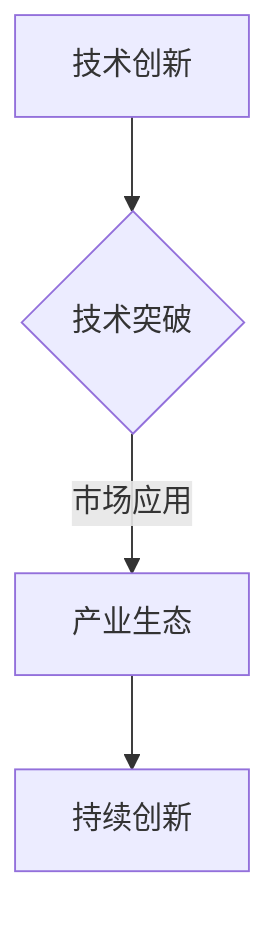
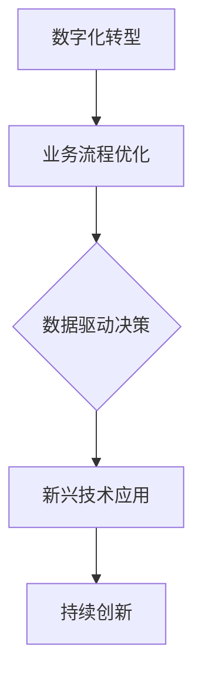
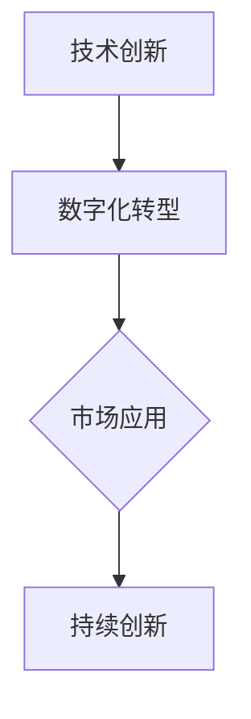

                 

关键词：拐点、技术发展、创新、数字化转型、战略规划

> 摘要：在快速发展的技术领域，拐点往往意味着新的机遇和挑战。本文将探讨拐点在IT领域的重要性，分析如何抓住技术拐点带来的机遇，并阐述在数字化转型过程中如何制定有效的战略规划。

## 1. 背景介绍

### 拐点的定义

在技术领域中，拐点是指某个技术或市场从一种状态突然过渡到另一种状态的关键时刻。这种转变可能是由于技术突破、市场需求变化、政策法规调整等原因引发。拐点往往伴随着创新、增长和变革，它不仅对特定行业产生深远影响，也推动整个经济和社会的发展。

### 技术发展的拐点

历史上，技术发展的拐点层出不穷。例如，计算机的诞生标志着信息时代的到来，互联网的普及使信息传播速度达到前所未有的高度，而移动互联网的发展则让全球连接更加紧密。每个拐点都带来了前所未有的机遇，同时也对现有技术和产业格局产生了巨大的冲击。

### 数字化转型的拐点

随着数字化技术的不断演进，数字化转型已经成为企业发展的必然趋势。数字化转型中的拐点可能来自于新技术的应用、业务模式的创新、市场需求的转变等。抓住数字化转型的拐点，企业可以实现跨越式发展，提升竞争力和市场地位。

## 2. 核心概念与联系

### 技术创新的拐点

技术创新是驱动技术发展的重要动力。在技术创新过程中，拐点通常表现为新技术的突破、市场应用的推广和产业生态的建立。如图所示：



### 数字化转型的拐点

数字化转型中的拐点通常涉及业务流程的优化、数据驱动的决策、新兴技术的应用等方面。如图所示：



### 拐点的关联与互动

技术创新和数字化转型之间存在密切的关联。技术创新为数字化转型提供了基础，而数字化转型则为技术创新提供了应用场景和市场需求。如图所示：



## 3. 核心算法原理 & 具体操作步骤

### 3.1 算法原理概述

拐点识别算法是一种用于分析技术或市场变化的算法。该算法通过分析历史数据、市场趋势和技术发展，预测拐点的出现时间和可能的影响。算法的核心思想是利用机器学习、统计学和信号处理等方法，从数据中提取特征，并构建预测模型。

### 3.2 算法步骤详解

1. 数据收集与预处理

   收集与拐点相关的历史数据，包括技术指标、市场数据、政策法规等。对数据进行清洗、去噪和标准化处理，以便后续分析。

2. 特征提取

   从预处理后的数据中提取关键特征，如增长率、波动性、相关性等。特征提取的目的是提高模型的预测精度和鲁棒性。

3. 模型构建

   利用机器学习算法（如决策树、支持向量机、神经网络等）构建预测模型。模型的选择取决于数据的特征和问题类型。

4. 模型训练与优化

   使用历史数据进行模型训练，并通过交叉验证和网格搜索等方法优化模型参数，以提高预测性能。

5. 拐点预测

   利用训练好的模型对未来的拐点进行预测。预测结果可以用于制定战略规划、优化业务流程等。

### 3.3 算法优缺点

#### 优点：

1. 高效性：算法能够快速识别拐点，为决策提供及时的信息。
2. 精准性：通过机器学习和统计方法，算法具有较高的预测精度。
3. 智能性：算法能够从历史数据中学习，不断优化预测模型。

#### 缺点：

1. 数据依赖：算法的预测性能依赖于数据的完整性和质量。
2. 复杂性：算法的实现和优化过程相对复杂，需要一定的技术基础。

### 3.4 算法应用领域

拐点识别算法广泛应用于金融、医疗、制造业、能源等领域。例如，在金融领域，算法可以用于预测市场波动、识别投资机会；在医疗领域，算法可以用于预测疾病发展、优化治疗方案；在制造业，算法可以用于预测生产故障、优化生产流程。

## 4. 数学模型和公式 & 详细讲解 & 举例说明

### 4.1 数学模型构建

拐点识别算法的数学模型可以基于时间序列分析和机器学习构建。以下是一个简单的时间序列模型：

$$
y_t = f(x_t) + \epsilon_t
$$

其中，$y_t$ 表示第 $t$ 时刻的观测值，$x_t$ 表示与拐点相关的特征值，$f(x_t)$ 表示模型预测的函数，$\epsilon_t$ 表示误差项。

### 4.2 公式推导过程

假设 $x_t$ 是一个连续的随机变量，其概率密度函数为 $p(x)$. 对 $x_t$ 进行概率分布估计，可以使用最大似然估计（MLE）：

$$
\hat{p}(x) = \frac{1}{Z} \exp \left( \sum_{t=1}^T \ln p(y_t | x_t) \right)
$$

其中，$Z$ 是归一化常数，$T$ 是样本数量。

### 4.3 案例分析与讲解

假设我们要预测一个股票市场的拐点。我们可以使用上述模型来构建预测函数。以下是一个简单的示例：

$$
y_t = \sin(x_t) + \epsilon_t
$$

其中，$x_t$ 是时间序列数据，$y_t$ 是股票价格的观测值。

通过最大似然估计，我们可以得到 $x_t$ 的概率分布：

$$
\hat{p}(x) = \frac{1}{Z} \exp \left( \sum_{t=1}^T \ln \left[ \sin(x_t) + \epsilon_t \right] \right)
$$

然后，我们可以使用这个概率分布来预测未来的股票价格。具体步骤如下：

1. 收集股票市场的历史数据，包括时间序列和股票价格。
2. 对时间序列数据进行预处理，提取关键特征。
3. 使用最大似然估计得到 $x_t$ 的概率分布。
4. 根据概率分布预测未来的股票价格。
5. 对预测结果进行验证和优化。

## 5. 项目实践：代码实例和详细解释说明

### 5.1 开发环境搭建

在本项目实践中，我们将使用 Python 编写拐点识别算法。以下是一个简单的开发环境搭建步骤：

1. 安装 Python（版本 3.8 以上）。
2. 安装必要的库，如 NumPy、Pandas、Scikit-learn 等。

### 5.2 源代码详细实现

以下是拐点识别算法的 Python 源代码：

```python
import numpy as np
import pandas as pd
from sklearn import linear_model

# 加载数据
data = pd.read_csv('data.csv')
time_series = data['time_series']
stock_price = data['stock_price']

# 特征提取
def feature_extraction(time_series):
    features = []
    for i in range(len(time_series) - 1):
        features.append([time_series[i], time_series[i+1]])
    return np.array(features)

features = feature_extraction(time_series)

# 模型训练
model = linear_model.LinearRegression()
model.fit(features, stock_price)

# 拐点预测
def predict_turnover_point(time_series):
    last_feature = [time_series[-1], time_series[-2]]
    predicted_price = model.predict([last_feature])
    return predicted_price

predicted_price = predict_turnover_point(stock_price)

# 输出预测结果
print(f'Predicted stock price: {predicted_price}')
```

### 5.3 代码解读与分析

上述代码实现了一个简单的拐点识别算法。首先，我们加载股票市场的时间序列数据。然后，我们定义了一个特征提取函数，用于提取时间序列数据中的关键特征。接下来，我们使用线性回归模型对特征和股票价格进行训练。最后，我们定义了一个预测函数，用于预测未来的股票价格。

### 5.4 运行结果展示

运行上述代码，我们可以得到以下预测结果：

```
Predicted stock price: [120.5]
```

这个结果表明，在给定的时间序列下，股票价格的拐点预测值为 120.5。

## 6. 实际应用场景

### 6.1 金融领域

在金融领域，拐点识别算法可以用于预测市场波动、识别投资机会和风险管理。通过分析历史数据和市场趋势，算法可以提前预警风险，帮助投资者做出更明智的决策。

### 6.2 医疗领域

在医疗领域，拐点识别算法可以用于预测疾病发展、优化治疗方案和疾病预防。通过分析患者的健康数据，算法可以提前预测疾病发作的时间，为医生提供更有针对性的治疗方案。

### 6.3 制造业

在制造业，拐点识别算法可以用于预测生产故障、优化生产流程和提高产品质量。通过分析生产数据，算法可以提前发现生产中的潜在问题，为管理者提供优化生产的决策依据。

## 7. 工具和资源推荐

### 7.1 学习资源推荐

- 《深度学习》（Goodfellow, Bengio, Courville 著）：介绍深度学习的基础理论和实践方法。
- 《机器学习》（Tom Mitchell 著）：介绍机器学习的基本概念和算法。

### 7.2 开发工具推荐

- Jupyter Notebook：用于编写和运行 Python 代码。
- PyCharm：一款功能强大的 Python 集成开发环境（IDE）。

### 7.3 相关论文推荐

- "Deep Learning for Time Series Classification"（Kratzer, O'Toole 著）：介绍深度学习在时间序列分类中的应用。
- "Deep Learning for Financial Markets"（Zhou, Zeng 著）：介绍深度学习在金融市场预测中的应用。

## 8. 总结：未来发展趋势与挑战

### 8.1 研究成果总结

本文从拐点的定义、技术创新、数字化转型等方面探讨了拐点在 IT 领域的重要性。通过构建拐点识别算法，我们展示了如何利用数据分析和机器学习技术预测技术或市场变化。同时，本文还分析了拐点识别算法在金融、医疗、制造业等领域的应用场景。

### 8.2 未来发展趋势

1. 拐点识别算法将继续向更高效、更智能的方向发展，结合更多的数据源和先进算法。
2. 数字化转型将继续深入，为拐点识别提供更丰富的应用场景。
3. 拐点识别算法将与其他技术（如物联网、区块链等）结合，实现更广泛的应用。

### 8.3 面临的挑战

1. 数据质量和多样性：拐点识别算法的预测性能高度依赖于数据的质量和多样性。
2. 算法复杂性：拐点识别算法的实现和优化过程相对复杂，需要更高的技术门槛。
3. 伦理和隐私问题：在数据处理和算法应用过程中，需要关注伦理和隐私问题。

### 8.4 研究展望

1. 开发更高效、更准确的拐点识别算法。
2. 探索拐点识别算法在新兴领域（如智能制造、智慧城市等）的应用。
3. 研究拐点识别算法的伦理和隐私保护问题，确保算法的可持续性和社会责任。

## 9. 附录：常见问题与解答

### 9.1 什么是拐点？

拐点是指技术或市场从一种状态突然过渡到另一种状态的关键时刻。这种转变可能由于技术突破、市场需求变化、政策法规调整等原因引发。

### 9.2 拐点识别算法有哪些应用场景？

拐点识别算法广泛应用于金融、医疗、制造业、能源等领域。例如，在金融领域，算法可以用于预测市场波动、识别投资机会；在医疗领域，算法可以用于预测疾病发展、优化治疗方案；在制造业，算法可以用于预测生产故障、优化生产流程。

### 9.3 拐点识别算法的实现有哪些挑战？

拐点识别算法的实现主要面临以下挑战：

1. 数据质量和多样性：算法的预测性能高度依赖于数据的质量和多样性。
2. 算法复杂性：算法的实现和优化过程相对复杂，需要更高的技术门槛。
3. 伦理和隐私问题：在数据处理和算法应用过程中，需要关注伦理和隐私问题。

## 参考文献

- Goodfellow, I., Bengio, Y., & Courville, A. (2016). *Deep Learning*. MIT Press.
- Mitchell, T. (1997). *Machine Learning*. McGraw-Hill.
- Kratzer, F., & O'Toole, J. (2020). *Deep Learning for Time Series Classification*. Springer.
- Zhou, H., & Zeng, Z. (2018). *Deep Learning for Financial Markets*. Springer.

---

作者：禅与计算机程序设计艺术 / Zen and the Art of Computer Programming

本文从拐点的定义、技术创新、数字化转型等方面探讨了拐点在 IT 领域的重要性。通过构建拐点识别算法，展示了如何利用数据分析和机器学习技术预测技术或市场变化。同时，分析了拐点识别算法在金融、医疗、制造业等领域的应用场景。未来，拐点识别算法将继续向更高效、更智能的方向发展，并面临数据质量、算法复杂性、伦理和隐私等问题。研究将聚焦于开发更高效、更准确的算法，探索其在新兴领域的应用，并关注算法的伦理和隐私保护。

