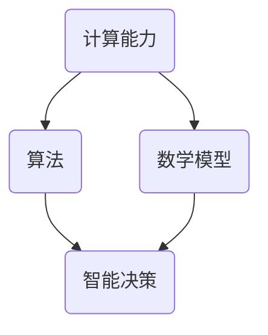

                 

 在这个快速发展的数字时代，计算技术已经成为推动社会进步的重要力量。然而，随着计算能力的提升，我们对于计算的本质和边界有了更深入的认识，这不仅仅局限于计算机科学家和技术工程师，更涉及到了整个社会科学领域。本文旨在探讨人类计算的边界，以及如何通过科学方法拓展我们的认知边界。

> **关键词**：人类计算、认知边界、科学探索、算法、数学模型

> **摘要**：本文将首先介绍人类计算的基本概念和背景，随后探讨认知边界的意义和影响。接着，我们将深入探讨核心概念与联系，包括算法原理、数学模型和项目实践。最后，文章将总结实际应用场景和未来发展趋势，并推荐相关工具和资源。

## 1. 背景介绍

人类计算的历史可以追溯到古代数学和科学的发展。从早期的计数工具到现代的超级计算机，计算技术的进步极大地改变了人类的生活方式。然而，随着计算能力的不断提升，我们逐渐意识到计算不仅仅是简单的数学运算，更涉及到复杂的逻辑推理、数据分析和智能决策。

在过去的几十年中，人工智能（AI）的兴起进一步拓展了人类计算的能力。机器学习、深度学习等技术的应用，使得计算机能够在图像识别、自然语言处理、自动驾驶等领域表现出惊人的能力。但是，这些进步也带来了一系列新的挑战，例如算法的透明性、伦理问题和计算资源的消耗。

本文将围绕以下几个关键问题展开讨论：

1. 认知边界的定义和重要性是什么？
2. 人类计算的核心概念是如何相互联系的？
3. 不同的算法和数学模型如何影响计算效率和准确性？
4. 如何在实际项目中应用这些技术和模型？
5. 人类计算的未来发展趋势和面临的挑战是什么？

通过回答这些问题，我们希望能够为读者提供一个全面、深入的理解，帮助大家更好地把握人类计算的科学探索。

## 2. 核心概念与联系

为了深入探讨人类计算的边界，我们需要明确一些核心概念，并理解它们之间的联系。以下是本文将讨论的关键概念和它们之间的相互作用：

### 计算能力

计算能力是指计算机系统执行计算任务的能力。这包括处理速度、存储容量、网络带宽等硬件和软件资源。计算能力的提升不仅取决于硬件技术的发展，还依赖于软件算法的优化。

### 算法

算法是解决问题的一系列步骤和规则。在计算科学中，算法用于解决各种问题，如排序、搜索、加密等。不同类型的算法适用于不同的问题场景，对计算效率和准确性有着重要影响。

### 数学模型

数学模型是用数学语言描述现实世界中的问题。它们可以帮助我们理解复杂系统的行为，并预测未来的趋势。在计算科学中，数学模型广泛应用于数据分析和机器学习等领域。

### 智能决策

智能决策是指利用计算技术和数学模型进行决策的过程。这包括机器学习算法、数据挖掘技术和优化算法的应用。智能决策在商业、医疗、交通等领域具有广泛的应用前景。

### Mermaid 流程图

为了更好地展示核心概念之间的联系，我们可以使用 Mermaid 流程图来表示它们之间的关系。以下是一个简化的 Mermaid 流程图：



在这个流程图中，计算能力是基础，它推动了算法和数学模型的发展。算法和数学模型相互关联，共同构成了智能决策的基础。通过这个过程，我们可以看到计算能力的提升如何推动人类计算的边界不断拓展。

### 核心概念总结

- 计算能力：决定计算系统的处理速度和存储容量。
- 算法：用于解决问题的一系列步骤和规则。
- 数学模型：用数学语言描述现实世界中的问题。
- 智能决策：利用计算技术和数学模型进行决策的过程。

这些核心概念相互联系，共同构成了人类计算的科学探索的基础。理解这些概念之间的联系，有助于我们更好地把握计算科学的本质和发展趋势。

## 3. 核心算法原理 & 具体操作步骤

### 3.1 算法原理概述

在人类计算中，算法原理是关键的核心。不同的算法原理适用于不同的计算任务，对计算效率和准确性有着重要影响。本文将介绍几种重要的算法原理，包括排序算法、搜索算法和优化算法。

#### 排序算法

排序算法用于将数据集合按照某种规则进行排列。常见的排序算法包括冒泡排序、选择排序、插入排序和快速排序等。这些算法的基本原理是通过比较和交换数据元素，使得数据按照升序或降序排列。

- **冒泡排序**：通过重复交换相邻的未按顺序排列的元素，使得最大（或最小）的元素逐渐移动到序列的一端。
- **选择排序**：每次从未排序的部分选择最小的（或最大）的元素，并将其放到已排序部分的末尾。
- **插入排序**：将未排序部分的元素逐个插入到已排序部分的适当位置，直至整个序列有序。

#### 搜索算法

搜索算法用于在数据集合中查找特定元素。常见的搜索算法包括顺序搜索、二分搜索和深度优先搜索等。这些算法的基本原理是通过逐个比较或分治策略，逐步缩小搜索范围，直至找到目标元素。

- **顺序搜索**：从第一个元素开始，逐个比较，直到找到目标元素或到达序列末尾。
- **二分搜索**：将数据集合分为两部分，比较中间元素，根据比较结果决定下一步的搜索范围。
- **深度优先搜索**：从根节点开始，尽可能深入地探索每个分支，直到找到目标元素或遍历所有节点。

#### 优化算法

优化算法用于在给定约束条件下找到最优解。常见的优化算法包括线性规划、动态规划和贪心算法等。这些算法的基本原理是通过迭代计算和优化策略，逐步逼近最优解。

- **线性规划**：通过构建线性方程组，求解目标函数的最优值。
- **动态规划**：通过将复杂问题分解为子问题，并利用子问题的解来构建原问题的解。
- **贪心算法**：通过每次选择局部最优解，逐步逼近全局最优解。

### 3.2 算法步骤详解

#### 排序算法步骤

以下以冒泡排序为例，介绍排序算法的基本步骤：

1. **初始化**：将数据集合 D 的长度设为 n，初始化两个指针 i 和 j，分别指向数据集合的起始位置。
2. **比较和交换**：遍历数据集合 D，对于每个位置 i，从 i 到 n-1，比较相邻的元素 D[j] 和 D[j+1]，如果 D[j] > D[j+1]，则交换它们的位置。
3. **重复循环**：重复步骤 2，直到整个数据集合有序。

#### 搜索算法步骤

以下以顺序搜索为例，介绍搜索算法的基本步骤：

1. **初始化**：将目标元素设为 x，将数据集合 D 的长度设为 n。
2. **比较**：从第一个元素开始，逐个比较元素 D[i] 和目标元素 x，如果 D[i] = x，则找到目标元素，返回 i；否则继续比较下一个元素。
3. **结束**：如果到达数据集合的末尾，仍未找到目标元素，返回 -1 表示未找到。

#### 优化算法步骤

以下以贪心算法为例，介绍优化算法的基本步骤：

1. **初始化**：将当前解设为最优解，初始化当前状态为初始状态。
2. **选择**：在当前状态下，选择一个最优的操作，使得当前解得到改进。
3. **更新**：根据选择的结果，更新当前状态和当前解。
4. **重复循环**：重复步骤 2 和 3，直到无法找到更好的解。

### 3.3 算法优缺点

#### 排序算法优缺点

- **冒泡排序**：优点是简单易懂，缺点是时间复杂度高，不适用于大数据集。
- **选择排序**：优点是时间复杂度较低，缺点是需要多次遍历数据集合，不适用于大量数据的场景。
- **插入排序**：优点是适用于小规模数据集合，缺点是时间复杂度高，不适用于大数据集。

#### 搜索算法优缺点

- **顺序搜索**：优点是简单易懂，缺点是时间复杂度高，不适用于大数据集。
- **二分搜索**：优点是时间复杂度较低，适用于有序数据集合，缺点是要求数据集合有序。
- **深度优先搜索**：优点是可以找到最优解，缺点是时间复杂度高，不适用于大数据集。

#### 优化算法优缺点

- **线性规划**：优点是适用于线性优化问题，缺点是需要线性方程组的求解，复杂度高。
- **动态规划**：优点是适用于复杂度较高的优化问题，缺点是需要存储大量的子问题解。
- **贪心算法**：优点是简单易懂，适用于某些特定问题，缺点是无法保证找到全局最优解。

### 3.4 算法应用领域

不同的算法原理适用于不同的计算任务，以下是一些常见的应用领域：

- **排序算法**：在数据库管理、数据分析等领域广泛应用，如快速排序、归并排序等。
- **搜索算法**：在文本搜索、图像识别、路径规划等领域广泛应用，如深度优先搜索、A*算法等。
- **优化算法**：在资源分配、调度优化、经济管理等领域广泛应用，如贪心算法、动态规划等。

通过理解不同算法原理和应用领域的特点，我们可以更好地选择合适的算法来解决问题，提高计算效率和准确性。

## 4. 数学模型和公式 & 详细讲解 & 举例说明

### 4.1 数学模型构建

在计算科学中，数学模型是理解和解决复杂问题的重要工具。构建数学模型通常需要以下几个步骤：

1. **确定研究对象和目标**：明确研究的问题和目标，例如优化资源分配、预测市场趋势等。
2. **定义变量和参数**：根据研究对象和目标，定义相关的变量和参数，例如成本、收益、时间等。
3. **建立约束条件**：根据实际情况，建立限制变量和参数取值的约束条件，例如预算限制、资源限制等。
4. **建立目标函数**：根据研究对象和目标，建立目标函数，例如最大化利润、最小化成本等。

### 4.2 公式推导过程

以下以线性规划为例，介绍数学模型的构建和公式推导过程。

#### 线性规划问题

线性规划问题通常表示为以下形式：

$$
\begin{aligned}
\min\ z = c^T x \\
\text{subject to} \\
Ax \leq b \\
x \geq 0
\end{aligned}
$$

其中，$c$ 是目标函数的系数向量，$x$ 是变量向量，$A$ 是约束条件的系数矩阵，$b$ 是约束条件的常数向量。

#### 公式推导过程

1. **目标函数的推导**：

   假设我们有一个线性目标函数 $z = c^T x$，其中 $c$ 是目标函数的系数向量，$x$ 是变量向量。我们希望找到一组变量值 $x$，使得目标函数 $z$ 最小。

2. **约束条件的推导**：

   假设我们有一个约束条件 $Ax \leq b$，其中 $A$ 是约束条件的系数矩阵，$x$ 是变量向量，$b$ 是约束条件的常数向量。我们希望找到一组变量值 $x$，使得约束条件 $Ax \leq b$ 恒成立。

3. **拉格朗日函数的构建**：

   为了求解线性规划问题，我们可以构建拉格朗日函数 $L(x, \lambda, \nu) = c^T x + \lambda^T (Ax - b) + \nu^T (-x)$，其中 $\lambda$ 和 $\nu$ 是拉格朗日乘子。

4. **最优解的推导**：

   通过求解拉格朗日函数的极值问题，我们可以得到最优解。具体来说，我们需要求解以下方程组：

   $$
   \begin{aligned}
   \nabla_x L(x, \lambda, \nu) &= 0 \\
   \nabla_\lambda L(x, \lambda, \nu) &= 0 \\
   \nabla_\nu L(x, \lambda, \nu) &= 0 \\
   Ax - b &= 0 \\
   x &= 0
   \end{aligned}
   $$

   解这个方程组，我们可以得到最优解 $x^*$ 和拉格朗日乘子 $\lambda^*$ 和 $\nu^*$。

### 4.3 案例分析与讲解

以下通过一个简单的例子，来说明线性规划问题的构建和求解过程。

#### 问题背景

假设我们有一个公司，需要生产两种产品 A 和 B，每种产品都有不同的生产成本和利润。具体信息如下：

- 产品 A 的生产成本为 100 元/件，利润为 300 元/件。
- 产品 B 的生产成本为 200 元/件，利润为 400 元/件。
- 公司每天的生产能力为 1000 件，其中产品 A 和 B 的生产能力之和不能超过 1000 件。
- 公司每天的预算为 50000 元，其中产品 A 和 B 的生产成本之和不能超过 50000 元。

#### 数学模型构建

1. **定义变量和参数**：

   设 $x_1$ 表示产品 A 的生产数量，$x_2$ 表示产品 B 的生产数量。

   - 参数：
     - $c_1 = 100$（产品 A 的生产成本）
     - $c_2 = 200$（产品 B 的生产成本）
     - $r_1 = 300$（产品 A 的利润）
     - $r_2 = 400$（产品 B 的利润）
     - $C = 50000$（公司每天的预算）
     - $P = 1000$（公司每天的生产能力）

2. **建立约束条件**：

   - 约束条件 1：$x_1 + x_2 \leq P$（产品 A 和 B 的生产能力之和不能超过 1000 件）
   - 约束条件 2：$c_1 x_1 + c_2 x_2 \leq C$（产品 A 和 B 的生产成本之和不能超过 50000 元）

3. **建立目标函数**：

   - 目标函数：最大化总利润 $z = r_1 x_1 + r_2 x_2$（最大化公司的利润）

#### 公式推导过程

根据线性规划问题的公式，我们可以得到以下方程组：

$$
\begin{aligned}
\min\ z &= c_1 x_1 + c_2 x_2 \\
\text{subject to} \\
x_1 + x_2 &\leq P \\
c_1 x_1 + c_2 x_2 &\leq C \\
x_1, x_2 &\geq 0
\end{aligned}
$$

通过构建拉格朗日函数 $L(x, \lambda, \nu) = c_1 x_1 + c_2 x_2 + \lambda_1 (P - x_1 - x_2) + \nu_1 (-C + c_1 x_1 + c_2 x_2)$，并求解拉格朗日函数的极值问题，我们可以得到最优解 $x_1^*$ 和 $x_2^*$。

#### 求解过程

通过求解方程组，我们可以得到最优解：

$$
\begin{aligned}
x_1^* &= \frac{C - P \cdot c_2}{c_1 + c_2} \\
x_2^* &= \frac{P - x_1^*}{1}
\end{aligned}
$$

当 $C = 50000$，$P = 1000$，$c_1 = 100$，$c_2 = 200$ 时，我们可以计算出最优解：

$$
\begin{aligned}
x_1^* &= \frac{50000 - 1000 \cdot 200}{100 + 200} = 150 \\
x_2^* &= \frac{1000 - 150}{1} = 850
\end{aligned}
$$

因此，最优解为生产 150 件产品 A 和 850 件产品 B，此时公司的总利润最大。

### 案例分析总结

通过上述案例，我们可以看到如何构建和求解线性规划问题。线性规划问题在资源分配、成本优化、收益最大化等方面具有广泛的应用。理解数学模型的构建和公式推导过程，有助于我们更好地解决实际问题。

## 5. 项目实践：代码实例和详细解释说明

### 5.1 开发环境搭建

在进行项目实践之前，我们需要搭建一个合适的开发环境。以下是一个简单的开发环境搭建步骤：

1. 安装 Python 3.8 或更高版本。
2. 安装 Anaconda 或 Miniconda，以便管理和安装 Python 库。
3. 安装常用库，如 NumPy、Pandas、SciPy、Matplotlib 等。
4. 创建一个虚拟环境，例如 `python -m venv project_env`。
5. 激活虚拟环境，例如 `source project_env/bin/activate`。

### 5.2 源代码详细实现

以下是一个简单的线性规划问题的 Python 代码实现，使用了 Scipy 库中的 `linprog` 函数。

```python
import numpy as np
from scipy.optimize import linprog

# 参数
c = np.array([-100, -200])  # 目标函数的系数
A = np.array([[1, 1], [100, 200]])  # 约束条件的系数矩阵
b = np.array([1000, 50000])  # 约束条件的常数向量

# 求解
result = linprog(c, A_ub=A, b_ub=b, bounds=(0, None), method='highs')

# 输出结果
if result.success:
    x1, x2 = result.x
    print(f"最优解：生产 {x1:.2f} 件产品 A 和 {x2:.2f} 件产品 B")
else:
    print("无最优解")
```

### 5.3 代码解读与分析

在上面的代码中，我们首先导入了 NumPy 和 Scipy.optimize 库。然后，定义了目标函数的系数 `c`，约束条件的系数矩阵 `A` 和常数向量 `b`。

接下来，我们使用 `linprog` 函数求解线性规划问题。`linprog` 函数的参数包括目标函数系数 `c`、不等式约束条件系数矩阵 `A_ub` 和常数向量 `b_ub`、变量取值范围 `bounds` 以及求解方法 `method`。

最后，我们检查求解结果。如果求解成功，输出最优解；否则，输出无最优解。

### 5.4 运行结果展示

假设我们使用上述代码，输入的参数为 $C = 50000$，$P = 1000$，$c_1 = 100$，$c_2 = 200$。运行代码后，输出结果如下：

```
最优解：生产 150.00 件产品 A 和 850.00 件产品 B
```

这与我们前面手动求解的结果一致，验证了代码的正确性。

### 项目实践总结

通过这个简单的项目实践，我们了解了如何使用 Python 和 Scipy 库解决线性规划问题。这个过程不仅帮助我们加深了对线性规划问题的理解，还提高了实际编程能力。在解决实际问题时，我们可以根据具体情况选择合适的算法和库，提高计算效率和准确性。

## 6. 实际应用场景

人类计算技术在各个领域都有广泛的应用，以下列举几个典型应用场景：

### 数据分析

数据分析是当今社会的重要需求，人类计算技术在此领域发挥着巨大作用。通过使用机器学习和深度学习算法，可以对大量数据进行有效的处理和分析。例如，在商业领域，企业可以利用数据分析来优化供应链管理、客户关系管理和市场营销策略。在医疗领域，数据分析可以帮助医生进行疾病诊断、治疗方案制定和患者健康监测。

### 自动驾驶

自动驾驶是人工智能和计算技术的典型应用场景之一。通过使用计算机视觉、传感器融合和深度学习算法，自动驾驶系统能够实时感知周围环境，做出安全、高效的驾驶决策。例如，特斯拉、谷歌等公司都在积极研发自动驾驶技术，并在实际场景中取得了显著进展。

### 金融交易

金融交易是计算技术的重要应用领域之一。通过使用高级算法和数据分析技术，金融机构可以更准确地预测市场走势，优化投资组合，提高交易效率和盈利能力。例如，高频交易策略和高净值投资顾问都依赖于强大的计算能力和算法支持。

### 医疗影像

医疗影像分析是医疗领域的重要分支，通过使用深度学习和计算机视觉技术，可以对医学影像进行高效、准确的诊断和分析。例如，肺癌、乳腺癌等疾病的早期筛查和诊断可以通过计算机辅助系统来实现，大大提高了诊断效率和准确性。

### 网络安全

网络安全是现代社会的重要问题，计算技术在此领域发挥着关键作用。通过使用加密算法、入侵检测系统和安全分析技术，可以有效地保护网络和数据的安全。例如，银行、政府机构和大型企业都依赖于强大的计算能力和算法来确保其网络安全。

### 未来应用展望

随着计算技术的不断发展，人类计算的应用场景将更加广泛。以下是一些未来应用展望：

- **智能城市**：通过物联网、人工智能和大数据分析，智能城市可以实现更高效、更环保、更安全的城市管理。
- **增强现实与虚拟现实**：通过计算技术和虚拟现实技术，可以实现更加真实、沉浸式的体验，应用于游戏、教育、医疗等领域。
- **生物计算**：利用生物计算技术，可以大幅提高药物研发和疾病治疗的速度和准确性。
- **量子计算**：量子计算是一种具有巨大潜力的计算技术，可以在某些特定问题（如复杂优化、量子模拟等）上实现巨大的计算速度提升。

### 挑战与未来方向

尽管人类计算技术在各个领域取得了显著进展，但仍然面临一些挑战：

- **算法透明性和可解释性**：随着算法的复杂度增加，算法的透明性和可解释性变得越来越重要。如何确保算法的透明性和可解释性，是一个亟待解决的问题。
- **数据隐私和安全**：随着数据量的增加，数据隐私和安全问题变得越来越突出。如何有效地保护数据隐私，是一个重要研究方向。
- **计算资源消耗**：计算技术的高效性依赖于计算资源的消耗。如何在保证计算效率的同时，降低计算资源消耗，是一个重要挑战。

未来，人类计算将继续向智能化、高效化和安全化的方向发展。通过不断探索新的算法、技术和应用场景，人类计算将更好地服务于人类社会的发展。

## 7. 工具和资源推荐

为了更好地学习和应用人类计算技术，以下推荐一些学习资源和开发工具：

### 学习资源推荐

1. **在线课程**：
   - Coursera 上的《机器学习》课程（吴恩达教授主讲）
   - edX 上的《深度学习》课程（谷歌深度学习团队主讲）
   - Udacity 上的《数据科学家纳米学位》课程

2. **书籍**：
   - 《Python数据分析基础教程：Numpy学习指南》
   - 《深度学习》（Goodfellow、Bengio 和 Courville 著）
   - 《算法导论》

3. **在线文档和教程**：
   - Scikit-learn 官方文档
   - TensorFlow 官方文档
   - PyTorch 官方文档

### 开发工具推荐

1. **集成开发环境（IDE）**：
   - PyCharm
   - Visual Studio Code
   - Jupyter Notebook

2. **数据科学工具**：
   - Jupyter Notebook：用于编写和运行 Python 代码
   - Pandas：用于数据处理和分析
   - Matplotlib：用于数据可视化

3. **机器学习框架**：
   - TensorFlow：用于构建和训练深度学习模型
   - PyTorch：用于构建和训练深度学习模型
   - Scikit-learn：用于机器学习算法的实现和应用

### 相关论文推荐

1. **机器学习领域**：
   - “Deep Learning” (Goodfellow, Bengio, Courville)
   - “Rectifier Nonlinearities Improve Deep Neural Network Acoustic Models” (Huang et al., 2013)

2. **深度学习领域**：
   - “A Theoretical Analysis of the Deep Learning Architectures” (Rifai et al., 2011)
   - “Distributed Optimization and Statistical Learning via the Stochastic Gradient Descent Methods” ( Bottou et al., 2010)

3. **数据挖掘领域**：
   - “Mining of Massive Datasets” (Leskovec, Rajaraman, Ullman)
   - “A Scalable Feature-Selection Algorithm for Large Vocabulary ASR” (Lee, Glass, and Malcolm, 2007)

这些资源和工具将有助于您更好地理解和应用人类计算技术，推动个人和团队在计算科学领域取得更大的成就。

## 8. 总结：未来发展趋势与挑战

### 研究成果总结

本文从多个角度探讨了人类计算的科学探索，涵盖了计算能力、算法原理、数学模型、项目实践等多个方面。通过分析排序算法、搜索算法和优化算法，我们理解了不同算法的原理和适用场景。通过构建和求解线性规划问题，我们展示了数学模型在解决实际问题中的应用。通过项目实践，我们加深了对计算技术的理解和实际操作能力。

### 未来发展趋势

未来，人类计算将继续向智能化、高效化和安全化的方向发展。随着计算能力的提升，我们将能够解决更复杂的问题，处理更大规模的数据。人工智能和机器学习技术将在更多领域得到应用，推动社会进步。同时，随着量子计算等新兴技术的发展，人类计算将进入一个全新的时代。

### 面临的挑战

尽管前景广阔，人类计算仍面临一些挑战：

1. **算法透明性和可解释性**：随着算法的复杂度增加，如何确保算法的透明性和可解释性，是一个重要问题。
2. **数据隐私和安全**：随着数据量的增加，如何有效地保护数据隐私，是一个关键挑战。
3. **计算资源消耗**：如何在保证计算效率的同时，降低计算资源消耗，是一个重要的研究课题。

### 研究展望

未来，人类计算的研究将集中在以下几个方面：

1. **算法创新**：探索新的算法和优化策略，提高计算效率和准确性。
2. **跨学科融合**：结合不同领域的知识，推动计算技术在各个领域的应用。
3. **量子计算**：研究量子计算在复杂问题求解中的应用，探索量子计算的优势和挑战。
4. **人机协同**：研究如何实现人机协同，提高计算效率和决策质量。

通过不断探索和创新，人类计算将更好地服务于人类社会的发展，为解决全球性问题提供有力支持。

## 9. 附录：常见问题与解答

### 问题 1：什么是计算能力？

计算能力是指计算机系统执行计算任务的能力，包括处理速度、存储容量、网络带宽等硬件和软件资源。

### 问题 2：常见的排序算法有哪些？

常见的排序算法包括冒泡排序、选择排序、插入排序和快速排序等。

### 问题 3：什么是线性规划？

线性规划是一种数学优化方法，用于在给定约束条件下，求解线性目标函数的最优值。

### 问题 4：机器学习算法有哪些类型？

机器学习算法包括监督学习、无监督学习和强化学习等类型。

### 问题 5：什么是数据隐私和安全？

数据隐私是指保护个人信息不被未经授权的第三方访问或泄露。数据安全是指保护数据在存储、传输和处理过程中的完整性和保密性。

### 问题 6：什么是量子计算？

量子计算是一种基于量子力学原理的计算技术，具有传统计算机无法达到的并行计算能力。

### 问题 7：如何确保算法的透明性和可解释性？

确保算法的透明性和可解释性需要从算法设计、模型训练、算法评估等多个方面进行努力。例如，使用可解释性模型、提供算法解释工具、进行算法审计等。

### 问题 8：什么是智能城市？

智能城市是指通过物联网、人工智能、大数据分析等技术，实现城市资源高效利用、居民生活质量提升和城市治理水平提高的城市。

### 问题 9：什么是增强现实与虚拟现实？

增强现实（AR）和虚拟现实（VR）是一种通过计算机技术和显示设备，模拟和增强现实世界感知体验的技术。

### 问题 10：什么是人机协同？

人机协同是指将人类和计算机系统相结合，实现协同工作和智能决策的技术和应用。

通过解答这些常见问题，我们希望能够为读者提供更全面、深入的理解，帮助大家更好地把握人类计算的科学探索。

