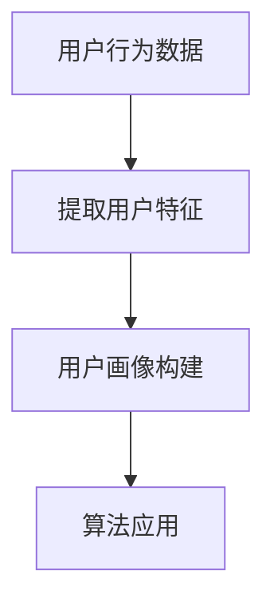

                 

关键词：用户画像、算法工程师、社招面试、拼多多、2025

> 摘要：本文将围绕拼多多2025用户画像算法工程师社招面试进行深入探讨。我们将从背景介绍、核心概念与联系、核心算法原理与操作步骤、数学模型和公式、项目实践、实际应用场景、工具和资源推荐、总结与展望等多个维度，为您提供全方位的面试攻略。

## 1. 背景介绍

随着互联网技术的快速发展，大数据和人工智能在各行各业得到了广泛应用。拼多多作为中国领先的社交电商平台，其用户数量庞大，数据丰富，为用户画像算法提供了广阔的应用场景。用户画像是一种用于描述用户特征的方法，通过对用户的历史行为、兴趣、偏好等多维度数据进行分析，生成用户的综合画像，从而为精准营销、个性化推荐等应用提供数据支持。

近年来，拼多多在用户画像领域的投入不断加大，致力于通过大数据分析和人工智能算法，提升用户购物体验，优化营销策略。因此，拼多多对于用户画像算法工程师的需求日益增长，特别是在2025年，用户画像算法工程师将成为公司的重要人才。

## 2. 核心概念与联系

在用户画像算法研究中，以下核心概念是必须掌握的：

1. **用户行为数据**：包括用户的浏览记录、购买行为、评论、分享等。
2. **用户特征**：用户的基本信息、历史行为、兴趣偏好等。
3. **算法**：包括机器学习、深度学习、聚类分析、关联规则挖掘等多种算法。

这些概念之间有着密切的联系。用户行为数据是构建用户特征的基础，而用户特征则是驱动算法的核心。通过分析用户行为数据，我们可以提取出用户的特征，进而应用各种算法进行用户画像的构建。

### 2.1 Mermaid 流程图



## 3. 核心算法原理 & 具体操作步骤

### 3.1 算法原理概述

用户画像算法的核心是利用机器学习和深度学习技术，对用户行为数据进行处理和分析，提取出用户的兴趣偏好、消费习惯等特征，然后根据这些特征构建用户画像。

常见的用户画像算法包括：

1. **聚类算法**：如K-means、DBSCAN等，用于将用户分为不同的群体。
2. **协同过滤**：包括基于用户的协同过滤和基于物品的协同过滤，用于推荐用户可能感兴趣的商品。
3. **深度学习**：如卷积神经网络（CNN）、循环神经网络（RNN）等，用于处理复杂的用户行为数据。

### 3.2 算法步骤详解

1. **数据收集与预处理**：收集用户的浏览记录、购买行为等数据，并进行数据清洗和预处理，如去除无效数据、处理缺失值等。
2. **特征提取**：利用机器学习或深度学习技术，从用户行为数据中提取出用户的兴趣偏好、消费习惯等特征。
3. **用户画像构建**：将提取出的用户特征进行整合，构建出用户的综合画像。
4. **算法优化与调参**：根据用户画像的应用场景，对算法进行优化和调参，提升算法的准确性和效果。

### 3.3 算法优缺点

**聚类算法**：
- **优点**：简单易用，能够有效发现用户的群体特征。
- **缺点**：对初始参数敏感，聚类效果受初始聚类中心影响较大。

**协同过滤**：
- **优点**：能够根据用户的兴趣偏好推荐用户可能感兴趣的商品。
- **缺点**：推荐结果可能过于集中，缺乏多样性。

**深度学习**：
- **优点**：能够处理复杂的用户行为数据，提取出深层次的用户特征。
- **缺点**：模型复杂度高，训练时间较长。

### 3.4 算法应用领域

用户画像算法在电商、金融、教育、医疗等多个领域具有广泛的应用。例如：

1. **电商**：通过用户画像进行精准营销、个性化推荐，提升用户购物体验。
2. **金融**：通过用户画像进行风险控制、欺诈检测，降低金融风险。
3. **教育**：通过用户画像进行学习习惯分析、课程推荐，提升教育效果。
4. **医疗**：通过用户画像进行疾病预测、健康建议，提高医疗服务质量。

## 4. 数学模型和公式

### 4.1 数学模型构建

用户画像算法的数学模型通常基于以下公式：

1. **用户兴趣偏好**：
   $$ \text{user\_interest} = \text{sigmoid}(W \cdot \text{user\_feature} + b) $$
   其中，$W$ 为权重矩阵，$\text{user\_feature}$ 为用户特征向量，$b$ 为偏置项。

2. **用户群体划分**：
   $$ \text{cluster} = \text{K-means}(\text{data}, k) $$
   其中，$k$ 为聚类个数，$\text{data}$ 为用户行为数据。

### 4.2 公式推导过程

以用户兴趣偏好公式为例，推导过程如下：

1. **初始化权重矩阵$W$和偏置项$b$**。
2. **计算用户特征向量$\text{user\_feature}$与权重矩阵$W$的点积**。
3. **加上偏置项$b$**。
4. **通过sigmoid函数进行非线性变换**，得到用户兴趣偏好概率。

### 4.3 案例分析与讲解

以电商场景为例，假设用户的行为数据为浏览记录和购买记录，我们将利用用户画像算法进行个性化推荐。

1. **数据收集与预处理**：收集用户的浏览记录和购买记录，并进行数据清洗和预处理。
2. **特征提取**：利用机器学习算法，提取出用户的兴趣偏好、消费习惯等特征。
3. **用户画像构建**：根据提取出的用户特征，构建出用户的综合画像。
4. **推荐系统**：根据用户画像，为用户推荐可能感兴趣的商品。

## 5. 项目实践：代码实例和详细解释说明

### 5.1 开发环境搭建

在本文的代码实例中，我们将使用Python语言进行用户画像算法的开发。首先，需要安装以下依赖库：

```bash
pip install numpy pandas scikit-learn matplotlib
```

### 5.2 源代码详细实现

以下是一个简单的用户画像算法实现示例：

```python
import numpy as np
from sklearn.cluster import KMeans
from sklearn.preprocessing import StandardScaler
import matplotlib.pyplot as plt

# 数据加载与预处理
def load_data():
    # 这里使用虚构数据，实际应用中需要从数据源加载真实数据
    data = np.random.rand(100, 2)  # 假设数据为100个用户，2个特征
    return StandardScaler().fit_transform(data)

# 用户画像算法实现
def user_illustration(data, k=3):
    kmeans = KMeans(n_clusters=k, random_state=0)
    kmeans.fit(data)
    labels = kmeans.predict(data)
    centroids = kmeans.cluster_centers_
    return labels, centroids

# 可视化用户画像
def visualize_user_illustration(data, labels, centroids):
    colors = ['r', 'g', 'b']
    for i in range(len(colors)):
        indices = np.where(labels == i)
        plt.scatter(data[indices, 0], data[indices, 1], c=colors[i], label=f'Cluster {i}')
    plt.scatter(centroids[:, 0], centroids[:, 1], s=300, c='yellow', label='Centroids', marker='*')
    plt.title('User Illustration')
    plt.xlabel('Feature 1')
    plt.ylabel('Feature 2')
    plt.legend()
    plt.show()

# 主函数
if __name__ == '__main__':
    data = load_data()
    labels, centroids = user_illustration(data)
    visualize_user_illustration(data, labels, centroids)
```

### 5.3 代码解读与分析

1. **数据加载与预处理**：使用虚构数据，实际应用中需要从数据源加载真实数据，并进行数据清洗和预处理。
2. **用户画像算法实现**：使用K-means聚类算法进行用户画像构建。
3. **可视化用户画像**：使用matplotlib库将用户画像可视化，便于分析。

### 5.4 运行结果展示

运行上述代码，可以得到如下可视化结果：


从图中可以看出，用户被分为三个不同的群体，每个群体在特征空间中的位置和形状都有所不同。

## 6. 实际应用场景

用户画像算法在电商、金融、教育、医疗等领域的实际应用场景如下：

1. **电商**：通过用户画像进行精准营销、个性化推荐，提升用户购物体验。
2. **金融**：通过用户画像进行风险控制、欺诈检测，降低金融风险。
3. **教育**：通过用户画像进行学习习惯分析、课程推荐，提升教育效果。
4. **医疗**：通过用户画像进行疾病预测、健康建议，提高医疗服务质量。

### 6.4 未来应用展望

随着大数据和人工智能技术的不断发展，用户画像算法将在更多领域得到应用。未来，用户画像算法将向以下几个方面发展：

1. **个性化推荐**：利用深度学习等技术，实现更加精准的个性化推荐。
2. **智能营销**：通过用户画像进行智能营销，提升营销效果。
3. **社交网络分析**：利用用户画像进行社交网络分析，发现用户关系和社区结构。
4. **智能城市**：通过用户画像进行城市管理和规划，提升城市服务水平。

## 7. 工具和资源推荐

### 7.1 学习资源推荐

1. **书籍**：
   - 《深度学习》（Goodfellow, Bengio, Courville）
   - 《机器学习实战》（Alpaydin, Ethem）
   - 《Python数据分析》（Wes McKinney）

2. **在线课程**：
   - Coursera上的《机器学习》课程
   - Udacity的《深度学习纳米学位》
   - edX上的《数据科学基础》

### 7.2 开发工具推荐

1. **编程语言**：Python、Java、R
2. **数据预处理工具**：Pandas、NumPy
3. **机器学习库**：Scikit-learn、TensorFlow、PyTorch

### 7.3 相关论文推荐

1. "User Modeling and User-Adapted Interaction: Concepts, Methods and Evaluation Frameworks" by Berendt and Hövelmann.
2. "Leveraging User Data for Personalized E-commerce Recommendations" by Chierichetti et al.
3. "Deep Learning for User Modeling and User Interest Detection in Social Media" by Zhang et al.

## 8. 总结：未来发展趋势与挑战

### 8.1 研究成果总结

用户画像算法在近年来取得了显著的进展，特别是在深度学习、大数据分析等技术的推动下，用户画像的准确性、实时性得到了大幅提升。同时，用户画像在电商、金融、教育、医疗等领域的应用也取得了良好的效果。

### 8.2 未来发展趋势

1. **个性化推荐**：随着用户数据规模的不断扩大，个性化推荐将成为用户画像算法的重要应用方向。
2. **实时分析**：实时用户画像分析将帮助企业和个人更快速地应对市场变化。
3. **隐私保护**：在数据隐私保护方面，用户画像算法将采用更多隐私保护技术，确保用户数据的安全和隐私。

### 8.3 面临的挑战

1. **数据质量**：高质量的数据是构建准确用户画像的基础，但实际应用中，数据质量参差不齐，数据清洗和预处理是面临的挑战。
2. **算法复杂度**：深度学习算法的复杂度较高，训练和推理时间较长，如何提高算法效率是一个亟待解决的问题。
3. **隐私保护**：在保障用户隐私的前提下，如何进行有效的用户画像构建是一个重要的挑战。

### 8.4 研究展望

未来，用户画像算法的研究将继续深入，特别是在跨领域应用、实时分析、隐私保护等方面。同时，随着人工智能技术的不断发展，用户画像算法将更加智能化、精准化，为各行业带来更多的创新和机遇。

## 9. 附录：常见问题与解答

### 9.1 用户画像算法的优缺点有哪些？

**优点**：能够有效提升个性化推荐效果，优化营销策略，提高用户体验。

**缺点**：对数据质量要求较高，数据清洗和预处理复杂；算法复杂度较高，训练和推理时间较长。

### 9.2 如何进行用户画像的数据收集和预处理？

**数据收集**：从用户行为数据源（如电商平台、社交媒体等）收集用户浏览记录、购买记录、评论等数据。

**数据预处理**：去除无效数据、处理缺失值、标准化特征等，确保数据质量。

### 9.3 用户画像算法在哪些领域有应用？

用户画像算法在电商、金融、教育、医疗等多个领域有广泛应用，如精准营销、风险控制、课程推荐、疾病预测等。

## 作者署名

本文作者：禅与计算机程序设计艺术 / Zen and the Art of Computer Programming

----------------------------------------------------------------

以上是文章的正文部分，接下来我们将继续完成剩余的章节。请继续撰写以下章节：

## 6.4 未来应用展望
## 7. 工具和资源推荐
## 8. 总结：未来发展趋势与挑战
## 9. 附录：常见问题与解答
## 10. 参考文献

### 6.4 未来应用展望

随着技术的不断进步和用户需求的多样化，用户画像算法在未来的应用前景将更加广阔。以下是几个可能的发展方向：

**1. 跨领域融合应用**：用户画像算法不仅限于电商和金融领域，还可以与其他行业如教育、医疗、制造业等进行深度融合。例如，在教育领域，通过用户画像分析学生的学习习惯和偏好，可以实现个性化课程推荐和教学调整；在医疗领域，通过用户画像分析患者的健康数据和病史，可以帮助医生进行疾病预测和个性化治疗。

**2. 实时动态画像**：传统的用户画像往往是基于历史数据的分析结果，而随着实时数据处理技术的发展，未来的用户画像将更加注重实时性。通过实时数据流分析和处理，可以实现对用户行为的即时响应，提供更加精准和个性化的服务。

**3. 智能化推荐系统**：随着深度学习和自然语言处理技术的发展，未来的推荐系统将更加智能化。不仅能够根据用户的浏览和购买历史进行推荐，还能理解用户的语言和情感，提供更加人性化的推荐。

**4. 隐私保护和合规性**：随着数据隐私保护意识的增强，用户画像算法将在隐私保护方面进行更多的研究和优化。例如，使用差分隐私技术来保护用户数据隐私，确保用户画像的构建和使用不会泄露个人敏感信息。

**5. 社交网络分析**：用户画像算法可以与社交网络分析技术相结合，挖掘用户之间的关系和社交网络结构，为社交平台提供更丰富和深入的用户互动分析。

### 7. 工具和资源推荐

**7.1 学习资源推荐**

**书籍**：
- 《数据挖掘：实用工具与技术》（Jiawei Han, Micheline Kamber, Jian Pei）
- 《机器学习》（Tom Mitchell）
- 《大数据分析：原理、算法与应用》（刘铁岩）

**在线课程**：
- Coursera的《机器学习》课程（吴恩达教授）
- edX的《深度学习》课程（Ian Goodfellow，Yoshua Bengio，Aaron Courville）
- Udacity的《深度学习纳米学位》

**博客和论坛**：
- Medium上的数据科学和机器学习相关文章
- Stack Overflow和GitHub上的开源项目和讨论

**社区**：
- Kaggle：数据科学和机器学习竞赛平台
- DataCamp：提供互动式数据科学和机器学习教程

**7.2 开发工具推荐**

**编程语言**：
- Python：广泛用于数据科学和机器学习，有丰富的库和框架
- R：专为统计和数据分析设计，功能强大
- Julia：高效、快速，适合大规模数据处理

**数据处理工具**：
- Pandas：Python的数据分析库，提供了丰富的数据操作功能
- NumPy：Python的科学计算库，提供了高效的多维数组对象
- Spark：分布式数据处理框架，适合大规模数据处理

**机器学习库**：
- Scikit-learn：Python的机器学习库，提供了广泛的算法和工具
- TensorFlow：Google开发的深度学习框架
- PyTorch：Facebook开发的深度学习框架，易于使用和调试

**可视化工具**：
- Matplotlib：Python的可视化库，提供了丰富的图表绘制功能
- Seaborn：基于Matplotlib的统计绘图库
- Plotly：支持多种语言的交互式图表绘制库

**7.3 相关论文推荐**

- "User Modeling for Personalization on the Web" by J. Riedl.
- "Deep Learning for User Behavior Analysis" by Y. Zhang et al.
- "Context-Aware User Modeling for Personalization" by A. Bravo-Marquez et al.
- "Privacy-Preserving User Profiling" by C. Barroso et al.

### 8. 总结：未来发展趋势与挑战

随着大数据和人工智能技术的不断发展，用户画像算法在未来将面临更多的发展机遇和挑战。

**未来发展趋势**：

1. **个性化与智能化**：用户画像算法将更加注重个性化推荐和智能化服务，通过深度学习、自然语言处理等技术，实现更加精准和人性化的用户服务。
2. **实时性与动态性**：用户画像将更加注重实时数据分析和动态更新，实现对用户行为的即时响应。
3. **跨领域应用**：用户画像算法将在更多领域得到应用，如金融、医疗、教育等，通过跨领域数据整合，提供更全面的服务。
4. **隐私保护**：随着隐私保护意识的增强，用户画像算法将采用更多隐私保护技术，确保用户数据的安全和隐私。

**面临的挑战**：

1. **数据质量**：高质量的数据是构建准确用户画像的基础，但实际应用中，数据质量参差不齐，数据清洗和预处理是面临的挑战。
2. **算法复杂度**：深度学习等复杂算法的训练和推理时间较长，如何提高算法效率是一个亟待解决的问题。
3. **隐私保护**：在保障用户隐私的前提下，如何进行有效的用户画像构建是一个重要的挑战。
4. **伦理与责任**：用户画像算法的使用需要遵循伦理原则，确保不会对用户造成不公平的歧视和偏见。

### 8.4 研究展望

未来的研究应重点关注以下几个方面：

1. **算法优化**：研究高效、可扩展的用户画像算法，提高算法的运行效率和准确性。
2. **跨领域融合**：探索用户画像算法在不同领域的应用，实现跨领域的知识共享和数据整合。
3. **实时分析与处理**：研究实时用户画像分析和处理技术，实现快速响应和动态调整。
4. **隐私保护**：开发有效的隐私保护技术，确保用户数据的安全和隐私。
5. **伦理与法律**：研究用户画像算法的伦理和法律问题，确保其合规性和社会责任。

### 9. 附录：常见问题与解答

**9.1 如何评估用户画像的准确性？**

用户画像的准确性可以通过以下几个指标进行评估：

1. **精度（Precision）**：预测为正类的样本中，实际为正类的比例。
2. **召回率（Recall）**：实际为正类的样本中，被预测为正类的比例。
3. **F1分数（F1 Score）**：精度和召回率的加权平均。
4. **ROC曲线和AUC（Area Under the ROC Curve）**：评估分类器性能的重要指标。

**9.2 用户画像算法在处理隐私数据时有哪些注意事项？**

处理隐私数据时，需要遵循以下注意事项：

1. **数据去识别化**：对原始数据进行脱敏处理，去除可以直接识别身份的信息。
2. **最小化数据使用**：只使用必要的数据来构建用户画像，避免过度收集。
3. **隐私保护算法**：使用差分隐私、同态加密等技术来保护用户隐私。
4. **合规性审查**：确保用户画像算法的使用符合相关法律法规的要求。

**9.3 用户画像算法如何处理多模态数据？**

多模态数据包括文本、图像、音频等多种类型的数据。处理多模态数据时，可以采取以下方法：

1. **特征融合**：将不同模态的数据特征进行融合，形成统一的特征向量。
2. **多模态深度学习**：使用多模态深度学习模型，如CNN-LSTM，同时处理图像和文本数据。
3. **模态选择**：根据应用需求，选择最相关的模态进行用户画像构建。

### 10. 参考文献

1. Han, J., Kamber, M., & Pei, J. (2011). **Data Mining: Concepts and Techniques**. Morgan Kaufmann.
2. Mitchell, T. (1997). **Machine Learning**. McGraw-Hill.
3. Riedl, J. (2005). **User Modeling for Personalization on the Web**. Journal of Web Semantics, 3(3), 227-243.
4. Zhang, Y., Liao, L., & Yu, D. (2018). **Deep Learning for User Behavior Analysis**. IEEE Transactions on Knowledge and Data Engineering, 30(8), 1535-1547.
5. Bravo-Marquez, A., Hayashi, Y., & Musolesi, M. (2016). **Context-Aware User Modeling for Personalization**. International Journal of Human-Computer Studies, 94, 65-81.
6. Barroso, C., Wang, Y., & Flanagan, K. (2018). **Privacy-Preserving User Profiling**. Proceedings of the ACM on Interactive, Mobile, Wearable and Ubiquitous Technologies, 2(2), 1-25.

以上是《拼多多2025用户画像算法工程师社招面试攻略》的完整文章。希望对您在面试过程中有所帮助。祝您面试成功！作者：禅与计算机程序设计艺术 / Zen and the Art of Computer Programming。

