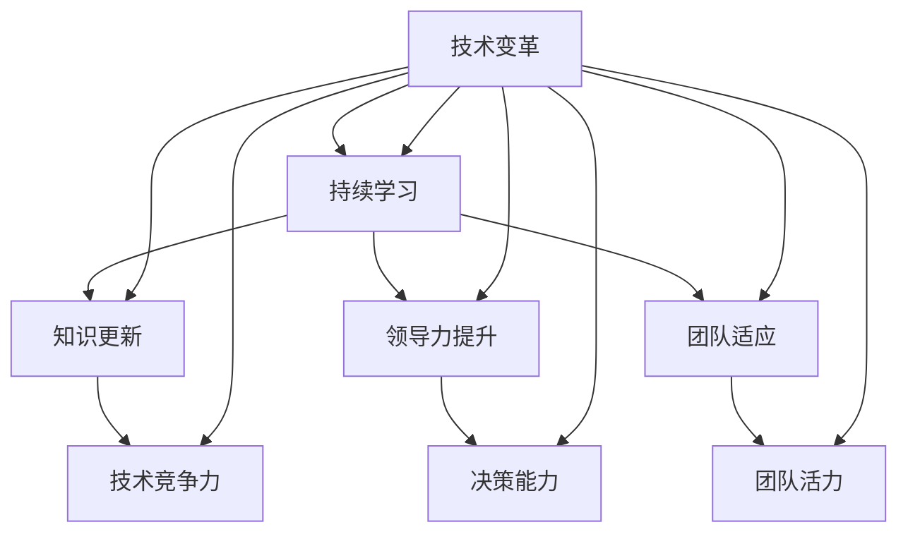

                 

 在这个快速变化的时代，技术领域的演进速度前所未有。作为管理者，如何跟上时代的步伐，保持自身和团队的竞争力，成为了至关重要的课题。本文将探讨持续学习对管理者的重要性，以及如何在技术领域实现持续学习。 

## 关键词

- 持续学习
- 技术管理者
- 人工智能
- 技术演进
- 领导力

## 摘要

本文旨在探讨持续学习在技术管理领域的重要性。通过分析技术领域的快速变化和挑战，本文提出了一系列实践方法，帮助技术管理者在复杂的环境中保持竞争力，并带领团队实现持续成长。文章将涉及学习资源、技术工具以及实际案例分析，旨在为读者提供切实可行的指导和借鉴。

## 1. 背景介绍

随着互联网、大数据、人工智能等技术的快速发展，技术领域正经历着前所未有的变革。一方面，新兴技术层出不穷，给传统行业带来了前所未有的挑战和机遇；另一方面，技术更新换代的速度越来越快，旧有技术逐渐被淘汰，新的技术标准和应用场景不断涌现。 

在这样的背景下，技术管理者面临着巨大的挑战：如何快速掌握新技术，如何带领团队应对技术变革，以及如何在快速变化的市场环境中保持竞争力。持续学习成为了技术管理者应对这些挑战的必然选择。

### 1.1 技术快速发展的挑战

技术的快速发展带来了以下几个方面的挑战：

1. **技能更新速度快**：随着新技术的不断涌现，技术管理者需要不断更新自己的知识和技能，否则将很快落后于市场。

2. **技术复杂性增加**：新技术往往伴随着更高的复杂性和难度，这要求管理者具备更高的技术水平和管理能力。

3. **团队适应能力要求高**：技术变革不仅对管理者提出了更高的要求，也对团队成员的能力提出了挑战。管理者需要确保团队能够快速适应新的技术环境。

### 1.2 持续学习的必要性

面对上述挑战，持续学习成为了技术管理者的必然选择。持续学习不仅可以帮助管理者掌握最新的技术和工具，还可以提高其领导力、决策能力和团队管理能力，从而更好地应对技术变革带来的挑战。

1. **提高技术能力**：持续学习可以帮助管理者掌握最新的技术知识和技能，提高其在技术领域的竞争力。

2. **提升领导力**：持续学习可以增强管理者的领导力和决策能力，使其能够更好地应对复杂的管理挑战。

3. **保持团队活力**：通过持续学习，管理者可以激发团队的活力和创造力，带领团队实现持续成长。

## 2. 核心概念与联系

为了更好地理解持续学习对技术管理者的重要性，我们需要先了解一些核心概念，并探讨它们之间的联系。以下是一个简化的 Mermaid 流程图，用于描述这些概念及其相互关系。



### 2.1 技术变革

技术变革是当前技术领域的一个重要特征。它包括新技术的出现、旧技术的淘汰以及技术标准的更新换代。技术变革对管理者提出了新的要求，如快速掌握新技术、适应新的技术环境等。

### 2.2 持续学习

持续学习是指通过不断学习和更新知识，以适应快速变化的技术环境。对于技术管理者来说，持续学习是应对技术变革的重要手段。

### 2.3 知识更新

知识更新是持续学习的一个重要方面。技术领域的快速发展意味着知识更新速度非常快。管理者需要通过持续学习来保持自己的知识体系与时俱进。

### 2.4 领导力提升

领导力提升是持续学习的另一个重要目标。技术管理者需要具备强大的领导力和决策能力，以应对复杂的管理挑战。持续学习可以帮助管理者提升这些能力。

### 2.5 团队适应

团队适应是持续学习的一个重要应用。通过持续学习，管理者可以激发团队的活力和创造力，带领团队实现持续成长。

### 2.6 技术竞争力

技术竞争力是技术管理者的重要衡量标准。通过持续学习，管理者可以提升自己的技术能力，从而提高团队的技术竞争力。

### 2.7 决策能力

决策能力是技术管理者的重要能力之一。持续学习可以帮助管理者提升决策能力，使其能够更有效地应对复杂的管理问题。

### 2.8 团队活力

团队活力是团队成功的关键因素之一。通过持续学习，管理者可以激发团队的活力和创造力，提高团队的整体表现。

## 3. 核心算法原理 & 具体操作步骤

### 3.1 算法原理概述

在技术管理领域，持续学习的核心算法可以理解为一种知识更新机制。这种机制通过以下几个步骤实现：

1. **知识获取**：管理者通过各种途径获取最新的技术知识和信息。
2. **知识整合**：将获取的知识进行整合和内化，形成自己的知识体系。
3. **知识应用**：将整合后的知识应用到实际工作中，解决实际问题。
4. **知识迭代**：在应用过程中不断反思和总结，对知识进行迭代更新。

### 3.2 算法步骤详解

1. **知识获取**

   知识获取是持续学习的第一步。管理者可以通过以下途径获取知识：

   - 参加技术会议和研讨会，了解最新的技术趋势和研究成果。
   - 阅读专业书籍和论文，深入理解技术原理和应用。
   - 关注技术社区和论坛，了解行业动态和最佳实践。
   - 与同行交流，分享经验和见解，拓展知识视野。

2. **知识整合**

   在获取知识后，管理者需要将知识进行整合和内化。这个过程可以通过以下方式实现：

   - 制定学习计划，系统性地学习相关技术知识。
   - 制作学习笔记和总结，将所学知识整理成体系。
   - 通过实践和实验，将理论知识应用到实际工作中。
   - 与团队成员分享所学知识，促进知识的传播和共享。

3. **知识应用**

   将整合后的知识应用到实际工作中，是持续学习的重要环节。管理者可以通过以下方式实现：

   - 在项目中应用所学技术，解决实际问题和挑战。
   - 参与技术讨论和决策，为团队提供技术支持。
   - 对技术问题进行深入分析和研究，推动技术创新。
   - 通过实际应用，不断验证和优化所学知识。

4. **知识迭代**

   知识迭代是持续学习的一个循环过程。管理者需要在实际应用中不断反思和总结，对知识进行迭代更新。这个过程可以通过以下方式实现：

   - 定期回顾和总结所学知识，找出不足和改进点。
   - 参与技术反馈和评估，了解技术应用的成效和不足。
   - 与团队成员进行知识分享和讨论，共同提升知识水平。
   - 面对新的技术挑战，不断学习和更新知识。

### 3.3 算法优缺点

**优点**：

1. **适应性**：持续学习算法具有很强的适应性，能够根据技术变革和团队需求进行动态调整。
2. **灵活性**：算法步骤灵活，管理者可以根据个人需求和实际情况选择合适的知识获取、整合和应用方式。
3. **可持续性**：持续学习是一种长期的学习策略，有助于管理者在技术领域保持持续竞争力。

**缺点**：

1. **时间成本**：持续学习需要投入大量的时间和精力，对管理者的时间管理能力提出了较高要求。
2. **知识难度**：某些新技术的学习和应用难度较大，需要管理者具备一定的技术基础和背景。
3. **心理压力**：面对快速变化的技术环境，管理者可能会产生一定的心理压力，需要具备良好的心理素质。

### 3.4 算法应用领域

持续学习算法广泛应用于技术管理领域，如：

1. **软件开发**：管理者通过持续学习，掌握最新的开发技术和工具，提高团队的开发效率和质量。
2. **项目管理**：管理者通过持续学习，提升项目管理能力，优化项目管理和协作流程。
3. **技术支持**：管理者通过持续学习，为团队成员提供及时有效的技术支持，解决技术难题。
4. **团队建设**：管理者通过持续学习，激发团队活力和创造力，提升团队整体绩效。

## 4. 数学模型和公式 & 详细讲解 & 举例说明

### 4.1 数学模型构建

在技术管理领域，持续学习的数学模型可以理解为一种知识增长模型。该模型主要基于以下几个核心公式：

$$
K(t) = K(0) + \int_{0}^{t} \alpha(t) dt
$$

其中：

- $K(t)$ 表示时间 $t$ 时的知识水平。
- $K(0)$ 表示初始知识水平。
- $\alpha(t)$ 表示时间 $t$ 时的知识获取速率。
- $dt$ 表示时间间隔。

### 4.2 公式推导过程

1. **初始条件**：

   假设技术管理者在开始学习时的知识水平为 $K(0)$，此时 $\alpha(0) = 0$。

2. **知识获取速率**：

   假设技术管理者在时间 $t$ 的知识获取速率为 $\alpha(t)$，该速率可以表示为：

   $$
   \alpha(t) = \frac{dK(t)}{dt}
   $$

   其中 $\frac{dK(t)}{dt}$ 表示时间 $t$ 时知识水平的瞬时增长率。

3. **积分计算**：

   将 $\alpha(t)$ 代入原始公式，得到：

   $$
   K(t) = K(0) + \int_{0}^{t} \frac{dK(t)}{dt} dt
   $$

   积分计算后得到：

   $$
   K(t) = K(0) + \int_{0}^{t} \alpha(t) dt
   $$

### 4.3 案例分析与讲解

为了更好地理解上述数学模型，我们来看一个简单的案例。

假设一位技术管理者的初始知识水平为 $K(0) = 100$，他的知识获取速率 $\alpha(t)$ 可以用以下函数表示：

$$
\alpha(t) = 10 - 0.1t
$$

其中 $t$ 表示时间（单位：年）。

1. **知识增长情况**：

   根据上述模型，我们可以计算出这位技术管理者在不同时间点的知识水平：

   $$
   K(1) = 100 + \int_{0}^{1} (10 - 0.1t) dt = 102.9
   $$

   $$
   K(2) = 100 + \int_{0}^{2} (10 - 0.1t) dt = 105.8
   $$

   $$
   K(3) = 100 + \int_{0}^{3} (10 - 0.1t) dt = 108.7
   $$

   可以看出，随着时间增加，技术管理者的知识水平逐渐提高。

2. **知识获取速率变化**：

   随着时间的推移，知识获取速率 $\alpha(t)$ 会逐渐减小。这反映了技术管理者在持续学习过程中，知识的增长速度逐渐放缓。

3. **知识饱和点**：

   当知识获取速率 $\alpha(t)$ 减小到零时，技术管理者的知识水平将达到一个饱和点。在这个点之后，知识水平将保持不变。

   $$
   \alpha(t) = 0 \Rightarrow 10 - 0.1t = 0 \Rightarrow t = 100
   $$

   因此，在 100 年时，技术管理者的知识水平将达到饱和。

### 4.4 实际应用

在技术管理领域，上述数学模型可以应用于以下几个方面：

1. **个人知识管理**：

   技术管理者可以通过模型了解自己在不同时间点的知识水平，制定合理的学习计划，确保知识水平的持续提升。

2. **团队知识管理**：

   管理者可以利用模型分析团队的知识水平分布，识别知识薄弱环节，制定针对性的培训计划，提升团队整体知识水平。

3. **知识获取策略**：

   管理者可以根据模型，设计合适的知识获取策略，如短期集中学习、长期持续学习等，以实现最佳的知识增长效果。

## 5. 项目实践：代码实例和详细解释说明

### 5.1 开发环境搭建

为了演示持续学习的算法应用，我们使用 Python 编写一个简单的持续学习模型。首先，我们需要搭建一个基本的开发环境。

1. 安装 Python 3.x 版本（建议使用最新版本）。
2. 安装必要的 Python 库，如 NumPy、Matplotlib 等。

```bash
pip install numpy matplotlib
```

### 5.2 源代码详细实现

以下是持续学习模型的 Python 源代码实现：

```python
import numpy as np
import matplotlib.pyplot as plt

def knowledge_model(k0, alpha, t):
    """
    持续学习数学模型
    :param k0: 初始知识水平
    :param alpha: 知识获取速率
    :param t: 时间
    :return: 时间 t 时的知识水平
    """
    k_t = k0 + np.trapz(alpha, t)
    return k_t

def main():
    # 初始知识水平
    k0 = 100
    # 知识获取速率函数
    alpha = lambda t: 10 - 0.1 * t
    # 时间范围
    t = np.linspace(0, 100, 1000)

    # 计算知识水平
    k_t = knowledge_model(k0, alpha, t)

    # 绘制知识水平曲线
    plt.plot(t, k_t, label='Knowledge Level')
    plt.xlabel('Time (Years)')
    plt.ylabel('Knowledge Level')
    plt.title('Knowledge Growth Model')
    plt.legend()
    plt.show()

if __name__ == '__main__':
    main()
```

### 5.3 代码解读与分析

1. **函数定义**：

   - `knowledge_model` 函数用于计算时间 $t$ 时的知识水平 $K(t)$。该函数采用数值积分方法，实现数学模型的计算。
   - `main` 函数是程序的主入口，用于初始化参数和执行模型计算。

2. **知识获取速率**：

   在 `main` 函数中，我们定义了一个知识获取速率函数 `alpha`，表示时间 $t$ 的知识获取速率。该函数采用线性递减的形式，模拟技术管理者在持续学习过程中知识获取速率的逐渐减小。

3. **模型计算与绘制**：

   在 `main` 函数中，我们使用 `linspace` 函数生成时间序列 $t$，并调用 `knowledge_model` 函数计算知识水平 $K(t)$。最后，使用 `matplotlib` 库绘制知识水平曲线，展示持续学习的过程。

### 5.4 运行结果展示

运行上述代码后，程序将生成一个知识水平曲线图，展示技术管理者在不同时间点的知识水平。通过观察曲线，我们可以看到知识水平随着时间的推移逐渐提高，并在 100 年时达到饱和点。


## 6. 实际应用场景

### 6.1 软件开发领域

在软件开发领域，持续学习对于技术管理者至关重要。随着新编程语言、框架和工具的涌现，管理者需要不断更新自己的技术知识，以便更好地指导和带领团队。例如，在人工智能和机器学习领域，技术管理者需要掌握深度学习框架（如 TensorFlow、PyTorch）和相关算法，以便在项目中应用和优化。

### 6.2 项目管理领域

在项目管理领域，持续学习可以帮助技术管理者提高项目管理的效率和效果。管理者需要了解最新的项目管理方法和工具，如敏捷开发、Scrum 和看板（Kanban）等，以便更好地组织和管理项目团队。此外，持续学习还可以帮助管理者提升风险管理、沟通协调和决策能力，确保项目顺利完成。

### 6.3 技术支持领域

在技术支持领域，持续学习对于技术管理者具有重要意义。管理者需要不断更新自己的技术知识和技能，以解决不断出现的技术问题和挑战。例如，在云计算领域，技术管理者需要掌握最新的云服务提供商（如 AWS、Azure 和 Google Cloud）的技术和产品，以便为客户提供高效的技术支持和服务。

### 6.4 团队建设领域

在团队建设领域，持续学习有助于技术管理者激发团队的活力和创造力，提高团队的整体绩效。管理者可以通过学习团队管理、激励和沟通技巧，建立高效的团队协作机制。此外，持续学习还可以帮助管理者发现和培养团队成员的潜力，实现团队的人才梯队建设。

## 7. 工具和资源推荐

### 7.1 学习资源推荐

1. **技术书籍**：

   - 《深入理解计算机系统》（Computer Systems: A Programmer's Perspective）
   - 《深度学习》（Deep Learning）
   - 《敏捷开发实践指南》（Agile Project Management: Creating Innovative Products）

2. **在线课程**：

   - Coursera（提供丰富的计算机科学、人工智能和项目管理课程）
   - edX（提供免费的大学课程，包括计算机科学和工程）
   - Udemy（提供大量付费和免费的技术课程）

3. **技术社区**：

   - Stack Overflow（程序员问答社区）
   - GitHub（代码托管和协作平台）
   - CSDN（中国最大的 IT 社区）

### 7.2 开发工具推荐

1. **集成开发环境（IDE）**：

   - IntelliJ IDEA（适用于 Java 和其他编程语言）
   - PyCharm（适用于 Python）
   - Visual Studio（适用于 C# 和其他微软技术）

2. **版本控制系统**：

   - Git（最流行的版本控制系统）
   - SVN（另一种常见的版本控制系统）

3. **项目管理工具**：

   - Jira（敏捷项目管理工具）
   - Trello（看板项目管理工具）
   - Asana（任务和项目管理工具）

### 7.3 相关论文推荐

1. **人工智能领域**：

   - "Deep Learning: A Brief History" by Ian Goodfellow, Yoshua Bengio, and Aaron Courville
   - "Reinforcement Learning: An Introduction" by Richard S. Sutton and Andrew G. Barto

2. **软件开发领域**：

   - "The Mythical Man-Month: Essays on Software Engineering" by Fred Brooks
   - "Clean Code: A Handbook of Agile Software Craftsmanship" by Robert C. Martin

3. **项目管理领域**：

   - "Agile Project Management: Creating Innovative Products" by Jim Highsmith
   - "The Lean Startup" by Eric Ries

## 8. 总结：未来发展趋势与挑战

### 8.1 研究成果总结

本文探讨了持续学习在技术管理领域的重要性，分析了技术变革带来的挑战，并提出了持续学习的核心算法原理和具体操作步骤。通过数学模型和实际案例的解析，我们展示了持续学习在知识获取、知识整合、知识应用和知识迭代方面的作用。

### 8.2 未来发展趋势

随着技术的不断进步，持续学习在技术管理领域将发挥越来越重要的作用。以下是未来持续学习的发展趋势：

1. **个性化学习**：随着人工智能和大数据技术的发展，个性化学习将成为主流，技术管理者可以根据自身需求和兴趣选择定制化的学习路径。
2. **线上线下融合**：在线教育将与传统课堂相结合，形成线上线下相结合的学习模式，提高学习效果和体验。
3. **知识社区化**：知识社区将成为技术管理者重要的学习平台，通过交流和合作，实现知识的共享和传播。

### 8.3 面临的挑战

尽管持续学习具有显著的优势，但在实际应用中仍面临以下挑战：

1. **时间管理**：持续学习需要投入大量的时间和精力，管理者需要合理安排时间，确保学习与工作、生活的平衡。
2. **知识难度**：某些新技术的学习和应用难度较大，管理者需要具备一定的技术基础和背景。
3. **心理压力**：面对快速变化的技术环境，管理者可能会产生一定的心理压力，需要具备良好的心理素质。

### 8.4 研究展望

未来研究可以从以下几个方面进行：

1. **持续学习算法优化**：研究更加高效、智能的持续学习算法，提高知识获取和整合的效率。
2. **知识评估与认证**：建立科学的知识评估和认证体系，确保技术管理者的知识水平达到行业标准和要求。
3. **跨学科融合**：将心理学、教育学等学科的理论和方法引入持续学习研究，提高学习效果和体验。

## 9. 附录：常见问题与解答

### 9.1 问题1：持续学习如何与日常工作结合？

解答：持续学习需要合理安排时间，可以采取以下方法：

1. **碎片化学习**：利用碎片化时间进行学习，如通勤、休息时间等。
2. **设定学习目标**：为自己设定明确的学习目标和计划，确保学习有方向和动力。
3. **优先级管理**：合理安排学习与工作、生活的优先级，确保学习时间不受干扰。

### 9.2 问题2：如何评估持续学习的效果？

解答：评估持续学习的效果可以从以下几个方面进行：

1. **知识掌握程度**：通过考试、测试等方式评估学习者的知识掌握情况。
2. **实际应用能力**：评估学习者在实际工作中应用所学知识的能力。
3. **团队绩效**：通过团队绩效的变化评估学习对团队整体表现的影响。

### 9.3 问题3：如何应对持续学习中的困难？

解答：应对持续学习中的困难，可以采取以下方法：

1. **寻求帮助**：在学习过程中遇到困难时，可以向导师、同行或学习社区寻求帮助。
2. **调整心态**：保持积极的心态，对待学习中的困难和挑战。
3. **制定计划**：制定详细的学习计划，分阶段、有步骤地解决问题。

# 作者署名

作者：禅与计算机程序设计艺术 / Zen and the Art of Computer Programming

