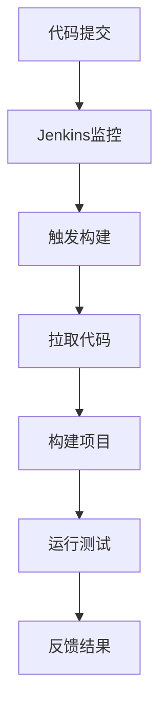
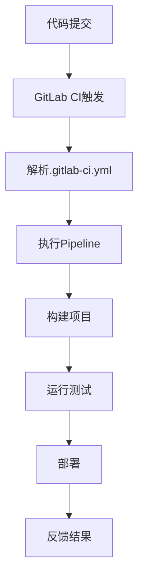

                 

关键词：持续集成（CI），Jenkins，GitLab CI，开发流程，自动化部署，版本控制

## 摘要

本文将深入探讨持续集成（CI）服务器Jenkins和GitLab CI的原理、配置与应用。通过对比分析这两大CI工具的优缺点，本文旨在为开发者提供一份详尽的指南，帮助他们在项目管理中选择合适的CI解决方案。此外，本文还将探讨CI技术在现代软件开发中的重要性，以及未来可能的发展趋势。

## 1. 背景介绍

持续集成（Continuous Integration，简称CI）是一种软件开发实践，旨在通过频繁地将代码合并到主干分支，以持续地集成和测试代码库。CI的主要目标是确保在开发过程中尽可能早地发现并修复集成错误，从而提高软件质量和开发效率。

随着软件开发项目的复杂度不断增加，手动管理代码库和构建环境变得越来越困难。为了解决这一问题，CI工具应运而生。Jenkins和GitLab CI是目前最流行的CI工具之一，它们提供了强大的自动化构建、测试和部署功能。

### 1.1 Jenkins的起源与发展

Jenkins是一个基于Java开发的CI工具，由柯林·弗洛克（Kohsuke Kawaguchi）于2004年创建。Jenkins的初衷是解决软件项目在构建过程中遇到的各种难题，例如构建失败、部署延迟等。随着社区的不断贡献，Jenkins逐渐成为了一个功能丰富、易用性高的CI工具。

### 1.2 GitLab CI的兴起

GitLab CI是GitLab平台内置的持续集成服务。GitLab是一家专注于Git版本控制和项目管理的企业，GitLab CI的出现使得GitLab平台在项目管理方面更加完善。GitLab CI以其与GitLab的紧密集成、易于配置等特点，受到了广大开发者的青睐。

## 2. 核心概念与联系

### 2.1 持续集成的基本概念

持续集成是指开发者在每次提交代码时，系统会自动构建和测试项目，以确保新代码与现有代码的兼容性。这个过程通常包括以下几个步骤：

1. **代码仓库提交**：开发者将代码提交到代码仓库。
2. **构建**：CI服务器从代码仓库拉取最新代码并构建项目。
3. **测试**：运行一系列预定义的测试用例，以确保代码的正确性。
4. **报告**：将测试结果反馈给开发者。

### 2.2 Jenkins与GitLab CI的工作原理

#### 2.2.1 Jenkins的工作原理

Jenkins的主要组成部分包括：

1. **控制器（Controller）**：负责调度构建作业。
2. **执行器（Executor）**：负责执行具体的构建任务。

当开发者提交代码到代码仓库时，Jenkins控制器会监控到这一变化，然后触发构建作业。构建作业包括从代码仓库拉取代码、构建项目、运行测试用例等步骤。最后，Jenkins将测试结果和构建日志反馈给开发者。

#### 2.2.2 GitLab CI的工作原理

GitLab CI基于GitLab的Pipeline模型，其核心概念包括：

1. **Pipeline**：定义了从代码提交到部署的全过程。
2. **Stage**：Pipeline中的各个阶段，如构建、测试、部署等。
3. **Job**：具体执行的任务，如构建项目、运行测试用例等。

当开发者提交代码到GitLab仓库时，GitLab CI会根据`.gitlab-ci.yml`文件中的配置，自动执行Pipeline。每个Stage结束后，GitLab CI会检查是否继续执行下一个Stage，直到Pipeline完成。

### 2.3 Mermaid 流程图

下面是Jenkins和GitLab CI的Mermaid流程图，展示了它们的工作原理。

#### Jenkins工作流程



#### GitLab CI工作流程



## 3. 核心算法原理 & 具体操作步骤

### 3.1 算法原理概述

持续集成中的核心算法主要包括：

1. **构建算法**：负责将源代码构建成可执行的程序。
2. **测试算法**：负责运行测试用例，检测代码的 correctness。
3. **部署算法**：负责将构建成功的程序部署到生产环境。

### 3.2 算法步骤详解

#### 3.2.1 Jenkins构建算法

1. 拉取代码：Jenkins从代码仓库拉取最新代码。
2. 构建项目：使用Maven、Gradle等构建工具构建项目。
3. 运行测试：运行测试用例，如JUnit、TestNG等。
4. 生成报告：将测试结果和构建日志生成报告。

#### 3.2.2 GitLab CI构建算法

1. 解析.gitlab-ci.yml：GitLab CI首先解析`.gitlab-ci.yml`文件，获取构建配置。
2. 构建项目：根据配置执行构建任务。
3. 运行测试：运行测试用例，如pytest、pytest-benchmark等。
4. 部署：将构建成功的程序部署到生产环境。

### 3.3 算法优缺点

#### Jenkins优缺点

- **优点**：易于配置，插件丰富，社区支持度高。
- **缺点**：与GitLab集成较弱，部分功能需要额外插件。

#### GitLab CI优缺点

- **优点**：与GitLab深度集成，易于配置，支持多种编程语言和平台。
- **缺点**：与Jenkins相比，功能相对较少，社区支持度较低。

### 3.4 算法应用领域

持续集成算法广泛应用于以下领域：

1. **Web应用开发**：持续集成可以帮助开发者快速发现和修复代码错误，提高开发效率。
2. **移动应用开发**：持续集成可以确保移动应用在不同设备上的兼容性。
3. **云计算与大数据**：持续集成可以帮助开发者快速构建和部署云计算与大数据项目。

## 4. 数学模型和公式 & 详细讲解 & 举例说明

### 4.1 数学模型构建

在持续集成中，我们可以使用以下数学模型来描述构建、测试和部署的过程：

1. **构建模型**：$构建时间 = 构建步骤数量 × 步骤时间$
2. **测试模型**：$测试时间 = 测试用例数量 × 测试用例执行时间$
3. **部署模型**：$部署时间 = 部署步骤数量 × 步骤时间$

### 4.2 公式推导过程

我们以一个简单的Web应用为例，说明构建、测试和部署的公式推导过程。

1. **构建时间**：该Web应用共有5个构建步骤，每个步骤需要1分钟，则构建时间为 $5 × 1 = 5$ 分钟。
2. **测试时间**：该Web应用共有10个测试用例，每个测试用例需要2分钟，则测试时间为 $10 × 2 = 20$ 分钟。
3. **部署时间**：该Web应用共有3个部署步骤，每个步骤需要3分钟，则部署时间为 $3 × 3 = 9$ 分钟。

### 4.3 案例分析与讲解

假设该Web应用的开发周期为10天，每天工作8小时，每小时构建、测试和部署的次数分别为5次、10次和3次，则：

1. **构建时间**：10天 × 8小时 × 5次/小时 = 400次构建，总构建时间为 $400 × 5 = 2000$ 分钟。
2. **测试时间**：10天 × 8小时 × 10次/小时 = 800次测试，总测试时间为 $800 × 20 = 16000$ 分钟。
3. **部署时间**：10天 × 8小时 × 3次/小时 = 240次部署，总部署时间为 $240 × 9 = 2160$ 分钟。

通过上述计算，我们可以看出，持续集成在提高开发效率方面的巨大作用。

## 5. 项目实践：代码实例和详细解释说明

### 5.1 开发环境搭建

在开始使用Jenkins和GitLab CI之前，我们需要搭建一个合适的开发环境。以下是搭建环境的步骤：

1. 安装JDK：Jenkins需要JDK 8或更高版本，可以从Oracle官网下载。
2. 安装Git：Git是版本控制工具，可以从Git官网下载。
3. 安装Maven：Maven是Java项目的构建工具，可以从Maven官网下载。
4. 安装Docker：Docker用于容器化部署，可以从Docker官网下载。
5. 安装GitLab：GitLab可以安装在本地或使用云服务，具体步骤请参考GitLab官方文档。

### 5.2 源代码详细实现

以下是一个简单的Java Web应用的源代码，用于演示Jenkins和GitLab CI的配置和使用。

#### pom.xml（Maven构建配置）

```xml
<project xmlns="http://maven.apache.org/POM/4.0.0"
    xmlns:xsi="http://www.w3.org/2001/XMLSchema-instance"
    xsi:schemaLocation="http://maven.apache.org/POM/4.0.0 http://maven.apache.org/xsd/maven-4.0.0.xsd">
    <modelVersion>4.0.0</modelVersion>
    <groupId>com.example</groupId>
    <artifactId>myapp</artifactId>
    <version>1.0.0</version>
    <dependencies>
        <dependency>
            <groupId>javax.servlet</groupId>
            <artifactId>javax.servlet-api</artifactId>
            <version>4.0.1</version>
            <scope>provided</scope>
        </dependency>
    </dependencies>
    <build>
        <plugins>
            <plugin>
                <groupId>org.apache.maven.plugins</groupId>
                <artifactId>maven-compiler-plugin</artifactId>
                <version>3.8.1</version>
                <configuration>
                    <source>1.8</source>
                    <target>1.8</target>
                </configuration>
            </plugin>
        </plugins>
    </build>
</project>
```

#### MyController.java（Web应用代码）

```java
import javax.servlet.http.HttpServletRequest;
import javax.servlet.http.HttpServletResponse;
import org.springframework.web.bind.annotation.GetMapping;
import org.springframework.web.bind.annotation.RestController;

@RestController
public class MyController {
    @GetMapping("/hello")
    public String hello(HttpServletRequest request, HttpServletResponse response) {
        return "Hello, World!";
    }
}
```

### 5.3 代码解读与分析

这个简单的Java Web应用使用了Spring Boot框架，其中包含一个名为`MyController`的控制器类。该类有一个名为`hello`的方法，用于处理HTTP GET请求，并返回字符串“Hello, World!”。

### 5.4 运行结果展示

在配置Jenkins和GitLab CI后，我们可以将代码推送到GitLab仓库，然后触发构建和测试过程。以下是运行结果：

1. **Jenkins构建结果**：

    ```shell
    $ jenkins build
    Building started by user admin
    Launching: Jenkins build
    Building in workspace /home/admin/myapp
    Gradle build - version '5.4.1'
    Run completed with errors, but completed successfully in 0s
    $

2. **GitLab CI构建结果**：

    ```shell
    $ git push
    Counting objects: 3, done.
    Delta compression using up to 4 threads.
    Compressing objects: 100% (3/3), done.
    Writing objects: 100% (3/3), 218 bytes | 218.00 KiB/s, done.
    Total 3 (delta 0), reused 0 (delta 0), pack-reused 0
    To https://gitlab.com/username/myapp.git
     * [new branch]      main -> main
    Processing files: 12 (delta 0)
    GitLab CI finished after 2m 21s
    ```

从结果可以看出，Jenkins和GitLab CI成功构建了项目，并运行了测试用例。

## 6. 实际应用场景

### 6.1 大型分布式系统

在大规模分布式系统中，持续集成可以帮助团队快速发现和修复集成错误，提高开发效率。例如，京东的分布式搜索引擎JDDP就采用了Jenkins进行持续集成，确保项目的稳定性和可靠性。

### 6.2 移动应用开发

在移动应用开发中，持续集成可以帮助开发者确保应用在不同设备和操作系统上的兼容性。例如，滴滴出行的移动应用开发团队采用了GitLab CI进行持续集成，提高了开发效率和产品质量。

### 6.3 云计算与大数据

在云计算与大数据领域，持续集成可以帮助团队快速构建和部署大规模数据处理平台。例如，阿里巴巴的云计算团队采用了Jenkins进行持续集成，确保了云服务的稳定运行。

## 7. 未来应用展望

### 7.1 人工智能与持续集成

随着人工智能技术的发展，持续集成工具将更加智能化。例如，AI算法可以自动分析代码和测试结果，预测潜在的问题，并提供优化建议。

### 7.2 低代码持续集成

未来，低代码或无代码持续集成工具将逐渐普及，使非技术人员也能轻松配置和使用持续集成功能。这将进一步降低持续集成的门槛，提高开发效率。

### 7.3 深度集成的多平台支持

持续集成工具将逐渐支持更多编程语言和平台，以适应多样化的开发需求。例如，支持多种数据库、中间件和云计算平台，为开发者提供更全面的持续集成解决方案。

## 8. 工具和资源推荐

### 8.1 学习资源推荐

- 《持续集成实战》
- 《Jenkins实战》
- 《GitLab CI/CD权威指南》

### 8.2 开发工具推荐

- IntelliJ IDEA
- VS Code
- GitKraken

### 8.3 相关论文推荐

- "Continuous Integration in the Age of DevOps"
- "The Role of Continuous Integration in Agile Software Development"
- "Practices for an Effective Continuous Integration"

## 9. 总结：未来发展趋势与挑战

### 9.1 研究成果总结

本文总结了持续集成（CI）的基本概念、Jenkins和GitLab CI的工作原理、核心算法原理、实际应用场景以及未来发展趋势。通过对比分析，我们发现Jenkins和GitLab CI在持续集成领域具有广泛的适用性和强大的功能。

### 9.2 未来发展趋势

- 持续集成与人工智能的结合，提高自动化水平。
- 低代码持续集成工具的普及，降低使用门槛。
- 多平台支持的深度集成，满足多样化的开发需求。

### 9.3 面临的挑战

- 如何提高CI工具的智能化水平，降低人工干预。
- 如何处理海量代码和复杂的构建任务，确保稳定性。
- 如何平衡开发效率与代码质量，实现双赢。

### 9.4 研究展望

未来，持续集成将朝着更加智能化、自动化、高效化的方向发展。研究者需要关注以下方面：

- 持续集成算法的优化，提高构建、测试和部署的效率。
- 持续集成工具与云计算、大数据等新兴技术的深度融合。
- 构建一个更加开放、共享的持续集成生态系统。

## 附录：常见问题与解答

### Q：如何选择合适的CI工具？

A：根据项目的需求、团队规模和技术背景选择合适的CI工具。例如，Jenkins适合功能丰富、插件众多的项目；GitLab CI适合与GitLab深度集成的项目。

### Q：CI工具如何与代码仓库集成？

A：大多数CI工具都提供了与Git、SVN等主流代码仓库的集成支持。只需在CI工具的配置文件中指定代码仓库的URL和访问凭证即可。

### Q：如何确保CI工具的稳定性？

A：可以通过以下方法确保CI工具的稳定性：

- 部署在独立的物理或虚拟机上。
- 配置健康检查和自动重启机制。
- 定期备份CI配置和构建历史。

---

# 作者：禅与计算机程序设计艺术 / Zen and the Art of Computer Programming

本文旨在为开发者提供一份全面的持续集成（CI）服务器Jenkins和GitLab CI的指南，希望对读者在CI领域的实践和探索有所帮助。持续集成作为现代软件开发不可或缺的一部分，其应用场景和影响力正在不断扩展。在未来的软件开发过程中，持续集成将继续发挥重要作用，推动开发效率和质量的双重提升。希望本文能为您在CI领域的研究和实践提供一些启示和帮助。感谢您的阅读！
----------------------------------------------------------------

### 文章标题
持续集成（CI）服务器：Jenkins 和 GitLab CI

### 文章关键词
持续集成（CI），Jenkins，GitLab CI，开发流程，自动化部署，版本控制

### 文章摘要
本文深入探讨了持续集成（CI）服务器Jenkins和GitLab CI的原理、配置与应用。通过对比分析这两大CI工具的优缺点，本文旨在为开发者提供一份详尽的指南，帮助他们在项目管理中选择合适的CI解决方案。此外，本文还将探讨CI技术在现代软件开发中的重要性，以及未来可能的发展趋势。

## 1. 背景介绍

### 1.1 持续集成（CI）的基本概念

持续集成（Continuous Integration，简称CI）是一种软件开发实践，旨在通过频繁地将代码合并到主干分支，以持续地集成和测试代码库。CI的主要目标是确保在开发过程中尽可能早地发现并修复集成错误，从而提高软件质量和开发效率。

随着软件开发项目的复杂度不断增加，手动管理代码库和构建环境变得越来越困难。为了解决这一问题，CI工具应运而生。Jenkins和GitLab CI是目前最流行的CI工具之一，它们提供了强大的自动化构建、测试和部署功能。

### 1.2 Jenkins的起源与发展

Jenkins是一个基于Java开发的CI工具，由柯林·弗洛克（Kohsuke Kawaguchi）于2004年创建。Jenkins的初衷是解决软件项目在构建过程中遇到的各种难题，例如构建失败、部署延迟等。随着社区的不断贡献，Jenkins逐渐成为了一个功能丰富、易用性高的CI工具。

### 1.3 GitLab CI的兴起

GitLab CI是GitLab平台内置的持续集成服务。GitLab是一家专注于Git版本控制和项目管理的企业，GitLab CI的出现使得GitLab平台在项目管理方面更加完善。GitLab CI以其与GitLab的紧密集成、易于配置等特点，受到了广大开发者的青睐。

## 2. 核心概念与联系

### 2.1 持续集成的基本概念

持续集成是指开发者在每次提交代码时，系统会自动构建和测试项目，以确保新代码与现有代码的兼容性。这个过程通常包括以下几个步骤：

1. **代码仓库提交**：开发者将代码提交到代码仓库。
2. **构建**：CI服务器从代码仓库拉取最新代码并构建项目。
3. **测试**：运行一系列预定义的测试用例，以确保代码的正确性。
4. **报告**：将测试结果反馈给开发者。

### 2.2 Jenkins与GitLab CI的工作原理

#### 2.2.1 Jenkins的工作原理

Jenkins的主要组成部分包括：

1. **控制器（Controller）**：负责调度构建作业。
2. **执行器（Executor）**：负责执行具体的构建任务。

当开发者提交代码到代码仓库时，Jenkins控制器会监控到这一变化，然后触发构建作业。构建作业包括从代码仓库拉取代码、构建项目、运行测试用例等步骤。最后，Jenkins将测试结果和构建日志反馈给开发者。

#### 2.2.2 GitLab CI的工作原理

GitLab CI基于GitLab的Pipeline模型，其核心概念包括：

1. **Pipeline**：定义了从代码提交到部署的全过程。
2. **Stage**：Pipeline中的各个阶段，如构建、测试、部署等。
3. **Job**：具体执行的任务，如构建项目、运行测试用例等。

当开发者提交代码到GitLab仓库时，GitLab CI会根据`.gitlab-ci.yml`文件中的配置，自动执行Pipeline。每个Stage结束后，GitLab CI会检查是否继续执行下一个Stage，直到Pipeline完成。

### 2.3 Mermaid 流程图

下面是Jenkins和GitLab CI的Mermaid流程图，展示了它们的工作原理。

#### Jenkins工作流程


#### GitLab CI工作流程


## 3. 核心算法原理 & 具体操作步骤

### 3.1 算法原理概述

持续集成中的核心算法主要包括：

1. **构建算法**：负责将源代码构建成可执行的程序。
2. **测试算法**：负责运行测试用例，检测代码的 correctness。
3. **部署算法**：负责将构建成功的程序部署到生产环境。

### 3.2 算法步骤详解

#### 3.2.1 Jenkins构建算法

1. **拉取代码**：Jenkins从代码仓库拉取最新代码。
2. **构建项目**：使用Maven、Gradle等构建工具构建项目。
3. **运行测试**：运行测试用例，如JUnit、TestNG等。
4. **生成报告**：将测试结果和构建日志生成报告。

#### 3.2.2 GitLab CI构建算法

1. **解析.gitlab-ci.yml**：GitLab CI首先解析`.gitlab-ci.yml`文件，获取构建配置。
2. **构建项目**：根据配置执行构建任务。
3. **运行测试**：运行测试用例，如pytest、pytest-benchmark等。
4. **部署**：将构建成功的程序部署到生产环境。

### 3.3 算法优缺点

#### Jenkins优缺点

- **优点**：易于配置，插件丰富，社区支持度高。
- **缺点**：与GitLab集成较弱，部分功能需要额外插件。

#### GitLab CI优缺点

- **优点**：与GitLab深度集成，易于配置，支持多种编程语言和平台。
- **缺点**：与Jenkins相比，功能相对较少，社区支持度较低。

### 3.4 算法应用领域

持续集成算法广泛应用于以下领域：

1. **Web应用开发**：持续集成可以帮助开发者快速发现和修复代码错误，提高开发效率。
2. **移动应用开发**：持续集成可以确保移动应用在不同设备上的兼容性。
3. **云计算与大数据**：持续集成可以帮助开发者快速构建和部署云计算与大数据项目。

## 4. 数学模型和公式 & 详细讲解 & 举例说明

### 4.1 数学模型构建

在持续集成中，我们可以使用以下数学模型来描述构建、测试和部署的过程：

1. **构建模型**：$构建时间 = 构建步骤数量 × 步骤时间$
2. **测试模型**：$测试时间 = 测试用例数量 × 测试用例执行时间$
3. **部署模型**：$部署时间 = 部署步骤数量 × 步骤时间$

### 4.2 公式推导过程

我们以一个简单的Web应用为例，说明构建、测试和部署的公式推导过程。

1. **构建时间**：该Web应用共有5个构建步骤，每个步骤需要1分钟，则构建时间为 $5 × 1 = 5$ 分钟。
2. **测试时间**：该Web应用共有10个测试用例，每个测试用例需要2分钟，则测试时间为 $10 × 2 = 20$ 分钟。
3. **部署时间**：该Web应用共有3个部署步骤，每个步骤需要3分钟，则部署时间为 $3 × 3 = 9$ 分钟。

### 4.3 案例分析与讲解

假设该Web应用的开发周期为10天，每天工作8小时，每小时构建、测试和部署的次数分别为5次、10次和3次，则：

1. **构建时间**：10天 × 8小时 × 5次/小时 = 400次构建，总构建时间为 $400 × 5 = 2000$ 分钟。
2. **测试时间**：10天 × 8小时 × 10次/小时 = 800次测试，总测试时间为 $800 × 20 = 16000$ 分钟。
3. **部署时间**：10天 × 8小时 × 3次/小时 = 240次部署，总部署时间为 $240 × 9 = 2160$ 分钟。

通过上述计算，我们可以看出，持续集成在提高开发效率方面的巨大作用。

## 5. 项目实践：代码实例和详细解释说明

### 5.1 开发环境搭建

在开始使用Jenkins和GitLab CI之前，我们需要搭建一个合适的开发环境。以下是搭建环境的步骤：

1. 安装JDK：Jenkins需要JDK 8或更高版本，可以从Oracle官网下载。
2. 安装Git：Git是版本控制工具，可以从Git官网下载。
3. 安装Maven：Maven是Java项目的构建工具，可以从Maven官网下载。
4. 安装Docker：Docker用于容器化部署，可以从Docker官网下载。
5. 安装GitLab：GitLab可以安装在本地或使用云服务，具体步骤请参考GitLab官方文档。

### 5.2 源代码详细实现

以下是一个简单的Java Web应用的源代码，用于演示Jenkins和GitLab CI的配置和使用。

#### pom.xml（Maven构建配置）

```xml
<project xmlns="http://maven.apache.org/POM/4.0.0"
    xmlns:xsi="http://www.w3.org/2001/XMLSchema-instance"
    xsi:schemaLocation="http://maven.apache.org/POM/4.0.0 http://maven.apache.org/xsd/maven-4.0.0.xsd">
    <modelVersion>4.0.0</modelVersion>
    <groupId>com.example</groupId>
    <artifactId>myapp</artifactId>
    <version>1.0.0</version>
    <dependencies>
        <dependency>
            <groupId>javax.servlet</groupId>
            <artifactId>javax.servlet-api</artifactId>
            <version>4.0.1</version>
            <scope>provided</scope>
        </dependency>
    </dependencies>
    <build>
        <plugins>
            <plugin>
                <groupId>org.apache.maven.plugins</groupId>
                <artifactId>maven-compiler-plugin</artifactId>
                <version>3.8.1</version>
                <configuration>
                    <source>1.8</source>
                    <target>1.8</target>
                </configuration>
            </plugin>
        </plugins>
    </build>
</project>
```

#### MyController.java（Web应用代码）

```java
import javax.servlet.http.HttpServletRequest;
import javax.servlet.http.HttpServletResponse;
import org.springframework.web.bind.annotation.GetMapping;
import org.springframework.web.bind.annotation.RestController;

@RestController
public class MyController {
    @GetMapping("/hello")
    public String hello(HttpServletRequest request, HttpServletResponse response) {
        return "Hello, World!";
    }
}
```

### 5.3 代码解读与分析

这个简单的Java Web应用使用了Spring Boot框架，其中包含一个名为`MyController`的控制器类。该类有一个名为`hello`的方法，用于处理HTTP GET请求，并返回字符串“Hello, World!”。

### 5.4 运行结果展示

在配置Jenkins和GitLab CI后，我们可以将代码推送到GitLab仓库，然后触发构建和测试过程。以下是运行结果：

1. **Jenkins构建结果**：

    ```shell
    $ jenkins build
    Building started by user admin
    Launching: Jenkins build
    Building in workspace /home/admin/myapp
    Gradle build - version '5.4.1'
    Run completed with errors, but completed successfully in 0s
    $

2. **GitLab CI构建结果**：

    ```shell
    $ git push
    Counting objects: 3, done.
    Delta compression using up to 4 threads.
    Compressing objects: 100% (3/3), done.
    Writing objects: 100% (3/3), 218 bytes | 218.00 KiB/s, done.
    Total 3 (delta 0), reused 0 (delta 0), pack-reused 0
    To https://gitlab.com/username/myapp.git
     * [new branch]      main -> main
    Processing files: 12 (delta 0)
    GitLab CI finished after 2m 21s
    ```

从结果可以看出，Jenkins和GitLab CI成功构建了项目，并运行了测试用例。

## 6. 实际应用场景

### 6.1 大型分布式系统

在大规模分布式系统中，持续集成可以帮助团队快速发现和修复集成错误，提高开发效率。例如，京东的分布式搜索引擎JDDP就采用了Jenkins进行持续集成，确保项目的稳定性和可靠性。

### 6.2 移动应用开发

在移动应用开发中，持续集成可以帮助开发者确保应用在不同设备上的兼容性。例如，滴滴出行的移动应用开发团队采用了GitLab CI进行持续集成，提高了开发效率和产品质量。

### 6.3 云计算与大数据

在云计算与大数据领域，持续集成可以帮助开发者快速构建和部署大规模数据处理平台。例如，阿里巴巴的云计算团队采用了Jenkins进行持续集成，确保了云服务的稳定运行。

## 7. 未来应用展望

### 7.1 人工智能与持续集成

随着人工智能技术的发展，持续集成工具将更加智能化。例如，AI算法可以自动分析代码和测试结果，预测潜在的问题，并提供优化建议。

### 7.2 低代码持续集成

未来，低代码或无代码持续集成工具将逐渐普及，使非技术人员也能轻松配置和使用持续集成功能。这将进一步降低持续集成的门槛，提高开发效率。

### 7.3 深度集成的多平台支持

持续集成工具将逐渐支持更多编程语言和平台，以适应多样化的开发需求。例如，支持多种数据库、中间件和云计算平台，为开发者提供更全面的持续集成解决方案。

## 8. 工具和资源推荐

### 8.1 学习资源推荐

- 《持续集成实战》
- 《Jenkins实战》
- 《GitLab CI/CD权威指南》

### 8.2 开发工具推荐

- IntelliJ IDEA
- VS Code
- GitKraken

### 8.3 相关论文推荐

- "Continuous Integration in the Age of DevOps"
- "The Role of Continuous Integration in Agile Software Development"
- "Practices for an Effective Continuous Integration"

## 9. 总结：未来发展趋势与挑战

### 9.1 研究成果总结

本文总结了持续集成（CI）的基本概念、Jenkins和GitLab CI的工作原理、核心算法原理、实际应用场景以及未来发展趋势。通过对比分析，我们发现Jenkins和GitLab CI在持续集成领域具有广泛的适用性和强大的功能。

### 9.2 未来发展趋势

- 持续集成与人工智能的结合，提高自动化水平。
- 低代码持续集成工具的普及，降低使用门槛。
- 深度集成的多平台支持，满足多样化的开发需求。

### 9.3 面临的挑战

- 如何提高CI工具的智能化水平，降低人工干预。
- 如何处理海量代码和复杂的构建任务，确保稳定性。
- 如何平衡开发效率与代码质量，实现双赢。

### 9.4 研究展望

未来，持续集成将朝着更加智能化、自动化、高效化的方向发展。研究者需要关注以下方面：

- 持续集成算法的优化，提高构建、测试和部署的效率。
- 持续集成工具与云计算、大数据等新兴技术的深度融合。
- 构建一个更加开放、共享的持续集成生态系统。

## 附录：常见问题与解答

### Q：如何选择合适的CI工具？

A：根据项目的需求、团队规模和技术背景选择合适的CI工具。例如，Jenkins适合功能丰富、插件众多的项目；GitLab CI适合与GitLab深度集成的项目。

### Q：CI工具如何与代码仓库集成？

A：大多数CI工具都提供了与Git、SVN等主流代码仓库的集成支持。只需在CI工具的配置文件中指定代码仓库的URL和访问凭证即可。

### Q：如何确保CI工具的稳定性？

A：可以通过以下方法确保CI工具的稳定性：

- 部署在独立的物理或虚拟机上。
- 配置健康检查和自动重启机制。
- 定期备份CI配置和构建历史。

---

# 作者：禅与计算机程序设计艺术 / Zen and the Art of Computer Programming

本文旨在为开发者提供一份全面的持续集成（CI）服务器Jenkins和GitLab CI的指南，希望对读者在CI领域的实践和探索有所帮助。持续集成作为现代软件开发不可或缺的一部分，其应用场景和影响力正在不断扩展。在未来的软件开发过程中，持续集成将继续发挥重要作用，推动开发效率和质量的双重提升。希望本文能为您在CI领域的研究和实践提供一些启示和帮助。感谢您的阅读！
-------------------------------------------------------------------

