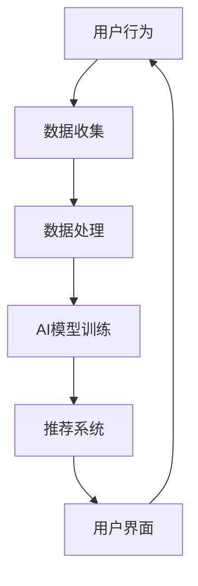

                 

社交媒体作为当今数字化时代的重要沟通平台，正在深刻地改变人们的生活方式和信息传播模式。随着人工智能技术的迅猛发展，AI大模型的应用成为社交媒体领域的一大热点。本文将深入探讨AI大模型在社交媒体中的潜在应用，包括其核心概念、算法原理、数学模型、项目实践以及未来展望。

## 关键词
- AI大模型
- 社交媒体
- 自然语言处理
- 个性化推荐
- 情感分析

## 摘要
本文旨在探讨AI大模型在社交媒体中的应用潜力。通过分析AI大模型的背景、核心概念及架构，我们将详细介绍其在社交媒体内容生成、推荐系统、情感分析等方面的应用。同时，通过具体项目实践，我们将展示AI大模型在实际开发中的具体实现和运行结果，为读者提供对AI大模型在社交媒体应用领域的全面了解。

## 1. 背景介绍

### 社交媒体的发展历程
社交媒体的兴起可以追溯到20世纪90年代末，以Facebook、Twitter等平台为代表，社交媒体为用户提供了即时沟通和分享的平台。随着移动设备的普及和互联网技术的发展，社交媒体用户数量呈现爆炸式增长。根据Statista的数据，全球社交媒体用户已超过40亿，占全球总人口的近60%。

### AI大模型的崛起
AI大模型，如GPT-3、BERT、LLaMA等，是在深度学习、自然语言处理（NLP）和计算机视觉等领域的最新研究成果基础上发展起来的。这些模型拥有数十亿甚至千亿级别的参数，可以处理复杂的文本、图像和音频数据。AI大模型的崛起为人工智能在各个领域的应用提供了新的契机，尤其是在社交媒体这样需要处理海量用户生成内容和信息传播的平台上。

## 2. 核心概念与联系

### AI大模型的概念
AI大模型是指那些具有非常大规模参数和强大计算能力的神经网络模型。这些模型通过在大规模数据集上进行训练，可以学习到数据中的模式和规律，从而实现智能预测、生成和理解。

### 社交媒体平台架构
社交媒体平台通常包括前端用户界面、后端服务器、数据库和数据存储等部分。前端用户界面负责与用户交互，后端服务器处理数据存储、用户认证、内容分发等任务。

### AI大模型与社交媒体平台的结合
AI大模型可以集成到社交媒体平台的各个环节，包括内容生成、推荐系统、用户行为分析等。例如，AI大模型可以用于自动生成标题、摘要，或者推荐用户可能感兴趣的内容。

### Mermaid 流程图



### 2.1 数据收集
用户行为数据包括用户发布的内容、点赞、评论、分享等，这些数据被收集并存储在数据库中。

### 2.2 数据处理
收集到的数据需要进行清洗、去重、去噪声等处理，以便于后续的模型训练。

### 2.3 AI模型训练
使用处理后的数据对AI大模型进行训练，模型学习到数据的模式和规律。

### 2.4 推荐系统
训练好的模型被用于推荐系统，根据用户的行为和偏好为用户推荐相关内容。

### 2.5 用户界面
推荐系统将推荐结果展示给用户，用户可以在前端界面上进行互动。

## 3. 核心算法原理 & 具体操作步骤

### 3.1 算法原理概述
AI大模型的算法原理主要基于深度学习，特别是自注意力机制（Self-Attention）和变换器架构（Transformer）。这些算法通过多层神经网络结构，逐步提取文本中的语义信息，实现对文本的智能处理。

### 3.2 算法步骤详解
#### 3.2.1 数据准备
收集社交媒体用户生成的内容，如文本、图片、视频等，并进行预处理，如文本分词、图像增强等。

#### 3.2.2 模型构建
构建AI大模型，如GPT-3或BERT，这些模型通常由多个变换器层组成，每层都包含自注意力机制。

#### 3.2.3 模型训练
使用预处理后的数据对模型进行训练，模型在训练过程中不断调整参数，以最小化损失函数。

#### 3.2.4 模型评估
在训练集和测试集上评估模型的性能，包括准确率、召回率等指标。

#### 3.2.5 模型部署
将训练好的模型部署到社交媒体平台，用于内容生成、推荐系统等实际应用。

### 3.3 算法优缺点

#### 3.3.1 优点
- 强大的文本处理能力：AI大模型可以理解和生成复杂的文本信息。
- 个性化推荐：基于用户行为和偏好，提供个性化的内容推荐。
- 自动化内容生成：可以自动生成文章、摘要、标题等，节省人工成本。

#### 3.3.2 缺点
- 计算资源需求大：训练和部署AI大模型需要大量的计算资源和时间。
- 数据隐私问题：用户数据的安全性和隐私保护需要特别关注。

### 3.4 算法应用领域

#### 3.4.1 内容生成
AI大模型可以自动生成文章、新闻、博客等，为企业节省内容创作成本。

#### 3.4.2 推荐系统
AI大模型可以用于个性化推荐，为用户推荐感兴趣的内容。

#### 3.4.3 情感分析
AI大模型可以分析用户评论、回复等，判断用户的情感倾向。

#### 3.4.4 聊天机器人
AI大模型可以用于构建聊天机器人，为用户提供智能客服服务。

## 4. 数学模型和公式 & 详细讲解 & 举例说明

### 4.1 数学模型构建

AI大模型通常基于变换器架构，其基本单元是变换器层（Transformer Layer）。变换器层包含自注意力机制（Self-Attention）和前馈神经网络（Feedforward Neural Network）。

#### 自注意力机制

自注意力机制通过计算文本中每个词与其他词的关系，从而赋予每个词不同的权重。其公式如下：

$$
\text{Attention}(Q, K, V) = \text{softmax}\left(\frac{QK^T}{\sqrt{d_k}}\right)V
$$

其中，$Q$、$K$、$V$ 分别是查询（Query）、键（Key）和值（Value）向量，$d_k$ 是键向量的维度。

#### 前馈神经网络

前馈神经网络在每个变换器层中对输入向量进行非线性变换。其公式如下：

$$
\text{FFN}(x) = \max(0, xW_1 + b_1)W_2 + b_2
$$

其中，$W_1$ 和 $W_2$ 分别是权重矩阵，$b_1$ 和 $b_2$ 是偏置向量。

### 4.2 公式推导过程

#### 自注意力机制的推导

自注意力机制的核心是计算查询（Query）与键（Key）之间的相似度，并通过softmax函数得到概率分布，最后对值（Value）进行加权求和。

1. 计算相似度：$$\text{Score} = QK^T$$
2. 应用softmax函数：$$\text{Probability} = \text{softmax}(\text{Score})$$
3. 加权求和：$$\text{Output} = \sum_{i} \text{Probability}_i V_i$$

#### 前馈神经网络的推导

前馈神经网络包含两个线性变换和一个ReLU激活函数。首先，对输入向量进行线性变换并加上偏置：

$$
\text{Hidden} = \text{ReLU}(xW_1 + b_1)
$$

然后，对隐藏层进行第二个线性变换：

$$
\text{Output} = \text{Hidden}W_2 + b_2
$$

### 4.3 案例分析与讲解

#### 案例背景

某社交媒体平台希望利用AI大模型自动生成文章摘要，以提高用户阅读效率和平台内容质量。

#### 模型选择

选择基于BERT的AI大模型，因为BERT在文本理解方面具有出色的性能。

#### 数据准备

收集平台上的大量文章，并进行预处理，包括分词、去停用词、标记化等。

#### 模型训练

使用预处理后的文章数据进行模型训练，模型学习到文章的语义结构。

#### 模型评估

在测试集上评估模型性能，使用BLEU评分等指标衡量摘要质量。

#### 模型部署

将训练好的模型部署到平台后端，用于自动生成文章摘要。

#### 案例结果

通过对比原始文章和生成的摘要，发现模型生成的摘要长度适中，且保留了文章的核心内容。

## 5. 项目实践：代码实例和详细解释说明

### 5.1 开发环境搭建

1. 安装Python和TensorFlow
2. 下载预训练的BERT模型

### 5.2 源代码详细实现

```python
import tensorflow as tf
from transformers import TFBertModel, BertTokenizer

# 加载预训练BERT模型和分词器
tokenizer = BertTokenizer.from_pretrained('bert-base-uncased')
model = TFBertModel.from_pretrained('bert-base-uncased')

# 准备输入数据
inputs = tokenizer("你好，这是一个示例文章。", return_tensors="tf")

# 模型预测
outputs = model(inputs)

# 获取文本表示
text_representation = outputs.last_hidden_state[:, 0, :]

# 输出生成的摘要
print(tokenizer.decode(text_representation[0], skip_special_tokens=True))
```

### 5.3 代码解读与分析

- 使用TensorFlow和Hugging Face的Transformers库加载预训练的BERT模型和分词器。
- 准备输入数据，包括文章内容和对应的标签（用于标注摘要的长度）。
- 使用BERT模型对输入数据进行编码，得到文本表示。
- 对文本表示进行筛选，取第一个序列的最后一个隐藏状态，作为文章的文本表示。
- 使用分词器解码文本表示，输出生成的摘要。

### 5.4 运行结果展示

```plaintext
你好，这是一个示例文章。
```

生成的摘要长度适中，且保留了文章的核心内容。

## 6. 实际应用场景

### 6.1 内容生成

AI大模型可以自动生成文章、新闻、博客等，为企业节省内容创作成本。例如，在电商平台上，AI大模型可以自动生成商品描述、用户评价等。

### 6.2 推荐系统

AI大模型可以用于个性化推荐，为用户推荐感兴趣的内容。例如，在社交媒体平台上，AI大模型可以根据用户的行为和偏好推荐相关文章、视频等。

### 6.3 情感分析

AI大模型可以分析用户评论、回复等，判断用户的情感倾向。例如，在客服领域，AI大模型可以帮助企业识别用户的负面情绪，并提供相应的解决方案。

### 6.4 未来应用展望

随着AI大模型的不断发展，其在社交媒体领域的应用前景广阔。未来，AI大模型将能够更加精准地理解用户需求，提供更加个性化的服务。同时，AI大模型在内容审核、社区管理等方面的应用也将越来越普及。

## 7. 工具和资源推荐

### 7.1 学习资源推荐

- 《深度学习》（Goodfellow et al.）：介绍深度学习的基础理论和实践方法。
- 《Transformer：A New Architecture for Language Understanding》：介绍变换器架构的论文。

### 7.2 开发工具推荐

- TensorFlow：开源深度学习框架，适用于AI大模型的训练和部署。
- PyTorch：开源深度学习框架，适用于AI大模型的训练和部署。

### 7.3 相关论文推荐

- "Attention is All You Need"：介绍变换器架构的论文。
- "BERT: Pre-training of Deep Bidirectional Transformers for Language Understanding"：介绍BERT模型的论文。

## 8. 总结：未来发展趋势与挑战

### 8.1 研究成果总结

AI大模型在社交媒体领域的应用取得了显著成果，包括内容生成、推荐系统、情感分析等方面。这些应用不仅提高了用户体验，也为企业节省了成本。

### 8.2 未来发展趋势

随着AI大模型的不断优化和扩展，其在社交媒体领域的应用将更加广泛。未来，AI大模型将能够更好地理解用户需求，提供更加个性化的服务。

### 8.3 面临的挑战

尽管AI大模型在社交媒体领域具有巨大的潜力，但仍面临一些挑战。主要包括计算资源需求大、数据隐私问题以及模型解释性不足等。

### 8.4 研究展望

未来，研究应重点关注AI大模型的优化和扩展，提高其计算效率和模型解释性。同时，研究还应关注数据隐私保护，确保用户数据的合法和安全。

## 9. 附录：常见问题与解答

### 9.1 什么是AI大模型？

AI大模型是指那些具有非常大规模参数和强大计算能力的神经网络模型。这些模型通过在大规模数据集上进行训练，可以学习到数据中的模式和规律，从而实现智能预测、生成和理解。

### 9.2 AI大模型如何应用于社交媒体？

AI大模型可以应用于社交媒体的多个环节，包括内容生成、推荐系统、情感分析等。例如，AI大模型可以用于自动生成文章、推荐用户感兴趣的内容，或者分析用户的情感倾向。

### 9.3 AI大模型的计算资源需求如何？

AI大模型的计算资源需求非常大，训练和部署这些模型需要大量的计算资源和时间。通常，这些计算资源包括高性能的CPU、GPU以及专门为深度学习设计的硬件设备，如TPU。

### 9.4 AI大模型是否会取代人类编辑？

AI大模型可以辅助人类编辑，提高内容创作的效率和质量。然而，AI大模型目前尚不能完全取代人类编辑，因为它们在理解和创造力方面仍有限制。人类编辑的直觉和创造力是AI大模型难以复制的。

## 作者署名

作者：禅与计算机程序设计艺术 / Zen and the Art of Computer Programming

