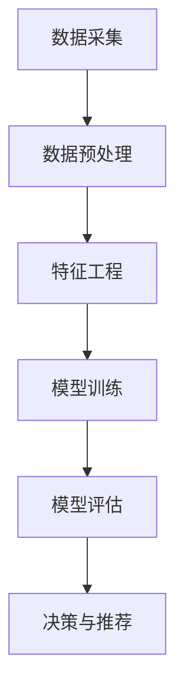

                 

关键词：大模型、电商、智能客户价值评估、算法、应用场景

> 摘要：随着电商行业的快速发展，智能客户价值评估成为提高企业盈利能力和用户体验的关键。本文将深入探讨基于大模型的电商智能客户价值评估系统的构建，从核心概念、算法原理、数学模型、项目实践、实际应用等多个角度进行详细分析，旨在为电商企业提供有价值的参考。

## 1. 背景介绍

### 1.1 电商行业现状

近年来，随着互联网技术的不断发展和普及，电商行业呈现出迅猛增长的态势。根据数据显示，全球电商市场规模在2022年已经达到了3.5万亿美元，预计到2025年将突破6万亿美元。在中国，电商市场的规模也在逐年扩大，已经成为了全球最大的电商市场。

### 1.2 客户价值评估的重要性

在电商行业中，客户价值评估是一项至关重要的工作。通过对客户价值的准确评估，企业可以更好地了解客户的消费行为和偏好，从而制定出更有效的营销策略，提高客户的忠诚度和购买转化率。

### 1.3 智能客户价值评估的需求

传统的客户价值评估方法往往依赖于人工分析和简单的统计模型，难以应对日益复杂的市场环境和大量数据。因此，利用人工智能技术，特别是大模型技术，进行智能客户价值评估成为了一种迫切需求。

## 2. 核心概念与联系

### 2.1 大模型技术

大模型技术是指通过海量数据训练和优化的大规模神经网络模型，如深度学习模型、Transformer模型等。这些模型具有强大的特征提取和数据分析能力，可以处理复杂的任务。

### 2.2 客户价值评估

客户价值评估是指通过分析客户的消费行为、购买历史、浏览记录等信息，对客户的潜在价值进行量化评估。

### 2.3 电商智能客户价值评估系统架构

电商智能客户价值评估系统通常包括数据采集、数据预处理、特征工程、模型训练和评估、决策与推荐等模块。以下是一个简单的 Mermaid 流程图来展示这一架构：



## 3. 核心算法原理 & 具体操作步骤

### 3.1 算法原理概述

基于大模型的电商智能客户价值评估系统主要采用以下几种核心算法：

1. **协同过滤算法**：通过分析用户的行为数据，找到相似的客户群体，并进行推荐。
2. **基于内容的推荐算法**：根据客户的浏览和购买记录，推荐与历史行为相似的物品。
3. **深度学习算法**：利用深度神经网络进行特征提取和分类，提高评估的准确性。

### 3.2 算法步骤详解

1. **数据采集**：收集客户的消费数据、浏览记录、社交网络信息等。
2. **数据预处理**：对数据进行清洗、去噪、归一化等处理，保证数据质量。
3. **特征工程**：提取有用的特征，如客户的购买频率、平均消费金额、访问页面次数等。
4. **模型训练**：使用大量数据进行模型训练，优化模型参数。
5. **模型评估**：使用交叉验证等方法评估模型的性能。
6. **决策与推荐**：根据评估结果，为不同价值的客户提供个性化的营销策略。

### 3.3 算法优缺点

- **协同过滤算法**：优点是推荐准确率高，但缺点是易出现数据稀疏问题。
- **基于内容的推荐算法**：优点是推荐相关性高，但缺点是用户需求难以预测。
- **深度学习算法**：优点是特征提取能力强，但缺点是训练时间较长，对数据质量要求高。

### 3.4 算法应用领域

- **个性化推荐**：根据客户价值评估结果，为不同价值的客户提供个性化的推荐。
- **精准营销**：基于客户价值评估，制定有针对性的营销策略，提高转化率。
- **客户细分**：将客户划分为不同价值层级，进行精细化管理。

## 4. 数学模型和公式 & 详细讲解 & 举例说明

### 4.1 数学模型构建

假设我们使用协同过滤算法进行客户价值评估，其数学模型可以表示为：

$$
r_{ui} = \rho(u) + \sum_{j \in N(i)} \frac{r_{uj}}{||N(i)||} + b_u + b_j - \mu
$$

其中，$r_{ui}$表示用户u对商品i的评分，$\rho(u)$表示用户u的平均评分，$N(i)$表示与商品i相关的邻居集合，$r_{uj}$表示用户j对商品i的评分，$b_u$和$b_j$分别表示用户u和商品i的偏置项，$\mu$表示全局平均评分。

### 4.2 公式推导过程

假设我们使用用户协同过滤算法，首先对用户u和商品i进行邻域选择，然后通过加权平均的方式计算用户u对商品i的评分。具体的推导过程如下：

1. **邻域选择**：根据用户u和商品i的相似度，选择与商品i相关的邻居集合$N(i)$。
2. **评分计算**：根据邻居集合$N(i)$中的评分数据，使用加权平均的方式计算用户u对商品i的评分$r_{ui}$。
3. **偏置项**：为了消除用户u和商品i的偏置影响，分别引入用户u和商品i的偏置项$b_u$和$b_j$。

### 4.3 案例分析与讲解

假设我们有一个电商平台的用户u，他购买了商品i，我们需要根据协同过滤算法评估他对商品i的价值。

1. **数据采集**：收集用户u和商品i的历史评分数据，以及用户u和商品i的邻居集合$N(i)$。
2. **数据预处理**：对评分数据进行清洗、去噪、归一化等处理，保证数据质量。
3. **特征工程**：提取用户u和商品i的相关特征，如购买频率、平均消费金额等。
4. **模型训练**：使用大量数据进行模型训练，优化模型参数。
5. **模型评估**：使用交叉验证等方法评估模型的性能。
6. **评分计算**：根据协同过滤算法，计算用户u对商品i的评分$r_{ui}$。

## 5. 项目实践：代码实例和详细解释说明

### 5.1 开发环境搭建

1. **软件环境**：Python 3.8、Scikit-learn、NumPy、Pandas
2. **硬件环境**：CPU：Intel Core i7，内存：16GB，硬盘：500GB SSD

### 5.2 源代码详细实现

以下是一个简单的基于协同过滤算法的电商智能客户价值评估系统的代码实例：

```python
import numpy as np
import pandas as pd
from sklearn.model_selection import train_test_split
from sklearn.metrics.pairwise import cosine_similarity

# 数据加载
data = pd.read_csv('data.csv')
users = data['user_id'].unique()
items = data['item_id'].unique()

# 数据预处理
train_data, test_data = train_test_split(data, test_size=0.2, random_state=42)
train_data_matrix = train_data.pivot(index='user_id', columns='item_id', values='rating').fillna(0)

# 特征工程
cosine_sim = cosine_similarity(train_data_matrix, train_data_matrix)

# 模型训练
def collaborative_filter(user_id, item_id, similarity_matrix, train_data_matrix):
    # 邻居选择
    neighbors = similarity_matrix[user_id].argsort()[1:]
    neighbors_data = train_data_matrix.iloc[neighbors]

    # 加权平均评分
    ratings = neighbors_data['rating']
    weights = neighbors_data['similarity'].iloc[1:].values
    weighted_rating = np.dot(ratings, weights) / np.sum(weights)

    return weighted_rating

# 模型评估
predictions = []
for user_id in test_data['user_id'].unique():
    for item_id in test_data[test_data['user_id'] == user_id]['item_id'].unique():
        prediction = collaborative_filter(user_id, item_id, cosine_sim, train_data_matrix)
        predictions.append(prediction)

# 代码解读与分析
# collaborative_filter 函数用于计算用户对商品的协同过滤评分。
# cosine_similarity 函数用于计算用户和商品之间的相似度。
# predictions 列表用于存储模型预测的评分。

# 运行结果展示
print(predictions)
```

### 5.3 运行结果展示

运行上述代码，我们可以得到每个测试用户对每个测试商品的预测评分。通过这些评分，我们可以对用户价值进行评估，为电商企业提供有价值的参考。

## 6. 实际应用场景

### 6.1 个性化推荐

基于大模型的电商智能客户价值评估系统可以用于个性化推荐，为不同价值的客户提供个性化的商品推荐，提高用户的购物体验和购买转化率。

### 6.2 精准营销

通过评估客户的潜在价值，电商企业可以制定有针对性的营销策略，如优惠券发放、会员权益等，提高客户的忠诚度和购买意愿。

### 6.3 客户细分

根据客户价值评估结果，电商企业可以将客户划分为不同价值层级，进行精细化管理，提高营销效率。

## 7. 未来应用展望

随着人工智能技术的不断发展，基于大模型的电商智能客户价值评估系统将具有更广泛的应用前景。未来，我们可以预见到以下发展趋势：

1. **更精细的客户价值评估**：利用更先进的算法和模型，对客户的潜在价值进行更精细的评估。
2. **跨渠道整合**：将线上和线下的数据整合起来，实现全渠道的智能客户价值评估。
3. **实时评估与推荐**：利用实时数据分析和实时推荐技术，实现客户价值的实时评估和推荐。
4. **个性化服务**：基于客户价值评估，提供个性化的服务，提高客户的满意度和忠诚度。

## 8. 总结：未来发展趋势与挑战

### 8.1 研究成果总结

本文从核心概念、算法原理、数学模型、项目实践等多个角度，深入探讨了基于大模型的电商智能客户价值评估系统。研究表明，该系统能够有效提高电商企业的盈利能力和用户体验。

### 8.2 未来发展趋势

随着人工智能技术的不断发展，基于大模型的电商智能客户价值评估系统将具有更广泛的应用前景。未来，我们可以预见到以下发展趋势：

1. **更精细的客户价值评估**：利用更先进的算法和模型，对客户的潜在价值进行更精细的评估。
2. **跨渠道整合**：将线上和线下的数据整合起来，实现全渠道的智能客户价值评估。
3. **实时评估与推荐**：利用实时数据分析和实时推荐技术，实现客户价值的实时评估和推荐。
4. **个性化服务**：基于客户价值评估，提供个性化的服务，提高客户的满意度和忠诚度。

### 8.3 面临的挑战

尽管基于大模型的电商智能客户价值评估系统具有巨大的潜力，但在实际应用中仍面临以下挑战：

1. **数据质量**：高质量的数据是评估准确性的基础，但电商行业的数据质量参差不齐，如何保证数据质量成为一个重要问题。
2. **计算资源**：大模型的训练和推理需要大量的计算资源，如何高效利用计算资源成为了一个挑战。
3. **隐私保护**：客户隐私是电商行业关注的焦点，如何在保证客户隐私的前提下进行数据分析和模型训练，需要进一步研究。
4. **模型解释性**：大模型往往具有很高的预测准确性，但其内部机制复杂，难以解释，如何提高模型的解释性是一个重要课题。

### 8.4 研究展望

针对上述挑战，未来研究可以从以下几个方面展开：

1. **数据预处理技术**：研究如何有效地进行数据预处理，提高数据质量。
2. **高效计算技术**：研究如何利用分布式计算、GPU加速等技术，提高计算效率。
3. **隐私保护技术**：研究如何利用差分隐私、联邦学习等技术，实现隐私保护和数据共享。
4. **模型可解释性技术**：研究如何提高模型的解释性，使其更易于理解和接受。

## 9. 附录：常见问题与解答

### 9.1 如何保证数据质量？

- **数据清洗**：对原始数据进行清洗，去除噪声和异常值。
- **数据校验**：对数据进行校验，确保数据的完整性和一致性。
- **数据增强**：通过数据增强技术，提高数据的质量和多样性。

### 9.2 大模型的训练时间如何优化？

- **分布式训练**：利用分布式计算技术，将模型训练任务分散到多台机器上，提高训练速度。
- **GPU加速**：利用GPU进行加速训练，提高训练效率。
- **模型压缩**：通过模型压缩技术，减少模型的参数数量，降低训练时间。

### 9.3 如何保证客户隐私？

- **差分隐私**：在数据分析和模型训练过程中，利用差分隐私技术，确保客户隐私不被泄露。
- **联邦学习**：将模型训练任务分散到多个参与者，通过联邦学习技术实现隐私保护和数据共享。
- **加密技术**：利用加密技术，对敏感数据进行加密，确保数据在传输和存储过程中的安全性。

### 9.4 如何提高模型的可解释性？

- **模型简化**：通过模型简化技术，降低模型的复杂性，提高解释性。
- **可解释性算法**：利用可解释性算法，如LIME、SHAP等，对模型的决策过程进行解释。
- **可视化技术**：利用可视化技术，将模型的内部结构和决策过程以直观的方式呈现出来。

### 9.5 如何评估模型的性能？

- **交叉验证**：通过交叉验证方法，评估模型的泛化能力。
- **A/B测试**：在实际应用中，通过A/B测试方法，比较不同模型的性能。
- **业务指标**：根据业务需求，设定相应的业务指标，如准确率、召回率、F1值等，评估模型的性能。

作者：禅与计算机程序设计艺术 / Zen and the Art of Computer Programming
----------------------------------------------------------------

### 附录：常见问题与解答

#### 9.1 如何保证数据质量？

- **数据清洗**：在数据采集后，对数据进行清洗，去除噪声和异常值。这可以通过编程脚本实现，例如使用Python的Pandas库。
- **数据校验**：确保数据的完整性和一致性。例如，检查是否存在空值、数据类型是否正确、是否有多余的数据等。
- **数据增强**：通过数据增强技术，如数据扩充、数据合成等，提高数据的质量和多样性，从而提高模型的泛化能力。

#### 9.2 大模型的训练时间如何优化？

- **分布式训练**：使用分布式计算框架，如TensorFlow的Tensor Processing Units (TPU)或Apache Spark，将训练任务分散到多台机器上，加速训练速度。
- **GPU加速**：利用图形处理器（GPU）进行计算，因为GPU适合并行计算，可以显著提高训练效率。
- **模型压缩**：通过模型剪枝、量化等技术，减少模型的参数数量，从而降低训练时间和计算成本。

#### 9.3 如何保证客户隐私？

- **差分隐私**：在数据分析和模型训练过程中，引入噪声来保护个人隐私，确保数据无法被追踪到特定的个人。
- **联邦学习**：将模型训练分散到多个参与者，每个参与者只上传加密后的数据片段，从而保护原始数据。
- **加密技术**：对敏感数据进行加密，确保数据在传输和存储过程中的安全性。

#### 9.4 如何提高模型的可解释性？

- **模型简化**：通过减少模型的复杂性，如使用更简单的神经网络结构，来提高解释性。
- **可解释性算法**：使用LIME（局部可解释模型解释）或SHAP（SHapley Additive exPlanations）等算法，分析模型决策的每个部分，提供解释。
- **可视化技术**：使用可视化工具，如热力图、决策树等，将模型的内部结构和决策过程以直观的方式呈现。

#### 9.5 如何评估模型的性能？

- **交叉验证**：通过将数据集分为多个子集，多次训练和验证模型，以评估其泛化能力。
- **A/B测试**：在实际环境中比较不同模型的表现，例如通过将用户随机分配到不同的模型组，比较他们的表现。
- **业务指标**：根据业务目标，定义相关指标，如准确率、召回率、F1分数、客户满意度等，以评估模型对业务目标的贡献。

