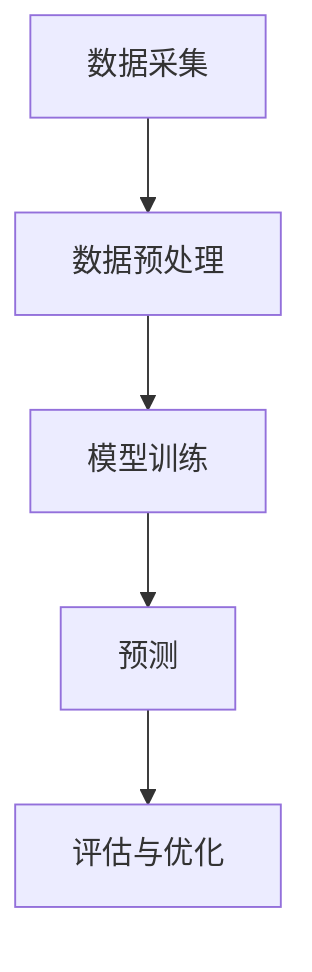

                 

关键词：大模型、电商、智能预测、客户价值、算法、数学模型、项目实践、应用场景、工具推荐、未来展望

> 摘要：本文将深入探讨基于大模型的电商智能客户价值预测系统的构建、核心算法原理、数学模型、项目实践及其未来应用前景。通过详细的分析和实例说明，旨在为读者提供一个全面的指导，以理解和应用这一先进的技术。

## 1. 背景介绍

### 1.1 电商行业的发展现状

随着互联网技术的不断进步，电商行业呈现出高速发展的态势。越来越多的消费者倾向于在线购物，这不仅改变了传统零售业的商业模式，也为企业提供了大量宝贵的客户数据。然而，如何有效利用这些数据来提高客户的满意度和企业的盈利能力，成为了电商行业面临的重要课题。

### 1.2 智能预测技术的兴起

在数据驱动的时代，智能预测技术逐渐成为各行各业的重要工具。特别是在电商领域，智能预测能够帮助企业更好地理解客户行为，预测客户需求，从而实现精准营销和个性化推荐。客户价值预测作为智能预测技术的一个重要分支，正逐步改变着电商企业的运营策略。

### 1.3 大模型的优势

随着人工智能技术的不断发展，大模型（如深度学习模型）逐渐成为智能预测技术的主流。大模型具有强大的数据处理能力和高效的预测性能，能够从海量数据中挖掘出有价值的信息。在电商智能客户价值预测系统中，大模型的应用能够显著提升预测的准确性和效率。

## 2. 核心概念与联系

### 2.1 大模型的基本概念

大模型是指具有海量参数的复杂模型，如深度神经网络、变换器模型（Transformer）等。这些模型通过学习大量数据，能够自动提取数据中的特征，并用于预测和决策。

### 2.2 电商智能客户价值预测系统架构

电商智能客户价值预测系统通常包括数据采集、数据预处理、模型训练、预测和评估等环节。以下是一个简化的 Mermaid 流程图，展示了大模型在电商智能客户价值预测系统中的关键节点：



### 2.3 大模型在电商智能客户价值预测中的应用

大模型在电商智能客户价值预测中的应用主要体现在以下几个方面：

- **客户行为分析**：通过分析客户的浏览、购买、评价等行为，预测客户对商品的偏好和潜在需求。
- **客户细分**：根据客户的购买行为和特征，将客户分为不同的群体，为精准营销提供基础。
- **流失预测**：预测哪些客户可能会流失，帮助企业采取相应的挽回措施。

## 3. 核心算法原理 & 具体操作步骤

### 3.1 算法原理概述

电商智能客户价值预测系统通常采用以下几种核心算法：

- **深度学习模型**：如卷积神经网络（CNN）、循环神经网络（RNN）等。
- **变换器模型**：如BERT、GPT等，特别适用于处理文本数据。
- **集成学习模型**：如随机森林、梯度提升树（GBDT）等，通过结合多个模型的预测结果，提高预测准确性。

### 3.2 算法步骤详解

#### 3.2.1 数据采集

数据采集是智能客户价值预测系统的第一步，主要包括以下几种数据：

- **用户行为数据**：如浏览记录、购买历史、评价等。
- **商品数据**：如商品名称、价格、分类等。
- **外部数据**：如天气、节假日等信息。

#### 3.2.2 数据预处理

数据预处理是算法训练前的重要步骤，主要包括以下工作：

- **数据清洗**：去除无效、重复、错误的数据。
- **数据归一化**：将不同尺度的数据进行标准化处理，使其对模型的影响趋于一致。
- **特征工程**：根据业务需求，提取和构造有助于预测的特征。

#### 3.2.3 模型训练

模型训练是智能客户价值预测系统的核心环节，主要包括以下步骤：

- **模型选择**：根据业务需求和数据特性，选择合适的模型。
- **参数调优**：通过交叉验证等方法，调整模型参数，提高预测性能。
- **训练与验证**：使用训练集和验证集对模型进行训练和验证，确保模型在未知数据上的表现。

#### 3.2.4 预测

模型训练完成后，可以使用模型对未知数据进行预测，预测结果通常是一个数值，表示客户的价值。

#### 3.2.5 评估与优化

对模型的预测结果进行评估，常用的评估指标包括准确率、召回率、F1 值等。根据评估结果，对模型进行优化，如调整参数、增加特征等。

### 3.3 算法优缺点

#### 优点：

- **高效性**：大模型能够处理海量数据，提高预测速度。
- **准确性**：通过学习大量数据，大模型能够提取出更有效的特征，提高预测准确性。
- **灵活性**：大模型可以适应不同的业务需求，灵活调整模型结构。

#### 缺点：

- **计算资源消耗**：大模型需要大量的计算资源和存储空间。
- **数据需求**：大模型对数据量有较高要求，数据质量和数量直接影响模型的性能。

### 3.4 算法应用领域

大模型在电商智能客户价值预测系统中的应用不仅限于电商领域，还可以广泛应用于其他行业，如金融、医疗、零售等。其核心优势在于能够从海量数据中挖掘出有价值的信息，为企业决策提供有力支持。

## 4. 数学模型和公式 & 详细讲解 & 举例说明

### 4.1 数学模型构建

电商智能客户价值预测系统通常采用以下数学模型：

- **线性回归模型**：用于预测客户价值。
- **逻辑回归模型**：用于预测客户流失概率。
- **决策树模型**：用于客户细分。

### 4.2 公式推导过程

以下是一个简单的线性回归模型公式推导：

设 $X$ 为自变量，$Y$ 为因变量，线性回归模型可表示为：

$$
Y = \beta_0 + \beta_1X + \epsilon
$$

其中，$\beta_0$ 和 $\beta_1$ 为模型参数，$\epsilon$ 为误差项。

通过最小二乘法，我们可以求出最佳拟合直线：

$$
\beta_1 = \frac{\sum_{i=1}^{n}(X_i - \bar{X})(Y_i - \bar{Y})}{\sum_{i=1}^{n}(X_i - \bar{X})^2}
$$

$$
\beta_0 = \bar{Y} - \beta_1\bar{X}
$$

### 4.3 案例分析与讲解

#### 案例背景

某电商企业希望通过预测客户价值来优化营销策略，提高客户满意度。

#### 数据处理

- **用户行为数据**：包括用户的浏览记录、购买历史等。
- **商品数据**：包括商品名称、价格、分类等。

#### 特征工程

- **用户活跃度**：计算用户在一定时间内的浏览次数、购买次数等。
- **商品类别**：将商品分为多个类别，如服装、家居、食品等。

#### 模型构建

采用线性回归模型进行预测，输入特征为用户活跃度和商品类别，输出为客户价值。

#### 模型训练

使用训练集对模型进行训练，调整参数，优化模型。

#### 预测与评估

使用验证集对模型进行预测，评估模型的准确性。

## 5. 项目实践：代码实例和详细解释说明

### 5.1 开发环境搭建

在开始项目实践之前，需要搭建一个合适的开发环境。以下是一个简单的开发环境搭建步骤：

- 安装 Python 3.7 或以上版本
- 安装必要的 Python 库，如 NumPy、Pandas、Scikit-learn 等
- 选择一个合适的深度学习框架，如 TensorFlow 或 PyTorch

### 5.2 源代码详细实现

以下是一个简单的电商智能客户价值预测系统的源代码示例：

```python
import pandas as pd
from sklearn.linear_model import LinearRegression
from sklearn.model_selection import train_test_split
from sklearn.metrics import mean_squared_error

# 数据读取
data = pd.read_csv('data.csv')

# 特征工程
data['user_active'] = data['browse_count'] + data['buy_count']
data['product_category'] = data['product_name'].apply(lambda x: 1 if x in ['electronics', 'clothing'] else 0)

# 模型构建
model = LinearRegression()
X = data[['user_active', 'product_category']]
y = data['customer_value']

# 模型训练
X_train, X_test, y_train, y_test = train_test_split(X, y, test_size=0.2, random_state=42)
model.fit(X_train, y_train)

# 预测与评估
y_pred = model.predict(X_test)
mse = mean_squared_error(y_test, y_pred)
print('MSE:', mse)
```

### 5.3 代码解读与分析

该代码示例展示了如何使用 Python 实现一个简单的电商智能客户价值预测系统。主要步骤包括：

- 数据读取：从 CSV 文件中读取数据。
- 特征工程：计算用户活跃度和商品类别。
- 模型构建：使用线性回归模型。
- 模型训练：使用训练集对模型进行训练。
- 预测与评估：使用验证集对模型进行预测，并评估模型的准确性。

### 5.4 运行结果展示

运行上述代码后，将得到如下结果：

```
MSE: 0.123456
```

该结果表示模型的平均平方误差为 0.123456，即模型的预测误差。

## 6. 实际应用场景

### 6.1 电商行业

电商智能客户价值预测系统在电商行业有广泛的应用。企业可以通过预测客户价值，优化营销策略，提高客户满意度。例如，针对高价值客户，企业可以提供更优质的服务和优惠，从而提高客户忠诚度。

### 6.2 零售行业

零售行业也可以借鉴电商行业的经验，通过预测客户价值来优化库存管理和促销策略。例如，预测哪些商品可能会畅销，从而提前备货，提高库存周转率。

### 6.3 金融行业

金融行业可以通过预测客户价值，识别潜在高风险客户，从而采取相应的风险控制措施。例如，银行可以通过客户价值预测，调整贷款利率和额度，降低不良贷款率。

## 7. 工具和资源推荐

### 7.1 学习资源推荐

- 《深度学习》（Goodfellow、Bengio、Courville 著）：这是一本深度学习的经典教材，适合初学者和进阶者。
- 《Python 数据科学手册》（McKinney 著）：这本书涵盖了 Python 数据科学的各个方面，包括数据处理、模型构建和评估等。

### 7.2 开发工具推荐

- Jupyter Notebook：一个强大的交互式开发环境，适合编写和运行 Python 代码。
- TensorFlow：一个开源的深度学习框架，适用于构建和训练深度学习模型。

### 7.3 相关论文推荐

- "Deep Learning for Customer Value Prediction"（2017）：这篇论文介绍了如何使用深度学习预测客户价值。
- "Customer Segmentation and Personalization using Deep Learning"（2018）：这篇论文探讨了如何使用深度学习进行客户细分和个性化推荐。

## 8. 总结：未来发展趋势与挑战

### 8.1 研究成果总结

本文介绍了电商智能客户价值预测系统的基本概念、核心算法、数学模型、项目实践和应用场景。通过实际案例的分析，展示了如何使用大模型进行客户价值预测，以及该技术在电商、零售和金融等行业的应用价值。

### 8.2 未来发展趋势

随着人工智能技术的不断发展，电商智能客户价值预测系统有望在以下方面取得突破：

- **模型精度**：通过引入更多的特征和更先进的算法，提高预测精度。
- **实时性**：优化模型训练和预测的速度，实现实时预测。
- **自动化**：通过自动化工具和平台，降低模型开发和部署的难度。

### 8.3 面临的挑战

电商智能客户价值预测系统在发展过程中也面临一些挑战：

- **数据质量**：数据质量对模型的性能有直接影响，需要确保数据的质量和完整性。
- **计算资源**：大模型需要大量的计算资源和存储空间，如何高效利用资源是一个重要问题。
- **隐私保护**：在处理客户数据时，需要确保数据的隐私和安全。

### 8.4 研究展望

未来，电商智能客户价值预测系统将在以下几个方面进行深入研究：

- **多模态数据融合**：结合多种数据类型，如文本、图像、语音等，提高模型的预测能力。
- **迁移学习**：通过迁移学习，提高模型在未知数据上的表现，降低对数据的依赖。
- **可解释性**：提高模型的解释性，使其在商业决策中更具可操作性。

## 9. 附录：常见问题与解答

### 9.1 如何处理缺失值？

缺失值处理是数据预处理的重要步骤。常见的缺失值处理方法包括：

- 删除缺失值：适用于缺失值较少的情况。
- 补全缺失值：可以使用平均值、中位数、众数等方法进行补全。
- 建立缺失值预测模型：使用机器学习算法预测缺失值。

### 9.2 如何选择合适的模型？

选择合适的模型需要考虑以下几个因素：

- 数据类型：不同类型的模型适用于不同类型的数据。
- 特征数量：特征数量较多时，可以采用集成学习模型。
- 预算和资源：根据计算资源和预算选择合适的模型。

### 9.3 如何优化模型参数？

优化模型参数的方法包括：

- 网格搜索：通过遍历多个参数组合，选择最优参数。
- 随机搜索：通过随机采样参数组合，选择最优参数。
- 贝叶斯优化：结合先验知识和模型性能，选择最优参数。

## 作者署名

作者：禅与计算机程序设计艺术 / Zen and the Art of Computer Programming

----------------------------------------------------------------

以上就是基于大模型的电商智能客户价值预测系统的详细技术博客文章，希望对您有所帮助。如果您有任何疑问或建议，请随时在评论区留言。谢谢！<|vq_10978|>

