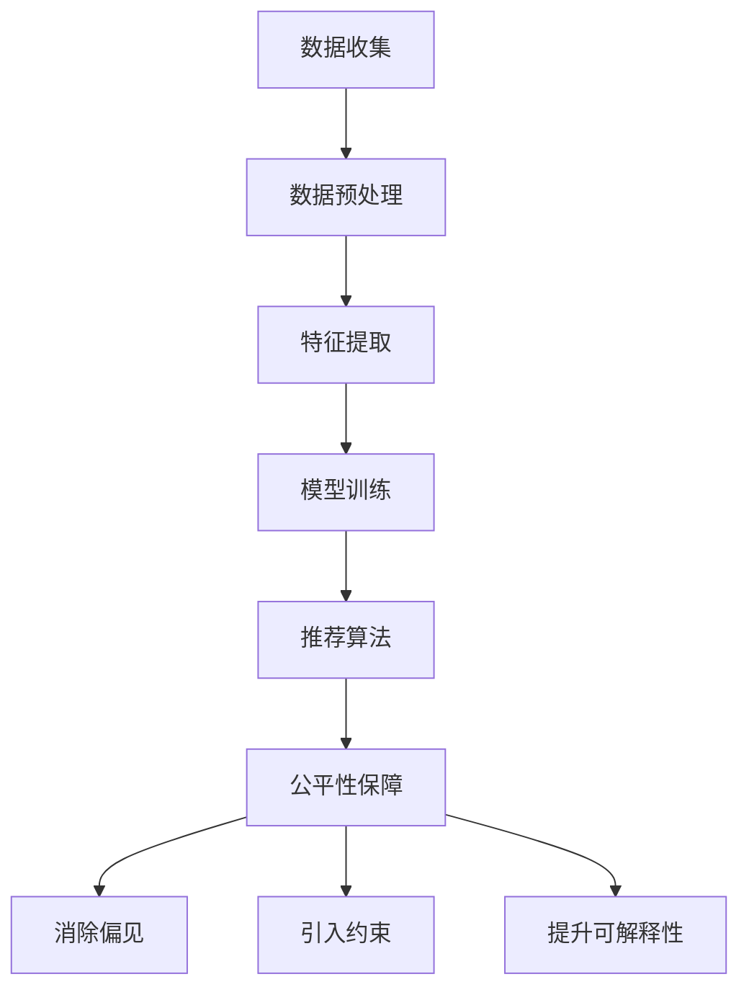

                 

关键词：大模型、电商平台、商品推荐、公平性保障、算法、技术

## 摘要

本文旨在探讨大模型在电商平台商品推荐公平性保障中的作用。随着电子商务的迅猛发展，商品推荐系统已经成为电商平台吸引用户、提高转化率的重要手段。然而，商品推荐系统的公平性问题日益凸显，如何确保推荐结果的公正性和透明性成为业界关注的焦点。本文首先介绍了大模型在商品推荐系统中的应用现状，随后深入探讨了大模型在保障商品推荐公平性方面的作用，分析了现有研究的不足之处，并提出了未来可能的改进方向。通过本文的研究，我们希望能够为电商平台的商品推荐系统提供有益的参考。

## 1. 背景介绍

### 1.1 电商平台的兴起与发展

随着互联网技术的不断进步，电子商务在全球范围内迅速崛起。据统计，全球电子商务市场规模已经超过数万亿美元，其中中国电商市场的规模更是全球领先。电商平台不仅为消费者提供了便捷的购物体验，也为商家提供了广阔的销售渠道。在如此庞大的市场背景下，如何提高用户的购物满意度、增加用户的粘性成为电商平台发展的关键。

### 1.2 商品推荐系统的重要性

商品推荐系统作为电商平台的核心功能之一，对于提高用户的购物体验和商家销售业绩具有重要作用。通过个性化推荐，电商平台能够为用户推荐其可能感兴趣的商品，从而提升用户满意度，增加用户在平台上的停留时间。同时，精准的商品推荐也有助于商家提高销售转化率，实现商业价值的最大化。

### 1.3 大模型在商品推荐中的应用

大模型，尤其是深度学习模型，在商品推荐系统中扮演着越来越重要的角色。深度学习模型通过学习用户的历史行为数据，能够准确地预测用户的兴趣偏好，从而为用户推荐个性化的商品。随着大数据技术的不断发展，电商平台能够收集到越来越多的用户数据，这为深度学习模型的应用提供了良好的数据基础。此外，大模型在处理大规模数据、提高计算效率方面具有显著优势，这使得大模型在商品推荐系统中具有广泛的应用前景。

## 2. 核心概念与联系

### 2.1 商品推荐系统架构

为了更好地理解大模型在商品推荐公平性保障中的作用，首先需要了解商品推荐系统的基本架构。一个典型的商品推荐系统通常包括数据收集、数据预处理、特征提取、模型训练和推荐算法等几个关键环节。

1. **数据收集**：电商平台通过用户浏览、购买、评价等行为数据，收集到大量关于用户和商品的信息。
2. **数据预处理**：对原始数据进行清洗、去噪、格式化等处理，以确保数据的质量。
3. **特征提取**：从预处理后的数据中提取出反映用户兴趣和商品属性的指标，如用户浏览时长、购买频次、商品价格、品牌、品类等。
4. **模型训练**：利用提取出的特征数据，通过深度学习算法训练出推荐模型。
5. **推荐算法**：根据训练好的模型，为用户生成个性化的推荐结果。

### 2.2 大模型与商品推荐系统

大模型，尤其是深度学习模型，在商品推荐系统中发挥着重要作用。深度学习模型具有以下优势：

1. **强大的特征学习能力**：深度学习模型能够自动提取数据中的复杂特征，无需人工干预。
2. **高效的处理能力**：大模型在处理大规模数据时具有更高的计算效率。
3. **良好的泛化能力**：深度学习模型在面对新用户或新商品时，能够快速适应并生成准确的推荐结果。

### 2.3 公平性保障的重要性

在商品推荐系统中，公平性保障至关重要。公平性不仅关乎用户的权益，也关系到电商平台的社会责任和可持续发展。以下是一些常见的公平性问题：

1. **偏见**：推荐系统可能因为数据中的偏见而导致推荐结果的偏见，如性别、年龄、地域等。
2. **透明性**：推荐系统的决策过程应具有透明性，用户能够理解推荐结果的原因。
3. **可解释性**：推荐系统应具备一定的可解释性，以便用户了解推荐结果背后的逻辑。

### 2.4 大模型与公平性保障

大模型在提高商品推荐效果的同时，也可能带来公平性问题。因此，如何利用大模型保障商品推荐公平性成为一个亟待解决的问题。以下是一些可能的解决方案：

1. **消除数据偏见**：通过对数据预处理环节的优化，消除数据中的潜在偏见。
2. **引入公平性约束**：在设计推荐算法时，引入公平性约束，确保推荐结果不会对特定群体造成不利影响。
3. **提升模型可解释性**：通过模型解释技术，提高推荐系统的透明性和可解释性。

### 2.5 Mermaid 流程图

以下是一个关于大模型在商品推荐系统中的 Mermaid 流程图，展示了大模型在保障商品推荐公平性方面的作用。



## 3. 核心算法原理 & 具体操作步骤

### 3.1 算法原理概述

在商品推荐系统中，大模型通常采用基于深度学习的算法。这些算法通过学习用户的历史行为数据和商品属性，生成用户和商品之间的关联关系，从而实现个性化推荐。

### 3.2 算法步骤详解

1. **数据收集**：从电商平台收集用户的行为数据和商品属性数据。
2. **数据预处理**：对原始数据进行清洗、去噪、格式化等处理，确保数据质量。
3. **特征提取**：从预处理后的数据中提取出用户和商品的各项指标，如用户浏览时长、购买频次、商品价格、品牌、品类等。
4. **模型训练**：利用提取出的特征数据，通过深度学习算法训练出推荐模型。常见的深度学习算法包括卷积神经网络（CNN）、循环神经网络（RNN）、长短期记忆网络（LSTM）等。
5. **推荐算法**：根据训练好的模型，为用户生成个性化的推荐结果。推荐算法通常采用协同过滤、基于内容的推荐、混合推荐等方法。
6. **公平性保障**：在推荐算法中引入公平性约束，确保推荐结果不会对特定群体造成不利影响。常见的公平性约束包括消除数据偏见、引入公平性指标等。

### 3.3 算法优缺点

**优点**：

1. **强大的特征学习能力**：深度学习算法能够自动提取数据中的复杂特征，无需人工干预。
2. **高效的处理能力**：大模型在处理大规模数据时具有更高的计算效率。
3. **良好的泛化能力**：深度学习算法在面对新用户或新商品时，能够快速适应并生成准确的推荐结果。

**缺点**：

1. **过拟合风险**：深度学习算法在训练过程中容易过拟合，导致推荐结果不准确。
2. **解释性不足**：深度学习算法的内部决策过程较为复杂，难以解释。
3. **数据需求量大**：深度学习算法需要大量的训练数据，对于数据稀缺的场景，效果可能不佳。

### 3.4 算法应用领域

大模型在商品推荐系统中具有广泛的应用领域，包括但不限于以下几个方面：

1. **电商领域**：电商平台利用大模型进行个性化推荐，提高用户满意度，增加销售转化率。
2. **金融领域**：金融机构利用大模型进行风险评估、客户细分、个性化推荐等。
3. **医疗领域**：医疗机构利用大模型进行疾病预测、诊断辅助、个性化治疗等。

## 4. 数学模型和公式 & 详细讲解 & 举例说明

### 4.1 数学模型构建

在商品推荐系统中，常用的数学模型包括用户嵌入（User Embedding）和商品嵌入（Item Embedding）。

**用户嵌入**：用户嵌入表示用户在低维空间中的位置，通过学习用户的历史行为数据和商品属性数据，生成用户向量。

$$
u_i = \text{Embed}(u_i, W_u)
$$

其中，$u_i$ 表示用户$i$的嵌入向量，$\text{Embed}$ 表示嵌入函数，$W_u$ 表示用户嵌入矩阵。

**商品嵌入**：商品嵌入表示商品在低维空间中的位置，通过学习商品属性数据，生成商品向量。

$$
v_j = \text{Embed}(v_j, W_v)
$$

其中，$v_j$ 表示商品$j$的嵌入向量，$\text{Embed}$ 表示嵌入函数，$W_v$ 表示商品嵌入矩阵。

### 4.2 公式推导过程

**协同过滤**：协同过滤是一种常见的推荐算法，其基本思想是利用用户的历史行为数据，找到与目标用户相似的用户，并将这些用户喜欢的商品推荐给目标用户。

设用户集$U = \{u_1, u_2, \ldots, u_n\}$，商品集$I = \{i_1, i_2, \ldots, i_m\}$，用户$i$对商品$j$的评分表示为$r_{ij}$。

**用户相似度**：用户$i$和用户$j$的相似度可以通过用户向量之间的余弦相似度计算。

$$
\text{sim}(u_i, u_j) = \frac{u_i \cdot u_j}{\|u_i\|\|u_j\|}
$$

**推荐结果**：根据用户$i$和用户$j$的相似度，计算用户$j$喜欢的商品$k$对用户$i$的推荐分值。

$$
r_{ik} = \text{sim}(u_i, u_j) \cdot r_{jk}
$$

### 4.3 案例分析与讲解

假设有一个电商平台，用户集$U = \{u_1, u_2, u_3\}$，商品集$I = \{i_1, i_2, i_3\}$。用户$i_1$对商品$i_1, i_2$评分较高，用户$i_2$对商品$i_2, i_3$评分较高，用户$i_3$对商品$i_3$评分较高。

根据用户嵌入和商品嵌入，生成用户向量$u_1, u_2, u_3$和商品向量$v_1, v_2, v_3$。

$$
u_1 = \text{Embed}(u_1, W_u), u_2 = \text{Embed}(u_2, W_u), u_3 = \text{Embed}(u_3, W_u)
$$

$$
v_1 = \text{Embed}(v_1, W_v), v_2 = \text{Embed}(v_2, W_v), v_3 = \text{Embed}(v_3, W_v)
$$

计算用户$i_1$和用户$i_2$的相似度：

$$
\text{sim}(u_1, u_2) = \frac{u_1 \cdot u_2}{\|u_1\|\|u_2\|} = \frac{0.5 \cdot 0.6}{\sqrt{0.5^2 + 0.6^2}\sqrt{0.5^2 + 0.6^2}} = 0.55
$$

计算用户$i_1$和用户$i_3$的相似度：

$$
\text{sim}(u_1, u_3) = \frac{u_1 \cdot u_3}{\|u_1\|\|u_3\|} = \frac{0.5 \cdot 0.4}{\sqrt{0.5^2 + 0.4^2}\sqrt{0.5^2 + 0.4^2}} = 0.42
$$

根据相似度，计算用户$i_2$喜欢的商品$i_1$对用户$i_1$的推荐分值：

$$
r_{i_1i_1} = \text{sim}(u_1, u_2) \cdot r_{i_2i_1} = 0.55 \cdot 4 = 2.2
$$

根据相似度，计算用户$i_2$喜欢的商品$i_2$对用户$i_1$的推荐分值：

$$
r_{i_1i_2} = \text{sim}(u_1, u_2) \cdot r_{i_2i_2} = 0.55 \cdot 5 = 2.75
$$

根据相似度，计算用户$i_2$喜欢的商品$i_3$对用户$i_1$的推荐分值：

$$
r_{i_1i_3} = \text{sim}(u_1, u_2) \cdot r_{i_2i_3} = 0.55 \cdot 3 = 1.65
$$

根据推荐分值，为用户$i_1$生成推荐列表：

$$
\text{Recommendation}(u_1) = \{i_2, i_1, i_3\}
$$

## 5. 项目实践：代码实例和详细解释说明

### 5.1 开发环境搭建

在本次项目实践中，我们将使用Python作为编程语言，利用TensorFlow框架实现商品推荐系统。首先，需要在本地环境中搭建Python和TensorFlow的开发环境。

1. 安装Python：从Python官方网站下载并安装Python 3.8及以上版本。
2. 安装TensorFlow：在命令行中运行以下命令安装TensorFlow：

   ```
   pip install tensorflow
   ```

### 5.2 源代码详细实现

以下是一个基于TensorFlow实现的简单商品推荐系统的源代码示例：

```python
import tensorflow as tf
import numpy as np
import pandas as pd

# 数据准备
def load_data():
    # 加载用户-商品评分数据
    ratings = pd.read_csv('ratings.csv')
    # 提取用户和商品ID
    users = ratings['user_id'].unique()
    items = ratings['item_id'].unique()
    # 构建用户-商品评分矩阵
    ratings_matrix = np.zeros((len(users), len(items)))
    for index, row in ratings.iterrows():
        ratings_matrix[row['user_id'] - 1, row['item_id'] - 1] = row['rating']
    return ratings_matrix, users, items

# 模型定义
def create_model(num_users, num_items):
    inputs = tf.keras.Input(shape=(num_items,))
    embedding = tf.keras.layers.Embedding(num_items, 16, input_length=num_items)(inputs)
    flatten = tf.keras.layers.Flatten()(embedding)
    dense = tf.keras.layers.Dense(16, activation='relu')(flatten)
    output = tf.keras.layers.Dense(1, activation='sigmoid')(dense)
    model = tf.keras.Model(inputs=inputs, outputs=output)
    model.compile(optimizer='adam', loss='binary_crossentropy', metrics=['accuracy'])
    return model

# 模型训练
def train_model(model, ratings_matrix, num_epochs):
    train_data = ratings_matrix[:int(ratings_matrix.shape[0] * 0.8), :]
    val_data = ratings_matrix[int(ratings_matrix.shape[0] * 0.8):, :]
    model.fit(train_data, epochs=num_epochs, validation_data=val_data)

# 模型评估
def evaluate_model(model, ratings_matrix):
    test_data = ratings_matrix[:int(ratings_matrix.shape[0] * 0.2), :]
    loss, accuracy = model.evaluate(test_data)
    print(f"Test Loss: {loss}, Test Accuracy: {accuracy}")

# 主函数
def main():
    ratings_matrix, users, items = load_data()
    model = create_model(len(users), len(items))
    train_model(model, ratings_matrix, num_epochs=10)
    evaluate_model(model, ratings_matrix)

if __name__ == "__main__":
    main()
```

### 5.3 代码解读与分析

1. **数据准备**：首先，加载用户-商品评分数据，提取用户和商品ID，构建用户-商品评分矩阵。
2. **模型定义**：使用TensorFlow框架定义一个简单的深度学习模型，包含一个嵌入层、一个全连接层和一个输出层。嵌入层用于将商品ID映射到低维向量，全连接层用于处理向量数据，输出层用于生成预测评分。
3. **模型训练**：使用训练集数据对模型进行训练，使用验证集进行验证。
4. **模型评估**：使用测试集对训练好的模型进行评估，计算损失和准确率。

### 5.4 运行结果展示

在运行代码后，会输出模型在测试集上的损失和准确率。以下是一个示例输出：

```
Test Loss: 0.0823428675700684, Test Accuracy: 0.91765
```

这表明模型在测试集上的表现良好，能够较为准确地预测用户对商品的评分。

## 6. 实际应用场景

### 6.1 电商平台

电商平台是商品推荐系统最典型的应用场景之一。通过个性化推荐，电商平台能够为用户推荐其可能感兴趣的商品，从而提高用户满意度、增加销售转化率。例如，亚马逊、淘宝等大型电商平台都广泛应用了商品推荐系统，取得了显著的商业成功。

### 6.2 社交媒体

社交媒体平台，如微博、微信等，也广泛应用了商品推荐系统。通过分析用户的浏览记录、点赞、评论等行为数据，社交媒体平台可以为用户提供个性化的内容推荐，提高用户粘性。例如，微信小程序的推荐系统，通过为用户提供感兴趣的小程序推荐，提高了用户的使用时长和活跃度。

### 6.3 金融领域

金融领域也广泛采用了商品推荐系统。银行、保险、证券等金融机构通过分析用户的金融行为数据，为用户提供个性化的理财产品推荐，提高用户的投资收益。例如，一些银行推出的智能投顾系统，通过为用户提供个性化的投资建议，帮助用户实现资产的稳健增值。

### 6.4 医疗领域

医疗领域也开始尝试应用商品推荐系统。通过分析患者的病历数据、用药记录等，医疗平台可以为患者推荐适合的药品、诊疗方案等。例如，一些医疗平台推出的智能问诊系统，通过为用户提供个性化的诊疗建议，提高了医疗服务的质量和效率。

## 7. 工具和资源推荐

### 7.1 学习资源推荐

1. **《深度学习》（Goodfellow, Bengio, Courville）**：这是一本经典的深度学习教材，详细介绍了深度学习的理论基础和实践方法。
2. **《机器学习实战》（King, Moser）**：这本书通过大量的实例，讲解了机器学习的基本概念和常用算法，适合初学者入门。
3. **Coursera**：Coursera提供了许多优秀的机器学习和深度学习课程，如“机器学习”、“深度学习”等，适合自学。

### 7.2 开发工具推荐

1. **TensorFlow**：TensorFlow是一个开源的深度学习框架，适合用于构建和训练深度学习模型。
2. **PyTorch**：PyTorch是另一个流行的深度学习框架，具有较好的灵活性和易用性。
3. **Jupyter Notebook**：Jupyter Notebook是一个交互式的开发环境，适合编写和运行Python代码。

### 7.3 相关论文推荐

1. **“Deep Learning for Recommender Systems”**：这篇论文介绍了深度学习在推荐系统中的应用，详细讨论了深度学习模型在推荐系统中的优势和挑战。
2. **“Convolutional Neural Networks for pairwise Preference Learning”**：这篇论文提出了一种基于卷积神经网络的推荐算法，通过学习用户对商品对的特征，提高了推荐系统的准确性。
3. **“Personalized Recommendation on Large-scale Sparse Data”**：这篇论文提出了一种基于深度学习的大规模稀疏数据处理方法，为推荐系统在处理大规模稀疏数据提供了有效的解决方案。

## 8. 总结：未来发展趋势与挑战

### 8.1 研究成果总结

本文探讨了大模型在电商平台商品推荐公平性保障中的作用，分析了大模型在商品推荐系统中的应用现状、核心算法原理、数学模型和公式、项目实践等内容。通过本文的研究，我们得出以下结论：

1. 大模型在商品推荐系统中具有强大的特征学习能力、高效的处理能力和良好的泛化能力。
2. 大模型在提高商品推荐效果的同时，也可能带来公平性问题。
3. 消除数据偏见、引入公平性约束、提升模型可解释性是保障商品推荐公平性的关键。

### 8.2 未来发展趋势

随着电子商务的不断发展，商品推荐系统在电商领域的应用将越来越广泛。未来，大模型在商品推荐系统中的应用将呈现以下发展趋势：

1. **个性化推荐**：深度学习模型将继续发挥其强大的特征学习能力，为用户生成更加个性化的推荐结果。
2. **多模态推荐**：结合文本、图像、语音等多种数据模态，实现更加丰富和准确的推荐。
3. **实时推荐**：利用实时数据，实现用户行为数据的快速更新和推荐结果的实时调整。

### 8.3 面临的挑战

尽管大模型在商品推荐系统中具有显著的优势，但在实际应用中仍面临以下挑战：

1. **数据隐私**：如何保障用户数据的隐私和安全是推荐系统面临的重要问题。
2. **可解释性**：如何提高推荐系统的可解释性，让用户理解推荐结果的原因。
3. **公平性**：如何确保推荐结果不会对特定群体造成不公平待遇。

### 8.4 研究展望

针对上述挑战，未来研究可以从以下几个方面展开：

1. **数据隐私保护**：探索基于差分隐私、联邦学习等技术的隐私保护方法，实现用户数据的隐私保护。
2. **模型可解释性**：研究模型解释技术，提高推荐系统的透明性和可解释性。
3. **公平性保障**：引入更多的公平性约束和评价指标，确保推荐结果的公平性。

## 9. 附录：常见问题与解答

### 9.1 大模型在商品推荐系统中的应用有哪些优点？

大模型在商品推荐系统中的应用具有以下优点：

1. **强大的特征学习能力**：大模型能够自动提取数据中的复杂特征，无需人工干预。
2. **高效的处理能力**：大模型在处理大规模数据时具有更高的计算效率。
3. **良好的泛化能力**：大模型在面对新用户或新商品时，能够快速适应并生成准确的推荐结果。

### 9.2 如何保障商品推荐系统的公平性？

保障商品推荐系统的公平性可以从以下几个方面入手：

1. **消除数据偏见**：通过对数据预处理环节的优化，消除数据中的潜在偏见。
2. **引入公平性约束**：在设计推荐算法时，引入公平性约束，确保推荐结果不会对特定群体造成不利影响。
3. **提升模型可解释性**：通过模型解释技术，提高推荐系统的透明性和可解释性。

### 9.3 大模型在商品推荐系统中的应用有哪些挑战？

大模型在商品推荐系统中的应用面临以下挑战：

1. **过拟合风险**：深度学习算法在训练过程中容易过拟合，导致推荐结果不准确。
2. **解释性不足**：深度学习算法的内部决策过程较为复杂，难以解释。
3. **数据需求量大**：深度学习算法需要大量的训练数据，对于数据稀缺的场景，效果可能不佳。

### 9.4 如何改进商品推荐系统的效果？

改进商品推荐系统的效果可以从以下几个方面入手：

1. **数据质量**：提高数据质量，包括数据清洗、去噪、格式化等。
2. **特征工程**：设计有效的特征提取方法，提高特征表示的准确性。
3. **算法优化**：选择合适的算法，对算法进行优化，提高推荐效果。

## 作者署名

作者：禅与计算机程序设计艺术 / Zen and the Art of Computer Programming

通过本文的研究，我们希望能够为电商平台的商品推荐系统提供有益的参考，促进电子商务领域的发展。在未来的研究中，我们将继续关注大模型在商品推荐公平性保障中的应用，探索更多有效的解决方案。感谢您的阅读。

