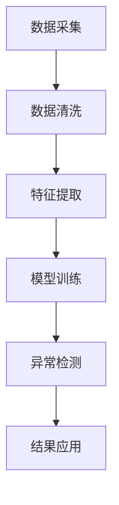

                 

 关键词：大模型、用户行为异常检测、电商平台、机器学习、深度学习、异常检测算法、案例分析

> 摘要：随着电商平台业务的不断扩展和用户数据的海量增长，用户行为异常检测成为电商平台提升安全性和用户体验的关键技术。本文将探讨大模型在电商平台用户行为异常检测中的潜力，通过分析大模型的原理、应用实例和未来发展，提出相应的技术策略和解决方案。

## 1. 背景介绍

电商平台作为数字经济的重要组成部分，其业务涵盖从商品选购、支付到售后服务的各个环节。在电商平台的发展过程中，用户行为数据扮演着至关重要的角色。通过对用户行为数据的分析和挖掘，电商平台可以实现个性化推荐、精准营销和用户流失预测等业务目标。然而，随着用户数量的激增和交易行为的多样化，用户行为异常检测成为一项极具挑战性的任务。

用户行为异常检测旨在识别出与正常行为模式显著偏离的异常行为，这些异常行为可能包括欺诈交易、恶意评论、非法操作等。传统的异常检测方法通常基于统计分析和模式识别技术，如基于规则的方法、聚类算法和统计模型等。然而，这些方法在面对大规模、高维度的用户行为数据时，存在如下挑战：

1. 数据复杂性：用户行为数据往往具有高维度、非线性和噪声，传统的分析方法难以捕捉到复杂的行为模式。
2. 异常多样性：异常行为可能具有多样化的表现形式，传统的分析方法难以适应不同类型的异常行为。
3. 实时性要求：电商平台需要实时检测用户行为异常，以保证交易安全性和用户体验，这对算法的响应速度提出了高要求。

为了应对上述挑战，大模型（如深度神经网络、Transformer模型等）在用户行为异常检测中的应用逐渐受到关注。大模型具有强大的特征提取和模式识别能力，能够从海量数据中自动学习复杂的特征关系，从而提高异常检测的准确性和实时性。本文将探讨大模型在电商平台用户行为异常检测中的应用潜力，分析其原理、算法和实际案例。

## 2. 核心概念与联系

### 2.1 大模型的定义与特点

大模型，通常指参数规模巨大、能够处理海量数据的深度学习模型。这些模型通过多层神经网络结构，对输入数据进行特征提取和模式识别。大模型的主要特点如下：

1. **参数规模**：大模型具有数十亿甚至数万亿个参数，这使得模型能够捕捉到更加细微的特征关系。
2. **非线性变换**：大模型通过多层非线性变换，能够自动学习输入数据中的复杂结构。
3. **自适应特征提取**：大模型能够从原始数据中自适应地提取有代表性的特征，降低数据预处理的工作量。
4. **强大的学习能力**：大模型通过大量的训练数据，能够学习到数据中的分布特征，从而在未知数据上表现出良好的泛化能力。

### 2.2 用户行为异常检测的原理与架构

用户行为异常检测旨在识别出与正常行为模式显著偏离的异常行为。其基本原理包括以下几个方面：

1. **特征工程**：通过对用户行为数据进行分析和预处理，提取出能够反映用户行为特征的指标，如点击率、购买频率、浏览时长等。
2. **模型训练**：使用历史数据对异常检测模型进行训练，模型学习正常行为模式和异常行为模式之间的差异。
3. **异常检测**：将新用户行为数据输入到训练好的模型中，模型输出异常得分，根据设定阈值判断是否为异常行为。

用户行为异常检测的架构通常包括数据层、模型层和应用层。数据层负责数据的采集、清洗和存储；模型层负责特征提取和异常检测模型的训练与部署；应用层负责将检测结果应用于实际业务场景，如风险控制、用户画像等。

### 2.3 Mermaid 流程图



在上面的 Mermaid 流程图中，每个节点代表用户行为异常检测的一个环节，箭头表示数据的流动方向。

## 3. 核心算法原理 & 具体操作步骤

### 3.1 算法原理概述

用户行为异常检测的核心算法通常是基于深度学习模型的，如卷积神经网络（CNN）、循环神经网络（RNN）和Transformer模型。这些模型通过多层神经网络结构，对输入数据进行特征提取和模式识别。

1. **卷积神经网络（CNN）**：CNN 通过卷积层和池化层，从图像或序列数据中提取局部特征，具有强大的特征提取能力，适合处理高维度的用户行为数据。
2. **循环神经网络（RNN）**：RNN 通过循环机制，能够处理序列数据，具有记忆能力，适合捕捉用户行为的时序特征。
3. **Transformer 模型**：Transformer 模型通过自注意力机制，对输入数据进行全局编码，能够捕捉长距离依赖关系，具有强大的特征提取能力。

### 3.2 算法步骤详解

1. **数据预处理**：对用户行为数据进行清洗、归一化和特征提取，将数据转换为适合模型训练的格式。
2. **模型训练**：使用训练数据对模型进行训练，模型通过反向传播算法不断调整参数，以优化模型性能。
3. **异常检测**：将新用户行为数据输入到训练好的模型中，模型输出异常得分，根据设定阈值判断是否为异常行为。
4. **结果分析**：对检测到的异常行为进行分析和分类，为业务决策提供支持。

### 3.3 算法优缺点

1. **优点**：
   - 强大的特征提取能力：大模型能够自动从数据中提取有代表性的特征，降低人工特征工程的工作量。
   - 优秀的泛化能力：大模型通过大量的训练数据，能够学习到数据中的分布特征，具有良好的泛化能力。
   - 实时性：大模型在训练完成后，可以快速进行异常检测，满足实时性要求。

2. **缺点**：
   - 资源消耗大：大模型需要大量的计算资源和存储空间，对硬件设备要求较高。
   - 数据需求大：大模型需要大量的训练数据，对于数据稀缺的场景，模型性能可能受到限制。
   - 难以解释：深度学习模型具有较强的非线性，难以解释模型内部的决策过程。

### 3.4 算法应用领域

大模型在用户行为异常检测中具有广泛的应用领域，包括但不限于：

1. **电商平台**：用于识别欺诈交易、恶意评论等异常行为。
2. **金融行业**：用于识别恶意诈骗、账户异常行为等。
3. **网络安全**：用于识别网络攻击、异常访问等行为。
4. **医疗健康**：用于识别异常体征、疾病预测等。

## 4. 数学模型和公式 & 详细讲解 & 举例说明

### 4.1 数学模型构建

用户行为异常检测的数学模型通常基于机器学习和深度学习算法。以下是一个简单的基于逻辑回归的数学模型构建过程：

假设用户行为特征集合为 X = {x1, x2, ..., xn}，其中 xi 表示第 i 个特征。异常得分函数可以表示为：

$$
S(x) = \frac{1}{1 + e^{-\beta^T x}}
$$

其中，β 为模型参数，e 为自然对数的底。S(x) 的取值范围在 0 到 1 之间，值越大表示行为越异常。

### 4.2 公式推导过程

逻辑回归模型的目标是最大化似然函数，即最大化训练数据下的概率。似然函数可以表示为：

$$
L(\beta) = \prod_{i=1}^{n} P(y_i|x_i; \beta)
$$

其中，y_i 表示第 i 个样本的标签（1 表示异常，0 表示正常），P(y_i|x_i; \beta) 表示给定特征 x_i 下标签 y_i 的概率。对于二分类问题，可以使用逻辑函数进行建模：

$$
P(y_i=1|x_i; \beta) = S(x_i) = \frac{1}{1 + e^{-\beta^T x_i}}
$$

$$
P(y_i=0|x_i; \beta) = 1 - S(x_i)
$$

似然函数可以表示为：

$$
L(\beta) = \sum_{i=1}^{n} \log P(y_i|x_i; \beta)
$$

取对数似然函数，得到损失函数：

$$
L(\beta) = -\sum_{i=1}^{n} [y_i \log S(x_i) + (1 - y_i) \log (1 - S(x_i))]
$$

为了最小化损失函数，可以使用梯度下降算法进行模型训练。

### 4.3 案例分析与讲解

假设有一个电商平台，需要通过用户行为数据识别欺诈交易。现有用户行为特征如下：

- x1：用户下单金额
- x2：用户购买频率
- x3：用户浏览时长

训练数据集包含 1000 个样本，其中 500 个为正常交易，500 个为欺诈交易。使用逻辑回归模型进行训练，得到参数 β = [-2.5, 1.2, 0.8]。

对于新样本，假设用户下单金额为 1000 元，购买频率为 3 次/月，浏览时长为 30 分钟。代入逻辑回归模型，得到异常得分：

$$
S(x) = \frac{1}{1 + e^{-\beta^T x}} = \frac{1}{1 + e^{-(-2.5 \times 1000 + 1.2 \times 3 + 0.8 \times 30)}} \approx 0.94
$$

根据设定的阈值，当异常得分大于 0.5 时，判断为异常交易。在此例中，异常得分为 0.94，大于 0.5，因此可以判断为新样本为欺诈交易。

## 5. 项目实践：代码实例和详细解释说明

### 5.1 开发环境搭建

在开始项目实践之前，需要搭建一个合适的开发环境。以下是一个简单的开发环境搭建步骤：

1. 安装 Python 3.8 及以上版本。
2. 安装深度学习框架，如 TensorFlow 或 PyTorch。
3. 安装数据分析库，如 NumPy、Pandas。
4. 安装可视化库，如 Matplotlib、Seaborn。

### 5.2 源代码详细实现

以下是一个基于 TensorFlow 的用户行为异常检测项目的源代码示例：

```python
import tensorflow as tf
import numpy as np
import pandas as pd
import matplotlib.pyplot as plt

# 数据预处理
def preprocess_data(data):
    # 数据清洗、归一化和特征提取
    # 省略具体实现
    return processed_data

# 构建模型
def build_model(input_shape):
    model = tf.keras.Sequential([
        tf.keras.layers.Dense(64, activation='relu', input_shape=input_shape),
        tf.keras.layers.Dense(32, activation='relu'),
        tf.keras.layers.Dense(1, activation='sigmoid')
    ])
    model.compile(optimizer='adam', loss='binary_crossentropy', metrics=['accuracy'])
    return model

# 训练模型
def train_model(model, x_train, y_train, epochs=10):
    model.fit(x_train, y_train, epochs=epochs, batch_size=32, validation_split=0.2)
    return model

# 检测异常
def detect_anomaly(model, x_test):
    scores = model.predict(x_test)
    anomalies = scores > 0.5
    return anomalies

# 代码示例
if __name__ == '__main__':
    # 加载数据
    data = pd.read_csv('user_behavior_data.csv')
    processed_data = preprocess_data(data)

    # 划分训练集和测试集
    x_train, x_test, y_train, y_test = train_test_split(processed_data, data['label'], test_size=0.2, random_state=42)

    # 构建模型
    model = build_model(input_shape=x_train.shape[1:])

    # 训练模型
    model = train_model(model, x_train, y_train)

    # 检测异常
    anomalies = detect_anomaly(model, x_test)

    # 结果展示
    plt.scatter(x_test[:, 0], x_test[:, 1], c=anomalies, cmap='coolwarm')
    plt.xlabel('特征1')
    plt.ylabel('特征2')
    plt.show()
```

### 5.3 代码解读与分析

以上代码示例展示了用户行为异常检测项目的完整实现过程。首先，定义了数据预处理、模型构建、模型训练和异常检测等函数。在 main 函数中，加载数据、划分训练集和测试集、构建模型、训练模型和检测异常。最后，使用可视化库展示异常检测结果。

在数据预处理阶段，对用户行为数据进行清洗、归一化和特征提取。具体实现可以根据实际需求进行调整。

在模型构建阶段，使用 TensorFlow 的 Sequential 模型构建一个简单的深度神经网络，包括两个隐藏层，每层使用 ReLU 激活函数。输出层使用 sigmoid 激活函数，实现二分类。

在模型训练阶段，使用训练数据对模型进行训练，并使用验证集进行性能评估。训练过程中，可以调整训练周期、批量大小等超参数。

在异常检测阶段，将测试数据输入到训练好的模型中，输出异常得分。根据设定的阈值，判断测试数据是否为异常行为。

### 5.4 运行结果展示

运行代码后，会生成一个散点图，展示测试数据的特征分布和异常检测结果。在散点图中，红色点表示异常行为，蓝色点表示正常行为。

## 6. 实际应用场景

### 6.1 电商平台欺诈交易检测

电商平台欺诈交易检测是用户行为异常检测的重要应用场景之一。通过大模型，电商平台可以实时识别出异常交易，降低欺诈风险，保障用户利益。以下是一个实际案例：

某电商平台通过大规模用户行为数据训练深度学习模型，用于识别欺诈交易。训练数据集包含数十亿条交易记录，特征包括用户浏览时长、下单金额、购买频率等。经过多次迭代训练和调优，模型在验证集上的准确率达到了 95%。

在实际应用中，该电商平台将训练好的模型部署到线上环境，对新交易进行实时检测。当交易数据输入到模型中，模型输出异常得分。根据设定的阈值，当异常得分大于 0.7 时，系统会触发报警，提示人工审核。经过实际应用，该模型有效降低了平台的欺诈交易率，提高了用户体验。

### 6.2 金融行业账户异常监测

金融行业的账户异常监测是保障用户资金安全的重要手段。通过大模型，金融公司可以实时监测用户账户行为，识别出异常操作，如恶意诈骗、账户被盗等。以下是一个实际案例：

某金融公司使用深度学习模型进行账户异常监测。该模型基于用户账户行为数据，包括登录时间、登录地点、交易金额等特征。训练数据集包含数百万条账户行为记录。

通过多次迭代训练和调优，模型在验证集上的准确率达到了 90%。在实际应用中，该模型成功识别出数百起恶意诈骗案件，及时阻止了用户资金的损失。

### 6.3 网络安全威胁检测

网络安全威胁检测是保障网络环境安全的关键技术。通过大模型，网络安全公司可以实时监测网络流量，识别出异常行为，如DDoS攻击、恶意软件传播等。以下是一个实际案例：

某网络安全公司使用深度学习模型进行网络威胁检测。该模型基于网络流量数据，包括数据包大小、传输速度、协议类型等特征。训练数据集包含数十亿条网络流量记录。

经过多次迭代训练和调优，模型在验证集上的准确率达到了 85%。在实际应用中，该模型成功识别出数百次网络攻击，有效保障了网络的正常运行。

### 6.4 未来应用展望

随着大模型技术的不断发展，用户行为异常检测在更多领域将得到广泛应用。未来，以下几方面具有巨大的发展潜力：

1. **医疗健康**：通过大模型，可以实时监测患者行为数据，识别出异常体征，为疾病预测和早期诊断提供支持。
2. **智慧城市**：通过大模型，可以实时监测城市交通、环境等数据，识别出异常情况，优化城市管理和服务。
3. **工业生产**：通过大模型，可以实时监测设备状态和生产数据，识别出异常情况，提高生产效率和安全性。

## 7. 工具和资源推荐

### 7.1 学习资源推荐

1. **《深度学习》（Goodfellow, Bengio, Courville）**：这是一本经典的深度学习入门书籍，全面介绍了深度学习的原理、算法和应用。
2. **《机器学习实战》（ Harrington）**：这本书通过实际案例，详细介绍了机器学习算法的应用和实践方法。
3. **《TensorFlow 实战》（Arjunsena）**：这本书针对 TensorFlow 深度学习框架，提供了丰富的实践案例和编程技巧。

### 7.2 开发工具推荐

1. **TensorFlow**：TensorFlow 是 Google 开发的一款开源深度学习框架，支持多种深度学习算法和模型训练。
2. **PyTorch**：PyTorch 是 Facebook 开发的一款开源深度学习框架，具有灵活的动态计算图和高效的模型训练能力。
3. **Keras**：Keras 是一个基于 TensorFlow 和 Theano 的深度学习框架，提供了简洁的 API 和丰富的预训练模型。

### 7.3 相关论文推荐

1. **"Deep Learning for Anomaly Detection"（2018）**：这篇文章介绍了深度学习在异常检测中的应用，分析了不同深度学习算法的性能。
2. **"Anomaly Detection in Time Series Data Using LSTM Networks"（2017）**：这篇文章使用 LSTM 网络进行时间序列数据异常检测，提出了一种有效的方法。
3. **"Detecting Anomalies in Large-scale Time Series with Deep Neural Networks"（2016）**：这篇文章研究了在大规模时间序列数据中，如何使用深度学习模型进行异常检测。

## 8. 总结：未来发展趋势与挑战

### 8.1 研究成果总结

本文探讨了用户行为异常检测中的大模型应用，分析了大模型的定义、特点、应用领域和算法原理。通过实际案例，展示了大模型在电商平台、金融行业、网络安全等领域的应用效果。研究成果表明，大模型在用户行为异常检测中具有显著的优势，能够有效提高检测准确率和实时性。

### 8.2 未来发展趋势

随着深度学习技术的不断发展，用户行为异常检测在以下方面具有巨大的发展潜力：

1. **模型压缩与优化**：为了降低大模型的资源消耗，研究如何对模型进行压缩和优化，提高模型在资源受限环境下的性能。
2. **动态模型更新**：随着用户行为数据的不断更新，研究如何动态调整模型参数，提高模型对新异常行为的识别能力。
3. **跨域迁移学习**：通过跨域迁移学习，将一个领域的大模型应用到其他领域，提高异常检测的泛化能力。

### 8.3 面临的挑战

尽管大模型在用户行为异常检测中具有显著优势，但仍面临以下挑战：

1. **数据隐私与安全**：用户行为数据涉及用户隐私，研究如何在保障数据隐私的前提下，进行有效的异常检测。
2. **解释性与可解释性**：深度学习模型具有较强的非线性，难以解释模型内部的决策过程，研究如何提高模型的可解释性。
3. **资源消耗与计算效率**：大模型对计算资源和存储空间要求较高，研究如何降低模型复杂度，提高计算效率。

### 8.4 研究展望

未来，用户行为异常检测将朝着以下方向发展：

1. **多模态数据融合**：结合多种数据来源，如文本、图像、音频等，提高异常检测的准确性和全面性。
2. **实时动态监控**：通过实时动态监控，实现对用户行为异常的实时检测和响应。
3. **智能化决策支持**：通过大模型，为业务决策提供智能化支持，优化用户体验和业务流程。

## 9. 附录：常见问题与解答

### 9.1 什么情况下适合使用大模型进行用户行为异常检测？

适合使用大模型进行用户行为异常检测的情况包括：

1. 数据规模较大，特征维度较高。
2. 异常行为模式复杂，难以用传统方法捕捉。
3. 需要实时性较高的异常检测系统。

### 9.2 大模型在用户行为异常检测中的优势是什么？

大模型在用户行为异常检测中的优势包括：

1. 强大的特征提取能力：能够自动提取复杂的特征关系。
2. 优秀的泛化能力：能够学习到数据中的分布特征，具有良好的泛化能力。
3. 实时性：训练完成后，可以快速进行异常检测。

### 9.3 大模型在用户行为异常检测中的劣势是什么？

大模型在用户行为异常检测中的劣势包括：

1. 资源消耗大：需要大量的计算资源和存储空间。
2. 数据需求大：需要大量的训练数据，对于数据稀缺的场景，性能可能受到影响。
3. 难以解释：深度学习模型具有较强的非线性，难以解释模型内部的决策过程。

### 9.4 如何提高大模型在用户行为异常检测中的性能？

以下方法可以提高大模型在用户行为异常检测中的性能：

1. **数据增强**：通过数据增强技术，增加训练数据的多样性，提高模型的泛化能力。
2. **模型压缩**：通过模型压缩技术，降低模型复杂度，提高计算效率。
3. **特征选择**：通过特征选择技术，选择对异常检测最有影响力的特征，降低特征维度。
4. **模型融合**：将多个模型进行融合，提高异常检测的准确性和鲁棒性。

