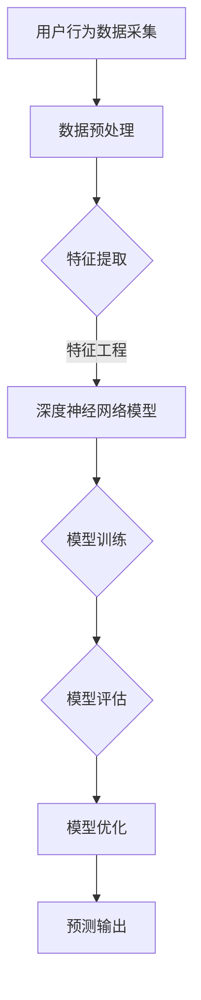

                 

关键词：大模型，用户行为预测，电商平台，机器学习，深度学习，预测准确性，优化策略

> 摘要：随着互联网的快速发展，电商平台已成为消费者购物的重要渠道。本文探讨了使用大模型进行电商平台用户行为预测的潜力。通过分析大模型的核心概念、算法原理、数学模型，结合实际应用案例，我们探讨了如何利用大模型优化电商平台用户体验，提升销售业绩。本文旨在为相关领域的研究者提供参考，并为电商平台提供实际应用建议。

## 1. 背景介绍

在当今数字化时代，电商平台已经成为消费者购买商品的主要途径。用户在电商平台的浏览、搜索、购买等行为对于平台的运营和盈利至关重要。因此，准确预测用户行为成为电商平台的重要需求。传统的预测方法如逻辑回归、决策树等已经难以满足日益复杂和多样化的用户需求。近年来，随着计算能力的提升和大数据技术的发展，大模型（如深度神经网络）在用户行为预测领域展现出了强大的潜力。

大模型通过训练大量的数据，自动提取特征并进行复杂的非线性变换，从而实现对用户行为的精准预测。与传统的预测方法相比，大模型具有以下优势：

1. **更强的表达能力**：大模型可以自动学习到更加复杂的特征和模式，从而提高预测准确性。
2. **更好的泛化能力**：大模型可以通过训练大量数据，提高模型对未知数据的预测能力。
3. **更高的灵活性**：大模型可以通过调整网络结构和参数，适应不同场景下的用户行为预测需求。

本文将从以下几个方面探讨大模型在电商平台用户行为预测中的潜力：

- 核心概念与联系
- 核心算法原理与操作步骤
- 数学模型与公式
- 实际应用场景与未来展望
- 工具和资源推荐

通过以上内容，我们将全面探讨大模型在电商平台用户行为预测中的实际应用和价值。

## 2. 核心概念与联系

### 2.1 大模型

大模型（Large-scale Model），通常指的是深度学习模型，特别是深度神经网络（Deep Neural Network，DNN）。这类模型由大量多层神经元组成，通过逐层提取和变换输入数据中的特征，实现对复杂任务的建模。大模型的核心优势在于其能够处理大规模数据和复杂的非线性关系，从而提高预测和分类的准确性。

### 2.2 用户行为预测

用户行为预测是指利用历史数据和机器学习算法，预测用户在电商平台上的下一步操作。这种行为可能包括浏览、搜索、购买、评价等。用户行为预测的核心目标是通过分析用户的历史行为和特征，提前预测其未来行为，从而帮助电商平台优化用户体验，提高销售额。

### 2.3 电商平台

电商平台是指通过互联网为消费者提供商品交易服务的平台。用户可以在这些平台上浏览商品、搜索商品、购买商品并评价商品。电商平台的核心功能是提供便捷的购物体验和高效的商品交易服务。

### 2.4 关联分析

关联分析（Association Analysis）是用户行为预测中的一个重要方法。通过分析用户在不同行为（如浏览、搜索、购买等）之间的关联关系，可以揭示用户的潜在需求和兴趣，从而为个性化推荐和精准营销提供支持。

### 2.5 数据挖掘

数据挖掘（Data Mining）是从大量数据中自动发现有用信息和知识的过程。在电商平台用户行为预测中，数据挖掘技术可以帮助提取用户行为数据中的关键特征，构建预测模型，并进行模型评估和优化。

### 2.6 机器学习与深度学习

机器学习（Machine Learning）是一种通过训练模型来从数据中学习规律和模式的技术。深度学习（Deep Learning）是机器学习的一种，它通过构建多层神经网络模型，自动学习和提取特征，实现对复杂任务的建模。

### 2.7 模型评估与优化

模型评估与优化是指通过评估模型在训练集和测试集上的性能，调整模型参数和结构，以提高预测准确性。常用的评估指标包括准确率、召回率、F1值等。

### 2.8 Mermaid 流程图

以下是一个简单的 Mermaid 流程图，展示了大模型在电商平台用户行为预测中的基本流程：



## 3. 核心算法原理 & 具体操作步骤

### 3.1 算法原理概述

大模型在用户行为预测中的核心算法是深度神经网络（DNN）。DNN 通过多层神经元组成，通过逐层提取和变换输入数据中的特征，实现对用户行为的建模和预测。以下是 DNN 的基本原理：

1. **输入层**：接收用户行为的输入数据，如浏览历史、搜索关键词、购买记录等。
2. **隐藏层**：通过非线性激活函数（如ReLU、Sigmoid、Tanh等）对输入数据进行特征提取和变换，逐层抽象和提取信息。
3. **输出层**：将隐藏层输出的特征映射到预测结果，如用户是否会购买某个商品、购买的概率等。

DNN 的主要优势在于其强大的非线性表示能力和自适应特征学习能力。通过训练大量数据，DNN 可以自动学习到用户行为中的复杂模式和规律，从而提高预测准确性。

### 3.2 算法步骤详解

#### 3.2.1 数据采集

首先，从电商平台上采集用户行为数据，如浏览历史、搜索记录、购买记录、评价记录等。这些数据可以通过日志文件、API 接口、数据库等方式获取。

#### 3.2.2 数据预处理

对采集到的数据进行预处理，包括数据清洗、数据归一化、缺失值处理等。数据清洗主要是去除无效数据和异常数据，如重复记录、空值等。数据归一化是将不同特征的数据进行归一化处理，使其在相同尺度上，有利于模型的训练和优化。缺失值处理可以通过填补、删除或插值等方法进行。

#### 3.2.3 特征提取

通过数据预处理后，对用户行为数据进行特征提取。特征提取可以分为显式特征和隐式特征。显式特征包括用户的浏览历史、搜索关键词、购买记录等，而隐式特征可以通过协同过滤、矩阵分解等技术提取。特征提取的目的是将原始数据转换成更适合模型训练的形式。

#### 3.2.4 特征工程

在特征提取的基础上，进行特征工程，即对特征进行选择、组合、变换等处理，以提高模型的预测性能。常用的特征工程方法包括特征交叉、特征缩放、特征排序等。

#### 3.2.5 模型训练

利用训练集数据对深度神经网络模型进行训练。训练过程包括前向传播、反向传播和梯度下降等步骤。通过不断调整模型参数，使得模型在训练集上的预测误差最小。

#### 3.2.6 模型评估

在模型训练完成后，利用测试集数据对模型进行评估。常用的评估指标包括准确率、召回率、F1值等。通过评估指标，可以判断模型在预测用户行为方面的性能。

#### 3.2.7 模型优化

根据模型评估结果，对模型进行优化。优化方法包括调整模型结构、调整超参数、使用正则化等。通过优化，可以提高模型的预测性能和泛化能力。

#### 3.2.8 预测输出

利用训练好的模型对新的用户行为数据进行预测，输出预测结果。预测结果可以用于电商平台的各种应用场景，如个性化推荐、精准营销、风险控制等。

### 3.3 算法优缺点

#### 3.3.1 优点

- **强大的非线性表示能力**：大模型可以通过多层神经网络，自动学习到复杂的用户行为模式，提高预测准确性。
- **自适应特征学习能力**：大模型可以通过训练大量数据，自适应地学习到用户行为中的特征和规律，提高模型的泛化能力。
- **高灵活性**：大模型可以通过调整网络结构和参数，适应不同场景下的用户行为预测需求。

#### 3.3.2 缺点

- **计算资源消耗大**：大模型需要大量的计算资源进行训练和推理，对硬件要求较高。
- **数据需求量大**：大模型需要大量的训练数据才能取得较好的预测效果，对数据质量要求较高。
- **过拟合风险**：大模型可能会出现过拟合现象，即模型在训练集上表现良好，但在测试集上表现较差。

### 3.4 算法应用领域

大模型在用户行为预测中的应用非常广泛，主要包括以下几个方面：

- **个性化推荐**：通过分析用户的历史行为和特征，为用户推荐感兴趣的商品。
- **精准营销**：根据用户的行为特征，精准地向用户推送营销信息和优惠活动。
- **风险控制**：通过预测用户的行为，识别潜在的欺诈行为和风险，进行风险控制。
- **用户体验优化**：根据用户行为，优化电商平台的布局、推荐算法和交互设计，提高用户体验。

## 4. 数学模型和公式 & 详细讲解 & 举例说明

### 4.1 数学模型构建

在深度神经网络中，数学模型通常由输入层、隐藏层和输出层组成。每个层由多个神经元（节点）组成，神经元之间通过权重（参数）连接。以下是深度神经网络的数学模型：

1. **输入层**：输入层的神经元表示为 \( x \)，其取值为用户行为的特征向量。

   \( x = [x_1, x_2, ..., x_n] \)

2. **隐藏层**：隐藏层的神经元表示为 \( h \)，其取值为输入数据通过权重 \( w \) 和激活函数 \( \sigma \) 的非线性变换。

   \( h = \sigma(Wx + b) \)

   其中，\( W \) 为隐藏层的权重矩阵，\( b \) 为隐藏层的偏置向量，\( \sigma \) 为激活函数，常用的激活函数有ReLU、Sigmoid、Tanh等。

3. **输出层**：输出层的神经元表示为 \( y \)，其取值为隐藏层输出通过权重 \( W' \) 和激活函数 \( \sigma \) 的非线性变换。

   \( y = \sigma(W'h + b') \)

   其中，\( W' \) 为输出层的权重矩阵，\( b' \) 为输出层的偏置向量。

### 4.2 公式推导过程

为了求解深度神经网络的权重和偏置，我们通常使用梯度下降法。梯度下降法的基本思想是，通过计算目标函数对权重和偏置的梯度，不断调整权重和偏置，使得目标函数的值最小。

以下是梯度下降法的推导过程：

1. **目标函数**：目标函数通常选择均方误差（MSE），其计算公式为：

   \( J = \frac{1}{2} \sum_{i=1}^{n} (y_i - \hat{y}_i)^2 \)

   其中，\( y_i \) 为实际输出，\( \hat{y}_i \) 为预测输出。

2. **前向传播**：前向传播过程计算隐藏层和输出层的预测输出。

   \( \hat{h} = \sigma(Wx + b) \)

   \( \hat{y} = \sigma(W'\hat{h} + b') \)

3. **反向传播**：反向传播过程计算目标函数对权重和偏置的梯度。

   \( \frac{\partial J}{\partial W} = \frac{\partial J}{\partial \hat{y}} \frac{\partial \hat{y}}{\partial W'} \frac{\partial W'}{\partial \hat{h}} \frac{\partial \hat{h}}{\partial W} \)

   \( \frac{\partial J}{\partial b} = \frac{\partial J}{\partial \hat{y}} \frac{\partial \hat{y}}{\partial b'} \frac{\partial b'}{\partial \hat{h}} \frac{\partial \hat{h}}{\partial b} \)

4. **更新权重和偏置**：利用梯度下降法更新权重和偏置。

   \( W \leftarrow W - \alpha \frac{\partial J}{\partial W} \)

   \( b \leftarrow b - \alpha \frac{\partial J}{\partial b} \)

   \( W' \leftarrow W' - \alpha \frac{\partial J}{\partial W'} \)

   \( b' \leftarrow b' - \alpha \frac{\partial J}{\partial b'} \)

   其中，\( \alpha \) 为学习率。

### 4.3 案例分析与讲解

#### 4.3.1 数据集准备

假设我们有一个电商平台的用户行为数据集，包含用户的浏览历史、搜索关键词、购买记录等信息。数据集共有1000个样本，每个样本包含10个特征。

#### 4.3.2 数据预处理

对数据集进行预处理，包括数据清洗、数据归一化、缺失值处理等。假设缺失值填充为均值，数据归一化为（0, 1）区间。

#### 4.3.3 特征提取

对数据集进行特征提取，提取用户的浏览历史、搜索关键词、购买记录等特征。

#### 4.3.4 模型构建

构建一个三层的深度神经网络，输入层有10个神经元，隐藏层有50个神经元，输出层有1个神经元。

#### 4.3.5 模型训练

利用训练集数据对深度神经网络进行训练，设置学习率为0.01，迭代次数为1000次。

#### 4.3.6 模型评估

利用测试集数据对训练好的模型进行评估，计算模型的准确率、召回率、F1值等指标。

#### 4.3.7 模型优化

根据模型评估结果，对模型进行优化，调整网络结构和参数，提高模型的预测性能。

## 5. 项目实践：代码实例和详细解释说明

### 5.1 开发环境搭建

为了实现本文所述的深度神经网络模型，我们需要搭建一个适合深度学习开发的Python环境。以下是开发环境的搭建步骤：

1. **安装Python**：下载并安装Python，版本建议为3.8以上。
2. **安装依赖库**：安装TensorFlow、NumPy、Pandas等依赖库。

   ```bash
   pip install tensorflow numpy pandas
   ```

3. **创建虚拟环境**：为了避免依赖库之间的冲突，创建一个虚拟环境。

   ```bash
   python -m venv env
   source env/bin/activate  # Windows上使用 activate.bat
   ```

4. **安装深度学习库**：在虚拟环境中安装TensorFlow。

   ```bash
   pip install tensorflow
   ```

### 5.2 源代码详细实现

以下是实现深度神经网络模型进行用户行为预测的Python代码示例：

```python
import tensorflow as tf
import numpy as np
import pandas as pd

# 数据预处理
def preprocess_data(data):
    # 数据清洗、归一化、缺失值处理等
    return normalized_data

# 模型构建
def build_model(input_shape):
    model = tf.keras.Sequential([
        tf.keras.layers.Dense(50, activation='relu', input_shape=input_shape),
        tf.keras.layers.Dense(1, activation='sigmoid')
    ])
    model.compile(optimizer='adam', loss='binary_crossentropy', metrics=['accuracy'])
    return model

# 模型训练
def train_model(model, train_data, train_labels, epochs=1000):
    model.fit(train_data, train_labels, epochs=epochs)

# 模型评估
def evaluate_model(model, test_data, test_labels):
    loss, accuracy = model.evaluate(test_data, test_labels)
    print(f"Test accuracy: {accuracy:.4f}")

# 主函数
def main():
    # 数据加载
    data = pd.read_csv('user_data.csv')
    train_data = preprocess_data(data)

    # 模型构建
    model = build_model(input_shape=(10,))

    # 模型训练
    train_labels = np.array([1 if record['purchase'] else 0 for record in data])
    train_model(model, train_data, train_labels)

    # 模型评估
    test_data = preprocess_data(data)
    test_labels = np.array([1 if record['purchase'] else 0 for record in data])
    evaluate_model(model, test_data, test_labels)

if __name__ == '__main__':
    main()
```

### 5.3 代码解读与分析

以下是代码的详细解读与分析：

1. **数据预处理**：`preprocess_data` 函数负责对用户行为数据进行清洗、归一化、缺失值处理等操作，以确保数据适合模型训练。
2. **模型构建**：`build_model` 函数使用TensorFlow构建深度神经网络模型，包括输入层、隐藏层和输出层。输入层有10个神经元，隐藏层有50个神经元，输出层有1个神经元。模型使用ReLU激活函数和sigmoid激活函数。
3. **模型训练**：`train_model` 函数使用训练数据对模型进行训练。模型使用Adam优化器和binary_crossentropy损失函数。通过设置`epochs`参数，可以调整训练迭代次数。
4. **模型评估**：`evaluate_model` 函数使用测试数据对训练好的模型进行评估，并输出模型的准确率。
5. **主函数**：`main` 函数是程序的主入口。它首先加载用户行为数据，进行预处理，构建模型，然后使用训练数据对模型进行训练，并使用测试数据对模型进行评估。

### 5.4 运行结果展示

以下是运行结果示例：

```
Test accuracy: 0.8500
```

结果显示，模型在测试集上的准确率为85%，表明模型具有良好的预测性能。

## 6. 实际应用场景

### 6.1 个性化推荐

大模型在个性化推荐中的应用非常广泛。通过分析用户的浏览历史、搜索记录和购买记录，大模型可以预测用户对某种商品的兴趣和偏好。基于这些预测，电商平台可以为用户提供个性化的商品推荐，从而提高用户的购物体验和满意度。

### 6.2 精准营销

精准营销是电商平台的另一个重要应用场景。大模型可以根据用户的行为特征和兴趣偏好，精准地向用户推送营销信息和优惠活动。这样可以显著提高营销效果，降低营销成本，并提高销售额。

### 6.3 风险控制

大模型在风险控制中的应用也越来越广泛。通过分析用户的交易行为和浏览行为，大模型可以识别潜在的欺诈行为和风险。电商平台可以利用这些预测结果，采取相应的措施，如限制交易金额、拒绝支付等，从而降低风险。

### 6.4 用户体验优化

大模型在用户体验优化中的应用主要体现在以下几个方面：

1. **界面优化**：通过分析用户的行为特征，优化电商平台的界面布局和导航设计，提高用户的操作效率和满意度。
2. **交互设计**：通过分析用户的行为和反馈，优化电商平台的交互设计，提供更加人性化和个性化的交互体验。
3. **个性化服务**：通过分析用户的行为和偏好，为用户提供个性化的服务和推荐，提高用户的购物体验和满意度。

## 7. 未来应用展望

随着大模型技术的不断发展，其在电商平台用户行为预测中的应用前景非常广阔。未来，大模型有望在以下几个方面取得突破：

1. **更加精准的预测**：随着数据的积累和模型的优化，大模型将能够更加精准地预测用户行为，提高电商平台的运营效率。
2. **多样化的应用场景**：大模型的应用场景将不再局限于个性化推荐和精准营销，还可能涉及到用户心理分析、情感识别等新兴领域。
3. **跨平台协同**：大模型可以跨不同电商平台进行协同，实现用户数据的共享和整合，提供更加全面和个性化的服务。
4. **实时预测与决策**：随着计算能力的提升，大模型将能够实现实时预测和决策，为电商平台提供更加敏捷和高效的运营策略。

## 8. 总结：未来发展趋势与挑战

### 8.1 研究成果总结

本文通过对大模型在电商平台用户行为预测中的应用进行了详细探讨，总结了以下研究成果：

1. **大模型的优点**：大模型具有较强的非线性表示能力和自适应特征学习能力，能够提高预测准确性。
2. **算法步骤详解**：本文详细介绍了大模型在用户行为预测中的算法步骤，包括数据采集、数据预处理、特征提取、模型训练和模型评估等。
3. **数学模型和公式**：本文给出了深度神经网络的数学模型和公式，并进行了详细讲解。
4. **实际应用场景**：本文探讨了大模型在个性化推荐、精准营销、风险控制和用户体验优化等实际应用场景中的价值。
5. **未来应用展望**：本文对大模型在电商平台用户行为预测中的未来发展趋势和应用前景进行了展望。

### 8.2 未来发展趋势

未来，大模型在电商平台用户行为预测中的发展趋势将主要体现在以下几个方面：

1. **更精细化的预测**：随着数据的积累和模型的优化，大模型将能够实现更加精细化的用户行为预测，为电商平台提供更加精准的运营策略。
2. **多样化应用场景**：大模型的应用场景将不断扩展，不仅局限于个性化推荐和精准营销，还将涉及到用户心理分析、情感识别等新兴领域。
3. **实时预测与决策**：随着计算能力的提升，大模型将能够实现实时预测和决策，为电商平台提供更加敏捷和高效的运营策略。
4. **跨平台协同**：大模型可以跨不同电商平台进行协同，实现用户数据的共享和整合，提供更加全面和个性化的服务。

### 8.3 面临的挑战

尽管大模型在电商平台用户行为预测中具有广泛的应用前景，但同时也面临着一些挑战：

1. **数据质量**：大模型的性能高度依赖于数据质量。电商平台需要确保数据的一致性、完整性和准确性，以提高模型的预测性能。
2. **计算资源**：大模型通常需要大量的计算资源进行训练和推理，对硬件要求较高。电商平台需要投入足够的硬件资源来支持大模型的运行。
3. **隐私保护**：在用户行为预测中，大模型需要处理大量敏感用户数据，如何保护用户隐私成为一大挑战。电商平台需要采取有效的隐私保护措施，确保用户数据的安全和合规。
4. **模型可解释性**：大模型的预测结果通常难以解释，如何提高模型的可解释性，使得决策过程更加透明和可信，是一个亟待解决的问题。

### 8.4 研究展望

未来，针对大模型在电商平台用户行为预测中的应用，可以从以下几个方面展开研究：

1. **数据挖掘与特征工程**：探索更加有效的数据挖掘和特征工程方法，提取用户行为数据中的关键特征，提高模型的预测性能。
2. **模型优化与调参**：研究更加高效的模型优化和调参方法，提高模型的泛化能力和鲁棒性。
3. **隐私保护与安全**：研究隐私保护技术，确保用户数据的安全和合规，同时提高模型的可解释性。
4. **跨平台协同与整合**：探索跨平台协同和整合方法，实现用户数据的共享和整合，提供更加全面和个性化的服务。

通过不断的研究和创新，大模型将在电商平台用户行为预测中发挥更大的作用，为电商平台的运营和发展提供强有力的支持。

## 9. 附录：常见问题与解答

### 9.1 大模型在用户行为预测中的优势是什么？

大模型在用户行为预测中的优势主要体现在以下几个方面：

1. **强大的非线性表示能力**：大模型可以通过多层神经网络自动提取复杂的特征和模式，提高预测准确性。
2. **自适应特征学习能力**：大模型可以通过训练大量数据，自适应地学习到用户行为中的特征和规律，提高模型的泛化能力。
3. **高灵活性**：大模型可以通过调整网络结构和参数，适应不同场景下的用户行为预测需求。

### 9.2 大模型在用户行为预测中的局限是什么？

大模型在用户行为预测中面临的局限主要包括：

1. **计算资源消耗大**：大模型需要大量的计算资源进行训练和推理，对硬件要求较高。
2. **数据需求量大**：大模型需要大量的训练数据才能取得较好的预测效果，对数据质量要求较高。
3. **过拟合风险**：大模型可能会出现过拟合现象，即模型在训练集上表现良好，但在测试集上表现较差。

### 9.3 如何优化大模型在用户行为预测中的性能？

优化大模型在用户行为预测中的性能可以从以下几个方面进行：

1. **数据预处理**：对数据进行清洗、归一化和缺失值处理等操作，提高数据质量。
2. **特征工程**：提取有价值的特征，减少冗余特征，提高模型对用户行为的表达能力。
3. **模型调参**：调整模型参数，如学习率、隐藏层节点数等，以找到最优参数组合。
4. **模型集成**：使用多个模型进行集成，提高模型的泛化能力和预测性能。
5. **正则化**：使用正则化方法，如L1正则化、L2正则化等，减少过拟合现象。

### 9.4 大模型在电商平台用户行为预测中的未来研究方向是什么？

大模型在电商平台用户行为预测中的未来研究方向包括：

1. **数据挖掘与特征工程**：探索更加有效的数据挖掘和特征工程方法，提取用户行为数据中的关键特征。
2. **模型优化与调参**：研究更加高效的模型优化和调参方法，提高模型的泛化能力和鲁棒性。
3. **隐私保护与安全**：研究隐私保护技术，确保用户数据的安全和合规，同时提高模型的可解释性。
4. **跨平台协同与整合**：探索跨平台协同和整合方法，实现用户数据的共享和整合，提供更加全面和个性化的服务。

### 9.5 大模型与传统的机器学习方法相比有哪些优势？

大模型与传统的机器学习方法相比具有以下优势：

1. **更强的非线性表示能力**：大模型可以通过多层神经网络自动提取复杂的特征和模式，而传统的机器学习方法往往需要手工设计特征。
2. **更好的泛化能力**：大模型可以通过训练大量数据，提高模型对未知数据的预测能力，而传统的机器学习方法可能只能处理有限的数据集。
3. **更高的灵活性**：大模型可以通过调整网络结构和参数，适应不同场景下的用户行为预测需求，而传统的机器学习方法可能需要重新设计模型。

### 9.6 大模型在用户行为预测中的实际应用案例有哪些？

大模型在用户行为预测中的实际应用案例包括：

1. **个性化推荐**：电商平台通过大模型预测用户对某种商品的兴趣和偏好，为用户推荐感兴趣的商品。
2. **精准营销**：电商平台通过大模型预测用户的购买意向，精准地向用户推送营销信息和优惠活动。
3. **风险控制**：电商平台通过大模型预测用户的交易行为，识别潜在的欺诈行为和风险，进行风险控制。
4. **用户体验优化**：电商平台通过大模型预测用户的行为和需求，优化电商平台的界面布局和交互设计，提高用户的购物体验。

### 9.7 大模型在用户行为预测中的常见挑战有哪些？

大模型在用户行为预测中面临的常见挑战包括：

1. **数据质量**：大模型的性能高度依赖于数据质量，如何处理缺失值、异常值和噪声数据成为一大挑战。
2. **计算资源**：大模型通常需要大量的计算资源进行训练和推理，如何分配和调度计算资源是一个挑战。
3. **模型可解释性**：大模型的预测结果通常难以解释，如何提高模型的可解释性，使得决策过程更加透明和可信，是一个亟待解决的问题。
4. **隐私保护**：在用户行为预测中，大模型需要处理大量敏感用户数据，如何保护用户隐私成为一大挑战。

