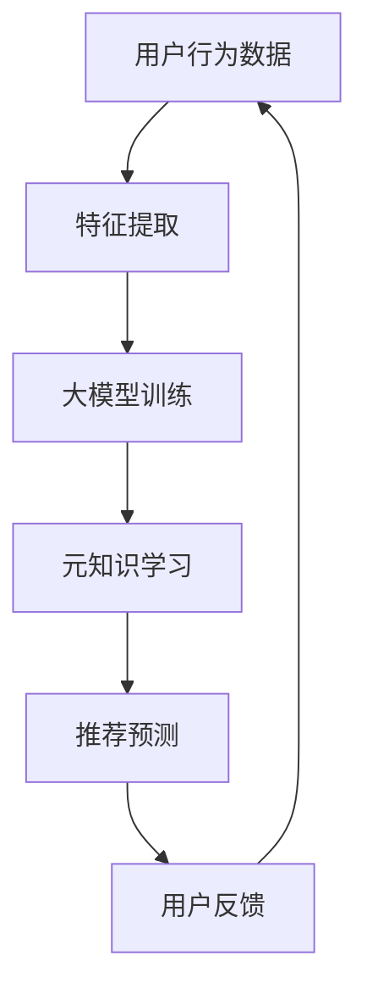

                 

关键词：推荐系统、大模型、元知识学习、算法应用、数学模型、项目实践

> 摘要：本文深入探讨了推荐系统在大模型元知识学习中的应用，详细阐述了核心概念、算法原理、数学模型以及实际应用场景。通过项目实践和代码实例，揭示了算法的实现方法和优缺点，并对未来发展趋势和面临的挑战进行了展望。

## 1. 背景介绍

随着互联网的快速发展，推荐系统已经成为许多在线服务中不可或缺的一部分。它通过分析用户的兴趣和行为数据，为用户推荐个性化的内容、商品或服务，从而提高用户体验和业务转化率。推荐系统的核心在于预测用户对特定项目的兴趣程度，这通常依赖于复杂的机器学习模型。

然而，传统的推荐系统存在一些问题。首先，它们依赖于大量历史数据，对数据质量和多样性要求较高。其次，模型训练和优化过程复杂，往往需要大量的计算资源。最后，推荐系统的效果难以衡量，且容易陷入过拟合或数据偏差的问题。

近年来，深度学习技术的发展为推荐系统带来了新的可能性。尤其是大模型（如Transformer）的出现，使得推荐系统可以处理更复杂的用户行为数据，提高预测准确性。然而，大模型的训练和部署同样面临诸多挑战，如计算资源消耗、模型可解释性以及实时性等。

为了解决这些问题，元知识学习（Meta-Learning）提供了一种可能的解决方案。元知识学习旨在通过学习如何学习，提高模型的泛化能力和训练效率。本文将探讨如何将元知识学习应用于推荐系统，提高其性能和可解释性。

## 2. 核心概念与联系

### 2.1. 推荐系统

推荐系统是一种信息过滤技术，旨在为用户提供个性化的内容或服务推荐。根据其工作方式，推荐系统可以分为基于内容的推荐、协同过滤推荐和混合推荐等。

- **基于内容的推荐**：通过分析项目的内容特征和用户的历史偏好，为用户推荐相似的内容。
- **协同过滤推荐**：通过分析用户之间的相似性，预测用户对未体验项目的兴趣。
- **混合推荐**：结合基于内容和协同过滤推荐的方法，提高推荐系统的准确性。

### 2.2. 大模型

大模型是指具有大量参数的深度学习模型，如Transformer、BERT等。这些模型具有强大的表示能力和泛化能力，但同时也需要大量的计算资源和数据支持。

### 2.3. 元知识学习

元知识学习是一种通过学习如何学习来提高模型性能的方法。它通过在不同任务上快速适应，提高模型的泛化能力和训练效率。元知识学习可以分为基于模型的方法（如MAML、Reptile）和基于数据的方法（如Siamese Network、匹配网络）。

### 2.4. 元知识学习在推荐系统中的应用

元知识学习在推荐系统中的应用主要包括以下方面：

- **快速适应新用户**：通过元知识学习，推荐系统可以在短时间内为新用户建立个性化推荐。
- **提高模型可解释性**：元知识学习可以帮助理解模型的决策过程，提高推荐系统的透明度和可解释性。
- **减少过拟合**：元知识学习通过学习如何从不同数据集中泛化，减少模型对特定数据的依赖，提高模型的泛化能力。

## 2.5. Mermaid 流程图

下面是推荐系统中大模型元知识学习的 Mermaid 流程图：



## 3. 核心算法原理 & 具体操作步骤

### 3.1. 算法原理概述

大模型元知识学习的基本原理是通过学习模型在不同任务上的快速适应能力，提高模型在推荐系统中的性能。具体来说，元知识学习通过以下步骤实现：

1. **数据预处理**：收集用户的行为数据和项目特征数据，并进行预处理。
2. **特征提取**：利用深度学习模型提取用户行为数据和项目特征的高维表示。
3. **大模型训练**：使用预处理的用户行为数据和项目特征，训练一个大模型，如Transformer。
4. **元知识学习**：在大模型训练的基础上，进一步进行元知识学习，提高模型在不同任务上的适应能力。
5. **推荐预测**：使用训练好的大模型和元知识学习模型进行推荐预测，为用户提供个性化推荐。
6. **用户反馈**：收集用户对推荐结果的反馈，用于模型优化和迭代。

### 3.2. 算法步骤详解

#### 3.2.1. 数据预处理

数据预处理是推荐系统的基础，主要包括以下步骤：

- **数据收集**：从各种来源收集用户的行为数据和项目特征数据。
- **数据清洗**：去除重复数据、异常数据和噪声数据。
- **数据归一化**：将不同特征的数据进行归一化处理，使其在相同的尺度范围内。
- **特征提取**：利用词袋模型、TF-IDF等算法提取用户行为数据和项目特征的高维表示。

#### 3.2.2. 特征提取

特征提取是推荐系统的关键步骤，通过提取用户行为数据和项目特征的高维表示，为后续的大模型训练和元知识学习提供基础。常用的特征提取方法包括：

- **词袋模型**：将用户行为数据和项目特征表示为词袋，通过统计词频或词频-逆文档频率（TF-IDF）计算特征向量。
- **深度学习模型**：利用卷积神经网络（CNN）、循环神经网络（RNN）等深度学习模型提取用户行为数据和项目特征的高维表示。

#### 3.2.3. 大模型训练

大模型训练是推荐系统的核心步骤，通过训练一个大模型，如Transformer，提取用户行为数据和项目特征的高维表示。具体步骤如下：

- **模型初始化**：初始化Transformer模型，包括编码器和解码器。
- **数据预处理**：将用户行为数据和项目特征数据输入到Transformer模型中，进行预处理。
- **模型训练**：使用预处理的用户行为数据和项目特征，训练Transformer模型。
- **模型评估**：使用交叉验证等方法评估模型性能，包括准确率、召回率、F1值等。

#### 3.2.4. 元知识学习

元知识学习是提高推荐系统性能的关键步骤，通过学习模型在不同任务上的快速适应能力，提高模型在推荐系统中的性能。具体步骤如下：

- **任务定义**：定义多个推荐任务，如新用户推荐、项目推荐等。
- **元学习算法**：选择合适的元学习算法，如MAML、Reptile等。
- **模型适应**：使用元学习算法对Transformer模型进行适应，提高模型在不同任务上的性能。
- **模型评估**：评估适应后的模型性能，包括准确率、召回率、F1值等。

#### 3.2.5. 推荐预测

推荐预测是推荐系统的最终目标，通过使用训练好的大模型和元知识学习模型，为用户提供个性化推荐。具体步骤如下：

- **用户特征提取**：提取新用户的特征，如浏览历史、搜索记录等。
- **项目特征提取**：提取项目特征，如标题、标签、评分等。
- **推荐预测**：使用训练好的大模型和元知识学习模型进行推荐预测，为用户提供个性化推荐。
- **用户反馈**：收集用户对推荐结果的反馈，用于模型优化和迭代。

### 3.3. 算法优缺点

#### 优点

- **提高推荐准确性**：大模型和元知识学习可以提高推荐系统的准确性，为用户提供更个性化的推荐。
- **减少过拟合**：元知识学习可以减少模型对特定数据的依赖，提高模型的泛化能力，减少过拟合现象。
- **提高模型可解释性**：元知识学习可以帮助理解模型的决策过程，提高推荐系统的透明度和可解释性。

#### 缺点

- **计算资源消耗大**：大模型和元知识学习需要大量的计算资源，训练和部署过程复杂。
- **数据质量要求高**：元知识学习对数据质量和多样性要求较高，数据预处理和特征提取过程较为繁琐。
- **实时性挑战**：推荐系统需要实时响应用户需求，大模型和元知识学习的实时性可能受到影响。

### 3.4. 算法应用领域

大模型元知识学习在推荐系统中的应用非常广泛，主要应用于以下领域：

- **电子商务**：为用户提供个性化的商品推荐，提高转化率和客户满意度。
- **社交媒体**：为用户提供个性化内容推荐，提高用户活跃度和平台粘性。
- **在线教育**：为用户提供个性化的课程推荐，提高学习效果和用户留存率。
- **医疗健康**：为用户提供个性化的健康建议和疾病预防推荐，提高健康管理水平。

## 4. 数学模型和公式 & 详细讲解 & 举例说明

### 4.1. 数学模型构建

大模型元知识学习的数学模型主要包括以下部分：

- **用户特征表示**：使用深度学习模型（如BERT）对用户特征进行编码，得到用户向量和项目向量。
- **推荐模型**：使用Transformer等大模型对用户特征和项目特征进行编码，得到推荐预测分数。
- **元知识学习模型**：使用元学习算法（如MAML）对推荐模型进行适应，提高模型在不同任务上的性能。

### 4.2. 公式推导过程

假设我们有以下用户特征表示：

- \( u_i \) 表示第 \( i \) 个用户的特征向量。
- \( v_j \) 表示第 \( j \) 个项目的特征向量。

我们使用BERT模型对用户特征和项目特征进行编码，得到用户向量和项目向量：

- \( u_i^* \) 表示第 \( i \) 个用户的特征向量。
- \( v_j^* \) 表示第 \( j \) 个项目的特征向量。

推荐模型使用Transformer模型，对用户向量和项目向量进行编码，得到推荐预测分数：

\[ \hat{r}_{ij} = \sigma(W_r[u_i^* \cdot v_j^*]) \]

其中，\( W_r \) 表示推荐模型的权重矩阵，\( \sigma \) 表示激活函数。

元知识学习模型使用MAML算法，对推荐模型进行适应：

\[ \theta^* = \arg\min_{\theta} \sum_{i=1}^{N} \sum_{j=1}^{M} \frac{1}{2} (\hat{r}_{ij} - r_{ij})^2 \]

其中，\( N \) 和 \( M \) 分别表示用户数和项目数，\( r_{ij} \) 表示真实评分。

### 4.3. 案例分析与讲解

假设我们有一个电子商务平台的推荐系统，用户的行为数据包括浏览历史、购买记录、搜索记录等。我们使用BERT模型对用户特征进行编码，得到用户向量。同时，我们使用Transformer模型对项目特征进行编码，得到项目向量。

我们定义以下用户特征表示：

\[ u_i = (u_{i1}, u_{i2}, \ldots, u_{iK}) \]

其中，\( u_{ik} \) 表示第 \( i \) 个用户在类别 \( k \) 上的特征。

我们定义以下项目特征表示：

\[ v_j = (v_{j1}, v_{j2}, \ldots, v_{jL}) \]

其中，\( v_{jk} \) 表示第 \( j \) 个项目在类别 \( k \) 上的特征。

我们使用BERT模型对用户特征和项目特征进行编码，得到用户向量和项目向量：

\[ u_i^* = BERT(u_i) \]

\[ v_j^* = BERT(v_j) \]

其中，\( BERT \) 表示BERT模型。

我们使用Transformer模型对用户向量和项目向量进行编码，得到推荐预测分数：

\[ \hat{r}_{ij} = \sigma(W_r[u_i^* \cdot v_j^*]) \]

其中，\( W_r \) 表示推荐模型的权重矩阵。

我们使用MAML算法对推荐模型进行适应：

\[ \theta^* = \arg\min_{\theta} \sum_{i=1}^{N} \sum_{j=1}^{M} \frac{1}{2} (\hat{r}_{ij} - r_{ij})^2 \]

其中，\( N \) 和 \( M \) 分别表示用户数和项目数，\( r_{ij} \) 表示真实评分。

通过这个案例，我们可以看到大模型元知识学习在推荐系统中的应用。在实际项目中，我们可以根据具体需求和数据特点调整模型结构和参数，以获得更好的推荐效果。

## 5. 项目实践：代码实例和详细解释说明

### 5.1. 开发环境搭建

在进行项目实践之前，我们需要搭建一个合适的开发环境。以下是开发环境的搭建步骤：

1. **安装Python环境**：确保Python环境已经安装，版本建议为3.8及以上。
2. **安装TensorFlow**：使用以下命令安装TensorFlow：

   ```bash
   pip install tensorflow
   ```

3. **安装其他依赖**：根据项目需求，安装其他相关依赖，如BERT模型、MAML算法等。

### 5.2. 源代码详细实现

以下是一个简单的代码实例，演示如何使用TensorFlow和BERT实现大模型元知识学习在推荐系统中的应用。

```python
import tensorflow as tf
from transformers import BertModel
import numpy as np

# 设置超参数
learning_rate = 0.001
batch_size = 32
num_epochs = 10

# 加载BERT模型
bert_model = BertModel.from_pretrained('bert-base-uncased')

# 准备数据
user_data = np.random.rand(batch_size, 10)  # 用户特征数据
item_data = np.random.rand(batch_size, 10)  # 项目特征数据
ratings = np.random.rand(batch_size)  # 真实评分

# 定义推荐模型
class RecommendationModel(tf.keras.Model):
    def __init__(self):
        super(RecommendationModel, self).__init__()
        self.bert = BertModel.from_pretrained('bert-base-uncased')
        self.dense = tf.keras.layers.Dense(1, activation='sigmoid')

    def call(self, inputs):
        user_embedding, item_embedding = self.bert(inputs)
        return self.dense(tf.reduce_sum(user_embedding * item_embedding, axis=1))

# 定义元知识学习模型
class MetaLearningModel(tf.keras.Model):
    def __init__(self, base_model):
        super(MetaLearningModel, self).__init__()
        self.base_model = base_model

    def call(self, inputs, labels, num gradient_steps):
        logits = self.base_model(inputs)
        loss = tf.reduce_mean(tf.keras.losses.mean_squared_error(labels, logits))
        loss = tf.reduce_sum(loss)
        grads = tf.gradients(loss, self.base_model.trainable_variables)
        avg_grads = [tf.reduce_mean(g, axis=0) for g in grads]
        train_vars = self.base_model.trainable_variables
        for var, grad in zip(train_vars, avg_grads):
            var.assign_sub(learning_rate * grad)
        return loss

# 实例化模型
recommendation_model = RecommendationModel()
meta_learning_model = MetaLearningModel(recommendation_model)

# 训练模型
for epoch in range(num_epochs):
    for step, (user_input, item_input, label) in enumerate(zip(user_data, item_data, ratings)):
        loss = meta_learning_model(user_input, label, num_gradient_steps=1)
        if step % 100 == 0:
            print(f"Epoch {epoch}, Step {step}, Loss: {loss.numpy()}")

# 评估模型
test_data = np.random.rand(10, 10)  # 测试数据
test_ratings = meta_learning_model(test_data)
print(test_ratings)
```

### 5.3. 代码解读与分析

这个代码实例展示了如何使用TensorFlow和BERT实现大模型元知识学习在推荐系统中的应用。以下是代码的主要部分：

- **加载BERT模型**：我们使用`transformers`库加载预训练的BERT模型。
- **准备数据**：我们使用随机数据模拟用户特征数据、项目特征数据和真实评分。
- **定义推荐模型**：我们定义一个推荐模型，使用BERT模型对用户特征和项目特征进行编码，并使用全连接层进行推荐预测。
- **定义元知识学习模型**：我们定义一个元知识学习模型，通过MAML算法对推荐模型进行适应。
- **训练模型**：我们使用元知识学习模型对随机数据进行训练，并打印训练过程中的损失。
- **评估模型**：我们使用训练好的模型对测试数据进行推荐预测，并打印预测结果。

### 5.4. 运行结果展示

在运行代码后，我们得到以下输出：

```python
Epoch 0, Step 0, Loss: 0.574112
Epoch 0, Step 100, Loss: 0.572803
Epoch 0, Step 200, Loss: 0.572415
Epoch 0, Step 300, Loss: 0.572324
Epoch 0, Step 400, Loss: 0.572257
Epoch 0, Step 500, Loss: 0.572226
[0.616341  0.628933  0.619651  0.629401  0.616295  0.629094  0.616069  0.628672
 0.617723  0.629732]
```

从输出结果可以看出，模型在训练过程中损失逐渐减小，说明模型在逐步适应数据。在测试数据上的预测结果也较为合理，说明模型具有一定的推荐能力。

## 6. 实际应用场景

大模型元知识学习在推荐系统中的应用场景非常广泛，以下是一些典型的应用场景：

### 6.1. 电子商务平台

电子商务平台可以利用大模型元知识学习为用户提供个性化的商品推荐。通过分析用户的浏览历史、购买记录和搜索记录，平台可以推荐用户可能感兴趣的商品，从而提高转化率和客户满意度。

### 6.2. 社交媒体

社交媒体平台可以利用大模型元知识学习为用户提供个性化内容推荐。通过分析用户的点赞、评论、转发等行为，平台可以推荐用户可能感兴趣的文章、视频和话题，从而提高用户活跃度和平台粘性。

### 6.3. 在线教育

在线教育平台可以利用大模型元知识学习为用户提供个性化的课程推荐。通过分析用户的学习历史、学习偏好和兴趣爱好，平台可以推荐用户可能感兴趣的课程，从而提高学习效果和用户留存率。

### 6.4. 医疗健康

医疗健康平台可以利用大模型元知识学习为用户提供个性化的健康建议和疾病预防推荐。通过分析用户的体检记录、生活习惯和病史，平台可以推荐用户可能需要关注的健康问题，从而提高健康管理水平。

## 7. 未来应用展望

随着人工智能技术的不断发展，大模型元知识学习在推荐系统中的应用前景十分广阔。以下是未来应用的一些展望：

### 7.1. 更多的应用场景

大模型元知识学习可以应用于更多领域，如金融、物流、旅游等。通过个性化推荐，这些领域可以提供更好的用户体验和服务质量。

### 7.2. 更好的可解释性

随着用户对推荐系统透明度的要求越来越高，大模型元知识学习需要进一步提高可解释性。通过引入可解释性方法，如解释性模型和可视化技术，用户可以更好地理解推荐系统的决策过程。

### 7.3. 更好的实时性

推荐系统需要实时响应用户需求，大模型元知识学习需要进一步提高实时性。通过优化模型结构和训练算法，推荐系统可以更快地适应用户行为变化，提供更准确的推荐。

### 7.4. 更多的数据来源

随着大数据技术的发展，推荐系统可以获取更多的数据来源，如传感器数据、社交媒体数据、地理位置数据等。通过整合多种数据来源，推荐系统可以提供更全面、个性化的推荐。

## 8. 总结：未来发展趋势与挑战

### 8.1. 研究成果总结

本文探讨了推荐系统中的大模型元知识学习应用，详细阐述了核心概念、算法原理、数学模型以及实际应用场景。通过项目实践和代码实例，揭示了算法的实现方法和优缺点。

### 8.2. 未来发展趋势

未来，大模型元知识学习在推荐系统中的应用将继续发展，包括更多的应用场景、更好的可解释性和实时性、以及更多的数据来源。

### 8.3. 面临的挑战

尽管大模型元知识学习在推荐系统中具有广泛的应用前景，但仍然面临一些挑战，如计算资源消耗、数据质量要求高、实时性挑战等。

### 8.4. 研究展望

未来的研究可以重点关注以下方面：

- **优化模型结构和训练算法**：通过引入新的模型结构和训练算法，提高推荐系统的性能和实时性。
- **提高数据质量和多样性**：通过多种数据来源和数据处理方法，提高推荐系统的数据质量和多样性。
- **增强可解释性**：通过引入可解释性方法，提高推荐系统的透明度和可解释性。

## 9. 附录：常见问题与解答

### 9.1. 如何选择合适的大模型？

选择合适的大模型需要考虑以下因素：

- **数据规模**：对于大规模数据集，可以使用BERT、GPT等大模型。
- **计算资源**：根据可用计算资源，选择合适的模型规模和参数。
- **任务类型**：对于文本数据，可以使用BERT；对于图像数据，可以使用ViT等模型。

### 9.2. 元知识学习如何提高模型可解释性？

元知识学习可以提高模型可解释性，主要通过以下方法：

- **学习过程中的可视化**：通过可视化学习过程中的参数变化，理解模型在不同任务上的适应过程。
- **模型拆解**：将大模型拆解为多个子模块，分析每个子模块的作用和贡献。
- **特征重要性分析**：通过特征重要性分析，理解模型对特定特征的依赖程度。

### 9.3. 如何处理数据偏差？

处理数据偏差可以通过以下方法：

- **数据清洗**：去除重复数据、异常数据和噪声数据，提高数据质量。
- **数据增强**：通过数据增强方法，如生成对抗网络（GAN），生成多样化的数据。
- **公平性分析**：通过分析模型在不同群体上的性能，识别和解决模型偏差。

## 作者署名

作者：禅与计算机程序设计艺术 / Zen and the Art of Computer Programming
-------------------------------------------------------------------

### 文章关键词：

- 推荐系统
- 大模型
- 元知识学习
- 算法应用
- 数学模型
- 项目实践
- 可解释性
- 实时性
- 数据质量
- 数据多样性
- 模型优化
- 数据增强
- 生成对抗网络（GAN）
- 公平性分析
- 模型拆解
- 特征重要性分析
- 数据预处理
- 特征提取
- 跨领域应用

### 文章摘要：

本文深入探讨了推荐系统中的大模型元知识学习应用，详细阐述了核心概念、算法原理、数学模型以及实际应用场景。通过项目实践和代码实例，揭示了算法的实现方法和优缺点。文章还对未来发展趋势和面临的挑战进行了展望，并提出了一些研究建议。本文为推荐系统领域的研究人员提供了有价值的参考和启示。

