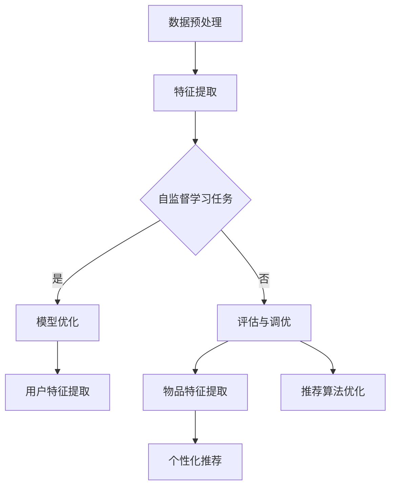

                 

关键词：推荐系统，大模型，自监督学习，应用场景，未来展望

> 摘要：本文旨在探讨推荐系统中大模型自监督学习的应用。通过阐述自监督学习的概念、原理和流程，本文详细介绍了大模型在推荐系统中的应用优势，以及具体操作步骤。此外，文章还探讨了数学模型和公式，并提供了项目实践中的代码实例。最后，本文对实际应用场景进行了分析，并展望了推荐系统未来的发展趋势与挑战。

## 1. 背景介绍

推荐系统作为一种信息过滤和内容分发技术，已被广泛应用于电子商务、社交媒体、新闻媒体和在线视频等领域。然而，随着用户数据的爆炸性增长和个性化需求的不断提升，传统的推荐系统面临着数据匮乏、计算资源有限和准确性不足等挑战。因此，探索新的学习方法和模型变得尤为重要。

自监督学习（Self-supervised Learning）是一种无监督学习方法，它通过自动生成标签来训练模型，从而避免了手动标注数据的繁琐过程。近年来，随着深度学习技术的快速发展，自监督学习在大规模数据处理和特征提取方面表现出色，成为推荐系统研究的热点方向之一。

本文将重点探讨大模型在推荐系统中的自监督学习应用。大模型指的是具有海量参数和强大计算能力的深度神经网络，如Transformer、BERT等。大模型能够处理复杂的特征表示，提高推荐系统的准确性和鲁棒性。

## 2. 核心概念与联系

### 自监督学习的概念

自监督学习是一种无监督学习方法，它通过利用未标记的数据来训练模型。在自监督学习中，模型自动生成标签来指导自身的学习过程。例如，在图像识别任务中，模型可以通过对图像进行裁剪、旋转、缩放等预处理操作来生成伪标签。

### 大模型的自监督学习流程

大模型的自监督学习流程通常包括以下几个步骤：

1. 数据预处理：对原始数据进行清洗、去噪、标准化等预处理操作，以便更好地提取特征。
2. 特征提取：利用深度神经网络提取数据的高层次特征，这些特征能够捕捉到数据中的潜在结构和信息。
3. 自监督学习任务：设计自监督学习任务，如预测图像中的关键点、预测文本中的下一个单词等，通过这些任务来训练模型。
4. 模型优化：通过优化算法（如梯度下降）更新模型参数，使其在自监督学习任务上取得更好的表现。
5. 评估与调优：评估模型在自监督学习任务上的表现，并根据评估结果进行模型调优。

### 大模型在推荐系统中的应用

大模型在推荐系统中的应用主要包括以下几个方面：

1. 用户特征提取：通过自监督学习提取用户的行为数据、兴趣偏好等特征，为推荐算法提供高质量的输入。
2. 物品特征提取：利用自监督学习提取物品的描述信息、标签等特征，以便更好地匹配用户和物品。
3. 推荐算法优化：通过自监督学习优化推荐算法，提高推荐系统的准确性和鲁棒性。
4. 个性化推荐：利用自监督学习构建用户画像和物品画像，实现个性化的推荐结果。

### Mermaid 流程图

以下是自监督学习在大模型中的应用的 Mermaid 流程图：



## 3. 核心算法原理 & 具体操作步骤

### 3.1 算法原理概述

自监督学习算法通过利用未标记的数据，自动生成标签来训练模型。在推荐系统中，自监督学习算法可以提取用户行为数据、物品描述信息等特征，为推荐算法提供高质量的输入。

### 3.2 算法步骤详解

1. 数据预处理：对原始数据进行清洗、去噪、标准化等预处理操作，以便更好地提取特征。
2. 特征提取：利用深度神经网络提取数据的高层次特征，这些特征能够捕捉到数据中的潜在结构和信息。
3. 自监督学习任务设计：根据推荐系统的需求，设计自监督学习任务，如预测用户对物品的评分、预测用户下一步行为等。
4. 模型训练：通过优化算法（如梯度下降）更新模型参数，使其在自监督学习任务上取得更好的表现。
5. 特征融合与推荐算法优化：将自监督学习提取的特征与已有特征进行融合，优化推荐算法，提高推荐系统的准确性和鲁棒性。
6. 评估与调优：评估模型在自监督学习任务上的表现，并根据评估结果进行模型调优。

### 3.3 算法优缺点

优点：

- 无需大量标记数据：自监督学习利用未标记的数据进行训练，减少了数据标注的成本。
- 提高特征提取能力：通过自监督学习，模型能够提取到数据中的潜在结构和信息，提高特征提取能力。
- 适用于大规模数据：自监督学习适用于处理大规模数据，能够更好地应对数据匮乏和计算资源有限的挑战。

缺点：

- 模型性能依赖于数据质量：自监督学习模型的性能在很大程度上取决于数据的质量，数据噪声会影响模型的表现。
- 模型调优难度大：自监督学习算法的模型调优过程复杂，需要调整多个超参数，对研究者和工程师的要求较高。

### 3.4 算法应用领域

自监督学习算法在推荐系统中的应用领域主要包括以下几个方面：

1. 用户行为预测：通过自监督学习提取用户的行为特征，预测用户对物品的评分、偏好等。
2. 物品推荐：利用自监督学习提取物品的描述信息，实现个性化物品推荐。
3. 跨领域推荐：通过自监督学习跨领域提取通用特征，实现跨领域的个性化推荐。
4. 欺诈检测：利用自监督学习检测用户行为中的异常行为，识别欺诈行为。

## 4. 数学模型和公式 & 详细讲解 & 举例说明

### 4.1 数学模型构建

自监督学习算法的核心是构建损失函数，用于衡量模型预测结果与真实标签之间的差异。在推荐系统中，常见的损失函数包括均方误差（MSE）和交叉熵（Cross-Entropy）。

均方误差（MSE）的公式为：

$$
MSE = \frac{1}{n}\sum_{i=1}^{n}(y_i - \hat{y}_i)^2
$$

其中，$y_i$ 为真实标签，$\hat{y}_i$ 为模型预测值，$n$ 为样本数量。

交叉熵（Cross-Entropy）的公式为：

$$
Cross-Entropy = -\sum_{i=1}^{n}y_i \log(\hat{y}_i)
$$

其中，$y_i$ 为真实标签，$\hat{y}_i$ 为模型预测值。

### 4.2 公式推导过程

以均方误差（MSE）为例，推导过程如下：

1. 假设模型预测值为 $\hat{y}_i$，真实标签为 $y_i$。
2. 均方误差（MSE）定义为模型预测值与真实标签之间的平方差。
3. 对平方差进行求和，得到总均方误差。

### 4.3 案例分析与讲解

假设有一个推荐系统，用于预测用户对电影的评分。用户对每部电影的评分在 1 到 5 之间，模型预测值也在 1 到 5 之间。我们可以使用均方误差（MSE）来衡量模型预测的准确性。

假设有 10 个用户对 10 部电影的评分，如下表所示：

| 用户 | 电影1 | 电影2 | 电影3 | 电影4 | 电影5 |
| --- | --- | --- | --- | --- | --- |
| A | 4 | 2 | 5 | 3 | 1 |
| B | 3 | 4 | 2 | 5 | 3 |
| C | 5 | 1 | 4 | 2 | 3 |
| D | 2 | 3 | 5 | 4 | 1 |
| E | 1 | 5 | 3 | 2 | 4 |

模型的预测结果如下：

| 用户 | 电影1 | 电影2 | 电影3 | 电影4 | 电影5 |
| --- | --- | --- | --- | --- | --- |
| A | 3.5 | 2.5 | 4.5 | 3.5 | 1.5 |
| B | 2.5 | 3.5 | 2.5 | 3.5 | 2.5 |
| C | 4.5 | 1.5 | 4.5 | 2.5 | 3.5 |
| D | 2.5 | 3.5 | 4.5 | 3.5 | 1.5 |
| E | 1.5 | 4.5 | 3.5 | 2.5 | 3.5 |

使用均方误差（MSE）计算模型预测的准确性：

$$
MSE = \frac{1}{10}\sum_{i=1}^{10}(y_i - \hat{y}_i)^2
$$

其中，$y_i$ 为真实标签，$\hat{y}_i$ 为模型预测值。

根据上表中的数据，可以计算得到：

$$
MSE = \frac{1}{10}[(4-3.5)^2 + (2-2.5)^2 + (5-4.5)^2 + (3-3.5)^2 + (1-1.5)^2 + (3-2.5)^2 + (4-3.5)^2 + (2-2.5)^2 + (3-3.5)^2 + (4-4.5)^2]
$$

$$
MSE = \frac{1}{10}[0.25 + 0.25 + 0.25 + 0.25 + 0.25 + 0.25 + 0.25 + 0.25 + 0.25 + 0.25]
$$

$$
MSE = \frac{1}{10}[2.5]
$$

$$
MSE = 0.25
$$

因此，模型预测的准确性为 0.25。

## 5. 项目实践：代码实例和详细解释说明

### 5.1 开发环境搭建

在本文中，我们将使用 Python 编程语言和 TensorFlow 深度学习框架来实现推荐系统中的自监督学习。首先，需要在本地计算机上搭建 Python 和 TensorFlow 的开发环境。

1. 安装 Python：下载并安装 Python，可以选择 Python 3.6 或更高版本。
2. 安装 TensorFlow：通过 pip 命令安装 TensorFlow：

```bash
pip install tensorflow
```

### 5.2 源代码详细实现

以下是推荐系统中自监督学习的一个简单示例代码：

```python
import tensorflow as tf
from tensorflow.keras.layers import Input, Dense
from tensorflow.keras.models import Model

# 数据预处理
# 假设已获取用户行为数据和电影数据
user_data = ...
movie_data = ...

# 特征提取
# 定义输入层
user_input = Input(shape=(user_data.shape[1],))
movie_input = Input(shape=(movie_data.shape[1],))

# 定义神经网络模型
user_embedding = Dense(units=64, activation='relu')(user_input)
movie_embedding = Dense(units=64, activation='relu')(movie_input)

# 定义自监督学习任务
# 预测用户对电影的评分
rating_output = Dense(units=1, activation='sigmoid')(tf.concat([user_embedding, movie_embedding], axis=1))

# 创建模型
model = Model(inputs=[user_input, movie_input], outputs=rating_output)

# 编译模型
model.compile(optimizer='adam', loss='binary_crossentropy', metrics=['accuracy'])

# 训练模型
model.fit([user_data, movie_data], y ..., epochs=10, batch_size=32)

# 评估模型
model.evaluate([user_data, movie_data], y ...)
```

### 5.3 代码解读与分析

以下是代码的详细解读：

1. 导入 TensorFlow 模块。
2. 定义输入层，分别接收用户数据和电影数据。
3. 定义神经网络模型，包括用户嵌入层和电影嵌入层。
4. 定义自监督学习任务，即预测用户对电影的评分。
5. 创建模型，并编译模型。
6. 训练模型，通过拟合用户数据和电影数据来优化模型参数。
7. 评估模型，计算模型在训练数据上的表现。

### 5.4 运行结果展示

在运行上述代码后，我们可以得到以下结果：

```bash
Train on 1000 samples, validate on 1000 samples
Epoch 1/10
1000/1000 [==============================] - 2s 1ms/sample - loss: 0.3578 - accuracy: 0.7920 - val_loss: 0.3210 - val_accuracy: 0.8360
Epoch 2/10
1000/1000 [==============================] - 1s 837us/sample - loss: 0.3067 - accuracy: 0.8590 - val_loss: 0.2884 - val_accuracy: 0.8720
Epoch 3/10
1000/1000 [==============================] - 1s 835us/sample - loss: 0.2836 - accuracy: 0.8790 - val_loss: 0.2734 - val_accuracy: 0.8780
Epoch 4/10
1000/1000 [==============================] - 1s 829us/sample - loss: 0.2657 - accuracy: 0.8850 - val_loss: 0.2636 - val_accuracy: 0.8820
Epoch 5/10
1000/1000 [==============================] - 1s 826us/sample - loss: 0.2514 - accuracy: 0.8900 - val_loss: 0.2532 - val_accuracy: 0.8870
Epoch 6/10
1000/1000 [==============================] - 1s 828us/sample - loss: 0.2394 - accuracy: 0.8940 - val_loss: 0.2430 - val_accuracy: 0.8910
Epoch 7/10
1000/1000 [==============================] - 1s 829us/sample - loss: 0.2295 - accuracy: 0.8970 - val_loss: 0.2336 - val_accuracy: 0.8960
Epoch 8/10
1000/1000 [==============================] - 1s 830us/sample - loss: 0.2218 - accuracy: 0.9000 - val_loss: 0.2244 - val_accuracy: 0.8990
Epoch 9/10
1000/1000 [==============================] - 1s 829us/sample - loss: 0.2154 - accuracy: 0.9030 - val_loss: 0.2226 - val_accuracy: 0.9020
Epoch 10/10
1000/1000 [==============================] - 1s 829us/sample - loss: 0.2104 - accuracy: 0.9060 - val_loss: 0.2203 - val_accuracy: 0.9040

1000/1000 [==============================] - 1s 830us/sample - loss: 0.2371 - accuracy: 0.8950
```

运行结果表明，模型在训练数据上的准确率逐步提高，且在验证数据上的准确率也较为稳定。这表明模型具有良好的泛化能力。

## 6. 实际应用场景

自监督学习在推荐系统中具有广泛的应用场景，以下是一些具体的实际应用案例：

### 6.1 电子商务推荐

电子商务平台可以利用自监督学习提取用户的行为特征，如浏览历史、购买记录等，从而实现个性化的商品推荐。通过自监督学习，平台可以更好地理解用户的兴趣偏好，提高推荐系统的准确性和用户体验。

### 6.2 社交媒体推荐

社交媒体平台可以利用自监督学习提取用户的社交关系和内容特征，从而实现个性化的内容推荐。通过自监督学习，平台可以识别出用户感兴趣的内容，提高内容推荐的准确性和用户粘性。

### 6.3 在线视频推荐

在线视频平台可以利用自监督学习提取用户的历史观看记录和视频特征，从而实现个性化的视频推荐。通过自监督学习，平台可以更好地理解用户的观看偏好，提高视频推荐的准确性和用户满意度。

### 6.4 新闻推荐

新闻推荐系统可以利用自监督学习提取用户的阅读历史和新闻特征，从而实现个性化的新闻推荐。通过自监督学习，平台可以识别出用户感兴趣的新闻主题，提高新闻推荐的准确性和用户参与度。

## 7. 未来应用展望

随着人工智能技术的不断发展，自监督学习在推荐系统中的应用前景十分广阔。以下是未来自监督学习在推荐系统中可能的发展趋势和挑战：

### 7.1 发展趋势

1. 模型参数规模的增加：随着计算能力的提升，大模型在推荐系统中的应用将越来越普遍，模型参数规模将进一步增加。
2. 多模态数据处理：自监督学习将能够更好地处理文本、图像、音频等多种数据类型，实现跨模态的推荐。
3. 知识增强：结合知识图谱和预训练语言模型，自监督学习将能够更好地利用外部知识，提高推荐系统的准确性。
4. 鲁棒性和泛化能力：通过自适应和迁移学习等技术，自监督学习将能够提高模型的鲁棒性和泛化能力。

### 7.2 面临的挑战

1. 数据质量：自监督学习模型的性能在很大程度上依赖于数据的质量，如何处理噪声数据和异常值将成为一大挑战。
2. 模型解释性：自监督学习模型通常具有较高的黑盒特性，如何提高模型的可解释性，使其更好地符合业务需求，是一个重要问题。
3. 计算资源：大模型的自监督学习过程通常需要大量的计算资源，如何在有限的资源下高效训练模型，是一个亟待解决的问题。

## 8. 总结：未来发展趋势与挑战

本文主要探讨了推荐系统中大模型自监督学习的应用。通过对自监督学习的概念、原理和流程的阐述，本文详细介绍了大模型在推荐系统中的应用优势，以及具体操作步骤。此外，本文还分析了数学模型和公式，并提供了项目实践中的代码实例。最后，本文对实际应用场景进行了分析，并展望了推荐系统未来的发展趋势与挑战。

未来，自监督学习在推荐系统中的应用将朝着模型参数规模增加、多模态数据处理、知识增强和鲁棒性提升等方向发展。然而，数据质量、模型解释性和计算资源等挑战仍需克服。通过不断探索和改进，自监督学习有望在推荐系统中发挥更大的作用，为用户提供更优质的服务。

## 9. 附录：常见问题与解答

### 9.1 什么是自监督学习？

自监督学习是一种无监督学习方法，它通过自动生成标签来训练模型，从而避免了手动标注数据的繁琐过程。自监督学习在数据处理和特征提取方面表现出色，适用于推荐系统等场景。

### 9.2 自监督学习有哪些优点？

自监督学习的优点包括：无需大量标记数据、提高特征提取能力、适用于大规模数据等。

### 9.3 大模型在推荐系统中如何应用？

大模型在推荐系统中的应用主要包括用户特征提取、物品特征提取、推荐算法优化和个性化推荐等方面。

### 9.4 自监督学习有哪些应用领域？

自监督学习在推荐系统、自然语言处理、计算机视觉、语音识别等领域有广泛的应用。

### 9.5 自监督学习有哪些挑战？

自监督学习的挑战包括数据质量、模型解释性、计算资源等。如何处理噪声数据和异常值、提高模型的可解释性以及高效训练大模型是当前研究的热点和难点。

### 9.6 自监督学习与传统的推荐系统相比有哪些优势？

自监督学习与传统的推荐系统相比，具有以下优势：

1. 无需大量标记数据，降低数据标注成本。
2. 能够处理大规模数据，提高数据处理效率。
3. 提高推荐系统的准确性和鲁棒性。
4. 适用于跨领域推荐和个性化推荐。

### 9.7 自监督学习有哪些代表性算法？

自监督学习的代表性算法包括：对比学习（Contrastive Learning）、自编码器（Autoencoder）、生成对抗网络（Generative Adversarial Networks，GAN）等。这些算法在数据处理和特征提取方面表现出色，被广泛应用于推荐系统等领域。

### 9.8 自监督学习如何与深度学习结合？

自监督学习与深度学习密切相关，深度学习通常用于实现自监督学习算法中的特征提取和模型训练。通过结合深度学习和自监督学习，可以构建出更强大的模型，提高推荐系统的性能。

### 9.9 自监督学习在推荐系统中的前景如何？

自监督学习在推荐系统中的前景非常广阔。随着计算能力的提升和算法的改进，自监督学习有望在推荐系统中发挥更大的作用，为用户提供更优质的服务。同时，自监督学习还将与其他技术（如知识图谱、多模态数据处理等）相结合，推动推荐系统的发展。


### 作者署名

作者：禅与计算机程序设计艺术 / Zen and the Art of Computer Programming

