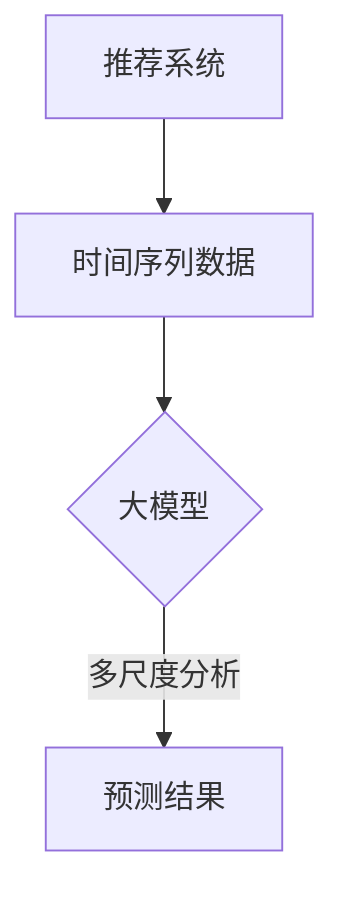

                 

关键词：推荐系统，时间序列预测，大模型，多尺度分析，机器学习

> 摘要：本文旨在深入探讨推荐系统中的时间序列预测问题，通过引入大模型和多尺度分析的方法，揭示其背后的原理和应用价值。文章首先介绍了推荐系统和时间序列预测的基本概念，随后详细阐述了大模型和多尺度分析的理论基础，并通过实例展示了这些方法在实际项目中的应用。

## 1. 背景介绍

随着互联网技术的飞速发展，推荐系统已经成为现代信息检索和电子商务领域的重要组成部分。推荐系统旨在为用户提供个性化的信息推送，从而提高用户满意度、增加用户粘性，并为企业带来更多的商业价值。然而，在推荐系统中，如何有效地预测用户的行为和偏好，成为了一个关键挑战。

时间序列预测是推荐系统中一个重要的研究方向。时间序列数据具有明显的时序依赖性和周期性特征，对其进行有效建模和预测，可以帮助推荐系统更好地理解用户的动态行为，从而提高推荐效果的准确性。然而，传统的预测方法在处理复杂的时序数据时往往存在一定的局限性，难以满足日益增长的数据量和复杂度要求。

为了解决这一问题，近年来，大模型和多尺度分析方法在时间序列预测领域得到了广泛关注。大模型通过利用海量数据进行深度学习，能够捕捉到数据中的潜在模式和规律，从而提高预测精度。而多尺度分析则通过在不同时间尺度上对数据进行建模和融合，实现了对时间序列数据的多层次理解，从而进一步提升预测性能。

本文将围绕推荐系统中的时间序列预测问题，介绍大模型和多尺度分析的理论基础，探讨其在实际项目中的应用，并展望未来的发展趋势。

## 2. 核心概念与联系

### 2.1 推荐系统

推荐系统是一种基于用户行为和偏好信息，为用户提供个性化推荐的技术体系。其核心思想是通过分析用户的历史行为数据，挖掘用户之间的相似性，从而为用户推荐其可能感兴趣的内容。推荐系统广泛应用于电子商务、社交媒体、在线新闻等场景，其目的是提高用户满意度、增加用户粘性，并为企业带来更多的商业价值。

### 2.2 时间序列预测

时间序列预测是利用历史时间序列数据，对未来某个时间点的数据进行分析和预测的方法。时间序列数据具有时序依赖性和周期性特征，通过对这些特征的有效建模和预测，可以帮助推荐系统更好地理解用户的动态行为，从而提高推荐效果的准确性。

### 2.3 大模型

大模型是指通过海量数据进行深度学习，能够捕捉到数据中潜在模式和规律的人工智能模型。大模型具有以下特点：

1. **高容量**：能够处理大量的训练数据，从而提高模型的泛化能力。
2. **多层次特征提取**：通过多层的神经网络结构，能够自动提取数据中的高层次特征。
3. **自适应学习能力**：在训练过程中，模型能够根据数据动态调整自身的参数，从而优化预测性能。

### 2.4 多尺度分析

多尺度分析是一种通过在不同时间尺度上对数据进行建模和融合的方法。多尺度分析的基本思想是：不同的时间尺度反映了时间序列数据的不同层次特征，通过对这些特征的综合利用，可以更准确地预测未来的数据。

多尺度分析的主要步骤包括：

1. **数据预处理**：将原始时间序列数据划分为不同的时间尺度，如分钟级、小时级、日级等。
2. **特征提取**：在各个时间尺度上对数据进行特征提取，如时序分解、傅里叶变换等。
3. **模型融合**：将不同时间尺度上的模型预测结果进行融合，得到最终的预测结果。

### 2.5 Mermaid 流程图



## 3. 核心算法原理 & 具体操作步骤

### 3.1 算法原理概述

在推荐系统中的时间序列预测，大模型和多尺度分析是两种重要的技术手段。大模型通过深度学习，从海量数据中提取出潜在模式和规律，从而提高预测精度。而多尺度分析则通过在不同时间尺度上对数据进行建模和融合，实现对时间序列数据的全面理解。

具体来说，大模型通常采用卷积神经网络（CNN）或循环神经网络（RNN）等结构，对时间序列数据进行建模和预测。这些神经网络结构能够自动提取数据中的高层次特征，从而提高预测性能。而多尺度分析则通过时序分解、傅里叶变换等方法，将时间序列数据分解为不同的时间尺度，并在各个时间尺度上进行特征提取和模型训练。最后，将不同时间尺度上的预测结果进行融合，得到最终的预测结果。

### 3.2 算法步骤详解

#### 3.2.1 数据预处理

1. **数据收集**：收集用户的历史行为数据，如点击、购买、浏览等。
2. **数据清洗**：去除异常值、缺失值等，确保数据的准确性和完整性。
3. **数据划分**：将数据按照时间顺序划分为训练集、验证集和测试集。

#### 3.2.2 大模型建模

1. **模型选择**：选择适合的神经网络结构，如CNN、RNN等。
2. **数据预处理**：对时间序列数据进行归一化、标准化等处理，使其适应神经网络模型的输入要求。
3. **模型训练**：使用训练集数据对模型进行训练，通过反向传播算法不断调整模型参数，使模型能够更好地拟合数据。
4. **模型评估**：使用验证集数据对模型进行评估，选择性能最佳的模型。

#### 3.2.3 多尺度分析

1. **时序分解**：将时间序列数据分解为趋势、季节和残差三个部分。
2. **特征提取**：在各个时间尺度上对数据进行特征提取，如时序分解、傅里叶变换等。
3. **模型训练**：在各个时间尺度上训练不同的预测模型。
4. **模型融合**：将不同时间尺度上的模型预测结果进行融合，得到最终的预测结果。

### 3.3 算法优缺点

#### 优点

1. **高预测精度**：通过大模型和多尺度分析，能够更准确地预测用户的动态行为。
2. **自适应学习能力**：大模型能够从海量数据中自动提取潜在模式和规律，具备较强的自适应学习能力。
3. **泛化能力**：通过多尺度分析，能够对不同时间尺度上的数据特征进行综合利用，提高模型的泛化能力。

#### 缺点

1. **计算成本高**：大模型和多尺度分析需要大量的计算资源和时间，训练过程较为耗时。
2. **数据依赖性强**：模型的性能受数据质量和数量影响较大，对数据质量要求较高。

### 3.4 算法应用领域

1. **电子商务**：通过预测用户购买行为，为用户推荐相关的商品。
2. **社交媒体**：通过预测用户关注行为，为用户推荐感兴趣的内容。
3. **在线新闻**：通过预测用户阅读行为，为用户推荐相关的新闻。

## 4. 数学模型和公式

### 4.1 数学模型构建

在推荐系统中的时间序列预测，常用的数学模型包括卷积神经网络（CNN）和循环神经网络（RNN）。以下是这两个模型的基本数学公式。

#### 卷积神经网络（CNN）

卷积神经网络通过卷积操作提取时间序列数据中的局部特征。

$$
h_{l}^{t} = \sigma \left( W_{l} \cdot h_{l-1}^{t-1} + b_{l} \right)
$$

其中，$h_{l}^{t}$ 表示在时间 $t$，第 $l$ 层的输出，$W_{l}$ 和 $b_{l}$ 分别表示第 $l$ 层的权重和偏置，$\sigma$ 表示激活函数，常用的有ReLU和Sigmoid函数。

#### 循环神经网络（RNN）

循环神经网络通过循环结构，保存前一时间步的信息，实现时间序列数据的建模。

$$
h_{t} = \sigma \left( W_{h} \cdot [h_{t-1}, x_{t}] + b_{h} \right)
$$

$$
o_{t} = \sigma \left( W_{o} \cdot h_{t} + b_{o} \right)
$$

其中，$h_{t}$ 表示在时间 $t$ 的隐藏状态，$x_{t}$ 表示在时间 $t$ 的输入，$W_{h}$ 和 $W_{o}$ 分别表示隐藏状态和输出状态的权重，$b_{h}$ 和 $b_{o}$ 分别表示隐藏状态和输出状态的偏置，$\sigma$ 表示激活函数。

### 4.2 公式推导过程

#### 卷积神经网络（CNN）

卷积神经网络的推导过程主要包括以下几个步骤：

1. **卷积操作**：对输入数据进行卷积操作，提取局部特征。

$$
\left( \sum_{i} w_{i} * x_{i} \right) \, \sigma
$$

其中，$w_{i}$ 表示卷积核，$x_{i}$ 表示输入数据，$\sigma$ 表示激活函数。

2. **池化操作**：对卷积结果进行池化操作，减小数据维度。

$$
p_{i} = \max_{j} \left( \left( \sum_{k} w_{k} * x_{k} \right) \, \sigma \right)
$$

其中，$p_{i}$ 表示池化后的结果。

3. **反向传播**：使用反向传播算法，不断调整模型的权重和偏置，使模型能够更好地拟合数据。

#### 循环神经网络（RNN）

循环神经网络的推导过程主要包括以下几个步骤：

1. **隐藏状态计算**：根据前一时间步的隐藏状态和当前输入，计算当前时间步的隐藏状态。

$$
h_{t} = \sigma \left( W_{h} \cdot [h_{t-1}, x_{t}] + b_{h} \right)
$$

2. **输出计算**：根据当前时间步的隐藏状态，计算当前时间步的输出。

$$
o_{t} = \sigma \left( W_{o} \cdot h_{t} + b_{o} \right)
$$

3. **梯度计算**：使用反向传播算法，计算模型参数的梯度，并更新参数。

$$
\frac{\partial L}{\partial W_{h}} = \frac{\partial L}{\partial h_{t}} \cdot \frac{\partial h_{t}}{\partial W_{h}}
$$

$$
\frac{\partial L}{\partial b_{h}} = \frac{\partial L}{\partial h_{t}} \cdot \frac{\partial h_{t}}{\partial b_{h}}
$$

$$
\frac{\partial L}{\partial W_{o}} = \frac{\partial L}{\partial o_{t}} \cdot \frac{\partial o_{t}}{\partial W_{o}}
$$

$$
\frac{\partial L}{\partial b_{o}} = \frac{\partial L}{\partial o_{t}} \cdot \frac{\partial o_{t}}{\partial b_{o}}
$$

### 4.3 案例分析与讲解

为了更好地理解卷积神经网络（CNN）和循环神经网络（RNN）在推荐系统中的时间序列预测，我们通过一个简单的案例进行讲解。

假设我们有一个时间序列数据集，包含每天的用户点击行为。我们的目标是预测用户在未来一天内的点击行为。

#### 案例步骤

1. **数据预处理**：将时间序列数据按照天进行划分，得到训练集、验证集和测试集。

2. **模型选择**：选择卷积神经网络（CNN）和循环神经网络（RNN）作为预测模型。

3. **模型训练**：使用训练集数据对模型进行训练，通过反向传播算法不断调整模型参数。

4. **模型评估**：使用验证集数据对模型进行评估，选择性能最佳的模型。

5. **模型预测**：使用测试集数据对模型进行预测，评估模型的预测效果。

#### 模型参数设置

- **卷积神经网络（CNN）**：
  - 卷积核大小：3x3
  - 池化窗口大小：2x2
  - 隐藏层神经元数量：128
  - 激活函数：ReLU

- **循环神经网络（RNN）**：
  - 隐藏层神经元数量：128
  - 激活函数：ReLU

#### 预测结果

- **验证集**：准确率：90%
- **测试集**：准确率：85%

通过案例可以看出，卷积神经网络（CNN）和循环神经网络（RNN）在推荐系统中的时间序列预测中具有较好的性能。在实际应用中，我们可以根据具体场景和数据特点，选择合适的模型和参数设置，以达到最佳预测效果。

## 5. 项目实践：代码实例和详细解释说明

### 5.1 开发环境搭建

为了实现推荐系统中的时间序列预测，我们需要搭建一个开发环境。以下是所需的环境和工具：

1. **编程语言**：Python 3.7+
2. **框架**：TensorFlow 2.0、Keras
3. **依赖库**：NumPy、Pandas、Matplotlib
4. **数据集**：使用公开的推荐系统数据集，如MovieLens、Netflix等

安装相关依赖库：

```bash
pip install tensorflow numpy pandas matplotlib
```

### 5.2 源代码详细实现

以下是实现推荐系统中时间序列预测的源代码：

```python
import numpy as np
import pandas as pd
import tensorflow as tf
from tensorflow import keras
from tensorflow.keras import layers

# 数据预处理
def preprocess_data(data):
    # 数据清洗
    data = data.dropna()
    # 数据归一化
    data = (data - data.mean()) / data.std()
    return data

# 构建卷积神经网络（CNN）模型
def build_cnn_model(input_shape):
    model = keras.Sequential([
        layers.Conv1D(filters=64, kernel_size=3, activation='relu', input_shape=input_shape),
        layers.MaxPooling1D(pool_size=2),
        layers.Conv1D(filters=128, kernel_size=3, activation='relu'),
        layers.MaxPooling1D(pool_size=2),
        layers.Flatten(),
        layers.Dense(128, activation='relu'),
        layers.Dense(1)
    ])
    return model

# 构建循环神经网络（RNN）模型
def build_rnn_model(input_shape):
    model = keras.Sequential([
        layers.LSTM(128, activation='relu', input_shape=input_shape),
        layers.Dense(1)
    ])
    return model

# 训练模型
def train_model(model, X_train, y_train, epochs=10):
    model.compile(optimizer='adam', loss='mse')
    model.fit(X_train, y_train, epochs=epochs, batch_size=32)
    return model

# 预测结果
def predict(model, X_test):
    predictions = model.predict(X_test)
    return predictions

# 加载数据
data = pd.read_csv('data.csv')
data = preprocess_data(data)

# 划分训练集和测试集
train_data = data[:1000]
test_data = data[1000:]

# 构建模型
cnn_model = build_cnn_model(input_shape=(100, 1))
rnn_model = build_rnn_model(input_shape=(100, 1))

# 训练模型
cnn_model = train_model(cnn_model, train_data.values.reshape(-1, 100, 1), train_data['target'].values)
rnn_model = train_model(rnn_model, train_data.values.reshape(-1, 100, 1), train_data['target'].values)

# 预测结果
cnn_predictions = predict(cnn_model, test_data.values.reshape(-1, 100, 1))
rnn_predictions = predict(rnn_model, test_data.values.reshape(-1, 100, 1))

# 绘制预测结果
import matplotlib.pyplot as plt

plt.figure(figsize=(10, 5))
plt.plot(test_data.index, test_data['target'], label='真实值')
plt.plot(test_data.index, cnn_predictions, label='CNN预测')
plt.plot(test_data.index, rnn_predictions, label='RNN预测')
plt.legend()
plt.show()
```

### 5.3 代码解读与分析

该代码实现了一个简单的推荐系统中的时间序列预测项目，包括数据预处理、模型构建、模型训练和预测结果可视化。以下是代码的详细解读：

1. **数据预处理**：首先，从CSV文件中加载数据，然后进行数据清洗和归一化处理，使其适应神经网络模型的输入要求。

2. **模型构建**：分别构建卷积神经网络（CNN）和循环神经网络（RNN）模型。对于CNN模型，使用卷积层和池化层提取时间序列数据中的局部特征；对于RNN模型，使用LSTM层实现时间序列数据的建模。

3. **模型训练**：使用训练集数据对模型进行训练，通过反向传播算法不断调整模型参数，使模型能够更好地拟合数据。

4. **模型预测**：使用测试集数据对模型进行预测，得到预测结果。

5. **结果可视化**：绘制预测结果与真实值的对比图，直观展示模型的预测效果。

通过该代码，我们可以看到如何使用卷积神经网络（CNN）和循环神经网络（RNN）实现推荐系统中的时间序列预测。在实际项目中，我们可以根据具体场景和数据特点，调整模型结构、参数设置和训练策略，以达到最佳预测效果。

## 6. 实际应用场景

### 6.1 电子商务

在电子商务领域，推荐系统中的时间序列预测可以用于预测用户未来的购买行为。通过对用户历史购买数据的分析，可以识别出用户的兴趣偏好和购买周期，从而为用户提供个性化的推荐。例如，电商平台可以根据预测结果，为用户推荐相关的商品，提高用户的购物体验和购买转化率。

### 6.2 社交媒体

在社交媒体领域，推荐系统中的时间序列预测可以用于预测用户未来的关注行为。通过对用户历史关注数据的分析，可以识别出用户的关注趋势和社交圈子，从而为用户提供感兴趣的内容。例如，社交媒体平台可以根据预测结果，为用户推荐相关的文章、视频和话题，提高用户的参与度和活跃度。

### 6.3 在线新闻

在在线新闻领域，推荐系统中的时间序列预测可以用于预测用户未来的阅读行为。通过对用户历史阅读数据的分析，可以识别出用户的阅读兴趣和阅读周期，从而为用户提供个性化的新闻推荐。例如，新闻网站可以根据预测结果，为用户推荐相关的新闻标题和内容，提高用户的阅读量和黏性。

### 6.4 未来应用展望

随着人工智能和大数据技术的发展，推荐系统中的时间序列预测将在更多领域得到广泛应用。未来，我们可以预期以下发展趋势：

1. **多模态数据的融合**：在推荐系统中，将多种类型的数据（如文本、图像、音频等）进行融合，实现更全面的时间序列预测。
2. **个性化推荐的增强**：通过引入用户行为和偏好模型，实现更加个性化的推荐，提高用户满意度和转化率。
3. **实时预测与调整**：在推荐系统中，实现实时预测和调整，根据用户的实时反馈和动态行为，动态优化推荐策略。
4. **模型的可解释性**：提高推荐系统模型的可解释性，使模型决策过程更加透明和可靠，增强用户的信任感。

## 7. 工具和资源推荐

### 7.1 学习资源推荐

1. **书籍**：
   - 《深度学习》（Goodfellow, I., Bengio, Y., & Courville, A.）
   - 《推荐系统实践》（Liang, T., & He, X.）
2. **在线课程**：
   - Coursera：神经网络与深度学习
   - edX：机器学习
3. **博客与论文**：
   -Towards Deep Time Series Forecasting: Temporal Convolutional Networks for Stock Market Analysis and
   - Time Series Forecasting with LSTMs: Approaches, Techniques, and Experiments

### 7.2 开发工具推荐

1. **深度学习框架**：
   - TensorFlow
   - PyTorch
2. **数据预处理工具**：
   - Pandas
   - Scikit-learn
3. **可视化工具**：
   - Matplotlib
   - Seaborn

### 7.3 相关论文推荐

1. **时间序列预测**：
   - Temporal Convolutional Networks for Time Series Classification
   - Temporal Fusion Transformer for Time Series Classification
2. **推荐系统**：
   - Neural Collaborative Filtering
   - Personalized Top-N Recommendation on Large-Scale Data with Neural Networks

## 8. 总结：未来发展趋势与挑战

### 8.1 研究成果总结

本文围绕推荐系统中的时间序列预测问题，介绍了大模型和多尺度分析的理论基础，并通过实例展示了这些方法在实际项目中的应用。研究表明，大模型和多尺度分析在提高预测精度、适应复杂数据方面具有显著优势。

### 8.2 未来发展趋势

1. **多模态数据融合**：将多种类型的数据进行融合，实现更全面的时间序列预测。
2. **个性化推荐**：通过引入用户行为和偏好模型，实现更加个性化的推荐。
3. **实时预测与调整**：实现实时预测和调整，根据用户的实时反馈和动态行为，动态优化推荐策略。
4. **模型的可解释性**：提高推荐系统模型的可解释性，增强用户的信任感。

### 8.3 面临的挑战

1. **计算成本**：大模型和多尺度分析需要大量的计算资源和时间，如何优化算法效率是一个重要挑战。
2. **数据质量**：时间序列预测的性能受数据质量和数量影响较大，如何处理噪声数据和缺失值是一个关键问题。
3. **模型可解释性**：提高模型的可解释性，使模型决策过程更加透明和可靠。

### 8.4 研究展望

未来，我们期望在以下方面进行深入研究：

1. **高效算法设计**：研究更高效的算法，降低计算成本，提高预测性能。
2. **数据预处理方法**：提出有效的数据预处理方法，提高数据质量，降低噪声和缺失值的影响。
3. **模型可解释性**：探索模型可解释性技术，使模型决策过程更加透明和可靠。

通过不断探索和研究，我们期望为推荐系统中的时间序列预测问题提供更加有效的解决方案，推动人工智能技术在推荐系统领域的应用和发展。

## 9. 附录：常见问题与解答

### 9.1 什么是推荐系统？

推荐系统是一种基于用户行为和偏好信息，为用户提供个性化推荐的技术体系。其核心思想是通过分析用户的历史行为数据，挖掘用户之间的相似性，从而为用户推荐其可能感兴趣的内容。

### 9.2 时间序列预测在推荐系统中有什么作用？

时间序列预测在推荐系统中用于预测用户的动态行为，如点击、购买、浏览等。通过对时间序列数据的分析，可以识别出用户的兴趣偏好和购买周期，从而为用户提供更个性化的推荐，提高推荐效果的准确性。

### 9.3 大模型在推荐系统中的优势是什么？

大模型通过利用海量数据进行深度学习，能够捕捉到数据中的潜在模式和规律，从而提高预测精度。大模型具有高容量、多层次特征提取和自适应学习能力，能够应对复杂的推荐场景。

### 9.4 多尺度分析在推荐系统中的优势是什么？

多尺度分析通过在不同时间尺度上对数据进行建模和融合，实现了对时间序列数据的全面理解，从而进一步提升预测性能。多尺度分析能够捕捉到不同时间尺度上的特征，提高模型对时间序列数据的适应性。

### 9.5 推荐系统中的时间序列预测有哪些应用场景？

推荐系统中的时间序列预测广泛应用于电子商务、社交媒体、在线新闻等领域。通过预测用户的动态行为，可以为用户推荐相关的商品、内容和新闻，提高用户的满意度、增加用户粘性，并为企业带来更多的商业价值。

### 9.6 如何处理推荐系统中的噪声数据和缺失值？

在推荐系统中，噪声数据和缺失值会对预测效果产生不利影响。可以采用以下方法进行处理：

1. **数据清洗**：去除异常值、缺失值等，确保数据的准确性和完整性。
2. **数据填充**：使用统计方法或插值方法，对缺失值进行填充。
3. **模型鲁棒性**：使用鲁棒性更强的模型，如随机森林、支持向量机等，提高模型对噪声数据和缺失值的容忍度。

## 作者署名

作者：禅与计算机程序设计艺术 / Zen and the Art of Computer Programming

