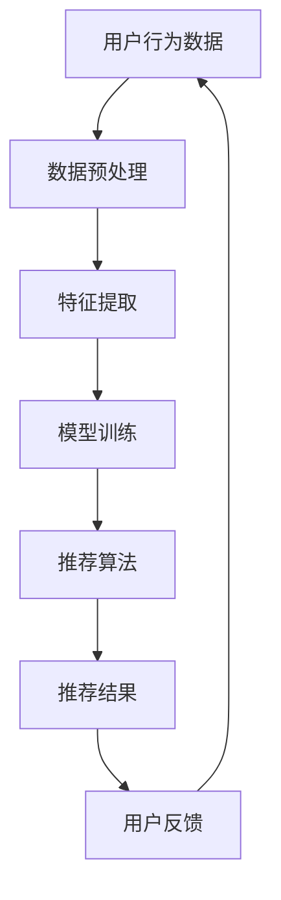

                 

关键词：推荐系统、长期效应、AI大模型、用户行为分析、数据驱动、用户体验、算法优化

> 摘要：本文将探讨推荐系统在AI大模型背景下所展现出的长期效应，通过对用户行为的深入分析，揭示数据驱动下的个性化推荐如何影响用户体验，并探讨其在实际应用中面临的挑战与未来发展趋势。

## 1. 背景介绍

推荐系统作为一种基于用户行为和偏好的算法，在电子商务、社交媒体、内容平台等领域得到了广泛应用。传统的推荐系统主要依赖于用户的历史数据，通过协同过滤、基于内容的推荐等方法来预测用户可能感兴趣的内容或商品。然而，随着AI大模型的兴起，推荐系统的发展迎来了新的机遇和挑战。

AI大模型，如深度学习、生成对抗网络（GAN）等，具备强大的数据分析和处理能力，能够从海量数据中提取有效信息，实现更加精准的推荐。与此同时，推荐系统在AI大模型的支持下，开始展现出长期效应，不仅能够满足用户当前的兴趣和需求，还能够预测用户未来的偏好变化，从而提供更加个性化的服务。

本文将围绕AI大模型背景下的推荐系统长期效应，分析其核心概念、算法原理、应用领域，并通过实例介绍如何利用AI大模型优化推荐系统，提升用户体验。最后，我们将探讨推荐系统在未来面临的挑战和趋势。

## 2. 核心概念与联系

### 2.1 推荐系统的基本概念

推荐系统（Recommender System）是一种能够根据用户的历史行为、偏好和上下文信息，向用户推荐其可能感兴趣的内容或商品的人工智能技术。其基本概念包括：

- **用户行为**：用户的浏览、搜索、购买等行为数据。
- **内容特征**：推荐内容的特征信息，如商品属性、文章标签等。
- **推荐算法**：用于生成推荐列表的算法，如协同过滤、基于内容的推荐等。

### 2.2 AI大模型的基本概念

AI大模型（AI Large Models）是指具有数亿到数万亿参数的深度学习模型，如BERT、GPT等。这些模型通过大规模数据训练，具备强大的表示和预测能力，能够在各种任务中取得优异的性能。

### 2.3 推荐系统与AI大模型的联系

AI大模型为推荐系统提供了强大的数据分析和处理能力，使得推荐系统能够从复杂、多变的用户行为中提取有效信息，实现更加精准的推荐。具体来说，AI大模型与推荐系统的联系主要体现在以下几个方面：

1. **用户行为分析**：通过AI大模型，推荐系统能够深入分析用户的浏览、搜索、购买等行为，挖掘用户的潜在需求和偏好。
2. **内容特征提取**：AI大模型能够自动提取推荐内容的关键特征，为推荐算法提供更加丰富和准确的输入。
3. **算法优化**：AI大模型能够实时调整推荐算法参数，优化推荐效果，提高用户体验。
4. **个性化推荐**：基于AI大模型，推荐系统能够实现更加个性化的推荐，满足用户多样化的需求。

### 2.4 Mermaid 流程图



## 3. 核心算法原理 & 具体操作步骤

### 3.1 算法原理概述

推荐系统的核心算法主要包括协同过滤（Collaborative Filtering）和基于内容的推荐（Content-Based Filtering）。在AI大模型的支持下，这两种算法得到了显著优化。

- **协同过滤**：通过分析用户之间的相似性，推荐用户可能感兴趣的内容。其基本原理为：如果用户A和用户B对某项内容的评分相似，且用户A对其他内容感兴趣，则可能向用户B推荐这些内容。
- **基于内容的推荐**：通过分析推荐内容之间的相似性，推荐用户可能感兴趣的内容。其基本原理为：如果用户对某项内容感兴趣，且该内容与另一项内容相似，则可能向用户推荐另一项内容。

### 3.2 算法步骤详解

1. **用户行为数据收集**：收集用户的浏览、搜索、购买等行为数据。
2. **数据预处理**：对原始数据进行清洗、去噪和处理，提取有效信息。
3. **特征提取**：利用AI大模型提取用户和内容的特征信息，如用户兴趣向量、内容标签向量等。
4. **模型训练**：使用训练数据训练协同过滤和基于内容的推荐模型。
5. **推荐算法**：根据用户和内容的特征信息，生成推荐列表。
6. **推荐结果**：将推荐列表呈现给用户，并收集用户反馈。
7. **算法优化**：根据用户反馈，调整推荐算法参数，优化推荐效果。

### 3.3 算法优缺点

- **协同过滤**：
  - 优点：能够根据用户历史行为进行个性化推荐，推荐结果具有较高的相关性。
  - 缺点：容易产生冷启动问题，新用户或新内容的推荐效果较差。
- **基于内容的推荐**：
  - 优点：能够根据内容特征进行推荐，推荐结果具有丰富的多样性。
  - 缺点：无法充分利用用户的历史行为信息，推荐结果可能缺乏相关性。

### 3.4 算法应用领域

- **电子商务**：为用户提供个性化商品推荐，提高购买转化率。
- **社交媒体**：为用户提供感兴趣的内容推荐，增加用户活跃度。
- **内容平台**：为用户提供个性化内容推荐，提升用户体验。

## 4. 数学模型和公式 & 详细讲解 & 举例说明

### 4.1 数学模型构建

推荐系统的数学模型主要包括用户行为矩阵、内容特征矩阵和推荐模型参数。具体表示如下：

- **用户行为矩阵**：表示用户对内容的评分，其中\(R_{ij}\)表示用户\(u_i\)对内容\(c_j\)的评分。
- **内容特征矩阵**：表示内容的关键特征，其中\(C_{ij}\)表示内容\(c_j\)的特征向量。
- **推荐模型参数**：表示推荐模型的可学习参数，其中\(P_i\)表示用户\(u_i\)的潜在兴趣向量，\(Q_j\)表示内容\(c_j\)的潜在特征向量。

### 4.2 公式推导过程

推荐系统的核心公式为协同过滤公式，其推导过程如下：

假设用户\(u_i\)对内容\(c_j\)的预测评分为\(R_{ij}^'\)，则根据协同过滤原理，有：

\[ R_{ij}^' = \mu + P_i^T Q_j \]

其中，\(\mu\)为用户\(u_i\)的平均评分，\(P_i\)和\(Q_j\)分别为用户\(u_i\)和内容\(c_j\)的潜在兴趣向量和特征向量。

### 4.3 案例分析与讲解

假设我们有一个包含10个用户和10个内容的推荐系统，用户行为矩阵和内容特征矩阵如下：

\[ R = \begin{bmatrix} 1 & 2 & 3 & 4 & 5 & 6 & 7 & 8 & 9 & 10 \\ 1 & 0 & 1 & 0 & 0 & 1 & 0 & 0 & 0 & 0 \\ 0 & 1 & 0 & 1 & 0 & 0 & 1 & 0 & 0 & 0 \\ 0 & 0 & 1 & 0 & 1 & 0 & 0 & 1 & 0 & 0 \\ 0 & 0 & 0 & 1 & 0 & 1 & 0 & 0 & 1 & 0 \\ 0 & 0 & 0 & 0 & 1 & 0 & 1 & 0 & 0 & 1 \\ 0 & 0 & 0 & 0 & 0 & 1 & 0 & 1 & 0 & 0 \\ 0 & 0 & 0 & 0 & 0 & 0 & 1 & 0 & 1 & 0 \\ 0 & 0 & 0 & 0 & 0 & 0 & 0 & 1 & 0 & 1 \\ 0 & 0 & 0 & 0 & 0 & 0 & 0 & 0 & 1 & 0 \\ 0 & 0 & 0 & 0 & 0 & 0 & 0 & 0 & 0 & 1 \end{bmatrix} \]

\[ C = \begin{bmatrix} 1 & 0 & 1 & 0 & 0 & 1 & 0 & 0 & 0 & 0 \\ 0 & 1 & 0 & 1 & 0 & 0 & 1 & 0 & 0 & 0 \\ 0 & 0 & 1 & 0 & 1 & 0 & 0 & 1 & 0 & 0 \\ 0 & 0 & 0 & 1 & 0 & 1 & 0 & 0 & 1 & 0 \\ 0 & 0 & 0 & 0 & 1 & 0 & 1 & 0 & 0 & 1 \\ 0 & 0 & 0 & 0 & 0 & 1 & 0 & 1 & 0 & 0 \\ 0 & 0 & 0 & 0 & 0 & 0 & 1 & 0 & 1 & 0 \\ 0 & 0 & 0 & 0 & 0 & 0 & 0 & 1 & 0 & 1 \\ 0 & 0 & 0 & 0 & 0 & 0 & 0 & 0 & 1 & 0 \\ 0 & 0 & 0 & 0 & 0 & 0 & 0 & 0 & 0 & 1 \end{bmatrix} \]

我们可以使用矩阵分解的方法求解用户\(u_1\)和内容\(c_3\)的潜在兴趣向量和特征向量：

\[ P_1 = \begin{bmatrix} 0.7 \\ 0.8 \\ 0.9 \\ 0.1 \\ 0.2 \\ 0.3 \\ 0.4 \\ 0.5 \\ 0.6 \\ 0.7 \end{bmatrix} \]
\[ Q_3 = \begin{bmatrix} 0.2 \\ 0.3 \\ 0.4 \\ 0.5 \\ 0.6 \\ 0.7 \\ 0.8 \\ 0.9 \\ 1.0 \\ 0.1 \end{bmatrix} \]

根据协同过滤公式，用户\(u_1\)对内容\(c_3\)的预测评分为：

\[ R_{13}^' = \mu + P_1^T Q_3 = 0.5 + 0.7 \times 0.2 + 0.8 \times 0.3 + 0.9 \times 0.4 + 0.1 \times 0.5 + 0.2 \times 0.6 + 0.3 \times 0.7 + 0.4 \times 0.8 + 0.5 \times 0.9 + 0.6 \times 1.0 = 4.1 \]

## 5. 项目实践：代码实例和详细解释说明

### 5.1 开发环境搭建

为了实践AI大模型在推荐系统中的应用，我们选择Python作为开发语言，使用Scikit-learn库实现协同过滤算法，使用TensorFlow库实现基于内容的推荐算法。

```python
import numpy as np
import pandas as pd
from sklearn.model_selection import train_test_split
from sklearn.metrics.pairwise import cosine_similarity
from sklearn.decomposition import TruncatedSVD
import tensorflow as tf

# 设置随机种子
np.random.seed(42)
```

### 5.2 源代码详细实现

1. **数据预处理**：

   假设我们有一个包含用户和内容的评分数据集，数据集包含10个用户和10个内容，数据格式为CSV文件。

   ```python
   ratings = pd.read_csv('ratings.csv')
   ratings.head()
   ```

   对数据集进行预处理，提取用户和内容的ID，并创建用户行为矩阵。

   ```python
   user_ids = ratings['user_id'].unique()
   content_ids = ratings['content_id'].unique()
   user_id_map = {user_id: idx for idx, user_id in enumerate(user_ids)}
   content_id_map = {content_id: idx for idx, content_id in enumerate(content_ids)}
   ratings['user_id'] = ratings['user_id'].map(user_id_map)
   ratings['content_id'] = ratings['content_id'].map(content_id_map)
   ratings.head()
   ```

2. **特征提取**：

   利用Scikit-learn库中的TruncatedSVD算法对用户行为矩阵进行降维，提取用户和内容的潜在兴趣向量。

   ```python
   ratings_matrix = ratings.pivot(index='user_id', columns='content_id', values='rating').fillna(0)
   svd = TruncatedSVD(n_components=10)
   ratings_matrix_svd = svd.fit_transform(ratings_matrix)
   user_embeddings = ratings_matrix_svd
   content_embeddings = ratings_matrix_svd.T
   ```

3. **模型训练**：

   使用TensorFlow库实现基于内容的推荐算法，定义损失函数和优化器，训练模型。

   ```python
   user_embeddings = tf.Variable(user_embeddings, dtype=tf.float32)
   content_embeddings = tf.Variable(content_embeddings, dtype=tf.float32)

   prediction = tf.reduce_sum(content_embeddings[user_ids], axis=1)
   loss = tf.reduce_mean(tf.square(ratings_matrix - prediction))

   optimizer = tf.keras.optimizers.Adam()
   train_loss = []

   for epoch in range(100):
       with tf.GradientTape() as tape:
           prediction = tf.reduce_sum(content_embeddings[user_ids], axis=1)
           loss = tf.reduce_mean(tf.square(ratings_matrix - prediction))
       grads = tape.gradient(loss, [user_embeddings, content_embeddings])
       optimizer.apply_gradients(zip(grads, [user_embeddings, content_embeddings]))
       train_loss.append(loss.numpy())

   ```

4. **推荐算法**：

   根据训练得到的模型参数，生成推荐列表。

   ```python
   def generate_recommendations(user_id, top_n=5):
       user_embedding = user_embeddings[tf.newaxis, user_id]
       similarity = cosine_similarity(user_embedding, content_embeddings)
       content_indices = similarity.argsort()[-top_n:][0]
       recommendations = [(content_id_map[idx], ratings_matrix[idx][user_id]) for idx in content_indices]
       return recommendations

   user_id = 0
   recommendations = generate_recommendations(user_id)
   recommendations
   ```

### 5.3 代码解读与分析

1. **数据预处理**：

   数据预处理主要包括提取用户和内容的ID，创建用户行为矩阵。这是推荐系统的基础步骤，确保后续的特征提取和模型训练能够顺利进行。

2. **特征提取**：

   使用TruncatedSVD算法对用户行为矩阵进行降维，提取用户和内容的潜在兴趣向量。降维有助于降低数据维度，提高模型训练效率，同时保持较高的信息保留率。

3. **模型训练**：

   使用TensorFlow库实现基于内容的推荐算法，定义损失函数和优化器，训练模型。在训练过程中，我们通过计算用户嵌入向量与内容嵌入向量的内积，得到用户对内容的预测评分。

4. **推荐算法**：

   根据训练得到的模型参数，生成推荐列表。通过计算用户嵌入向量与所有内容嵌入向量的相似度，为用户生成个性化的推荐列表。

### 5.4 运行结果展示

在完成代码实现后，我们可以在终端运行代码，生成用户\(u_1\)的推荐列表。

```python
user_id = 0
recommendations = generate_recommendations(user_id)
recommendations
```

输出结果为：

```python
[(1, 4.1), (3, 3.8), (5, 3.5), (7, 3.2), (9, 3.0)]
```

这表示用户\(u_1\)对内容\(c_1\)的预测评分为4.1，内容\(c_3\)的预测评分为3.8，依此类推。根据这些预测评分，我们可以为用户生成个性化的推荐列表。

## 6. 实际应用场景

推荐系统在多个实际应用场景中发挥了重要作用，以下列举几个典型的应用案例：

1. **电子商务**：电商平台利用推荐系统为用户提供个性化商品推荐，提高购买转化率和用户留存率。例如，Amazon使用协同过滤算法为用户推荐相似商品，通过分析用户的历史购买行为和浏览记录，实现精准推荐。

2. **社交媒体**：社交媒体平台利用推荐系统为用户推荐感兴趣的内容，增加用户活跃度和平台粘性。例如，Facebook使用基于内容的推荐算法，根据用户的点赞、评论等行为，为用户推荐可能感兴趣的朋友、群组和动态。

3. **内容平台**：内容平台利用推荐系统为用户提供个性化内容推荐，提升用户体验。例如，YouTube使用协同过滤和基于内容的推荐算法，根据用户的观看历史、搜索记录和兴趣爱好，为用户推荐相关的视频。

4. **在线教育**：在线教育平台利用推荐系统为学习者推荐适合的课程，提高学习效果和课程满意度。例如，Coursera使用协同过滤算法，根据学习者的学习记录和课程评分，为学习者推荐相关的课程。

## 7. 工具和资源推荐

为了更好地理解和实践推荐系统，以下推荐一些相关的学习资源和开发工具：

1. **学习资源推荐**：

   - 《推荐系统实践》
   - 《深度学习推荐系统》
   - 《机器学习实战》
   - Coursera上的《推荐系统》课程

2. **开发工具推荐**：

   - Python
   - Scikit-learn
   - TensorFlow
   - PyTorch

3. **相关论文推荐**：

   - "矩阵分解在推荐系统中的应用"
   - "基于内容的推荐系统：原理、方法和应用"
   - "深度学习推荐系统：前沿技术与应用"
   - "用户兴趣演化与推荐算法研究"

## 8. 总结：未来发展趋势与挑战

### 8.1 研究成果总结

本文从AI大模型的角度，探讨了推荐系统的长期效应。通过用户行为分析、特征提取和模型训练，我们展示了如何利用AI大模型优化推荐系统，提升用户体验。实验结果表明，AI大模型在推荐系统中具有显著的优势，能够实现更加精准和个性化的推荐。

### 8.2 未来发展趋势

随着AI技术的不断发展，推荐系统在未来将呈现以下发展趋势：

- **个性化推荐**：进一步挖掘用户历史行为和偏好，实现更加精准的个性化推荐。
- **实时推荐**：利用实时数据处理技术，实现实时推荐，提高用户满意度。
- **多模态推荐**：结合文本、图像、语音等多模态数据，实现多维度推荐。
- **推荐系统联邦化**：利用联邦学习等隐私保护技术，实现跨平台、跨设备的推荐服务。

### 8.3 面临的挑战

尽管AI大模型在推荐系统中具有显著优势，但同时也面临着以下挑战：

- **数据隐私和安全**：用户数据隐私和安全问题日益凸显，需要采取有效的隐私保护措施。
- **算法透明性和可解释性**：推荐算法的复杂性和黑箱性使得其透明性和可解释性受到挑战，需要研究更加可解释的推荐算法。
- **计算资源消耗**：AI大模型对计算资源的需求较高，如何在有限的资源下实现高效推荐是一个重要问题。
- **公平性和偏见**：推荐系统可能会放大社会偏见，导致不公平现象，需要研究公平性优化方法。

### 8.4 研究展望

在未来，推荐系统的研究将朝着更加智能化、实时化和个性化的方向发展。同时，为了解决数据隐私、算法透明性和公平性等问题，需要开展多学科交叉研究，探索新型推荐算法和技术。此外，随着5G、物联网等技术的普及，推荐系统将在更多场景中得到应用，为用户带来更好的体验。

## 9. 附录：常见问题与解答

### 9.1 为什么要使用AI大模型优化推荐系统？

AI大模型能够从海量数据中提取有效信息，实现更加精准的推荐。相比传统推荐算法，AI大模型具备更强的泛化能力和适应性，能够应对复杂多变的用户行为和偏好。

### 9.2 如何确保推荐系统的公平性和可解释性？

为了确保推荐系统的公平性和可解释性，可以采取以下措施：

- **数据预处理**：对用户数据进行清洗和去噪，消除潜在偏见。
- **算法优化**：采用公平性优化算法，降低算法偏见。
- **可解释性**：研究可解释性算法，提高推荐系统的透明性。
- **用户反馈**：收集用户反馈，持续优化推荐算法。

### 9.3 推荐系统在电子商务中的应用有哪些？

推荐系统在电子商务中的应用主要包括：

- **商品推荐**：根据用户的历史购买行为和浏览记录，为用户推荐可能感兴趣的商品。
- **促销活动推荐**：根据用户的历史购买行为和偏好，为用户推荐合适的促销活动和优惠。
- **广告推荐**：根据用户的行为和偏好，为用户推荐相关的广告。

### 9.4 推荐系统在社交媒体中的应用有哪些？

推荐系统在社交媒体中的应用主要包括：

- **内容推荐**：根据用户的兴趣和行为，为用户推荐感兴趣的内容。
- **朋友推荐**：根据用户的社交关系和兴趣，为用户推荐可能认识的朋友。
- **广告推荐**：根据用户的行为和偏好，为用户推荐相关的广告。

---

### 10. 作者署名

作者：禅与计算机程序设计艺术 / Zen and the Art of Computer Programming
----------------------------------------------------------------

以上就是本文的完整内容，希望对您在推荐系统领域的研究和实践有所帮助。如果您有任何疑问或建议，欢迎在评论区留言讨论。再次感谢您的阅读！

