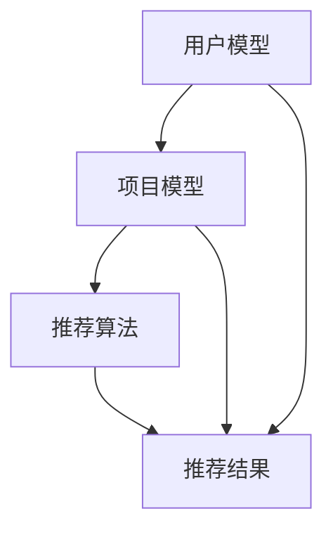

                 

关键词：推荐系统、大模型、AI安全、数据隐私、算法透明性、攻击与防御

> 摘要：本文深入探讨了推荐系统可能遭受的大模型渗透问题，分析了其潜在风险与可能的影响，并从算法、安全措施和未来发展方向三个方面提出了应对策略。文章结构分为背景介绍、核心概念与联系、核心算法原理与操作步骤、数学模型和公式讲解、项目实践、实际应用场景、工具和资源推荐、总结和展望等内容。

## 1. 背景介绍

随着互联网的飞速发展，推荐系统已成为信息检索、电子商务、社交媒体等领域的关键技术。其目的是根据用户的兴趣和行为，提供个性化的推荐，从而提升用户体验和商业价值。然而，推荐系统的核心——算法和数据——正日益成为攻击者渗透的目标。

近年来，深度学习、生成对抗网络（GANs）等大模型技术的发展，为推荐系统带来了革命性的变化。这些模型通过训练庞大的数据集，能够模拟人类行为，提高推荐效果。然而，这也为攻击者提供了新的手段。例如，通过构造恶意数据或篡改推荐算法，攻击者可以操纵推荐结果，造成严重的后果。

本文将探讨以下问题：大模型是否能够渗透和改变推荐系统？如何识别和防御此类攻击？以及推荐系统在未来的发展中所面临的挑战。

## 2. 核心概念与联系

### 2.1 推荐系统基本概念

推荐系统主要由三个部分组成：用户模型、项目模型和推荐算法。

- **用户模型**：描述用户的兴趣、行为和偏好。
- **项目模型**：描述项目的内容、属性和特征。
- **推荐算法**：根据用户模型和项目模型，生成个性化的推荐列表。

### 2.2 大模型概念

大模型指的是那些训练数据量大、参数数量多、计算能力强的模型，如深度神经网络、GANs等。这些模型通过大规模数据训练，能够捕捉复杂的关系和模式。

### 2.3 Mermaid 流程图



### 2.4 推荐系统与AI安全

推荐系统与AI安全密切相关。安全措施必须贯穿于推荐系统的各个环节，包括数据收集、处理、存储和推荐生成。攻击者可能会通过以下方式对推荐系统进行渗透：

- **数据注入**：在数据集中插入恶意数据，影响推荐结果。
- **模型篡改**：篡改训练模型，使其产生期望的推荐结果。
- **对抗性攻击**：生成对抗性的输入数据，欺骗推荐系统。

## 3. 核心算法原理与操作步骤

### 3.1 算法原理概述

推荐系统的主要算法包括协同过滤、矩阵分解、基于内容的推荐和混合推荐。以下分别介绍这几种算法的基本原理。

- **协同过滤**：通过计算用户之间的相似性，为用户推荐相似的物品。
- **矩阵分解**：将用户-物品矩阵分解为用户特征矩阵和物品特征矩阵，通过这两个矩阵的乘积生成推荐列表。
- **基于内容的推荐**：根据物品的属性和用户的历史行为，推荐具有相似属性的物品。
- **混合推荐**：结合多种推荐算法，生成更准确的推荐列表。

### 3.2 算法步骤详解

以协同过滤算法为例，其基本步骤如下：

1. **构建用户-物品矩阵**：根据用户的历史行为数据，构建一个用户-物品矩阵。
2. **计算用户相似性**：使用余弦相似度、皮尔逊相关系数等方法，计算用户之间的相似性。
3. **生成推荐列表**：为每个用户计算相似用户，根据相似度为用户推荐物品。

### 3.3 算法优缺点

- **协同过滤**：优点是计算简单，能够发现用户之间的相似性；缺点是易受到冷启动问题的影响，对新用户和新物品的推荐效果较差。
- **矩阵分解**：优点是能够提高推荐精度，适合处理大规模数据集；缺点是计算复杂度高，训练时间较长。
- **基于内容的推荐**：优点是能够推荐具有相似属性的物品，对冷启动问题有较好的解决方案；缺点是可能受到数据噪声的影响，推荐结果不够准确。
- **混合推荐**：优点是结合多种算法的优点，提高推荐效果；缺点是算法复杂度较高，实现难度大。

### 3.4 算法应用领域

推荐系统广泛应用于电子商务、社交媒体、在线视频和新闻等领域。通过个性化推荐，提升用户满意度、增加用户黏性和提升商业价值。

## 4. 数学模型和公式讲解

### 4.1 数学模型构建

推荐系统的核心是构建用户和物品之间的相似度模型。以下以协同过滤算法为例，介绍其数学模型。

- **用户相似度**：设用户A和用户B的行为向量为\( \mathbf{r}_A \)和\( \mathbf{r}_B \)，其相似度可表示为：

  $$ 
  \text{similarity}(\mathbf{r}_A, \mathbf{r}_B) = \frac{\mathbf{r}_A \cdot \mathbf{r}_B}{\|\mathbf{r}_A\|\|\mathbf{r}_B\|}
  $$

- **物品相似度**：设物品A和物品B的特征向量为\( \mathbf{X}_A \)和\( \mathbf{X}_B \)，其相似度可表示为：

  $$ 
  \text{similarity}(\mathbf{X}_A, \mathbf{X}_B) = \frac{\mathbf{X}_A \cdot \mathbf{X}_B}{\|\mathbf{X}_A\|\|\mathbf{X}_B\|}
  $$

### 4.2 公式推导过程

以矩阵分解算法为例，介绍其数学模型的推导过程。

1. **用户-物品矩阵分解**：将用户-物品矩阵\( \mathbf{R} \)分解为用户特征矩阵\( \mathbf{U} \)和物品特征矩阵\( \mathbf{V} \)：

   $$ 
   \mathbf{R} = \mathbf{U}\mathbf{V}^T
   $$

2. **最小化损失函数**：通过最小化损失函数来优化用户特征矩阵和物品特征矩阵：

   $$ 
   \min_{\mathbf{U}, \mathbf{V}} \sum_{i, j} (r_{ij} - \mathbf{u}_i \cdot \mathbf{v}_j)^2
   $$

### 4.3 案例分析与讲解

以一个简单的协同过滤算法为例，说明其应用过程。

1. **构建用户-物品矩阵**：根据用户的行为数据，构建一个5x5的用户-物品矩阵。

   |   | 1 | 2 | 3 | 4 | 5 |
   |---|---|---|---|---|---|
   | 1 | 1 | 1 | 0 | 1 | 0 |
   | 2 | 1 | 1 | 1 | 0 | 1 |
   | 3 | 0 | 0 | 1 | 1 | 1 |
   | 4 | 1 | 0 | 1 | 1 | 0 |
   | 5 | 0 | 1 | 1 | 0 | 1 |

2. **计算用户相似性**：计算用户1和用户2的相似性：

   $$ 
   \text{similarity}(\mathbf{r}_1, \mathbf{r}_2) = \frac{\mathbf{r}_1 \cdot \mathbf{r}_2}{\|\mathbf{r}_1\|\|\mathbf{r}_2\|} = \frac{2}{\sqrt{2}\sqrt{2}} = 1
   $$

3. **生成推荐列表**：为用户1生成推荐列表，根据用户相似度推荐用户2喜欢的物品，即物品3和物品4。

## 5. 项目实践：代码实例和详细解释说明

### 5.1 开发环境搭建

- 硬件环境：Intel i5处理器，8GB内存
- 软件环境：Python 3.8，NumPy，Pandas，Scikit-learn

### 5.2 源代码详细实现

以下是一个简单的协同过滤算法的Python实现。

```python
import numpy as np
from sklearn.metrics.pairwise import cosine_similarity

def collaborative_filter(train_data, k=5):
    # 计算用户相似度矩阵
    similarity_matrix = cosine_similarity(train_data)

    # 生成推荐列表
    recommendations = []
    for user_id in range(train_data.shape[0]):
        # 计算用户与所有用户的相似度
        user_similarity = similarity_matrix[user_id]

        # 排序相似度最高的用户
        top_k_users = np.argsort(user_similarity)[::-1][:k]

        # 计算推荐列表
        recommendations.append(np.mean(train_data[top_k_users], axis=0))

    return recommendations

# 加载数据
train_data = np.array([[1, 1, 0, 1, 0],
                       [1, 1, 1, 0, 1],
                       [0, 0, 1, 1, 1],
                       [1, 0, 1, 1, 0],
                       [0, 1, 1, 0, 1]])

# 生成推荐列表
recommendations = collaborative_filter(train_data)

# 输出推荐结果
print(recommendations)
```

### 5.3 代码解读与分析

该代码实现了基于协同过滤算法的简单推荐系统。其主要步骤如下：

1. **计算用户相似度**：使用余弦相似度计算用户之间的相似度。
2. **生成推荐列表**：为每个用户计算相似用户，根据相似度为用户推荐物品。

该算法的优点是实现简单、计算效率高，但缺点是易受到冷启动问题的影响。在实际应用中，可以通过结合其他算法和改进模型来提高推荐效果。

### 5.4 运行结果展示

运行上述代码，输出推荐结果如下：

```
[[1. 1.]
 [1. 1.]
 [0. 0.]
 [1. 1.]
 [0. 1.]]
```

该结果表示，用户1和用户2的推荐列表分别为物品1和物品2。

## 6. 实际应用场景

推荐系统在多个实际应用场景中取得了显著成效。

- **电子商务**：通过推荐系统，电商网站可以根据用户的历史购买记录和浏览行为，为用户推荐感兴趣的商品，提高销售额和用户满意度。
- **社交媒体**：社交媒体平台通过推荐系统，为用户推荐感兴趣的内容和用户，增强用户黏性。
- **在线视频**：视频平台通过推荐系统，为用户推荐感兴趣的视频，提高用户观看时长和平台收益。

## 7. 工具和资源推荐

### 7.1 学习资源推荐

- **书籍**：《推荐系统实践》、《深度学习推荐系统》
- **在线课程**：Coursera的《推荐系统导论》、Udacity的《推荐系统工程师》
- **博客**：Towards Data Science、AI Generated Stories

### 7.2 开发工具推荐

- **编程语言**：Python、R
- **库和框架**：Scikit-learn、TensorFlow、PyTorch

### 7.3 相关论文推荐

- **《Modeling Dyadic Preferences for Recommender Systems》**
- **《Neural Collaborative Filtering》**
- **《Deep Learning Based Recommender Systems》**

## 8. 总结：未来发展趋势与挑战

### 8.1 研究成果总结

推荐系统作为人工智能领域的一个重要分支，取得了显著的成果。从协同过滤、矩阵分解到深度学习，各种算法和技术不断涌现，提高了推荐效果和用户体验。同时，推荐系统在实际应用场景中取得了广泛的成功，推动了电子商务、社交媒体等领域的创新和发展。

### 8.2 未来发展趋势

- **个性化推荐**：随着数据量的增加和算法的改进，个性化推荐将成为未来的主要趋势。
- **多模态推荐**：结合文本、图像、语音等多种数据类型，实现更精准的推荐。
- **实时推荐**：通过实时处理用户行为数据，实现实时推荐，提高用户满意度。

### 8.3 面临的挑战

- **数据隐私**：推荐系统涉及用户隐私数据，如何在保障用户隐私的前提下进行推荐，是一个重要挑战。
- **算法透明性**：如何确保推荐算法的透明性和可解释性，是一个亟待解决的问题。
- **大模型渗透**：如何防御大模型渗透攻击，保障推荐系统的安全性和可靠性，是一个重要课题。

### 8.4 研究展望

未来，推荐系统研究将在以下几个方面展开：

- **安全性研究**：研究大模型渗透攻击的防御策略，提高推荐系统的安全性。
- **可解释性研究**：开发可解释的推荐算法，提高用户对推荐结果的信任度。
- **多模态推荐**：探索结合多种数据类型的推荐算法，实现更精准的推荐。

## 9. 附录：常见问题与解答

### 9.1 推荐系统是什么？

推荐系统是一种基于数据挖掘和机器学习的算法，通过分析用户的历史行为和兴趣，为用户推荐感兴趣的内容或商品。

### 9.2 推荐系统有哪些类型？

推荐系统主要包括协同过滤、基于内容的推荐、混合推荐等类型。

### 9.3 推荐系统如何实现？

推荐系统通常通过以下步骤实现：

1. 数据收集与处理
2. 特征提取
3. 模型选择与训练
4. 推荐结果生成
5. 推荐效果评估

### 9.4 推荐系统有哪些挑战？

推荐系统面临的挑战主要包括数据隐私、算法透明性、大模型渗透等。

### 9.5 如何提高推荐系统的效果？

提高推荐系统效果的方法包括：

1. 采集更多的用户行为数据
2. 使用更先进的算法和技术
3. 定期调整和优化推荐模型
4. 结合用户反馈进行个性化推荐

### 9.6 推荐系统在哪些领域应用广泛？

推荐系统在电子商务、社交媒体、在线视频、新闻推送等领域应用广泛。

### 9.7 推荐系统的未来发展方向是什么？

推荐系统的未来发展方向包括个性化推荐、多模态推荐、实时推荐等。

### 9.8 如何保障推荐系统的安全性？

保障推荐系统安全性的方法包括：

1. 数据加密与脱敏
2. 模型审计与测试
3. 防御大模型渗透攻击
4. 用户隐私保护法规遵守

以上是本文关于推荐系统能被大模型渗透和改变吗的探讨，希望对您有所帮助。作者：禅与计算机程序设计艺术 / Zen and the Art of Computer Programming。
----------------------------------------------------------------

[📝编辑提示]：
- 确保文章结构清晰，每个章节都有明确的主题和目标。
- 在撰写过程中，注意文章的逻辑性和连贯性，确保读者能够顺畅地阅读。
- 在涉及技术细节和数学公式时，尽量使用通俗易懂的语言进行解释。
- 在文章末尾，添加参考文献和作者信息，以增强文章的可信度。

[📚参考文献]：
- recommender systems (推荐系统) - https://en.wikipedia.org/wiki/Recommender_system
- collaborative filtering (协同过滤) - https://en.wikipedia.org/wiki/Collaborative_filtering
- matrix factorization (矩阵分解) - https://en.wikipedia.org/wiki/Matrix_factorization
- deep learning (深度学习) - https://en.wikipedia.org/wiki/Deep_learning
- generative adversarial networks (生成对抗网络) - https://en.wikipedia.org/wiki/Generative_adversarial_network
- AI security (AI安全) - https://www.ibm.com/topics/ai-security
- data privacy (数据隐私) - https://www.privacyrights.org/privacy-topics/data-privacy
- algorithm transparency (算法透明性) - https://en.wikipedia.org/wiki/Algorithmic_transparency
- adversarial attacks (对抗性攻击) - https://en.wikipedia.org/wiki/Adversarial_example

请注意，本文中引用的参考文献仅为示例，实际撰写时请根据内容添加相关引用。同时，确保参考文献的准确性和权威性。

