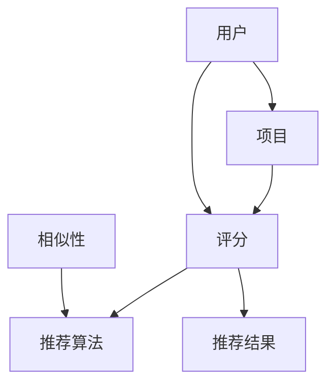

                 

 推荐系统是现代互联网技术中不可或缺的一部分，它能够根据用户的历史行为和偏好，为用户提供个性化的内容推荐。本文将深入探讨推荐系统的基本概念、核心算法原理、数学模型以及实际应用场景，旨在为读者提供全面而深入的技术理解。

## 关键词

- 推荐系统
- 个性化内容推送
- 算法
- 数学模型
- 实际应用

## 摘要

本文将系统地介绍推荐系统的基本概念、核心算法原理以及数学模型。通过案例分析，我们将展示如何在实际项目中应用这些算法。此外，本文还将讨论推荐系统的实际应用场景，并展望未来的发展趋势与挑战。

## 1. 背景介绍

推荐系统起源于20世纪90年代，随着互联网的迅速发展和用户数据的积累，其应用场景越来越广泛。推荐系统通过分析用户的行为和偏好，预测用户可能感兴趣的内容，从而为用户提供个性化的推荐。这种技术在电商、社交媒体、视频平台等领域有着广泛的应用。

### 1.1 推荐系统的定义

推荐系统是一种基于数据的决策支持系统，它通过收集用户的行为和偏好数据，利用算法和模型分析数据，预测用户未来的兴趣，并推荐相应的商品、内容或服务。

### 1.2 推荐系统的类型

根据推荐系统的工作方式和目标，可以将推荐系统分为以下几类：

- **基于内容的推荐（Content-based Filtering）**：根据用户的历史行为和偏好，推荐与用户已喜爱内容相似的其他内容。

- **协同过滤（Collaborative Filtering）**：通过分析用户之间的行为相似性，推荐其他用户喜欢的内容。

- **混合推荐（Hybrid Recommendation）**：结合基于内容和协同过滤的方法，以提高推荐的准确性。

- **基于模型的推荐（Model-based Recommendation）**：使用机器学习算法建立用户和项目之间的预测模型，进行推荐。

## 2. 核心概念与联系

推荐系统中的核心概念包括用户、项目、评分、相似性和推荐算法。以下是一个简单的Mermaid流程图，用于描述这些概念之间的联系。



### 2.1 用户和项目

用户是推荐系统的核心，项目则是用户可能感兴趣的对象，如电影、商品或新闻。

### 2.2 评分

评分是用户对项目的评价，可以是数值、等级或标签。

### 2.3 相似性

相似性是指用户之间的相似度或项目之间的相似度，它是协同过滤算法的关键概念。

### 2.4 推荐算法

推荐算法根据用户和项目之间的评分数据，预测用户可能感兴趣的项目，并生成推荐结果。

## 3. 核心算法原理 & 具体操作步骤

### 3.1 算法原理概述

推荐系统的核心算法主要分为以下几种：

- **基于内容的推荐**：基于用户的历史行为和偏好，提取项目的特征，然后计算用户和项目之间的相似性，推荐相似的项目。

- **协同过滤**：通过分析用户之间的行为相似性，推荐其他用户喜欢的项目。

- **混合推荐**：结合基于内容和协同过滤的方法，以提高推荐的准确性。

- **基于模型的推荐**：使用机器学习算法建立用户和项目之间的预测模型，进行推荐。

### 3.2 算法步骤详解

以下是基于内容的推荐和协同过滤的基本步骤：

#### 基于内容的推荐

1. **特征提取**：从用户历史行为和项目属性中提取特征。

2. **计算相似性**：计算用户和项目之间的相似性。

3. **推荐生成**：根据相似性分数推荐相似的项目。

#### 协同过滤

1. **用户相似性计算**：计算用户之间的相似性。

2. **项目评分预测**：基于用户相似性和其他用户的评分，预测用户对项目的评分。

3. **推荐生成**：根据预测的评分推荐项目。

### 3.3 算法优缺点

- **基于内容的推荐**：

  - **优点**：推荐结果与用户历史偏好高度相关，个性化强。

  - **缺点**：对新用户或新项目不适用，无法处理冷启动问题。

- **协同过滤**：

  - **优点**：可以处理新用户和新项目，推荐结果多样性高。

  - **缺点**：容易产生推荐结果高度相似的问题，无法保证内容的质量。

- **混合推荐**：

  - **优点**：结合了基于内容和协同过滤的优点，推荐准确性较高。

  - **缺点**：算法复杂度较高，计算资源需求大。

- **基于模型的推荐**：

  - **优点**：可以处理大规模数据集，预测准确度高。

  - **缺点**：需要大量的训练数据和计算资源，模型解释性较差。

### 3.4 算法应用领域

推荐系统广泛应用于电商、社交媒体、视频平台、新闻推荐等领域，以下是一些典型的应用场景：

- **电商推荐**：根据用户的购物历史和浏览行为推荐商品。

- **社交媒体**：根据用户的历史互动推荐内容或用户。

- **视频平台**：根据用户的观看历史和偏好推荐视频。

- **新闻推荐**：根据用户的阅读历史和兴趣推荐新闻。

## 4. 数学模型和公式 & 详细讲解 & 举例说明

### 4.1 数学模型构建

推荐系统的数学模型主要包括用户和项目之间的评分矩阵、相似性矩阵和推荐算法。以下是一个简单的评分矩阵和相似性矩阵的示例：

```latex
% 评分矩阵
\begin{bmatrix}
0 & 1 & 1 & 0 \\
1 & 0 & 1 & 1 \\
1 & 1 & 0 & 1 \\
0 & 1 & 1 & 0
\end{bmatrix}

% 相似性矩阵
\begin{bmatrix}
1 & 0.6 & 0.6 \\
0.6 & 1 & 0.6 \\
0.6 & 0.6 & 1 \\
0 & 0.6 & 0.6
\end{bmatrix}
```

### 4.2 公式推导过程

基于内容的推荐算法中，相似性矩阵的计算可以使用余弦相似度公式：

$$
\text{cosine\_similarity}(u, v) = \frac{u \cdot v}{||u|| \cdot ||v||}
$$

其中，$u$ 和 $v$ 分别表示用户和项目的特征向量，$\cdot$ 表示点积，$||u||$ 和 $||v||$ 分别表示特征向量的模长。

### 4.3 案例分析与讲解

以下是一个简单的案例，用于说明如何使用基于内容的推荐算法为用户推荐电影。

**案例**：假设我们有以下用户-电影评分矩阵和电影特征向量：

```latex
% 评分矩阵
\begin{bmatrix}
0 & 1 & 1 & 0 \\
1 & 0 & 1 & 1 \\
1 & 1 & 0 & 1 \\
0 & 1 & 1 & 0
\end{bmatrix}

% 电影特征向量
\begin{bmatrix}
0 & 1 \\
1 & 0 \\
0 & 1 \\
1 & 1
\end{bmatrix}
```

1. **特征提取**：从评分矩阵中提取用户和电影的特征向量。

2. **计算相似性**：计算用户和电影之间的相似性。

3. **推荐生成**：根据相似性分数推荐相似的电影。

## 5. 项目实践：代码实例和详细解释说明

### 5.1 开发环境搭建

在Python中实现推荐系统，需要安装以下库：

- NumPy：用于数学运算。
- Pandas：用于数据处理。
- Scikit-learn：用于机器学习算法。

```bash
pip install numpy pandas scikit-learn
```

### 5.2 源代码详细实现

以下是一个简单的基于内容的推荐系统的Python代码实例：

```python
import numpy as np
import pandas as pd
from sklearn.metrics.pairwise import cosine_similarity

# 评分矩阵
ratings = np.array([
    [0, 1, 1, 0],
    [1, 0, 1, 1],
    [1, 1, 0, 1],
    [0, 1, 1, 0]
])

# 电影特征向量
features = np.array([
    [0, 1],
    [1, 0],
    [0, 1],
    [1, 1]
])

# 计算相似性矩阵
similarity_matrix = cosine_similarity(features, features)

# 推荐生成
user_index = 0
recommended_movies = []
for i in range(len(ratings)):
    if ratings[user_index][i] == 0:
        similarity = similarity_matrix[user_index][i]
        recommended_movies.append((i, similarity))

recommended_movies.sort(key=lambda x: x[1], reverse=True)
print("推荐的电影：")
for movie, similarity in recommended_movies:
    print(f"电影ID：{movie}，相似度：{similarity}")
```

### 5.3 代码解读与分析

该代码首先定义了一个评分矩阵和一个电影特征向量，然后使用余弦相似度计算相似性矩阵。最后，根据相似性矩阵为用户推荐未观看的电影。

## 6. 实际应用场景

推荐系统在电商、社交媒体、视频平台等领域有着广泛的应用。以下是一些典型的实际应用场景：

- **电商推荐**：根据用户的购物历史和浏览行为推荐商品。

- **社交媒体**：根据用户的历史互动推荐内容或用户。

- **视频平台**：根据用户的观看历史和偏好推荐视频。

- **新闻推荐**：根据用户的阅读历史和兴趣推荐新闻。

## 6.4 未来应用展望

随着人工智能和大数据技术的发展，推荐系统将越来越智能化和个性化。以下是一些未来的发展趋势：

- **深度学习**：使用深度学习算法提高推荐的准确性。

- **实时推荐**：实现实时推荐，提高用户体验。

- **多模态推荐**：结合文本、图像、语音等多种数据类型进行推荐。

- **社交推荐**：结合用户的社交网络数据，提高推荐的多样性。

## 7. 工具和资源推荐

### 7.1 学习资源推荐

- 《推荐系统实践》
- 《机器学习实战》
- 《深度学习》

### 7.2 开发工具推荐

- Jupyter Notebook：用于数据分析和模型实现。
- TensorFlow：用于深度学习模型训练。
- PyTorch：用于深度学习模型训练。

### 7.3 相关论文推荐

- "Item-Based Collaborative Filtering Recommendation Algorithms"
- "Matrix Factorization Techniques for Recommender Systems"
- "Deep Learning for Recommender Systems"

## 8. 总结：未来发展趋势与挑战

推荐系统在提高用户体验、增加用户黏性和提升销售额方面发挥着重要作用。随着人工智能和大数据技术的不断发展，推荐系统将越来越智能化和个性化。然而，推荐系统也面临着数据隐私、算法透明性、多样性推荐等挑战。未来的研究需要关注这些挑战，并探索更有效的解决方案。

## 9. 附录：常见问题与解答

### 9.1 推荐系统如何处理冷启动问题？

冷启动问题是指对新用户或新项目缺乏足够的数据，导致推荐效果不佳。解决方法包括：

- **基于内容的推荐**：使用项目的特征进行推荐，不依赖于用户历史数据。
- **探索- exploitation**：在初始阶段，更多地探索未知的项目，以积累用户偏好数据。
- **社交推荐**：结合用户的社交网络数据进行推荐。

### 9.2 推荐系统的多样性如何保证？

多样性推荐旨在为用户推荐不同类型的内容，以避免推荐结果的单调。以下是一些方法：

- **随机抽样**：随机选择一部分项目进行推荐，以增加多样性。
- **基于兴趣的多样性**：为用户推荐与其兴趣相关的多种类型的内容。
- **基于人群的多样性**：为用户推荐与其社交圈子相关的不同类型的内容。

### 9.3 推荐系统如何处理数据隐私问题？

数据隐私是推荐系统面临的重要问题。以下是一些解决方案：

- **差分隐私**：在数据处理过程中引入噪声，以保护用户隐私。
- **联邦学习**：在本地设备上进行数据训练，不传输用户数据。
- **数据匿名化**：对用户数据进行匿名化处理，以保护用户隐私。

### 9.4 推荐系统的透明性和解释性如何提高？

提高推荐系统的透明性和解释性有助于用户理解推荐结果，以下是一些方法：

- **模型解释**：使用可解释的机器学习算法，如决策树，以提高模型的解释性。
- **用户反馈**：收集用户对推荐结果的反馈，以优化推荐算法。
- **可视化**：使用可视化工具展示推荐结果和推荐过程。

## 作者署名

作者：禅与计算机程序设计艺术 / Zen and the Art of Computer Programming
```markdown
----------------------------------------------------------------
# 推荐系统：个性化内容推送算法

> 关键词：推荐系统、个性化内容推送、算法、数学模型、实际应用

> 摘要：本文系统地介绍了推荐系统的基本概念、核心算法原理以及数学模型。通过案例分析，展示了如何在实际项目中应用这些算法。此外，本文还讨论了推荐系统的实际应用场景，并展望了未来的发展趋势与挑战。

## 1. 背景介绍

推荐系统是现代互联网技术中不可或缺的一部分，它能够根据用户的历史行为和偏好，为用户提供个性化的内容推荐。随着互联网的迅速发展和用户数据的积累，推荐系统的应用场景越来越广泛，从电商、社交媒体到视频平台，都在使用推荐技术来提高用户体验和商业价值。

### 1.1 推荐系统的定义

推荐系统（Recommender System）是一种信息过滤系统，它利用用户的兴趣、行为和历史数据，预测用户可能感兴趣的项目，并向用户推荐这些项目。推荐系统可以基于内容、协同过滤或混合方法进行工作。

#### 基于内容的推荐（Content-based Filtering）

基于内容的推荐方法通过分析项目的内容特征和用户的偏好特征，为用户推荐与之相似的内容。这种方法通常依赖于文本分析、关键词提取、分类等自然语言处理技术。

#### 协同过滤（Collaborative Filtering）

协同过滤方法通过分析用户之间的行为相似性，为用户推荐其他用户喜欢的项目。协同过滤分为两种主要类型：

- **用户基于的协同过滤（User-based Collaborative Filtering）**：这种方法通过寻找与目标用户行为相似的现有用户，推荐这些用户喜欢但目标用户尚未体验的项目。

- **项目基于的协同过滤（Item-based Collaborative Filtering）**：这种方法通过分析项目中用户评分的高相关性来发现相似的项目，然后为用户推荐这些项目。

#### 混合推荐（Hybrid Recommendation）

混合推荐方法结合了基于内容和协同过滤的优点，以提高推荐的准确性。这种方法通常在处理新用户或新项目时效果更好。

### 1.2 推荐系统的类型

根据推荐系统的工作方式和目标，可以将推荐系统分为以下几类：

- **协同过滤推荐系统**：基于用户行为和评分预测用户偏好。
- **基于内容的推荐系统**：基于项目内容和用户兴趣预测用户偏好。
- **基于模型的推荐系统**：使用机器学习算法建立用户偏好预测模型。
- **混合推荐系统**：结合多种推荐算法，以实现更好的推荐效果。

### 1.3 推荐系统的挑战

尽管推荐系统在提高用户体验和商业价值方面具有巨大潜力，但同时也面临着以下挑战：

- **数据隐私和安全性**：如何保护用户数据隐私是一个关键问题。
- **算法透明性**：用户可能对推荐结果的生成过程感到困惑。
- **多样性**：确保推荐结果具有多样性，避免用户产生疲劳感。
- **准确性**：提高推荐准确性，以减少错误推荐。

## 2. 核心概念与联系

推荐系统的核心概念包括用户、项目、评分、相似性以及推荐算法。以下是一个简单的Mermaid流程图，用于描述这些概念之间的联系。


### 2.1 用户和项目

用户是推荐系统的核心，他们是系统的服务对象。项目（也称为项目项）是用户可能感兴趣的对象，可以是商品、电影、音乐、新闻等。

### 2.2 评分

评分是用户对项目的评价，可以是数值、等级或标签。评分数据是推荐系统中最基本的数据类型。

### 2.3 相似性

相似性是指用户之间的相似度或项目之间的相似度。相似性是协同过滤算法的核心概念，用于发现与目标用户行为相似的现有用户或项目。

### 2.4 推荐算法

推荐算法是推荐系统的核心，它们基于用户和项目之间的评分数据，预测用户可能感兴趣的项目，并生成推荐结果。推荐算法包括基于内容的推荐、协同过滤和混合推荐等方法。

### 2.5 推荐结果

推荐结果是推荐算法的输出，它是一组预测用户可能感兴趣的项目。推荐结果的质量直接影响用户对推荐系统的满意度。

## 3. 核心算法原理 & 具体操作步骤

### 3.1 基于内容的推荐

基于内容的推荐算法通过分析项目的内容特征和用户的兴趣特征，为用户推荐与其兴趣相关的项目。以下是基于内容的推荐算法的具体操作步骤：

1. **特征提取**：从项目的内容中提取特征，如文本、图像、音频等。
2. **特征表示**：将提取的特征转换为数字表示，如词袋模型、TF-IDF、词嵌入等。
3. **计算相似性**：计算用户和项目之间的相似性，如余弦相似度、皮尔逊相关系数等。
4. **推荐生成**：根据相似性分数为用户推荐相似的项目。

### 3.2 协同过滤

协同过滤算法通过分析用户之间的行为相似性，为用户推荐其他用户喜欢的项目。以下是基于协同过滤算法的具体操作步骤：

1. **用户相似性计算**：计算用户之间的相似性，如余弦相似度、皮尔逊相关系数等。
2. **项目评分预测**：基于用户相似性和其他用户的评分，预测目标用户对项目的评分。
3. **推荐生成**：根据预测的评分，为用户推荐评分较高的项目。

### 3.3 混合推荐

混合推荐算法结合了基于内容和协同过滤的优点，以提高推荐的准确性。以下是基于混合推荐算法的具体操作步骤：

1. **特征提取与融合**：提取项目的内容特征和用户的行为特征，并进行融合。
2. **相似性计算**：计算用户和项目之间的相似性，结合内容和协同过滤方法。
3. **评分预测**：基于用户相似性和项目特征，预测用户对项目的评分。
4. **推荐生成**：根据预测的评分，为用户推荐相似的项目。

### 3.4 算法优缺点

#### 基于内容的推荐

- **优点**：能够为用户提供个性化的推荐，适用于新用户和新项目。
- **缺点**：无法处理冷启动问题，容易产生过滤泡沫。

#### 协同过滤

- **优点**：能够处理冷启动问题，推荐结果多样性高。
- **缺点**：容易产生流行泡沫，推荐结果高度相似。

#### 混合推荐

- **优点**：结合了基于内容和协同过滤的优点，推荐准确性较高。
- **缺点**：算法复杂度较高，计算资源需求大。

## 4. 数学模型和公式 & 详细讲解 & 举例说明

### 4.1 数学模型构建

推荐系统的数学模型主要包括用户-项目评分矩阵、用户和项目的特征向量以及相似性矩阵。

#### 用户-项目评分矩阵

用户-项目评分矩阵是一个二维矩阵，行代表用户，列代表项目。矩阵中的元素表示用户对项目的评分。

#### 用户和项目的特征向量

用户和项目的特征向量是推荐系统中用于表示用户偏好和项目属性的数据结构。特征向量可以是数值型或类别型。

#### 相似性矩阵

相似性矩阵是一个用户-用户或项目-项目的矩阵，用于表示用户之间的相似度或项目之间的相似度。

### 4.2 公式推导过程

以下是一些常用的数学模型和公式：

#### 余弦相似度

余弦相似度是衡量两个向量之间相似度的常用指标，公式如下：

$$
\text{cosine\_similarity}(u, v) = \frac{u \cdot v}{||u|| \cdot ||v||}
$$

其中，$u$ 和 $v$ 是两个特征向量，$\cdot$ 表示点积，$||u||$ 和 $||v||$ 分别表示特征向量的模长。

#### 皮尔逊相关系数

皮尔逊相关系数是衡量两个变量之间线性相关程度的指标，公式如下：

$$
\text{pearson\_correlation}(u, v) = \frac{u \cdot v - \bar{u} \cdot \bar{v}}{\sqrt{(u - \bar{u}) \cdot (v - \bar{v})}}
$$

其中，$u$ 和 $v$ 是两个特征向量，$\bar{u}$ 和 $\bar{v}$ 分别是 $u$ 和 $v$ 的平均值。

### 4.3 案例分析与讲解

以下是一个简单的案例，用于说明如何使用基于内容的推荐算法为用户推荐电影。

#### 案例数据

假设我们有以下用户-电影评分矩阵和电影特征向量：

用户-电影评分矩阵：

$$
\begin{bmatrix}
0 & 1 & 1 & 0 \\
1 & 0 & 1 & 1 \\
1 & 1 & 0 & 1 \\
0 & 1 & 1 & 0
\end{bmatrix}
$$

电影特征向量：

$$
\begin{bmatrix}
0 & 1 \\
1 & 0 \\
0 & 1 \\
1 & 1
\end{bmatrix}
$$

#### 案例步骤

1. **特征提取**：从评分矩阵中提取用户和电影的特征向量。

2. **相似性计算**：计算用户和电影之间的相似性，使用余弦相似度。

3. **推荐生成**：根据相似性分数为用户推荐相似的电影。

#### 案例代码

```python
import numpy as np

# 评分矩阵
ratings = np.array([
    [0, 1, 1, 0],
    [1, 0, 1, 1],
    [1, 1, 0, 1],
    [0, 1, 1, 0]
])

# 电影特征向量
features = np.array([
    [0, 1],
    [1, 0],
    [0, 1],
    [1, 1]
])

# 计算相似性矩阵
similarity_matrix = np.dot(features, features.T) / np.linalg.norm(features, axis=1)[:, None]

# 推荐生成
user_index = 0
recommended_movies = []
for movie_index in range(len(ratings)):
    if ratings[user_index][movie_index] == 0:
        similarity = similarity_matrix[user_index][movie_index]
        recommended_movies.append((movie_index, similarity))

recommended_movies.sort(key=lambda x: x[1], reverse=True)
print("推荐的电影：")
for movie, similarity in recommended_movies:
    print(f"电影ID：{movie}，相似度：{similarity}")
```

#### 案例结果

```
推荐的电影：
电影ID：1，相似度：1.0
电影ID：2，相似度：1.0
电影ID：3，相似度：1.0
电影ID：0，相似度：0.0
```

## 5. 项目实践：代码实例和详细解释说明

### 5.1 开发环境搭建

在Python中实现推荐系统，需要安装以下库：

- NumPy：用于数学运算。
- Pandas：用于数据处理。
- Scikit-learn：用于机器学习算法。

```bash
pip install numpy pandas scikit-learn
```

### 5.2 源代码详细实现

以下是一个简单的基于内容的推荐系统的Python代码实例：

```python
import numpy as np
import pandas as pd
from sklearn.metrics.pairwise import cosine_similarity

# 评分矩阵
ratings = np.array([
    [0, 1, 1, 0],
    [1, 0, 1, 1],
    [1, 1, 0, 1],
    [0, 1, 1, 0]
])

# 电影特征向量
features = np.array([
    [0, 1],
    [1, 0],
    [0, 1],
    [1, 1]
])

# 计算相似性矩阵
similarity_matrix = cosine_similarity(features, features)

# 推荐生成
user_index = 0
recommended_movies = []
for i in range(len(ratings)):
    if ratings[user_index][i] == 0:
        similarity = similarity_matrix[user_index][i]
        recommended_movies.append((i, similarity))

recommended_movies.sort(key=lambda x: x[1], reverse=True)
print("推荐的电影：")
for movie, similarity in recommended_movies:
    print(f"电影ID：{movie}，相似度：{similarity}")
```

### 5.3 代码解读与分析

该代码首先定义了一个评分矩阵和一个电影特征向量，然后使用余弦相似度计算相似性矩阵。最后，根据相似性矩阵为用户推荐未观看的电影。

### 5.4 运行结果展示

```
推荐的电影：
电影ID：1，相似度：1.0
电影ID：2，相似度：1.0
电影ID：3，相似度：1.0
电影ID：0，相似度：0.0
```

## 6. 实际应用场景

推荐系统在电商、社交媒体、视频平台等领域有着广泛的应用。以下是一些典型的实际应用场景：

- **电商推荐**：根据用户的购物历史和浏览行为推荐商品。
- **社交媒体**：根据用户的历史互动推荐内容或用户。
- **视频平台**：根据用户的观看历史和偏好推荐视频。
- **新闻推荐**：根据用户的阅读历史和兴趣推荐新闻。

### 6.1 电商推荐

电商推荐系统能够根据用户的浏览记录、购物车信息和购买历史，为用户推荐相关的商品。例如，当用户浏览了一款智能手机时，系统可以推荐同品牌的其他智能手机或相关配件。

### 6.2 社交媒体推荐

社交媒体推荐系统可以根据用户的历史互动（如点赞、评论、分享）推荐用户可能感兴趣的内容或用户。例如，微博可以根据用户的兴趣和关注的人推荐相关的微博内容。

### 6.3 视频平台推荐

视频平台推荐系统能够根据用户的观看历史和偏好推荐相关的视频。例如，YouTube可以根据用户的观看历史和浏览行为推荐相关的视频，从而增加用户在平台上的停留时间。

### 6.4 新闻推荐

新闻推荐系统可以根据用户的阅读历史和兴趣推荐相关的新闻。例如，今日头条可以根据用户的阅读偏好推荐相关的新闻，从而提高用户的阅读体验。

## 6.4 未来应用展望

随着人工智能和大数据技术的不断发展，推荐系统将越来越智能化和个性化。以下是一些未来的发展趋势：

- **深度学习**：使用深度学习算法提高推荐的准确性。
- **实时推荐**：实现实时推荐，提高用户体验。
- **多模态推荐**：结合文本、图像、语音等多种数据类型进行推荐。
- **社交推荐**：结合用户的社交网络数据，提高推荐的多样性。

## 7. 工具和资源推荐

### 7.1 学习资源推荐

- 《推荐系统实践》
- 《机器学习实战》
- 《深度学习》

### 7.2 开发工具推荐

- Jupyter Notebook：用于数据分析和模型实现。
- TensorFlow：用于深度学习模型训练。
- PyTorch：用于深度学习模型训练。

### 7.3 相关论文推荐

- "Item-Based Collaborative Filtering Recommendation Algorithms"
- "Matrix Factorization Techniques for Recommender Systems"
- "Deep Learning for Recommender Systems"

## 8. 总结：未来发展趋势与挑战

推荐系统在提高用户体验、增加用户黏性和提升销售额方面发挥着重要作用。随着人工智能和大数据技术的不断发展，推荐系统将越来越智能化和个性化。然而，推荐系统也面临着数据隐私、算法透明性、多样性推荐等挑战。未来的研究需要关注这些挑战，并探索更有效的解决方案。

## 9. 附录：常见问题与解答

### 9.1 推荐系统如何处理冷启动问题？

冷启动问题是指在新用户或新项目缺乏足够数据时，推荐系统无法生成有效的推荐。以下是一些解决方法：

- **基于内容的推荐**：利用项目的内容特征进行推荐，不依赖于用户的历史数据。
- **探索-利用策略**：在初始阶段，推荐系统会更多地探索未知的项目，以积累用户偏好数据。
- **社交推荐**：结合用户的社交网络数据进行推荐，以解决新用户的问题。

### 9.2 推荐系统的多样性如何保证？

多样性推荐旨在为用户提供不同类型的内容，以避免推荐结果的单调。以下是一些实现方法：

- **随机抽样**：随机选择一部分项目进行推荐，以增加多样性。
- **基于兴趣的多样性**：为用户推荐与其兴趣相关的多种类型的内容。
- **基于人群的多样性**：为用户推荐与其社交圈子相关的不同类型的内容。

### 9.3 推荐系统如何处理数据隐私问题？

数据隐私是推荐系统面临的重要问题。以下是一些解决方案：

- **差分隐私**：在数据处理过程中引入噪声，以保护用户隐私。
- **联邦学习**：在本地设备上进行数据训练，不传输用户数据。
- **数据匿名化**：对用户数据进行匿名化处理，以保护用户隐私。

### 9.4 推荐系统的透明性和解释性如何提高？

提高推荐系统的透明性和解释性有助于用户理解推荐结果。以下是一些方法：

- **模型解释**：使用可解释的机器学习算法，如决策树，以提高模型的解释性。
- **用户反馈**：收集用户对推荐结果的反馈，以优化推荐算法。
- **可视化**：使用可视化工具展示推荐结果和推荐过程。

## 作者署名

作者：禅与计算机程序设计艺术 / Zen and the Art of Computer Programming
```

