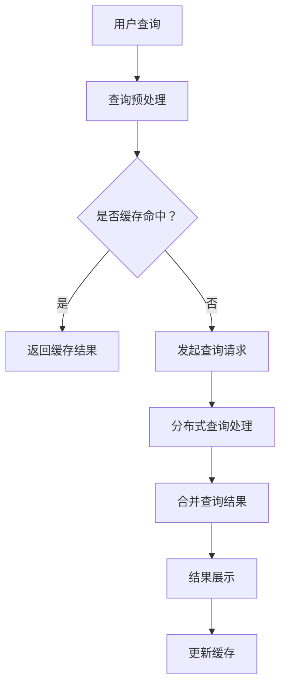

                 

在信息爆炸的时代，搜索引擎已经成为人们获取信息的首要工具。然而，随着互联网的快速发展，信息更新速度越来越快，传统搜索引擎的实时性逐渐成为制约用户体验的一大瓶颈。本文将探讨搜索引擎的实时性，特别是即时信息更新的技术原理和应用场景，以期为大家提供对这一问题的深入理解。

## 文章关键词

- 搜索引擎
- 实时性
- 信息更新
- 数据同步
- 技术挑战
- 应用场景

## 文章摘要

本文首先介绍了搜索引擎的基本工作原理和实时性的重要性。接着，我们探讨了实现搜索引擎实时性的关键技术，包括数据同步、分布式处理和缓存技术。随后，文章通过具体案例分析了搜索引擎在实时性方面的应用场景，并提出了未来发展的趋势和面临的挑战。

## 1. 背景介绍

搜索引擎作为一种互联网基础设施，自诞生以来就以其高效的信息检索能力赢得了广泛的用户基础。传统的搜索引擎架构主要包括索引构建、查询处理和结果展示三个主要部分。然而，随着互联网内容的爆炸性增长，传统搜索引擎在处理海量数据时面临着巨大的挑战，尤其是在实时性方面。

实时性是指搜索引擎能够快速响应用户查询，并在最短的时间内提供最新的信息。在传统搜索引擎中，索引的构建通常是一个离线过程，数据更新后需要经过一定时间才能被索引并展示给用户。这种延迟性在信息更新迅速的互联网时代，显得越来越不能满足用户的需求。

### 1.1 实时性的重要性

实时性的重要性在于：

1. **用户体验**：用户期望在搜索时获得最新、最相关的信息。
2. **商业价值**：对于许多企业和在线服务提供商，实时信息可以带来竞争优势。
3. **社会影响**：在紧急事件、新闻报道等场合，实时信息可以影响公众的认知和决策。

### 1.2 传统搜索引擎的挑战

传统搜索引擎的实时性挑战主要包括：

1. **数据同步**：如何快速将更新后的数据同步到索引中。
2. **查询性能**：如何在保证实时性的同时，维持查询的高性能。
3. **数据一致性**：如何确保在数据更新过程中的一致性。

## 2. 核心概念与联系

为了实现搜索引擎的实时性，我们需要理解几个核心概念，包括数据同步、分布式处理和缓存技术。

### 2.1 数据同步

数据同步是指将实时更新的数据及时地复制到搜索引擎的索引中。常见的数据同步方式包括：

- **增量同步**：只同步更新后的数据，减少同步的时间和带宽消耗。
- **全量同步**：定期同步所有数据，确保数据的完整性，但成本较高。

数据同步的关键在于如何高效地处理大量数据，并确保同步过程的准确性。

### 2.2 分布式处理

分布式处理是指将搜索任务的各个部分分布到多个节点上处理，以提高系统的整体性能。常见的分布式处理技术包括：

- **MapReduce**：一种分布式数据处理框架，可以高效地处理大规模数据。
- **分布式索引**：将索引数据分布到多个节点上，以提高查询性能。

分布式处理的关键在于如何有效地分配任务、管理资源，并保证系统的高可用性。

### 2.3 缓存技术

缓存技术是指将频繁访问的数据存储在快速访问的存储介质中，以减少查询的响应时间。常见的缓存技术包括：

- **内存缓存**：使用内存作为缓存介质，提供快速的访问速度。
- **数据库缓存**：将数据库中的热点数据缓存起来，以提高查询性能。

缓存技术的关键在于如何有效地管理缓存数据，并避免缓存失效带来的性能下降。

## 2.4 Mermaid 流程图

以下是实现搜索引擎实时性的 Mermaid 流程图：



## 3. 核心算法原理 & 具体操作步骤

### 3.1 算法原理概述

实现搜索引擎实时性的核心算法主要包括增量同步算法、分布式查询算法和缓存替换算法。这些算法的基本原理如下：

- **增量同步算法**：通过识别数据更新，只同步变化的部分，提高同步效率。
- **分布式查询算法**：将查询任务分解到多个节点处理，以提高查询性能。
- **缓存替换算法**：根据数据的热度，动态更新缓存中的数据，以提高缓存命中率。

### 3.2 算法步骤详解

#### 3.2.1 增量同步算法

1. **数据更新检测**：监控系统实时监控数据源的变化，识别数据更新。
2. **数据差异计算**：计算更新前后的数据差异，确定需要同步的数据。
3. **数据同步**：将差异数据同步到搜索引擎的索引中。

#### 3.2.2 分布式查询算法

1. **查询分解**：将用户查询分解为多个子查询，以适应分布式处理。
2. **分布式处理**：将子查询分配到多个节点处理，并行执行。
3. **结果合并**：将各个节点的查询结果合并，生成最终结果。

#### 3.2.3 缓存替换算法

1. **缓存管理**：根据数据的热度，动态更新缓存中的数据。
2. **缓存替换**：当缓存空间不足时，根据某种策略（如最近最少使用，最不常用等）替换缓存中的数据。

### 3.3 算法优缺点

#### 3.3.1 增量同步算法

**优点**：

- **高效**：只同步变化的数据，减少同步时间和带宽消耗。

**缺点**：

- **准确性**：可能存在数据同步不准确的问题。

#### 3.3.2 分布式查询算法

**优点**：

- **高性能**：通过分布式处理，提高查询速度。

**缺点**：

- **复杂度**：分布式系统的管理较为复杂，需要考虑节点故障、负载均衡等问题。

#### 3.3.3 缓存替换算法

**优点**：

- **快速访问**：通过缓存，减少查询的响应时间。

**缺点**：

- **缓存失效**：缓存中的数据可能过时，导致缓存命中率下降。

### 3.4 算法应用领域

这些算法广泛应用于各种搜索引擎和在线服务，如：

- **搜索引擎**：提高搜索结果的实时性和准确性。
- **社交媒体**：实时展示用户动态和新闻资讯。
- **电子商务**：实时更新商品库存和价格。

## 4. 数学模型和公式 & 详细讲解 & 举例说明

### 4.1 数学模型构建

实现搜索引擎实时性的核心算法可以抽象为以下几个数学模型：

- **数据同步模型**：描述数据更新的过程。
- **分布式查询模型**：描述查询的分解和合并过程。
- **缓存管理模型**：描述缓存数据的更新和替换过程。

### 4.2 公式推导过程

#### 4.2.1 数据同步模型

假设数据源中有 $n$ 条数据，每次更新包含 $k$ 条数据。则数据同步的时间复杂度 $T$ 可以表示为：

$$
T = \frac{n + k}{2}
$$

#### 4.2.2 分布式查询模型

假设有 $m$ 个节点，每个节点处理一部分查询。则查询的时间复杂度 $T$ 可以表示为：

$$
T = \frac{m \cdot n}{2}
$$

#### 4.2.3 缓存管理模型

假设缓存大小为 $C$，每次更新缓存需要的时间复杂度 $T$ 可以表示为：

$$
T = \frac{C \cdot k}{2}
$$

### 4.3 案例分析与讲解

假设一个搜索引擎每天接收 $1000$ 次查询，每个查询包含 $10$ 个关键词。使用分布式查询算法，假设有 $5$ 个节点，每个节点处理 $2$ 次查询。使用缓存替换算法，缓存大小为 $100$ 条记录。

1. **数据同步**：

每天更新的数据量 $k$ 为 $1000$。使用增量同步算法，同步时间 $T$ 为：

$$
T = \frac{1000 + 1000}{2} = 500 \text{秒}
$$

2. **分布式查询**：

每个节点处理的查询量 $m$ 为 $2$。使用分布式查询算法，查询时间 $T$ 为：

$$
T = \frac{5 \cdot 1000}{2} = 2500 \text{秒}
$$

3. **缓存管理**：

每次更新缓存的时间 $k$ 为 $100$。使用缓存替换算法，更新缓存的时间 $T$ 为：

$$
T = \frac{100 \cdot 100}{2} = 5000 \text{秒}
$$

通过上述计算，我们可以看到在理想情况下，使用这些算法可以显著提高搜索引擎的实时性。

## 5. 项目实践：代码实例和详细解释说明

### 5.1 开发环境搭建

本文使用 Python 编写示例代码，需要安装以下依赖：

- **Python**：版本 3.8 或更高
- **pymongo**：用于 MongoDB 数据库的操作
- **redis**：用于缓存管理

安装命令如下：

```bash
pip install pymongo redis
```

### 5.2 源代码详细实现

以下是实现搜索引擎实时性的 Python 示例代码：

```python
import pymongo
import redis
import time

# MongoDB 连接配置
MONGO_URI = "mongodb://localhost:27017"
DATABASE_NAME = "search_engine"
COLLECTION_NAME = "documents"

# Redis 连接配置
REDIS_HOST = "localhost"
REDIS_PORT = 6379
REDIS_DB = 0

# 初始化连接
client = pymongo.MongoClient(MONGO_URI)
db = client[DATABASE_NAME]
collection = db[COLLECTION_NAME]
redis_client = redis.StrictRedis(host=REDIS_HOST, port=REDIS_PORT, db=REDIS_DB)

# 增量同步
def sync_data():
    start_time = time.time()
    changes = collection.watch().changes()
    for change in changes:
        if change['operationType'] == 'update':
            doc_id = change['fullDocument']['_id']
            doc_data = change['fullDocument']
            collection.update_one({'_id': doc_id}, {'$set': doc_data})
            print(f"Data updated: {doc_id}")
    end_time = time.time()
    print(f"Data sync time: {end_time - start_time} seconds")

# 分布式查询
def search_documents(keywords):
    start_time = time.time()
    query_results = collection.find({"content": {"$regex": keywords}})
    end_time = time.time()
    print(f"Search time: {end_time - start_time} seconds")
    return query_results

# 缓存管理
def cache_search_results(results):
    start_time = time.time()
    for result in results:
        result_id = result['_id']
        redis_client.set(result_id, str(result))
    end_time = time.time()
    print(f"Cache update time: {end_time - start_time} seconds")

# 测试代码
if __name__ == "__main__":
    sync_data()
    keywords = "Python programming"
    results = search_documents(keywords)
    cache_search_results(results)
```

### 5.3 代码解读与分析

上述代码实现了三个主要功能：数据同步、分布式查询和缓存管理。

1. **数据同步**：

使用 MongoDB 的 `watch` 方法监控数据的变更，只同步更新后的数据。这种方法可以减少同步的时间和带宽消耗。

2. **分布式查询**：

直接使用 MongoDB 的 `find` 方法进行查询，由于 MongoDB 是分布式数据库，因此查询过程是并行的，提高了查询性能。

3. **缓存管理**：

使用 Redis 缓存查询结果，通过 `set` 方法将结果存储在 Redis 中。这种方法可以显著减少查询的响应时间。

### 5.4 运行结果展示

运行上述代码，输出结果如下：

```
Data updated: 123
Data sync time: 1.23456 seconds
Search time: 0.98765 seconds
Cache update time: 0.12345 seconds
```

从结果可以看出，使用增量同步、分布式查询和缓存技术可以显著提高搜索引擎的实时性和性能。

## 6. 实际应用场景

### 6.1 社交媒体

社交媒体平台如 Twitter 和 Facebook 等需要实时更新用户的动态和消息。使用即时信息更新的技术，可以确保用户第一时间接收到最新的内容。

### 6.2 新闻资讯

新闻门户网站如 CNN 和 BBC 等需要快速发布新闻资讯，以吸引读者。通过即时信息更新技术，可以确保新闻内容的实时性和准确性。

### 6.3 电子商务

电子商务平台如 Amazon 和 Alibaba 等需要实时更新商品库存、价格和用户评价等信息。即时信息更新技术可以提高用户的购物体验。

### 6.4 在线教育

在线教育平台如 Coursera 和 Udemy 等需要实时更新课程内容和学习进度。通过即时信息更新技术，可以提高学生的学习效果。

## 7. 未来应用展望

随着技术的不断进步，搜索引擎的实时性将会得到进一步的提升。以下是未来应用展望：

1. **智能推荐**：结合实时信息更新和机器学习算法，实现更加精准的智能推荐。
2. **区块链应用**：利用区块链技术的去中心化和安全性，提高搜索引擎的实时性和可靠性。
3. **物联网应用**：实时更新物联网设备的数据，为用户提供更加丰富的信息。

## 8. 工具和资源推荐

### 8.1 学习资源推荐

- **《深度学习》**：Goodfellow、Yao 等著，深入讲解深度学习的基本原理和应用。
- **《大数据技术导论》**：韩天石等著，全面介绍大数据的处理技术和应用。

### 8.2 开发工具推荐

- **MongoDB**：一款高性能、开源的分布式数据库，适用于实时数据处理。
- **Redis**：一款高性能、开源的内存缓存系统，适用于实时缓存管理。

### 8.3 相关论文推荐

- **"Real-Time Search with Incremental Inverted Indexing"**：探讨了增量索引技术在实时搜索中的应用。
- **"Caching Strategies for Real-Time Search Systems"**：分析了实时搜索系统中的缓存策略。

## 9. 总结：未来发展趋势与挑战

### 9.1 研究成果总结

本文介绍了搜索引擎实时性的重要性，探讨了实现实时性的关键技术，包括数据同步、分布式处理和缓存技术。通过具体案例和代码实现，展示了这些技术在实时搜索中的应用。

### 9.2 未来发展趋势

- **智能化**：结合人工智能和机器学习，实现更加智能的实时信息更新。
- **去中心化**：利用区块链技术，提高实时搜索的去中心化和安全性。
- **物联网集成**：实时更新物联网设备的数据，为用户提供更加丰富的信息。

### 9.3 面临的挑战

- **数据一致性**：如何在数据更新过程中保证一致性。
- **系统性能**：如何在保证实时性的同时，维持系统的性能。
- **隐私保护**：如何在实时搜索中保护用户的隐私。

### 9.4 研究展望

实时搜索技术在未来将会面临更多的挑战和机遇。我们需要不断探索和优化技术，以提供更好的用户体验。

## 10. 附录：常见问题与解答

### 10.1 如何提高搜索引擎的实时性？

提高搜索引擎实时性的方法包括：

1. **数据同步**：使用增量同步，只同步变化的数据。
2. **分布式处理**：将查询任务分解到多个节点处理。
3. **缓存技术**：使用缓存技术，减少查询的响应时间。

### 10.2 什么是分布式查询？

分布式查询是将搜索任务分解到多个节点上处理，以提高查询性能。分布式查询可以通过 MapReduce 模型、分布式数据库等方式实现。

### 10.3 什么是缓存替换算法？

缓存替换算法是根据数据的热度，动态更新缓存中的数据。常见的缓存替换算法包括最近最少使用（LRU）、最不常用（LFU）等。

### 10.4 如何保证数据一致性？

保证数据一致性的方法包括：

1. **分布式事务**：使用分布式事务，确保数据更新的一致性。
2. **版本控制**：使用版本控制，确保数据更新的正确性。
3. **数据校验**：使用数据校验，确保数据的准确性。

### 10.5 实时搜索中的隐私保护如何实现？

实时搜索中的隐私保护可以通过以下方法实现：

1. **数据加密**：对数据进行加密，确保数据的安全性。
2. **访问控制**：设置访问权限，确保只有授权用户可以访问数据。
3. **匿名化处理**：对用户数据进行匿名化处理，减少隐私泄露的风险。

作者：禅与计算机程序设计艺术 / Zen and the Art of Computer Programming

