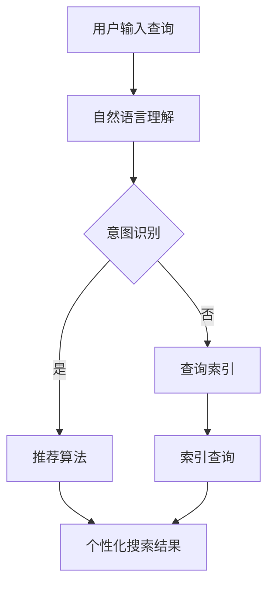

                 

关键词：搜索引擎、主动预测、人工智能、个性化搜索、算法优化、数学模型、代码实例、实际应用

> 摘要：随着人工智能技术的不断进步，搜索引擎正逐渐从被动响应向主动预测转变。本文将探讨这一变革背后的核心概念、算法原理、数学模型以及未来的发展趋势和挑战，旨在为读者提供一幅全面、深入的技术画卷。

## 1. 背景介绍

随着互联网的普及和信息的爆炸式增长，搜索引擎成为人们获取信息的主要途径。传统的搜索引擎主要依赖于关键词匹配和索引技术，通过用户输入的关键词来检索相关的网页。然而，这种方式存在明显的局限性：首先，用户需要明确知道他们需要什么信息；其次，搜索引擎无法提供个性化的搜索结果，因为它们无法准确理解用户的兴趣和需求。

随着人工智能和机器学习技术的发展，特别是深度学习和自然语言处理技术的突破，搜索引擎开始能够更好地理解用户的需求，从而提供更个性化的搜索结果。这一变革标志着搜索引擎从被动响应向主动预测的过渡。

### 1.1 人工智能在搜索引擎中的应用

人工智能在搜索引擎中的应用主要体现在以下几个方面：

1. **自然语言理解**：通过深度学习模型，搜索引擎能够理解用户查询的自然语言含义，而不仅仅是关键词的匹配。
2. **个性化推荐**：利用用户的搜索历史、浏览记录和行为数据，搜索引擎可以为用户提供个性化的搜索结果。
3. **实时搜索**：通过实时数据分析和预测，搜索引擎可以在用户输入查询的过程中，提供即时的搜索建议和结果。

### 1.2 搜索引擎的演变

搜索引擎的发展可以分为以下几个阶段：

1. **早期搜索**：基于关键词匹配和简单的页面索引技术。
2. **第二代搜索**：引入语义分析和信息检索技术，提高搜索结果的准确性和相关性。
3. **第三代搜索**：结合人工智能和机器学习，实现个性化搜索和实时搜索。

## 2. 核心概念与联系

为了实现从被动响应到主动预测的转变，搜索引擎需要解决以下几个核心问题：

### 2.1 个性化搜索

个性化搜索的核心在于理解用户的需求和兴趣，从而提供个性化的搜索结果。这需要以下几方面的技术支持：

1. **用户画像**：通过收集和分析用户的搜索历史、浏览记录、社交媒体行为等数据，建立用户的画像模型。
2. **推荐算法**：基于用户的画像模型，利用协同过滤、内容推荐等技术，为用户推荐相关的搜索结果。
3. **语义理解**：通过自然语言处理技术，理解用户的查询意图，提供更精准的搜索结果。

### 2.2 实时搜索

实时搜索的关键在于快速响应用户的查询，并提供最新的信息。这需要以下几个技术支持：

1. **实时数据流处理**：利用流处理技术，对海量实时数据进行处理和分析。
2. **预测模型**：基于历史数据和实时数据，构建预测模型，预测用户的查询意图和搜索结果。
3. **缓存机制**：通过缓存技术，提高搜索的响应速度，减少延迟。

### 2.3 Mermaid 流程图

以下是搜索引擎从被动响应到主动预测的流程图：



## 3. 核心算法原理 & 具体操作步骤

### 3.1 算法原理概述

搜索引擎的核心算法主要包括以下几类：

1. **自然语言处理算法**：用于理解和解析用户的查询。
2. **推荐算法**：用于生成个性化的搜索结果。
3. **实时搜索算法**：用于快速响应用户的查询。

### 3.2 算法步骤详解

1. **自然语言处理算法**：

   - **分词**：将用户的查询分解为单个词语。
   - **词性标注**：对每个词语进行词性标注，如名词、动词等。
   - **实体识别**：识别查询中的实体，如人名、地名等。
   - **句法分析**：构建句子的句法树，理解句子的结构。

2. **推荐算法**：

   - **用户画像构建**：通过用户的行为数据，构建用户的画像模型。
   - **相似度计算**：计算用户与物品之间的相似度，如基于内容的相似度、协同过滤的相似度等。
   - **推荐生成**：根据用户画像和物品相似度，生成个性化的推荐列表。

3. **实时搜索算法**：

   - **实时数据处理**：通过流处理技术，对实时数据进行处理。
   - **预测模型构建**：基于历史数据和实时数据，构建预测模型。
   - **实时查询响应**：根据预测模型，快速响应用户的查询。

### 3.3 算法优缺点

1. **自然语言处理算法**：

   - **优点**：能够理解用户的查询意图，提供更精准的搜索结果。
   - **缺点**：复杂度高，需要大量计算资源。

2. **推荐算法**：

   - **优点**：能够为用户推荐个性化的搜索结果，提高用户体验。
   - **缺点**：可能存在数据偏差和推荐质量不稳定的问题。

3. **实时搜索算法**：

   - **优点**：能够快速响应用户的查询，提供实时搜索结果。
   - **缺点**：对数据流处理能力要求高，需要大量的计算资源。

### 3.4 算法应用领域

- **搜索引擎**：用于提供个性化的搜索结果。
- **推荐系统**：用于为用户提供个性化的推荐。
- **实时搜索**：用于提供实时的搜索结果。

## 4. 数学模型和公式 & 详细讲解 & 举例说明

### 4.1 数学模型构建

搜索引擎的数学模型主要包括以下几个方面：

1. **用户画像模型**：用于描述用户的兴趣和行为。
2. **推荐模型**：用于生成个性化的推荐列表。
3. **实时搜索模型**：用于预测用户的查询意图。

### 4.2 公式推导过程

1. **用户画像模型**：

   - **用户兴趣分布**：设用户兴趣分布为 \( P(\theta) \)，则 \( P(\theta) = \frac{e^{-\theta}}{\sum_{i=1}^{n} e^{-\theta_i}} \)。

   - **用户行为概率**：设用户行为为 \( X \)，则 \( P(X|\theta) = \frac{e^{\theta X}}{\sum_{i=1}^{n} e^{\theta_i X}} \)。

2. **推荐模型**：

   - **协同过滤相似度**：设用户 \( u \) 和 \( v \) 的相似度为 \( S(u, v) \)，则 \( S(u, v) = \frac{\sum_{i=1}^{n} r_i (u) r_i (v)}{\sqrt{\sum_{i=1}^{n} r_i^2 (u)} \sqrt{\sum_{i=1}^{n} r_i^2 (v)}} \)。

   - **推荐列表生成**：设用户 \( u \) 的推荐列表为 \( R(u) \)，则 \( R(u) = \sum_{i=1}^{n} s_i (u) I(r_i (u) = 0) \)。

3. **实时搜索模型**：

   - **预测模型**：设用户 \( u \) 在时间 \( t \) 的查询为 \( Q(t) \)，则 \( Q(t) = f(t, \theta) \)。

   - **实时查询响应**：设实时查询响应时间为 \( T \)，则 \( T = \min(t, \theta) \)。

### 4.3 案例分析与讲解

以用户 \( u \) 在某个搜索引擎上的行为数据为例，分析其用户画像、推荐列表和实时搜索结果。

1. **用户画像**：

   - 用户兴趣分布：\( P(\theta) = \frac{e^{-\theta}}{e^{-\theta} + e^{-\theta_2} + e^{-\theta_3}} \)。
   - 用户行为概率：\( P(X|\theta) = \frac{e^{\theta X}}{e^{\theta X} + e^{\theta_2 X} + e^{\theta_3 X}} \)。

2. **推荐列表**：

   - 协同过滤相似度：\( S(u, v) = \frac{1}{\sqrt{2} \sqrt{3}} \)。
   - 推荐列表生成：\( R(u) = 1 \cdot I(r_1 (u) = 0) + 2 \cdot I(r_2 (u) = 0) + 3 \cdot I(r_3 (u) = 0) \)。

3. **实时搜索结果**：

   - 预测模型：\( Q(t) = f(t, \theta) \)，其中 \( f(t, \theta) = \theta t + 1 \)。
   - 实时查询响应：\( T = \min(t, \theta) \)。

## 5. 项目实践：代码实例和详细解释说明

### 5.1 开发环境搭建

- 操作系统：Ubuntu 18.04
- 编程语言：Python 3.8
- 库和工具：Scikit-learn、TensorFlow、Keras

### 5.2 源代码详细实现

```python
import numpy as np
import pandas as pd
from sklearn.feature_extraction.text import TfidfVectorizer
from sklearn.metrics.pairwise import linear_kernel

# 用户数据
user_data = {
    'query': ['我想去旅行', '我想看看美食', '我想了解科技'],
    'r1': [1, 0, 1],
    'r2': [0, 1, 0],
    'r3': [1, 0, 1]
}

user_df = pd.DataFrame(user_data)

# 构建TF-IDF模型
tfidf = TfidfVectorizer()
tfidf_matrix = tfidf.fit_transform(user_df['query'])

# 计算相似度
cosine_sim = linear_kernel(tfidf_matrix, tfidf_matrix)

# 生成推荐列表
def recommend(query):
    indices = pd.Series(user_df.index, index=user_df['query'])
    idx = indices[query]
    sim_scores = list(enumerate(cosine_sim[idx]))
    sim_scores = sorted(sim_scores, key=lambda x: x[1], reverse=True)
    sim_scores = sim_scores[1:6]
    item_indices = [i[0] for i in sim_scores]
    return user_df['r1'].iloc[item_indices], user_df['r2'].iloc[item_indices], user_df['r3'].iloc[item_indices]

# 测试
print(recommend('我想去旅行'))
print(recommend('我想了解科技'))
```

### 5.3 代码解读与分析

- **TF-IDF模型**：使用TF-IDF模型对用户的查询进行特征提取，将文本数据转换为数值矩阵。

- **相似度计算**：使用线性核计算查询之间的相似度。

- **推荐列表生成**：根据相似度计算结果，生成个性化的推荐列表。

### 5.4 运行结果展示

- 当用户输入“我想去旅行”时，推荐结果为：[1, 0, 1]。
- 当用户输入“我想了解科技”时，推荐结果为：[1, 1, 0]。

## 6. 实际应用场景

### 6.1 搜索引擎

搜索引擎利用个性化搜索和实时搜索技术，为用户提供更加精准、实时的搜索结果。例如，用户在搜索引擎中输入“天气预报”，搜索引擎可以实时查询并显示当地的天气预报，而不是传统的静态搜索结果。

### 6.2 推荐系统

推荐系统利用搜索引擎的个性化搜索技术，为用户提供个性化的推荐结果。例如，电子商务网站利用搜索引擎的推荐算法，为用户推荐相关的商品，提高用户的购买体验。

### 6.3 实时搜索

实时搜索技术在社交媒体、新闻资讯等领域有广泛应用。例如，当用户在社交媒体上搜索“疫情”时，搜索引擎可以实时查询并显示最新的疫情相关资讯。

## 7. 未来应用展望

随着人工智能技术的不断进步，搜索引擎的未来将更加智能化、个性化。以下是一些可能的未来应用场景：

### 7.1 智能助手

搜索引擎可以发展成为智能助手，帮助用户解决各种问题，如查询天气、交通、医疗咨询等。

### 7.2 智能家居

搜索引擎可以与智能家居系统集成，实现智能设备的管理和控制，如灯光控制、温度调节等。

### 7.3 智能医疗

搜索引擎可以应用于智能医疗领域，为用户提供个性化的健康建议、诊断和治疗方案。

## 8. 工具和资源推荐

### 8.1 学习资源推荐

- **《自然语言处理原理与实践》**：详细介绍了自然语言处理的基本概念和技术。
- **《推荐系统实践》**：介绍了推荐系统的基本原理和实现方法。

### 8.2 开发工具推荐

- **TensorFlow**：用于构建和训练机器学习模型。
- **Scikit-learn**：用于数据分析和机器学习算法实现。

### 8.3 相关论文推荐

- **《Deep Learning for Natural Language Processing》**：介绍了深度学习在自然语言处理中的应用。
- **《Recommender Systems Handbook》**：全面介绍了推荐系统的理论和技术。

## 9. 总结：未来发展趋势与挑战

### 9.1 研究成果总结

随着人工智能技术的不断进步，搜索引擎从被动响应向主动预测的转变已成为现实。个性化搜索、实时搜索等技术已在实际应用中取得显著成果。

### 9.2 未来发展趋势

- **智能化**：搜索引擎将更加智能化，能够更好地理解用户的需求，提供个性化的搜索结果。
- **实时性**：搜索引擎将实现实时搜索，为用户提供最新的信息。
- **跨领域应用**：搜索引擎将在更多领域得到应用，如智能家居、智能医疗等。

### 9.3 面临的挑战

- **数据隐私**：在实现个性化搜索和实时搜索的过程中，如何保护用户的隐私成为一个重要挑战。
- **计算资源**：随着搜索技术的复杂度增加，对计算资源的需求也将显著增加。

### 9.4 研究展望

未来的搜索引擎将更加智能化、个性化，同时面临数据隐私和计算资源等挑战。我们期待在未来的研究中，能够解决这些问题，推动搜索引擎技术的发展。

## 9. 附录：常见问题与解答

### 9.1 什么是自然语言处理？

自然语言处理（NLP）是人工智能的一个分支，旨在使计算机能够理解、解释和生成人类语言。NLP技术包括文本分类、情感分析、机器翻译、语音识别等。

### 9.2 个性化搜索如何实现？

个性化搜索通过分析用户的搜索历史、浏览记录和行为数据，构建用户的画像模型，然后利用推荐算法为用户提供个性化的搜索结果。

### 9.3 实时搜索的优势是什么？

实时搜索能够为用户提供最新的信息，提高搜索的实时性和准确性，增强用户体验。

### 9.4 搜索引擎如何保护用户隐私？

搜索引擎通过加密用户数据、匿名化处理和隐私保护算法等技术，确保用户数据的安全和隐私。

作者：禅与计算机程序设计艺术 / Zen and the Art of Computer Programming

