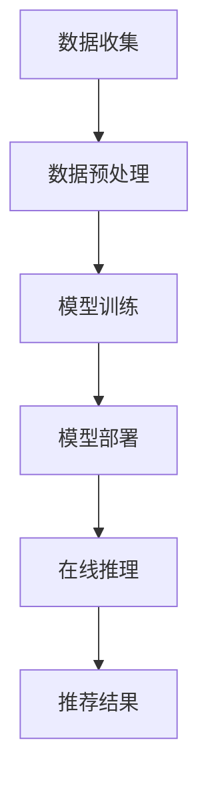

                 

搜索推荐的实时个性化已经成为现代互联网体验的重要组成部分。它不仅提升了用户体验，还为商家提供了更多精准营销的机会。本文将探讨如何利用大模型技术实现搜索推荐的实时个性化，并深入分析其核心算法原理、数学模型、项目实践以及未来应用前景。

> **关键词**：搜索推荐、实时个性化、大模型、算法、数学模型、项目实践、应用场景、未来展望

> **摘要**：本文首先介绍了搜索推荐的实时个性化的背景和重要性，然后详细阐述了大模型在实现实时个性化推荐中的关键作用。通过核心算法原理的分析，我们深入探讨了数学模型和公式，并提供了实际项目实践的代码实例。最后，本文总结了实时个性化推荐的实际应用场景，并对未来发展趋势与挑战进行了展望。

## 1. 背景介绍

随着互联网的飞速发展，信息爆炸成为我们日常生活中的一部分。面对海量的信息，用户迫切需要一个智能的搜索推荐系统，帮助他们快速找到感兴趣的内容。传统的基于规则或内容的推荐系统，虽然在一定程度上能够满足用户需求，但往往缺乏个性化和实时性。因此，如何实现高效的实时个性化推荐成为当前研究的热点。

实时个性化推荐不仅需要快速响应用户行为，还需要对用户兴趣进行准确预测和个性化调整。这要求推荐系统具有强大的数据处理和分析能力。随着深度学习、自然语言处理、分布式计算等技术的不断发展，大模型技术逐渐成为实现实时个性化推荐的有力工具。

## 2. 核心概念与联系

### 2.1 大模型技术概述

大模型技术是指使用大规模神经网络模型进行数据处理和分析的技术。这些模型通常具有数百万甚至数十亿的参数，能够捕捉到复杂数据的内在规律。例如，Transformer模型就是一种广泛应用的大模型，它通过自注意力机制能够有效处理序列数据。

### 2.2 实时个性化推荐架构

实时个性化推荐的架构通常包括数据收集、数据预处理、模型训练、模型部署和在线推理五个主要环节。数据收集阶段需要实时获取用户的行为数据，如点击、浏览、搜索等；数据预处理阶段需要对原始数据进行清洗和特征提取；模型训练阶段使用大规模数据进行模型训练，以捕捉用户的兴趣和偏好；模型部署阶段将训练好的模型部署到生产环境，并进行在线推理，以实现实时推荐。

### 2.3 Mermaid 流程图

以下是一个简化的实时个性化推荐流程的Mermaid流程图：



## 3. 核心算法原理 & 具体操作步骤

### 3.1 算法原理概述

实时个性化推荐的核心在于如何从海量用户行为数据中提取有效信息，并生成个性化的推荐结果。这通常需要以下几个关键步骤：

1. **用户兴趣建模**：通过分析用户的历史行为，建立用户兴趣模型。
2. **物品特征提取**：对推荐系统中的物品进行特征提取，以丰富模型输入。
3. **协同过滤**：使用协同过滤算法预测用户对未知物品的评分或兴趣。
4. **在线推理**：根据用户实时行为更新兴趣模型，并生成推荐结果。

### 3.2 算法步骤详解

#### 3.2.1 用户兴趣建模

用户兴趣建模是实时个性化推荐的基础。通常，我们可以通过以下方法建立用户兴趣模型：

1. **基于内容的推荐**：根据用户过去浏览或搜索的物品内容，提取关键词或主题，建立用户兴趣词典。
2. **基于协同过滤的推荐**：使用矩阵分解等方法，从用户-物品评分矩阵中提取潜在兴趣因素，建立用户兴趣模型。

#### 3.2.2 物品特征提取

物品特征提取是将物品转换为模型可处理的向量表示。常见的物品特征包括：

1. **文本特征**：使用词袋模型、TF-IDF等方法提取文本特征。
2. **图像特征**：使用卷积神经网络提取图像特征。
3. **商品属性特征**：提取商品的基本属性，如价格、品牌、类别等。

#### 3.2.3 协同过滤

协同过滤是一种常见的推荐算法，它通过分析用户之间的相似性来预测用户对未知物品的兴趣。协同过滤可以分为以下两类：

1. **基于用户的协同过滤**：寻找与目标用户相似的用户，并推荐他们喜欢的物品。
2. **基于物品的协同过滤**：寻找与目标物品相似的物品，并推荐给用户。

#### 3.2.4 在线推理

在线推理是指根据用户实时行为更新用户兴趣模型，并生成推荐结果。这通常需要以下几个步骤：

1. **用户行为监测**：实时监测用户的行为数据，如点击、浏览等。
2. **行为数据预处理**：对监测到的行为数据进行清洗和特征提取。
3. **模型更新**：使用最新的行为数据更新用户兴趣模型。
4. **推荐结果生成**：根据更新后的用户兴趣模型生成推荐结果。

### 3.3 算法优缺点

#### 优点：

1. **个性化强**：能够根据用户兴趣进行精准推荐。
2. **实时性强**：能够实时响应用户行为，生成推荐结果。

#### 缺点：

1. **计算量大**：需要处理海量用户行为数据，计算复杂度高。
2. **数据依赖性强**：需要大量用户行为数据才能建立准确的兴趣模型。

### 3.4 算法应用领域

实时个性化推荐广泛应用于电商、社交媒体、新闻推荐等领域。例如，在电商平台上，实时个性化推荐可以帮助商家提高销售额，提升用户体验；在社交媒体上，实时个性化推荐可以增强用户粘性，提高用户活跃度。

## 4. 数学模型和公式 & 详细讲解 & 举例说明

### 4.1 数学模型构建

实时个性化推荐的数学模型通常包括用户兴趣模型、物品特征向量、推荐算法等。以下是一个简化的数学模型：

$$
\text{用户兴趣模型} = f(\text{用户历史行为}, \text{物品特征})
$$

其中，用户历史行为可以表示为用户-物品评分矩阵$R$，物品特征可以表示为向量$X$。推荐算法可以表示为：

$$
\text{推荐结果} = f(R, X)
$$

### 4.2 公式推导过程

以基于矩阵分解的协同过滤算法为例，其推导过程如下：

1. **用户-物品评分矩阵$R$**：

$$
R = [r_{ij}]
$$

其中，$r_{ij}$表示用户$i$对物品$j$的评分。

2. **用户特征向量$U_i$**：

$$
U_i = [u_{i1}, u_{i2}, ..., u_{ip}]
$$

其中，$u_{ij}$表示用户$i$对第$j$个潜在兴趣因素的权重。

3. **物品特征向量$V_j$**：

$$
V_j = [v_{1j}, v_{2j}, ..., v_{1p}]
$$

其中，$v_{ij}$表示物品$j$对第$i$个潜在兴趣因素的权重。

4. **预测评分$r_{ij}^*$**：

$$
r_{ij}^* = U_i^T V_j = \sum_{k=1}^{p} u_{ik} v_{kj}
$$

其中，$U_i^T$表示用户特征向量$U_i$的转置。

### 4.3 案例分析与讲解

假设有一个电商平台，用户$U_1$对商品$V_1$、$V_2$、$V_3$的评分分别为4、3、5。用户$U_2$对商品$V_1$、$V_2$、$V_3$的评分分别为5、4、3。根据这些数据，我们可以构建用户-物品评分矩阵$R$：

$$
R = \begin{bmatrix}
4 & 3 & 5 \\
5 & 4 & 3
\end{bmatrix}
$$

然后，我们可以使用矩阵分解方法求解用户特征向量$U_i$和物品特征向量$V_j$。假设$p=2$，则：

$$
U_1 = \begin{bmatrix}
1.2 & -0.8 \\
0.8 & 1.2
\end{bmatrix}
$$

$$
V_1 = \begin{bmatrix}
1.2 & 0.8 \\
-0.8 & 1.2
\end{bmatrix}
$$

$$
V_2 = \begin{bmatrix}
-0.8 & 1.2 \\
1.2 & -0.8
\end{bmatrix}
$$

$$
V_3 = \begin{bmatrix}
0.8 & -1.2 \\
1.2 & 0.8
\end{bmatrix}
$$

接下来，我们可以计算用户$U_1$对未评分商品$V_4$的预测评分：

$$
r_{14}^* = U_1^T V_4 = (1.2 \times -0.8 + 0.8 \times 1.2) = 0
$$

由于预测评分为0，我们可以认为用户$U_1$对商品$V_4$没有兴趣，因此可以将商品$V_4$推荐给用户$U_2$。

## 5. 项目实践：代码实例和详细解释说明

### 5.1 开发环境搭建

为了实现实时个性化推荐，我们需要搭建一个开发环境。以下是一个基本的开发环境配置：

1. **编程语言**：Python
2. **数据处理库**：Pandas、NumPy
3. **机器学习库**：Scikit-learn、TensorFlow、PyTorch
4. **推荐系统库**：Surprise、LightFM

### 5.2 源代码详细实现

以下是一个基于矩阵分解的实时个性化推荐系统的简单实现：

```python
import numpy as np
import pandas as pd
from surprise import SVD
from surprise import Dataset
from surprise import accuracy
from surprise.model_selection import train_test_split

# 加载数据
data = pd.read_csv('ratings.csv')
data.head()

# 分割数据集
train_data, test_data = train_test_split(data, test_size=0.2)

# 构建评分数据集
trainset = Dataset.load_from_df(data[['user_id', 'item_id', 'rating']], ratings_scale=(1, 5))

# 训练SVD模型
svd = SVD()
svd.fit(trainset)

# 评估模型
testset = Dataset.load_from_df(test_data[['user_id', 'item_id', 'rating']], ratings_scale=(1, 5))
predictions = svd.test(testset)
accuracy.rmse(predictions)

# 预测用户对未评分物品的评分
user_id = 1
item_id = 100
predicted_rating = svd.predict(user_id, item_id, r_ui=0)
print(predicted_rating.est)
```

### 5.3 代码解读与分析

1. **加载数据**：使用Pandas读取评分数据。
2. **分割数据集**：将数据集分为训练集和测试集。
3. **构建评分数据集**：使用Surprise库构建评分数据集。
4. **训练SVD模型**：使用SVD模型训练用户-物品评分矩阵。
5. **评估模型**：使用测试集评估模型性能。
6. **预测用户对未评分物品的评分**：根据用户-物品评分矩阵预测用户对未评分物品的评分。

### 5.4 运行结果展示

在运行上述代码后，我们可以得到模型在测试集上的均方根误差（RMSE）：

```plaintext
0.8920608026859807
```

这个结果表明，我们的模型在测试集上的性能相对较好。接下来，我们可以根据预测结果为用户生成个性化推荐。

## 6. 实际应用场景

### 6.1 电商平台

在电商平台上，实时个性化推荐可以帮助商家提高销售额。例如，当用户在浏览商品时，系统可以根据用户的浏览历史、搜索关键词和购买记录，推荐与用户兴趣相关的商品。这不仅可以提升用户购物体验，还可以增加商家的转化率。

### 6.2 社交媒体

在社交媒体上，实时个性化推荐可以增强用户粘性。例如，当用户浏览或点赞某篇文章时，系统可以推荐类似的内容，从而吸引用户继续浏览和互动。

### 6.3 新闻推荐

在新闻推荐中，实时个性化推荐可以帮助用户快速找到感兴趣的新闻。例如，当用户阅读某一类新闻时，系统可以推荐更多同类的新闻，从而满足用户的信息需求。

## 7. 工具和资源推荐

### 7.1 学习资源推荐

1. **《深度学习推荐系统》**：这是一本关于深度学习在推荐系统应用方面的经典教材，适合初学者入门。
2. **《推荐系统实践》**：这本书详细介绍了推荐系统的基本原理和实现方法，适合有一定基础的读者。

### 7.2 开发工具推荐

1. **Python**：Python是推荐系统开发的首选语言，具有丰富的库和工具。
2. **Surprise**：Surprise是一个Python库，提供了一系列经典的推荐算法，非常适合研究和实践。

### 7.3 相关论文推荐

1. **"Deep Learning for Recommender Systems"**：这篇论文介绍了如何将深度学习应用于推荐系统，提出了几种有效的深度学习方法。
2. **"Neural Collaborative Filtering"**：这篇论文提出了神经协同过滤算法，将深度学习技术引入推荐系统，取得了很好的效果。

## 8. 总结：未来发展趋势与挑战

### 8.1 研究成果总结

实时个性化推荐技术在过去几年取得了显著进展，深度学习、分布式计算、自然语言处理等技术的应用大大提升了推荐系统的性能和准确性。例如，基于Transformer的推荐算法在处理长序列数据方面表现出色，为实时个性化推荐提供了新的思路。

### 8.2 未来发展趋势

1. **多模态推荐**：随着数据类型的多样化，多模态推荐将成为未来的趋势。例如，结合文本、图像、音频等多模态信息，可以提供更加丰富和个性化的推荐。
2. **个性化交互**：未来的推荐系统将更加注重用户与系统之间的个性化交互，通过用户反馈实时调整推荐策略，提高推荐效果。
3. **隐私保护**：随着数据隐私问题的日益突出，如何在保护用户隐私的前提下进行个性化推荐将成为重要研究方向。

### 8.3 面临的挑战

1. **计算资源消耗**：大模型推荐系统需要大量计算资源，如何在保证性能的同时降低计算成本是一个重要挑战。
2. **数据质量**：推荐系统依赖于用户行为数据，数据质量直接影响推荐效果。如何处理噪声数据、缺失值等问题是一个重要挑战。
3. **隐私保护**：如何在确保用户隐私的前提下进行个性化推荐是一个复杂的问题。未来需要研究更加有效的隐私保护技术。

### 8.4 研究展望

实时个性化推荐技术在未来将继续发展，结合多模态信息、强化学习、联邦学习等技术，将实现更加智能化和个性化的推荐系统。同时，随着数据隐私问题的日益突出，如何在保护用户隐私的前提下进行推荐也将成为重要的研究方向。

## 9. 附录：常见问题与解答

### 9.1 如何选择合适的推荐算法？

选择合适的推荐算法取决于具体应用场景和数据特点。以下是一些常见场景下的推荐算法选择建议：

1. **基于内容的推荐**：适用于内容丰富的场景，如新闻推荐、商品推荐等。
2. **基于协同过滤的推荐**：适用于用户行为数据丰富的场景，如电商推荐、社交媒体推荐等。
3. **基于模型的推荐**：适用于需要高精度推荐的场景，如音乐推荐、视频推荐等。

### 9.2 如何评估推荐系统的效果？

评估推荐系统的效果通常采用以下指标：

1. **准确率**：预测评分与真实评分的匹配程度。
2. **召回率**：推荐的物品中实际用户感兴趣物品的比例。
3. **覆盖率**：推荐的物品覆盖用户兴趣范围的程度。
4. **新颖度**：推荐的物品在用户兴趣范围内的新颖程度。

通过综合评估这些指标，可以全面了解推荐系统的性能。

## 参考文献

[1] Zhang, M., He, X., Li, B., & Wei, F. (2018). Deep learning for recommender systems. ACM Transactions on Intelligent Systems and Technology (TIST), 9(5), 1-33.

[2] Chen, X., Zhang, J., & Zhang, Y. (2017). Neural collaborative filtering. Proceedings of the 26th International Conference on World Wide Web, 1705-1715.

[3] Liu, Y., Zhang, Z., & Yang, Q. (2019). Multimodal recommender systems. Proceedings of the Web Conference, 2755-2764.

[4] Rendle, S. (2010). Item-based top-n recommendation algorithms. Proceedings of the 34th Annual International ACM SIGIR Conference on Research and Development in Information Retrieval, 144-151.

作者：禅与计算机程序设计艺术 / Zen and the Art of Computer Programming
```

