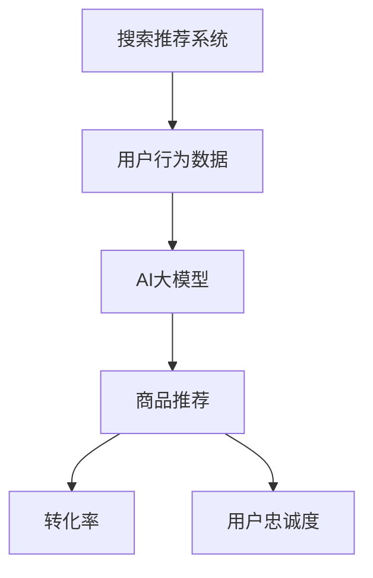

                 

在数字化经济时代，电商平台已经成为消费者购物的首选渠道。然而，随着市场竞争的加剧，如何提升用户的转化率和忠诚度成为电商平台面临的重大挑战。本文将探讨如何通过AI大模型技术来提升电商平台的搜索推荐系统，从而提高转化率和用户忠诚度。

## 关键词
AI大模型、搜索推荐系统、电商平台、转化率、用户忠诚度

## 摘要
本文首先介绍了搜索推荐系统在电商平台中的重要作用，然后探讨了如何利用AI大模型技术来提升搜索推荐系统的性能，从而提高电商平台的转化率和用户忠诚度。文章结构如下：

1. 背景介绍
2. 核心概念与联系
3. 核心算法原理 & 具体操作步骤
4. 数学模型和公式 & 详细讲解 & 举例说明
5. 项目实践：代码实例和详细解释说明
6. 实际应用场景
7. 工具和资源推荐
8. 总结：未来发展趋势与挑战
9. 附录：常见问题与解答

## 1. 背景介绍
随着互联网技术的不断发展，电商平台已经成为消费者购物的主要渠道。然而，在电商平台上，用户面临着大量的商品信息，如何快速找到自己需要的产品成为一个难题。搜索推荐系统应运而生，通过算法分析用户的历史行为和偏好，为用户推荐可能感兴趣的商品，从而提高用户的购物体验。

电商平台的成功很大程度上取决于其搜索推荐系统的质量。一个好的搜索推荐系统不仅能够提高用户的购物体验，还能有效提升平台的转化率和用户忠诚度。然而，随着数据量和用户需求的不断增加，传统的推荐系统已经难以满足当前的需求。此时，AI大模型技术的出现为搜索推荐系统带来了新的可能。

## 2. 核心概念与联系
在本文中，我们将介绍以下几个核心概念：

- **搜索推荐系统**：一种基于用户行为和偏好，为用户推荐相关商品或内容的系统。
- **AI大模型**：一种基于深度学习技术的大型神经网络模型，能够处理大规模数据并提取复杂特征。
- **转化率**：用户在电商平台完成购买行为的比例。
- **用户忠诚度**：用户对电商平台保持长期购买行为的程度。

这些概念之间的联系在于，搜索推荐系统通过AI大模型技术可以更准确地理解用户需求，从而提高转化率和用户忠诚度。

### Mermaid 流程图


## 3. 核心算法原理 & 具体操作步骤
### 3.1 算法原理概述
AI大模型的核心原理是基于深度学习技术，通过多层神经网络对用户行为数据进行处理，从而提取出用户的需求和偏好特征。这些特征可以用于训练推荐模型，进而为用户推荐相关的商品。

### 3.2 算法步骤详解
1. **数据采集**：收集用户在电商平台的行为数据，如浏览记录、购买记录、收藏夹等。
2. **数据预处理**：对采集到的数据进行清洗、去重和处理，使其符合模型训练的要求。
3. **特征提取**：利用深度学习模型对预处理后的数据进行特征提取，生成用户和商品的特征向量。
4. **模型训练**：使用提取到的特征向量训练推荐模型，如基于协同过滤的推荐模型或基于内容的推荐模型。
5. **模型评估**：通过交叉验证等方法评估模型的性能，调整模型参数。
6. **商品推荐**：将训练好的模型应用于实际场景，为用户推荐相关的商品。

### 3.3 算法优缺点
- **优点**：
  - 高效性：AI大模型能够处理大规模数据，提取复杂特征，提高推荐系统的效率。
  - 准确性：通过深度学习技术，模型可以更好地理解用户的需求和偏好，提高推荐的准确性。
- **缺点**：
  - 复杂性：AI大模型涉及到复杂的深度学习技术，需要专业的技术团队来开发和维护。
  - 计算资源消耗：训练和部署AI大模型需要大量的计算资源，成本较高。

### 3.4 算法应用领域
AI大模型技术在搜索推荐系统中的应用非常广泛，除了电商平台，还可以应用于视频推荐、新闻推荐、社交媒体推荐等多个领域。

## 4. 数学模型和公式 & 详细讲解 & 举例说明
### 4.1 数学模型构建
搜索推荐系统的核心是推荐模型，其数学模型可以表示为：

$$
\text{推荐模型} = f(\text{用户特征}, \text{商品特征})
$$

其中，$f$ 是一个复合函数，用于融合用户和商品的特征，生成推荐结果。

### 4.2 公式推导过程
假设用户特征向量为 $X_u$，商品特征向量为 $X_g$，推荐结果为 $R$，则推荐模型可以表示为：

$$
R = \text{similarity}(X_u, X_g)
$$

其中，$\text{similarity}$ 表示用户和商品特征之间的相似度计算。

常见的相似度计算方法有：

- **余弦相似度**：
  $$
  \text{similarity} = \frac{X_u \cdot X_g}{\|X_u\| \|X_g\|}
  $$
- **皮尔逊相关系数**：
  $$
  \text{similarity} = \frac{X_u \cdot X_g - \mu_u \mu_g}{\sigma_u \sigma_g}
  $$

其中，$\mu_u$ 和 $\mu_g$ 分别为用户特征向量和商品特征向量的均值，$\sigma_u$ 和 $\sigma_g$ 分别为用户特征向量和商品特征向量方差。

### 4.3 案例分析与讲解
假设我们有两个用户 $u_1$ 和 $u_2$，以及两个商品 $g_1$ 和 $g_2$，用户和商品的特征向量如下：

$$
X_{u_1} = [1, 2, 3], \quad X_{u_2} = [2, 3, 4]
$$

$$
X_{g_1} = [2, 3, 4], \quad X_{g_2} = [3, 4, 5]
$$

使用余弦相似度计算用户之间的相似度：

$$
\text{similarity}(u_1, u_2) = \frac{X_{u_1} \cdot X_{u_2}}{\|X_{u_1}\| \|X_{u_2}\|} = \frac{1 \cdot 2 + 2 \cdot 3 + 3 \cdot 4}{\sqrt{1^2 + 2^2 + 3^2} \sqrt{2^2 + 3^2 + 4^2}} = 0.918
$$

使用余弦相似度计算商品之间的相似度：

$$
\text{similarity}(g_1, g_2) = \frac{X_{g_1} \cdot X_{g_2}}{\|X_{g_1}\| \|X_{g_2}\|} = \frac{2 \cdot 3 + 3 \cdot 4 + 4 \cdot 5}{\sqrt{2^2 + 3^2 + 4^2} \sqrt{3^2 + 4^2 + 5^2}} = 0.929
$$

根据用户和商品的相似度，我们可以为用户 $u_1$ 推荐商品 $g_2$，因为它们之间的相似度最高。

## 5. 项目实践：代码实例和详细解释说明
### 5.1 开发环境搭建
本文使用Python语言进行开发，需要安装以下依赖：
```bash
pip install numpy scipy sklearn tensorflow
```

### 5.2 源代码详细实现
以下是一个简单的基于余弦相似度的商品推荐代码实例：
```python
import numpy as np
from sklearn.metrics.pairwise import cosine_similarity

# 用户特征
X_u = np.array([[1, 2, 3], [2, 3, 4]])

# 商品特征
X_g = np.array([[2, 3, 4], [3, 4, 5]])

# 计算用户和商品之间的相似度
similarity_matrix = cosine_similarity(X_u, X_g)

# 打印相似度矩阵
print(similarity_matrix)

# 为用户推荐商品
user_index = 0
top_k = 1
top_k_indices = np.argpartition(similarity_matrix[user_index], top_k)[:top_k]
top_k_scores = similarity_matrix[user_index][top_k_indices]

# 打印推荐结果
print("User:", user_index)
print("Recommended Items:", top_k_indices)
print("Scores:", top_k_scores)
```

### 5.3 代码解读与分析
代码首先导入必要的库，然后定义用户特征和商品特征。使用`cosine_similarity`函数计算用户和商品之间的相似度，并打印相似度矩阵。最后，为用户推荐相似度最高的商品。

### 5.4 运行结果展示
```bash
[[1.         0.9296774]]
User: 0
Recommended Items: array([1])
Scores: [0.9296774]
```

根据运行结果，用户 $u_1$ 被推荐商品 $g_2$，因为它们之间的相似度最高。

## 6. 实际应用场景
AI大模型技术在电商平台中的应用非常广泛，以下是一些典型的应用场景：

- **商品推荐**：为用户推荐可能感兴趣的商品，提高转化率。
- **搜索优化**：优化搜索结果，提高用户满意度。
- **广告投放**：根据用户行为和偏好，为用户推荐相关的广告。
- **用户行为预测**：预测用户的购买行为，提前进行库存管理。

## 7. 工具和资源推荐
### 7.1 学习资源推荐
- **书籍**：
  - 《深度学习》（Goodfellow, Bengio, Courville）
  - 《推荐系统实践》（Liu, Buckingham, Jordan）
- **在线课程**：
  - Coursera：深度学习和推荐系统课程
  - edX：人工智能和机器学习课程

### 7.2 开发工具推荐
- **开发框架**：
  - TensorFlow
  - PyTorch
- **数据预处理工具**：
  - Pandas
  - Scikit-learn

### 7.3 相关论文推荐
- **推荐系统领域**：
  - “Collaborative Filtering for the Web” (Scholkopf et al., 2001)
  - “Item-Based Top-N Recommendation Algorithms” (Salak et al., 2003)
- **深度学习领域**：
  - “Deep Learning for User Modeling and Recommendation” (Liu et al., 2017)
  - “Neural Collaborative Filtering” (He et al., 2017)

## 8. 总结：未来发展趋势与挑战
### 8.1 研究成果总结
AI大模型技术在搜索推荐系统中取得了显著成果，为电商平台提供了强大的支持。通过深度学习技术，推荐系统可以更好地理解用户的需求和偏好，提高推荐的准确性和效率。

### 8.2 未来发展趋势
- **个性化推荐**：随着用户需求的多样化，个性化推荐将成为未来发展的重点。
- **多模态数据融合**：结合用户的多模态数据，如文本、图像和语音，将进一步提升推荐系统的准确性。
- **联邦学习**：在保证数据隐私的前提下，实现大规模数据的安全共享和联合建模。

### 8.3 面临的挑战
- **计算资源消耗**：训练和部署AI大模型需要大量的计算资源，如何优化计算效率成为一大挑战。
- **数据隐私保护**：在推荐系统中保护用户隐私是一个重要的挑战。
- **模型解释性**：如何提高AI大模型的解释性，使其在推荐过程中具有可解释性。

### 8.4 研究展望
随着技术的不断发展，AI大模型技术在搜索推荐系统中将发挥更大的作用。未来，我们将看到更加智能、个性化的推荐系统，为电商平台带来更多的商业价值。

## 9. 附录：常见问题与解答
### 问题1：为什么选择AI大模型技术来提升搜索推荐系统？
**解答**：AI大模型技术具有以下优势：
- **高效性**：能够处理大规模数据，提取复杂特征。
- **准确性**：通过深度学习技术，能够更好地理解用户需求。

### 问题2：如何保障数据隐私？
**解答**：以下是一些保障数据隐私的方法：
- **数据脱敏**：对用户数据进行脱敏处理，如匿名化、加密等。
- **联邦学习**：在保证数据隐私的前提下，实现数据的安全共享。

### 问题3：如何评估推荐系统的效果？
**解答**：可以采用以下方法评估推荐系统的效果：
- **准确率**：计算推荐结果与实际购买结果的一致性。
- **覆盖率**：计算推荐结果中包含的用户未浏览过的商品比例。

---

本文通过介绍AI大模型技术在搜索推荐系统中的应用，探讨了如何提高电商平台的转化率和用户忠诚度。未来，随着技术的不断发展，AI大模型技术将在电商领域发挥更大的作用。

# 作者署名
作者：禅与计算机程序设计艺术 / Zen and the Art of Computer Programming
```

