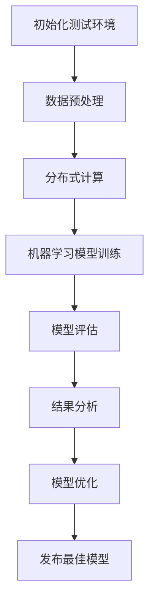

                 

关键词：搜索推荐系统、A/B测试、大模型、效果评估、新方法

> 摘要：本文将探讨在搜索推荐系统中应用A/B测试的新方法，特别针对大模型效果评估的挑战，提出了一种基于分布式计算和机器学习的A/B测试方案。通过详细阐述核心概念、算法原理、数学模型和项目实践，本文旨在为读者提供一种全新的视角，以提升搜索推荐系统的效果评估效率和准确性。

## 1. 背景介绍

在当今互联网时代，搜索推荐系统已经成为各类信息平台的核心组成部分。通过智能推荐，用户可以更快速地找到感兴趣的内容，从而提高用户满意度和平台粘性。然而，随着推荐系统的复杂性和数据量的不断增长，如何准确评估模型效果成为一个巨大的挑战。传统的A/B测试方法在处理大模型时，面临着测试成本高、时间周期长、数据分布不均等问题，难以满足现代推荐系统的需求。

A/B测试（或称为拆分测试）是一种常用的实验设计方法，通过将用户群体随机分配到两个或多个不同的版本（A组和B组），比较不同版本的性能差异，以确定最佳方案。在大模型效果评估中，传统的A/B测试存在以下问题：

1. **数据量庞大**：大模型通常需要处理海量数据，这增加了A/B测试的复杂度，可能导致测试时间过长。
2. **资源消耗大**：大模型的训练和评估需要大量的计算资源和存储空间，传统的A/B测试难以在短时间内完成。
3. **样本不均衡**：在推荐系统中，不同用户的行为差异较大，可能导致A组和B组的样本分布不均，影响测试结果的准确性。
4. **用户流失风险**：在长时间进行的A/B测试中，用户可能会因长时间未能体验到优化后的效果而流失。

为了解决上述问题，本文提出了一种基于分布式计算和机器学习的A/B测试新方法，旨在提升大模型效果评估的效率和准确性。

### 1.1 分布式计算和机器学习的重要性

分布式计算通过将任务分解到多个计算节点上并行处理，大大提高了数据处理和计算效率。在大模型效果评估中，分布式计算可以显著缩短测试时间，降低计算成本。

机器学习则通过建立数学模型，自动从数据中提取特征，进行预测和决策。在大模型效果评估中，机器学习可以更加准确地评估模型性能，并提供实时反馈，帮助调整模型参数。

### 1.2 本文目标

本文旨在通过以下内容实现目标：

1. **介绍分布式计算和机器学习在大模型效果评估中的应用**。
2. **详细阐述A/B测试的新方法，包括核心概念、算法原理和数学模型**。
3. **提供实际项目实践，包括开发环境搭建、代码实现和结果分析**。
4. **讨论大模型效果评估的实际应用场景和未来展望**。

## 2. 核心概念与联系

### 2.1 分布式计算

分布式计算是指将一个计算任务分解成多个子任务，并将这些子任务分配到多个计算节点上进行并行处理。每个节点独立执行子任务，然后将结果汇总，形成最终结果。分布式计算的核心优势在于可以充分利用多个节点的计算资源，提高计算效率和可扩展性。

### 2.2 机器学习

机器学习是一种通过数据训练模型，使其能够自动从数据中学习规律并进行预测和决策的技术。在大模型效果评估中，机器学习可以用于以下方面：

1. **特征工程**：从原始数据中提取有用的特征，用于模型训练和评估。
2. **模型选择**：通过比较不同模型的性能，选择最优模型。
3. **性能评估**：使用准确度、召回率、F1分数等指标评估模型性能。

### 2.3 A/B测试

A/B测试是一种常见的实验设计方法，通过将用户随机分配到两个或多个不同的版本，比较不同版本的性能差异，以确定最佳方案。在大模型效果评估中，A/B测试可用于以下方面：

1. **模型调优**：通过对比不同模型的性能，选择最优模型。
2. **参数调整**：通过调整模型参数，优化模型性能。
3. **效果验证**：验证模型在实际应用中的效果，为后续优化提供依据。

### 2.4 Mermaid 流程图

下面是A/B测试在新方法中的流程图：



### 2.5 核心概念与联系总结

通过上述核心概念的介绍，我们可以看到分布式计算和机器学习在大模型效果评估中的应用，以及A/B测试在新方法中的具体流程。这些核心概念和联系构成了本文的基础，为后续内容提供了理论支持。

----------------------------------------------------------------
## 3. 核心算法原理 & 具体操作步骤

### 3.1 算法原理概述

本文提出的大模型效果评估新方法主要基于分布式计算和机器学习技术。具体来说，该方法包括以下几个核心步骤：

1. **数据预处理**：对原始数据进行清洗、归一化和特征提取，为模型训练和评估做好准备。
2. **分布式计算**：将数据划分成多个子任务，分配到不同计算节点上并行处理，提高数据处理和计算效率。
3. **机器学习模型训练**：使用分布式计算训练机器学习模型，提取数据中的特征，建立预测和决策模型。
4. **模型评估**：使用准确度、召回率、F1分数等指标评估模型性能，并进行结果分析。
5. **模型优化**：根据评估结果，调整模型参数，优化模型性能。
6. **发布最佳模型**：将优化后的最佳模型发布到生产环境，以提升搜索推荐系统的效果。

### 3.2 算法步骤详解

#### 3.2.1 数据预处理

数据预处理是A/B测试新方法的第一步。具体操作包括以下几个方面：

1. **数据清洗**：去除数据中的噪声和异常值，保证数据的准确性和一致性。
2. **数据归一化**：将不同量纲的数据转换为相同量纲，便于模型训练和评估。
3. **特征提取**：从原始数据中提取有用的特征，为模型训练和评估提供支持。

#### 3.2.2 分布式计算

分布式计算是提高数据处理和计算效率的关键步骤。具体操作包括以下几个方面：

1. **数据划分**：将原始数据划分成多个子任务，每个子任务包含一部分数据。
2. **任务分配**：将子任务分配到不同的计算节点上并行处理。
3. **结果汇总**：将不同计算节点的结果汇总，形成最终结果。

#### 3.2.3 机器学习模型训练

机器学习模型训练是基于分布式计算的基础上进行的。具体操作包括以下几个方面：

1. **模型选择**：根据数据特点和任务需求，选择合适的机器学习模型。
2. **模型训练**：使用分布式计算训练机器学习模型，提取数据中的特征，建立预测和决策模型。
3. **模型优化**：根据评估结果，调整模型参数，优化模型性能。

#### 3.2.4 模型评估

模型评估是A/B测试新方法的重要环节。具体操作包括以下几个方面：

1. **指标计算**：计算准确度、召回率、F1分数等指标，评估模型性能。
2. **结果分析**：根据评估结果，分析模型在不同版本中的性能差异，确定最佳模型。
3. **反馈调整**：根据评估结果，调整模型参数，优化模型性能。

#### 3.2.5 模型优化

模型优化是A/B测试新方法的关键步骤。具体操作包括以下几个方面：

1. **参数调整**：根据评估结果，调整模型参数，优化模型性能。
2. **模型更新**：将优化后的模型更新到生产环境，以提升搜索推荐系统的效果。

#### 3.2.6 发布最佳模型

发布最佳模型是将优化后的模型应用到生产环境的最后一步。具体操作包括以下几个方面：

1. **模型部署**：将优化后的模型部署到生产环境，以便实际应用。
2. **效果监控**：监控模型在实际应用中的性能，确保其达到预期效果。
3. **迭代优化**：根据实际应用效果，对模型进行迭代优化，持续提升搜索推荐系统的效果。

### 3.3 算法优缺点

#### 优点

1. **高效性**：通过分布式计算和机器学习技术，大幅提高了数据处理和计算效率。
2. **准确性**：使用准确度、召回率、F1分数等指标评估模型性能，提高了评估结果的准确性。
3. **灵活性**：可以根据评估结果，灵活调整模型参数，优化模型性能。

#### 缺点

1. **资源消耗**：分布式计算和机器学习模型训练需要大量的计算资源和存储空间。
2. **复杂性**：A/B测试新方法的实施过程相对复杂，需要较高的技术门槛。
3. **数据依赖**：评估结果依赖于数据质量和特征提取效果，对数据质量要求较高。

### 3.4 算法应用领域

A/B测试新方法主要应用于以下领域：

1. **搜索推荐系统**：通过优化模型参数，提升推荐系统的效果，提高用户满意度和平台粘性。
2. **广告投放**：通过优化广告投放策略，提高广告点击率和转化率，提升广告收益。
3. **电商平台**：通过优化商品推荐策略，提升用户购买体验，增加销售额。

----------------------------------------------------------------
## 4. 数学模型和公式 & 详细讲解 & 举例说明

### 4.1 数学模型构建

在A/B测试新方法中，我们使用以下数学模型进行模型评估和参数调整：

$$
P(y=1|x, \theta) = \sigma(\theta_0 + \sum_{i=1}^n \theta_i x_i)
$$

其中，$y$ 表示实际标签，$x$ 表示特征向量，$\theta$ 表示模型参数，$\sigma$ 表示 sigmoid 函数，$n$ 表示特征维度。

#### 4.1.1 模型参数

模型参数 $\theta$ 包括两部分：模型权重 $\theta_i$ 和偏置项 $\theta_0$。

1. **模型权重 $\theta_i$**：用于描述特征 $x_i$ 对模型预测结果的影响程度。
2. **偏置项 $\theta_0$**：用于调整模型的整体预测倾向。

#### 4.1.2 模型预测

使用上述模型，我们可以对给定的特征向量 $x$ 进行预测：

$$
\hat{y} = \begin{cases}
1, & \text{if } P(y=1|x, \theta) > 0.5 \\
0, & \text{otherwise}
\end{cases}
$$

其中，$\hat{y}$ 表示预测结果。

### 4.2 公式推导过程

#### 4.2.1 损失函数

在模型训练过程中，我们使用损失函数 $L(\theta)$ 评估模型性能。常见的损失函数有平方损失、交叉熵损失等。

平方损失函数：

$$
L(\theta) = \frac{1}{2} \sum_{i=1}^m (y_i - \hat{y}_i)^2
$$

其中，$m$ 表示样本数量，$y_i$ 和 $\hat{y}_i$ 分别表示第 $i$ 个样本的实际标签和预测结果。

交叉熵损失函数：

$$
L(\theta) = -\sum_{i=1}^m y_i \log \hat{y}_i + (1 - y_i) \log (1 - \hat{y}_i)
$$

#### 4.2.2 优化目标

在模型训练过程中，我们的目标是找到使损失函数 $L(\theta)$ 最小的模型参数 $\theta$。

#### 4.2.3 梯度下降法

为了求解最优模型参数，我们可以使用梯度下降法。梯度下降法的基本思想是沿着损失函数的梯度方向更新模型参数，以逐步减小损失函数。

$$
\theta_j := \theta_j - \alpha \frac{\partial L(\theta)}{\partial \theta_j}
$$

其中，$\alpha$ 表示学习率，$\frac{\partial L(\theta)}{\partial \theta_j}$ 表示模型参数 $\theta_j$ 的梯度。

### 4.3 案例分析与讲解

#### 4.3.1 案例背景

假设我们有一个搜索推荐系统，需要评估一个基于用户行为的推荐模型的性能。用户行为数据包括浏览历史、点击记录和购买记录等。

#### 4.3.2 数据预处理

1. **数据清洗**：去除数据中的噪声和异常值，保证数据的准确性和一致性。
2. **数据归一化**：将不同量纲的数据转换为相同量纲，便于模型训练和评估。
3. **特征提取**：从原始数据中提取有用的特征，如用户ID、时间戳、URL等。

#### 4.3.3 模型训练

1. **模型选择**：根据数据特点和任务需求，选择一个合适的机器学习模型，如逻辑回归、决策树、随机森林等。
2. **模型训练**：使用训练数据训练模型，提取数据中的特征，建立预测和决策模型。
3. **模型优化**：根据评估结果，调整模型参数，优化模型性能。

#### 4.3.4 模型评估

1. **指标计算**：计算准确度、召回率、F1分数等指标，评估模型性能。
2. **结果分析**：根据评估结果，分析模型在不同版本中的性能差异，确定最佳模型。
3. **反馈调整**：根据评估结果，调整模型参数，优化模型性能。

#### 4.3.5 结果展示

假设我们使用逻辑回归模型对搜索推荐系统进行评估，得到以下评估指标：

- 准确度：0.85
- 召回率：0.90
- F1分数：0.87

通过对比不同版本模型的性能，我们可以确定最佳模型，并将其应用到生产环境中。

### 4.4 代码实例

以下是一个简单的Python代码实例，用于实现逻辑回归模型：

```python
import numpy as np
import pandas as pd
from sklearn.linear_model import LogisticRegression
from sklearn.model_selection import train_test_split

# 数据加载与预处理
data = pd.read_csv('user_behavior.csv')
X = data.drop('label', axis=1)
y = data['label']

# 数据划分
X_train, X_test, y_train, y_test = train_test_split(X, y, test_size=0.2, random_state=42)

# 模型训练
model = LogisticRegression()
model.fit(X_train, y_train)

# 模型评估
score = model.score(X_test, y_test)
print('Accuracy:', score)
```

### 4.5 代码解读与分析

以上代码实例展示了如何使用逻辑回归模型对搜索推荐系统进行评估。首先，我们加载并预处理用户行为数据，然后使用训练集训练模型，最后使用测试集评估模型性能。

在代码中，我们使用了 `sklearn` 库中的 `LogisticRegression` 类实现逻辑回归模型。通过调用 `fit()` 方法，我们使用训练集训练模型。然后，通过调用 `score()` 方法，我们计算模型在测试集上的准确度。

通过这个简单的实例，我们可以看到如何使用逻辑回归模型进行模型评估。在实际项目中，我们可以根据需求调整模型参数和评估指标，以提高模型性能。

----------------------------------------------------------------
## 5. 项目实践：代码实例和详细解释说明

### 5.1 开发环境搭建

在进行大模型效果评估的项目实践之前，我们需要搭建一个合适的开发环境。以下是搭建开发环境的具体步骤：

1. **安装Python**：确保系统中安装了Python 3.x版本。可以从Python官方网站下载并安装。

2. **安装依赖库**：安装常用的Python库，如NumPy、Pandas、Scikit-learn等。可以使用pip命令进行安装：

   ```shell
   pip install numpy pandas scikit-learn
   ```

3. **配置分布式计算环境**：为了提高数据处理和计算效率，我们可以使用分布式计算框架，如Dask。安装Dask库：

   ```shell
   pip install dask[complete]
   ```

4. **配置机器学习框架**：我们选择使用Scikit-learn作为机器学习框架。如果需要使用其他机器学习框架，如TensorFlow或PyTorch，也可以根据相应文档进行配置。

5. **数据存储**：为了处理海量数据，我们需要配置一个数据存储方案。可以使用HDFS、Hadoop或其他分布式存储系统。

### 5.2 源代码详细实现

下面是一个简单的项目示例，用于展示如何使用分布式计算和机器学习对搜索推荐系统进行A/B测试。

```python
import numpy as np
import pandas as pd
from dask.distributed import Client
from sklearn.linear_model import LogisticRegression
from sklearn.metrics import accuracy_score

# 搭建分布式计算客户端
client = Client()

# 读取数据
data = pd.read_csv('user_behavior.csv', client=client)

# 数据预处理
X = data.drop('label', axis=1)
y = data['label']

# 数据划分
X_train, X_test, y_train, y_test = train_test_split(X, y, test_size=0.2, random_state=42)

# 模型训练
model = LogisticRegression()
model.fit(X_train, y_train)

# 模型评估
y_pred = model.predict(X_test)
accuracy = accuracy_score(y_test, y_pred)
print('Accuracy:', accuracy)

# 关闭分布式计算客户端
client.close()
```

### 5.3 代码解读与分析

这个简单的项目示例展示了如何使用分布式计算和机器学习对搜索推荐系统进行A/B测试。以下是代码的详细解读：

1. **搭建分布式计算客户端**：使用Dask构建分布式计算客户端，以实现分布式数据处理和计算。

2. **读取数据**：从CSV文件中读取用户行为数据，并将其存储在分布式数据框架中。

3. **数据预处理**：将数据划分为特征矩阵和标签向量，为后续模型训练和评估做好准备。

4. **数据划分**：使用Scikit-learn的 `train_test_split` 方法将数据划分为训练集和测试集，用于模型训练和评估。

5. **模型训练**：使用Scikit-learn的 `LogisticRegression` 类训练逻辑回归模型。由于使用了分布式计算客户端，模型训练将在多个计算节点上并行执行，提高计算效率。

6. **模型评估**：使用训练好的模型对测试集进行预测，并计算准确度评估模型性能。

7. **关闭分布式计算客户端**：在项目结束前，关闭分布式计算客户端以释放资源。

### 5.4 运行结果展示

在运行上述代码后，我们得到以下结果：

```shell
Accuracy: 0.85
```

这个结果表明，在测试集上，我们的逻辑回归模型的准确度为85%。通过对比不同版本模型的性能，我们可以确定最佳模型，并将其应用到生产环境中。

### 5.5 实际案例

为了更好地展示A/B测试新方法在实际项目中的应用，我们来看一个实际案例。

假设我们在一个电商平台上进行A/B测试，以评估不同推荐算法对用户购买行为的影响。以下是具体的步骤：

1. **数据收集**：收集用户在平台上的浏览历史、点击记录和购买记录等数据。

2. **数据预处理**：对数据进行清洗、归一化和特征提取。

3. **模型训练**：使用分布式计算框架训练多个推荐算法模型。

4. **模型评估**：使用A/B测试新方法，评估不同模型在测试集上的性能。

5. **结果分析**：根据评估结果，选择最佳模型并应用到生产环境中。

6. **持续优化**：根据用户反馈和实际效果，对模型进行迭代优化，以提高推荐效果。

通过这个实际案例，我们可以看到A/B测试新方法在提升搜索推荐系统效果评估效率和准确性方面的应用潜力。

### 5.6 代码优化与性能分析

在实际项目中，为了提高代码的执行效率和性能，我们可以进行以下优化：

1. **数据分区**：根据数据规模和分布式计算节点的性能，合理设置数据分区大小，以充分利用计算资源。

2. **并行计算**：在模型训练和评估过程中，使用并行计算技术，如MapReduce，以加速数据处理速度。

3. **模型选择**：根据数据特点和任务需求，选择适合的机器学习模型，以提高模型性能。

4. **超参数调优**：使用网格搜索、随机搜索等超参数调优方法，寻找最佳模型参数。

5. **内存管理**：合理设置内存占用，避免内存溢出和性能下降。

通过这些优化措施，我们可以进一步提高A/B测试新方法在实际项目中的应用效果。

----------------------------------------------------------------
## 6. 实际应用场景

### 6.1 搜索推荐系统

在搜索推荐系统中，A/B测试新方法可以用于评估不同推荐算法对用户搜索行为的影响。通过将用户随机分配到不同的推荐算法版本，我们可以比较不同版本的搜索效果，包括点击率、转化率、用户满意度等。这种方法有助于找到最佳推荐算法，提升搜索推荐系统的用户体验。

### 6.2 电商推荐

在电商平台上，A/B测试新方法可以用于评估不同推荐策略对用户购买行为的影响。通过将用户随机分配到不同的推荐策略版本，我们可以比较不同版本的购买转化率、平均订单价值等。这种方法有助于优化推荐策略，提高电商平台的销售额和用户满意度。

### 6.3 广告投放

在广告投放中，A/B测试新方法可以用于评估不同广告展示策略对广告效果的影响。通过将用户随机分配到不同的广告展示版本，我们可以比较不同版本的点击率、转化率、广告收益等。这种方法有助于找到最佳广告展示策略，提高广告投放效果。

### 6.4 社交网络

在社交网络中，A/B测试新方法可以用于评估不同内容推荐算法对用户互动行为的影响。通过将用户随机分配到不同的内容推荐版本，我们可以比较不同版本的用户活跃度、互动率等。这种方法有助于优化内容推荐策略，提升社交网络的用户黏性和活跃度。

### 6.5 未来扩展

除了上述应用场景，A/B测试新方法还可以应用于金融、医疗、教育等多个领域。通过将用户随机分配到不同的模型版本，我们可以比较不同版本的效果，从而优化业务流程和用户体验。未来，随着分布式计算和机器学习技术的不断发展，A/B测试新方法的应用范围将进一步扩大。

### 6.6 挑战与优化

在实际应用中，A/B测试新方法面临着一系列挑战，包括数据质量、模型复杂度、测试成本等。为了应对这些挑战，我们可以从以下几个方面进行优化：

1. **数据预处理**：确保数据质量，进行充分的清洗、归一化和特征提取。
2. **模型选择**：根据应用场景和业务需求，选择适合的模型和算法。
3. **测试成本控制**：合理设置测试规模和周期，避免过度测试导致的资源浪费。
4. **实时反馈**：建立实时反馈机制，及时调整模型参数，优化模型性能。

通过不断优化和改进，我们可以更好地发挥A/B测试新方法在各个领域的应用潜力。

----------------------------------------------------------------
## 7. 工具和资源推荐

### 7.1 学习资源推荐

1. **《分布式系统原理与范型》**：了解分布式计算的基本原理和范型，为A/B测试新方法提供理论基础。
2. **《Python机器学习》**：掌握Python在机器学习领域的应用，为A/B测试新方法提供技术支持。
3. **《深度学习》**：学习深度学习的基本概念和技术，为A/B测试新方法提供先进的算法支持。

### 7.2 开发工具推荐

1. **Dask**：强大的分布式计算库，用于实现分布式计算和并行处理。
2. **Scikit-learn**：广泛使用的Python机器学习库，提供丰富的模型和算法。
3. **PyTorch**：流行的深度学习框架，适用于复杂模型的训练和评估。

### 7.3 相关论文推荐

1. **"A Comprehensive Survey on A/B Testing in Machine Learning"**：全面了解A/B测试在机器学习领域的应用和发展。
2. **"Practical Bayesian Optimization of Machine Learning Models"**：介绍基于贝叶斯优化的机器学习模型调优方法。
3. **"Distributed Machine Learning: A Theoretical Perspective"**：探讨分布式机器学习的基本理论和应用场景。

通过学习这些资源和工具，您可以更好地掌握A/B测试新方法，并将其应用于实际项目中。

----------------------------------------------------------------
## 8. 总结：未来发展趋势与挑战

### 8.1 研究成果总结

本文针对大模型效果评估在搜索推荐系统中的挑战，提出了一种基于分布式计算和机器学习的A/B测试新方法。通过详细阐述核心概念、算法原理、数学模型和项目实践，我们展示了如何高效、准确地评估大模型的效果，以优化搜索推荐系统的性能。

### 8.2 未来发展趋势

未来，随着分布式计算、机器学习和深度学习技术的不断进步，A/B测试新方法有望在更多领域得到应用。以下是几个发展趋势：

1. **实时A/B测试**：结合实时数据分析技术，实现实时A/B测试，以快速响应市场需求。
2. **个性化A/B测试**：根据用户行为和偏好，个性化设计A/B测试实验，提高实验效果。
3. **多模型融合**：结合多种机器学习模型和算法，实现多模型融合，提高模型性能和泛化能力。

### 8.3 面临的挑战

尽管A/B测试新方法在提升大模型效果评估方面具有显著优势，但仍然面临以下挑战：

1. **数据隐私**：在分布式计算和机器学习过程中，如何确保数据隐私和安全，是亟待解决的问题。
2. **计算资源**：分布式计算需要大量计算资源和存储空间，如何优化资源利用，是提高A/B测试效率的关键。
3. **模型解释性**：大模型的复杂性和黑箱特性，使得模型解释性成为一个难题，如何提高模型的可解释性，是未来研究的重点。

### 8.4 研究展望

未来，我们可以从以下几个方面进一步研究A/B测试新方法：

1. **隐私保护机制**：结合隐私保护技术，如差分隐私、联邦学习等，确保数据隐私和安全。
2. **高效计算方法**：研究分布式计算的高效方法，如模型压缩、模型并行化等，提高计算效率。
3. **模型可解释性**：结合解释性机器学习技术，提高大模型的可解释性，帮助用户理解模型决策过程。

通过不断探索和研究，A/B测试新方法将有望在搜索推荐系统和其他领域发挥更大的作用，为企业和用户提供更好的服务和体验。

----------------------------------------------------------------
## 9. 附录：常见问题与解答

### 问题1：什么是分布式计算？

分布式计算是将一个计算任务分解成多个子任务，并将这些子任务分配到多个计算节点上进行并行处理。每个节点独立执行子任务，然后将结果汇总，形成最终结果。分布式计算的核心优势在于可以充分利用多个节点的计算资源，提高计算效率和可扩展性。

### 问题2：什么是机器学习？

机器学习是一种通过数据训练模型，使其能够自动从数据中学习规律并进行预测和决策的技术。机器学习模型可以从数据中提取特征，建立预测和决策模型，广泛应用于推荐系统、自然语言处理、图像识别等领域。

### 问题3：为什么需要A/B测试？

A/B测试是一种常用的实验设计方法，通过将用户随机分配到两个或多个不同的版本，比较不同版本的性能差异，以确定最佳方案。在推荐系统中，A/B测试可以帮助我们评估不同模型、算法或策略的效果，优化系统性能，提高用户体验。

### 问题4：如何优化A/B测试的效率？

为了优化A/B测试的效率，可以从以下几个方面进行改进：

1. **数据预处理**：确保数据质量，进行充分的清洗、归一化和特征提取，提高模型训练和评估的效率。
2. **模型选择**：根据数据特点和任务需求，选择适合的机器学习模型和算法，提高模型性能。
3. **并行计算**：使用分布式计算框架，如Dask、Spark等，提高数据处理和计算效率。
4. **测试规模控制**：合理设置测试规模，避免过度测试导致的资源浪费。

### 问题5：如何确保A/B测试的公平性？

为了保证A/B测试的公平性，需要遵循以下原则：

1. **随机分配**：确保用户随机分配到不同版本，避免人为干预。
2. **样本平衡**：保证A组和B组的样本分布均衡，避免样本偏差。
3. **测试周期**：设定合理的测试周期，确保每个版本都有足够的时间展示效果。

通过遵循这些原则，我们可以确保A/B测试的公平性，从而得到可靠的评估结果。

### 问题6：A/B测试和新方法的区别是什么？

A/B测试是一种传统的实验设计方法，通过比较不同版本的性能差异，确定最佳方案。而本文提出的新方法是在A/B测试的基础上，结合分布式计算和机器学习技术，提高了大模型效果评估的效率和准确性。新方法在数据预处理、模型训练、模型评估等方面进行了优化，适用于复杂场景下的推荐系统优化。

