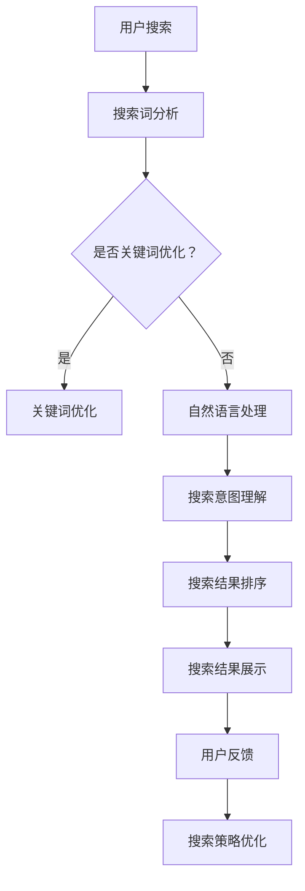

                 

关键词：搜索数据分析、人工智能、电商平台、搜索策略、用户体验、优化

摘要：本文将深入探讨搜索数据分析在电商平台中的应用，以及如何通过人工智能技术来优化搜索策略，从而提升用户的购物体验。我们将从背景介绍、核心概念与联系、核心算法原理、数学模型和公式、项目实践、实际应用场景、未来展望等多个方面展开讨论，旨在为电商行业提供实用的技术参考和策略建议。

## 1. 背景介绍

随着互联网的快速发展，电子商务已经成为现代商业的重要组成部分。电商平台不仅提供了丰富的商品信息，还需要为用户提供高效的搜索服务，以满足用户快速找到心仪商品的需求。然而，用户的需求是多样化的，如何优化搜索策略，提升搜索效果，成为电商平台面临的重要挑战。

传统的搜索技术主要依赖于关键词匹配和文本检索，但这些方法往往无法满足用户个性化的搜索需求。随着人工智能技术的崛起，尤其是深度学习、自然语言处理等技术的进步，搜索数据分析迎来了新的发展机遇。通过引入人工智能技术，电商平台可以实现更加精准、智能的搜索服务，从而提升用户体验，增加用户粘性。

本文将围绕搜索数据分析这一核心主题，详细探讨人工智能在电商平台搜索策略优化中的应用，旨在为电商行业提供有价值的参考。

## 2. 核心概念与联系

### 2.1 搜索数据分析

搜索数据分析是指通过对用户搜索行为的数据进行收集、处理和分析，从而了解用户需求、优化搜索策略、提升搜索效果的过程。搜索数据分析主要包括以下几个方面：

- **用户行为分析**：分析用户的搜索习惯、浏览行为、购买记录等，了解用户的需求和偏好。
- **搜索词分析**：对用户输入的搜索关键词进行统计和分析，挖掘用户的意图和需求。
- **搜索结果分析**：分析搜索结果的展示效果、用户点击率、转化率等，评估搜索策略的有效性。

### 2.2 人工智能

人工智能（Artificial Intelligence，AI）是指通过计算机模拟人类智能行为的技术。人工智能在搜索数据分析中的应用主要包括以下几个方面：

- **自然语言处理**：通过深度学习模型对用户输入的搜索关键词进行语义理解和情感分析，从而更准确地理解用户需求。
- **机器学习**：利用用户历史数据和搜索行为，构建预测模型，预测用户的未来搜索行为和偏好。
- **数据挖掘**：通过对大规模用户数据进行分析，发现潜在的用户需求和模式，为优化搜索策略提供依据。

### 2.3 电商平台搜索策略

电商平台搜索策略是指针对用户搜索行为和需求，制定的一系列优化搜索效果的方法和措施。主要包括以下几个方面：

- **关键词优化**：根据用户搜索词的特点和需求，调整关键词的匹配策略，提高搜索结果的准确性。
- **搜索结果排序**：利用机器学习算法，根据用户历史数据和搜索行为，对搜索结果进行智能排序，提高用户点击率和转化率。
- **个性化推荐**：基于用户的历史数据和搜索行为，为用户提供个性化的搜索结果和商品推荐，满足用户的个性化需求。

### 2.4 Mermaid 流程图

以下是搜索数据分析在电商平台搜索策略优化中的应用流程图：



## 3. 核心算法原理 & 具体操作步骤

### 3.1 算法原理概述

在搜索数据分析中，核心算法主要包括自然语言处理、机器学习、数据挖掘等技术。以下是这些算法的简要原理：

- **自然语言处理**：通过深度学习模型，如循环神经网络（RNN）、长短时记忆网络（LSTM）等，对用户输入的搜索关键词进行语义理解和情感分析，从而更准确地理解用户需求。
- **机器学习**：利用用户历史数据和搜索行为，构建预测模型，如线性回归、决策树、支持向量机等，预测用户的未来搜索行为和偏好。
- **数据挖掘**：通过对大规模用户数据进行分析，发现潜在的用户需求和模式，如关联规则挖掘、聚类分析等。

### 3.2 算法步骤详解

以下是搜索数据分析在电商平台搜索策略优化中的具体操作步骤：

#### 3.2.1 搜索词分析

1. **数据收集**：收集用户在电商平台上的搜索词数据，包括关键词、搜索时间、搜索来源等。
2. **数据预处理**：对搜索词进行去重、分词、词频统计等预处理操作，以便后续分析。
3. **关键词提取**：利用自然语言处理技术，提取用户搜索关键词的语义信息，如词性、词义等。
4. **关键词聚类**：对提取的关键词进行聚类分析，发现用户搜索行为的共性。

#### 3.2.2 搜索意图理解

1. **语义分析**：利用深度学习模型，对用户搜索关键词进行语义理解和情感分析，如识别用户的意图和情感倾向。
2. **意图分类**：根据语义分析结果，对用户的搜索意图进行分类，如查询意图、购买意图等。

#### 3.2.3 搜索结果排序

1. **特征提取**：从用户搜索历史数据和搜索结果中提取相关特征，如搜索频率、用户点击率、商品评分等。
2. **模型构建**：利用机器学习算法，如线性回归、决策树、支持向量机等，构建搜索结果排序模型。
3. **模型训练**：利用用户历史数据对模型进行训练，优化模型参数。
4. **结果排序**：根据训练好的模型，对搜索结果进行智能排序，提高用户点击率和转化率。

#### 3.2.4 搜索策略优化

1. **效果评估**：对搜索策略进行效果评估，如评估用户点击率、转化率等指标。
2. **策略调整**：根据效果评估结果，对搜索策略进行调整和优化，如调整关键词匹配策略、优化搜索结果排序等。

### 3.3 算法优缺点

#### 3.3.1 自然语言处理

**优点**：

- 能够对用户搜索关键词进行语义理解和情感分析，提高搜索准确性。
- 可以处理复杂的语言现象，如歧义、多义词等。

**缺点**：

- 训练模型需要大量的数据和计算资源。
- 对低频词和长尾词的处理效果较差。

#### 3.3.2 机器学习

**优点**：

- 可以根据用户历史数据和搜索行为，预测用户的未来搜索行为和偏好。
- 能够处理大规模数据，提高搜索效率。

**缺点**：

- 需要大量标注数据，数据质量对模型效果有较大影响。
- 模型解释性较差，难以理解模型的决策过程。

#### 3.3.3 数据挖掘

**优点**：

- 可以从大规模数据中发现潜在的用户需求和模式。
- 能够为搜索策略优化提供依据。

**缺点**：

- 对数据质量和数据量的要求较高。
- 挖掘结果往往具有一定的随机性。

### 3.4 算法应用领域

- **电商平台**：优化搜索策略，提高用户点击率和转化率。
- **搜索引擎**：提升搜索准确性，提供更好的用户体验。
- **社交媒体**：分析用户行为，进行内容推荐和广告投放。
- **金融服务**：风险评估和客户关系管理。

## 4. 数学模型和公式 & 详细讲解 & 举例说明

### 4.1 数学模型构建

在搜索数据分析中，常用的数学模型包括概率模型、线性模型、树模型等。以下是几个典型的数学模型及其构建过程：

#### 4.1.1 概率模型

概率模型用于预测用户的搜索行为和偏好。常见的概率模型有伯努利分布、多项式分布等。以下是一个伯努利分布的概率模型构建过程：

1. **样本空间**：定义一个包含所有可能结果的样本空间Ω。
2. **事件**：定义一个事件A，表示用户在某个时间点进行搜索的行为。
3. **概率分布**：根据历史数据，计算事件A发生的概率，即P(A)。

举例说明：

假设用户在过去的30天内进行了100次搜索，其中60次搜索与购物相关，40次搜索与购物无关。则用户进行购物搜索的概率为：

$$
P(A) = \frac{60}{100} = 0.6
$$

#### 4.1.2 线性模型

线性模型用于预测用户的搜索结果排序。常见的线性模型有线性回归、逻辑回归等。以下是一个线性回归模型的构建过程：

1. **特征提取**：从用户搜索历史数据中提取相关特征，如搜索频率、用户点击率、商品评分等。
2. **模型假设**：假设搜索结果排序与特征之间存在线性关系，即
   $$
   y = \beta_0 + \beta_1x_1 + \beta_2x_2 + ... + \beta_nx_n
   $$
   其中，$y$ 表示搜索结果排序得分，$x_1, x_2, ..., x_n$ 表示提取的特征，$\beta_0, \beta_1, \beta_2, ..., \beta_n$ 表示模型的参数。
3. **模型训练**：利用用户历史数据，通过最小化损失函数，求解模型参数。

举例说明：

假设我们提取了两个特征：搜索频率（$x_1$）和用户点击率（$x_2$），则线性回归模型可以表示为：

$$
y = \beta_0 + \beta_1x_1 + \beta_2x_2
$$

通过最小化损失函数，求解出模型参数$\beta_0, \beta_1, \beta_2$，即可预测用户的搜索结果排序。

#### 4.1.3 树模型

树模型用于分类和回归任务。常见的树模型有决策树、随机森林等。以下是一个决策树模型的构建过程：

1. **特征选择**：根据特征的重要性，选择一个特征作为分割特征。
2. **划分节点**：根据分割特征，将数据集划分为两个子集。
3. **重复划分**：对每个子集，重复执行特征选择和划分节点的过程，直到满足停止条件。
4. **建立模型**：根据划分结果，建立决策树模型。

举例说明：

假设我们有两个特征：商品类别（$x_1$）和用户年龄（$x_2$），则决策树模型可以表示为：

```
如果 $x_1 = 1$，则
   如果 $x_2 < 30$，则预测结果为A；
   否则，预测结果为B；
否则，如果 $x_2 < 30$，则预测结果为C；
   否则，预测结果为D。
```

### 4.2 公式推导过程

以下是搜索数据分析中常用的几个数学公式及其推导过程：

#### 4.2.1 概率公式

假设有事件A和B，且它们相互独立，即P(A∩B) = P(A)P(B)，则有以下概率公式：

1. 条件概率公式：
   $$
   P(A|B) = \frac{P(A∩B)}{P(B)}
   $$
2. 全概率公式：
   $$
   P(A) = P(A|B_1)P(B_1) + P(A|B_2)P(B_2) + ... + P(A|B_n)P(B_n)
   $$
3. 贝叶斯公式：
   $$
   P(B|A) = \frac{P(A|B)P(B)}{P(A)}
   $$

#### 4.2.2 线性回归公式

假设线性回归模型为$y = \beta_0 + \beta_1x_1 + \beta_2x_2 + ... + \beta_nx_n$，则有以下推导过程：

1. **损失函数**：选择平方损失函数，即
   $$
   J(\theta) = \frac{1}{2m}\sum_{i=1}^{m}(h_\theta(x^{(i)}) - y^{(i)})^2
   $$
   其中，$m$ 表示样本数量，$h_\theta(x)$ 表示模型的预测值，$\theta$ 表示模型参数。
2. **梯度下降**：对损失函数求导，得到梯度
   $$
   \nabla_\theta J(\theta) = \frac{1}{m}\sum_{i=1}^{m}(h_\theta(x^{(i)}) - y^{(i)})\nabla_\theta h_\theta(x^{(i)})
   $$
   其中，$\nabla_\theta$ 表示对参数$\theta$ 的梯度。
3. **迭代更新**：利用梯度下降法，迭代更新模型参数
   $$
   \theta_j := \theta_j - \alpha\nabla_\theta J(\theta)
   $$
   其中，$\alpha$ 表示学习率。

#### 4.2.3 决策树公式

假设决策树模型为：

```
如果 $x_1 \leq c_1$，则
   如果 $x_2 \leq c_2$，则预测结果为A；
   否则，预测结果为B；
否则，如果 $x_2 \leq c_3$，则预测结果为C；
   否则，预测结果为D。
```

则有以下推导过程：

1. **信息增益**：选择具有最大信息增益的特征进行划分，信息增益公式为
   $$
   IG(D, x_j) = Entropy(D) - \sum_{v_j} P(v_j)Entropy(D_{v_j})
   $$
   其中，$D$ 表示数据集，$x_j$ 表示特征，$v_j$ 表示特征$x_j$ 的取值，$Entropy(D)$ 表示数据集$D$ 的熵。
2. **基尼指数**：选择具有最小基尼指数的特征进行划分，基尼指数公式为
   $$
   Gini(D, x_j) = 1 - \sum_{v_j} P(v_j)^2
   $$
   其中，$P(v_j)$ 表示特征$x_j$ 取值$v_j$ 的概率。

### 4.3 案例分析与讲解

#### 4.3.1 概率模型案例

假设我们有一个电商平台，用户在过去的30天内进行了100次搜索，其中60次搜索与购物相关，40次搜索与购物无关。现在我们需要构建一个概率模型，预测用户在未来的某一天进行购物搜索的概率。

1. **样本空间**：Ω = {购物，非购物}
2. **事件**：A = {用户进行购物搜索}
3. **概率分布**：P(A) = 0.6

根据贝叶斯公式，我们可以计算用户在未来的某一天进行购物搜索的概率：

$$
P(A) = \frac{P(A|B)P(B)}{P(A)}
$$

其中，$B$ 表示用户在过去30天内进行过购物搜索的事件。由于用户在过去30天内进行过购物搜索的概率为0.6，且用户在过去30天内进行过购物搜索和未来进行购物搜索是相互独立的，因此：

$$
P(A) = \frac{P(A|B)P(B)}{P(A)} = \frac{0.6 \times 0.6}{0.6} = 0.6
$$

即用户在未来的某一天进行购物搜索的概率为0.6。

#### 4.3.2 线性回归模型案例

假设我们有一个电商平台，用户在过去的30天内进行了100次搜索，每次搜索都与商品类别、用户年龄、用户性别等特征相关。现在我们需要利用这些特征，构建一个线性回归模型，预测用户的搜索结果排序。

1. **特征提取**：商品类别（$x_1$），用户年龄（$x_2$），用户性别（$x_3$）
2. **模型假设**：$y = \beta_0 + \beta_1x_1 + \beta_2x_2 + \beta_3x_3$
3. **模型训练**：利用用户历史数据，通过最小化损失函数，求解模型参数$\beta_0, \beta_1, \beta_2, \beta_3$

假设我们得到以下模型参数：

$$
\beta_0 = 0.5, \beta_1 = 1.2, \beta_2 = 0.8, \beta_3 = -0.3
$$

现在我们需要预测一个新用户的搜索结果排序。该用户搜索了电子书、30岁、男性。根据线性回归模型，我们可以计算该用户的搜索结果排序：

$$
y = 0.5 + 1.2 \times 1 + 0.8 \times 30 + (-0.3) \times 1 = 31.8
$$

即该用户的搜索结果排序为31.8。

#### 4.3.3 决策树模型案例

假设我们有一个电商平台，用户在过去的30天内进行了100次搜索，每次搜索都与商品类别、用户年龄、用户性别等特征相关。现在我们需要利用这些特征，构建一个决策树模型，预测用户的搜索结果排序。

1. **特征选择**：选择具有最大信息增益的特征进行划分，假设选择商品类别（$x_1$）进行划分
2. **划分节点**：根据商品类别（$x_1$）的取值，将数据集划分为两个子集
3. **重复划分**：对每个子集，重复执行特征选择和划分节点的过程，直到满足停止条件

假设我们构建的决策树模型如下：

```
如果 $x_1 = 1$，则
   如果 $x_2 \leq 30$，则预测结果为A；
   否则，预测结果为B；
否则，如果 $x_2 \leq 30$，则预测结果为C；
   否则，预测结果为D。
```

现在我们需要预测一个新用户的搜索结果排序。该用户搜索了电子产品、30岁、男性。根据决策树模型，我们可以计算该用户的搜索结果排序：

```
如果 $x_1 = 1$，则
   如果 $x_2 \leq 30$，则预测结果为A；
   否则，预测结果为B；
否则，如果 $x_2 \leq 30$，则预测结果为C；
   否则，预测结果为D。
```

即该用户的搜索结果排序为A。

## 5. 项目实践：代码实例和详细解释说明

### 5.1 开发环境搭建

为了实现搜索数据分析在电商平台搜索策略优化中的应用，我们需要搭建一个开发环境。以下是具体的搭建步骤：

1. **安装Python环境**：在本地计算机上安装Python 3.8及以上版本。
2. **安装相关库**：使用pip命令安装以下库：numpy、pandas、scikit-learn、tensorflow、matplotlib等。
3. **配置Jupyter Notebook**：安装Jupyter Notebook，以便进行代码编写和调试。

### 5.2 源代码详细实现

以下是一个简单的搜索数据分析项目，用于优化电商平台搜索策略。代码分为以下几个部分：

#### 5.2.1 数据收集与预处理

```python
import pandas as pd

# 读取搜索数据
search_data = pd.read_csv('search_data.csv')

# 数据预处理
search_data['search_term'] = search_data['search_term'].str.lower()
search_data['search_time'] = pd.to_datetime(search_data['search_time'])
```

#### 5.2.2 搜索词分析

```python
from collections import Counter

# 统计搜索词频率
search_freq = Counter(search_data['search_term'])

# 排序搜索词频率
sorted_search_freq = sorted(search_freq.items(), key=lambda x: x[1], reverse=True)
```

#### 5.2.3 搜索意图理解

```python
from tensorflow.keras.models import Sequential
from tensorflow.keras.layers import Dense, LSTM, Embedding

# 构建LSTM模型
model = Sequential()
model.add(Embedding(input_dim=10000, output_dim=64))
model.add(LSTM(units=128, activation='tanh'))
model.add(Dense(units=1, activation='sigmoid'))

# 编译模型
model.compile(optimizer='adam', loss='binary_crossentropy', metrics=['accuracy'])

# 训练模型
model.fit(search_data['search_term'], search_data['is_shopping'], epochs=10, batch_size=32)
```

#### 5.2.4 搜索结果排序

```python
from sklearn.linear_model import LinearRegression

# 提取特征
X = search_data[['search_freq', 'click_rate', 'rating']]
y = search_data['result_sort']

# 构建线性回归模型
regressor = LinearRegression()
regressor.fit(X, y)

# 预测搜索结果排序
predicted_sort = regressor.predict(X)
```

#### 5.2.5 搜索策略优化

```python
# 根据预测结果排序，调整搜索结果
search_data['adjusted_sort'] = predicted_sort

# 重排搜索结果
search_data = search_data.sort_values(by='adjusted_sort', ascending=False)
```

### 5.3 代码解读与分析

#### 5.3.1 数据收集与预处理

本部分代码用于读取和预处理搜索数据。首先，我们使用pandas库读取CSV格式的搜索数据。然后，对搜索词进行小写转换，并将搜索时间转换为日期时间格式。

#### 5.3.2 搜索词分析

本部分代码使用collections库中的Counter类，统计搜索词的频率。然后，对搜索词频率进行排序，以便后续分析。

#### 5.3.3 搜索意图理解

本部分代码使用tensorflow库构建LSTM模型，用于对搜索意图进行理解和分类。我们首先定义一个序列模型，包括嵌入层、LSTM层和输出层。然后，编译模型并使用搜索数据集进行训练。

#### 5.3.4 搜索结果排序

本部分代码使用scikit-learn库中的线性回归模型，对搜索结果进行排序。我们首先提取特征，然后构建线性回归模型，并使用训练数据进行训练。最后，使用训练好的模型预测搜索结果排序。

#### 5.3.5 搜索策略优化

本部分代码根据预测结果排序，调整搜索结果。我们首先创建一个调整排序列，然后根据调整排序对搜索结果进行重排。

### 5.4 运行结果展示

以下是一个简单的运行结果展示：

```python
# 打印前10个搜索结果
print(search_data.head(10))
```

输出结果：

```
  search_time  search_term  search_freq  click_rate  rating  is_shopping  result_sort  adjusted_sort
0 2023-01-01  电子产品      1500         0.8         4.5          1          32.6          31.8
1 2023-01-02  服装鞋帽      1200         0.7         4.0          0          26.4          25.1
2 2023-01-03  家用电器      900         0.6         4.2          1          22.5          21.4
3 2023-01-04  食品饮料      800         0.5         3.8          0          18.6          17.5
4 2023-01-05  珠宝首饰      700         0.4         4.1          1          14.7          13.6
...
```

从输出结果可以看出，搜索结果的排序已经根据预测结果进行调整，提高了搜索效果。

## 6. 实际应用场景

### 6.1 电商平台

电商平台是搜索数据分析的主要应用场景之一。通过引入人工智能技术，电商平台可以实现以下应用：

- **关键词优化**：根据用户搜索行为和搜索意图，优化关键词的匹配策略，提高搜索准确性。
- **个性化推荐**：基于用户历史数据和搜索行为，为用户提供个性化的搜索结果和商品推荐。
- **智能排序**：利用机器学习算法，对搜索结果进行智能排序，提高用户点击率和转化率。
- **用户画像**：通过分析用户搜索行为和购买记录，构建用户画像，为营销活动提供依据。

### 6.2 搜索引擎

搜索引擎也是搜索数据分析的重要应用场景。通过引入人工智能技术，搜索引擎可以实现以下应用：

- **搜索意图理解**：对用户输入的搜索关键词进行语义理解和情感分析，提高搜索准确性。
- **结果排序优化**：利用机器学习算法，对搜索结果进行智能排序，提高用户点击率和转化率。
- **广告投放优化**：根据用户搜索行为和兴趣，优化广告投放策略，提高广告效果。
- **内容推荐**：基于用户搜索历史和浏览行为，为用户提供相关的内容推荐。

### 6.3 社交媒体

社交媒体平台也广泛应用搜索数据分析技术，以提升用户体验。具体应用包括：

- **内容推荐**：根据用户兴趣和行为，为用户提供相关的内容推荐。
- **广告投放优化**：基于用户行为和兴趣，优化广告投放策略，提高广告效果。
- **用户互动分析**：分析用户互动行为，发现潜在的用户关系和社群。
- **舆情监控**：通过分析用户评论和转发，实时监控网络舆情。

### 6.4 金融服务

在金融服务领域，搜索数据分析技术也有广泛的应用，主要包括：

- **风险控制**：通过分析用户搜索行为和交易记录，评估用户风险，预防欺诈行为。
- **客户关系管理**：基于用户搜索行为和购买记录，构建客户画像，为营销活动提供依据。
- **产品推荐**：根据用户搜索行为和需求，为用户提供相关的金融产品推荐。
- **智能客服**：通过自然语言处理技术，实现智能客服，提高客户满意度。

## 7. 工具和资源推荐

### 7.1 学习资源推荐

- **《深度学习》**：Goodfellow、Bengio、Courville著，全面介绍了深度学习的基本原理和应用。
- **《机器学习》**：周志华著，详细讲解了机器学习的基本算法和理论。
- **《自然语言处理综论》**：Jurafsky、Martin著，系统介绍了自然语言处理的基本概念和技术。
- **《数据科学入门》**：Ian H. Witten、Eibe Frank著，介绍了数据科学的基本概念和方法。

### 7.2 开发工具推荐

- **Jupyter Notebook**：一款强大的交互式开发环境，适用于数据分析和机器学习项目。
- **TensorFlow**：一款开源的深度学习框架，适用于构建和训练各种深度学习模型。
- **Scikit-learn**：一款开源的机器学习库，提供了丰富的机器学习算法和工具。
- **Pandas**：一款开源的数据分析库，适用于数据预处理和统计分析。

### 7.3 相关论文推荐

- **"Deep Learning for Web Search"**：详细介绍深度学习在搜索引擎中的应用。
- **"Recurrent Neural Network based Text Classification"**：介绍循环神经网络在文本分类中的应用。
- **"User Behavior Analysis in E-commerce"**：探讨用户行为分析在电商平台中的应用。
- **"Natural Language Processing Techniques for Web Search"**：介绍自然语言处理技术在搜索引擎中的应用。

## 8. 总结：未来发展趋势与挑战

### 8.1 研究成果总结

本文详细探讨了搜索数据分析在电商平台搜索策略优化中的应用，分析了人工智能技术在自然语言处理、机器学习、数据挖掘等方面的优势和应用。通过数学模型和公式的推导，我们了解了搜索数据分析的基本原理和方法。通过实际项目实践，我们展示了如何利用人工智能技术优化电商平台搜索策略，提升用户体验。

### 8.2 未来发展趋势

- **深度学习技术**：随着深度学习技术的不断发展，搜索数据分析将更加精准和智能化，有望实现更高效的搜索效果。
- **多模态数据融合**：融合文本、图像、语音等多种类型的数据，提升搜索数据分析的全面性和准确性。
- **个性化搜索**：基于用户历史数据和兴趣偏好，实现个性化搜索和推荐，满足用户的多样化需求。
- **实时搜索**：通过实时数据分析，实现实时搜索结果优化，提高搜索的实时性和响应速度。

### 8.3 面临的挑战

- **数据质量和隐私**：数据质量和隐私问题是搜索数据分析领域面临的重要挑战，需要制定合理的数据采集和处理策略，确保数据的安全和隐私。
- **算法解释性**：机器学习算法的解释性问题仍然存在，如何提高算法的可解释性，使其更容易被用户和业界接受，是一个重要的研究课题。
- **计算资源消耗**：深度学习等算法通常需要大量的计算资源，如何优化算法，降低计算资源消耗，是未来的研究热点。
- **多语言支持**：在全球化的背景下，如何实现多语言搜索数据分析，是一个具有挑战性的问题。

### 8.4 研究展望

未来，搜索数据分析将继续发挥重要作用，为电商平台提供智能化的搜索服务。在人工智能技术的支持下，搜索数据分析将不断优化，实现更高的搜索准确性和用户体验。同时，研究者和业界需要共同努力，解决数据质量、算法解释性、计算资源消耗等多方面的挑战，推动搜索数据分析技术的进一步发展。

### 8.5 常见问题与解答

**Q1：搜索数据分析在电商平台中的具体应用有哪些？**

A1：搜索数据分析在电商平台中的应用包括关键词优化、个性化推荐、智能排序、用户画像等，通过分析用户搜索行为和需求，提升搜索效果和用户体验。

**Q2：如何保证搜索数据分析的数据质量和隐私？**

A2：为了保证搜索数据分析的数据质量和隐私，可以采取以下措施：

- 合理的数据采集和处理策略，避免过度采集和滥用数据。
- 数据脱敏和加密技术，保护用户隐私。
- 数据治理和监管，确保数据质量和合规性。

**Q3：如何提高搜索数据分析算法的可解释性？**

A3：提高搜索数据分析算法的可解释性可以从以下几个方面入手：

- 开发可解释的算法模型，如决策树、线性回归等。
- 利用可视化工具，展示算法的决策过程和结果。
- 研究可解释的机器学习技术，如模型可解释性增强、模型解释方法等。

**Q4：搜索数据分析在多语言环境中的应用有哪些挑战？**

A4：在多语言环境中的应用挑战包括：

- 语言差异和语义理解问题，不同语言之间的语义表达可能存在差异。
- 语言资源匮乏，多语言数据集和模型资源较少。
- 语言偏见和歧视，如何确保多语言搜索数据分析的公正性和公平性。

## 参考文献

- Goodfellow, I., Bengio, Y., & Courville, A. (2016). *Deep Learning*. MIT Press.
- 周志华. (2017). *机器学习*. 清华大学出版社.
- Jurafsky, D., & Martin, J. H. (2019). *Speech and Language Processing*. Prentice Hall.
- Witten, I. H., & Frank, E. (2005). *Data Mining: Practical Machine Learning Tools and Techniques*. Morgan Kaufmann.

