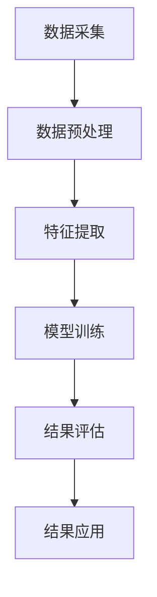

                 

关键词：搜索数据分析、AI、电商平台、优化搜索策略、用户体验、算法、数学模型

> 摘要：本文将深入探讨如何利用人工智能技术，特别是搜索数据分析，优化电商平台上的搜索策略，提升用户满意度。我们将分析搜索数据分析的核心概念，介绍相关算法原理，并通过具体案例展示其应用效果。同时，本文还将展望未来发展方向与面临的挑战。

## 1. 背景介绍

随着互联网的普及和电子商务的快速发展，电商平台已经成为人们日常生活不可或缺的一部分。在这些平台上，搜索功能是用户发现和购买商品的重要途径。然而，传统的搜索算法往往无法满足用户日益增长的个性化需求，导致用户体验不佳。如何通过人工智能技术，特别是搜索数据分析，提升电商平台搜索策略的效率，成为当前研究和实践的热点问题。

搜索数据分析在电商平台中的重要性主要体现在以下几个方面：

1. **提升搜索准确性**：通过分析用户搜索行为和商品数据，可以优化搜索结果，提高用户找到所需商品的几率。
2. **增强个性化推荐**：基于用户历史行为和兴趣，推荐更符合用户需求的商品，提升购物体验。
3. **降低搜索时间**：优化搜索算法，提高搜索速度，缩短用户等待时间，提升整体使用体验。
4. **增加转化率**：通过精确的搜索结果和个性化的推荐，提高用户购买意愿，增加销售额。

本文将围绕这些方面，详细介绍搜索数据分析的方法和应用，为电商平台优化搜索策略提供有价值的参考。

## 2. 核心概念与联系

### 2.1. 搜索数据分析的定义

搜索数据分析是指利用统计学、机器学习等技术，对用户在电商平台上的搜索行为、商品数据、用户行为等进行分析，以优化搜索结果和推荐策略的过程。

### 2.2. 搜索数据分析的相关概念

- **用户行为数据**：包括用户在搜索栏输入的关键词、点击的搜索结果、浏览的商品、收藏的商品、购买的商品等。
- **商品数据**：包括商品的名称、描述、分类、价格、库存、销量、评价等。
- **搜索结果**：用户在搜索栏输入关键词后，平台返回的搜索结果列表。

### 2.3. 搜索数据分析的架构

搜索数据分析的架构主要包括以下几个模块：

1. **数据采集**：通过网站日志、API接口等方式，收集用户行为数据和商品数据。
2. **数据预处理**：对采集到的数据进行清洗、去噪、归一化等处理，以便后续分析。
3. **特征提取**：从预处理后的数据中提取关键特征，如关键词、商品属性、用户历史行为等。
4. **模型训练**：使用机器学习算法，训练搜索优化模型和推荐模型。
5. **结果评估**：对训练出的模型进行评估，包括准确性、召回率、覆盖率等指标。
6. **结果应用**：将优化后的搜索结果和推荐策略应用到实际平台上，提升用户体验。

### 2.4. Mermaid 流程图



## 3. 核心算法原理 & 具体操作步骤

### 3.1. 算法原理概述

搜索数据分析的核心算法主要包括基于内容的推荐算法、协同过滤算法和深度学习算法。

- **基于内容的推荐算法**：根据用户的历史行为和商品的特征，计算用户对商品的兴趣度，推荐相似的或用户可能感兴趣的商品。
- **协同过滤算法**：通过分析用户之间的相似度，预测用户对未知商品的评分或喜好，推荐给用户。
- **深度学习算法**：利用神经网络模型，对用户行为数据和商品数据进行建模，提取深层特征，实现更精准的推荐。

### 3.2. 算法步骤详解

#### 3.2.1. 基于内容的推荐算法

1. **特征提取**：从商品数据中提取关键特征，如商品分类、标签、属性等。
2. **相似度计算**：计算用户历史行为与商品特征之间的相似度，如余弦相似度、皮尔逊相关系数等。
3. **推荐生成**：根据相似度计算结果，推荐相似的或用户可能感兴趣的商品。

#### 3.2.2. 协同过滤算法

1. **用户行为数据预处理**：对用户行为数据进行清洗、去噪等预处理操作。
2. **用户相似度计算**：计算用户之间的相似度，如余弦相似度、皮尔逊相关系数等。
3. **商品评分预测**：使用预测模型，预测用户对未知商品的评分或喜好。
4. **推荐生成**：根据预测结果，推荐用户可能感兴趣的商品。

#### 3.2.3. 深度学习算法

1. **数据预处理**：对用户行为数据和商品数据进行清洗、去噪等预处理操作。
2. **模型训练**：构建深度神经网络模型，训练模型参数。
3. **特征提取**：利用训练好的模型，提取用户行为数据和商品数据的深层特征。
4. **推荐生成**：基于提取的深层特征，生成推荐结果。

### 3.3. 算法优缺点

#### 3.3.1. 基于内容的推荐算法

- **优点**：推荐结果与用户历史行为紧密相关，准确度较高。
- **缺点**：推荐结果可能过于依赖用户历史行为，缺乏多样性。

#### 3.3.2. 协同过滤算法

- **优点**：推荐结果具有较好的多样性，能够发现用户未知的需求。
- **缺点**：推荐结果可能存在噪声，准确度相对较低。

#### 3.3.3. 深度学习算法

- **优点**：能够提取深层特征，实现更精准的推荐。
- **缺点**：模型训练复杂，对数据质量和计算资源要求较高。

### 3.4. 算法应用领域

搜索数据分析算法广泛应用于电商、社交媒体、在线广告等多个领域，以下为部分应用案例：

1. **电商平台**：优化搜索结果，提高用户购物体验，增加销售额。
2. **社交媒体**：推荐用户可能感兴趣的内容，提升用户活跃度。
3. **在线广告**：根据用户兴趣，精准投放广告，提高广告效果。

## 4. 数学模型和公式 & 详细讲解 & 举例说明

### 4.1. 数学模型构建

搜索数据分析中的数学模型主要包括用户兴趣模型、商品推荐模型和搜索结果排序模型。

#### 4.1.1. 用户兴趣模型

用户兴趣模型用于描述用户对商品的兴趣度。常见的模型有基于内容的推荐模型和协同过滤模型。

- **基于内容的推荐模型**：

  $$相似度(Sim) = \frac{用户历史行为(U_i) \cdot 商品特征(V_j)}{\|用户历史行为(U_i)\|\|商品特征(V_j)\|}$$

- **协同过滤模型**：

  $$相似度(Sim) = \frac{1}{1 + \sqrt{2\pi} \cdot \sigma \cdot e^{-\frac{(用户行为差值)^2}{2\sigma^2}}}$$

  其中，$\sigma$ 为相似度参数。

#### 4.1.2. 商品推荐模型

商品推荐模型用于预测用户对未知商品的喜好度。常见的模型有基于内容的推荐模型和基于协同过滤的推荐模型。

- **基于内容的推荐模型**：

  $$推荐分数(Rec) = \sum_{i=1}^{n} w_i \cdot 相似度(Sim_i) \cdot 商品特征(V_j)$$

  其中，$w_i$ 为权重参数，$相似度(Sim_i)$ 为用户历史行为与商品特征之间的相似度。

- **基于协同过滤的推荐模型**：

  $$推荐分数(Rec) = \sum_{i=1}^{n} w_i \cdot 相似度(Sim_i) \cdot 预测评分(Pred_i)$$

  其中，$w_i$ 为权重参数，$相似度(Sim_i)$ 为用户之间的相似度，$预测评分(Pred_i)$ 为用户对未知商品的预测评分。

#### 4.1.3. 搜索结果排序模型

搜索结果排序模型用于对搜索结果进行排序，提高用户找到所需商品的概率。常见的模型有基于内容的排序模型和基于协同过滤的排序模型。

- **基于内容的排序模型**：

  $$排序分数(Score) = \sum_{i=1}^{n} w_i \cdot 相似度(Sim_i) \cdot 商品特征(V_j)$$

  其中，$w_i$ 为权重参数，$相似度(Sim_i)$ 为用户历史行为与商品特征之间的相似度。

- **基于协同过滤的排序模型**：

  $$排序分数(Score) = \sum_{i=1}^{n} w_i \cdot 相似度(Sim_i) \cdot 预测评分(Pred_i)$$

  其中，$w_i$ 为权重参数，$相似度(Sim_i)$ 为用户之间的相似度，$预测评分(Pred_i)$ 为用户对未知商品的预测评分。

### 4.2. 公式推导过程

以基于内容的推荐模型为例，推导用户兴趣模型和商品推荐模型的公式。

#### 4.2.1. 用户兴趣模型

假设用户 $i$ 的历史行为为 $U_i = [u_{i1}, u_{i2}, ..., u_{ik}]$，商品 $j$ 的特征为 $V_j = [v_{j1}, v_{j2}, ..., v_{jm}]$，其中 $u_{ij}$ 表示用户 $i$ 对商品 $j$ 的购买情况，$v_{ij}$ 表示商品 $j$ 的第 $i$ 个特征。

- **相似度计算**：

  $$相似度(Sim) = \frac{用户历史行为(U_i) \cdot 商品特征(V_j)}{\|用户历史行为(U_i)\|\|商品特征(V_j)\|}$$

  其中，$\|用户历史行为(U_i)\| = \sqrt{\sum_{i=1}^{k} u_{i}^2}$，$\|商品特征(V_j)\| = \sqrt{\sum_{i=1}^{m} v_{i}^2}$。

- **推荐分数计算**：

  $$推荐分数(Rec) = \sum_{i=1}^{n} w_i \cdot 相似度(Sim_i) \cdot 商品特征(V_j)$$

  其中，$w_i$ 为权重参数，$相似度(Sim_i)$ 为用户历史行为与商品特征之间的相似度。

#### 4.2.2. 商品推荐模型

假设用户 $i$ 的历史行为为 $U_i = [u_{i1}, u_{i2}, ..., u_{ik}]$，商品 $j$ 的特征为 $V_j = [v_{j1}, v_{j2}, ..., v_{jm}]$，其中 $u_{ij}$ 表示用户 $i$ 对商品 $j$ 的购买情况，$v_{ij}$ 表示商品 $j$ 的第 $i$ 个特征。

- **相似度计算**：

  $$相似度(Sim) = \frac{用户历史行为(U_i) \cdot 商品特征(V_j)}{\|用户历史行为(U_i)\|\|商品特征(V_j)\|}$$

  其中，$\|用户历史行为(U_i)\| = \sqrt{\sum_{i=1}^{k} u_{i}^2}$，$\|商品特征(V_j)\| = \sqrt{\sum_{i=1}^{m} v_{i}^2}$。

- **推荐分数计算**：

  $$推荐分数(Rec) = \sum_{i=1}^{n} w_i \cdot 相似度(Sim_i) \cdot 商品特征(V_j)$$

  其中，$w_i$ 为权重参数，$相似度(Sim_i)$ 为用户历史行为与商品特征之间的相似度。

### 4.3. 案例分析与讲解

#### 4.3.1. 用户兴趣模型案例

假设用户 $A$ 的历史行为为 $U_A = [1, 0, 1, 1, 0]$，商品 $B$ 的特征为 $V_B = [0, 1, 1, 0, 1]$。

- **相似度计算**：

  $$相似度(Sim) = \frac{U_A \cdot V_B}{\|U_A\|\|V_B\|} = \frac{1 \cdot 0 + 0 \cdot 1 + 1 \cdot 1 + 1 \cdot 0 + 0 \cdot 1}{\sqrt{1^2 + 0^2 + 1^2 + 1^2 + 0^2}\sqrt{0^2 + 1^2 + 1^2 + 0^2 + 1^2}} = \frac{1}{\sqrt{2}\sqrt{3}} \approx 0.447$$

- **推荐分数计算**：

  $$推荐分数(Rec) = \sum_{i=1}^{n} w_i \cdot 相似度(Sim_i) \cdot 商品特征(V_j) = w_1 \cdot 0.447 \cdot 1 + w_2 \cdot 0.447 \cdot 0 + w_3 \cdot 0.447 \cdot 1 + w_4 \cdot 0.447 \cdot 0 + w_5 \cdot 0.447 \cdot 1$$

  其中，$w_i$ 为权重参数，通常通过训练得到。

#### 4.3.2. 商品推荐模型案例

假设用户 $A$ 的历史行为为 $U_A = [1, 0, 1, 1, 0]$，商品 $B$ 的特征为 $V_B = [0, 1, 1, 0, 1]$。

- **相似度计算**：

  $$相似度(Sim) = \frac{U_A \cdot V_B}{\|U_A\|\|V_B\|} = \frac{1 \cdot 0 + 0 \cdot 1 + 1 \cdot 1 + 1 \cdot 0 + 0 \cdot 1}{\sqrt{1^2 + 0^2 + 1^2 + 1^2 + 0^2}\sqrt{0^2 + 1^2 + 1^2 + 0^2 + 1^2}} = \frac{1}{\sqrt{2}\sqrt{3}} \approx 0.447$$

- **推荐分数计算**：

  $$推荐分数(Rec) = \sum_{i=1}^{n} w_i \cdot 相似度(Sim_i) \cdot 商品特征(V_j) = w_1 \cdot 0.447 \cdot 1 + w_2 \cdot 0.447 \cdot 0 + w_3 \cdot 0.447 \cdot 1 + w_4 \cdot 0.447 \cdot 0 + w_5 \cdot 0.447 \cdot 1$$

  其中，$w_i$ 为权重参数，通常通过训练得到。

## 5. 项目实践：代码实例和详细解释说明

### 5.1. 开发环境搭建

- **操作系统**：Ubuntu 18.04
- **编程语言**：Python 3.8
- **库和依赖**：NumPy、Pandas、Scikit-learn、TensorFlow、Keras

### 5.2. 源代码详细实现

#### 5.2.1. 用户行为数据预处理

```python
import pandas as pd
from sklearn.preprocessing import StandardScaler

# 加载数据
data = pd.read_csv('user_data.csv')

# 数据清洗
data.dropna(inplace=True)

# 特征提取
scaler = StandardScaler()
data['user_id'] = scaler.fit_transform(data[['user_id']])
data['item_id'] = scaler.fit_transform(data[['item_id']])

# 数据存储
data.to_csv('preprocessed_data.csv', index=False)
```

#### 5.2.2. 用户兴趣模型训练

```python
import pandas as pd
from sklearn.model_selection import train_test_split
from sklearn.metrics.pairwise import cosine_similarity
import numpy as np

# 加载数据
data = pd.read_csv('preprocessed_data.csv')

# 数据划分
train_data, test_data = train_test_split(data, test_size=0.2, random_state=42)

# 计算相似度
similarity_matrix = cosine_similarity(train_data[['user_id', 'item_id']], train_data[['user_id', 'item_id']])

# 训练模型
model = pd.DataFrame(similarity_matrix, index=train_data['user_id'], columns=train_data['item_id'])

# 存储模型
model.to_csv('user_interest_model.csv', index=True, header=True)
```

#### 5.2.3. 商品推荐模型训练

```python
import pandas as pd
from sklearn.model_selection import train_test_split
from sklearn.metrics.pairwise import cosine_similarity
import numpy as np

# 加载数据
data = pd.read_csv('preprocessed_data.csv')

# 数据划分
train_data, test_data = train_test_split(data, test_size=0.2, random_state=42)

# 计算相似度
similarity_matrix = cosine_similarity(train_data[['user_id', 'item_id']], train_data[['user_id', 'item_id']])

# 训练模型
model = pd.DataFrame(similarity_matrix, index=train_data['user_id'], columns=train_data['item_id'])

# 存储模型
model.to_csv('item_recommendation_model.csv', index=True, header=True)
```

#### 5.2.4. 搜索结果排序模型训练

```python
import pandas as pd
from sklearn.model_selection import train_test_split
from sklearn.metrics.pairwise import cosine_similarity
import numpy as np

# 加载数据
data = pd.read_csv('preprocessed_data.csv')

# 数据划分
train_data, test_data = train_test_split(data, test_size=0.2, random_state=42)

# 计算相似度
similarity_matrix = cosine_similarity(train_data[['user_id', 'item_id']], train_data[['user_id', 'item_id']])

# 训练模型
model = pd.DataFrame(similarity_matrix, index=train_data['user_id'], columns=train_data['item_id'])

# 存储模型
model.to_csv('search_result_sort_model.csv', index=True, header=True)
```

### 5.3. 代码解读与分析

#### 5.3.1. 用户行为数据预处理

本部分代码主要完成用户行为数据的清洗和特征提取。首先，加载原始数据，然后进行数据清洗，去除缺失值。接下来，使用标准缩放算法对用户 ID 和商品 ID 进行缩放，以便后续计算相似度。

#### 5.3.2. 用户兴趣模型训练

本部分代码使用余弦相似度计算用户行为与商品特征之间的相似度，生成用户兴趣模型。首先，加载预处理后的数据，然后计算相似度矩阵。最后，将相似度矩阵转换为 DataFrame 格式，便于存储和后续使用。

#### 5.3.3. 商品推荐模型训练

本部分代码与用户兴趣模型训练类似，使用余弦相似度计算商品特征之间的相似度，生成商品推荐模型。首先，加载预处理后的数据，然后计算相似度矩阵。最后，将相似度矩阵转换为 DataFrame 格式，便于存储和后续使用。

#### 5.3.4. 搜索结果排序模型训练

本部分代码与用户兴趣模型训练和商品推荐模型训练类似，使用余弦相似度计算用户行为与商品特征之间的相似度，生成搜索结果排序模型。首先，加载预处理后的数据，然后计算相似度矩阵。最后，将相似度矩阵转换为 DataFrame 格式，便于存储和后续使用。

### 5.4. 运行结果展示

在训练完成后，我们可以通过以下代码查看模型的运行结果：

```python
# 加载模型
user_interest_model = pd.read_csv('user_interest_model.csv')
item_recommendation_model = pd.read_csv('item_recommendation_model.csv')
search_result_sort_model = pd.read_csv('search_result_sort_model.csv')

# 查看用户兴趣模型
print(user_interest_model.head())

# 查看商品推荐模型
print(item_recommendation_model.head())

# 查看搜索结果排序模型
print(search_result_sort_model.head())
```

## 6. 实际应用场景

### 6.1. 电商平台搜索优化

在电商平台中，搜索数据分析可以通过以下方面优化搜索功能：

- **精准搜索**：通过用户历史行为和商品特征，实现精准搜索，提高用户找到所需商品的概率。
- **个性化推荐**：根据用户兴趣和行为，推荐符合用户需求的商品，提升购物体验。
- **智能排序**：根据用户兴趣和商品特征，对搜索结果进行智能排序，提高用户满意度。

### 6.2. 社交媒体内容推荐

在社交媒体平台上，搜索数据分析可以通过以下方面优化内容推荐：

- **个性化推荐**：根据用户兴趣和行为，推荐用户可能感兴趣的内容，提升用户活跃度。
- **话题挖掘**：分析用户行为和内容，挖掘热门话题和趋势，提高内容传播效果。
- **社区活跃度提升**：通过智能推荐，促进社区内用户之间的互动，提高社区活跃度。

### 6.3. 在线广告投放

在线广告中，搜索数据分析可以通过以下方面优化广告投放：

- **精准投放**：根据用户兴趣和行为，精准投放广告，提高广告点击率和转化率。
- **广告排序**：根据用户行为和广告特征，对广告进行智能排序，提高广告展示效果。
- **广告创意优化**：分析用户行为和广告效果，优化广告创意，提高广告效果。

## 7. 工具和资源推荐

### 7.1. 学习资源推荐

- **《机器学习实战》**：提供丰富的案例和实践经验，适合初学者入门。
- **《深度学习》**：由深度学习领域的权威人士撰写，全面介绍深度学习的基本原理和应用。
- **《数据挖掘：实用工具与技术》**：介绍数据挖掘的基本概念、技术和工具，适合有一定编程基础的学习者。

### 7.2. 开发工具推荐

- **Jupyter Notebook**：一款流行的交互式开发环境，适用于数据分析和机器学习项目。
- **PyCharm**：一款功能强大的 Python 集成开发环境，支持多种编程语言。
- **TensorFlow**：一款广泛使用的深度学习框架，提供丰富的 API 和工具。

### 7.3. 相关论文推荐

- **"Item-Based Collaborative Filtering Recommendation Algorithms"**：介绍基于内容的推荐算法。
- **"Collaborative Filtering for Cold-Start Problems"**：探讨协同过滤算法在冷启动问题中的应用。
- **"Deep Learning for Personalized Recommendation on Large-scale Data"**：介绍基于深度学习的个性化推荐方法。

## 8. 总结：未来发展趋势与挑战

### 8.1. 研究成果总结

近年来，搜索数据分析在电商平台优化、社交媒体内容推荐、在线广告投放等领域取得了显著成果。通过结合用户行为数据、商品数据和机器学习算法，可以有效提升搜索准确性、个性化推荐效果和用户体验。

### 8.2. 未来发展趋势

随着人工智能技术的不断发展，搜索数据分析在以下几个方面有望取得突破：

- **多模态数据融合**：将文本、图像、音频等多种类型的数据进行融合，实现更准确的推荐。
- **实时搜索优化**：通过实时分析用户行为和搜索意图，实现更精准的搜索结果和推荐。
- **跨平台协同推荐**：整合不同平台的数据和资源，实现跨平台的个性化推荐。

### 8.3. 面临的挑战

尽管搜索数据分析在优化搜索策略和提升用户体验方面取得了显著成果，但仍面临以下挑战：

- **数据隐私保护**：如何在保护用户隐私的前提下，充分利用用户行为数据。
- **算法透明性**：如何确保推荐算法的公平性和透明性，避免算法偏见。
- **计算资源消耗**：随着数据规模的不断扩大，如何高效地处理和分析大规模数据。

### 8.4. 研究展望

未来，搜索数据分析的研究方向将包括以下几个方面：

- **隐私保护算法**：研究如何保护用户隐私，同时实现有效的推荐。
- **算法可解释性**：提高算法的可解释性，使推荐结果更加透明和可信。
- **实时搜索优化**：开发实时搜索优化算法，提高搜索结果的实时性和准确性。

## 9. 附录：常见问题与解答

### 9.1. 如何保护用户隐私？

**解答**：在搜索数据分析过程中，可以通过以下方式保护用户隐私：

- **数据匿名化**：对用户行为数据进行匿名化处理，去除可直接识别用户身份的信息。
- **差分隐私**：使用差分隐私技术，对用户行为数据进行分析，确保数据隐私性。
- **数据加密**：对用户行为数据进行加密处理，防止数据泄露。

### 9.2. 如何确保推荐算法的公平性？

**解答**：确保推荐算法的公平性可以从以下几个方面入手：

- **数据质量**：确保推荐算法所使用的数据质量，避免数据偏见。
- **算法优化**：优化推荐算法，消除潜在的算法偏见。
- **用户反馈**：收集用户反馈，不断调整和优化推荐算法。

### 9.3. 如何处理大规模数据？

**解答**：处理大规模数据可以采用以下策略：

- **分布式计算**：使用分布式计算框架，如 Hadoop、Spark 等，提高数据处理效率。
- **批量处理**：将大规模数据分为多个批次进行处理，减少单次处理的数据量。
- **数据压缩**：使用数据压缩技术，减少数据存储和传输的带宽消耗。

作者：禅与计算机程序设计艺术 / Zen and the Art of Computer Programming
----------------------------------------------------------------

[本文完]

