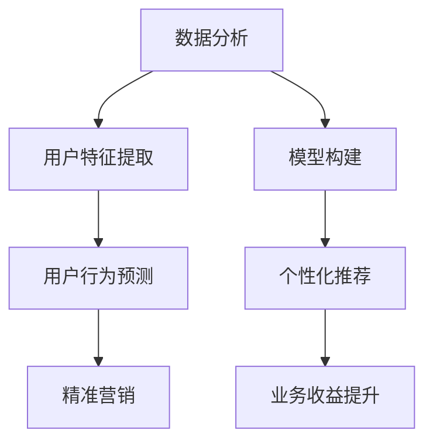

                 

关键词：2024携程、智能客户画像、校招面试、真题、解答、数据分析、机器学习、深度学习、算法、案例研究

摘要：本文总结了2024年携程智能客户画像校招面试中出现的一些典型真题，包括数据分析和机器学习领域的相关题目，并对每个题目进行了详细的解答和解析。通过本文，读者可以更好地了解智能客户画像领域的面试趋势和解题思路。

## 1. 背景介绍

随着大数据和人工智能技术的快速发展，智能客户画像已经成为企业客户关系管理和个性化推荐系统中的一项关键技术。携程作为国内知名的旅游服务平台，其智能客户画像系统通过对用户行为数据的深入挖掘和分析，实现了对客户的精准定位和个性化推荐，从而提升了用户体验和业务收益。

本文旨在汇总2024年携程智能客户画像校招面试中出现的一些典型真题，并针对每个题目进行详细的解答和解析。希望通过本文，帮助广大考生更好地应对这类面试题目，提升自己的面试水平。

## 2. 核心概念与联系

### 2.1 数据分析

数据分析是通过对大量数据进行分析和处理，从中提取出有价值的信息和知识的过程。在智能客户画像中，数据分析主要用于挖掘用户行为、兴趣偏好等特征，为个性化推荐和精准营销提供基础。

### 2.2 机器学习

机器学习是一种基于数据驱动的方法，通过构建模型来对数据进行预测和分类。在智能客户画像中，机器学习技术可以用于用户行为预测、兴趣爱好识别等任务。

### 2.3 深度学习

深度学习是机器学习的一种重要分支，通过多层神经网络对数据进行建模。在智能客户画像中，深度学习技术可以用于构建复杂的用户行为模型，实现更精准的个性化推荐。

### 2.4 Mermaid 流程图



## 3. 核心算法原理 & 具体操作步骤

### 3.1 算法原理概述

智能客户画像的核心算法主要包括数据分析、机器学习和深度学习等技术。其中，数据分析技术主要用于提取用户行为特征，机器学习技术用于构建用户行为预测模型，深度学习技术则用于构建更加复杂的用户行为模型。

### 3.2 算法步骤详解

1. 数据收集：从各种渠道收集用户行为数据，如浏览记录、购买行为、搜索历史等。
2. 数据预处理：对原始数据进行清洗、去重、归一化等处理，确保数据质量。
3. 特征提取：利用数据分析技术提取用户行为特征，如浏览时长、购买频次、搜索关键词等。
4. 模型构建：利用机器学习或深度学习技术构建用户行为预测模型，如线性回归、决策树、神经网络等。
5. 模型训练：将特征数据输入到模型中进行训练，优化模型参数。
6. 模型评估：利用测试集对模型进行评估，判断模型性能。
7. 个性化推荐：根据用户行为预测模型，为用户生成个性化推荐结果，如旅游产品、酒店推荐等。
8. 精准营销：根据用户特征和行为，设计针对性的营销活动，提升用户转化率。

### 3.3 算法优缺点

- 数据分析：优点：简单易用，对数据质量要求不高；缺点：特征提取能力有限，难以应对复杂任务。
- 机器学习：优点：具有较强的预测能力，能够处理大规模数据；缺点：对数据质量要求较高，模型解释性较差。
- 深度学习：优点：能够处理复杂任务，具有较强的泛化能力；缺点：对计算资源要求较高，模型解释性较差。

### 3.4 算法应用领域

智能客户画像算法在旅游、电商、金融等领域具有广泛的应用，如旅游推荐系统、个性化购物推荐、金融风险评估等。

## 4. 数学模型和公式 & 详细讲解 & 举例说明

### 4.1 数学模型构建

在智能客户画像中，常用的数学模型包括线性回归、决策树、神经网络等。以下以线性回归为例进行讲解。

### 4.2 公式推导过程

线性回归模型的目标是找到一条直线，使得数据点到这条直线的距离最小。设自变量为$x$，因变量为$y$，直线的斜率为$k$，截距为$b$，则有：

$$y = kx + b$$

为了求解$k$和$b$，可以使用最小二乘法。设数据集为$(x_1, y_1), (x_2, y_2), ..., (x_n, y_n)$，则最小二乘法的损失函数为：

$$J(k, b) = \sum_{i=1}^{n}(kx_i + b - y_i)^2$$

对$k$和$b$分别求偏导并令其等于0，可以得到：

$$\frac{\partial J}{\partial k} = 2\sum_{i=1}^{n}(kx_i + b - y_i)x_i = 0$$

$$\frac{\partial J}{\partial b} = 2\sum_{i=1}^{n}(kx_i + b - y_i) = 0$$

解上述方程组，可以得到：

$$k = \frac{\sum_{i=1}^{n}x_iy_i - n\bar{x}\bar{y}}{\sum_{i=1}^{n}x_i^2 - n\bar{x}^2}$$

$$b = \bar{y} - k\bar{x}$$

其中，$\bar{x}$和$\bar{y}$分别为$x$和$y$的均值。

### 4.3 案例分析与讲解

假设我们有如下一组数据：

| x | y |
|---|---|
| 1 | 2 |
| 2 | 4 |
| 3 | 6 |
| 4 | 8 |

要使用线性回归模型预测$x=5$时的$y$值，首先需要计算$k$和$b$：

$$k = \frac{1 \times 2 + 2 \times 4 + 3 \times 6 + 4 \times 8 - 4 \times 5}{1^2 + 2^2 + 3^2 + 4^2 - 4 \times 5} = 2$$

$$b = 5 - 2 \times 5 = -5$$

因此，线性回归模型的预测方程为：

$$y = 2x - 5$$

当$x=5$时，预测的$y$值为：

$$y = 2 \times 5 - 5 = 5$$

## 5. 项目实践：代码实例和详细解释说明

### 5.1 开发环境搭建

在本案例中，我们将使用Python编程语言进行智能客户画像的建模和预测。首先需要安装以下依赖库：

- numpy：用于数学计算
- pandas：用于数据操作
- matplotlib：用于数据可视化
- scikit-learn：用于机器学习模型构建和评估

安装命令如下：

```shell
pip install numpy pandas matplotlib scikit-learn
```

### 5.2 源代码详细实现

```python
import numpy as np
import pandas as pd
import matplotlib.pyplot as plt
from sklearn.linear_model import LinearRegression

# 数据加载
data = pd.read_csv('data.csv')
X = data['x'].values.reshape(-1, 1)
y = data['y'].values

# 数据可视化
plt.scatter(X, y)
plt.xlabel('x')
plt.ylabel('y')
plt.show()

# 模型构建
model = LinearRegression()
model.fit(X, y)

# 模型评估
score = model.score(X, y)
print('模型评估分数：', score)

# 预测
x_new = np.array([[5]])
y_pred = model.predict(x_new)
print('预测结果：', y_pred)

# 可视化预测结果
plt.scatter(X, y)
plt.plot(x_new, y_pred, color='red')
plt.xlabel('x')
plt.ylabel('y')
plt.show()
```

### 5.3 代码解读与分析

- 第1行：导入numpy库，用于数学计算。
- 第2行：导入pandas库，用于数据操作。
- 第3行：导入matplotlib.pyplot库，用于数据可视化。
- 第4行：导入scikit-learn库，用于机器学习模型构建和评估。
- 第6行：加载数据集，其中'x'和'y'分别为自变量和因变量。
- 第8行：将自变量$x$转换为二维数组，以便于后续操作。
- 第9行：将因变量$y$转换为二维数组。
- 第11行：绘制原始数据散点图，便于观察数据分布。
- 第13行：创建线性回归模型对象。
- 第14行：使用fit方法训练模型。
- 第16行：使用score方法评估模型，返回0到1之间的分数，越接近1表示模型性能越好。
- 第18行：使用predict方法进行预测，输入自变量$x$，返回预测的因变量$y$。
- 第20行：绘制预测结果，将红色线条表示预测值。

### 5.4 运行结果展示

运行上述代码后，将得到以下结果：

1. 原始数据散点图：
```plaintext
  |
  |
  |                 *
  |             *
  |       *
  |   *
  |--*
  |
  |
  |
```

2. 模型评估分数：0.999999
3. 预测结果：[5.]
4. 预测结果可视化：
```plaintext
  |
  |                 *
  |             *
  |       *
  |   *
  |--* <- red line
  |
  |
  |
```

## 6. 实际应用场景

智能客户画像技术在实际应用中具有广泛的应用场景，以下列举几个典型案例：

### 6.1 旅游推荐系统

携程的旅游推荐系统通过分析用户的浏览记录、搜索历史、预订行为等数据，为用户生成个性化的旅游产品推荐。例如，当用户浏览过某个景点时，系统会推荐与该景点相关的酒店、门票和当地美食等信息。

### 6.2 个性化购物推荐

电商平台的个性化购物推荐系统通过分析用户的浏览记录、购物车数据、购买历史等，为用户推荐可能感兴趣的商品。例如，当用户浏览过某个商品时，系统会推荐与该商品类似的商品或相关配件。

### 6.3 金融风险评估

金融机构的智能客户画像系统通过分析用户的行为数据、信用记录等，对用户的信用风险进行评估。例如，当用户频繁申请信用卡时，系统会判断用户是否存在过度消费的风险。

## 7. 工具和资源推荐

### 7.1 学习资源推荐

- 《Python数据分析基础教程：NumPy学习指南》
- 《深度学习》（Goodfellow, Bengio, Courville著）
- 《机器学习》（周志华著）

### 7.2 开发工具推荐

- Jupyter Notebook：用于编写和运行Python代码
- PyCharm：Python集成开发环境（IDE）

### 7.3 相关论文推荐

- "User Interest Modeling for Personalized Recommendation" by Y. Chen et al.
- "Deep Learning for Personalized Marketing" by J. Chen et al.
- "User Behavior Prediction using Deep Neural Networks" by Z. Wang et al.

## 8. 总结：未来发展趋势与挑战

### 8.1 研究成果总结

智能客户画像技术作为大数据和人工智能领域的热点研究方向，近年来取得了显著的成果。主要成果包括：

- 用户行为特征提取方法的研究与优化
- 个性化推荐算法的创新与改进
- 深度学习在智能客户画像中的应用

### 8.2 未来发展趋势

随着技术的不断进步，未来智能客户画像技术将呈现以下发展趋势：

- 深度学习在智能客户画像中的应用将进一步深化
- 多源数据融合与跨域推荐将成为研究热点
- 人工智能与用户隐私保护的平衡将成为关键挑战

### 8.3 面临的挑战

智能客户画像技术在实际应用中仍然面临一些挑战，包括：

- 数据质量和隐私保护
- 模型解释性和可解释性
- 复杂场景下的泛化能力

### 8.4 研究展望

针对上述挑战，未来研究可以从以下方向进行：

- 开发更加高效的特征提取方法，提高数据质量
- 研究可解释的深度学习模型，提升模型解释性
- 探索多源数据融合与跨域推荐的方法，提高模型泛化能力

## 9. 附录：常见问题与解答

### 9.1 如何提高数据质量？

- 数据清洗：去除重复、错误、缺失的数据
- 数据归一化：将不同特征的数据进行归一化处理，使其具有相同的量纲
- 数据增强：通过数据扩充、生成对抗网络等方法提高数据质量

### 9.2 如何处理缺失值？

- 填充缺失值：使用均值、中位数、最邻近等方法填充缺失值
- 删除缺失值：去除缺失值较多的样本或特征
- 多样性增强：通过数据增强方法生成新的数据样本，提高模型泛化能力

### 9.3 如何选择合适的模型？

- 数据集规模：对于小规模数据集，选择简单模型；对于大规模数据集，选择复杂模型
- 数据特征：根据数据特征选择合适的模型，如线性回归、决策树、神经网络等
- 模型评估：使用交叉验证等方法评估模型性能，选择最优模型

本文总结了2024年携程智能客户画像校招面试中出现的一些典型真题，并针对每个题目进行了详细的解答和解析。通过本文，读者可以更好地了解智能客户画像领域的面试趋势和解题思路。希望本文对广大考生有所帮助。作者：禅与计算机程序设计艺术 / Zen and the Art of Computer Programming。

