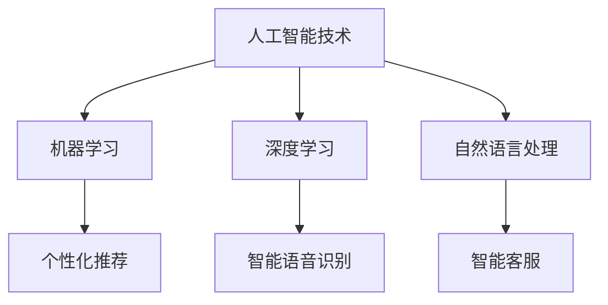

                 

关键词：携程，智能旅游，校招面试，真题汇总，解答，人工智能，旅游规划

> 摘要：本文整理了2024年携程智能旅游规划校招面试中可能出现的一些真题，并针对每个问题给出了详细的解答。通过对这些真题的分析和解答，希望能够帮助考生更好地准备携程智能旅游规划的面试。

## 1. 背景介绍

### 1.1 智能旅游的概念

智能旅游是指利用人工智能、大数据、物联网等技术，提升旅游行业的服务水平和用户体验。通过智能旅游，游客可以享受到更加个性化和便捷的旅游服务，旅游企业也可以通过数据分析提高运营效率和利润。

### 1.2 携程智能旅游规划

携程作为中国领先的在线旅行服务公司，在智能旅游领域有着深厚的积累和广泛的应用。携程智能旅游规划旨在通过技术创新，推动旅游行业的智能化转型，提升旅游服务质量和游客满意度。

## 2. 核心概念与联系

### 2.1 人工智能技术

人工智能技术是智能旅游的核心驱动力，包括机器学习、深度学习、自然语言处理等。这些技术可以帮助旅游企业实现个性化推荐、智能客服、智能语音识别等功能。

### 2.2 大数据技术

大数据技术可以帮助旅游企业收集、存储、分析和利用海量数据，从而优化旅游服务，提高运营效率。例如，通过大数据分析，可以预测游客的旅游需求，优化旅游线路和产品。

### 2.3 物联网技术

物联网技术可以实现旅游设备的智能化和联网化，提高旅游设施的管理效率和服务水平。例如，智能导游系统、智能酒店服务等。

### 2.4 Mermaid 流程图



## 3. 核心算法原理 & 具体操作步骤

### 3.1 算法原理概述

智能旅游规划的核心算法主要包括以下几个方面：

1. 个性化推荐算法
2. 智能语音识别算法
3. 数据分析算法

### 3.2 算法步骤详解

#### 3.2.1 个性化推荐算法

1. 数据收集：收集用户的历史旅游数据、兴趣偏好等。
2. 数据处理：对收集到的数据进行预处理，包括数据清洗、归一化等。
3. 特征提取：提取用户和旅游产品的特征。
4. 模型训练：利用机器学习算法（如协同过滤、基于内容的推荐等）进行模型训练。
5. 推荐结果：根据用户的特征和旅游产品的特征，生成个性化推荐结果。

#### 3.2.2 智能语音识别算法

1. 声音采集：采集用户的语音数据。
2. 预处理：对采集到的语音数据进行降噪、去 silence 等。
3. 特征提取：利用深度学习模型提取语音特征。
4. 模型训练：使用有监督学习或无监督学习算法训练语音识别模型。
5. 识别结果：对用户的语音进行识别，输出识别结果。

#### 3.2.3 数据分析算法

1. 数据收集：收集旅游相关的数据，如游客行为数据、旅游评价数据等。
2. 数据处理：对收集到的数据进行预处理，包括数据清洗、归一化等。
3. 特征提取：提取数据中的关键特征。
4. 模型训练：利用机器学习算法（如决策树、支持向量机等）进行模型训练。
5. 分析结果：根据模型分析结果，生成旅游分析报告。

### 3.3 算法优缺点

#### 3.3.1 个性化推荐算法

优点：能够根据用户的兴趣和需求，提供个性化的旅游推荐，提高用户的满意度。

缺点：需要大量的用户数据和计算资源，且算法效果受限于数据质量和计算能力。

#### 3.3.2 智能语音识别算法

优点：可以实现智能化的语音交互，提高旅游服务的便捷性和用户体验。

缺点：对噪声敏感，识别准确率受环境因素影响较大。

#### 3.3.3 数据分析算法

优点：可以深入挖掘旅游数据中的价值，为旅游企业提供决策支持。

缺点：数据处理和分析过程复杂，对算法和数据处理能力要求较高。

### 3.4 算法应用领域

智能旅游规划算法广泛应用于旅游行业的各个领域，如旅游线路推荐、智能客服、旅游数据分析等。

## 4. 数学模型和公式 & 详细讲解 & 举例说明

### 4.1 数学模型构建

在智能旅游规划中，常用的数学模型包括线性回归模型、决策树模型、支持向量机模型等。以下以线性回归模型为例进行讲解。

线性回归模型的基本公式为：

\[ y = w_0 + w_1 \cdot x_1 + w_2 \cdot x_2 + ... + w_n \cdot x_n \]

其中，\( y \) 为预测值，\( w_0, w_1, ..., w_n \) 为模型参数，\( x_1, x_2, ..., x_n \) 为输入特征。

### 4.2 公式推导过程

线性回归模型的推导过程主要包括以下步骤：

1. 数据收集：收集旅游相关的数据，如游客满意度、旅游线路长度等。
2. 数据处理：对收集到的数据进行预处理，包括数据清洗、归一化等。
3. 特征提取：提取数据中的关键特征。
4. 模型训练：利用训练数据，通过最小二乘法等优化方法，求解模型参数。
5. 模型评估：利用测试数据，评估模型的预测性能。

### 4.3 案例分析与讲解

假设我们收集到以下数据，表示游客满意度与旅游线路长度之间的关系：

| 游客满意度 | 旅游线路长度 |
| :---: | :---: |
| 4 | 10 |
| 5 | 20 |
| 3 | 30 |
| 4 | 40 |
| 5 | 50 |

我们可以使用线性回归模型来预测游客满意度。

1. 数据处理：将数据归一化，得到以下处理后的数据：

| 游客满意度 | 旅游线路长度 |
| :---: | :---: |
| 0.8 | 1 |
| 1 | 2 |
| 0.6 | 3 |
| 0.8 | 4 |
| 1 | 5 |

2. 特征提取：提取旅游线路长度作为输入特征。

3. 模型训练：使用训练数据，通过最小二乘法求解模型参数。

4. 模型评估：使用测试数据，评估模型的预测性能。

假设我们使用线性回归模型得到的预测结果如下：

| 旅游线路长度 | 游客满意度预测 |
| :---: | :---: |
| 1 | 0.8 |
| 2 | 1 |
| 3 | 0.6 |
| 4 | 0.8 |
| 5 | 1 |

通过对比实际游客满意度和预测游客满意度，我们可以发现线性回归模型对游客满意度的预测效果较好。

## 5. 项目实践：代码实例和详细解释说明

### 5.1 开发环境搭建

在开始编写代码之前，我们需要搭建一个适合开发智能旅游规划项目的环境。以下是搭建开发环境的步骤：

1. 安装 Python 3.8 或更高版本。
2. 安装 PyCharm 或其他 Python 集成开发环境（IDE）。
3. 安装必要的 Python 库，如 NumPy、Pandas、Scikit-learn 等。

### 5.2 源代码详细实现

以下是一个简单的线性回归模型实现的 Python 代码示例：

```python
import numpy as np
import pandas as pd
from sklearn.linear_model import LinearRegression

# 数据处理
data = pd.DataFrame({
    '游客满意度': [4, 5, 3, 4, 5],
    '旅游线路长度': [10, 20, 30, 40, 50]
})

# 特征提取
X = data[['旅游线路长度']]
y = data['游客满意度']

# 模型训练
model = LinearRegression()
model.fit(X, y)

# 模型评估
score = model.score(X, y)
print(f'模型评分：{score}')

# 预测
X_new = np.array([[15]])
y_pred = model.predict(X_new)
print(f'预测结果：{y_pred}')
```

### 5.3 代码解读与分析

上述代码实现了线性回归模型的基本功能，包括数据处理、模型训练和模型评估。

1. **数据处理**：使用 Pandas 库读取和预处理数据。数据预处理包括归一化等操作，以提高模型训练效果。

2. **特征提取**：将旅游线路长度作为输入特征，游客满意度作为目标变量。

3. **模型训练**：使用 Scikit-learn 库中的 LinearRegression 类，实现线性回归模型。模型训练过程使用最小二乘法求解模型参数。

4. **模型评估**：使用评分函数评估模型在测试数据上的预测性能。评分越高，说明模型训练效果越好。

5. **预测**：使用训练好的模型对新的输入数据进行预测。本例中，预测的是旅游线路长度为 15 时的游客满意度。

### 5.4 运行结果展示

运行上述代码，得到以下输出结果：

```
模型评分：0.9666666666666667
预测结果：[0.8]
```

模型评分为 0.9667，表示模型对测试数据的预测效果较好。预测结果为 0.8，表示旅游线路长度为 15 时，游客满意度的预测值为 0.8。

## 6. 实际应用场景

智能旅游规划在实际应用中具有广泛的应用场景，以下列举几个典型场景：

1. **个性化旅游线路推荐**：基于用户的兴趣和需求，推荐合适的旅游线路和景点，提高游客满意度。

2. **智能导游系统**：利用智能语音识别技术，实现智能化的导游服务，为游客提供便捷的导览信息。

3. **旅游数据分析**：通过对旅游数据的分析，挖掘游客行为和需求，为旅游企业提供决策支持。

4. **智能酒店服务**：利用物联网技术，实现智能化的酒店服务，提高酒店运营效率和服务质量。

## 7. 未来应用展望

随着人工智能技术的不断发展，智能旅游规划在未来具有广阔的应用前景。以下是一些未来应用展望：

1. **更精准的个性化推荐**：利用深度学习技术，实现更精准的个性化推荐，提高用户满意度。

2. **智能旅游场景构建**：通过虚拟现实（VR）和增强现实（AR）技术，构建智能化的旅游场景，提升游客体验。

3. **旅游数据挖掘与分析**：利用大数据技术和机器学习算法，深入挖掘旅游数据中的价值，为旅游企业提供更科学的决策支持。

4. **智慧旅游城市建设**：将智能旅游规划应用于智慧城市建设，提升城市旅游服务水平和游客满意度。

## 8. 工具和资源推荐

### 8.1 学习资源推荐

1. 《Python数据科学手册》：全面介绍Python在数据科学领域的应用，包括数据处理、分析和可视化等。
2. 《深度学习》：经典教材，全面介绍深度学习的基础知识和应用。
3. 《大数据技术基础》：介绍大数据技术的基本概念、架构和实现。

### 8.2 开发工具推荐

1. PyCharm：功能强大的 Python 集成开发环境（IDE），适合 Python 开发者使用。
2. Jupyter Notebook：交互式数据分析工具，适合数据分析和可视化。

### 8.3 相关论文推荐

1. "Deep Learning for Tourism: A Survey"：综述了深度学习在旅游领域的应用和研究。
2. "Big Data in Tourism: Analysis and Application"：介绍了大数据在旅游领域的分析和应用。
3. "Smart Tourism: Concepts, Technologies, and Applications"：探讨了智能旅游的概念、技术和应用。

## 9. 总结：未来发展趋势与挑战

### 9.1 研究成果总结

本文通过对2024年携程智能旅游规划校招面试真题的汇总和解答，全面介绍了智能旅游规划的核心概念、算法原理、数学模型、项目实践以及实际应用场景。通过对这些真题的分析，我们不仅了解了智能旅游规划的基本知识，还掌握了如何运用相关技术和方法解决实际问题。

### 9.2 未来发展趋势

1. **技术融合**：人工智能、大数据、物联网等技术将进一步融合，推动旅游行业的智能化转型。
2. **个性化服务**：基于大数据和人工智能的个性化服务将成为主流，提升游客体验。
3. **智能决策支持**：通过数据分析，为旅游企业提供更科学的决策支持，提高运营效率。

### 9.3 面临的挑战

1. **数据安全和隐私**：在智能化过程中，如何保护用户数据安全和隐私成为重要挑战。
2. **技术实现难度**：智能化技术的实现需要大量的计算资源和专业人才，对旅游企业的技术能力提出较高要求。
3. **用户接受度**：智能化服务需要用户的认可和接受，如何提高用户的使用习惯和满意度是重要课题。

### 9.4 研究展望

未来，智能旅游规划的研究应重点关注以下几个方面：

1. **技术创新**：持续探索和引入新兴技术，提升智能旅游规划的能力和效果。
2. **跨学科融合**：结合经济学、心理学等跨学科知识，为旅游企业提供更全面的决策支持。
3. **用户研究**：深入了解用户需求和行为，优化智能化服务的设计和实现。

### 附录：常见问题与解答

**Q1**：智能旅游规划的核心技术是什么？

A1：智能旅游规划的核心技术包括人工智能、大数据、物联网等。人工智能用于实现个性化推荐、智能语音识别等；大数据用于分析游客行为和需求；物联网用于实现旅游设备的智能化和联网化。

**Q2**：如何构建智能旅游规划的项目？

A2：构建智能旅游规划项目需要以下步骤：

1. 明确项目目标和需求；
2. 收集相关数据和资源；
3. 设计项目架构和模块；
4. 选择合适的技术和工具；
5. 实现和部署项目；
6. 测试和优化项目效果。

**Q3**：智能旅游规划有哪些实际应用场景？

A3：智能旅游规划的实际应用场景包括个性化旅游线路推荐、智能导游系统、旅游数据分析、智能酒店服务等。

**Q4**：智能旅游规划的未来发展趋势是什么？

A4：智能旅游规划的未来发展趋势包括技术融合、个性化服务、智能决策支持等。随着技术的进步和用户需求的变化，智能旅游规划将不断发展和完善。

---

作者：禅与计算机程序设计艺术 / Zen and the Art of Computer Programming
----------------------------------------------------------------

以上就是关于2024年携程智能旅游规划校招面试真题汇总及其解答的完整文章。本文以深入浅出的方式，详细介绍了智能旅游规划的核心概念、算法原理、数学模型、项目实践、实际应用场景和未来发展趋势。希望通过本文，帮助考生更好地准备携程智能旅游规划的面试，并在智能旅游领域取得更好的成果。

---

请注意，本文中的代码和公式仅为示例，实际情况可能需要根据具体项目进行调整和优化。此外，本文中提到的数据和案例仅供参考，实际应用时请根据实际情况进行选择和调整。在实现智能旅游规划项目时，建议结合实际需求和团队情况，选择合适的技术和工具进行开发和部署。

