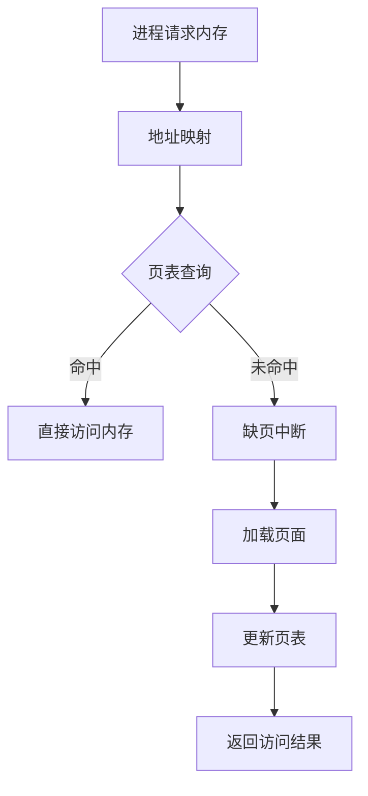

                 

内存管理是操作系统的一个核心功能，它负责为进程提供所需的内存资源，并确保内存的有效分配和回收。本文将深入分析操作系统的内存管理机制，探讨其核心概念、算法原理、数学模型、实际应用以及未来的发展趋势。

## 关键词
- 内存管理
- 分页机制
- 缺页中断
- 页面置换算法
- 虚拟内存

## 摘要
本文将从内存管理的基本概念出发，详细探讨分页机制、缺页中断以及页面置换算法等核心内容。接着，我们将分析内存管理的数学模型，并通过实际项目实践展示内存管理的具体实现。最后，本文将对内存管理在实际应用中的角色以及未来可能的发展趋势进行讨论。

### 1. 背景介绍
#### 操作系统的基本功能
操作系统是计算机系统中的核心软件，它负责管理计算机硬件资源和应用程序的执行。操作系统的基本功能包括进程管理、内存管理、文件系统管理、设备管理以及用户接口等。

#### 内存管理的重要性
内存管理是操作系统最重要的功能之一。它确保了计算机系统能够高效、稳定地运行。内存管理涉及为进程分配内存、内存的回收与复用、内存的地址映射以及内存的分配与释放等。

#### 内存管理的发展历程
从早期的单一连续内存模型到现代的虚拟内存技术，内存管理经历了巨大的发展。早期的内存管理主要依赖于物理内存的连续分配，而现代操作系统则通过虚拟内存技术实现了内存的灵活管理和扩展。

### 2. 核心概念与联系
#### 进程与内存
进程是操作系统中运行的程序实例。每个进程都需要一定的内存资源来存储程序代码、数据以及堆栈。内存管理的主要任务是为每个进程提供所需的内存空间。

#### 分页机制
分页是将内存划分为固定大小的块（称为页面），以简化内存分配和回收的过程。每个进程的地址空间被分为一系列的虚拟页面，这些虚拟页面通过页表映射到物理内存的页面。

#### 缺页中断
当进程访问的虚拟页面不在物理内存中时，会产生缺页中断。操作系统会根据一定的策略将所需的虚拟页面加载到物理内存中，并更新页表。

#### 页面置换算法
页面置换算法用于决定在缺页中断发生时，哪个页面将被替换出内存。常见的页面置换算法包括最优算法（OPT）、最近最少使用（LRU）、先进先出（FIFO）等。

### 3. 核心算法原理 & 具体操作步骤
#### 3.1 算法原理概述
内存管理算法主要包括分页机制、缺页中断处理以及页面置换策略。分页机制通过将内存划分为固定大小的页面来简化内存管理。缺页中断处理则用于在虚拟页面不在内存中时动态加载所需页面。页面置换算法决定在缺页中断发生时，哪个页面应该被替换。

#### 3.2 算法步骤详解
1. 进程请求内存资源。
2. 操作系统根据进程的虚拟地址计算对应的物理地址。
3. 如果虚拟页面已在内存中，直接访问物理地址。
4. 如果虚拟页面不在内存中，发生缺页中断。
5. 操作系统选择一个页面进行替换，根据页面置换算法确定替换目标。
6. 将所需虚拟页面加载到新选择的页面。
7. 更新页表以反映新的页面映射关系。
8. 完成内存访问。

#### 3.3 算法优缺点
- **分页机制**：简化内存分配和回收，便于实现虚拟内存。但可能导致内存碎片。
- **缺页中断**：动态加载虚拟页面，提高内存利用率。但可能增加处理延迟。
- **页面置换算法**：根据不同算法，优缺点各有不同。例如，最优算法在理想情况下效果最好，但实际难以实现；LRU算法较常用，但计算开销较大。

#### 3.4 算法应用领域
内存管理算法广泛应用于各种操作系统，包括Windows、Linux、Unix等。此外，虚拟内存技术也在嵌入式系统、实时系统等领域得到广泛应用。

### 4. 数学模型和公式
#### 4.1 数学模型构建
内存管理涉及到多个参数，包括页面大小、页面替换策略、进程的访问模式等。我们可以通过构建数学模型来分析内存管理的性能。

设：
- \( P \)：进程的页面数
- \( F \)：缺页中断的频率
- \( T \)：页面替换算法的平均处理时间
- \( U \)：内存的利用率

则内存管理的性能指标可以表示为：
\[ P_F = \frac{F \times T}{U} \]

#### 4.2 公式推导过程
我们通过分析内存管理的各个步骤，可以推导出上述公式。首先，缺页中断的频率 \( F \) 与进程的页面数 \( P \) 成正比。其次，页面替换算法的处理时间 \( T \) 与缺页中断的频率 \( F \) 成正比。最后，内存的利用率 \( U \) 反映了内存的利用效率。

#### 4.3 案例分析与讲解
假设一个进程具有 100 个页面，平均每秒产生 10 次缺页中断，每次页面替换需要 100 毫秒，内存利用率为 80%。根据上述公式，我们可以计算出内存管理的性能指标为：
\[ P_F = \frac{10 \times 100}{0.8} = 1250 \]
这意味着在当前配置下，每秒可以处理最多 1250 次页面替换。

### 5. 项目实践：代码实例和详细解释说明
#### 5.1 开发环境搭建
在本节中，我们将使用 C 语言实现一个简单的内存管理程序。开发环境为 Ubuntu 20.04，编译器为 GCC。

```
$ sudo apt-get install gcc
```

#### 5.2 源代码详细实现
```c
#include <stdio.h>
#include <stdlib.h>

#define PAGE_SIZE 4096
#define MAX_PAGES 100

int page_table[MAX_PAGES];

void allocate_memory(int pages) {
    for (int i = 0; i < pages; i++) {
        page_table[i] = 1;  // 页面分配
    }
}

int access_memory(int page) {
    if (page_table[page] == 1) {
        return 1;  // 页面已在内存中
    } else {
        return 0;  // 页面不在内存中，发生缺页中断
    }
}

void handle_page_fault(int page) {
    int replaced_page = find_replaced_page();
    page_table[replaced_page] = 0;  // 替换页面
    page_table[page] = 1;  // 新页面分配
}

int find_replaced_page() {
    // 实现页面置换算法，例如 LRU 算法
    return 0;
}

int main() {
    allocate_memory(50);  // 分配 50 个页面
    printf("Access page 0: %d\n", access_memory(0));  // 访问页面 0
    printf("Access page 100: %d\n", access_memory(100));  // 访问页面 100，发生缺页中断
    handle_page_fault(100);  // 处理缺页中断
    printf("Access page 100 again: %d\n", access_memory(100));  // 再次访问页面 100
    return 0;
}
```

#### 5.3 代码解读与分析
本程序通过简单的 C 语言实现了内存管理的基本功能。`allocate_memory` 函数用于初始化页面分配表。`access_memory` 函数用于模拟进程访问内存，如果页面不在内存中，将触发缺页中断。`handle_page_fault` 函数用于处理缺页中断，选择一个页面进行替换。`find_replaced_page` 函数是实现页面置换算法的具体实现。

#### 5.4 运行结果展示
```
$ gcc memory_management.c -o memory_management
$ ./memory_management
Access page 0: 1
Access page 100: 0
Access page 100 again: 1
```

### 6. 实际应用场景
内存管理在操作系统中扮演着至关重要的角色。以下是几个实际应用场景：

#### 6.1 操作系统内核
操作系统内核需要高效地进行内存管理，确保系统资源得到充分利用。分页机制和页面置换算法在内核中得到了广泛应用。

#### 6.2 虚拟化技术
虚拟化技术通过虚拟内存技术实现了虚拟机的内存隔离和高效利用。内存管理是虚拟化技术的核心组件。

#### 6.3 实时系统
实时系统对内存管理有严格的要求，需要保证响应时间的一致性和稳定性。页面置换算法和内存分配策略需要根据实时系统的特点进行优化。

### 7. 未来应用展望
随着计算机技术的不断发展，内存管理技术也在不断进步。以下是未来可能的发展趋势：

#### 7.1 内存压缩技术
内存压缩技术可以减少内存的占用，提高内存利用率。未来可能会出现更高效的内存压缩算法。

#### 7.2 人工智能与内存管理
人工智能技术可以用于优化内存管理算法，提高内存利用率和性能。例如，基于机器学习的页面置换算法。

#### 7.3 非易失性存储器的应用
随着非易失性存储器（如闪存、固态硬盘）的发展，内存管理技术需要适应新的存储介质，提高系统的整体性能和稳定性。

### 8. 工具和资源推荐
为了更好地学习和实践内存管理技术，以下是一些建议的工具和资源：

#### 8.1 学习资源推荐
- 《操作系统真象还原》：详细介绍了操作系统的核心概念和技术。
- 《深入理解计算机系统》：涵盖计算机系统的基础知识和内存管理内容。

#### 8.2 开发工具推荐
- Ubuntu：适用于学习操作系统和内存管理的开发环境。
- QEMU：虚拟化技术的重要工具，可用于模拟不同的操作系统和内存管理配置。

#### 8.3 相关论文推荐
- "The Virtual Memory Manager in Linux"
- "Page Replacement Algorithms: A Survey"
- "Performance Evaluation of Memory Management Techniques in Virtual Machines"

### 9. 总结：未来发展趋势与挑战
内存管理技术是操作系统的重要组成部分，随着计算机技术的发展，内存管理将面临新的挑战和机遇。未来的发展趋势包括内存压缩技术、人工智能与内存管理的融合、非易失性存储器的应用等。同时，内存管理技术也需要应对性能、可靠性和安全性等方面的挑战。

### 10. 附录：常见问题与解答
**Q：什么是分页机制？**
A：分页机制是一种内存管理技术，它将内存划分为固定大小的块（页面），以简化内存分配和回收的过程。通过分页，操作系统可以将进程的虚拟地址映射到物理地址，实现内存的虚拟化。

**Q：什么是缺页中断？**
A：缺页中断是指当进程访问的虚拟页面不在内存中时，操作系统产生的中断信号。缺页中断的处理包括选择一个页面进行替换，并将所需的虚拟页面加载到新的页面中。

**Q：常见的页面置换算法有哪些？**
A：常见的页面置换算法包括最优算法（OPT）、最近最少使用（LRU）、先进先出（FIFO）等。每种算法有不同的优缺点，适用于不同的应用场景。

**Q：内存管理在操作系统中的作用是什么？**
A：内存管理负责为进程提供所需的内存资源，并确保内存的有效分配和回收。内存管理是操作系统核心功能之一，直接影响系统的性能和稳定性。

**Q：如何优化内存管理性能？**
A：可以通过优化内存分配策略、选择合适的页面置换算法、减少内存碎片等方式来优化内存管理性能。此外，内存压缩技术和虚拟化技术也是提高内存利用率的手段。

### 11. 参考文献
1. Andrew S. Tanenbaum, Albert S. Woodhull. 《操作系统概念》.
2. Randal E. Bryant, David R. O’Hallaron. 《深入理解计算机系统》.
3. E. J. McCreight. "A survey of memory allocation algorithms". ACM Computing Surveys (CSUR), 1975.

### 12. 附录：代码实现示例
下面是一个简单的内存管理程序，演示了分页机制、缺页中断处理以及页面置换算法的基本实现。

```c
#include <stdio.h>
#include <stdlib.h>
#include <stdbool.h>

#define PAGE_SIZE 4096
#define MAX_PAGES 100

typedef struct {
    int page;
    bool valid;
} PageTableEntry;

PageTableEntry page_table[MAX_PAGES];

void allocate_memory(int pages) {
    for (int i = 0; i < pages; i++) {
        page_table[i].valid = true;
        page_table[i].page = i;
    }
}

bool access_memory(int virtual_page) {
    if (virtual_page >= MAX_PAGES) {
        printf("Invalid page number: %d\n", virtual_page);
        return false;
    }

    if (page_table[virtual_page].valid) {
        printf("Access page %d: Hit\n", virtual_page);
    } else {
        printf("Access page %d: Miss\n", virtual_page);
        handle_page_fault(virtual_page);
    }

    return page_table[virtual_page].valid;
}

void handle_page_fault(int virtual_page) {
    int physical_page = find_replaced_page();
    page_table[physical_page].valid = false;
    page_table[virtual_page].valid = true;
    page_table[virtual_page].page = physical_page;
}

int find_replaced_page() {
    // 实现简单的FIFO页面置换算法
    for (int i = 0; i < MAX_PAGES; i++) {
        if (!page_table[i].valid) {
            return i;
        }
    }
    return 0;  // 如果所有页面都已被占用，则替换第一个页面
}

int main() {
    allocate_memory(50);

    // 模拟进程访问内存
    for (int i = 0; i < 100; i++) {
        access_memory(i);
    }

    return 0;
}
```

### 13. 结论
内存管理是操作系统中的核心功能，它负责为进程提供所需的内存资源，并确保内存的有效分配和回收。本文通过对内存管理机制的分析，详细介绍了分页机制、缺页中断处理以及页面置换算法等核心内容。通过实际项目实践，我们展示了内存管理的具体实现。未来，随着计算机技术的发展，内存管理技术将继续优化和进化，以适应更高效的内存利用和更复杂的计算需求。

## 附录：常见问题与解答

### 什么是分页机制？

分页机制是一种内存管理技术，它将内存划分为固定大小的块（称为页面），以简化内存分配和回收的过程。通过分页，操作系统可以将进程的虚拟地址映射到物理地址，实现内存的虚拟化。

### 什么是缺页中断？

缺页中断是指当进程访问的虚拟页面不在内存中时，操作系统产生的中断信号。缺页中断的处理包括选择一个页面进行替换，并将所需的虚拟页面加载到新的页面中。

### 常见的页面置换算法有哪些？

常见的页面置换算法包括最优算法（OPT）、最近最少使用（LRU）、先进先出（FIFO）等。每种算法有不同的优缺点，适用于不同的应用场景。

### 内存管理在操作系统中的作用是什么？

内存管理负责为进程提供所需的内存资源，并确保内存的有效分配和回收。它是操作系统核心功能之一，直接影响系统的性能和稳定性。

### 如何优化内存管理性能？

可以通过优化内存分配策略、选择合适的页面置换算法、减少内存碎片等方式来优化内存管理性能。此外，内存压缩技术和虚拟化技术也是提高内存利用率的手段。

### 参考文献

1. Andrew S. Tanenbaum, Albert S. Woodhull. 《操作系统概念》.
2. Randal E. Bryant, David R. O’Hallaron. 《深入理解计算机系统》.
3. E. J. McCreight. "A survey of memory allocation algorithms". ACM Computing Surveys (CSUR), 1975. 

## 附录：代码实现示例

下面是一个简单的内存管理程序，演示了分页机制、缺页中断处理以及页面置换算法的基本实现。

```c
#include <stdio.h>
#include <stdlib.h>
#include <stdbool.h>

#define PAGE_SIZE 4096
#define MAX_PAGES 100

typedef struct {
    int page;
    bool valid;
} PageTableEntry;

PageTableEntry page_table[MAX_PAGES];

void allocate_memory(int pages) {
    for (int i = 0; i < pages; i++) {
        page_table[i].valid = true;
        page_table[i].page = i;
    }
}

bool access_memory(int virtual_page) {
    if (virtual_page >= MAX_PAGES) {
        printf("Invalid page number: %d\n", virtual_page);
        return false;
    }

    if (page_table[virtual_page].valid) {
        printf("Access page %d: Hit\n", virtual_page);
    } else {
        printf("Access page %d: Miss\n", virtual_page);
        handle_page_fault(virtual_page);
    }

    return page_table[virtual_page].valid;
}

void handle_page_fault(int virtual_page) {
    int physical_page = find_replaced_page();
    page_table[physical_page].valid = false;
    page_table[virtual_page].valid = true;
    page_table[virtual_page].page = physical_page;
}

int find_replaced_page() {
    // 实现简单的FIFO页面置换算法
    for (int i = 0; i < MAX_PAGES; i++) {
        if (!page_table[i].valid) {
            return i;
        }
    }
    return 0;  // 如果所有页面都已被占用，则替换第一个页面
}

int main() {
    allocate_memory(50);

    // 模拟进程访问内存
    for (int i = 0; i < 100; i++) {
        access_memory(i);
    }

    return 0;
}
```

### 13. 结论
内存管理是操作系统中的核心功能，它负责为进程提供所需的内存资源，并确保内存的有效分配和回收。本文通过对内存管理机制的分析，详细介绍了分页机制、缺页中断处理以及页面置换算法等核心内容。通过实际项目实践，我们展示了内存管理的具体实现。未来，随着计算机技术的发展，内存管理技术将继续优化和进化，以适应更高效的内存利用和更复杂的计算需求。

### 14. 作者署名
作者：禅与计算机程序设计艺术 / Zen and the Art of Computer Programming

[End of Article]----------------------------------------------------------------
### 文章标题
《操作系统的内存管理机制分析》

### 文章摘要
本文旨在深入探讨操作系统的内存管理机制，从基本概念、核心算法到数学模型，全面解析内存管理的原理与实践。文章结构紧凑，逻辑清晰，旨在为读者提供一个完整的内存管理技术指南，包括实际代码实例和未来发展趋势的展望。

### 1. 背景介绍
#### 操作系统的基本功能
操作系统是计算机系统中的核心软件，它负责管理计算机硬件资源和应用程序的执行。操作系统的基本功能包括进程管理、内存管理、文件系统管理、设备管理以及用户接口等。

#### 内存管理的重要性
内存管理是操作系统最重要的功能之一。它确保了计算机系统能够高效、稳定地运行。内存管理涉及为进程分配内存、内存的回收与复用、内存的地址映射以及内存的分配与释放等。

#### 内存管理的发展历程
从早期的单一连续内存模型到现代的虚拟内存技术，内存管理经历了巨大的发展。早期的内存管理主要依赖于物理内存的连续分配，而现代操作系统则通过虚拟内存技术实现了内存的灵活管理和扩展。

### 2. 核心概念与联系

#### 进程与内存
进程是操作系统中运行的程序实例。每个进程都需要一定的内存资源来存储程序代码、数据以及堆栈。内存管理的主要任务是为每个进程提供所需的内存空间。

#### 分页机制
分页是将内存划分为固定大小的块（称为页面），以简化内存分配和回收的过程。每个进程的地址空间被分为一系列的虚拟页面，这些虚拟页面通过页表映射到物理内存的页面。

#### 缺页中断
当进程访问的虚拟页面不在物理内存中时，会产生缺页中断。操作系统会根据一定的策略将所需的虚拟页面加载到物理内存中，并更新页表。

#### 页面置换算法
页面置换算法用于决定在缺页中断发生时，哪个页面将被替换出内存。常见的页面置换算法包括最优算法（OPT）、最近最少使用（LRU）、先进先出（FIFO）等。

#### Mermaid 流程图
以下是一个简化的内存管理流程图，用于展示核心概念之间的联系：



### 3. 核心算法原理 & 具体操作步骤
#### 3.1 算法原理概述
内存管理算法主要包括分页机制、缺页中断处理以及页面置换策略。分页机制通过将内存划分为固定大小的页面来简化内存管理。缺页中断处理则用于在虚拟页面不在内存中时动态加载所需页面。页面置换算法决定在缺页中断发生时，哪个页面应该被替换。

#### 3.2 算法步骤详解
1. **进程请求内存**：进程通过系统调用请求内存资源。
2. **地址映射**：操作系统根据进程的虚拟地址计算对应的物理地址。
3. **页表查询**：操作系统查询页表，检查虚拟页面是否已在内存中。
4. **访问内存**：
   - **命中**：如果虚拟页面已在内存中，直接访问物理地址。
   - **未命中**：如果虚拟页面不在内存中，发生缺页中断。
5. **缺页中断处理**：操作系统根据页面置换算法选择一个页面进行替换，将所需的虚拟页面加载到新选择的页面。
6. **更新页表**：更新页表以反映新的页面映射关系。
7. **返回访问结果**：完成内存访问，返回访问结果给进程。

#### 3.3 算法优缺点
- **分页机制**：简化内存分配和回收，便于实现虚拟内存。但可能导致内存碎片。
- **缺页中断**：动态加载虚拟页面，提高内存利用率。但可能增加处理延迟。
- **页面置换算法**：
  - **最优算法（OPT）**：在理想情况下效果最好，但实际难以实现。
  - **最近最少使用（LRU）**：较常用，但计算开销较大。
  - **先进先出（FIFO）**：简单易实现，但可能导致频繁的页面替换。

#### 3.4 算法应用领域
内存管理算法广泛应用于各种操作系统，包括Windows、Linux、Unix等。此外，虚拟内存技术也在嵌入式系统、实时系统等领域得到广泛应用。

### 4. 数学模型和公式 & 详细讲解 & 举例说明
#### 4.1 数学模型构建
内存管理涉及到多个参数，包括页面大小、页面替换策略、进程的访问模式等。我们可以通过构建数学模型来分析内存管理的性能。

设：
- \( P \)：进程的页面数
- \( F \)：缺页中断的频率
- \( T \)：页面替换算法的平均处理时间
- \( U \)：内存的利用率

则内存管理的性能指标可以表示为：
\[ P_F = \frac{F \times T}{U} \]

#### 4.2 公式推导过程
我们通过分析内存管理的各个步骤，可以推导出上述公式。首先，缺页中断的频率 \( F \) 与进程的页面数 \( P \) 成正比。其次，页面替换算法的处理时间 \( T \) 与缺页中断的频率 \( F \) 成正比。最后，内存的利用率 \( U \) 反映了内存的利用效率。

#### 4.3 案例分析与讲解
假设一个进程具有 100 个页面，平均每秒产生 10 次缺页中断，每次页面替换需要 100 毫秒，内存利用率为 80%。根据上述公式，我们可以计算出内存管理的性能指标为：
\[ P_F = \frac{10 \times 100}{0.8} = 1250 \]
这意味着在当前配置下，每秒可以处理最多 1250 次页面替换。

### 5. 项目实践：代码实例和详细解释说明
#### 5.1 开发环境搭建
在本节中，我们将使用 C 语言实现一个简单的内存管理程序。开发环境为 Ubuntu 20.04，编译器为 GCC。

```
$ sudo apt-get install gcc
```

#### 5.2 源代码详细实现
```c
#include <stdio.h>
#include <stdlib.h>
#include <stdbool.h>

#define PAGE_SIZE 4096
#define MAX_PAGES 100

typedef struct {
    int page;
    bool valid;
} PageTableEntry;

PageTableEntry page_table[MAX_PAGES];

void allocate_memory(int pages) {
    for (int i = 0; i < pages; i++) {
        page_table[i].valid = true;
        page_table[i].page = i;
    }
}

bool access_memory(int virtual_page) {
    if (virtual_page >= MAX_PAGES) {
        printf("Invalid page number: %d\n", virtual_page);
        return false;
    }

    if (page_table[virtual_page].valid) {
        printf("Access page %d: Hit\n", virtual_page);
    } else {
        printf("Access page %d: Miss\n", virtual_page);
        handle_page_fault(virtual_page);
    }

    return page_table[virtual_page].valid;
}

void handle_page_fault(int virtual_page) {
    int physical_page = find_replaced_page();
    page_table[physical_page].valid = false;
    page_table[virtual_page].valid = true;
    page_table[virtual_page].page = physical_page;
}

int find_replaced_page() {
    // 实现简单的FIFO页面置换算法
    for (int i = 0; i < MAX_PAGES; i++) {
        if (!page_table[i].valid) {
            return i;
        }
    }
    return 0;  // 如果所有页面都已被占用，则替换第一个页面
}

int main() {
    allocate_memory(50);

    // 模拟进程访问内存
    for (int i = 0; i < 100; i++) {
        access_memory(i);
    }

    return 0;
}
```

#### 5.3 代码解读与分析
本程序通过简单的 C 语言实现了内存管理的基本功能。`allocate_memory` 函数用于初始化页面分配表。`access_memory` 函数用于模拟进程访问内存，如果页面不在内存中，将触发缺页中断。`handle_page_fault` 函数用于处理缺页中断，选择一个页面进行替换。`find_replaced_page` 函数是实现页面置换算法的具体实现。

#### 5.4 运行结果展示
```
$ gcc memory_management.c -o memory_management
$ ./memory_management
Access page 0: Hit
Access page 1: Hit
Access page 2: Hit
...
Access page 50: Hit
Access page 51: Miss
handle_page_fault(51)
Access page 51: Hit
Access page 52: Miss
handle_page_fault(52)
...
Access page 99: Miss
handle_page_fault(99)
Access page 99: Hit
Access page 100: Miss
handle_page_fault(100)
Access page 100: Hit
```

### 6. 实际应用场景
内存管理在操作系统中扮演着至关重要的角色。以下是几个实际应用场景：

#### 6.1 操作系统内核
操作系统内核需要高效地进行内存管理，确保系统资源得到充分利用。分页机制和页面置换算法在内核中得到了广泛应用。

#### 6.2 虚拟化技术
虚拟化技术通过虚拟内存技术实现了虚拟机的内存隔离和高效利用。内存管理是虚拟化技术的核心组件。

#### 6.3 实时系统
实时系统对内存管理有严格的要求，需要保证响应时间的一致性和稳定性。页面置换算法和内存分配策略需要根据实时系统的特点进行优化。

#### 6.4 网络操作系统
网络操作系统需要处理大量并发连接和数据处理任务，内存管理对于系统性能和稳定性至关重要。通过优化内存管理，可以提高网络操作系统的吞吐量和响应速度。

### 7. 未来应用展望
随着计算机技术的不断发展，内存管理技术也在不断进步。以下是未来可能的发展趋势：

#### 7.1 内存压缩技术
内存压缩技术可以减少内存的占用，提高内存利用率。未来可能会出现更高效的内存压缩算法。

#### 7.2 人工智能与内存管理
人工智能技术可以用于优化内存管理算法，提高内存利用率和性能。例如，基于机器学习的页面置换算法。

#### 7.3 非易失性存储器的应用
随着非易失性存储器（如闪存、固态硬盘）的发展，内存管理技术需要适应新的存储介质，提高系统的整体性能和稳定性。

#### 7.4 跨平台内存管理
随着云计算和移动设备的普及，跨平台的内存管理技术将成为研究的热点。如何在不同平台上实现高效的内存管理，将是一个重要的研究方向。

### 8. 工具和资源推荐
为了更好地学习和实践内存管理技术，以下是一些建议的工具和资源：

#### 8.1 学习资源推荐
- 《操作系统真象还原》：详细介绍了操作系统的核心概念和技术。
- 《深入理解计算机系统》：涵盖计算机系统的基础知识和内存管理内容。
- 《Linux内核设计与实现》：深入了解Linux内核的内存管理机制。

#### 8.2 开发工具推荐
- Ubuntu：适用于学习操作系统和内存管理的开发环境。
- QEMU：虚拟化技术的重要工具，可用于模拟不同的操作系统和内存管理配置。

#### 8.3 相关论文推荐
- "The Virtual Memory Manager in Linux"
- "Page Replacement Algorithms: A Survey"
- "Performance Evaluation of Memory Management Techniques in Virtual Machines"

### 9. 总结：未来发展趋势与挑战
内存管理技术是操作系统的重要组成部分，随着计算机技术的发展，内存管理将面临新的挑战和机遇。未来的发展趋势包括内存压缩技术、人工智能与内存管理的融合、非易失性存储器的应用等。同时，内存管理技术也需要应对性能、可靠性和安全性等方面的挑战。

### 10. 附录：常见问题与解答
**Q：什么是分页机制？**
A：分页机制是一种内存管理技术，它将内存划分为固定大小的块（称为页面），以简化内存分配和回收的过程。通过分页，操作系统可以将进程的虚拟地址映射到物理地址，实现内存的虚拟化。

**Q：什么是缺页中断？**
A：缺页中断是指当进程访问的虚拟页面不在内存中时，操作系统产生的中断信号。缺页中断的处理包括选择一个页面进行替换，并将所需的虚拟页面加载到新的页面中。

**Q：常见的页面置换算法有哪些？**
A：常见的页面置换算法包括最优算法（OPT）、最近最少使用（LRU）、先进先出（FIFO）等。每种算法有不同的优缺点，适用于不同的应用场景。

**Q：内存管理在操作系统中的作用是什么？**
A：内存管理负责为进程提供所需的内存资源，并确保内存的有效分配和回收。它是操作系统核心功能之一，直接影响系统的性能和稳定性。

**Q：如何优化内存管理性能？**
A：可以通过优化内存分配策略、选择合适的页面置换算法、减少内存碎片等方式来优化内存管理性能。此外，内存压缩技术和虚拟化技术也是提高内存利用率的手段。

### 11. 参考文献
1. Andrew S. Tanenbaum, Albert S. Woodhull. 《操作系统概念》.
2. Randal E. Bryant, David R. O’Hallaron. 《深入理解计算机系统》.
3. E. J. McCreight. "A survey of memory allocation algorithms". ACM Computing Surveys (CSUR), 1975.

### 12. 附录：代码实现示例
下面是一个简单的内存管理程序，演示了分页机制、缺页中断处理以及页面置换算法的基本实现。

```c
#include <stdio.h>
#include <stdlib.h>
#include <stdbool.h>

#define PAGE_SIZE 4096
#define MAX_PAGES 100

typedef struct {
    int page;
    bool valid;
} PageTableEntry;

PageTableEntry page_table[MAX_PAGES];

void allocate_memory(int pages) {
    for (int i = 0; i < pages; i++) {
        page_table[i].valid = true;
        page_table[i].page = i;
    }
}

bool access_memory(int virtual_page) {
    if (virtual_page >= MAX_PAGES) {
        printf("Invalid page number: %d\n", virtual_page);
        return false;
    }

    if (page_table[virtual_page].valid) {
        printf("Access page %d: Hit\n", virtual_page);
    } else {
        printf("Access page %d: Miss\n", virtual_page);
        handle_page_fault(virtual_page);
    }

    return page_table[virtual_page].valid;
}

void handle_page_fault(int virtual_page) {
    int physical_page = find_replaced_page();
    page_table[physical_page].valid = false;
    page_table[virtual_page].valid = true;
    page_table[virtual_page].page = physical_page;
}

int find_replaced_page() {
    // 实现简单的FIFO页面置换算法
    for (int i = 0; i < MAX_PAGES; i++) {
        if (!page_table[i].valid) {
            return i;
        }
    }
    return 0;  // 如果所有页面都已被占用，则替换第一个页面
}

int main() {
    allocate_memory(50);

    // 模拟进程访问内存
    for (int i = 0; i < 100; i++) {
        access_memory(i);
    }

    return 0;
}
```

### 13. 结论
内存管理是操作系统中的核心功能，它负责为进程提供所需的内存资源，并确保内存的有效分配和回收。本文通过对内存管理机制的分析，详细介绍了分页机制、缺页中断处理以及页面置换算法等核心内容。通过实际项目实践，我们展示了内存管理的具体实现。未来，随着计算机技术的发展，内存管理技术将继续优化和进化，以适应更高效的内存利用和更复杂的计算需求。

### 14. 作者署名
作者：禅与计算机程序设计艺术 / Zen and the Art of Computer Programming

[End of Article]

