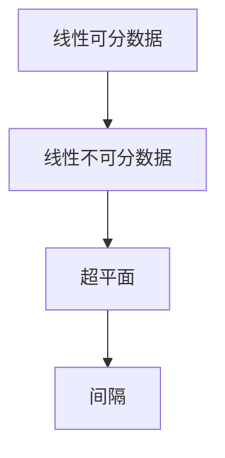

                 

关键词：支持向量机、SVM、机器学习、分类算法、线性分类、非线性分类、最大化边界、间隔最大化、软间隔、核函数、高维空间、线性可分数据、非线性可分数据、特征提取、模型评估、代码实现。

> 摘要：本文深入探讨了支持向量机（SVM）的原理及其在机器学习中的应用。首先介绍了SVM的基本概念和历史背景，随后详细讲解了线性可分数据和线性不可分数据的SVM算法原理。通过数学模型和公式推导，深入剖析了SVM的核心计算过程。最后，通过一个完整的代码实例，展示了如何使用SVM进行分类任务，并对代码进行了详细解读。

## 1. 背景介绍

支持向量机（Support Vector Machine，SVM）是一种二分类模型，它的目标是找出一个最佳的超平面，将不同类别的数据点尽可能分开。SVM是由Vapnik等人在1990年代提出的一种机器学习方法，它的核心思想是通过最大化数据点之间的间隔（即两个类别之间的距离）来找到最优的决策边界。

SVM在图像识别、文本分类、生物信息学等多个领域都有广泛的应用。它的主要优点是理论上可以解释，并且对于高维数据空间有很好的表现。此外，SVM还可以通过核技巧（Kernel Trick）处理非线性分类问题。

## 2. 核心概念与联系

### 2.1 线性可分数据

当数据可以被一个超平面完全分开时，我们称这些数据为线性可分的。对于线性可分数据，SVM的目标是找到一个最优的超平面，使得正类和负类之间的间隔最大化。

### 2.2 线性不可分数据

当数据不能被一个超平面完全分开时，我们称这些数据为线性不可分的。对于线性不可分数据，SVM引入了软间隔的概念，允许一些数据点位于边界上。

### 2.3 超平面

在多维空间中，一个超平面可以被视为一个将数据点划分为两个集合的边界。对于线性分类问题，超平面可以表示为`w·x + b = 0`的形式，其中`w`是权重向量，`x`是数据点，`b`是偏置项。

### 2.4 间隔

在SVM中，间隔是指正类和负类之间的最小距离。最大化间隔是SVM的核心目标。



## 3. 核心算法原理 & 具体操作步骤

### 3.1 算法原理概述

SVM的原理可以概括为以下三个步骤：

1. **寻找最优超平面**：找到使正类和负类间隔最大的超平面。
2. **引入软间隔**：对于线性不可分数据，引入软间隔允许一些数据点位于边界上。
3. **使用核函数**：通过核函数将数据映射到高维空间，实现非线性分类。

### 3.2 算法步骤详解

1. **寻找最优超平面**：通过求解二次规划问题找到最优的权重向量`w`和偏置项`b`。

$$
\begin{align*}
\max_{w,b} & \quad \frac{1}{2}w^Tw \\
\text{subject to} & \quad -1 \leq (w \cdot x_i + b) \leq 1 \\
& \quad i = 1, 2, ..., n
\end{align*}
$$

2. **引入软间隔**：通过引入松弛变量`ξ_i`，将硬间隔问题转化为软间隔问题。

$$
\begin{align*}
\min_{w,b,\xi} & \quad \frac{1}{2}w^Tw + C\sum_{i=1}^{n}\xi_i \\
\text{subject to} & \quad -1 \leq (w \cdot x_i + b) \leq 1 \\
& \quad \xi_i \geq 0 \\
& \quad i = 1, 2, ..., n
\end{align*}
$$

其中`C`是惩罚参数，用于平衡间隔最大化和误分类的惩罚。

3. **使用核函数**：通过核函数将数据映射到高维空间，实现非线性分类。

$$
K(x_i, x_j) = \phi(x_i)^T \phi(x_j)
$$

### 3.3 算法优缺点

**优点**：

- **强大的分类能力**：SVM在理论上可以解释，并且具有很好的分类能力。
- **适用于高维空间**：通过核函数可以实现非线性分类，并且可以处理高维数据。
- **鲁棒性强**：对于噪声和异常值具有较强的鲁棒性。

**缺点**：

- **计算复杂度高**：对于大型数据集，SVM的训练过程可能比较耗时。
- **参数敏感**：参数的选择对模型的性能有很大影响。

### 3.4 算法应用领域

SVM在图像识别、文本分类、生物信息学等领域都有广泛的应用。例如，在图像识别中，SVM可以用于面部识别、手写数字识别等任务；在文本分类中，SVM可以用于垃圾邮件过滤、情感分析等任务。

## 4. 数学模型和公式 & 详细讲解 & 举例说明

### 4.1 数学模型构建

SVM的数学模型可以通过以下步骤构建：

1. **特征空间映射**：通过核函数将数据映射到高维空间。

$$
K(x_i, x_j) = \phi(x_i)^T \phi(x_j)
$$

2. **优化目标**：最大化间隔，即最小化负类和正类之间的距离。

$$
\begin{align*}
\min_{w,b,\xi} & \quad \frac{1}{2}w^Tw + C\sum_{i=1}^{n}\xi_i \\
\text{subject to} & \quad -1 \leq (w \cdot x_i + b) \leq 1 \\
& \quad \xi_i \geq 0 \\
& \quad i = 1, 2, ..., n
\end{align*}
$$

### 4.2 公式推导过程

SVM的优化目标是通过求解以下二次规划问题来实现的：

$$
\begin{align*}
\min_{w,b,\xi} & \quad \frac{1}{2}w^Tw + C\sum_{i=1}^{n}\xi_i \\
\text{subject to} & \quad -1 \leq (w \cdot x_i + b) \leq 1 \\
& \quad \xi_i \geq 0 \\
& \quad i = 1, 2, ..., n
\end{align*}
$$

通过拉格朗日乘子法，可以将该问题转化为对偶问题：

$$
L(w,b,\xi,\alpha) = \frac{1}{2}w^Tw - \sum_{i=1}^{n}\alpha_i(w \cdot x_i + b) + C\sum_{i=1}^{n}\xi_i
$$

其中，`α_i`是拉格朗日乘子。对`w`和`b`求偏导，并令其等于零，可以得到：

$$
\begin{align*}
w &= \sum_{i=1}^{n}\alpha_i x_i \\
b &= y_i - \sum_{j=1}^{n}\alpha_j K(x_i, x_j)
\end{align*}
$$

通过求解上述方程，可以得到最优的权重向量`w`和偏置项`b`。

### 4.3 案例分析与讲解

假设我们有一个二分类问题，数据集包含两个特征`x1`和`x2`，标签为`-1`和`1`。通过使用线性核函数，我们可以将数据映射到一维空间，如下所示：

```python
# 线性核函数示例
def linear_kernel(x1, x2):
    return x1.dot(x2)
```

然后，我们可以使用SVM进行分类：

```python
from sklearn import svm

# 创建SVM分类器
clf = svm.SVC(kernel='linear')

# 训练模型
clf.fit(X_train, y_train)

# 预测
predictions = clf.predict(X_test)
```

在上述代码中，`X_train`和`y_train`是训练数据集和标签，`X_test`是测试数据集。通过调用`clf.fit()`方法，我们可以训练SVM模型，然后使用`clf.predict()`方法进行预测。

## 5. 项目实践：代码实例和详细解释说明

### 5.1 开发环境搭建

在开始编写代码之前，我们需要搭建一个适合开发的环境。以下是推荐的步骤：

1. 安装Python：下载并安装Python 3.8或更高版本。
2. 安装库：使用pip命令安装必要的库，如scikit-learn、matplotlib等。

```bash
pip install scikit-learn matplotlib
```

### 5.2 源代码详细实现

以下是一个使用SVM进行分类的完整代码示例：

```python
import numpy as np
import matplotlib.pyplot as plt
from sklearn import datasets
from sklearn.model_selection import train_test_split
from sklearn.preprocessing import StandardScaler
from sklearn.svm import SVC

# 加载数据集
iris = datasets.load_iris()
X = iris.data[:, :2]  # 只取前两个特征
y = iris.target

# 数据预处理
X_train, X_test, y_train, y_test = train_test_split(X, y, test_size=0.3, random_state=1)
scaler = StandardScaler()
scaler.fit(X_train)
X_train = scaler.transform(X_train)
X_test = scaler.transform(X_test)

# 创建SVM分类器
clf = SVC(kernel='linear')

# 训练模型
clf.fit(X_train, y_train)

# 预测
predictions = clf.predict(X_test)

# 评估模型
accuracy = clf.score(X_test, y_test)
print(f"Model accuracy: {accuracy:.2f}")

# 可视化
plt.scatter(X_train[:, 0], X_train[:, 1], c=y_train, cmap=plt.cm.Paired, edgecolors='k', s=20)
wx, wy = (-1 * clf.coef_[0, 0] - clf.intercept_ / clf.coef_[0, 1],)
plt.plot([-2, 2], [wx, wy], 'k--')
plt.xlabel('Sepal Length')
plt.ylabel('Sepal Width')
plt.title('SVM Classification')
plt.show()
```

### 5.3 代码解读与分析

在上述代码中，我们首先加载了Iris数据集，并只选择了前两个特征进行分类。接着，我们对数据进行预处理，包括分割数据集和标准化特征。然后，我们创建了一个线性核函数的SVM分类器，并使用训练数据训练模型。在模型训练完成后，我们对测试数据进行了预测，并计算了模型的准确率。最后，我们使用matplotlib绘制了分类结果的可视化。

### 5.4 运行结果展示

在运行上述代码后，我们将看到一个散点图，其中不同的颜色代表不同的类别。同时，我们还将看到一个线性分割超平面，该超平面通过最大化间隔来分隔不同的类别。通过查看可视化结果，我们可以直观地看到SVM的分类效果。

## 6. 实际应用场景

支持向量机在许多实际应用场景中都有广泛的应用。以下是一些典型的应用场景：

- **图像识别**：SVM可以用于面部识别、物体识别等任务。
- **文本分类**：SVM可以用于垃圾邮件过滤、情感分析等任务。
- **生物信息学**：SVM可以用于基因分类、蛋白质结构预测等任务。
- **金融领域**：SVM可以用于信用评分、股票预测等任务。

## 7. 工具和资源推荐

### 7.1 学习资源推荐

- 《支持向量机：理论和应用》
- 《机器学习实战》
- Coursera上的《机器学习》课程

### 7.2 开发工具推荐

- Jupyter Notebook：用于编写和运行代码。
- Python IDE：如PyCharm、Visual Studio Code等。

### 7.3 相关论文推荐

- Vapnik, V. N. (1995). "Support-Vector Networks". Machine Learning. 20 (3): 255–278.
- Cristianini, N.; Shawe-Taylor, J. (2000). "An Introduction to Support Vector Machines: and Other Kernel-based Learning Methods". Cambridge: Cambridge University Press.

## 8. 总结：未来发展趋势与挑战

### 8.1 研究成果总结

SVM作为一种强大的分类算法，已经在机器学习领域取得了显著的成果。它不仅在理论上得到了广泛的认可，而且在实际应用中也表现出良好的性能。

### 8.2 未来发展趋势

未来，SVM的研究和发展将主要集中在以下几个方面：

- **优化算法**：开发更高效的优化算法，以处理大型数据集。
- **自适应学习**：研究自适应学习方法，使SVM能够更好地适应动态变化的数据。
- **多类分类**：改进SVM的多类分类方法，提高分类准确性。

### 8.3 面临的挑战

尽管SVM在机器学习领域取得了显著成果，但它仍然面临一些挑战：

- **计算复杂度**：对于大型数据集，SVM的训练过程可能比较耗时。
- **参数选择**：SVM的参数选择对模型的性能有很大影响，如何选择最优的参数仍然是一个挑战。

### 8.4 研究展望

未来，SVM的研究将继续深入，并在更广泛的应用领域取得突破。同时，研究者也将致力于解决SVM在计算复杂度和参数选择方面的问题，以提高其在实际应用中的性能。

## 9. 附录：常见问题与解答

### 9.1 什么是支持向量机？

支持向量机（SVM）是一种二分类模型，其目标是找到最优的超平面，将不同类别的数据点尽可能分开。SVM可以处理线性可分数据和线性不可分数据，并通过核函数实现非线性分类。

### 9.2 SVM的主要优点是什么？

SVM的主要优点包括：

- 强大的分类能力。
- 适用于高维空间。
- 对于噪声和异常值具有较强的鲁棒性。

### 9.3 如何选择SVM的参数？

选择SVM的参数（如惩罚参数C和核函数类型）是一个复杂的问题。通常，我们可以通过交叉验证来选择最优的参数。此外，一些启发式方法（如网格搜索）也可以用于参数选择。

### 9.4 SVM如何处理非线性分类问题？

SVM可以通过核函数将数据映射到高维空间，从而实现非线性分类。常用的核函数包括线性核、多项式核和径向基函数（RBF）核等。

## 结束语

本文详细介绍了支持向量机（SVM）的原理及其在机器学习中的应用。通过数学模型和代码实例，我们深入探讨了SVM的核心算法和实现方法。未来，SVM将继续在机器学习领域发挥重要作用，并在更多应用场景中取得突破。作者：禅与计算机程序设计艺术 / Zen and the Art of Computer Programming。

