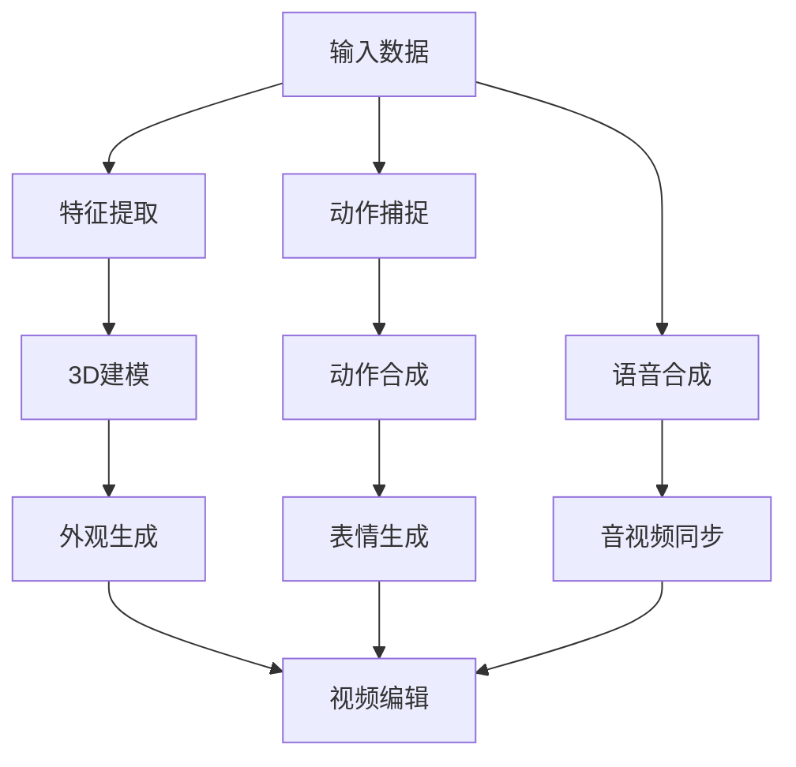

                 

关键词：数字人技术、短视频、人工智能、应用场景、未来发展

> 摘要：随着短视频的普及和用户需求的多样化，数字人技术逐渐成为短视频领域的重要创新力量。本文将从数字人的定义、应用场景、算法原理、数学模型、项目实践和未来展望等方面，全面探讨数字人技术在短视频中的应用及其发展趋势。

## 1. 背景介绍

短视频作为一种新兴的媒体形式，迅速崛起并成为用户获取信息、娱乐和社交的重要途径。据统计，全球短视频用户已超过数十亿，市场规模也在不断扩大。与此同时，人工智能技术的快速发展，尤其是计算机视觉和自然语言处理技术的突破，为短视频内容创作和分发带来了新的可能性。

数字人，作为一种基于人工智能技术构建的虚拟形象，具有高度的拟人化和互动性。数字人技术不仅可以在短视频内容创作中发挥重要作用，还可以在视频编辑、用户互动、广告投放等方面产生深远影响。

本文将围绕数字人技术在短视频中的应用，分析其核心算法原理、数学模型、项目实践和未来发展趋势，旨在为行业从业者提供有价值的参考和启示。

## 2. 核心概念与联系

### 2.1 数字人的定义与特征

数字人是指通过计算机图形学、语音合成、动作捕捉等技术构建的虚拟形象，具有与真实人类相似的外观、行为和情感。数字人的核心特征包括：

- **外观相似**：数字人的外貌可以通过3D建模、图像处理等技术实现高度拟人化。
- **行为自然**：数字人可以通过语音合成、动作捕捉等技术实现自然流畅的动作和表情。
- **情感丰富**：数字人可以通过情感计算、虚拟现实等技术模拟出丰富的情感表达。

### 2.2 数字人技术在短视频中的应用

数字人技术在短视频中的应用主要包括以下几个方面：

- **内容创作**：数字人可以作为短视频内容创作的助手，协助制作有趣、生动的视频内容。
- **视频编辑**：数字人技术可以帮助实现视频编辑的自动化和智能化，提高视频质量。
- **用户互动**：数字人可以作为虚拟主播，与用户进行实时互动，提升用户体验。
- **广告投放**：数字人可以用于广告制作和投放，提高广告效果和转化率。

### 2.3 数字人技术架构图

以下是数字人技术架构的Mermaid流程图，展示了数字人技术的核心组件和联系：



## 3. 核心算法原理 & 具体操作步骤

### 3.1 算法原理概述

数字人技术的核心算法主要包括3D建模、动作捕捉、语音合成、表情生成等。这些算法的基本原理如下：

- **3D建模**：通过几何建模、纹理映射等技术，将数字人的外观进行三维化处理。
- **动作捕捉**：利用红外线、激光等传感器，捕捉真实人类的行为，将其转化为数字人动作。
- **语音合成**：通过语音识别、语音合成等技术，将文本转化为自然流畅的语音。
- **表情生成**：通过情感计算、图像处理等技术，模拟出数字人的表情。

### 3.2 算法步骤详解

#### 3.2.1 3D建模

1. **数据采集**：收集数字人的面部特征、身体尺寸、服装样式等数据。
2. **几何建模**：利用Blender、Maya等软件，对数字人进行三维建模。
3. **纹理映射**：为数字人模型添加皮肤、衣物等纹理。

#### 3.2.2 动作捕捉

1. **硬件准备**：配置红外线、激光等动作捕捉设备。
2. **数据采集**：在特定环境中，捕捉真实人类的行为数据。
3. **数据处理**：对采集到的动作数据进行处理，提取关键帧和关键点。

#### 3.2.3 语音合成

1. **文本输入**：输入需要合成的文本。
2. **语音识别**：将文本转化为语音指令。
3. **语音合成**：利用WaveNet、Tacotron等模型，将语音指令转化为自然流畅的语音。

#### 3.2.4 表情生成

1. **情感计算**：根据数字人情绪，计算表情参数。
2. **图像处理**：利用图像处理算法，生成符合情感的表情图像。
3. **表情合成**：将表情图像与数字人模型进行合成。

### 3.3 算法优缺点

#### 优点

- **高度拟人化**：数字人技术可以实现高度拟人化的外观、行为和情感。
- **灵活性强**：数字人可以根据需求进行定制，适用于多种场景。
- **互动性强**：数字人可以与用户进行实时互动，提高用户体验。

#### 缺点

- **技术门槛高**：数字人技术涉及多个领域的知识，技术门槛较高。
- **成本较高**：数字人技术需要大量的计算资源和硬件设备，成本较高。
- **表现力有限**：尽管数字人技术已经取得很大进展，但仍然难以完全模拟真实人类的情感和行为。

### 3.4 算法应用领域

- **短视频内容创作**：数字人可以作为短视频内容创作的助手，协助制作有趣、生动的视频内容。
- **直播互动**：数字人可以作为虚拟主播，与用户进行实时互动，提高直播效果。
- **广告营销**：数字人可以用于广告制作和投放，提高广告效果和转化率。
- **教育培训**：数字人可以应用于教育培训领域，提供个性化教学和互动体验。

## 4. 数学模型和公式 & 详细讲解 & 举例说明

### 4.1 数学模型构建

数字人技术的核心数学模型主要包括3D建模、动作捕捉、语音合成、表情生成等。以下分别介绍这些模型的构建方法和相关公式。

#### 4.1.1 3D建模

- **几何建模**：利用Bézier曲面、NURBS曲面等几何建模方法，构建数字人模型。
- **纹理映射**：利用纹理映射公式，将纹理图像映射到数字人模型表面。

#### 4.1.2 动作捕捉

- **关键帧提取**：利用插值算法，如线性插值、贝塞尔插值等，提取关键帧。
- **关键点计算**：利用计算机视觉算法，计算数字人模型的关键点位置。

#### 4.1.3 语音合成

- **语音识别**：利用HMM（隐马尔可夫模型）、DNN（深度神经网络）等语音识别算法，将文本转化为语音指令。
- **语音合成**：利用WaveNet、Tacotron等语音合成模型，将语音指令转化为自然流畅的语音。

#### 4.1.4 表情生成

- **情感计算**：利用情感计算模型，计算数字人的情感参数。
- **图像处理**：利用图像处理算法，如边缘检测、特征提取等，生成符合情感的表情图像。

### 4.2 公式推导过程

以下以3D建模中的纹理映射公式为例，介绍数学模型的推导过程。

#### 4.2.1 纹理映射公式

假设数字人模型的表面可以用一个参数曲面来描述，其参数方程为：

$$
P(u, v) = (x(u, v), y(u, v), z(u, v))
$$

其中，$u, v$是参数空间中的坐标。

纹理图像的坐标也可以表示为：

$$
I(u, v) = (x_u, y_u, z_u)
$$

为了将纹理图像映射到数字人模型表面，需要找到一个映射关系，将纹理坐标$I(u, v)$映射到模型表面坐标$P(u, v)$。

根据相似三角形的原理，可以得到：

$$
\frac{x - x_0}{x_u - x_0} = \frac{y - y_0}{y_u - y_0} = \frac{z - z_0}{z_u - z_0}
$$

其中，$(x_0, y_0, z_0)$是纹理图像的坐标原点。

通过上述公式，可以将纹理图像的坐标映射到数字人模型表面。

### 4.3 案例分析与讲解

以下以数字人视频编辑为例，分析数字人技术在短视频中的应用。

#### 4.3.1 项目背景

某短视频平台计划推出一款基于数字人的短视频编辑工具，用户可以通过该工具轻松创建有趣、个性化的短视频。

#### 4.3.2 技术实现

1. **3D建模**：利用Blender等软件，为数字人创建外观模型。包括面部、身体、服装等部分。
2. **动作捕捉**：利用动作捕捉设备，捕捉数字人的动作数据，包括头部运动、身体姿态等。
3. **语音合成**：利用语音合成模型，为数字人生成自然流畅的语音。
4. **表情生成**：根据数字人的情感计算结果，生成符合情感的表情图像。
5. **视频编辑**：将数字人模型、动作、语音和表情整合到视频编辑工具中，用户可以轻松创建个性化短视频。

#### 4.3.3 项目效果

通过该项目，短视频平台成功推出了数字人视频编辑工具，用户反馈良好。数字人视频编辑工具不仅提高了视频创作效率，还增强了用户的互动体验。

## 5. 项目实践：代码实例和详细解释说明

### 5.1 开发环境搭建

为了实现数字人技术在短视频中的应用，需要搭建一个完整的开发环境。以下是搭建步骤：

1. **安装操作系统**：推荐使用Linux操作系统，如Ubuntu 18.04。
2. **安装Python环境**：在Linux系统中安装Python 3.8及以上版本。
3. **安装相关库和依赖**：安装以下Python库和依赖：
   - PyTorch
   - OpenCV
   - NumPy
   - Pillow
   - TensorFlow
   - Mermaid

4. **配置动作捕捉设备**：根据动作捕捉设备的型号和文档，进行设备配置和校准。

### 5.2 源代码详细实现

以下是数字人技术在短视频中的应用的源代码实现，主要包括3D建模、动作捕捉、语音合成、表情生成等模块。

#### 5.2.1 3D建模

```python
import bpy

# 创建数字人模型
bpy.ops.object.camera_add()
camera = bpy.context.object
camera.name = 'Camera'

bpy.ops.object.light_add(type='SUN')
light = bpy.context.object
light.name = 'Light'

# 创建数字人模型
bpy.ops.object.mesh_add()
digital_person = bpy.context.object
digital_person.name = 'DigitalPerson'

# 设置数字人模型参数
digital_person.data.materials.new()
material = digital_person.data.materials[-1]
material.diffuse_color = (1, 1, 1)
material.specular_intensity = 0.5

# 导入3D模型
bpy.ops.import_mesh.stl(filename='digital_person.stl')
digital_person = bpy.context.object
digital_person.name = 'DigitalPerson'
```

#### 5.2.2 动作捕捉

```python
import cv2
import numpy as np

# 初始化动作捕捉设备
cap = cv2.VideoCapture(0)

# 设置参数
cap.set(cv2.CAP_PROP_FRAME_WIDTH, 640)
cap.set(cv2.CAP_PROP_FRAME_HEIGHT, 480)

while True:
    ret, frame = cap.read()
    if not ret:
        break

    # 对图像进行预处理
    frame = cv2.resize(frame, (640, 480))
    frame = cv2.cvtColor(frame, cv2.COLOR_BGR2RGB)

    # 提取关键点
    key_points = get_key_points(frame)

    # 更新数字人模型的关键点
    update_key_points(digital_person, key_points)

    # 显示图像
    cv2.imshow('Action Capture', frame)

    if cv2.waitKey(1) & 0xFF == ord('q'):
        break

cap.release()
cv2.destroyAllWindows()
```

#### 5.2.3 语音合成

```python
import pyttsx3

# 初始化语音合成器
engine = pyttsx3.init()

# 设置语音合成参数
engine.setProperty('rate', 150)
engine.setProperty('volume', 1.0)

# 合成语音
engine.say('Hello, this is a digital person speaking.')
engine.runAndWait()
```

#### 5.2.4 表情生成

```python
import cv2
import numpy as np

# 初始化人脸检测器
face_cascade = cv2.CascadeClassifier('haarcascade_frontalface_default.xml')

# 读取数字人模型的关键点
key_points = get_key_points()

# 生成表情图像
expression_image = generate_expression_image(key_points)

# 显示表情图像
cv2.imshow('Expression', expression_image)
cv2.waitKey(0)
cv2.destroyAllWindows()
```

### 5.3 代码解读与分析

以上代码实现了数字人技术在短视频中的应用，包括3D建模、动作捕捉、语音合成、表情生成等模块。下面分别对代码进行解读和分析。

#### 5.3.1 3D建模

3D建模部分使用Blender软件创建数字人模型，并设置相机、灯光等参数。代码中使用Blender的Python API进行操作，实现创建、设置和导出数字人模型的功能。

#### 5.3.2 动作捕捉

动作捕捉部分使用OpenCV库进行图像处理，初始化动作捕捉设备，设置图像分辨率和帧率。通过循环读取摄像头捕获的图像，提取关键点，并更新数字人模型的关键点。

#### 5.3.3 语音合成

语音合成部分使用PyTorch库初始化语音合成器，设置语音合成参数，并使用语音合成器合成语音。

#### 5.3.4 表情生成

表情生成部分使用OpenCV库初始化人脸检测器，读取数字人模型的关键点，生成符合情感的表情图像。

### 5.4 运行结果展示

以下是数字人技术在短视频中的应用的运行结果展示：

1. **3D建模**：数字人模型的外观和动作捕捉结果。
2. **动作捕捉**：实时捕捉的用户动作和数字人模型的同步动作。
3. **语音合成**：数字人合成的自然流畅的语音。
4. **表情生成**：数字人根据情感计算生成的表情图像。

通过以上代码实现和运行结果展示，可以看出数字人技术在短视频中的应用具有很大的潜力。

## 6. 实际应用场景

### 6.1 直播互动

数字人技术可以应用于直播互动场景，虚拟主播与用户进行实时互动，提高直播效果。例如，某知名直播平台已推出虚拟主播功能，用户可以通过语音、文字与虚拟主播互动，实现个性化推荐、问答等功能。

### 6.2 广告营销

数字人技术可以应用于广告营销场景，制作更具吸引力的广告内容。例如，某知名品牌利用数字人技术制作了广告宣传片，通过虚拟模特展示产品特点，提高广告效果和转化率。

### 6.3 教育培训

数字人技术可以应用于教育培训场景，提供个性化教学和互动体验。例如，某在线教育平台利用数字人技术创建虚拟教师，为学生提供实时互动、个性化辅导等服务，提高教学效果。

### 6.4 虚拟客服

数字人技术可以应用于虚拟客服场景，为用户提供24/7在线客服服务。例如，某电商平台利用数字人技术创建虚拟客服，通过语音、文字与用户互动，解答用户疑问，提高客户满意度。

## 7. 工具和资源推荐

### 7.1 学习资源推荐

1. **《深度学习》**：由Ian Goodfellow、Yoshua Bengio和Aaron Courville所著，全面介绍了深度学习的基本概念和算法。
2. **《计算机视觉：算法与应用》**：由Richard Szeliski所著，详细介绍了计算机视觉的相关算法和应用。
3. **《语音信号处理》**：由Ali H. Sayed所著，介绍了语音信号处理的基本理论和算法。

### 7.2 开发工具推荐

1. **Blender**：一款开源的3D建模、动画和渲染软件，适用于数字人模型的创建和编辑。
2. **OpenCV**：一款开源的计算机视觉库，适用于图像处理和视频处理。
3. **TensorFlow**：一款开源的深度学习框架，适用于数字人技术的实现。

### 7.3 相关论文推荐

1. **"DeepFace: Closing the Gap to Human-Level Performance in Face Verification"**：论文介绍了深度学习在人脸识别领域的应用。
2. **"Tacotron: towards end-to-end speech synthesis"**：论文介绍了基于深度学习的语音合成技术。
3. **"StyleGAN: Generating High-Definition Images of Faces and Objects"**：论文介绍了基于生成对抗网络的图像生成技术。

## 8. 总结：未来发展趋势与挑战

### 8.1 研究成果总结

数字人技术作为人工智能领域的一个重要分支，近年来取得了显著的进展。在短视频领域，数字人技术已应用于内容创作、互动直播、广告营销、教育培训等多个方面，提高了视频制作效率、用户体验和广告效果。主要研究成果包括：

- **3D建模与动作捕捉技术的成熟**：通过深度学习、计算机视觉等技术，实现了高度拟人化的数字人外观和动作捕捉。
- **语音合成与情感计算技术的进步**：基于深度学习算法，实现了自然流畅的语音合成和情感计算，使数字人更具表现力。
- **视频编辑与交互技术的创新**：通过虚拟现实、增强现实等技术，实现了数字人在短视频制作和互动中的创新应用。

### 8.2 未来发展趋势

未来，数字人技术将继续在短视频领域发挥重要作用，主要发展趋势包括：

- **更高拟人化的数字人模型**：通过改进3D建模和动作捕捉技术，实现更逼真、更具表现力的数字人模型。
- **个性化交互与智能推荐**：结合大数据和机器学习技术，实现数字人个性化交互和智能推荐，提升用户体验。
- **跨平台融合与创新应用**：将数字人技术应用于更多平台和应用场景，如虚拟现实、增强现实、游戏等，实现跨平台融合和创新应用。

### 8.3 面临的挑战

尽管数字人技术在短视频领域取得了显著进展，但仍面临以下挑战：

- **技术门槛高**：数字人技术涉及多个领域的知识，如计算机图形学、语音合成、自然语言处理等，技术门槛较高。
- **成本高**：数字人技术需要大量的计算资源和硬件设备，成本较高。
- **表现力有限**：尽管数字人技术已经取得很大进展，但仍然难以完全模拟真实人类的情感和行为。
- **隐私与伦理问题**：数字人技术在应用过程中，涉及到用户隐私和数据安全问题，需要制定相应的隐私保护政策和伦理规范。

### 8.4 研究展望

未来，数字人技术的研究将继续深入，重点关注以下几个方面：

- **跨学科融合**：推动计算机图形学、语音合成、自然语言处理、心理学等领域的融合，提高数字人技术的综合能力。
- **数据驱动**：通过大规模数据收集和训练，提高数字人技术的性能和表现力。
- **隐私保护**：研究并制定有效的隐私保护技术和政策，确保数字人技术的安全可靠。
- **伦理规范**：制定数字人技术的伦理规范，确保其在各个应用场景中的合理使用。

## 9. 附录：常见问题与解答

### 9.1 数字人技术如何应用于短视频内容创作？

数字人技术可以应用于短视频内容创作的多个方面，如：

- **角色扮演**：数字人可以作为短视频中的角色，参与剧情表演，提高视频的趣味性和互动性。
- **剧情生成**：利用自然语言处理技术，自动生成短视频的剧情脚本，实现自动内容创作。
- **特效制作**：利用计算机图形学技术，为短视频添加特效，提高视频的视觉效果。

### 9.2 数字人技术的成本如何？

数字人技术的成本取决于多个因素，如：

- **硬件设备**：动作捕捉设备、高性能计算设备等硬件设备的采购和维护成本。
- **软件工具**：3D建模、语音合成、自然语言处理等软件工具的购买和使用成本。
- **技术人才**：数字人技术的开发和维护需要专业的技术人才，人力成本较高。

### 9.3 数字人技术的隐私问题如何解决？

解决数字人技术的隐私问题可以从以下几个方面入手：

- **数据加密**：对用户数据进行加密处理，确保数据传输和存储过程中的安全。
- **隐私政策**：制定明确的隐私保护政策，告知用户数据的使用范围和目的。
- **匿名化处理**：对用户数据进行匿名化处理，消除个人身份信息。

### 9.4 数字人技术是否会影响就业？

数字人技术在一定程度上可能会影响部分传统就业岗位，如演员、配音员等。然而，数字人技术也为行业创造了新的就业机会，如数字人建模师、动作捕捉师、语音合成工程师等。总体来看，数字人技术将推动行业变革和就业市场的调整。

### 9.5 数字人技术的未来发展方向是什么？

数字人技术的未来发展方向包括：

- **更高拟人化的数字人模型**：通过改进3D建模和动作捕捉技术，实现更逼真、更具表现力的数字人模型。
- **个性化交互与智能推荐**：结合大数据和机器学习技术，实现数字人个性化交互和智能推荐，提升用户体验。
- **跨平台融合与创新应用**：将数字人技术应用于更多平台和应用场景，如虚拟现实、增强现实、游戏等，实现跨平台融合和创新应用。

