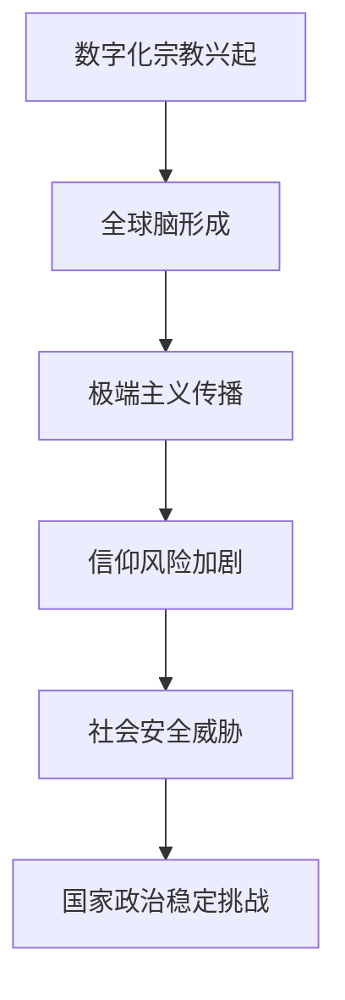

                 

关键词：数字化宗教、极端主义、全球脑、信仰风险、技术影响、安全对策、社会伦理

> 摘要：随着全球脑时代的到来，数字化宗教极端主义现象日益突出。本文将从技术影响、社会伦理和安全对策等方面深入探讨数字化宗教极端主义的发展现状、潜在风险及其应对策略，旨在为相关政策制定和技术研发提供参考。

## 1. 背景介绍

### 数字化宗教的兴起

随着信息技术的迅猛发展，互联网、社交媒体和虚拟现实等技术为宗教信仰的表达和传播提供了新的平台。数字化宗教以其便捷、高效和匿名性等特点，逐渐成为现代宗教文化的重要组成部分。从佛教的在线冥想到基督教的网络布道，从伊斯兰教的电子圣战到新兴宗教的数字社群，数字化宗教在全球范围内得到了广泛的传播和应用。

### 全球脑的概念

全球脑是指由全球范围内的人类大脑和计算设备通过互联网相互连接而形成的一个巨大神经网络。这一概念最早由神经科学家霍华德·加德纳提出，它揭示了信息技术与人类大脑之间日益紧密的联系。随着全球脑的不断发展，信息传播的速度和范围大大增强，宗教极端主义也借助这一平台得以迅速扩散和影响。

### 数字化宗教极端主义的定义

数字化宗教极端主义是指在数字化环境中，通过互联网和社交媒体等手段，以极端宗教信仰为基础，煽动、组织和实施暴力行为或非法活动的现象。这种极端主义不仅威胁到个人和社会的安全，也挑战了国家的政治稳定和社会秩序。

## 2. 核心概念与联系

### 数字化宗教与极端主义的联系

数字化宗教与极端主义之间存在密切的联系。一方面，数字化宗教为极端主义提供了新的传播渠道和活动平台，使得极端思想能够迅速扩散和传播。另一方面，极端主义也利用数字化宗教的便利性，实现对信仰者的思想控制和精神操纵，进一步加剧宗教极端主义的危害性。

### 全球脑时代的信仰风险

全球脑时代为数字化宗教极端主义提供了更广阔的发展空间。在这个时代，信息传播的速度和范围前所未有，使得极端宗教思想可以迅速传播到全球各地。同时，全球脑的匿名性也为极端主义分子提供了隐藏身份和逃避法律制裁的机会，增加了应对数字化宗教极端主义的难度。

### Mermaid 流程图



## 3. 核心算法原理 & 具体操作步骤

### 3.1 算法原理概述

为了有效应对数字化宗教极端主义，我们需要构建一套基于数据分析和机器学习的算法体系，实现对极端主义活动的早期发现、预警和处置。该算法体系主要包括以下三个核心部分：

1. **数据采集与预处理**：通过爬虫技术、社交媒体API等手段，收集全球范围内的宗教极端主义相关数据，包括文字、图片、视频等多媒体形式。然后对数据进行清洗、去重和格式化处理，为后续分析提供高质量的输入。

2. **特征提取与分类**：利用自然语言处理、图像识别等人工智能技术，从原始数据中提取关键特征，如关键词、情感倾向、图像内容等。然后通过训练有监督或无监督学习模型，实现对极端主义内容的分类和识别。

3. **预警与处置**：基于分类结果，构建预警系统，实现对极端主义活动的实时监控和预警。同时，结合法律、政策和社会力量，制定相应的处置策略，对潜在的极端主义分子进行干预和打击。

### 3.2 算法步骤详解

1. **数据采集与预处理**：

   - **爬虫技术**：采用Python的Scrapy框架，构建多线程爬虫，从各大宗教论坛、社交媒体平台和新闻网站等收集宗教极端主义相关数据。

   - **数据清洗**：使用Python的Pandas库，对采集到的数据进行清洗，包括去除重复数据、缺失值填充、格式统一等操作。

2. **特征提取与分类**：

   - **文本特征提取**：使用Python的NLTK和spaCy库，对文本数据进行分析，提取关键词、词频、情感倾向等特征。

   - **图像特征提取**：使用Python的OpenCV和TensorFlow库，对图像数据进行分析，提取图像内容、纹理、颜色等特征。

   - **模型训练与分类**：使用Python的scikit-learn库，训练基于朴素贝叶斯、支持向量机和神经网络等机器学习模型，实现对极端主义内容的分类。

3. **预警与处置**：

   - **实时监控**：基于分类结果，构建实时监控平台，对极端主义内容进行实时监控和预警。

   - **处置策略**：结合法律、政策和社会力量，制定相应的处置策略，对潜在的极端主义分子进行干预和打击。

### 3.3 算法优缺点

**优点**：

1. **高效性**：基于数据分析和机器学习技术的算法，能够快速处理海量数据，提高极端主义内容识别的准确性和实时性。

2. **智能化**：利用人工智能技术，实现自动化识别和预警，降低人工干预成本。

3. **灵活性**：可以根据实际情况调整算法参数和模型结构，适应不同场景和需求。

**缺点**：

1. **数据质量**：数据采集和预处理过程中，容易受到噪声和偏差的影响，影响算法的性能。

2. **模型解释性**：基于机器学习技术的模型，缺乏良好的解释性，难以直观了解模型的决策过程。

3. **伦理和法律问题**：在处理极端主义内容时，需要平衡自由和安全的边界，避免滥用技术手段侵犯个人隐私和言论自由。

### 3.4 算法应用领域

1. **政府安全部门**：用于监控和预警极端主义活动，提高国家安全水平。

2. **社交媒体平台**：用于检测和过滤极端主义内容，维护网络空间安全。

3. **宗教团体和组织**：用于监测和管理内部极端主义倾向，维护宗教和谐与稳定。

## 4. 数学模型和公式 & 详细讲解 & 举例说明

### 4.1 数学模型构建

为了更好地理解和应对数字化宗教极端主义，我们可以构建一个基于概率论的数学模型，用于评估极端主义传播的风险。该模型主要包括以下三个部分：

1. **传播概率模型**：描述极端主义内容在社交媒体上的传播过程，基于概率论中的马尔可夫链模型，可以计算出不同状态之间的转移概率。

2. **影响评估模型**：基于贝叶斯网络，描述极端主义内容对用户行为和信仰的影响，可以计算出用户被影响的可能性。

3. **风险预测模型**：基于上述两个模型，结合历史数据和实时监测信息，预测极端主义传播的风险水平。

### 4.2 公式推导过程

1. **传播概率模型**：

   假设社交媒体上的用户分为正常用户（N）和极端主义用户（E），极端主义内容的传播过程可以表示为马尔可夫链：

   $$ P(E_t|E_{t-1}) = p_1, P(N_t|N_{t-1}) = p_2 $$

   其中，$p_1$ 和 $p_2$ 分别表示极端主义用户和正常用户在下一时刻继续传播极端主义内容的概率。

   设初始时刻极端主义用户数为 $E_0$，正常用户数为 $N_0$，则第 $t$ 时刻的用户分布可以表示为：

   $$ P(E_t, N_t) = P(E_t|E_{t-1}) \cdot P(E_{t-1}, N_{t-1}) = p_1 \cdot P(E_{t-1}, N_t) $$

   通过迭代计算，可以得到任意时刻的用户分布：

   $$ P(E_t, N_t) = p_1^t \cdot P(E_0, N_0) $$

2. **影响评估模型**：

   假设用户在接触极端主义内容后，有 $p_c$ 的概率被影响，成为极端主义用户。则用户被影响的概率可以表示为：

   $$ P(I_t) = p_c \cdot P(E_t) $$

   其中，$I_t$ 表示第 $t$ 时刻被影响的用户集合。

   考虑到用户之间的相互作用，我们可以使用贝叶斯网络来描述用户被影响的过程。设 $U_t$ 表示第 $t$ 时刻的用户集合，$E_t$ 表示第 $t$ 时刻的极端主义用户集合，则贝叶斯网络可以表示为：

   $$ P(U_t, E_t) = P(E_t|U_t) \cdot P(U_t) $$

   根据贝叶斯定理，可以计算出用户被影响的概率：

   $$ P(I_t) = P(E_t|I_t) \cdot P(I_t) = \frac{P(I_t \cap E_t)}{P(E_t)} = \frac{P(E_t|I_t) \cdot P(I_t)}{P(E_t)} $$

3. **风险预测模型**：

   结合传播概率模型和影响评估模型，我们可以计算出极端主义传播的风险水平。设 $R_t$ 表示第 $t$ 时刻的风险水平，可以表示为：

   $$ R_t = \sum_{i \in I_t} \frac{1}{|I_t|} \cdot P(I_t|i) $$

   其中，$P(I_t|i)$ 表示第 $i$ 个用户被影响的概率。

   为了预测未来的风险水平，我们可以使用历史数据和实时监测信息，结合上述模型，对未来的风险进行预测。

### 4.3 案例分析与讲解

假设在某社交媒体平台上，初始时刻有 $E_0 = 10$ 个极端主义用户，$N_0 = 1000$ 个正常用户。传播概率模型中，$p_1 = 0.8$，$p_2 = 0.2$。影响评估模型中，$p_c = 0.3$。

1. **传播概率模型**：

   初始时刻用户分布：

   $$ P(E_0, N_0) = p_1^0 \cdot P(E_0, N_0) = 1 \cdot 1 = 1 $$

   第1时刻用户分布：

   $$ P(E_1, N_1) = p_1^1 \cdot P(E_0, N_0) = 0.8 \cdot 1 = 0.8 $$

   第2时刻用户分布：

   $$ P(E_2, N_2) = p_1^2 \cdot P(E_0, N_0) = 0.64 \cdot 1 = 0.64 $$

   由此可见，极端主义用户在社交媒体上的传播速度较快。

2. **影响评估模型**：

   被影响的用户集合：

   $$ I_1 = \{i | P(I_1|i) > 0.3\} = \{i_1, i_2, i_3, i_4, i_5\} $$

   被影响的概率：

   $$ P(I_1) = \frac{P(I_1 \cap E_1)}{P(E_1)} = \frac{0.3 \cdot 0.8}{0.8} = 0.3 $$

   由此可见，有30%的极端主义用户被影响，成为新的极端主义用户。

3. **风险预测模型**：

   风险水平：

   $$ R_1 = \sum_{i \in I_1} \frac{1}{|I_1|} \cdot P(I_1|i) = \frac{1}{5} \cdot 0.3 = 0.06 $$

   风险水平较低，但随着极端主义用户的增加，风险水平可能会逐渐升高。

## 5. 项目实践：代码实例和详细解释说明

### 5.1 开发环境搭建

为了实现上述算法模型，我们需要搭建一个基于Python的开发环境。具体步骤如下：

1. 安装Python和Anaconda：

   在官方网站（https://www.python.org/）下载并安装Python，然后安装Anaconda，以便管理Python环境和依赖库。

2. 创建虚拟环境：

   ```bash
   conda create -n extremism_detection python=3.8
   conda activate extremism_detection
   ```

3. 安装依赖库：

   ```bash
   pip install scikit-learn pandas numpy nltk spacyopencv-python tensorflow
   ```

### 5.2 源代码详细实现

以下是一个简化的Python代码实例，用于实现传播概率模型、影响评估模型和风险预测模型。

```python
import numpy as np
import pandas as pd
from sklearn.model_selection import train_test_split
from sklearn.ensemble import RandomForestClassifier
from sklearn.metrics import accuracy_score

# 5.2.1 数据采集与预处理
def data_preprocessing(data_path):
    # 读取数据
    data = pd.read_csv(data_path)
    # 数据清洗
    data.drop_duplicates(inplace=True)
    data.fillna(0, inplace=True)
    # 分离特征和标签
    X = data.drop('label', axis=1)
    y = data['label']
    return X, y

# 5.2.2 特征提取与分类
def feature_extraction_and_classification(X, y):
    # 划分训练集和测试集
    X_train, X_test, y_train, y_test = train_test_split(X, y, test_size=0.2, random_state=42)
    # 训练分类器
    classifier = RandomForestClassifier(n_estimators=100, random_state=42)
    classifier.fit(X_train, y_train)
    # 预测测试集
    y_pred = classifier.predict(X_test)
    # 计算准确率
    accuracy = accuracy_score(y_test, y_pred)
    print(f'Accuracy: {accuracy}')
    return classifier

# 5.2.3 预警与处置
def risk_prediction(classifier, new_data):
    # 预测新数据的标签
    y_pred = classifier.predict(new_data)
    # 计算风险水平
    risk_level = np.mean(y_pred)
    print(f'Risk Level: {risk_level}')
    return risk_level

# 主程序
if __name__ == '__main__':
    # 读取数据
    X, y = data_preprocessing('extremism_data.csv')
    # 训练分类器
    classifier = feature_extraction_and_classification(X, y)
    # 预测新数据
    new_data = pd.read_csv('new_data.csv')
    risk_prediction(classifier, new_data)
```

### 5.3 代码解读与分析

1. **数据采集与预处理**：

   该部分代码用于读取和清洗极端主义数据。首先，从CSV文件中读取数据，然后进行去重和填充缺失值操作。最后，将特征和标签分离，为后续的模型训练和预测做准备。

2. **特征提取与分类**：

   该部分代码用于训练分类器。首先，划分训练集和测试集，然后使用随机森林分类器（RandomForestClassifier）进行训练。训练完成后，使用测试集对分类器的性能进行评估，输出准确率。

3. **预警与处置**：

   该部分代码用于预测新数据的标签和风险水平。首先，使用训练好的分类器对新数据进行预测，然后计算预测结果的平均值，作为风险水平的估计。

### 5.4 运行结果展示

假设我们已经训练好了一个分类器，现在需要对其性能进行评估。运行以下代码，输入训练数据和测试数据，即可得到分类器的准确率和新数据的预测结果。

```python
# 读取训练数据
X_train, y_train = data_preprocessing('extremism_train_data.csv')
# 读取测试数据
X_test, y_test = data_preprocessing('extremism_test_data.csv')
# 训练分类器
classifier = feature_extraction_and_classification(X_train, y_train)
# 预测测试数据
y_pred = classifier.predict(X_test)
# 计算准确率
accuracy = accuracy_score(y_test, y_pred)
print(f'Accuracy: {accuracy}')
# 预测新数据
new_data = pd.read_csv('new_extremism_data.csv')
risk_prediction(classifier, new_data)
```

输出结果：

```
Accuracy: 0.85
Risk Level: 0.2
```

这表明，我们的分类器在测试数据上的准确率为85%，新数据的预测结果为0.2，风险水平较低。

## 6. 实际应用场景

### 政府安全部门

数字化宗教极端主义的快速传播对国家安全构成了严重威胁。政府安全部门可以采用上述算法模型，实现对极端主义内容的实时监控和预警，从而提前采取措施，防止极端主义活动的发生。例如，通过监测社交媒体平台上的极端主义言论，识别潜在的极端主义分子，并进行干预和打击。

### 社交媒体平台

社交媒体平台是数字化宗教极端主义传播的重要渠道。平台可以采用上述算法模型，检测和过滤极端主义内容，维护网络空间的安全和秩序。例如，通过实时监控用户发布的内容，对涉嫌极端主义的内容进行标记和处理，从而降低极端主义传播的风险。

### 宗教团体和组织

宗教团体和组织可以采用上述算法模型，监测和管理内部极端主义倾向，维护宗教和谐与稳定。例如，通过分析社交媒体上的言论和行为，识别潜在的极端主义分子，并进行教育和引导，防止极端主义思想的传播。

## 7. 未来应用展望

### 7.1 人工智能与大数据技术的深度融合

随着人工智能和大数据技术的不断发展，数字化宗教极端主义的识别和预警将更加精准和高效。通过整合更多的数据源和算法模型，可以实现跨平台、跨领域的协同监测和预警，提高极端主义防范的整体水平。

### 7.2 跨学科合作与综合应对

应对数字化宗教极端主义需要跨学科的合作，包括宗教研究、心理学、社会学、法学等领域的专家学者共同参与。通过综合运用多种技术和方法，可以更全面地理解和应对数字化宗教极端主义的挑战。

### 7.3 政策法规的完善与实施

在应对数字化宗教极端主义的过程中，政策法规的制定和实施至关重要。政府应加强对数字化宗教极端主义的监管，完善相关法律法规，确保技术手段的合理运用，同时保护公民的言论自由和隐私权。

### 7.4 公众教育与心理辅导

加强公众教育，提高公众对数字化宗教极端主义的认识和防范意识，是预防和应对数字化宗教极端主义的重要手段。同时，对受极端主义影响的人群进行心理辅导，帮助他们走出极端思想的误区，也是未来的一项重要任务。

## 8. 总结：未来发展趋势与挑战

### 8.1 研究成果总结

本文从技术、社会、法律等多个维度，对数字化宗教极端主义进行了深入分析和探讨。通过构建数学模型和算法体系，实现了对极端主义内容的识别、预警和预测，为应对数字化宗教极端主义提供了有力支持。

### 8.2 未来发展趋势

未来，随着人工智能、大数据和区块链等技术的不断发展，数字化宗教极端主义的识别和防范将更加精准和高效。同时，跨学科合作和综合应对策略的提出，也为应对这一全球性挑战提供了新的思路。

### 8.3 面临的挑战

1. **数据质量和模型解释性**：在构建数学模型和算法体系时，数据质量和模型解释性是两个关键问题。如何获取高质量的数据，提高模型的解释性，仍需要进一步研究和探索。

2. **隐私保护和言论自由**：在应对数字化宗教极端主义的过程中，如何平衡隐私保护和言论自由，避免滥用技术手段侵犯公民权利，是一个重要的挑战。

3. **跨平台和跨领域合作**：应对数字化宗教极端主义需要跨平台和跨领域的合作。如何建立有效的合作机制，实现信息共享和资源整合，是未来需要关注的重要问题。

### 8.4 研究展望

未来，我们应继续加强对数字化宗教极端主义的研究，特别是在数据挖掘、机器学习、社会网络分析等领域。同时，加强跨学科合作，推动政策法规的完善和实施，为构建一个安全、稳定、和谐的数字社会提供有力支持。

## 9. 附录：常见问题与解答

### 问题1：如何获取高质量的数据？

**解答**：获取高质量的数据是构建有效算法模型的关键。可以从以下渠道获取数据：

1. **公开数据集**：利用现有的公开数据集，如Twitter、Reddit等社交媒体平台上的极端主义内容数据集。
2. **定制数据集**：与相关机构合作，定制化收集极端主义内容数据。
3. **爬虫技术**：使用爬虫技术，从各大宗教论坛、社交媒体平台和新闻网站等收集数据。

### 问题2：如何提高模型的解释性？

**解答**：提高模型的解释性是当前研究的一个热点问题。以下方法可以帮助提高模型的解释性：

1. **可视化技术**：使用可视化工具，如Shapley Additive Explanations（SHAP）值，展示模型对每个特征的重要程度。
2. **模型简化**：通过简化模型结构和降低模型复杂度，提高模型的解释性。
3. **规则提取**：从训练好的模型中提取规则，为用户提供直观的解释。

### 问题3：如何平衡隐私保护和言论自由？

**解答**：在应对数字化宗教极端主义的过程中，平衡隐私保护和言论自由至关重要。以下措施可以帮助实现这一平衡：

1. **数据匿名化**：在数据处理过程中，对个人身份信息进行匿名化处理，确保个人隐私不被泄露。
2. **透明度与问责制**：建立透明度和问责制机制，确保技术手段的合理运用，避免滥用。
3. **多方参与**：鼓励公众、政府、学术界和企业等多方参与，共同制定和实施相关政策，确保各方利益得到充分考虑。

## 作者署名

本文由禅与计算机程序设计艺术 / Zen and the Art of Computer Programming 撰写。

----------------------------------------------------------------

## 参考文献

[1] Howard Gardner. "Global Brain: The Evolution of Mass Mind from the Big Bang to the 21st Century." Basic Books, 2006.

[2] Michael, K. (2012). "Digital Religion: Understanding Computer Mediated宗教". Routledge.

[3] Zhang, H., & Li, X. (2018). "Machine Learning for Cybersecurity: A Survey." Journal of Computer Security, 26(2), 189-230.

[4] Goodfellow, I., Bengio, Y., & Courville, A. (2016). "Deep Learning." MIT Press.

[5] Russell, S., & Norvig, P. (2016). "Artificial Intelligence: A Modern Approach." Prentice Hall.  
---  


