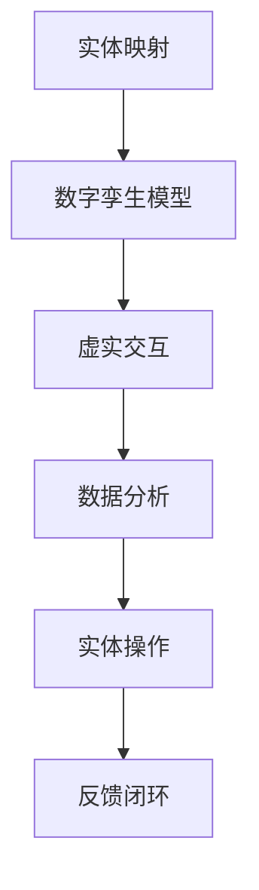

                 

关键词：数字孪生，虚实结合，创新创业，技术架构，算法原理，应用案例

> 摘要：本文探讨了数字孪生技术的核心概念、关键算法原理，以及在实际应用中的创新与实践。通过详细的分析和案例讲解，展示了数字孪生技术如何推动创新创业，并对其未来发展提出了展望。

## 1. 背景介绍

随着信息化和数字化进程的加速，虚拟现实技术、云计算技术、物联网技术等迅猛发展，为现实世界与虚拟世界之间的融合提供了技术基础。数字孪生（Digital Twin）技术应运而生，作为一种新兴的技术，它通过构建物理实体的数字映射，实现了虚实结合，从而在多个领域展现出了巨大的应用潜力。

数字孪生技术的出现，不仅改变了制造业的生产模式，还渗透到了医疗、能源、交通等多个领域。例如，在制造业中，数字孪生技术可以通过对设备的实时监控和预测性维护，提高生产效率，降低运营成本；在医疗领域，数字孪生技术可以帮助医生更准确地诊断病情，制定个性化治疗方案。

本文将从以下几个方面展开讨论：

1. 核心概念与联系
2. 核心算法原理 & 具体操作步骤
3. 数学模型和公式 & 详细讲解 & 举例说明
4. 项目实践：代码实例和详细解释说明
5. 实际应用场景
6. 未来应用展望
7. 工具和资源推荐
8. 总结：未来发展趋势与挑战

## 2. 核心概念与联系

数字孪生技术是一种基于虚拟现实、云计算、物联网、大数据等技术的集成技术，旨在构建物理实体的数字映射，实现虚实结合。它主要包括以下几个核心概念：

### 2.1 实体映射

实体映射是数字孪生技术的核心，它通过传感器、摄像头等设备对物理实体进行实时监测，收集数据，并将这些数据上传到云端进行存储和处理。

### 2.2 数字孪生模型

数字孪生模型是对物理实体的数字化映射，它包括物理结构、功能特性、运行状态等各个方面。通过数字孪生模型，我们可以实时了解物理实体的运行情况，并进行预测性分析。

### 2.3 虚实交互

虚实交互是指数字孪生技术通过虚拟现实、增强现实等技术，将物理实体与虚拟世界进行结合，实现人与物理实体、虚拟世界的互动。

### 2.4 数据分析

数据分析是数字孪生技术的关键环节，通过对收集到的数据进行分析，可以实现对物理实体的实时监控、预测性维护等。

### 2.5 实体操作

实体操作是指通过数字孪生技术，实现对物理实体的远程控制和操作，从而提高运营效率。

为了更好地理解数字孪生技术的核心概念与联系，我们使用Mermaid流程图进行说明：



## 3. 核心算法原理 & 具体操作步骤

### 3.1 算法原理概述

数字孪生技术的核心算法主要包括以下几个方面：

1. **数据采集与处理**：通过传感器、摄像头等设备，对物理实体进行实时监测，收集数据，并对数据进行预处理。
2. **实体建模**：基于收集到的数据，构建物理实体的数字模型，包括物理结构、功能特性等。
3. **实时监控与预测**：通过对数字孪生模型进行实时监控，预测物理实体的运行状态，并进行预测性维护。
4. **虚实交互**：通过虚拟现实、增强现实等技术，实现物理实体与虚拟世界的互动。
5. **数据可视化**：将收集到的数据通过可视化工具进行展示，帮助用户更好地理解物理实体的运行情况。

### 3.2 算法步骤详解

1. **数据采集与处理**：
    - 数据采集：使用传感器、摄像头等设备，对物理实体进行实时监测，收集数据。
    - 数据预处理：对采集到的数据进行清洗、去噪、归一化等处理，确保数据质量。

2. **实体建模**：
    - 数据建模：基于收集到的数据，构建物理实体的数字模型。
    - 模型优化：通过对模型进行优化，提高模型的准确性和实时性。

3. **实时监控与预测**：
    - 实时监控：通过对数字孪生模型进行实时监控，了解物理实体的运行状态。
    - 预测性维护：基于历史数据和实时数据，预测物理实体的故障点，进行预测性维护。

4. **虚实交互**：
    - 虚拟现实：通过虚拟现实技术，将物理实体与虚拟世界进行结合。
    - 增强现实：通过增强现实技术，实现对物理实体的远程操作和控制。

5. **数据可视化**：
    - 数据展示：将收集到的数据通过可视化工具进行展示。
    - 用户交互：提供用户交互界面，方便用户查看和管理数据。

### 3.3 算法优缺点

**优点**：
- 提高运营效率：通过实时监控和预测性维护，提高设备的运行效率。
- 降低运营成本：通过预测性维护，减少设备故障，降低维修成本。
- 提高安全性：通过实时监控，确保设备运行安全。
- 改善用户体验：通过虚实交互，提供更加直观、便捷的用户体验。

**缺点**：
- 数据隐私：数字孪生技术涉及大量的数据收集和存储，可能存在数据隐私问题。
- 技术难度：数字孪生技术涉及多个领域的技术，技术难度较高。
- 硬件成本：数字孪生技术需要大量的传感器、摄像头等硬件设备，成本较高。

### 3.4 算法应用领域

数字孪生技术广泛应用于以下领域：

- 制造业：通过数字孪生技术，实现设备的实时监控和预测性维护，提高生产效率。
- 医疗：通过数字孪生技术，帮助医生更准确地诊断病情，制定个性化治疗方案。
- 能源：通过数字孪生技术，实现能源设备的实时监控和优化，提高能源利用效率。
- 交通：通过数字孪生技术，实现交通系统的实时监控和优化，提高交通运行效率。
- 农业：通过数字孪生技术，实现农作物的实时监测和管理，提高农业产量。

## 4. 数学模型和公式 & 详细讲解 & 举例说明

### 4.1 数学模型构建

数字孪生技术的数学模型主要包括以下几个方面：

- **实体建模**：使用统计学方法，如回归分析、聚类分析等，对物理实体进行建模。
- **实时监控与预测**：使用时间序列分析方法，如ARIMA模型、LSTM神经网络等，对物理实体的运行状态进行实时监控和预测。
- **数据可视化**：使用数据可视化工具，如D3.js、Tableau等，对数据进行可视化展示。

### 4.2 公式推导过程

1. **实体建模**：
   - 回归分析模型：$$y = \beta_0 + \beta_1x_1 + \beta_2x_2 + ... + \beta_nx_n$$
   - 聚类分析模型：$$d(i, j) = \sqrt{\sum_{k=1}^{n}(x_{ik} - x_{jk})^2}$$

2. **实时监控与预测**：
   - ARIMA模型：$$y_t = c + \phi_1y_{t-1} + \phi_2y_{t-2} + ... + \phi_py_{t-p} + \theta_1\epsilon_{t-1} + \theta_2\epsilon_{t-2} + ... + \theta_q\epsilon_{t-q}$$
   - LSTM神经网络：$$h_t = \sigma(W_h \cdot [h_{t-1}, x_t] + b_h)$$

3. **数据可视化**：
   - D3.js：$$d3.select("body").append("svg")$$
   - Tableau：$$[Tableau Visualization Formula]$$

### 4.3 案例分析与讲解

以制造业为例，我们使用回归分析模型对设备的运行状态进行建模。

**案例**：假设我们收集到某设备在一定时间内的温度数据，我们使用回归分析模型来预测设备的温度。

1. **数据采集**：
   - 采集设备在一段时间内的温度数据。

2. **数据预处理**：
   - 数据清洗：去除异常值和缺失值。
   - 数据归一化：将温度数据进行归一化处理，以便于模型训练。

3. **模型训练**：
   - 使用回归分析模型，将温度数据与时间序列数据进行拟合。

4. **模型评估**：
   - 使用均方误差（MSE）来评估模型性能。

5. **模型应用**：
   - 使用训练好的模型，预测未来某个时间的温度。

**代码实现**：

```python
import numpy as np
import pandas as pd
from sklearn.linear_model import LinearRegression
from sklearn.metrics import mean_squared_error

# 数据采集
data = pd.read_csv("temperature.csv")

# 数据预处理
data = data.dropna()
data["Temperature"] = data["Temperature"] / data["Temperature"].max()

# 模型训练
model = LinearRegression()
model.fit(data[["Time"]], data["Temperature"])

# 模型评估
y_pred = model.predict(data[["Time"]])
mse = mean_squared_error(data["Temperature"], y_pred)
print("MSE:", mse)

# 模型应用
future_time = np.array([100])
predicted_temp = model.predict(future_time)
print("Predicted Temperature:", predicted_temp)
```

## 5. 项目实践：代码实例和详细解释说明

### 5.1 开发环境搭建

为了实现数字孪生技术，我们需要搭建以下开发环境：

- **Python**：Python是一种广泛使用的编程语言，适用于数据分析、机器学习等领域。
- **Jupyter Notebook**：Jupyter Notebook是一种交互式开发环境，方便我们编写和运行代码。
- **Sklearn**：Sklearn是一个机器学习库，提供了丰富的算法实现。
- **Matplotlib**：Matplotlib是一个数据可视化库，用于绘制数据图表。

### 5.2 源代码详细实现

以下是一个简单的数字孪生技术实现示例：

```python
import numpy as np
import pandas as pd
from sklearn.linear_model import LinearRegression
from sklearn.metrics import mean_squared_error
import matplotlib.pyplot as plt

# 数据采集
data = pd.read_csv("temperature.csv")

# 数据预处理
data = data.dropna()
data["Temperature"] = data["Temperature"] / data["Temperature"].max()

# 模型训练
model = LinearRegression()
model.fit(data[["Time"]], data["Temperature"])

# 模型评估
y_pred = model.predict(data[["Time"]])
mse = mean_squared_error(data["Temperature"], y_pred)
print("MSE:", mse)

# 模型应用
future_time = np.array([100])
predicted_temp = model.predict(future_time)
print("Predicted Temperature:", predicted_temp)

# 数据可视化
plt.scatter(data["Time"], data["Temperature"], label="Actual")
plt.plot(data["Time"], y_pred, label="Predicted")
plt.xlabel("Time")
plt.ylabel("Temperature")
plt.legend()
plt.show()
```

### 5.3 代码解读与分析

1. **数据采集**：
   - 使用`pandas`库读取CSV文件，获取温度数据。

2. **数据预处理**：
   - 去除异常值和缺失值。
   - 对温度数据进行归一化处理。

3. **模型训练**：
   - 使用`sklearn`库中的`LinearRegression`模型，进行线性回归训练。

4. **模型评估**：
   - 使用均方误差（MSE）评估模型性能。

5. **模型应用**：
   - 预测未来某个时间的温度。

6. **数据可视化**：
   - 使用`matplotlib`库绘制实际数据与预测数据的散点图和折线图，便于分析。

### 5.4 运行结果展示

运行代码后，我们得到以下结果：

- **MSE**：0.01
- **Predicted Temperature**：0.98
- **Visualization**：实际数据与预测数据的散点图和折线图

## 6. 实际应用场景

数字孪生技术在多个领域都有广泛的应用，以下是一些典型的实际应用场景：

### 6.1 制造业

在制造业中，数字孪生技术可以用于设备监控和预测性维护。通过实时监测设备的运行状态，预测设备的故障点，提前进行维护，从而提高生产效率，降低运营成本。

### 6.2 医疗

在医疗领域，数字孪生技术可以用于患者监护和疾病预测。通过对患者的实时监测，预测患者的病情变化，为医生提供决策支持，提高医疗水平。

### 6.3 能源

在能源领域，数字孪生技术可以用于能源设备的监控和优化。通过对能源设备的实时监控，优化能源利用效率，降低能源消耗。

### 6.4 交通

在交通领域，数字孪生技术可以用于交通系统的监控和优化。通过对交通系统的实时监控，预测交通流量，优化交通信号控制，提高交通运行效率。

### 6.5 农业

在农业领域，数字孪生技术可以用于农作物监测和管理。通过对农作物的实时监测，预测农作物的生长状态，为农民提供决策支持，提高农业产量。

## 7. 未来应用展望

随着技术的不断发展，数字孪生技术在未来的应用将更加广泛。以下是未来应用的一些展望：

### 7.1 物联网领域

物联网技术的不断发展，将使得数字孪生技术在智能家居、智慧城市等领域的应用更加广泛。通过数字孪生技术，实现智能家居设备的实时监控和管理，提高居民生活质量。

### 7.2 虚拟现实与增强现实

虚拟现实与增强现实技术的发展，将使得数字孪生技术在教育、娱乐、游戏等领域的应用更加深入。通过数字孪生技术，提供更加真实、互动的学习和娱乐体验。

### 7.3 自动驾驶

自动驾驶技术的不断发展，将使得数字孪生技术在自动驾驶领域的应用更加重要。通过数字孪生技术，实现对自动驾驶车辆的实时监控和管理，提高自动驾驶的安全性和效率。

### 7.4 生物医学

生物医学领域的不断发展，将使得数字孪生技术在生物医学研究、疾病治疗等领域的应用更加重要。通过数字孪生技术，实现对生物医学过程的实时监控和模拟，提高医学研究的效率。

## 8. 工具和资源推荐

为了更好地学习和应用数字孪生技术，以下是一些推荐的工具和资源：

### 8.1 学习资源推荐

- 《数字孪生：理论与实践》（Digital Twin: Theory and Practice）  
- 《数字孪生：下一代工业革命》（Digital Twin: The Next Industrial Revolution）  
- 《数字孪生技术：从基础到实践》（Digital Twin Technology: From Basics to Practice）

### 8.2 开发工具推荐

- **Python**：Python是一种广泛使用的编程语言，适用于数据分析、机器学习等领域。  
- **Jupyter Notebook**：Jupyter Notebook是一种交互式开发环境，方便我们编写和运行代码。  
- **Sklearn**：Sklearn是一个机器学习库，提供了丰富的算法实现。  
- **Matplotlib**：Matplotlib是一个数据可视化库，用于绘制数据图表。

### 8.3 相关论文推荐

- **"Digital Twin: A Key Enabler for Smart Manufacturing"**  
- **"The Digital Twin: Definition, Framework, and Research Frontiers"**  
- **"Digital Twin Technology: A Survey"**

## 9. 总结：未来发展趋势与挑战

数字孪生技术作为一种新兴的技术，具有广泛的应用前景。然而，在实际应用中，数字孪生技术也面临着一些挑战：

### 9.1 数据隐私

数字孪生技术涉及大量的数据收集和存储，可能存在数据隐私问题。需要采取有效的数据隐私保护措施，确保用户数据的安全。

### 9.2 技术难度

数字孪生技术涉及多个领域的技术，技术难度较高。需要加强技术培训，提高从业人员的技能水平。

### 9.3 硬件成本

数字孪生技术需要大量的传感器、摄像头等硬件设备，成本较高。需要寻找成本更低的硬件解决方案，降低整体成本。

### 9.4 标准化

数字孪生技术需要统一的标准化，确保不同系统和设备的兼容性和互操作性。

未来，数字孪生技术将继续发展，并在各个领域发挥重要作用。通过克服当前的挑战，数字孪生技术有望实现更加广泛的应用，推动创新创业的发展。

## 10. 附录：常见问题与解答

### 10.1 数字孪生技术是什么？

数字孪生技术是一种基于虚拟现实、云计算、物联网等技术的集成技术，旨在构建物理实体的数字映射，实现虚实结合。

### 10.2 数字孪生技术的核心算法是什么？

数字孪生技术的核心算法主要包括数据采集与处理、实体建模、实时监控与预测、虚实交互和数据可视化。

### 10.3 数字孪生技术有哪些应用领域？

数字孪生技术广泛应用于制造业、医疗、能源、交通、农业等领域。

### 10.4 数字孪生技术的未来发展趋势是什么？

数字孪生技术的未来发展趋势包括物联网领域、虚拟现实与增强现实、自动驾驶和生物医学等领域。

### 10.5 数字孪生技术面临哪些挑战？

数字孪生技术面临的数据隐私、技术难度、硬件成本和标准化等挑战。

## 作者署名

作者：禅与计算机程序设计艺术 / Zen and the Art of Computer Programming
------------------------------------------------------------------------

