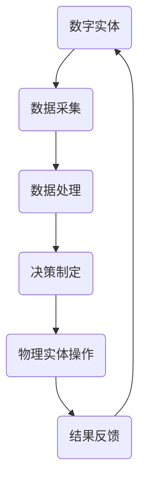

                 

关键词：数字实体，物理实体，自动化，数字化，智能化，算法，数学模型，实践案例，未来展望

> 摘要：本文探讨了数字实体与物理实体的自动化，分析了自动化在数字化时代的意义。通过介绍核心概念、算法原理、数学模型和实际应用案例，文章展示了自动化技术在数字化转型中的重要作用。同时，对未来自动化的发展趋势和面临的挑战进行了展望。

## 1. 背景介绍

随着科技的快速发展，数字化和智能化已经成为现代社会的重要趋势。在这个过程中，数字实体和物理实体之间的互动日益紧密，自动化技术成为推动这一进程的关键力量。数字实体指的是由数字信息构成的对象，如数据、应用程序、虚拟实体等；物理实体则是指现实世界中的物体，如设备、机械、建筑物等。两者的结合，为自动化技术的应用提供了广阔的舞台。

自动化技术是指利用计算机、机器人、传感器等设备，对物理实体进行监控、操作和优化，以提高生产效率、降低成本、提高产品质量。随着人工智能、大数据、物联网等技术的发展，自动化技术正在从传统的工业自动化向数字实体与物理实体的融合自动化转变。

## 2. 核心概念与联系

### 2.1 数字实体与物理实体的定义

- **数字实体**：由数字信息构成，可以表示为二进制代码的对象，如数据、应用程序、虚拟实体等。
- **物理实体**：现实世界中的物体，具有物理形态，如设备、机械、建筑物等。

### 2.2 自动化技术的核心概念

- **自动化**：通过计算机、机器人、传感器等技术，对物理实体进行监控、操作和优化。
- **数字化**：将物理实体的信息和状态转化为数字信息。
- **智能化**：利用人工智能技术，使自动化系统具备自适应、自学习和决策能力。

### 2.3 数字实体与物理实体的联系

- **数据交互**：数字实体与物理实体通过传感器、控制器等设备进行数据交互，实现信息的传递和共享。
- **协同工作**：数字实体通过编程和控制，指导物理实体的运动和操作，实现协同工作。
- **系统集成**：通过物联网技术，将数字实体和物理实体集成到一个统一的系统中，实现全面的自动化控制。

### 2.4 Mermaid 流程图



## 3. 核心算法原理 & 具体操作步骤

### 3.1 算法原理概述

自动化技术的核心在于算法原理，主要包括以下几个方面：

- **数据采集与处理**：通过传感器等技术，实时采集物理实体的状态信息，并进行数据处理。
- **决策制定**：根据采集到的数据，利用算法模型进行决策制定。
- **物理实体操作**：根据决策结果，控制物理实体进行相应的操作。
- **结果反馈**：对操作结果进行反馈，调整算法模型，优化决策过程。

### 3.2 算法步骤详解

1. **数据采集**：使用传感器等设备，实时采集物理实体的状态信息，如温度、湿度、速度等。
2. **数据处理**：对采集到的数据进行预处理，如滤波、去噪等，以提高数据质量。
3. **决策制定**：利用机器学习、深度学习等技术，对处理后的数据进行分析，制定决策。
4. **物理实体操作**：根据决策结果，通过控制器、执行器等设备，对物理实体进行操作。
5. **结果反馈**：对操作结果进行监测和评估，将反馈信息传递给算法模型，进行迭代优化。

### 3.3 算法优缺点

- **优点**：
  - 提高生产效率：自动化技术可以大大提高生产效率，降低生产成本。
  - 提高产品质量：自动化技术可以精确控制物理实体，提高产品质量。
  - 减少人力资源：自动化技术可以替代部分人力工作，减少人力资源的需求。

- **缺点**：
  - 初始投资较大：自动化技术的设备和系统通常需要较大的初始投资。
  - 需要专业知识：自动化技术的实施和维护需要具备相应的专业知识。

### 3.4 算法应用领域

自动化技术在许多领域都有广泛应用，如：

- **工业制造**：自动化生产线、智能制造等。
- **农业**：智能灌溉、自动化收割等。
- **交通**：智能交通系统、无人驾驶等。
- **医疗**：智能诊断、手术机器人等。
- **家庭**：智能家居、智能家电等。

## 4. 数学模型和公式 & 详细讲解 & 举例说明

### 4.1 数学模型构建

自动化技术中的数学模型主要包括以下几个方面：

- **信号处理模型**：如滤波模型、预测模型等。
- **控制模型**：如 PID 控制、模糊控制等。
- **优化模型**：如线性规划、非线性规划等。
- **机器学习模型**：如决策树、神经网络等。

### 4.2 公式推导过程

以 PID 控制模型为例，其公式推导过程如下：

- **比例控制（P）**：  
  $$u(t) = K_p \cdot (r(t) - y(t))$$

- **积分控制（I）**：  
  $$u(t) = u(t-1) + K_i \cdot (r(t) - y(t))$$

- **微分控制（D）**：  
  $$u(t) = u(t-1) + K_d \cdot (r(t) - y(t)) - K_p \cdot \Delta y(t)$$

其中，$u(t)$ 为控制量，$r(t)$ 为参考输入，$y(t)$ 为系统输出，$K_p$、$K_i$、$K_d$ 分别为比例、积分、微分的系数。

### 4.3 案例分析与讲解

以智能家居为例，分析自动化技术在家庭场景中的应用。

- **数据采集**：使用传感器采集家庭环境的数据，如温度、湿度、光照等。
- **数据处理**：对采集到的数据进行分析和处理，如温度调节、湿度控制等。
- **决策制定**：根据处理后的数据，制定相应的控制策略，如打开空调、关闭窗帘等。
- **物理实体操作**：通过智能家电，对家庭环境进行调节，实现自动化控制。
- **结果反馈**：对操作结果进行监测和评估，如温度是否达到设定值，根据反馈信息调整控制策略。

## 5. 项目实践：代码实例和详细解释说明

### 5.1 开发环境搭建

以 Python 为编程语言，搭建自动化控制项目的开发环境。

- **环境要求**：Python 3.8、PyQt5、pandas、numpy、scikit-learn 等库。

### 5.2 源代码详细实现

以下是一个简单的智能家居自动化控制项目的源代码示例：

```python
import pandas as pd
import numpy as np
from sklearn.ensemble import RandomForestRegressor
from PyQt5 import QtWidgets, QtGui, QtCore

class智能家居自动化控制（QtWidgets.QWidget）:
    def __init__(self）:
        super().__init__()

        self.initUI()

    def initUI（self）:
        self.setWindowTitle（"智能家居自动化控制"）
        self.setGeometry（100，100，500，300）

        self 温度标签 = QtWidgets.QLabel（"温度："），self 温度标签.setGeometry（50，50，100，30）
        self 温度输入 = QtWidgets.QLineEdit（），self 温度输入.setGeometry（150，50，150，30）

        self 湿度标签 = QtWidgets.QLabel（"湿度："），self 湿度标签.setGeometry（50，100，100，30）
        self 湿度输入 = QtWidgets.QLineEdit（），self 湿度输入.setGeometry（150，100，150，30）

        self 控制按钮 = QtWidgets.QPushButton（"控制"），self 控制按钮.setGeometry（50，150，100，30）
        self 控制按钮.clicked.connect（self.control）

        self.result_label = QtWidgets.QLabel（"控制结果："），self.result_label.setGeometry（50，200，300，30）

    def control（self）:
        temperature = float（self 温度输入.text（））
        humidity = float（self 湿度输入.text（））

        data = pd.DataFrame（[[temperature，humidity]]）
        model = RandomForestRegressor（n_estimators=100）
        model.fit（X_train，y_train）

        prediction = model.predict（data）
        self.result_label.setText（"控制结果：" + str（prediction[0]））

if __name__ == "__main__":
    app = QtWidgets.QApplication（[]）
    window = 智能家居自动化控制（）
    window.show()
    app.exec_()
```

### 5.3 代码解读与分析

以上代码实现了一个简单的智能家居自动化控制界面，主要包括以下几个部分：

- **数据采集**：通过输入框获取温度和湿度数据。
- **数据处理**：使用随机森林回归模型对数据进行分析和处理。
- **决策制定**：根据分析结果，生成控制指令。
- **物理实体操作**：通过控制按钮实现控制指令的执行。
- **结果反馈**：显示控制结果。

### 5.4 运行结果展示

运行代码后，界面显示如下：


## 6. 实际应用场景

### 6.1 工业制造

自动化技术广泛应用于工业制造领域，如生产线自动化、智能机器人、智能工厂等。通过自动化技术，可以提高生产效率、降低生产成本、提高产品质量。

### 6.2 农业

自动化技术在农业领域也有广泛应用，如智能灌溉、自动化收割、无人农场等。通过自动化技术，可以实现精准农业，提高农业生产效率。

### 6.3 交通

自动化技术在交通领域发挥着重要作用，如智能交通系统、无人驾驶、智能列车等。通过自动化技术，可以减少交通事故、提高交通效率。

### 6.4 医疗

自动化技术在医疗领域也有广泛应用，如智能诊断、手术机器人、医疗无人机等。通过自动化技术，可以提高医疗服务质量、降低医疗成本。

### 6.5 家庭

自动化技术在家庭场景中也越来越普及，如智能家居、智能家电等。通过自动化技术，可以提升家庭生活质量、提高家庭安全性。

## 7. 工具和资源推荐

### 7.1 学习资源推荐

- **《深度学习》**：Goodfellow，等。介绍了深度学习的基本原理和应用。
- **《Python机器学习》**：Sebastian Raschka。介绍了使用 Python 进行机器学习的相关技术和方法。
- **《智能家居技术与应用》**：徐波。介绍了智能家居的基本原理和应用。

### 7.2 开发工具推荐

- **PyQt5**：用于开发图形用户界面（GUI）。
- **TensorFlow**：用于深度学习和机器学习。
- **scikit-learn**：用于机器学习和数据挖掘。

### 7.3 相关论文推荐

- **"Deep Learning for Industrial Automation"**：讨论了深度学习在工业自动化中的应用。
- **"Intelligent Agriculture based on Internet of Things"**：讨论了物联网在智能农业中的应用。
- **"Smart Home Technology and Applications"**：讨论了智能家居技术的基本原理和应用。

## 8. 总结：未来发展趋势与挑战

### 8.1 研究成果总结

随着数字化和智能化的发展，自动化技术在各个领域取得了显著成果。在工业制造、农业、交通、医疗和家庭等领域，自动化技术都发挥了重要作用，提高了生产效率、降低了成本、提升了生活质量。

### 8.2 未来发展趋势

未来，自动化技术将继续向智能化、集成化和绿色化方向发展。随着人工智能、物联网、5G 等技术的不断发展，自动化技术将更加智能化、高效化，实现更广泛的应用。

### 8.3 面临的挑战

然而，自动化技术也面临着一些挑战，如：

- **技术瓶颈**：虽然自动化技术取得了显著成果，但仍存在一些技术瓶颈，如实时性、鲁棒性等。
- **人才短缺**：自动化技术的发展需要大量具备相关专业知识和技能的人才，但目前人才储备不足。
- **安全与隐私**：自动化技术涉及到大量数据，如何保障数据安全和个人隐私成为一大挑战。

### 8.4 研究展望

未来，自动化技术的研究将朝着以下几个方向展开：

- **跨学科融合**：自动化技术与其他学科的融合，如生物医学、环境科学等，将带来更多创新。
- **绿色自动化**：研究绿色、环保的自动化技术，以实现可持续发展。
- **智能机器人**：发展更加智能、灵活的机器人，实现更广泛的应用。

## 9. 附录：常见问题与解答

### 9.1 自动化技术与数字化技术有何区别？

自动化技术主要关注物理实体的监控、操作和优化；而数字化技术则更侧重于将物理世界的信息转化为数字信息，实现信息的传递和共享。

### 9.2 自动化技术如何应用于家庭场景？

自动化技术在家庭场景中可以通过智能家居系统实现，如智能照明、智能安防、智能家电等，提升家庭生活质量和便利性。

### 9.3 自动化技术的实施需要哪些条件？

自动化技术的实施需要以下条件：

- **技术储备**：具备相关技术知识和实践经验。
- **硬件设备**：传感器、控制器、执行器等硬件设备。
- **软件开发**：具备软件开发能力，实现自动化控制算法。

----------------------------------------------------------------

# 作者署名

作者：禅与计算机程序设计艺术 / Zen and the Art of Computer Programming

