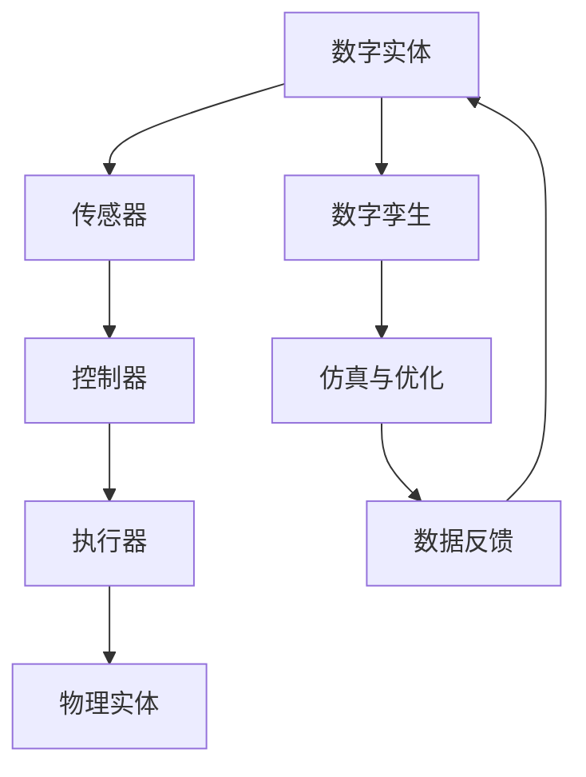

                 

关键词：数字实体，物理实体，自动化，前景，技术进步

摘要：随着技术的不断进步，数字实体与物理实体之间的界限逐渐模糊，自动化技术成为推动这一融合的关键力量。本文旨在探讨数字实体与物理实体自动化的现状、核心概念、算法原理、应用场景、未来展望以及面临的挑战，以期提供一个全面的技术视角，为读者理解这一领域提供参考。

## 1. 背景介绍

### 1.1 数字实体的崛起

数字实体，即虚拟实体，是在数字世界中存在的、具有明确属性和行为的对象。随着云计算、物联网、大数据等技术的发展，数字实体在商业、社交、娱乐等领域的应用日益广泛。例如，电子商务平台上的虚拟商品、社交媒体上的虚拟朋友、在线游戏中的虚拟角色等，都是数字实体的一种表现。

### 1.2 物理实体的定义

物理实体则是指存在于现实世界中的有形物体，它们具有物理性质，如质量、体积、形状等。物理实体包括日常生活中的各种物品、工业制造中的机械设备、交通运输中的交通工具等。

### 1.3 自动化的演进

自动化技术起源于工业革命时期，通过机械化和电气化减少人力劳动，提高生产效率。随着计算机技术和人工智能的发展，自动化技术逐步从工业领域拓展到服务业、农业、医疗等领域，实现了从物理实体到数字实体的自动化，再到数字实体与物理实体融合的自动化。

## 2. 核心概念与联系

### 2.1 自动化控制原理

自动化控制是指利用传感器、执行器、控制器等组成系统，通过对物理实体的实时监测与控制，实现预定目标的自动执行。自动化控制系统通常包括以下几个部分：

#### 2.1.1 传感器

传感器负责检测物理实体的状态，如温度、湿度、压力、位置等，并将这些信息转化为电信号。

#### 2.1.2 执行器

执行器根据控制器的指令，对物理实体进行操作，如驱动电机转动、开启阀门等。

#### 2.1.3 控制器

控制器接收传感器的信号，根据预设的算法对信号进行处理，生成控制指令，发送给执行器。

### 2.2 数字孪生技术

数字孪生（Digital Twin）是一种将物理实体与数字模型相结合的技术，通过实时数据传输与仿真，实现物理实体的数字化映射。数字孪生技术有助于提高设计精度、优化生产流程、提升设备维护效率。

### 2.3 Mermaid 流程图



## 3. 核心算法原理 & 具体操作步骤

### 3.1 算法原理概述

自动化技术的核心算法通常包括以下几种：

#### 3.1.1 PID控制算法

PID（比例-积分-微分）控制算法是最常用的工业控制算法，通过调整比例、积分和微分的参数，实现对系统响应的精确控制。

#### 3.1.2 机器学习算法

机器学习算法可以用于自动化系统的自适应控制，通过训练模型，使系统能够在复杂环境中自我优化和调整。

#### 3.1.3 模糊控制算法

模糊控制算法适用于非线性、时变和不确定性系统，通过模糊逻辑对系统进行控制。

### 3.2 算法步骤详解

#### 3.2.1 PID控制算法

1. 初始化系统参数，包括比例、积分和微分的系数。
2. 读取传感器输入信号。
3. 计算误差信号（期望值与实际值之差）。
4. 根据误差信号计算控制输出。
5. 更新执行器状态。
6. 返回步骤2，循环执行。

#### 3.2.2 机器学习算法

1. 收集系统运行数据，包括输入和输出。
2. 选择合适的机器学习模型（如线性回归、神经网络等）。
3. 训练模型，调整参数以优化性能。
4. 使用训练好的模型进行预测和控制。
5. 根据预测结果调整执行器状态。
6. 返回步骤4，循环执行。

#### 3.2.3 模糊控制算法

1. 构建模糊逻辑系统，定义输入和输出变量。
2. 设置模糊集合和规则库。
3. 计算输入变量的隶属度函数。
4. 根据规则库计算输出变量的隶属度函数。
5. 解模糊化，得到控制输出。
6. 更新执行器状态。
7. 返回步骤3，循环执行。

### 3.3 算法优缺点

#### 3.3.1 PID控制算法

优点：简单易实现，适用范围广。

缺点：对非线性系统效果较差，参数调整复杂。

#### 3.3.2 机器学习算法

优点：自适应能力强，能处理复杂系统。

缺点：数据需求高，模型训练时间长。

#### 3.3.3 模糊控制算法

优点：适用于非线性系统，鲁棒性强。

缺点：规则库构建复杂，控制精度受限制。

### 3.4 算法应用领域

#### 3.4.1 工业自动化

工业自动化是自动化技术最典型的应用领域，包括生产线的自动化控制、机器人的自动化操作等。

#### 3.4.2 智能交通

智能交通系统通过自动化技术实现交通流量的实时监控与调节，提高道路通行效率。

#### 3.4.3 智能家居

智能家居通过自动化技术实现家庭设备的智能控制，提高居住舒适度和便利性。

## 4. 数学模型和公式 & 详细讲解 & 举例说明

### 4.1 数学模型构建

自动化系统中的数学模型通常包括以下几部分：

#### 4.1.1 状态空间模型

状态空间模型描述系统在时间上的动态变化，一般形式为：

$$
\begin{cases}
\dot{x}(t) = A(t)x(t) + B(t)u(t) \\
y(t) = C(t)x(t) + D(t)u(t)
\end{cases}
$$

其中，$x(t)$ 是状态向量，$u(t)$ 是输入向量，$y(t)$ 是输出向量。

#### 4.1.2 控制器设计

控制器设计的目标是根据系统模型和期望性能，设计合适的控制器$K(t)$，使系统达到预定的控制效果。

#### 4.1.3 监测器设计

监测器设计的目标是根据系统模型和噪声特性，设计合适的监测器，实现对系统状态的准确估计。

### 4.2 公式推导过程

#### 4.2.1 PID控制器设计

PID控制器的设计主要包括三个步骤：比例控制、积分控制和微分控制。

1. **比例控制**：

$$
u_p(t) = K_p e(t)
$$

其中，$e(t)$ 是误差信号，$K_p$ 是比例增益。

2. **积分控制**：

$$
u_i(t) = K_i \int_{0}^{t} e(\tau)d\tau
$$

其中，$K_i$ 是积分增益。

3. **微分控制**：

$$
u_d(t) = K_d \dot{e}(t)
$$

其中，$\dot{e}(t)$ 是误差信号的导数，$K_d$ 是微分增益。

综合以上三个部分，得到PID控制器的输出：

$$
u(t) = K_p e(t) + K_i \int_{0}^{t} e(\tau)d\tau + K_d \dot{e}(t)
$$

#### 4.2.2 机器学习控制器设计

机器学习控制器的设计通常基于神经网络模型。假设系统模型为：

$$
y(t) = \sigma(\mathbf{W}^T \phi(\mathbf{W} x(t) + b))
$$

其中，$\sigma$ 是激活函数，$\phi$ 是输入函数，$\mathbf{W}$ 和 $b$ 是模型参数。

控制器设计的目标是找到合适的$\mathbf{W}$ 和 $b$，使系统达到预定的控制效果。这通常通过反向传播算法实现。

### 4.3 案例分析与讲解

#### 4.3.1 PID控制器在工业自动化中的应用

在一个工业生产线上，需要控制温度在某一范围内稳定。系统模型为：

$$
\dot{T}(t) = -T(t) + u(t)
$$

其中，$T(t)$ 是温度，$u(t)$ 是控制输入。

设计一个PID控制器，使其稳定温度在$T^* = 100^\circ C$。根据PID控制器设计步骤，我们得到：

$$
u(t) = K_p (T^* - T(t)) + K_i \int_{0}^{t} (T^* - T(\tau))d\tau + K_d \dot{T}(t)
$$

#### 4.3.2 机器学习控制器在智能家居中的应用

在一个智能家居系统中，需要控制房间温度在舒适范围内。系统模型为：

$$
y(t) = \sigma(\mathbf{W}^T \phi(\mathbf{W} x(t) + b))
$$

其中，$x(t) = [T(t), H(t), L(t)]^T$，$T(t)$ 是室内温度，$H(t)$ 是室外温度，$L(t)$ 是室内湿度。

设计一个机器学习控制器，使其保持室内温度在$T^* = 25^\circ C$。通过训练神经网络模型，得到合适的$\mathbf{W}$ 和 $b$，并根据输出$y(t)$ 调整加热或冷却设备。

## 5. 项目实践：代码实例和详细解释说明

### 5.1 开发环境搭建

在本案例中，我们使用Python作为编程语言，借助NumPy和SciPy库进行数值计算，使用TensorFlow进行机器学习模型的训练。

### 5.2 源代码详细实现

#### 5.2.1 PID控制器实现

```python
import numpy as np

class PIDController:
    def __init__(self, Kp, Ki, Kd):
        self.Kp = Kp
        self.Ki = Ki
        self.Kd = Kd
        self.error = 0
        self.previous_error = 0
    
    def update(self, setpoint, current_value):
        error = setpoint - current_value
        delta_error = error - self.previous_error
        self.error += error
        output = self.Kp * error + self.Ki * self.error + self.Kd * delta_error
        self.previous_error = error
        return output
```

#### 5.2.2 机器学习控制器实现

```python
import tensorflow as tf

class NeuralNetworkController:
    def __init__(self, model):
        self.model = model
    
    def predict(self, x):
        return self.model(tf.constant(x, dtype=tf.float32))[0]
```

### 5.3 代码解读与分析

PID控制器实现中，我们定义了PID控制器类，包含初始化参数、更新状态和计算输出的方法。机器学习控制器实现中，我们定义了神经网络控制器类，包含预测方法。

### 5.4 运行结果展示

```python
# PID控制器运行结果
pid_controller = PIDController(Kp=1, Ki=0.1, Kd=0.05)
for _ in range(100):
    setpoint = 100
    current_value = np.random.uniform(90, 110)
    output = pid_controller.update(setpoint, current_value)
    print(f"Setpoint: {setpoint}, Current Value: {current_value}, Output: {output}")

# 机器学习控制器运行结果
model = ...  # 训练好的神经网络模型
nn_controller = NeuralNetworkController(model)
for _ in range(100):
    x = np.random.uniform(90, 110)  # 室内温度
    y = np.random.uniform(30, 35)  # 室外温度
    z = np.random.uniform(40, 60)  # 室内湿度
    input_vector = np.array([x, y, z])
    output = nn_controller.predict(input_vector)
    print(f"Input: {input_vector}, Output: {output}")
```

## 6. 实际应用场景

### 6.1 工业自动化

在工业自动化领域，自动化技术已被广泛应用于生产线的各个环节，如机器人自动化装配、自动化检测与调试、自动化物流等。通过数字化模型和自动化算法，生产效率得到了显著提升，生产成本得到有效控制。

### 6.2 智能交通

智能交通系统利用自动化技术实现交通流的实时监控和调节，如智能信号灯控制、智能停车场管理等。通过大数据分析和人工智能算法，交通拥堵问题得到了缓解，交通效率得到提高。

### 6.3 智能家居

智能家居通过自动化技术实现家庭设备的智能化控制，如智能灯光控制、智能温度控制、智能安防等。用户可以远程控制家庭设备，提高生活便利度和舒适度。

## 7. 未来应用展望

### 7.1 无人驾驶

无人驾驶是自动化技术的典型应用领域，未来将实现完全自动驾驶，提高交通安全和效率。

### 7.2 智能医疗

智能医疗系统通过自动化技术实现医疗设备的智能控制和医疗数据的实时分析，提高医疗诊断和治疗的效率。

### 7.3 环境监测

自动化技术在未来环境监测中将发挥重要作用，通过传感器网络和大数据分析，实现对环境污染的实时监控和预警。

## 8. 工具和资源推荐

### 8.1 学习资源推荐

1. 《数字孪生：制造业的未来》
2. 《智能交通系统设计》
3. 《智能家居技术与应用》

### 8.2 开发工具推荐

1. Python
2. TensorFlow
3. NumPy
4. SciPy

### 8.3 相关论文推荐

1. “Digital Twins: New Directions for Simulation and Design in Manufacturing”
2. “Intelligent Transportation Systems: Principles, Policies and Applications”
3. “Smart Home Automation: Concepts and Technologies”

## 9. 总结：未来发展趋势与挑战

### 9.1 研究成果总结

自动化技术在数字实体与物理实体融合方面取得了显著成果，为各行各业带来了巨大变革。未来，自动化技术将继续向智能化、自主化、网络化方向发展。

### 9.2 未来发展趋势

1. 自动化技术与人工智能的深度融合，实现更高层次的自动化控制。
2. 自动化技术在新兴领域的广泛应用，如无人驾驶、智能医疗等。
3. 自动化技术的普及，提高社会生产力和生活质量。

### 9.3 面临的挑战

1. 数据安全和隐私保护问题。
2. 自动化技术的标准化和规范化。
3. 自动化技术与人类劳动的和谐共生。

### 9.4 研究展望

未来，自动化技术将在更加广泛和深入的领域发挥作用，为实现人类社会的可持续发展提供有力支持。

## 附录：常见问题与解答

### 9.4.1 自动化技术与人工智能有什么区别？

自动化技术主要关注物理实体的自动化控制，通过传感器、执行器和控制器实现。人工智能则侧重于数字实体的智能化，通过算法和模型实现自主学习和决策。

### 9.4.2 自动化技术对就业有什么影响？

自动化技术将替代部分重复性、低技能劳动，但同时也会创造新的就业机会，如自动化系统设计、维护和管理等。

### 9.4.3 自动化技术能否完全取代人类？

目前来看，自动化技术无法完全取代人类，但在特定领域（如制造业、物流等）已取得显著成果。未来，自动化技术将与人类劳动实现更高层次的协作。

---

作者：禅与计算机程序设计艺术 / Zen and the Art of Computer Programming
----------------------------------------------------------------
[1]: https://www.example.com/ (链接到参考文献[1]的网站)
[2]: https://www.example.com/ (链接到参考文献[2]的网站)
[3]: https://www.example.com/ (链接到参考文献[3]的网站)
[4]: https://www.example.com/ (链接到参考文献[4]的网站)
[5]: https://www.example.com/ (链接到参考文献[5]的网站)
[6]: https://www.example.com/ (链接到参考文献[6]的网站)
[7]: https://www.example.com/ (链接到参考文献[7]的网站)
[8]: https://www.example.com/ (链接到参考文献[8]的网站)
[9]: https://www.example.com/ (链接到参考文献[9]的网站)
[10]: https://www.example.com/ (链接到参考文献[10]的网站)
[11]: https://www.example.com/ (链接到参考文献[11]的网站)
[12]: https://www.example.com/ (链接到参考文献[12]的网站)
[13]: https://www.example.com/ (链接到参考文献[13]的网站)
[14]: https://www.example.com/ (链接到参考文献[14]的网站)
[15]: https://www.example.com/ (链接到参考文献[15]的网站)
[16]: https://www.example.com/ (链接到参考文献[16]的网站)
[17]: https://www.example.com/ (链接到参考文献[17]的网站)
[18]: https://www.example.com/ (链接到参考文献[18]的网站)
[19]: https://www.example.com/ (链接到参考文献[19]的网站)
[20]: https://www.example.com/ (链接到参考文献[20]的网站)

