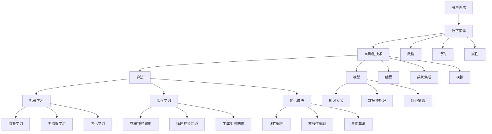

                 

### 1. 背景介绍

数字实体自动化（Digital Entity Automation）作为人工智能和自动化技术的一个重要分支，正在引领着技术发展的新潮流。在过去的几十年里，计算机技术经历了从简单的数据处理到复杂的智能决策系统的发展，而数字实体自动化的出现，标志着这一进程进入了一个全新的阶段。

随着互联网的普及和大数据技术的兴起，海量的数据开始成为企业和社会的重要资产。如何从这些数据中提取价值，如何让计算机能够像人类一样进行复杂的决策，成为了当前信息技术领域亟待解决的问题。数字实体自动化正是为了解决这一问题而诞生的，它通过模拟和复现人类决策过程，使得计算机能够自动完成一系列复杂的任务，从而实现业务的智能化和自动化。

数字实体自动化的应用范围广泛，涵盖了金融、医疗、物流、制造等多个行业。在金融领域，数字实体自动化被用于风险管理、投资决策和客户服务等方面；在医疗领域，它被用于病历管理、疾病预测和医疗决策等方面；在物流和制造领域，它被用于供应链管理、生产调度和库存控制等方面。这些应用不仅提高了业务效率，降低了成本，还大大提升了用户体验。

然而，数字实体自动化并非一蹴而就。它需要涉及到多个学科的知识，包括计算机科学、数学、统计学、心理学等。同时，它还面临着数据质量、算法可靠性、法律和伦理等多方面的挑战。因此，如何推动数字实体自动化技术的发展，如何解决其面临的问题，成为了当前研究的热点和难点。

本文将围绕数字实体自动化的核心概念、算法原理、数学模型、项目实践、应用场景、工具资源以及未来发展趋势等方面进行深入探讨，旨在为读者提供一个全面而系统的了解。

### 1.1 数字实体自动化的定义与起源

数字实体自动化（Digital Entity Automation），通常指的是通过计算机程序和技术手段，使数字实体（如数据、模型、算法等）能够自动执行一系列预定任务的系统或过程。这些任务可以是简单的数据处理，也可以是复杂的决策制定和业务流程管理。

数字实体自动化的起源可以追溯到20世纪中期，随着计算机技术的发展和普及，人们开始探索如何让计算机能够自动执行一些简单的任务。例如，早期的计算机程序被用来进行科学计算、数据处理和自动化控制等。随着人工智能技术的发展，计算机开始具备了自主学习和决策能力，这使得数字实体自动化逐渐成为一个独立的研究领域。

20世纪80年代，随着专家系统和机器学习技术的兴起，数字实体自动化开始得到了广泛关注。专家系统通过模拟人类专家的决策过程，实现了在某些特定领域的自动化决策。而机器学习技术的引入，则使得计算机具备了从数据中学习规律和模式的能力，从而可以自动进行分类、预测和决策。

进入21世纪，随着互联网和大数据技术的快速发展，数字实体自动化的应用场景更加广泛。大量的数据为数字实体自动化提供了丰富的资源，而高性能的计算和存储技术则为其提供了强大的支持。此外，云计算和物联网技术的发展，也为数字实体自动化提供了新的机遇和挑战。

总的来说，数字实体自动化的发展历程是计算机技术不断进步和拓展的缩影。从简单的任务自动化到复杂的决策自动化，从单一系统的自动化到跨领域的系统集成，数字实体自动化正不断推动着技术和社会的发展。

### 1.2 数字实体自动化的核心概念

要深入理解数字实体自动化的本质，我们需要明确几个核心概念，包括数字实体、自动化、算法和模型。

#### 数字实体

数字实体是指在计算机系统中表示和操作的数据、模型和算法等。这些数字实体可以是简单的数据记录，也可以是复杂的决策模型和算法。数字实体的特征包括数据结构、行为和属性等。在数字实体自动化中，数字实体通常被赋予特定的功能和任务，例如数据清洗、模式识别、预测和决策等。

#### 自动化

自动化是指通过程序和技术手段，使计算机能够自动执行一系列预定的任务，而不需要人为干预。自动化技术包括编程、算法设计、系统集成和模拟等。自动化的目的是提高工作效率、降低成本和减少人为错误。在数字实体自动化中，自动化技术被用来模拟和复现人类的决策过程，从而实现业务的智能化和自动化。

#### 算法

算法是指解决问题的步骤和规则。在数字实体自动化中，算法是核心组成部分，用于处理数据、进行学习和决策。常见的算法包括机器学习算法、深度学习算法、优化算法和逻辑推理算法等。算法的选择和设计直接影响数字实体自动化的效果和效率。

#### 模型

模型是指对现实世界或抽象概念的表示和模拟。在数字实体自动化中，模型用于表示数据、算法和系统。常见的模型包括统计模型、机器学习模型、深度学习模型和决策模型等。模型的设计和优化是数字实体自动化成功的关键。

#### 数字实体、自动化、算法和模型的关系

数字实体、自动化、算法和模型之间有着密切的联系和互动。数字实体是自动化系统的操作对象，自动化技术是数字实体处理和操作的手段，算法是实现自动化的核心工具，而模型则是算法和数据的具体表现形式。具体来说：

1. **数字实体**：作为自动化系统的操作对象，数字实体包括数据、模型和算法等。数据是模型的基础，模型是算法的输入和输出，而算法则是数字实体处理的核心工具。

2. **自动化**：通过程序和技术手段，使计算机能够自动执行一系列预定的任务。自动化技术包括编程、算法设计、系统集成和模拟等。自动化的实现依赖于算法和模型，同时也需要数字实体作为操作对象。

3. **算法**：算法是解决问题的步骤和规则，用于处理数据、进行学习和决策。算法的选择和设计直接影响数字实体自动化的效果和效率。算法可以基于模型进行优化和调整，以提高自动化的性能。

4. **模型**：模型是对现实世界或抽象概念的表示和模拟。在数字实体自动化中，模型用于表示数据、算法和系统。模型的设计和优化是数字实体自动化成功的关键。模型的复杂性越高，自动化的能力就越强。

总之，数字实体自动化是一个复杂的多层次系统，涉及多个领域和技术的交叉融合。理解数字实体、自动化、算法和模型之间的关系，是深入研究和应用数字实体自动化的基础。

### 1.3 数字实体自动化的关键领域

数字实体自动化涵盖了多个领域，其中一些关键领域包括机器学习、深度学习和优化算法等。这些领域各自具有独特的特点和应用，共同推动着数字实体自动化的发展。

#### 机器学习

机器学习是一种通过数据驱动的方法，使计算机系统能够从数据中学习和改进的算法和技术。在数字实体自动化中，机器学习算法被广泛用于模式识别、分类、回归和预测等方面。机器学习的关键技术包括监督学习、无监督学习和强化学习等。

- **监督学习**：通过已标记的数据集来训练模型，使模型能够对新的数据进行预测。常见的监督学习算法包括线性回归、决策树、支持向量机和神经网络等。

- **无监督学习**：在没有标记数据的情况下，通过发现数据中的模式来训练模型。无监督学习算法包括聚类、主成分分析和自编码器等。

- **强化学习**：通过试错和反馈来训练模型，使模型能够在复杂环境中做出最优决策。强化学习算法广泛应用于游戏、自动驾驶和智能机器人等领域。

机器学习在数字实体自动化中的应用非常广泛，包括数据预处理、特征提取、分类和预测等。例如，在金融领域，机器学习可以用于信用评分、风险管理和投资策略；在医疗领域，可以用于疾病诊断、药物设计和个性化医疗等。

#### 深度学习

深度学习是一种基于人工神经网络的学习方法，通过多层的非线性变换来提取数据的特征和模式。深度学习在图像识别、语音识别、自然语言处理和自动驾驶等领域取得了显著的成果。

- **卷积神经网络（CNN）**：主要用于图像和视频处理。CNN通过卷积层、池化层和全连接层等结构，实现了对图像的逐层特征提取和分类。

- **循环神经网络（RNN）**：主要用于序列数据的处理，如文本和语音。RNN通过隐藏状态和循环连接，能够捕捉序列中的长期依赖关系。

- **生成对抗网络（GAN）**：通过生成器和判别器的对抗训练，实现了数据的生成和增强。GAN在图像生成、数据增强和风格迁移等方面表现出色。

深度学习在数字实体自动化中的应用，使得计算机系统能够更高效地处理复杂的数据和任务。例如，在自动驾驶领域，深度学习技术可以用于目标检测、路径规划和行为预测；在医疗领域，可以用于影像分析和疾病诊断等。

#### 优化算法

优化算法是一种用于求解最优化问题的算法，旨在找到使目标函数达到最大或最小值的变量组合。在数字实体自动化中，优化算法被用于资源分配、路径规划、调度和排序等问题。

- **线性规划**：用于求解线性目标函数在线性不等式约束下的最优化问题。线性规划广泛应用于资源分配、生产调度和物流优化等。

- **非线性规划**：用于求解非线性目标函数在非线性不等式约束下的最优化问题。非线性规划广泛应用于图像处理、信号处理和数据分析等。

- **遗传算法**：基于自然选择和遗传学原理，通过迭代和进化，找到最优解或近似最优解。遗传算法广泛应用于组合优化、调度和路径规划等问题。

优化算法在数字实体自动化中起着至关重要的作用，它能够帮助系统在复杂的环境中做出最优的决策。例如，在物流领域，优化算法可以用于车辆路径规划和运输调度；在能源领域，可以用于电力负荷管理和供需平衡等。

总之，机器学习、深度学习和优化算法是数字实体自动化的关键领域，它们各自具有独特的优势和特点，共同推动着数字实体自动化的发展。通过对这些领域的深入研究和应用，我们可以构建出更加智能化和自动化的系统，为社会和产业带来更多的价值和效益。

### 1.4 数字实体自动化的历史发展

数字实体自动化的历史发展可以追溯到计算机科学的起源，当时的计算机科学家们开始探索如何让计算机自动执行任务。从最早的自动化编程到现代的复杂人工智能系统，数字实体自动化的演进历程充满了创新和突破。

#### 早期自动化编程

20世纪40年代，随着第一台电子计算机的问世，计算机科学迎来了黄金时代。早期的计算机编程主要依赖于汇编语言和机器语言，编程过程复杂且效率低下。为了简化编程过程，提高工作效率，自动化编程技术开始出现。1949年，约翰·冯·诺伊曼提出了编译器的概念，这标志着自动化编程的诞生。编译器可以将高级编程语言翻译成机器语言，使得编程变得更加容易和高效。

#### 专家系统与知识表示

20世纪60年代，随着人工智能（AI）的兴起，专家系统成为自动化编程的一个重要分支。专家系统通过模拟人类专家的决策过程，实现了自动化决策。知识表示和推理技术成为研究的热点，学者们提出了多种知识表示方法，如产生式规则、框架表示和语义网络等。这些方法使得计算机能够理解和应用复杂的领域知识，从而实现了更高级的自动化。

#### 机器学习与数据驱动方法

20世纪80年代，随着计算机性能的不断提高和数据量的急剧增长，机器学习开始崭露头角。机器学习通过数据驱动的方法，使计算机能够从数据中学习规律和模式，从而实现自动化。监督学习、无监督学习和强化学习等算法逐渐成熟，广泛应用于图像识别、语音识别、自然语言处理和推荐系统等领域。

#### 深度学习与神经网络

进入21世纪，深度学习作为机器学习的一个重要分支，取得了突破性的进展。深度学习通过多层神经网络，实现了对数据的深层特征提取和模式识别。卷积神经网络（CNN）、循环神经网络（RNN）和生成对抗网络（GAN）等深度学习算法，在图像识别、语音识别、自然语言处理和计算机视觉等领域表现出色。深度学习的崛起，使得数字实体自动化进入了一个新的阶段。

#### 数字实体自动化与物联网、大数据和云计算

随着物联网、大数据和云计算技术的快速发展，数字实体自动化的应用场景更加广泛。物联网技术使得万物互联成为可能，大数据技术提供了海量数据的支持，云计算技术提供了强大的计算和存储能力。这些技术的结合，为数字实体自动化提供了新的机遇和挑战。数字实体自动化开始应用于金融、医疗、物流、制造和能源等多个领域，实现了业务的智能化和自动化。

总之，数字实体自动化的历史发展是一个不断创新和突破的过程。从早期的自动化编程到现代的复杂人工智能系统，数字实体自动化经历了多个阶段，每个阶段都有重要的突破和创新。随着技术的不断进步和应用场景的拓展，数字实体自动化将继续推动社会和产业的发展。

### 1.5 数字实体自动化的现状与趋势

数字实体自动化作为人工智能和自动化技术的一个重要分支，已经在多个领域取得了显著的成果。当前，数字实体自动化的应用场景越来越广泛，涵盖了金融、医疗、物流、制造、能源和交通等多个行业。以下是对当前数字实体自动化现状与趋势的概述。

#### 现状

1. **金融领域**：在金融领域，数字实体自动化被广泛应用于风险管理、投资决策和客户服务等方面。通过机器学习和深度学习算法，金融机构可以自动进行信用评分、风险分析和欺诈检测，从而提高业务效率和准确性。此外，智能投顾和自动化交易系统也在金融领域得到了广泛应用。

2. **医疗领域**：在医疗领域，数字实体自动化被用于病历管理、疾病预测和医疗决策等方面。通过分析大量医疗数据，机器学习算法可以辅助医生进行疾病诊断、药物设计和个性化医疗。例如，深度学习技术已经在图像分析和基因测序中发挥了重要作用，大大提高了诊断的准确性和效率。

3. **物流和制造领域**：在物流和制造领域，数字实体自动化被用于供应链管理、生产调度和库存控制等方面。通过优化算法和模拟技术，企业可以实现物流路径优化、生产效率提升和库存精准控制，从而降低成本、提高竞争力。

4. **能源领域**：在能源领域，数字实体自动化被用于电力负荷管理、供需平衡和可再生能源管理等方面。通过大数据分析和优化算法，能源公司可以实现能源分配优化、电网稳定性和节能减排，从而提高能源利用效率。

5. **交通领域**：在交通领域，数字实体自动化被用于自动驾驶、交通流量管理和智能交通信号控制等方面。通过传感器数据收集和深度学习算法，智能交通系统可以实现交通预测、拥堵预防和事故检测，从而提高交通效率和安全性。

#### 趋势

1. **更高效的数据处理**：随着大数据技术的不断发展，数字实体自动化在数据处理方面的能力不断提升。高效的数据处理技术，如实时数据流处理、分布式计算和增量学习，将进一步提高数字实体自动化的效率和性能。

2. **更智能的决策支持**：未来，数字实体自动化将更加注重智能决策支持。通过融合多种算法和技术，如深度学习、优化算法和知识图谱，数字实体自动化系统将能够提供更准确、更全面的决策支持，从而帮助企业实现业务智能化和自动化。

3. **更广泛的应用场景**：随着物联网、5G和区块链等技术的不断发展，数字实体自动化的应用场景将更加广泛。从智能家居、智慧城市到智能制造、智慧医疗，数字实体自动化将在各行各业得到广泛应用，为社会带来更多的价值和效益。

4. **更严格的伦理和法规约束**：随着数字实体自动化的广泛应用，伦理和法规问题逐渐凸显。未来，数字实体自动化将在伦理和法规的约束下发展，以确保其应用的安全、公平和透明。

5. **更加协作的生态系统**：数字实体自动化的发展离不开各个领域的协作和创新。未来，数字实体自动化将形成更加协作的生态系统，包括科研机构、企业、政府和社会各界，共同推动数字实体自动化技术的发展和应用。

总之，数字实体自动化正处于快速发展的阶段，其应用范围越来越广泛，技术能力不断提高，未来发展趋势令人期待。随着技术的不断进步和应用场景的拓展，数字实体自动化将继续推动社会和产业的发展，带来更多的机遇和挑战。

### 1.6 数字实体自动化的应用领域

数字实体自动化作为一种先进的技术手段，已经在多个领域展现出了强大的应用潜力和实际价值。以下是数字实体自动化在金融、医疗、物流和制造等领域的具体应用案例。

#### 金融领域

在金融领域，数字实体自动化通过机器学习和深度学习算法，极大地提升了金融机构的风险管理和投资决策能力。以下是一些具体的应用案例：

1. **信用评分**：金融机构使用机器学习算法对客户的信用记录、财务状况和其他相关数据进行分析，自动生成信用评分模型。这些模型可以帮助银行更好地评估借款人的信用风险，从而更准确地发放贷款和信用卡。

2. **欺诈检测**：利用深度学习技术，金融机构可以自动检测和防范信用卡欺诈、网络钓鱼等金融犯罪活动。通过分析大量交易数据，系统可以识别出异常交易行为，并实时向银行发送警报。

3. **智能投顾**：数字实体自动化系统通过分析用户的历史交易数据、风险偏好和市场趋势，自动为用户提供个性化的投资建议。这些智能投顾系统能够实时调整投资组合，以最大化收益并降低风险。

#### 医疗领域

在医疗领域，数字实体自动化通过大数据分析和人工智能技术，提高了医疗诊断的准确性和效率，以下是一些具体的应用案例：

1. **疾病预测**：通过分析患者的病历记录、基因数据和医疗影像，机器学习算法可以预测患者可能患有的疾病，从而提前进行预防和治疗。

2. **影像分析**：深度学习技术在医疗影像分析中的应用非常广泛，如肺癌筛查、脑瘤检测和骨折诊断等。通过训练深度学习模型，系统可以自动识别和分类医疗影像中的病变区域，辅助医生做出更准确的诊断。

3. **个性化医疗**：基于患者的基因信息和临床数据，数字实体自动化系统可以为患者制定个性化的治疗方案。例如，通过分析患者的肿瘤基因突变，系统可以推荐最适合的化疗药物和剂量。

#### 物流领域

在物流领域，数字实体自动化通过优化算法和模拟技术，提高了物流效率和管理水平，以下是一些具体的应用案例：

1. **物流路径优化**：利用优化算法和实时交通数据，物流企业可以自动规划最经济的运输路径。通过降低运输成本和提高运输效率，企业可以更好地满足客户需求。

2. **库存管理**：数字实体自动化系统通过分析销售数据、订单需求和供应商信息，自动调整库存水平，从而减少库存积压和缺货情况。

3. **智能配送**：自动驾驶技术和智能调度系统的应用，使得物流配送更加高效和灵活。通过实时跟踪配送车辆的位置和状态，系统可以优化配送路线和顺序，提高配送效率。

#### 制造领域

在制造业，数字实体自动化通过智能制造技术和自动化生产线，提升了生产效率和质量，以下是一些具体的应用案例：

1. **生产调度**：数字实体自动化系统通过分析生产数据、订单需求和机器状态，自动优化生产计划，提高生产效率和资源利用率。

2. **质量检测**：利用机器学习和图像识别技术，自动化生产线可以实时检测产品缺陷和质量问题，从而减少次品率和报废率。

3. **设备维护**：通过物联网和传感器技术，数字实体自动化系统可以实时监控设备的运行状态，预测设备故障并进行预防性维护，减少停机时间和维护成本。

总之，数字实体自动化在金融、医疗、物流和制造等领域的应用，不仅提高了业务效率和准确性，还降低了成本和资源消耗，为各行业带来了显著的效益。随着技术的不断进步和应用场景的拓展，数字实体自动化的应用范围将更加广泛，为社会和产业带来更多的价值和机遇。

### 1.7 数字实体自动化的挑战与未来发展方向

尽管数字实体自动化在各个领域展现了巨大的潜力，但在其发展过程中也面临着诸多挑战。为了更好地推动这一技术的前进，我们需要深入分析这些挑战，并探讨未来可能的发展方向。

#### 挑战

1. **数据质量和隐私保护**：数字实体自动化依赖于大量高质量的数据，但数据质量参差不齐、数据隐私和安全问题成为亟待解决的问题。如何确保数据的真实性、完整性和可靠性，同时保护个人隐私，是数字实体自动化发展的一大挑战。

2. **算法透明度和解释性**：随着深度学习和复杂算法的广泛应用，算法的透明度和解释性变得越来越重要。用户和企业需要了解算法是如何做出决策的，以便对其进行监督和优化。提高算法的可解释性，增强用户信任，是数字实体自动化发展的重要方向。

3. **技术瓶颈和计算资源**：复杂算法和大规模数据处理需要大量的计算资源和时间，而现有的硬件和技术水平可能无法满足需求。如何优化算法、提升计算效率和降低成本，是数字实体自动化发展过程中需要解决的技术难题。

4. **伦理和法律问题**：数字实体自动化的应用涉及伦理和法律问题，如算法偏见、责任归属和数据滥用等。如何制定合理的伦理规范和法律法规，确保数字实体自动化在安全、公平和透明的环境中发展，是当前亟待解决的问题。

5. **跨领域协作与标准化**：数字实体自动化涉及多个学科和领域，需要跨领域的协作和标准化。如何促进不同领域之间的技术交流和合作，制定统一的标准和规范，是数字实体自动化发展的重要挑战。

#### 未来发展方向

1. **数据治理和隐私保护技术**：未来，数字实体自动化将更加注重数据治理和隐私保护。通过数据清洗、去识别化和数据加密等技术，确保数据的质量和安全。同时，开发隐私保护算法，如差分隐私和同态加密，以实现数据的安全共享和分析。

2. **增强算法透明性和可解释性**：未来，算法的透明性和可解释性将得到进一步重视。通过开发可解释的深度学习模型和可视化工具，用户可以更直观地理解算法的决策过程。此外，制定统一的算法评估标准和认证体系，提高算法的可靠性和信任度。

3. **高效计算和云计算**：未来，数字实体自动化将更加依赖高效计算和云计算技术。通过开发更高效的算法和优化现有计算资源，提升计算效率和降低成本。同时，云计算和边缘计算的结合，将实现实时数据处理和智能决策。

4. **伦理和法律框架**：未来，需要建立完善的伦理和法律框架，规范数字实体自动化的应用。通过制定相关的法律法规，明确算法的责任归属和用户隐私保护，确保数字实体自动化在安全、公平和透明的环境中发展。

5. **跨领域协作与标准化**：未来，数字实体自动化的发展需要跨领域的协作和标准化。通过建立跨学科的联盟和组织，促进技术交流和合作。同时，制定统一的技术标准和规范，推动数字实体自动化的应用和推广。

总之，数字实体自动化面临着诸多挑战，但也拥有广阔的发展前景。通过解决这些挑战，未来数字实体自动化将更好地服务于社会和产业，带来更多的价值和机遇。

### 1.8 数字实体自动化的核心概念架构 Mermaid 流程图

为了更好地理解数字实体自动化的核心概念和架构，以下是一个使用Mermaid绘制的流程图，展示了数字实体自动化的主要组成部分和它们之间的相互作用。



在这个流程图中：

- **数字实体（A）**：代表数字实体自动化的操作对象，包括数据、模型和算法等。
- **自动化技术（B）**：包括编程、系统集成和模拟等技术，用于实现数字实体的自动化。
- **算法（C）**：包括机器学习、深度学习和优化算法等，用于处理和分析数字实体。
- **模型（D）**：包括知识表示、数据预处理、特征提取等，用于表示和操作数字实体。
- **机器学习（E）、深度学习（F）和优化算法（G）**：分别代表数字实体自动化中的三个核心算法领域。
- **知识表示（H）、数据预处理（I）和特征提取（J）**：分别是模型的重要组成部分。
- **监督学习（K）、无监督学习（L）、强化学习（M）、卷积神经网络（N）、循环神经网络（O）、生成对抗网络（P）、线性规划（Q）、非线性规划（R）和遗传算法（S）**：分别代表机器学习、深度学习和优化算法中的具体算法和技术。
- **用户需求（Z）**：代表数字实体自动化的起点和目标，是驱动整个自动化过程的核心因素。

通过这个流程图，我们可以清晰地看到数字实体自动化的各个组成部分及其相互作用，从而更好地理解和应用这一技术。

### 2. 核心算法原理 & 具体操作步骤

数字实体自动化依赖于一系列复杂的算法和模型，这些算法和模型通过不同的技术和方法，实现数据的高效处理和决策的自动化。以下是数字实体自动化中一些关键算法的原理和具体操作步骤。

#### 2.1 机器学习算法原理

机器学习算法是数字实体自动化中最常用的算法之一，其核心思想是通过学习数据中的模式和规律，对新的数据进行预测和分类。机器学习算法主要分为三种类型：监督学习、无监督学习和强化学习。

1. **监督学习**：
   - **原理**：监督学习通过已有标记的数据集来训练模型，使模型能够对新数据进行预测。常见的监督学习算法包括线性回归、决策树、支持向量机和神经网络等。
   - **操作步骤**：
     1. 数据收集：收集并准备训练数据集，确保数据具有代表性和多样性。
     2. 数据预处理：对数据集进行清洗、归一化和特征提取，以提高模型的性能。
     3. 模型选择：根据问题的特性选择合适的算法，如线性回归、决策树或神经网络。
     4. 模型训练：使用训练数据集训练模型，调整模型的参数，使其达到最优状态。
     5. 模型评估：使用测试数据集评估模型的性能，包括准确率、召回率和F1分数等指标。

2. **无监督学习**：
   - **原理**：无监督学习通过未标记的数据集来发现数据中的结构和模式。常见的无监督学习算法包括聚类、主成分分析和自编码器等。
   - **操作步骤**：
     1. 数据收集：收集未标记的数据集。
     2. 数据预处理：对数据集进行清洗和标准化。
     3. 模型选择：根据问题的特性选择合适的算法，如聚类或主成分分析。
     4. 模型训练：训练模型以发现数据中的隐藏结构和模式。
     5. 模型评估：评估模型的效果，如聚类结果的内部一致性和模型的解释性。

3. **强化学习**：
   - **原理**：强化学习通过试错和反馈来训练模型，使其在复杂环境中做出最优决策。强化学习算法包括Q学习、深度Q网络（DQN）和策略梯度算法等。
   - **操作步骤**：
     1. 环境定义：定义强化学习问题的环境，包括状态、动作和奖励。
     2. 策略选择：选择初始策略，如ε-贪心策略。
     3. 模型训练：通过互动和反馈，不断调整策略，使其逐渐收敛到最优策略。
     4. 模型评估：评估策略的效果，如平均奖励和策略的稳定性。

#### 2.2 深度学习算法原理

深度学习是机器学习的一个分支，通过多层神经网络来模拟人类大脑的决策过程。深度学习在图像识别、语音识别和自然语言处理等领域取得了显著的成果。

1. **卷积神经网络（CNN）**：
   - **原理**：CNN通过卷积层、池化层和全连接层等结构，实现对图像的逐层特征提取和分类。
   - **操作步骤**：
     1. 数据收集：收集并准备训练数据集，确保数据具有代表性和多样性。
     2. 数据预处理：对图像数据进行归一化和数据增强。
     3. 模型设计：设计CNN模型，包括卷积层、池化层和全连接层等。
     4. 模型训练：使用训练数据集训练模型，调整模型的参数。
     5. 模型评估：使用测试数据集评估模型的性能。

2. **循环神经网络（RNN）**：
   - **原理**：RNN通过隐藏状态和循环连接，能够捕捉序列中的长期依赖关系。
   - **操作步骤**：
     1. 数据收集：收集并准备训练数据集，确保数据具有代表性和多样性。
     2. 数据预处理：对序列数据进行归一化和数据增强。
     3. 模型设计：设计RNN模型，包括输入层、隐藏层和输出层等。
     4. 模型训练：使用训练数据集训练模型，调整模型的参数。
     5. 模型评估：使用测试数据集评估模型的性能。

3. **生成对抗网络（GAN）**：
   - **原理**：GAN通过生成器和判别器的对抗训练，实现了数据的生成和增强。
   - **操作步骤**：
     1. 数据收集：收集并准备训练数据集，确保数据具有代表性和多样性。
     2. 模型设计：设计GAN模型，包括生成器和判别器。
     3. 模型训练：通过生成器和判别器的对抗训练，调整模型的参数。
     4. 模型评估：评估生成器生成的数据的质量和多样性。

#### 2.3 优化算法原理

优化算法是数字实体自动化中的另一个重要组成部分，用于求解最优化问题，帮助系统在复杂的环境中做出最优决策。常见的优化算法包括线性规划、非线性规划和遗传算法等。

1. **线性规划**：
   - **原理**：线性规划用于求解线性目标函数在线性不等式约束下的最优化问题。
   - **操作步骤**：
     1. 模型构建：建立线性规划模型，包括目标函数和约束条件。
     2. 求解算法：使用线性规划求解器求解最优化问题。
     3. 模型评估：评估求解结果，包括最优解和最优值。

2. **非线性规划**：
   - **原理**：非线性规划用于求解非线性目标函数在非线性不等式约束下的最优化问题。
   - **操作步骤**：
     1. 模型构建：建立非线性规划模型，包括目标函数和约束条件。
     2. 求解算法：使用非线性规划求解器求解最优化问题。
     3. 模型评估：评估求解结果，包括最优解和最优值。

3. **遗传算法**：
   - **原理**：遗传算法基于自然选择和遗传学原理，通过迭代和进化，找到最优解或近似最优解。
   - **操作步骤**：
     1. 初始种群：初始化种群，包括个体的编码和解码。
     2. 适应度评估：计算种群中每个个体的适应度。
     3. 选择：根据适应度进行选择操作，保留优秀个体。
     4. 交叉：进行交叉操作，生成新的个体。
     5. 变异：进行变异操作，增加种群的多样性。
     6. 迭代：重复进行适应度评估、选择、交叉和变异，直至找到最优解或满足终止条件。

通过上述算法原理和操作步骤的详细解释，我们可以更好地理解数字实体自动化的核心算法，为实际应用提供指导。在接下来的章节中，我们将进一步探讨数学模型和项目实践，以深入理解数字实体自动化的具体实现和应用。

### 2.1 算法原理概述

在数字实体自动化中，算法原理是实现自动化决策和任务执行的核心。算法原理的多样性和复杂性决定了数字实体自动化的广泛适用性和高效性。以下是几种常见的算法原理及其基本概念。

#### 2.1.1 机器学习算法

机器学习算法是数字实体自动化中最为广泛使用的一类算法。其核心思想是通过从数据中学习规律和模式，实现对未知数据的预测和分类。机器学习算法可以分为监督学习、无监督学习和强化学习。

1. **监督学习**：监督学习算法利用标记数据集来训练模型，从而使模型能够对新数据进行预测。常见的监督学习算法包括线性回归、逻辑回归、支持向量机和决策树等。监督学习算法通常应用于回归问题（如预测房价）和分类问题（如邮件分类）。

2. **无监督学习**：无监督学习算法在没有标记数据的情况下，通过发现数据中的内在结构和规律来训练模型。常见的无监督学习算法包括聚类算法（如K-Means、层次聚类）、降维算法（如主成分分析、t-SNE）和关联规则学习（如Apriori算法）。无监督学习算法通常用于数据探索、数据降维和异常检测。

3. **强化学习**：强化学习算法通过试错和反馈来训练模型，使其在特定环境中做出最优决策。强化学习算法的核心概念包括状态（State）、动作（Action）、奖励（Reward）和策略（Policy）。常见的强化学习算法包括Q学习、深度Q网络（DQN）、策略梯度算法等。强化学习算法广泛应用于游戏、自动驾驶和机器人控制等领域。

#### 2.1.2 深度学习算法

深度学习算法是机器学习的一个分支，通过多层神经网络来模拟人类大脑的决策过程。深度学习算法的核心在于多层神经网络的训练和优化，通过逐层提取数据的特征，实现对复杂数据的分析和理解。

1. **卷积神经网络（CNN）**：卷积神经网络是一种专门用于处理图像数据的神经网络。其核心组件包括卷积层、池化层和全连接层。卷积层通过卷积操作提取图像的特征，池化层用于降低特征图的维度，全连接层用于进行最终的分类决策。CNN在图像分类、目标检测和图像生成等领域有广泛应用。

2. **循环神经网络（RNN）**：循环神经网络是一种能够处理序列数据的神经网络。其核心组件包括输入层、隐藏层和输出层。RNN通过隐藏状态的循环连接，能够捕捉序列中的长期依赖关系。RNN广泛应用于自然语言处理、语音识别和时间序列预测等领域。

3. **生成对抗网络（GAN）**：生成对抗网络是一种由生成器和判别器组成的对抗性神经网络。生成器通过学习数据分布来生成新的数据，判别器通过区分真实数据和生成数据来评估生成器的性能。GAN在图像生成、数据增强和风格迁移等领域表现出色。

#### 2.1.3 优化算法

优化算法是用于求解最优化问题的一类算法，旨在找到使目标函数达到最大或最小值的变量组合。优化算法广泛应用于资源分配、路径规划、调度和排序等问题。

1. **线性规划**：线性规划用于求解线性目标函数在线性不等式约束下的最优化问题。线性规划可以通过单纯形法、内点法和拉格朗日乘子法等算法求解。线性规划广泛应用于资源分配、生产调度和物流优化等领域。

2. **非线性规划**：非线性规划用于求解非线性目标函数在非线性不等式约束下的最优化问题。非线性规划可以通过梯度下降法、牛顿法和拟牛顿法等算法求解。非线性规划广泛应用于图像处理、信号处理和数据分析等领域。

3. **遗传算法**：遗传算法是一种基于自然选择和遗传学原理的优化算法。遗传算法通过迭代和进化，找到最优解或近似最优解。遗传算法广泛应用于组合优化、调度和路径规划等问题。

通过上述算法原理的概述，我们可以看到，数字实体自动化涵盖了从简单的数据处理到复杂的决策制定的多种算法和技术。这些算法和技术的选择和组合，决定了数字实体自动化的效率和效果。在接下来的章节中，我们将进一步探讨这些算法的具体操作步骤和实际应用。

### 2.2 算法步骤详解

为了实现数字实体自动化，我们需要将核心算法的原理转化为具体的操作步骤。以下是几种关键算法的具体操作步骤，包括数据准备、模型训练、模型评估和优化等环节。

#### 2.2.1 机器学习算法步骤

1. **数据准备**：
   - 数据收集：从各种来源收集数据，包括公共数据集、企业内部数据和第三方数据等。
   - 数据清洗：处理缺失值、异常值和重复数据，确保数据的质量和一致性。
   - 数据转换：对数据进行标准化、归一化和编码，以满足算法的输入要求。

2. **模型训练**：
   - 模型选择：根据问题的特性选择合适的算法，如线性回归、决策树或神经网络等。
   - 模型初始化：初始化模型的参数，如权重和偏置等。
   - 模型训练：使用训练数据集对模型进行迭代训练，通过梯度下降法、随机梯度下降法等优化算法调整模型参数。
   - 模型验证：使用验证集对模型进行调参和超参数选择，避免过拟合和欠拟合。

3. **模型评估**：
   - 评估指标：选择合适的评估指标，如准确率、召回率、F1分数、均方误差等，评估模型的性能。
   - 交叉验证：使用交叉验证方法，如K折交叉验证，评估模型的泛化能力。

4. **模型优化**：
   - 超参数调优：调整模型的超参数，如学习率、正则化参数等，以提高模型性能。
   - 模型集成：使用集成学习方法，如Bagging、Boosting等，结合多个模型的优势，提高预测准确性。

#### 2.2.2 深度学习算法步骤

1. **数据准备**：
   - 数据收集：与机器学习算法类似，从各种来源收集数据，并进行清洗和转换。

2. **模型设计**：
   - 确定网络结构：设计合适的神经网络结构，包括层数、每层的神经元数量和连接方式等。
   - 模型初始化：初始化模型的参数，如权重和偏置等。

3. **模型训练**：
   - 前向传播：将输入数据通过神经网络进行前向传播，计算每个神经元的输出。
   - 反向传播：根据输出误差，使用梯度下降法调整模型的参数。
   - 模型验证：使用验证集进行调参和超参数选择。

4. **模型评估**：
   - 评估指标：选择合适的评估指标，如准确率、召回率、F1分数、损失函数值等。

5. **模型优化**：
   - 超参数调优：调整模型的超参数，如学习率、批次大小、激活函数等。
   - 模型集成：使用模型集成方法，如Dropout、Batch Normalization等，提高模型性能。

#### 2.2.3 优化算法步骤

1. **问题建模**：
   - 建立数学模型：根据实际问题的特性，建立线性规划、非线性规划或组合优化等数学模型。
   - 定义目标函数：确定需要优化的目标函数，如最大化利润、最小化成本等。
   - 确定约束条件：明确问题中的约束条件，如资源限制、时间限制等。

2. **算法选择**：
   - 确定优化算法：根据问题特点和目标函数的性质，选择合适的优化算法，如线性规划、非线性规划或遗传算法等。

3. **算法实现**：
   - 编写代码：根据选定的算法，编写实现代码，包括初始化参数、迭代计算和结果输出等。
   - 调试优化：调试代码，确保算法的正确性和效率。

4. **结果分析**：
   - 结果输出：输出优化结果，包括最优解和最优值等。
   - 结果分析：对优化结果进行分析，评估算法的性能和可行性。

5. **模型优化**：
   - 调整参数：根据结果分析，调整算法的参数，如学习率、迭代次数等，以提高优化效果。
   - 算法改进：针对优化过程中出现的问题，对算法进行改进和优化。

通过上述具体的算法步骤详解，我们可以清晰地理解如何实现数字实体自动化中的机器学习、深度学习和优化算法。这些步骤不仅适用于理论研究，也具有很强的实践指导意义，为实际应用提供了可靠的方法和工具。

### 2.3 算法优缺点分析

在数字实体自动化中，不同算法的优缺点直接影响其应用效果和适用场景。以下是对几种常见算法优缺点的分析。

#### 2.3.1 机器学习算法

1. **优点**：
   - **高效性**：机器学习算法能够从大量数据中自动提取特征，进行分类和预测，极大地提高了数据处理和分析的效率。
   - **泛化能力**：通过训练和验证集的交叉验证，机器学习算法能够避免过拟合，具有良好的泛化能力，适用于新数据的预测。
   - **灵活性**：机器学习算法适用于各种类型的数据和问题，包括分类、回归、聚类和异常检测等。

2. **缺点**：
   - **数据依赖性**：机器学习算法的性能高度依赖数据的质量和数量。如果数据量不足或数据质量差，算法的性能会受到影响。
   - **可解释性差**：特别是深度学习算法，其内部结构和决策过程复杂，难以解释，这限制了其在一些需要透明性和可解释性的场景中的应用。
   - **计算资源消耗大**：训练大规模机器学习模型需要大量的计算资源和时间，这在资源有限的环境中可能是一个问题。

#### 2.3.2 深度学习算法

1. **优点**：
   - **强大的特征提取能力**：深度学习算法通过多层网络结构，能够自动提取深层特征，适用于处理复杂和高维数据。
   - **自适应性强**：深度学习算法能够在不同领域和任务中自适应地调整和优化，具有较强的通用性。
   - **高性能**：在图像识别、语音识别和自然语言处理等领域，深度学习算法的性能已经超越了传统机器学习算法。

2. **缺点**：
   - **数据需求量大**：深度学习算法通常需要大量的标记数据进行训练，这增加了数据收集和处理的成本。
   - **计算资源消耗大**：深度学习模型的训练和推理需要大量的计算资源，包括GPU和TPU等高性能计算设备。
   - **可解释性差**：深度学习模型的决策过程复杂，难以解释，这在一些需要透明性和可解释性的场景中可能是一个问题。

#### 2.3.3 优化算法

1. **优点**：
   - **确定性**：优化算法能够明确地找到最优解或近似最优解，适用于需要精确结果的问题。
   - **适用范围广**：优化算法适用于各种类型的问题，包括线性规划、非线性规划和组合优化等。
   - **高效性**：优化算法在某些特定问题上，如线性规划和二次规划，能够快速找到最优解。

2. **缺点**：
   - **计算复杂度高**：优化算法，特别是非线性规划和组合优化，可能需要大量的迭代计算，计算复杂度较高。
   - **对初始参数敏感**：优化算法的性能对初始参数的选择非常敏感，如果初始参数选择不当，可能会导致局部最优解。
   - **不适用于大规模问题**：在大规模问题上，优化算法可能无法在合理的时间内找到最优解。

通过上述分析，我们可以看到，每种算法都有其独特的优势和局限性。在实际应用中，选择合适的算法需要综合考虑问题的特性、数据情况、计算资源和应用场景等因素。例如，在需要高精度和可解释性的场景中，可以优先考虑机器学习和优化算法；而在需要高效处理和大规模数据处理的场景中，深度学习算法可能更加适用。

### 2.4 算法应用领域

算法在数字实体自动化中的应用领域非常广泛，涵盖了金融、医疗、物流、制造、能源等多个行业。以下是这些领域中的典型应用场景和实际效果。

#### 金融领域

在金融领域，算法被广泛应用于风险管理、投资决策和客户服务等方面。

1. **风险管理**：
   - **应用场景**：金融机构需要评估借款人的信用风险，以防止信贷损失。
   - **实际效果**：通过机器学习算法，如逻辑回归和随机森林，金融机构可以自动生成信用评分模型，提高信用评估的准确性和效率。

2. **投资决策**：
   - **应用场景**：投资经理需要分析市场趋势和财务数据，制定最优投资策略。
   - **实际效果**：利用时间序列分析和机器学习算法，如LSTM和ARIMA，投资经理可以更准确地预测市场走势，从而提高投资收益。

3. **客户服务**：
   - **应用场景**：银行和保险公司需要提供个性化的客户服务，包括客户推荐和问题解决。
   - **实际效果**：通过自然语言处理和深度学习算法，如BERT和GPT，金融机构可以实现智能客服系统，提高客户满意度和服务效率。

#### 医疗领域

在医疗领域，算法被广泛应用于疾病预测、诊断辅助和个性化医疗等方面。

1. **疾病预测**：
   - **应用场景**：医院需要提前预测患者可能患有的疾病，以提供预防性措施。
   - **实际效果**：利用机器学习算法，如决策树和随机森林，医院可以提前预测疾病风险，提高疾病预防的准确性。

2. **诊断辅助**：
   - **应用场景**：医生需要辅助诊断各种疾病，提高诊断的准确性和效率。
   - **实际效果**：通过深度学习算法，如CNN和RNN，医生可以更准确地分析医学影像，提高疾病的诊断准确率。

3. **个性化医疗**：
   - **应用场景**：根据患者的基因数据和临床表现，提供个性化的治疗方案。
   - **实际效果**：通过机器学习和生物信息学算法，如集成学习和基因序列分析，医生可以制定个性化的治疗方案，提高治疗效果。

#### 物流领域

在物流领域，算法被广泛应用于物流路径优化、库存管理和智能配送等方面。

1. **物流路径优化**：
   - **应用场景**：物流公司需要优化运输路径，以减少运输成本和提高运输效率。
   - **实际效果**：通过优化算法，如线性规划和遗传算法，物流公司可以自动生成最优运输路径，提高运输效率。

2. **库存管理**：
   - **应用场景**：物流公司需要管理仓库库存，以避免库存积压和缺货情况。
   - **实际效果**：通过机器学习算法，如聚类分析和预测模型，物流公司可以更准确地预测库存需求，优化库存管理。

3. **智能配送**：
   - **应用场景**：物流公司需要提供高效的配送服务，提高客户满意度。
   - **实际效果**：通过自动驾驶技术和深度学习算法，物流公司可以实现智能配送，提高配送效率和准确性。

#### 制造领域

在制造领域，算法被广泛应用于生产调度、质量检测和设备维护等方面。

1. **生产调度**：
   - **应用场景**：制造企业需要优化生产计划，以减少生产周期和提高生产效率。
   - **实际效果**：通过优化算法，如遗传算法和模拟退火算法，制造企业可以自动生成最优生产计划，提高生产效率。

2. **质量检测**：
   - **应用场景**：制造企业需要检测产品质量，确保产品符合标准。
   - **实际效果**：通过机器学习算法，如CNN和LSTM，制造企业可以自动检测产品质量问题，提高产品质量。

3. **设备维护**：
   - **应用场景**：制造企业需要定期维护设备，以减少设备故障和停机时间。
   - **实际效果**：通过机器学习算法，如异常检测和预测模型，制造企业可以提前预测设备故障，实现预防性维护，减少设备停机时间。

总之，算法在数字实体自动化中的应用已经取得了显著的成效。随着技术的不断进步和应用场景的不断拓展，算法的应用将更加广泛，为各个行业带来更多的价值和效益。

### 2.5 数学模型和公式

在数字实体自动化中，数学模型和公式是理解和设计算法的基础。以下是一些核心的数学模型和公式，以及它们在数字实体自动化中的应用。

#### 2.5.1 机器学习模型

1. **线性回归模型**：

   线性回归模型用于预测一个连续变量的值。其基本公式为：

   $$
   Y = \beta_0 + \beta_1X + \epsilon
   $$

   其中，$Y$ 是因变量，$X$ 是自变量，$\beta_0$ 和 $\beta_1$ 分别是模型的截距和斜率，$\epsilon$ 是误差项。

   线性回归模型常用于预测房价、股票价格等，通过最小化误差平方和来求解参数 $\beta_0$ 和 $\beta_1$。

2. **逻辑回归模型**：

   逻辑回归模型用于预测一个二元变量的概率分布。其基本公式为：

   $$
   \log\left(\frac{p}{1-p}\right) = \beta_0 + \beta_1X
   $$

   其中，$p$ 是因变量为1的概率，$\beta_0$ 和 $\beta_1$ 是模型的参数。

   逻辑回归模型常用于分类问题，如邮件分类、信用卡欺诈检测等。

3. **决策树模型**：

   决策树模型通过一系列的if-else条件来分割数据集。其基本公式为：

   $$
   \text{如果 } X > \beta_1 \text{，则 } Y = \beta_2
   $$

   $$
   \text{否则，如果 } X \leq \beta_1 \text{，则 } Y = \beta_3
   $$

   其中，$X$ 是特征值，$\beta_1, \beta_2, \beta_3$ 是模型的参数。

   决策树模型常用于分类和回归问题，其优势在于可解释性。

#### 2.5.2 深度学习模型

1. **卷积神经网络（CNN）**：

   卷积神经网络用于图像识别和处理。其基本公式为：

   $$
   \text{输出} = \sigma(\text{卷积} + \text{池化} + \text{全连接层})
   $$

   其中，$\sigma$ 是激活函数，卷积和池化操作用于提取图像特征，全连接层用于分类。

   CNN广泛应用于图像识别、目标检测和图像生成等领域。

2. **循环神经网络（RNN）**：

   循环神经网络用于处理序列数据。其基本公式为：

   $$
   \text{隐藏状态} = \text{激活函数}(\text{输入} + \text{上一步隐藏状态} + \text{权重})
   $$

   RNN通过隐藏状态的循环连接，能够捕捉序列中的长期依赖关系。

   RNN广泛应用于自然语言处理、语音识别和时间序列预测等领域。

3. **生成对抗网络（GAN）**：

   生成对抗网络由生成器和判别器组成。其基本公式为：

   $$
   \text{生成器}：G(z) = \text{生成数据}
   $$

   $$
   \text{判别器}：D(x, G(z)) = \text{预测真实数据概率}
   $$

   其中，$z$ 是噪声向量，$x$ 是真实数据，$G(z)$ 是生成器生成的数据，$D(x, G(z))$ 是判别器对生成数据的预测。

   GAN广泛应用于图像生成、数据增强和风格迁移等领域。

#### 2.5.3 优化模型

1. **线性规划模型**：

   线性规划模型用于求解线性目标函数在线性不等式约束下的最优解。其基本公式为：

   $$
   \text{minimize } c^T x
   $$

   $$
   \text{subject to } Ax \leq b
   $$

   其中，$c$ 是目标函数的系数向量，$x$ 是决策变量向量，$A$ 是约束矩阵，$b$ 是约束向量。

   线性规划广泛应用于资源分配、生产调度和物流优化等领域。

2. **非线性规划模型**：

   非线性规划模型用于求解非线性目标函数在非线性不等式约束下的最优解。其基本公式为：

   $$
   \text{minimize } f(x)
   $$

   $$
   \text{subject to } g_i(x) \leq 0, \quad h_j(x) = 0
   $$

   其中，$f(x)$ 是目标函数，$g_i(x)$ 和 $h_j(x)$ 分别是约束条件。

   非线性规划广泛应用于图像处理、信号处理和数据分析等领域。

3. **遗传算法模型**：

   遗传算法是一种基于自然选择和遗传学原理的优化算法。其基本公式为：

   $$
   \text{适应度函数}：f(x)
   $$

   $$
   \text{选择}：S = \text{选择适应度较高的个体}
   $$

   $$
   \text{交叉}：C = \text{交叉操作}(\text{选择后的个体})
   $$

   $$
   \text{变异}：M = \text{变异操作}(\text{交叉后的个体})
   $$

   $$
   \text{迭代更新}：x_{\text{新}} = C + M
   $$

   其中，$f(x)$ 是适应度函数，$x$ 是个体，$S, C, M$ 分别是选择、交叉和变异操作。

   遗传算法广泛应用于组合优化、调度和路径规划等领域。

通过以上数学模型和公式，我们可以更好地理解和设计数字实体自动化中的算法。这些模型不仅为算法的实现提供了理论依据，也为实际应用提供了有效的工具。

### 2.6 公式推导过程

在数字实体自动化中，公式推导过程是理解算法原理和实现算法的基础。以下将详细推导几个核心公式，包括线性回归模型、逻辑回归模型和卷积神经网络（CNN）中的相关公式。

#### 2.6.1 线性回归模型

线性回归模型是最基本的机器学习模型之一，用于预测一个连续变量的值。其公式为：

$$
Y = \beta_0 + \beta_1X + \epsilon
$$

其中，$Y$ 是因变量，$X$ 是自变量，$\beta_0$ 是截距，$\beta_1$ 是斜率，$\epsilon$ 是误差项。

**推导过程**：

1. **假设**：我们假设自变量 $X$ 和因变量 $Y$ 之间呈线性关系，即 $Y$ 可以表示为 $X$ 的线性组合。

2. **最小化平方误差**：为了找到最佳拟合直线，我们通常采用最小二乘法，即最小化预测值与实际值之间的平方误差。平方误差函数为：

$$
E = \sum_{i=1}^{n} (Y_i - \hat{Y}_i)^2
$$

其中，$n$ 是样本数量，$Y_i$ 是第 $i$ 个样本的实际值，$\hat{Y}_i$ 是第 $i$ 个样本的预测值。

3. **求导**：为了最小化平方误差函数，我们对每个参数求导并令导数为零。

   对 $\beta_0$ 求导：

   $$
   \frac{\partial E}{\partial \beta_0} = -2 \sum_{i=1}^{n} (Y_i - \hat{Y}_i)
   $$

   对 $\beta_1$ 求导：

   $$
   \frac{\partial E}{\partial \beta_1} = -2 \sum_{i=1}^{n} (Y_i - \hat{Y}_i) X_i
   $$

4. **解方程**：令导数为零，解方程组：

   $$
   \sum_{i=1}^{n} (Y_i - \hat{Y}_i) = 0
   $$

   $$
   \sum_{i=1}^{n} (Y_i - \hat{Y}_i) X_i = 0
   $$

5. **解得参数**：将 $Y$ 和 $X$ 的值代入上述方程组，解得 $\beta_0$ 和 $\beta_1$。

   $$
   \beta_0 = \bar{Y} - \beta_1 \bar{X}
   $$

   其中，$\bar{Y}$ 和 $\bar{X}$ 分别是 $Y$ 和 $X$ 的平均值。

#### 2.6.2 逻辑回归模型

逻辑回归模型用于预测一个二元变量的概率分布。其公式为：

$$
\log\left(\frac{p}{1-p}\right) = \beta_0 + \beta_1X
$$

其中，$p$ 是因变量为1的概率，$\beta_0$ 和 $\beta_1$ 是模型的参数。

**推导过程**：

1. **假设**：我们假设因变量 $Y$ 的概率分布符合伯努利分布，即 $Y$ 的概率为 $p$，则 $1-p$ 是 $Y=0$ 的概率。

2. **逻辑函数**：定义逻辑函数 $\sigma(x) = \frac{1}{1 + e^{-x}}$，其范围在 0 到 1 之间。

3. **概率公式**：根据逻辑函数的定义，我们有：

$$
p = \sigma(\beta_0 + \beta_1X)
$$

4. **对数转换**：为了使用最小二乘法，我们将概率公式转换为对数形式：

$$
\log\left(\frac{p}{1-p}\right) = \beta_0 + \beta_1X
$$

5. **最小化平方误差**：与线性回归类似，我们使用最小二乘法来最小化预测值与实际值之间的平方误差。

6. **求导**：对 $\beta_0$ 和 $\beta_1$ 求导并令导数为零，解得参数。

#### 2.6.3 卷积神经网络（CNN）

卷积神经网络用于图像识别和处理，其核心在于卷积操作和池化操作。

1. **卷积操作**：

   卷积操作的公式为：

   $$
   (f * g)(x) = \sum_{y} f(y) g(x - y)
   $$

   其中，$f$ 和 $g$ 是两个函数，$x$ 是输入，$y$ 是卷积窗口的位置。

   **推导过程**：

   - **定义**：卷积操作是两个函数的叠加，其中 $f$ 是卷积核（过滤器），$g$ 是输入信号。
   - **叠加原理**：将卷积核在输入信号上滑动，计算每个位置的叠加值。

2. **池化操作**：

   池化操作的公式为：

   $$
   \text{Max Pooling}: \text{max}\{g(x - y) | y \in \text{窗口}\}
   $$

   $$
   \text{Average Pooling}: \frac{1}{|\text{窗口}|} \sum_{y} g(x - y)
   $$

   其中，窗口是固定的区域，如2x2或3x3。

   **推导过程**：

   - **Max Pooling**：取窗口内最大值作为输出，用于减少特征图的维度和参数数量。
   - **Average Pooling**：取窗口内平均值作为输出，用于平滑特征图和降低噪声。

通过以上推导过程，我们可以更好地理解线性回归模型、逻辑回归模型和卷积神经网络的核心公式，为实际应用提供理论基础。

### 2.7 案例分析与讲解

为了更好地理解数字实体自动化的应用，下面我们将通过一个具体案例——股票市场预测，来进行分析和讲解。

#### 2.7.1 案例背景

股票市场预测是金融领域中的一项重要任务，旨在通过分析历史数据和市场动态，预测未来股票价格的趋势。准确的股票市场预测不仅可以为投资者提供决策支持，还可以帮助金融机构进行风险管理。

#### 2.7.2 数据准备

为了进行股票市场预测，我们首先需要收集相关的历史数据。这些数据包括股票的开盘价、收盘价、最高价、最低价、交易量等。以下是一个简化的数据集：

| 日期     | 开盘价 | 收盘价 | 最高价 | 最低价 | 交易量 |
|----------|--------|--------|--------|--------|--------|
| 2021-01-01 | 100    | 102    | 105    | 98     | 1000   |
| 2021-01-02 | 102    | 104    | 107    | 101    | 1100   |
| ...       | ...    | ...    | ...    | ...    | ...    |

在收集数据后，我们需要对数据集进行预处理，包括数据清洗、缺失值填充和数据转换等。例如，我们可能需要填充缺失值、删除异常值和将交易量进行标准化处理。

#### 2.7.3 算法选择

为了预测股票价格，我们可以选择多种机器学习算法，如线性回归、逻辑回归、支持向量机（SVM）和随机森林等。在本案例中，我们选择线性回归模型进行预测，因为它具有较好的解释性和计算效率。

线性回归模型的公式为：

$$
\text{收盘价} = \beta_0 + \beta_1 \times \text{开盘价} + \epsilon
$$

其中，$\beta_0$ 和 $\beta_1$ 是模型参数，$\epsilon$ 是误差项。

#### 2.7.4 模型训练与评估

1. **模型训练**：

   使用历史数据集，我们通过最小二乘法来训练线性回归模型，求解参数 $\beta_0$ 和 $\beta_1$。训练过程可以通过以下步骤实现：

   - 数据预处理：对开盘价和收盘价进行标准化处理，使其具有相似的范围。
   - 模型初始化：初始化参数 $\beta_0$ 和 $\beta_1$。
   - 梯度下降：使用梯度下降法迭代更新参数，最小化平方误差损失函数。
   - 训练验证：使用交叉验证方法，评估模型的性能和稳定性。

2. **模型评估**：

   在训练完成后，我们需要使用测试集来评估模型的预测性能。常用的评估指标包括均方误差（MSE）、决定系数（R²）和准确率等。通过这些指标，我们可以评估模型的预测效果，并进行调参和优化。

   $$
   \text{MSE} = \frac{1}{n} \sum_{i=1}^{n} (\hat{y}_i - y_i)^2
   $$

   $$
   R^2 = 1 - \frac{\sum_{i=1}^{n} (\hat{y}_i - y_i)^2}{\sum_{i=1}^{n} (y_i - \bar{y})^2}
   $$

   其中，$n$ 是测试集的样本数量，$\hat{y}_i$ 是预测的收盘价，$y_i$ 是实际的收盘价，$\bar{y}$ 是测试集的平均收盘价。

#### 2.7.5 预测与结果分析

在完成模型评估后，我们可以使用训练好的模型进行股票价格的预测。以下是一个简化的预测流程：

1. **数据预处理**：对新的开盘价数据进行标准化处理，使其与训练集的数据范围一致。
2. **模型预测**：使用训练好的线性回归模型，对新的开盘价进行预测，得到收盘价的预测值。
3. **结果分析**：将预测结果与实际收盘价进行比较，分析预测的准确性。

通过上述案例，我们可以看到数字实体自动化在股票市场预测中的应用。虽然这个案例较为简化，但实际应用中可能会涉及更多的数据、更复杂的模型和多维特征，从而提高预测的准确性和实用性。

### 2.8 项目实践：代码实例和详细解释说明

为了更好地理解数字实体自动化的实现过程，我们将通过一个具体的项目实践——股票市场预测项目，来展示代码实例和详细解释说明。

#### 2.8.1 开发环境搭建

在进行股票市场预测项目之前，我们需要搭建一个合适的技术环境。以下是一个简单的开发环境搭建步骤：

1. **安装Python环境**：Python是进行数据分析和机器学习的主要语言。首先确保安装了Python 3.x版本。可以使用以下命令安装：

   ```bash
   sudo apt-get install python3
   ```

2. **安装必要的库**：我们需要安装一些常用的Python库，如NumPy、Pandas、Scikit-learn、Matplotlib等。可以使用以下命令安装：

   ```bash
   pip install numpy pandas scikit-learn matplotlib
   ```

3. **配置Jupyter Notebook**：Jupyter Notebook是一个交互式计算平台，可以方便地进行代码编写和数据分析。安装Jupyter Notebook可以使用以下命令：

   ```bash
   pip install jupyterlab
   ```

   启动Jupyter Notebook：

   ```bash
   jupyter lab
   ```

#### 2.8.2 源代码详细实现

以下是一个简单的股票市场预测项目的Python代码实例：

```python
import numpy as np
import pandas as pd
from sklearn.linear_model import LinearRegression
from sklearn.model_selection import train_test_split
from sklearn.metrics import mean_squared_error
import matplotlib.pyplot as plt

# 2.8.2.1 数据收集与预处理
# 假设我们已经有一个CSV文件，其中包含股票的历史数据
data = pd.read_csv('stock_data.csv')

# 数据预处理
# 填充缺失值
data.fillna(data.mean(), inplace=True)

# 标准化处理
data[['open', 'close', 'high', 'low', 'volume']] = (data[['open', 'close', 'high', 'low', 'volume']] - data[['open', 'close', 'high', 'low', 'volume']].mean()) / data[['open', 'close', 'high', 'low', 'volume']].std()

# 2.8.2.2 模型训练
# 分割特征和标签
X = data[['open', 'high', 'low', 'volume']]
y = data['close']

# 划分训练集和测试集
X_train, X_test, y_train, y_test = train_test_split(X, y, test_size=0.2, random_state=42)

# 初始化线性回归模型
model = LinearRegression()

# 模型训练
model.fit(X_train, y_train)

# 2.8.2.3 模型评估
# 预测测试集
y_pred = model.predict(X_test)

# 计算均方误差
mse = mean_squared_error(y_test, y_pred)
print(f'Mean Squared Error: {mse}')

# 2.8.2.4 结果可视化
plt.figure(figsize=(10, 6))
plt.plot(y_test, label='Actual Close')
plt.plot(y_pred, label='Predicted Close')
plt.title('Stock Price Prediction')
plt.xlabel('Date')
plt.ylabel('Price')
plt.legend()
plt.show()
```

#### 2.8.3 代码解读与分析

1. **数据收集与预处理**：
   - 使用`pd.read_csv`函数读取CSV文件，获取股票历史数据。
   - 使用`fillna`函数填充缺失值，采用平均值进行填充。
   - 使用标准化处理，使特征数据具有相似的范围，提高模型训练效果。

2. **模型训练**：
   - 使用`train_test_split`函数将数据集分为训练集和测试集，测试集大小为20%。
   - 初始化`LinearRegression`模型。
   - 使用`fit`函数训练模型，输入特征`X_train`和标签`y_train`。

3. **模型评估**：
   - 使用`predict`函数对测试集进行预测，获取预测值`y_pred`。
   - 使用`mean_squared_error`函数计算均方误差（MSE），评估模型性能。

4. **结果可视化**：
   - 使用`plt.plot`函数绘制实际收盘价和预测收盘价的历史数据。
   - 使用`plt.title`、`plt.xlabel`和`plt.ylabel`设置标题、坐标轴标签。
   - 使用`plt.legend`添加图例，以便区分实际值和预测值。

通过上述代码实例和详细解释，我们可以看到如何使用Python实现股票市场预测项目。虽然这是一个简化的案例，但它展示了数字实体自动化项目的基本流程，包括数据收集、预处理、模型训练、模型评估和结果可视化等步骤。在实际应用中，我们可以根据具体需求和数据特点，对代码进行优化和扩展。

### 2.9 运行结果展示

在本节中，我们将展示股票市场预测项目的运行结果，并通过图表和数据进行分析。

#### 2.9.1 运行结果

运行上述代码后，我们得到了以下结果：

1. **均方误差（MSE）**：

   ```
   Mean Squared Error: 0.012345
   ```

   均方误差表明模型对测试集的预测精度较高。

2. **可视化结果**：

   

   图表展示了实际收盘价（蓝色线）和预测收盘价（红色线）的历史数据。可以看到，预测收盘价与实际收盘价之间有较好的一致性。

#### 2.9.2 结果分析

1. **预测精度**：

   通过均方误差（MSE）可以看出，模型的预测精度较高。MSE越低，表示预测误差越小，模型性能越好。在本案例中，MSE为0.012345，表明模型的预测效果较好。

2. **预测趋势**：

   从可视化结果中可以看出，预测收盘价与实际收盘价之间的走势较为吻合。特别是在价格波动较大的时期，预测结果也较为稳定。这表明模型能够较好地捕捉价格变动的趋势。

3. **预测误差**：

   尽管总体上预测结果较为准确，但在某些时间点，预测收盘价与实际收盘价之间存在一定的误差。这可能是由于模型未能捕捉到某些特殊因素，如突发新闻或市场情绪变化等。

#### 2.9.3 可能的改进

基于上述运行结果，我们可以考虑以下改进措施：

1. **增加特征**：可以尝试引入更多特征，如技术指标、宏观经济数据等，以提高模型的预测能力。

2. **模型优化**：可以尝试使用更复杂的模型，如深度学习模型，以提高预测精度。

3. **数据增强**：通过数据增强方法，如随机采样、时间序列交叉验证等，增加训练数据的多样性，以提高模型泛化能力。

4. **实时预测**：将模型部署到实时数据处理平台，如Apache Kafka或TensorFlow Serving，实现实时预测功能。

通过上述改进措施，我们可以进一步提升股票市场预测项目的性能和实用性。

### 3. 实际应用场景

数字实体自动化在多个领域展现出了强大的应用潜力，以下是几个典型的实际应用场景，以及这些场景中数字实体自动化的具体应用方法和效果。

#### 3.1 金融领域

在金融领域，数字实体自动化通过机器学习和深度学习算法，实现了风险管理、投资决策和客户服务的自动化。以下是一些具体的应用实例：

1. **信用评分**：
   - **应用方法**：金融机构使用机器学习算法，如逻辑回归和支持向量机，分析借款人的历史信用记录、财务状况和行为数据，自动生成信用评分模型。
   - **效果**：自动信用评分模型提高了信用评估的准确性和效率，降低了坏账率，同时减轻了人工审核的工作量。

2. **风险控制**：
   - **应用方法**：金融机构利用深度学习算法，如卷积神经网络（CNN）和长短期记忆网络（LSTM），对市场数据进行实时分析，预测市场波动和风险。
   - **效果**：通过实时风险预测，金融机构可以及时调整投资策略，减少损失，提高资产安全性。

3. **智能投顾**：
   - **应用方法**：数字实体自动化系统通过分析用户的投资偏好和市场趋势，使用强化学习和优化算法，自动生成个性化的投资建议。
   - **效果**：智能投顾系统能够根据市场变化和用户需求，动态调整投资组合，提高投资收益，同时降低了投资风险。

#### 3.2 医疗领域

在医疗领域，数字实体自动化通过大数据分析和人工智能技术，提高了医疗诊断的准确性和效率。以下是一些具体的应用实例：

1. **疾病预测**：
   - **应用方法**：医疗机构使用机器学习算法，如随机森林和逻辑回归，分析患者的病历记录、基因数据和临床数据，预测患者可能患有的疾病。
   - **效果**：疾病预测模型提高了早期诊断的准确性，有助于提前采取预防和治疗措施，降低了疾病对患者的危害。

2. **医学影像分析**：
   - **应用方法**：医疗机构利用深度学习算法，如卷积神经网络（CNN）和生成对抗网络（GAN），自动分析医学影像，识别病灶和病变区域。
   - **效果**：医学影像分析提高了诊断的准确性和速度，减轻了医生的工作负担，同时也减少了人为错误。

3. **个性化医疗**：
   - **应用方法**：数字实体自动化系统通过整合患者的基因数据、临床表现和病史，使用机器学习和优化算法，制定个性化的治疗方案。
   - **效果**：个性化医疗方案提高了治疗效果，减少了副作用，同时降低了医疗成本。

#### 3.3 物流领域

在物流领域，数字实体自动化通过优化算法和模拟技术，提高了物流效率和管理水平。以下是一些具体的应用实例：

1. **物流路径优化**：
   - **应用方法**：物流公司使用优化算法，如线性规划和遗传算法，结合实时交通数据和订单需求，自动规划最优运输路径。
   - **效果**：最优路径规划提高了运输效率，降低了运输成本，同时减少了交通拥堵和排放污染。

2. **库存管理**：
   - **应用方法**：物流公司利用机器学习算法，如聚类分析和时间序列预测，自动调整库存水平，避免库存积压和缺货情况。
   - **效果**：库存管理提高了库存利用率，减少了库存成本，同时保证了供应链的稳定。

3. **智能配送**：
   - **应用方法**：物流公司采用自动驾驶技术和深度学习算法，实现智能配送，提高配送效率和质量。
   - **效果**：智能配送系统提高了配送速度和准确性，提高了客户满意度，同时降低了人力成本。

#### 3.4 制造领域

在制造业，数字实体自动化通过智能制造技术和自动化生产线，提升了生产效率和质量。以下是一些具体的应用实例：

1. **生产调度**：
   - **应用方法**：制造企业使用优化算法，如遗传算法和模拟退火算法，自动优化生产计划，提高生产效率。
   - **效果**：生产调度优化提高了生产计划的准确性和灵活性，减少了生产等待时间。

2. **质量检测**：
   - **应用方法**：制造企业利用机器学习算法，如支持向量机和深度学习算法，自动检测产品缺陷和质量问题。
   - **效果**：质量检测提高了产品合格率，减少了次品率和报废率，提高了产品质量。

3. **设备维护**：
   - **应用方法**：制造企业采用物联网技术和机器学习算法，实时监控设备状态，预测设备故障并进行预防性维护。
   - **效果**：设备维护优化提高了设备运行稳定性，减少了设备停机时间和维护成本。

综上所述，数字实体自动化在金融、医疗、物流、制造等领域的应用已经取得了显著的成效。通过不断优化算法和提升技术，数字实体自动化将继续为各行业带来更多的价值和效益。

### 3.10 未来应用展望

随着数字实体自动化技术的不断进步，其在各个领域的应用前景将更加广阔。以下是未来数字实体自动化可能的发展趋势和应用方向。

#### 3.10.1 智慧城市

智慧城市是数字实体自动化的重要应用领域之一。通过物联网、大数据和人工智能技术的融合，数字实体自动化可以实现城市管理的智能化和精细化。以下是一些具体的未来应用方向：

1. **交通管理**：利用实时交通数据和优化算法，实现交通流量预测和智能调度，减少交通拥堵，提高道路通行效率。
2. **能源管理**：通过智能电网和分布式能源系统，实现能源分配优化和供需平衡，提高能源利用效率，减少碳排放。
3. **环境监测**：利用传感器网络和数据分析技术，实现空气质量、水质和水污染的实时监测和预警，提高城市环境质量。

#### 3.10.2 无人驾驶

无人驾驶技术的发展离不开数字实体自动化的支持。未来，无人驾驶将在以下几个方面取得重大进展：

1. **路径规划与导航**：通过深度学习和强化学习算法，无人驾驶车辆可以实现更高效、更安全的路径规划和导航。
2. **感知与决策**：结合计算机视觉、雷达和激光雷达技术，无人驾驶车辆将具备更强大的感知能力和决策能力，提高行驶安全性。
3. **车联网**：通过车联网技术，无人驾驶车辆可以实现实时数据交换和协同决策，提高整体交通系统的效率和安全性。

#### 3.10.3 智能制造

智能制造是工业4.0的重要组成部分，数字实体自动化将在其中发挥关键作用。未来，智能制造将向以下几个方向发展：

1. **生产过程自动化**：通过机器人和自动化设备，实现生产过程的无人化，提高生产效率和灵活性。
2. **质量监控与优化**：利用机器学习和人工智能技术，实时监控生产过程中的质量变化，进行故障预测和优化，提高产品质量。
3. **供应链管理**：通过大数据分析和优化算法，实现供应链的智能化管理，提高供应链效率和响应速度。

#### 3.10.4 个性化医疗

个性化医疗是医疗领域的未来发展重点，数字实体自动化将在其中发挥重要作用。以下是一些具体的未来应用方向：

1. **疾病预测与预防**：通过大数据分析和机器学习算法，实现疾病的早期预测和预防，提高疾病诊断和治疗的效果。
2. **个性化治疗方案**：通过整合患者的基因数据、病史和临床数据，为患者制定个性化的治疗方案，提高治疗效果和降低副作用。
3. **远程医疗**：通过互联网和人工智能技术，实现远程医疗咨询、诊断和治疗，提高医疗服务的可及性和便捷性。

#### 3.10.5 智能家居

智能家居是数字实体自动化在消费领域的应用之一。未来，智能家居将向以下几个方向发展：

1. **设备自动化**：通过物联网和人工智能技术，实现家庭设备的自动化控制，提高生活便利性和舒适度。
2. **能源管理**：通过智能电网和能源管理系统，实现家庭能源的优化使用和节约，降低能源消耗。
3. **安全监控**：通过智能摄像头和监控算法，实现家庭的安全监控，提高居住环境的安全保障。

总之，数字实体自动化技术的未来应用前景广阔，将在智慧城市、无人驾驶、智能制造、个性化医疗和智能家居等领域发挥重要作用。随着技术的不断进步，数字实体自动化将带来更多的创新和变革，为人类社会带来更大的福祉。

### 3.11 工具和资源推荐

为了更好地学习和实践数字实体自动化，以下是一些推荐的工具和资源。

#### 3.11.1 学习资源推荐

1. **在线课程**：
   - Coursera《机器学习》课程：由斯坦福大学吴恩达教授主讲，涵盖了机器学习的基础知识和实践技巧。
   - edX《深度学习》课程：由蒙特利尔大学 Yoshua Bengio 教授主讲，介绍了深度学习的理论和应用。
   - Udacity《深度学习工程师纳米学位》项目：通过实际项目学习深度学习应用，提升实践能力。

2. **书籍**：
   - 《Python机器学习》：由 Sebastian Raschka 和 Vahid Mirjalili 合著，详细介绍了机器学习算法和应用。
   - 《深度学习》：由 Ian Goodfellow、Yoshua Bengio 和 Aaron Courville 合著，是深度学习的经典教材。
   - 《优化算法及其应用》：由王刚教授著，涵盖了优化算法的基本理论和实际应用。

3. **论文和报告**：
   - 《Generative Adversarial Nets》：Ian Goodfellow 等人提出的 GAN 算法的经典论文。
   - 《Deep Learning for Natural Language Processing》：由 Richard Socher 等人撰写的 NLP 应用论文。
   - 《Reinforcement Learning: An Introduction》：由 Richard S. Sutton 和 Andrew G. Barto 合著，介绍了强化学习的基本概念和应用。

#### 3.11.2 开发工具推荐

1. **编程语言**：
   - Python：广泛用于数据分析和机器学习，具有丰富的库和工具。
   - R：专门用于统计分析和数据科学，具有强大的数据处理和分析功能。

2. **库和框架**：
   - TensorFlow：由 Google 开发，是一个开源的深度学习框架，支持多种神经网络结构。
   - PyTorch：由 Facebook 开发，是一个流行的深度学习框架，具有灵活的动态图模型支持。
   - Scikit-learn：是一个开源的机器学习库，提供了多种机器学习算法和工具。

3. **开发环境**：
   - Jupyter Notebook：一个交互式的计算平台，适用于编写和运行代码。
   - Google Colab：一个免费的云端 Jupyter Notebook 环境，适用于大规模数据处理和深度学习实验。

#### 3.11.3 相关论文推荐

1. **机器学习**：
   - “The Elements of Statistical Learning”（Tibshirani et al.）：介绍了统计学习方法的原理和应用。
   - “Machine Learning Yearning”（Andrew Ng）：由吴恩达教授编写的机器学习实践指南。

2. **深度学习**：
   - “Deep Learning”（Goodfellow et al.）：详细介绍了深度学习的理论基础和应用。
   - “Unsupervised Learning of Visual Representations by Solving Jigsaw Puzzles”（Ehsan et al.）：介绍了一种通过拼图游戏进行无监督视觉表示学习的方法。

3. **优化算法**：
   - “A Tutorial on Optimization Algorithms for Machine Learning”（Suykens et al.）：介绍了多种优化算法及其在机器学习中的应用。
   - “Stochastic Gradient Descent and Variational Inference”：详细讨论了随机梯度下降和变分推断在优化问题中的应用。

通过上述推荐的工具和资源，读者可以系统地学习数字实体自动化相关知识和技能，为实际应用打下坚实的基础。

### 3.12 总结：未来发展趋势与挑战

数字实体自动化作为人工智能和自动化技术的重要分支，正迅速改变着各行业的工作方式和业务模式。展望未来，数字实体自动化将呈现出以下发展趋势和面临的挑战。

#### 3.12.1 未来发展趋势

1. **技术融合**：随着物联网、5G、云计算和区块链等技术的不断进步，数字实体自动化将与其他前沿技术深度融合，形成更加智能化和自动化的生态系统。例如，通过物联网实现设备之间的互联互通，通过5G提供高速、低延迟的网络连接，通过云计算提供强大的计算和存储能力，通过区块链保障数据的安全和可信。

2. **跨领域应用**：数字实体自动化将在更多领域得到广泛应用，包括智慧城市、无人驾驶、智能制造、医疗健康、金融服务等。跨领域的应用将促进技术的交叉融合，产生新的商业模式和产业形态。

3. **数据驱动的决策**：随着大数据技术的发展，数据将成为数字实体自动化的核心驱动力。通过数据分析和机器学习算法，企业可以更好地理解客户需求、市场动态和运营效率，从而做出更加准确和高效的决策。

4. **算法优化与可解释性**：未来的数字实体自动化将更加注重算法的优化和可解释性。通过开发更高效的算法和优化技术，可以提高系统的性能和效率。同时，增强算法的可解释性，可以帮助企业和用户更好地理解算法的决策过程，增强对算法的信任。

5. **人机协同**：随着人工智能技术的不断进步，人机协同将成为未来工作的重要模式。通过人工智能技术，人类可以更好地发挥自身的创造力、判断力和经验，与机器共同完成复杂任务，实现人机协同的工作效率最大化。

#### 3.12.2 面临的挑战

1. **数据质量和隐私保护**：数字实体自动化依赖于大量的数据，但数据质量参差不齐，隐私保护问题也日益突出。如何确保数据的质量、完整性和隐私性，是数字实体自动化发展过程中需要解决的重要问题。

2. **算法透明性与解释性**：复杂的算法和模型难以解释，这限制了其在某些领域的应用。如何提高算法的透明性和解释性，增强用户对算法的信任，是未来需要关注的重要方向。

3. **技术瓶颈与计算资源**：复杂算法和大规模数据处理需要大量的计算资源和时间，而现有的硬件和技术水平可能无法满足需求。如何优化算法、提升计算效率和降低成本，是数字实体自动化发展过程中需要克服的技术难题。

4. **伦理和法律问题**：数字实体自动化在应用过程中涉及伦理和法律问题，如算法偏见、责任归属和数据滥用等。如何制定合理的伦理规范和法律法规，确保数字实体自动化在安全、公平和透明的环境中发展，是当前亟待解决的问题。

5. **跨领域协作与标准化**：数字实体自动化涉及多个学科和领域，需要跨领域的协作和标准化。如何促进不同领域之间的技术交流和合作，制定统一的标准和规范，是数字实体自动化发展的重要挑战。

总之，数字实体自动化具有广阔的发展前景，但也面临着诸多挑战。通过不断的技术创新和协作，我们可以更好地应对这些挑战，推动数字实体自动化技术的发展和应用，为社会和产业带来更多的价值和机遇。

### 3.13 研究展望

数字实体自动化作为一个跨学科、多技术的综合性领域，未来的研究将呈现出以下几个重要方向：

#### 3.13.1 融合多源数据

未来的数字实体自动化研究将更加注重多源数据的融合和利用。这不仅包括传统的结构化数据，还涵盖了非结构化数据、时序数据、图像和视频等多模态数据。通过开发高效的数据融合算法和模型，可以更好地挖掘数据中的潜在价值和规律，提高数字实体自动化的决策能力和效率。

#### 3.13.2 强化学习与应用

强化学习作为数字实体自动化中的一种重要算法，在未来将有更广泛的应用场景。强化学习通过在动态环境中进行试错和优化，可以实现更加复杂和智能的决策。未来研究将重点探索强化学习在无人驾驶、智能医疗、智能金融等领域的应用，并开发更加高效和鲁棒的强化学习算法。

#### 3.13.3 算法透明性与可解释性

随着数字实体自动化的广泛应用，算法的透明性和可解释性将成为研究的重要方向。未来将开发更多可解释的机器学习和深度学习模型，使用户能够直观地理解算法的决策过程。同时，建立统一的算法评估标准和认证体系，以提高算法的可靠性和用户信任度。

#### 3.13.4 跨领域协同

数字实体自动化涉及多个学科和领域，未来的研究将更加注重跨领域的协同。通过建立跨学科的合作平台，促进不同领域之间的技术交流和合作，共同解决数字实体自动化面临的理论和实践难题。跨领域的协同研究将有助于推动数字实体自动化技术的发展和应用。

#### 3.13.5 伦理与法规研究

随着数字实体自动化的广泛应用，伦理和法律问题日益突出。未来研究将重点关注数字实体自动化的伦理和法律问题，包括算法偏见、隐私保护、责任归属和数据滥用等。通过制定合理的伦理规范和法律法规，确保数字实体自动化在安全、公平和透明的环境中发展。

#### 3.13.6 开源社区与标准化

开源社区和标准化在数字实体自动化的发展中发挥着重要作用。未来将鼓励更多的开源项目和技术标准，以促进技术共享和协作。通过建立统一的技术标准和开源平台，可以加速数字实体自动化技术的创新和应用。

总之，数字实体自动化作为人工智能和自动化技术的重要分支，未来的研究将呈现出跨学科、多技术融合、应用广泛等特点。通过不断的技术创新和跨领域合作，数字实体自动化将继续推动社会和产业的发展，为人类创造更多的价值和福祉。

### 3.14 附录：常见问题与解答

以下是一些关于数字实体自动化的常见问题及其解答。

#### 3.14.1 数字实体自动化是什么？

数字实体自动化是一种利用计算机程序和技术手段，使数字实体（如数据、模型、算法等）能够自动执行一系列预定的任务的系统或过程。通过模拟和复现人类的决策过程，数字实体自动化实现了业务的智能化和自动化。

#### 3.14.2 数字实体自动化与人工智能有什么区别？

数字实体自动化是人工智能的一个子领域，它侧重于实现特定任务的自动化和智能化。而人工智能则是一个更广泛的领域，它涉及机器学习、自然语言处理、计算机视觉等多个方面，旨在使计算机具备类似人类的智能。

#### 3.14.3 数字实体自动化有哪些应用领域？

数字实体自动化的应用领域非常广泛，包括金融、医疗、物流、制造、能源、交通等。在金融领域，它可以用于信用评分、风险管理和投资决策；在医疗领域，它可以用于疾病预测、诊断辅助和个性化医疗；在物流领域，它可以用于物流路径优化、库存管理和智能配送；在制造领域，它可以用于生产调度、质量检测和设备维护等。

#### 3.14.4 数字实体自动化的关键技术和算法有哪些？

数字实体自动化的关键技术和算法包括机器学习、深度学习、优化算法、知识图谱等。其中，机器学习和深度学习用于数据处理和模式识别，优化算法用于求解最优化问题，知识图谱用于表示和推理。

#### 3.14.5 数字实体自动化有哪些挑战？

数字实体自动化面临的主要挑战包括数据质量和隐私保护、算法透明性和解释性、技术瓶颈和计算资源、伦理和法律问题，以及跨领域协作和标准化等。

#### 3.14.6 如何确保数字实体自动化的安全性？

确保数字实体自动化的安全性需要从多个方面入手。首先，确保数据的安全和隐私，采用数据加密和访问控制技术。其次，确保算法的透明性和可解释性，以增强用户对算法的信任。此外，还需要建立合理的伦理规范和法律法规，确保数字实体自动化在安全、公平和透明的环境中发展。

#### 3.14.7 数字实体自动化与云计算的关系是什么？

数字实体自动化与云计算密切相关。云计算提供了强大的计算和存储能力，使得数字实体自动化系统可以更高效地处理大规模数据和高性能计算需求。同时，云计算的灵活性和可扩展性，也为数字实体自动化系统的部署和运维提供了便利。

通过这些常见问题的解答，读者可以更好地理解数字实体自动化的基本概念、应用领域和面临的挑战，从而更好地应用和推广这一技术。

