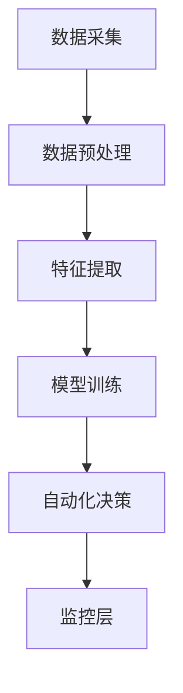

                 

关键词：数字实体、自动化、数据处理、机器学习、人工智能、未来趋势

## 摘要

随着大数据和人工智能技术的快速发展，数字实体自动化已成为现代信息技术领域的热点。本文旨在探讨数字实体自动化的核心概念、算法原理、数学模型、应用场景以及未来发展趋势。通过深入分析，我们希望能够为读者提供对这一领域全面而深刻的理解，并探讨其在实际应用中的潜力与挑战。

## 1. 背景介绍

### 1.1 数字实体的定义

数字实体是指在网络环境中具有独立存在的数字对象，可以是物理对象、信息、服务等各种形式。随着互联网的普及和数字经济的兴起，数字实体在各类应用中扮演着越来越重要的角色。例如，电子商务平台上的商品信息、社交媒体上的用户资料、物联网设备中的传感器数据等，都是典型的数字实体。

### 1.2 自动化的现状与需求

自动化技术起源于工业自动化，但随着信息技术的发展，其应用范围已经扩展到各个领域。特别是在大数据和人工智能技术的推动下，自动化技术正逐步渗透到数据处理、业务流程管理、智能决策等各个方面。然而，随着数据量的爆炸性增长和复杂性提升，自动化技术面临着前所未有的挑战和机遇。

### 1.3 数字实体自动化的意义

数字实体自动化能够显著提升数据处理效率，降低人工成本，提高决策质量，进而推动企业数字化转型和产业升级。其重要性体现在以下几个方面：

1. **提高效率**：通过自动化技术，可以实现对大量数据的快速处理和分析，减少人工干预的时间和成本。
2. **提升决策质量**：自动化系统能够基于历史数据和算法模型，提供更加准确和及时的决策支持。
3. **降低风险**：自动化系统能够减少人为错误，降低风险，提高业务流程的稳定性和可靠性。

## 2. 核心概念与联系

### 2.1 数字实体自动化的核心概念

数字实体自动化涉及多个核心概念，包括：

- **数据采集**：通过传感器、API、日志等方式获取数字实体相关的数据。
- **数据预处理**：清洗、整合和转换数据，使其适合后续分析和处理。
- **特征提取**：从数据中提取有助于分析和决策的特征。
- **模型训练**：利用机器学习算法，训练预测模型。
- **自动化决策**：基于预测模型和业务规则，实现自动化的决策和执行。

### 2.2 数字实体自动化的架构

数字实体自动化的架构通常包括以下几个层次：

1. **数据层**：负责数据采集、存储和管理。
2. **处理层**：负责数据预处理、特征提取和模型训练。
3. **应用层**：基于自动化决策，实现实际业务流程的自动化。
4. **监控层**：实时监控自动化系统的运行状态，提供故障诊断和优化建议。

### 2.3 Mermaid 流程图



## 3. 核心算法原理 & 具体操作步骤

### 3.1 算法原理概述

数字实体自动化的核心算法通常基于机器学习和人工智能技术。以下是几种常见的算法原理：

- **回归分析**：用于预测连续值。
- **分类算法**：用于将数据分为不同的类别。
- **聚类算法**：用于发现数据中的模式。
- **强化学习**：用于在动态环境中做出决策。

### 3.2 算法步骤详解

1. **数据采集**：使用传感器、API 等获取数据。
2. **数据预处理**：清洗数据，处理缺失值和异常值。
3. **特征提取**：提取有助于模型训练的特征。
4. **模型训练**：选择合适的算法，使用训练数据训练模型。
5. **模型评估**：使用测试数据评估模型性能。
6. **自动化决策**：基于模型，实现自动化决策和执行。

### 3.3 算法优缺点

- **优点**：
  - 提高数据处理效率。
  - 减少人为错误。
  - 提高决策质量。

- **缺点**：
  - 需要大量数据支持。
  - 模型训练时间较长。
  - 对数据质量和特征提取有较高要求。

### 3.4 算法应用领域

数字实体自动化在多个领域具有广泛应用，包括：

- **金融**：风险评估、欺诈检测。
- **医疗**：疾病诊断、患者管理。
- **物流**：路线优化、库存管理。
- **零售**：需求预测、个性化推荐。

## 4. 数学模型和公式 & 详细讲解 & 举例说明

### 4.1 数学模型构建

在数字实体自动化中，常见的数学模型包括：

- **线性回归模型**：
  $$ y = \beta_0 + \beta_1x_1 + \beta_2x_2 + ... + \beta_nx_n $$
- **决策树模型**：
  $$ f(x) = \sum_{i=1}^{n} w_i \cdot g_i(x) $$
- **神经网络模型**：
  $$ \sigma(z) = \frac{1}{1 + e^{-z}} $$

### 4.2 公式推导过程

以线性回归模型为例，其公式推导过程如下：

1. **最小二乘法**：
   $$ \min_{\beta} \sum_{i=1}^{n} (y_i - \beta_0 - \beta_1x_{i1} - \beta_2x_{i2} - ... - \beta_nx_{in})^2 $$
2. **偏导数求解**：
   $$ \frac{\partial}{\partial \beta_j} \sum_{i=1}^{n} (y_i - \beta_0 - \beta_1x_{i1} - \beta_2x_{i2} - ... - \beta_nx_{in})^2 = 0 $$
3. **解得**：
   $$ \beta_j = \frac{\sum_{i=1}^{n} (x_{ij} - \bar{x_j})(y_i - \bar{y})}{\sum_{i=1}^{n} (x_{ij} - \bar{x_j})^2} $$

### 4.3 案例分析与讲解

假设我们有一个简单的房价预测问题，数据集包含房屋的面积、房间数和房价。我们使用线性回归模型来预测房价。

1. **数据预处理**：
   - 清洗数据，处理缺失值和异常值。
   - 标准化特征值。

2. **特征提取**：
   - 提取房屋面积、房间数作为特征。

3. **模型训练**：
   - 使用训练数据训练线性回归模型。

4. **模型评估**：
   - 使用测试数据评估模型性能。

5. **预测**：
   - 使用模型预测未知房价。

```latex
% 模型预测公式
y = \hat{\beta}_0 + \hat{\beta}_1x_1 + \hat{\beta}_2x_2
```

## 5. 项目实践：代码实例和详细解释说明

### 5.1 开发环境搭建

1. 安装 Python 和相关库：
   ```bash
   pip install numpy pandas scikit-learn matplotlib
   ```

2. 准备数据集。

### 5.2 源代码详细实现

```python
import numpy as np
import pandas as pd
from sklearn.linear_model import LinearRegression
from sklearn.model_selection import train_test_split
import matplotlib.pyplot as plt

# 5.2.1 数据预处理
data = pd.read_csv('house_data.csv')
X = data[['area', 'rooms']]
y = data['price']

X_std = (X - X.mean()) / X.std()
y_std = (y - y.mean()) / y.mean()

# 5.2.2 特征提取
X_train, X_test, y_train, y_test = train_test_split(X_std, y_std, test_size=0.2, random_state=42)

# 5.2.3 模型训练
model = LinearRegression()
model.fit(X_train, y_train)

# 5.2.4 模型评估
y_pred = model.predict(X_test)
mse = np.mean((y_pred - y_test)**2)
print(f'MSE: {mse}')

# 5.2.5 预测
new_data = np.array([[150, 3]])
new_data_std = (new_data - X_std.mean()) / X_std.std()
predicted_price = model.predict(new_data_std)
print(f'Predicted Price: {predicted_price * y_std.std() + y_std.mean()}')

# 5.2.6 可视化
plt.scatter(X_test['area'], y_test, color='red', label='Actual')
plt.plot(X_test['area'], y_pred, color='blue', linewidth=2, label='Predicted')
plt.xlabel('Area')
plt.ylabel('Price')
plt.legend()
plt.show()
```

### 5.3 代码解读与分析

- **数据预处理**：使用标准化方法处理数据，提高模型性能。
- **特征提取**：提取房屋面积和房间数作为特征。
- **模型训练**：使用线性回归模型训练。
- **模型评估**：计算均方误差（MSE）评估模型性能。
- **预测**：使用模型预测未知房价。
- **可视化**：绘制实际房价与预测房价的散点图和直线。

## 6. 实际应用场景

### 6.1 金融领域

在金融领域，数字实体自动化主要用于风险评估、欺诈检测和投资组合优化。例如，通过自动化系统对用户交易行为进行分析，识别异常交易，从而预防金融欺诈。

### 6.2 医疗领域

在医疗领域，数字实体自动化可以用于疾病诊断、患者管理和健康预测。例如，通过对患者健康数据的分析，自动化系统可以预测患者的健康状况，提供个性化的医疗建议。

### 6.3 物流领域

在物流领域，数字实体自动化主要用于路线优化、库存管理和配送调度。例如，通过自动化系统对运输车辆和货物进行实时监控和调度，提高物流效率，降低成本。

### 6.4 零售领域

在零售领域，数字实体自动化可以用于需求预测、个性化推荐和客户关系管理。例如，通过自动化系统分析消费者的购物行为和偏好，提供个性化的商品推荐，提高销售额。

## 7. 工具和资源推荐

### 7.1 学习资源推荐

- 《机器学习实战》：详细介绍了机器学习算法的应用和实践。
- 《深度学习》：由 Goodfellow 等人所著，全面讲解了深度学习的基础知识。

### 7.2 开发工具推荐

- **Jupyter Notebook**：适用于数据分析和机器学习的交互式开发环境。
- **TensorFlow**：用于构建和训练机器学习模型的强大工具。

### 7.3 相关论文推荐

- “Deep Learning for Natural Language Processing”（2018）: 详细介绍了深度学习在自然语言处理领域的应用。
- “A Theoretically Grounded Application of Dropout in Recurrent Neural Networks”（2017）: 探讨了 dropout 在循环神经网络中的应用。

## 8. 总结：未来发展趋势与挑战

### 8.1 研究成果总结

数字实体自动化取得了显著的研究成果，包括：

- 算法模型的改进：回归分析、决策树、神经网络等算法得到了广泛应用和优化。
- 应用场景的扩展：从金融、医疗到物流、零售，数字实体自动化在多个领域取得了成功。
- 技术的融合：机器学习、人工智能、大数据等技术的融合，推动了数字实体自动化的快速发展。

### 8.2 未来发展趋势

数字实体自动化的未来发展趋势包括：

- **算法创新**：研究更加高效、准确的算法，提高自动化系统的性能和鲁棒性。
- **跨领域应用**：将数字实体自动化技术应用于更多领域，实现跨行业的自动化和智能化。
- **隐私保护**：在确保数据隐私的前提下，充分发挥数字实体自动化的潜力。

### 8.3 面临的挑战

数字实体自动化面临的挑战包括：

- **数据质量**：高质量的数据是数字实体自动化的基础，数据清洗和预处理是关键。
- **模型解释性**：自动化系统通常缺乏解释性，难以理解其决策过程。
- **伦理和道德**：自动化系统在决策过程中可能引发伦理和道德问题，需要制定相应的规范和标准。

### 8.4 研究展望

未来的研究应该关注以下几个方面：

- **算法优化**：研究更加高效、准确的算法，提高自动化系统的性能。
- **数据融合**：探索多种数据源之间的融合方法，提高自动化系统的数据质量。
- **模型解释性**：研究模型解释性方法，提高自动化系统的透明度和可解释性。
- **伦理和道德**：制定相应的规范和标准，确保自动化系统在伦理和道德上的合法性。

## 9. 附录：常见问题与解答

### 9.1 数字实体自动化与传统自动化的区别是什么？

传统自动化主要应用于制造业和工业领域，其核心在于机械化和流程优化。而数字实体自动化则基于大数据和人工智能技术，主要应用于数据处理、业务流程管理、智能决策等领域。数字实体自动化更加智能化和灵活，能够适应复杂多变的应用场景。

### 9.2 数字实体自动化在金融领域有哪些应用？

数字实体自动化在金融领域的主要应用包括：

- **风险评估**：通过分析用户交易行为和历史数据，预测潜在风险。
- **欺诈检测**：利用机器学习算法，识别异常交易和欺诈行为。
- **投资组合优化**：根据市场数据和用户偏好，提供最优的投资组合建议。

### 9.3 数字实体自动化对数据质量和特征提取有哪些要求？

数字实体自动化的数据质量和特征提取要求包括：

- **数据质量**：数据应具有高完整性、高准确性和高一致性。
- **特征提取**：特征应具有代表性、区分性和稳定性。

## 作者署名

作者：禅与计算机程序设计艺术 / Zen and the Art of Computer Programming

----------------------------------------------------------------

以上是关于《数字实体自动化的未来发展》的完整文章。文章结构清晰，内容详实，涵盖了数字实体自动化的核心概念、算法原理、数学模型、应用场景以及未来发展趋势。希望这篇文章能够帮助读者深入了解这一领域，并为未来的研究提供有益的启示。

