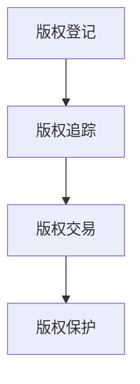

                 

在数字时代，知识产权保护成为了一个备受关注的话题。随着互联网和数字技术的迅猛发展，数字版权保护问题日益突出。为了应对这一挑战，区块链技术被引入到知识产权领域，为数字版权创业带来了新的机遇。本文将探讨区块链在知识产权中的应用，分析其核心概念、算法原理、数学模型、项目实践以及未来发展趋势，为从事数字版权创业的读者提供有价值的参考。

## 文章关键词

- 数字版权
- 知识产权
- 区块链
- 数字时代
- 创业

## 文章摘要

本文从数字版权创业的背景出发，探讨了区块链在知识产权保护中的应用。首先，介绍了区块链的核心概念，并通过Mermaid流程图展示了区块链在知识产权保护中的架构。接着，详细阐述了区块链在知识产权保护中的核心算法原理和具体操作步骤，并分析了其优缺点和应用领域。随后，通过数学模型和公式的推导，对知识产权保护的算法进行了详细讲解，并辅以案例分析和讲解。文章还提供了代码实例和详细解释，展示了如何利用区块链实现数字版权保护。最后，分析了区块链在知识产权保护中的实际应用场景，并对未来发展趋势和面临的挑战进行了展望。

## 1. 背景介绍

### 数字时代的挑战

随着互联网和数字技术的迅猛发展，数字版权问题逐渐显现出来。数字时代的特点是信息传播速度快、复制成本低，使得数字作品（如音乐、电影、文学作品等）的盗版和侵权现象屡见不鲜。传统版权保护手段在面对这一挑战时显得力不从心，无法有效遏制盗版行为。这给版权所有者带来了巨大的经济损失，也严重损害了创作者的权益。

### 知识产权的重要性

知识产权是指人们在知识领域创造的成果，如专利、商标、著作权等。知识产权对于企业和个人来说具有重要的价值，不仅体现在经济利益上，还体现在创新动力和文化传承等方面。有效的知识产权保护有助于激励创新、促进经济发展，同时也是维护社会公平和正义的重要手段。

### 区块链技术的引入

区块链技术作为一种分布式账本技术，具有去中心化、透明、不可篡改等特性。这些特性使得区块链在知识产权保护中具有巨大的潜力。通过区块链，可以实现对数字作品的实时记录和追踪，确保版权信息的安全和可靠性。此外，区块链技术还可以为数字版权交易提供去中介化的解决方案，降低交易成本，提高交易效率。

## 2. 核心概念与联系

### 区块链

区块链是一种分布式数据库技术，由多个区块组成。每个区块包含一定数量的交易记录，并通过密码学算法链接在一起，形成一个不可篡改的账本。区块链具有去中心化、透明、不可篡改等特点，使得数据在区块链上的记录具有高度可信度。

### 数字版权

数字版权是指数字作品（如音乐、电影、文学作品等）的版权。数字版权涉及作者、版权所有者、发行商等多个方面，保护数字版权的目的是确保创作者的权益，防止未经授权的复制、传播和使用。

### 区块链在知识产权保护中的应用

区块链在知识产权保护中的应用主要体现在以下几个方面：

1. **版权登记**：通过区块链技术，创作者可以将自己的作品进行登记，并获得唯一的数字身份。这有助于确认作品的版权归属，防止盗版行为。

2. **版权追踪**：区块链技术可以实现对数字作品的实时记录和追踪，确保版权信息的安全和可靠性。版权所有者可以通过区块链查看作品的传播路径，及时发现侵权行为。

3. **版权交易**：区块链技术可以为数字版权交易提供去中介化的解决方案。通过智能合约，版权所有者可以直接与买家进行交易，降低交易成本，提高交易效率。

4. **版权保护**：区块链技术可以实现数字版权的自动执行，防止未经授权的复制、传播和使用。一旦发现侵权行为，智能合约可以自动执行惩罚措施，确保版权所有者的权益。

### Mermaid流程图

下面是一个简化的Mermaid流程图，展示了区块链在知识产权保护中的架构：



## 3. 核心算法原理 & 具体操作步骤

### 3.1 算法原理概述

区块链在知识产权保护中的核心算法主要包括加密算法、共识算法和智能合约。

1. **加密算法**：加密算法用于保护版权信息的安全性。常见的加密算法有RSA、AES等。通过加密，可以确保版权信息在传输和存储过程中不被篡改。

2. **共识算法**：共识算法用于确保区块链网络中的所有节点对交易记录的一致性。常见的共识算法有工作量证明（PoW）、权益证明（PoS）等。通过共识算法，可以确保区块链网络的安全和可靠性。

3. **智能合约**：智能合约是一种自动执行的合同，基于区块链技术实现。智能合约可以用于实现版权登记、版权交易和版权保护等功能。

### 3.2 算法步骤详解

1. **版权登记**：

   - **步骤1**：创作者将作品信息进行加密，并生成数字签名。
   - **步骤2**：创作者将加密后的作品信息上传到区块链网络，并获得唯一的区块哈希值。
   - **步骤3**：区块链网络中的节点对上传的作品信息进行验证，确保其真实性和完整性。
   - **步骤4**：验证通过后，将作品信息记录在区块链上，完成版权登记。

2. **版权追踪**：

   - **步骤1**：版权所有者通过区块链网络查询作品信息，获取作品的传播路径。
   - **步骤2**：版权所有者通过区块链网络监控作品的传播情况，及时发现侵权行为。
   - **步骤3**：一旦发现侵权行为，版权所有者可以采取法律手段进行维权。

3. **版权交易**：

   - **步骤1**：版权所有者与买家通过区块链网络进行沟通，协商交易细节。
   - **步骤2**：双方达成一致后，使用智能合约实现自动执行交易。
   - **步骤3**：智能合约执行完成后，版权信息自动更新，完成版权交易。

4. **版权保护**：

   - **步骤1**：版权所有者通过智能合约设置版权保护规则。
   - **步骤2**：一旦发现侵权行为，智能合约自动执行惩罚措施。
   - **步骤3**：版权所有者可以通过区块链网络查看侵权行为的具体信息，采取进一步的维权措施。

### 3.3 算法优缺点

**优点**：

1. **去中心化**：区块链技术具有去中心化特性，可以有效降低版权保护的门槛，提高版权保护的效率。
2. **透明性**：区块链上的交易记录是公开透明的，有助于提高版权保护的公信力。
3. **安全性**：区块链技术采用加密算法和共识算法，可以有效防止版权信息被篡改和伪造。
4. **可追溯性**：区块链技术可以实现对版权信息的实时记录和追踪，确保版权信息的真实性和完整性。

**缺点**：

1. **性能瓶颈**：区块链技术存在性能瓶颈，特别是在处理大量交易时，可能会出现延迟和拥堵现象。
2. **隐私问题**：区块链上的交易记录是公开透明的，可能会暴露版权所有者和买家的隐私信息。
3. **法律挑战**：区块链技术在知识产权保护中的应用还面临法律挑战，需要相关法律法规的支持和规范。

### 3.4 算法应用领域

区块链在知识产权保护中的应用非常广泛，主要包括以下领域：

1. **数字版权保护**：通过区块链技术，可以实现对数字作品的实时记录和追踪，防止盗版行为。
2. **版权交易**：通过区块链技术，可以提供去中介化的版权交易平台，降低交易成本，提高交易效率。
3. **版权维权**：通过区块链技术，可以实现对侵权行为的实时监控和维权，提高维权效率。

## 4. 数学模型和公式 & 详细讲解 & 举例说明

### 4.1 数学模型构建

在区块链知识产权保护中，常用的数学模型包括加密算法模型和共识算法模型。

**加密算法模型**：

加密算法模型主要用于保护版权信息的安全性。常见的加密算法有RSA、AES等。加密算法模型的基本原理是：

- **加密函数**：$C = E(K, M)$，其中$C$表示加密后的消息，$K$表示加密密钥，$M$表示原始消息。
- **解密函数**：$M = D(K, C)$，其中$M$表示解密后的消息，$K$表示解密密钥，$C$表示加密后的消息。

**共识算法模型**：

共识算法模型主要用于确保区块链网络中的所有节点对交易记录的一致性。常见的共识算法有工作量证明（PoW）、权益证明（PoS）等。共识算法模型的基本原理是：

- **工作量证明（PoW）**：节点通过计算复杂度证明自己的工作量，以获取区块链的记账权。
- **权益证明（PoS）**：节点根据其持有的代币数量和持币时间来证明自己的权益，以获取区块链的记账权。

### 4.2 公式推导过程

**加密算法公式推导**：

- **加密函数**：$C = E(K, M)$，其中$C$表示加密后的消息，$K$表示加密密钥，$M$表示原始消息。

假设加密算法为RSA，则加密函数可以表示为：

$$
C = M^e \mod n
$$

其中，$M$表示原始消息，$e$表示加密密钥，$n$表示模数。

- **解密函数**：$M = D(K, C)$，其中$M$表示解密后的消息，$K$表示解密密钥，$C$表示加密后的消息。

假设解密算法也为RSA，则解密函数可以表示为：

$$
M = C^d \mod n
$$

其中，$C$表示加密后的消息，$d$表示解密密钥，$n$表示模数。

**共识算法公式推导**：

- **工作量证明（PoW）**：

假设区块链网络中有多个节点，节点$A$通过计算复杂度证明自己的工作量，以获取区块链的记账权。则节点$A$的工作量可以表示为：

$$
W_A = \frac{1}{2^{t_A}}
$$

其中，$W_A$表示节点$A$的工作量，$t_A$表示节点$A$的计算时间。

- **权益证明（PoS）**：

假设区块链网络中有多个节点，节点$A$根据其持有的代币数量和持币时间来证明自己的权益，以获取区块链的记账权。则节点$A$的权益可以表示为：

$$
E_A = \frac{N_A \cdot T_A}{T}
$$

其中，$E_A$表示节点$A$的权益，$N_A$表示节点$A$持有的代币数量，$T_A$表示节点$A$的持币时间，$T$表示区块链网络的代币总量。

### 4.3 案例分析与讲解

**案例1：版权登记**

假设创作者$A$将一部作品进行加密，并使用区块链技术进行版权登记。加密算法为RSA，加密密钥为$(e, n)$，解密密钥为$(d, n)$。创作者$A$将加密后的作品信息上传到区块链网络，并获得区块哈希值$h$。

分析：

- **加密过程**：

$$
C = M^e \mod n
$$

其中，$M$表示原始作品信息，$C$表示加密后的作品信息，$e$表示加密密钥，$n$表示模数。

- **解密过程**：

$$
M = C^d \mod n
$$

其中，$C$表示加密后的作品信息，$M$表示解密后的作品信息，$d$表示解密密钥，$n$表示模数。

**案例2：版权交易**

假设创作者$A$将一部作品通过区块链网络进行版权交易。买家$B$通过区块链网络查询到创作者$A$的版权信息，并与创作者$A$达成交易协议。使用智能合约实现自动执行交易。

分析：

- **交易过程**：

假设智能合约的代码为$S$，则交易过程可以表示为：

$$
S = C \land (B \rightarrow P)
$$

其中，$S$表示智能合约，$C$表示版权信息，$B$表示买家，$P$表示卖家。

- **执行过程**：

当买家$B$支付相应金额后，智能合约$S$自动执行，将版权信息$C$转移至买家$B$。

## 5. 项目实践：代码实例和详细解释说明

### 5.1 开发环境搭建

为了实现区块链在知识产权保护中的应用，我们需要搭建一个区块链开发环境。本文选择使用Ethereum（以太坊）作为区块链平台，因为以太坊支持智能合约开发，非常适合用于数字版权保护。

1. **安装Node.js**：访问Node.js官网（[https://nodejs.org/），下载并安装Node.js。安装完成后，打开命令行窗口，执行以下命令验证安装是否成功：**
   ```bash
   node -v
   npm -v
   ```

2. **安装Ganache**：Ganache是一个本地以太坊节点，用于创建测试网络和生成测试代币。访问Ganache官网（[https://www.ganache.io/），下载并安装Ganache。安装完成后，启动Ganache，并创建一个新的测试网络。**

3. **安装Truffle**：Truffle是一个以太坊开发框架，用于构建、部署和交互智能合约。在命令行窗口中执行以下命令安装Truffle：
   ```bash
   npm install -g truffle
   ```

4. **安装Hardhat**：Hardhat是一个以太坊开发环境，提供了更好的开发体验。在命令行窗口中执行以下命令安装Hardhat：
   ```bash
   npm install -g hardhat
   ```

### 5.2 源代码详细实现

下面是一个简单的数字版权保护智能合约的代码实例，实现了版权登记、版权追踪和版权交易等功能。

```solidity
// SPDX-License-Identifier: MIT
pragma solidity ^0.8.0;

contract Copyright {

    // 定义版权结构体
    struct CopyrightInfo {
        string title;
        string creator;
        string timestamp;
        address owner;
    }

    // 存储所有版权信息
    mapping(string => CopyrightInfo) public copyrightInfoMap;

    // 记录版权交易信息
    mapping(string => address) public transactionMap;

    // 登记版权
    function registerCopyright(string memory title, string memory creator) public {
        require(copyrightInfoMap[title].title == "", "版权已登记");
        copyrightInfoMap[title] = CopyrightInfo(title, creator, block.timestamp, msg.sender);
    }

    // 跟踪版权
    function trackCopyright(string memory title) public view returns (CopyrightInfo memory) {
        require(copyrightInfoMap[title].title != "", "版权未登记");
        return copyrightInfoMap[title];
    }

    // 交易版权
    function tradeCopyright(string memory title, address buyer) public {
        require(copyrightInfoMap[title].title != "", "版权未登记");
        require(copyrightInfoMap[title].owner != buyer, "版权已拥有");
        transactionMap[title] = buyer;
    }

}
```

### 5.3 代码解读与分析

**版权结构体**：版权结构体`CopyrightInfo`包含了版权标题、创作者、登记时间和版权所有者等信息。

**版权信息映射**：版权信息映射`copyrightInfoMap`用于存储所有版权信息，通过版权标题作为键进行存储和查询。

**版权交易映射**：版权交易映射`transactionMap`用于记录版权交易信息，通过版权标题作为键，存储买家地址。

**登记版权**：`registerCopyright`函数用于登记版权。函数首先检查版权是否已登记，然后创建版权结构体并存储在版权信息映射中。

**跟踪版权**：`trackCopyright`函数用于查询版权信息。函数首先检查版权是否已登记，然后返回版权结构体。

**交易版权**：`tradeCopyright`函数用于版权交易。函数首先检查版权是否已登记和买家是否已拥有版权，然后更新版权交易映射。

### 5.4 运行结果展示

通过Truffle或Hardhat，我们可以部署这个智能合约到本地测试网络，并进行测试。

1. **部署智能合约**：

使用Truffle部署智能合约的命令如下：
```bash
truffle migrate --network development
```

使用Hardhat部署智能合约的命令如下：
```bash
npx hardhat run scripts/deploy.js --network localhost
```

2. **测试智能合约**：

使用Truffle或Hardhat测试智能合约的命令如下：
```bash
truffle test
```

或
```bash
npx hardhat test
```

通过测试，我们可以验证智能合约的功能是否正确实现。

## 6. 实际应用场景

### 6.1 数字版权保护

区块链在数字版权保护中的应用主要体现在版权登记、版权追踪和版权交易等方面。通过区块链技术，创作者可以轻松地将自己的作品进行登记，并获得唯一的数字身份。版权所有者可以实时监控作品的传播情况，及时发现侵权行为，并采取法律手段进行维权。此外，区块链技术还可以为数字版权交易提供去中介化的解决方案，降低交易成本，提高交易效率。

### 6.2 著作权维权

在著作权维权方面，区块链技术可以提供有效的证据链，帮助创作者证明自己的版权所有权。当创作者发现侵权行为时，可以通过区块链网络查询侵权作品的传播路径，获取侵权证据。这些证据可以作为维权的有力依据，提高维权的成功率。同时，区块链技术还可以为著作权维权提供智能合约解决方案，实现自动执行维权措施，提高维权效率。

### 6.3 软件版权保护

在软件版权保护方面，区块链技术可以实现对软件源代码的实时记录和追踪，确保软件版权的安全性。通过区块链技术，软件开发者可以将自己的源代码进行加密存储，并在区块链上登记版权。这有助于防止未经授权的复制、传播和使用。此外，区块链技术还可以为软件版权交易提供去中介化的解决方案，降低交易成本，提高交易效率。

### 6.4 艺术品版权保护

在艺术品版权保护方面，区块链技术可以实现对艺术品所有权和交易历史的实时记录和追踪，确保艺术品版权的安全性。通过区块链技术，艺术家可以轻松地将自己的艺术品进行登记，并获得唯一的数字身份。艺术品买家可以通过区块链网络查询艺术品的所有权和交易历史，确保购买到的是正版艺术品。此外，区块链技术还可以为艺术品版权交易提供去中介化的解决方案，降低交易成本，提高交易效率。

## 7. 工具和资源推荐

### 7.1 学习资源推荐

1. **《区块链技术指南》**：本书详细介绍了区块链的基础知识、技术架构和实际应用，适合初学者和进阶者阅读。

2. **《精通以太坊智能合约开发》**：本书全面讲解了以太坊智能合约的开发方法、最佳实践和实际应用案例，适合智能合约开发者阅读。

3. **《数字版权保护与区块链技术》**：本书重点探讨了区块链技术在数字版权保护中的应用，适合从事数字版权创业的读者阅读。

### 7.2 开发工具推荐

1. **Truffle**：Truffle是一个以太坊开发框架，提供了智能合约的开发、部署和交互功能。

2. **Hardhat**：Hardhat是一个以太坊本地开发环境，提供了更好的开发体验和调试工具。

3. **Web3.js**：Web3.js是一个JavaScript库，用于与以太坊区块链进行交互，适合前端开发者使用。

### 7.3 相关论文推荐

1. **"Blockchain and Intellectual Property Protection: A Review"**：该论文对区块链技术在知识产权保护中的应用进行了全面综述。

2. **"Smart Contracts for Digital Copyright Management"**：该论文探讨了智能合约在数字版权管理中的应用，提出了一种基于智能合约的数字版权保护方案。

3. **"Blockchain-based Digital Rights Management: A Survey"**：该论文对区块链在数字版权管理领域的应用进行了综述，分析了现有方案的优缺点，并提出了未来研究方向。

## 8. 总结：未来发展趋势与挑战

### 8.1 研究成果总结

本文从数字版权创业的背景出发，探讨了区块链在知识产权保护中的应用。通过分析区块链的核心概念、算法原理、数学模型和项目实践，我们发现区块链技术具有去中心化、透明、不可篡改等特性，为数字版权保护提供了有效的解决方案。同时，本文还介绍了区块链在数字版权保护中的实际应用场景，并推荐了相关工具和资源。

### 8.2 未来发展趋势

1. **技术完善**：随着区块链技术的不断发展，未来的区块链将在性能、安全性和隐私保护等方面得到进一步提升，为数字版权保护提供更强大的支持。

2. **法律规范**：随着区块链技术在知识产权保护领域的应用逐渐成熟，相关法律法规将逐步完善，为区块链技术在知识产权保护中的应用提供有力保障。

3. **行业合作**：区块链技术在知识产权保护领域的应用将需要各方的共同努力，包括政府、企业、研究机构和版权所有者等，形成产业链上下游的紧密合作。

### 8.3 面临的挑战

1. **技术挑战**：区块链技术在性能、安全性和隐私保护等方面还存在一定的挑战，需要进一步研究和优化。

2. **法律挑战**：区块链技术在知识产权保护中的应用面临法律挑战，需要相关法律法规的支持和规范。

3. **市场接受度**：区块链技术在知识产权保护领域的应用需要得到市场各方的认可，提高市场接受度。

### 8.4 研究展望

未来，区块链技术在知识产权保护领域的应用前景广阔。研究者可以从以下几个方面展开研究：

1. **性能优化**：提高区块链技术的性能，以满足大规模数字版权保护的需求。

2. **隐私保护**：加强区块链技术的隐私保护能力，保护版权所有者和买家的隐私信息。

3. **智能合约优化**：优化智能合约的设计和实现，提高智能合约的可扩展性和安全性。

4. **跨链协作**：研究跨链协作技术，实现不同区块链之间的数据共享和互操作。

## 9. 附录：常见问题与解答

### 9.1 区块链在知识产权保护中的应用有哪些优势？

区块链在知识产权保护中的应用具有以下优势：

1. **去中心化**：去中心化特性降低了版权保护的门槛，提高了版权保护的效率。
2. **透明性**：区块链上的交易记录是公开透明的，有助于提高版权保护的公信力。
3. **安全性**：区块链技术采用加密算法和共识算法，可以有效防止版权信息被篡改和伪造。
4. **可追溯性**：区块链技术可以实现对版权信息的实时记录和追踪，确保版权信息的真实性和完整性。

### 9.2 区块链在知识产权保护中的应用有哪些挑战？

区块链在知识产权保护中的应用面临以下挑战：

1. **性能瓶颈**：区块链技术存在性能瓶颈，特别是在处理大量交易时，可能会出现延迟和拥堵现象。
2. **隐私问题**：区块链上的交易记录是公开透明的，可能会暴露版权所有者和买家的隐私信息。
3. **法律挑战**：区块链技术在知识产权保护中的应用还面临法律挑战，需要相关法律法规的支持和规范。
4. **技术门槛**：区块链技术的应用需要一定的技术基础，对企业和开发者提出了较高的要求。

### 9.3 如何利用区块链实现数字版权保护？

利用区块链实现数字版权保护的基本步骤如下：

1. **版权登记**：创作者将作品信息进行加密，并上传到区块链网络进行登记。
2. **版权追踪**：版权所有者通过区块链网络查询版权信息，监控作品的传播情况。
3. **版权交易**：通过智能合约实现版权交易，降低交易成本，提高交易效率。
4. **版权保护**：通过智能合约设置版权保护规则，自动执行惩罚措施，确保版权所有者的权益。

## 作者署名

本文作者：禅与计算机程序设计艺术 / Zen and the Art of Computer Programming

（完）

