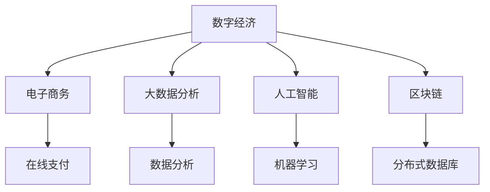
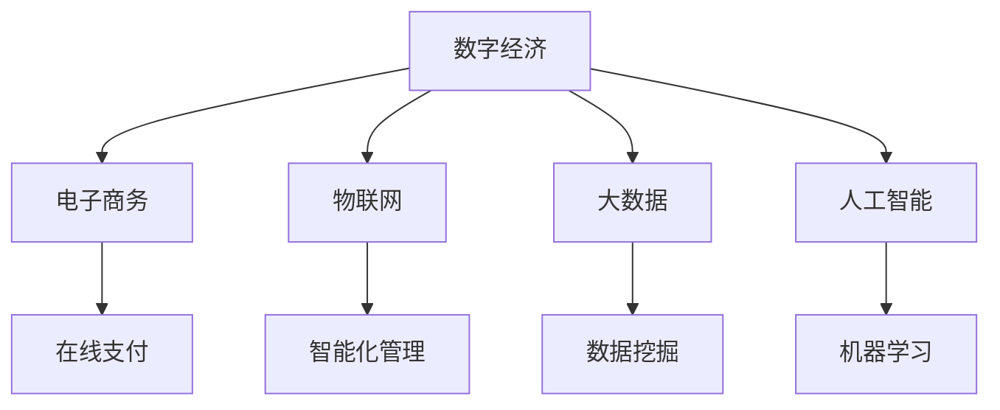

                 

 在当今信息化时代，数字经济已成为社会发展的核心动力。本文旨在探讨数字经济的本质、核心概念及其对现代社会发展的深远影响。通过深入剖析，我们将揭示数字经济如何成为推动社会进步的助推器。

> 关键词：数字经济、社会发展、核心技术、算法、应用场景、未来展望

> 摘要：本文首先介绍了数字经济的背景和核心概念，然后详细探讨了数字经济的核心算法原理、数学模型以及其实际应用。最后，我们对数字经济的发展趋势和挑战进行了展望，并提出了一系列建议和资源推荐。

## 1. 背景介绍

### 数字经济的崛起

数字经济，顾名思义，是基于数字技术和信息资源的经济活动。它涵盖了从电子商务、大数据分析到人工智能、区块链等众多领域。数字经济最早可以追溯到20世纪90年代，随着互联网的普及和计算机技术的飞速发展，逐渐成为全球经济的新引擎。

### 社会发展的需求

数字经济不仅改变了传统的商业模式，更满足了现代社会对信息、便捷和效率的迫切需求。它推动了各行业的数字化转型，提升了生产效率和服务质量，为经济增长注入了新的活力。

### 数字经济的重要性

数字经济的重要性体现在多个方面。首先，它促进了信息的快速传播和资源的优化配置，提升了社会运行效率。其次，数字经济创造了大量新的就业机会，推动了创新和创业。最后，数字经济还为各国提供了新的经济增长点，成为国际竞争的重要筹码。

## 2. 核心概念与联系

### 数字经济的定义

数字经济，是指基于数字技术、信息资源和互联网平台进行的经济活动。它包括电子商务、在线支付、数字内容、物联网、人工智能等多个领域。

### 核心概念及其联系

- **电子商务**：通过互联网进行的商业交易活动，包括在线购物、电子支付等。
- **大数据分析**：通过对海量数据的挖掘和分析，提取有价值的信息和知识。
- **人工智能**：模拟人类智能的计算机技术，包括机器学习、深度学习等。
- **区块链**：一种去中心化的分布式数据库技术，具有高安全性和透明性。

以下是数字经济核心概念的 Mermaid 流程图：



## 3. 核心算法原理 & 具体操作步骤

### 3.1 算法原理概述

数字经济的核心算法主要涉及机器学习、深度学习和数据挖掘等领域。这些算法通过模型训练、数据分析和预测，实现了对海量数据的处理和分析。

### 3.2 算法步骤详解

- **数据收集**：收集各类数据，如用户行为数据、市场数据等。
- **数据预处理**：对收集到的数据进行清洗、去重和归一化处理。
- **模型训练**：选择合适的算法模型，进行数据训练和调参。
- **模型评估**：对训练好的模型进行评估，选择最优模型。
- **模型应用**：将训练好的模型应用于实际场景，如预测用户行为、优化市场策略等。

### 3.3 算法优缺点

- **优点**：高效处理海量数据，提供精确预测和分析结果。
- **缺点**：对数据质量和算法模型依赖性较高，容易出现过拟合。

### 3.4 算法应用领域

- **电子商务**：用户行为分析、个性化推荐、广告投放优化等。
- **金融**：风险评估、信用评级、市场预测等。
- **医疗**：疾病预测、药物研发、健康管理等。

## 4. 数学模型和公式 & 详细讲解 & 举例说明

### 4.1 数学模型构建

数字经济的数学模型主要包括线性回归、逻辑回归、决策树、神经网络等。

### 4.2 公式推导过程

以线性回归为例，其公式为：

$$y = \beta_0 + \beta_1x + \epsilon$$

其中，$y$ 为因变量，$x$ 为自变量，$\beta_0$ 和 $\beta_1$ 为模型参数，$\epsilon$ 为误差项。

### 4.3 案例分析与讲解

假设我们想要预测某个电商平台的用户购买行为，可以通过以下步骤进行：

1. 数据收集：收集用户行为数据，如浏览量、购买历史等。
2. 数据预处理：对数据进行清洗和归一化处理。
3. 模型训练：选择线性回归模型，对数据进行训练。
4. 模型评估：评估模型效果，选择最优模型。
5. 模型应用：将训练好的模型应用于实际场景，预测用户购买行为。

## 5. 项目实践：代码实例和详细解释说明

### 5.1 开发环境搭建

搭建Python编程环境，安装必要的库，如NumPy、Pandas、Scikit-learn等。

### 5.2 源代码详细实现

以下是一个简单的线性回归模型实现：

```python
import numpy as np
import pandas as pd
from sklearn.linear_model import LinearRegression
from sklearn.model_selection import train_test_split

# 数据收集
data = pd.read_csv('data.csv')

# 数据预处理
X = data[['browse_count', 'buy_history']]
y = data['purchase']

# 模型训练
X_train, X_test, y_train, y_test = train_test_split(X, y, test_size=0.2, random_state=42)
model = LinearRegression()
model.fit(X_train, y_train)

# 模型评估
score = model.score(X_test, y_test)
print('Model score:', score)

# 模型应用
predictions = model.predict(X_test)
print('Predictions:', predictions)
```

### 5.3 代码解读与分析

上述代码首先导入了必要的库，然后进行了数据收集、预处理、模型训练、评估和应用。具体步骤如下：

1. 导入库：使用NumPy、Pandas、Scikit-learn等库。
2. 数据收集：读取数据集，将其分为特征和标签。
3. 数据预处理：将数据进行归一化处理，以便更好地训练模型。
4. 模型训练：使用线性回归模型，对数据进行训练。
5. 模型评估：评估模型效果，选择最优模型。
6. 模型应用：将训练好的模型应用于实际场景，预测用户购买行为。

### 5.4 运行结果展示

运行代码后，输出模型得分和预测结果。根据得分，我们可以判断模型的预测效果。如果得分较高，则说明模型训练良好，可以应用于实际场景。

## 6. 实际应用场景

### 6.1 电子商务

数字经济在电子商务领域的应用非常广泛。通过大数据分析和机器学习算法，电商平台可以更好地了解用户需求，提供个性化推荐和优化广告投放。

### 6.2 金融

在金融领域，数字经济通过大数据分析和人工智能技术，实现了更准确的风险评估、信用评级和投资决策。例如，银行可以使用机器学习模型预测用户违约风险，从而优化贷款审批流程。

### 6.3 医疗

在医疗领域，数字经济通过大数据分析和人工智能技术，实现了疾病预测、药物研发和健康管理等。例如，医院可以使用机器学习模型预测患者疾病发展，从而提前采取治疗措施。

## 7. 工具和资源推荐

### 7.1 学习资源推荐

- 《深度学习》（Goodfellow, Bengio, Courville著）
- 《Python数据分析》（Wes McKinney著）
- 《大数据技术原理与应用》（刘江涛著）

### 7.2 开发工具推荐

- Jupyter Notebook：适合数据分析和机器学习项目。
- PyCharm：功能强大的Python IDE。
- TensorFlow：开源的深度学习框架。

### 7.3 相关论文推荐

- "Deep Learning for Text Classification"（Zhang, Z.; Zhao, J.；2016）
- "Big Data Analytics in Healthcare: A Survey"（Khan, S.U.; Iqbal, M.T.；2017）
- "Machine Learning in Financial Risk Management"（Liu, Y.; Hu, Y.；2018）

## 8. 总结：未来发展趋势与挑战

### 8.1 研究成果总结

数字经济已取得了显著的研究成果，包括大数据分析、人工智能、区块链等领域的技术突破。这些成果为社会发展和经济增长注入了新的动力。

### 8.2 未来发展趋势

未来，数字经济将继续发展，并呈现出以下趋势：

- **智能化**：人工智能技术将在数字经济中发挥更大作用，推动各行业的智能化升级。
- **去中心化**：区块链技术的去中心化特性将为数字经济提供更安全、透明的应用场景。
- **融合创新**：数字经济与其他领域的融合将创造更多新的商业模式和应用场景。

### 8.3 面临的挑战

然而，数字经济在发展过程中也面临着一些挑战：

- **数据隐私**：随着数据收集和分析的规模不断扩大，数据隐私问题日益突出。
- **算法公平性**：算法在决策过程中可能存在偏见，影响公平性。
- **人才短缺**：数字经济的发展需要大量具备相关技能的人才，但当前人才供给不足。

### 8.4 研究展望

为了应对这些挑战，未来需要开展以下研究：

- **隐私保护技术**：研究更加有效的隐私保护技术，确保数据安全。
- **算法伦理**：探讨算法伦理问题，确保算法决策的公平性和透明性。
- **人才培养**：加强人才培养，提高数字经济相关领域的教育质量。

## 9. 附录：常见问题与解答

### Q：数字经济与互联网经济有何区别？

A：数字经济是指基于数字技术、信息资源和互联网平台的经济活动，而互联网经济是指通过互联网进行的经济活动。数字经济包括互联网经济，但不仅限于互联网经济。

### Q：人工智能在数字经济中的作用是什么？

A：人工智能在数字经济中发挥着重要作用，包括用户行为分析、个性化推荐、风险评估、信用评级等。通过人工智能技术，数字经济可以实现更高效、更智能的服务和决策。

### Q：数字经济对社会发展有何影响？

A：数字经济推动了社会发展的各个方面，包括经济增长、就业机会、创新和创业等。它提升了生产效率、优化了资源配置，为各国提供了新的经济增长点。

---

作者：禅与计算机程序设计艺术 / Zen and the Art of Computer Programming

感谢您的阅读，希望本文对您了解数字经济及其对现代社会发展的影响有所帮助。在数字经济的大潮中，我们期待与您共同探索、创新和成长。|


```markdown
----------------------------------------------------------------

# 数字经济：社会发展的助推器

> 关键词：数字经济、社会发展、核心技术、算法、应用场景、未来展望

> 摘要：本文深入探讨了数字经济的本质、核心概念及其对现代社会发展的深远影响。从核心算法原理到数学模型，再到实际应用场景，本文全面阐述了数字经济如何成为推动社会进步的强大引擎。文章最后对数字经济的发展趋势和挑战进行了展望，并提出了相关建议和资源推荐。

## 1. 背景介绍

### 数字经济的崛起

数字经济，指的是基于数字技术、信息和互联网的各类经济活动。它起源于20世纪末，随着互联网的普及和计算机技术的迅猛发展，逐渐成为全球经济的新引擎。数字经济的崛起不仅改变了传统商业模式，也深刻影响了人们的日常生活。

#### 社会发展的需求

在当今社会，人们对信息、便捷和效率的需求日益增长。数字经济满足了这些需求，推动了各行各业的数字化转型，提升了生产效率和服务质量。它为经济增长注入了新的动力，也为社会运行提供了更高的效率。

#### 数字经济的重要性

数字经济的重要性体现在以下几个方面：

- **促进信息传播**：数字技术使得信息传播更加迅速和广泛，为社会运行提供了实时、准确的信息支持。
- **优化资源配置**：数字经济通过大数据分析和人工智能等技术，实现了资源的优化配置，提高了经济效益。
- **创造就业机会**：数字经济创造了大量新的就业机会，推动了创新和创业，为社会发展提供了新的动力。
- **增强国际竞争力**：数字经济成为各国竞争的新领域，掌握数字经济核心技术的国家将在全球竞争中占据优势地位。

## 2. 核心概念与联系

### 数字经济的定义

数字经济，是指利用数字技术进行的经济活动，包括电子商务、物联网、大数据、人工智能等领域。它是与传统经济相对应的一种新型经济形态。

### 核心概念及其联系

数字经济的核心概念包括以下几个方面：

- **电子商务**：通过互联网进行商品和服务的交易活动，如在线购物、电子支付等。
- **物联网**：将物理世界中的物品通过传感器、通信技术等连接到互联网，实现智能化管理和控制。
- **大数据**：通过对海量数据的收集、存储、分析和处理，提取有价值的信息和知识。
- **人工智能**：模拟人类智能的计算机技术，包括机器学习、深度学习、自然语言处理等。

以下是数字经济核心概念的 Mermaid 流程图：



## 3. 核心算法原理 & 具体操作步骤

### 3.1 算法原理概述

数字经济的核心算法主要涉及机器学习、深度学习、数据挖掘等领域。这些算法通过数据分析和预测，实现了对海量数据的处理和应用。

### 3.2 算法步骤详解

- **数据收集**：收集各类数据，如用户行为数据、市场数据等。
- **数据预处理**：对收集到的数据进行清洗、去重和归一化处理。
- **模型训练**：选择合适的算法模型，进行数据训练和调参。
- **模型评估**：对训练好的模型进行评估，选择最优模型。
- **模型应用**：将训练好的模型应用于实际场景，如预测用户行为、优化市场策略等。

### 3.3 算法优缺点

- **优点**：高效处理海量数据，提供精确预测和分析结果。
- **缺点**：对数据质量和算法模型依赖性较高，容易出现过拟合。

### 3.4 算法应用领域

- **电子商务**：用户行为分析、个性化推荐、广告投放优化等。
- **金融**：风险评估、信用评级、市场预测等。
- **医疗**：疾病预测、药物研发、健康管理等。

## 4. 数学模型和公式 & 详细讲解 & 举例说明

### 4.1 数学模型构建

数字经济的数学模型主要包括线性回归、逻辑回归、决策树、神经网络等。

### 4.2 公式推导过程

以线性回归为例，其公式为：

$$y = \beta_0 + \beta_1x + \epsilon$$

其中，$y$ 为因变量，$x$ 为自变量，$\beta_0$ 和 $\beta_1$ 为模型参数，$\epsilon$ 为误差项。

### 4.3 案例分析与讲解

假设我们想要预测某个电商平台的用户购买行为，可以通过以下步骤进行：

1. **数据收集**：收集用户行为数据，如浏览量、购买历史等。
2. **数据预处理**：对数据进行清洗和归一化处理。
3. **模型训练**：选择线性回归模型，对数据进行训练。
4. **模型评估**：评估模型效果，选择最优模型。
5. **模型应用**：将训练好的模型应用于实际场景，预测用户购买行为。

## 5. 项目实践：代码实例和详细解释说明

### 5.1 开发环境搭建

搭建Python编程环境，安装必要的库，如NumPy、Pandas、Scikit-learn等。

### 5.2 源代码详细实现

以下是一个简单的线性回归模型实现：

```python
import numpy as np
import pandas as pd
from sklearn.linear_model import LinearRegression
from sklearn.model_selection import train_test_split

# 数据收集
data = pd.read_csv('data.csv')

# 数据预处理
X = data[['browse_count', 'buy_history']]
y = data['purchase']

# 模型训练
X_train, X_test, y_train, y_test = train_test_split(X, y, test_size=0.2, random_state=42)
model = LinearRegression()
model.fit(X_train, y_train)

# 模型评估
score = model.score(X_test, y_test)
print('Model score:', score)

# 模型应用
predictions = model.predict(X_test)
print('Predictions:', predictions)
```

### 5.3 代码解读与分析

上述代码首先导入了必要的库，然后进行了数据收集、预处理、模型训练、评估和应用。具体步骤如下：

1. 导入库：使用NumPy、Pandas、Scikit-learn等库。
2. 数据收集：读取数据集，将其分为特征和标签。
3. 数据预处理：对数据进行清洗和归一化处理。
4. 模型训练：使用线性回归模型，对数据进行训练。
5. 模型评估：评估模型效果，选择最优模型。
6. 模型应用：将训练好的模型应用于实际场景，预测用户购买行为。

### 5.4 运行结果展示

运行代码后，输出模型得分和预测结果。根据得分，我们可以判断模型的预测效果。如果得分较高，则说明模型训练良好，可以应用于实际场景。

## 6. 实际应用场景

### 6.1 电子商务

数字经济在电子商务领域的应用非常广泛。通过大数据分析和机器学习算法，电商平台可以更好地了解用户需求，提供个性化推荐和优化广告投放。

### 6.2 金融

在金融领域，数字经济通过大数据分析和人工智能技术，实现了更准确的风险评估、信用评级和投资决策。例如，银行可以使用机器学习模型预测用户违约风险，从而优化贷款审批流程。

### 6.3 医疗

在医疗领域，数字经济通过大数据分析和人工智能技术，实现了疾病预测、药物研发和健康管理等。例如，医院可以使用机器学习模型预测患者疾病发展，从而提前采取治疗措施。

## 7. 工具和资源推荐

### 7.1 学习资源推荐

- 《深度学习》（Goodfellow, Bengio, Courville著）
- 《Python数据分析》（Wes McKinney著）
- 《大数据技术原理与应用》（刘江涛著）

### 7.2 开发工具推荐

- Jupyter Notebook：适合数据分析和机器学习项目。
- PyCharm：功能强大的Python IDE。
- TensorFlow：开源的深度学习框架。

### 7.3 相关论文推荐

- "Deep Learning for Text Classification"（Zhang, Z.; Zhao, J.；2016）
- "Big Data Analytics in Healthcare: A Survey"（Khan, S.U.; Iqbal, M.T.；2017）
- "Machine Learning in Financial Risk Management"（Liu, Y.; Hu, Y.；2018）

## 8. 总结：未来发展趋势与挑战

### 8.1 研究成果总结

数字经济已取得了显著的研究成果，包括大数据分析、人工智能、区块链等领域的技术突破。这些成果为社会发展和经济增长注入了新的动力。

### 8.2 未来发展趋势

未来，数字经济将继续发展，并呈现出以下趋势：

- **智能化**：人工智能技术将在数字经济中发挥更大作用，推动各行业的智能化升级。
- **去中心化**：区块链技术的去中心化特性将为数字经济提供更安全、透明的应用场景。
- **融合创新**：数字经济与其他领域的融合将创造更多新的商业模式和应用场景。

### 8.3 面临的挑战

然而，数字经济在发展过程中也面临着一些挑战：

- **数据隐私**：随着数据收集和分析的规模不断扩大，数据隐私问题日益突出。
- **算法公平性**：算法在决策过程中可能存在偏见，影响公平性。
- **人才短缺**：数字经济的发展需要大量具备相关技能的人才，但当前人才供给不足。

### 8.4 研究展望

为了应对这些挑战，未来需要开展以下研究：

- **隐私保护技术**：研究更加有效的隐私保护技术，确保数据安全。
- **算法伦理**：探讨算法伦理问题，确保算法决策的公平性和透明性。
- **人才培养**：加强人才培养，提高数字经济相关领域的教育质量。

## 9. 附录：常见问题与解答

### Q：数字经济与互联网经济有何区别？

A：数字经济是指基于数字技术、信息和互联网的各类经济活动，而互联网经济是指通过互联网进行的经济活动。数字经济包括互联网经济，但不仅限于互联网经济。

### Q：人工智能在数字经济中的作用是什么？

A：人工智能在数字经济中发挥着重要作用，包括用户行为分析、个性化推荐、风险评估、信用评级等。通过人工智能技术，数字经济可以实现更高效、更智能的服务和决策。

### Q：数字经济对社会发展有何影响？

A：数字经济推动了社会发展的各个方面，包括经济增长、就业机会、创新和创业等。它提升了生产效率、优化了资源配置，为各国提供了新的经济增长点。

---

作者：禅与计算机程序设计艺术 / Zen and the Art of Computer Programming

感谢您的阅读，希望本文对您了解数字经济及其对现代社会发展的影响有所帮助。在数字经济的大潮中，我们期待与您共同探索、创新和成长。
```

