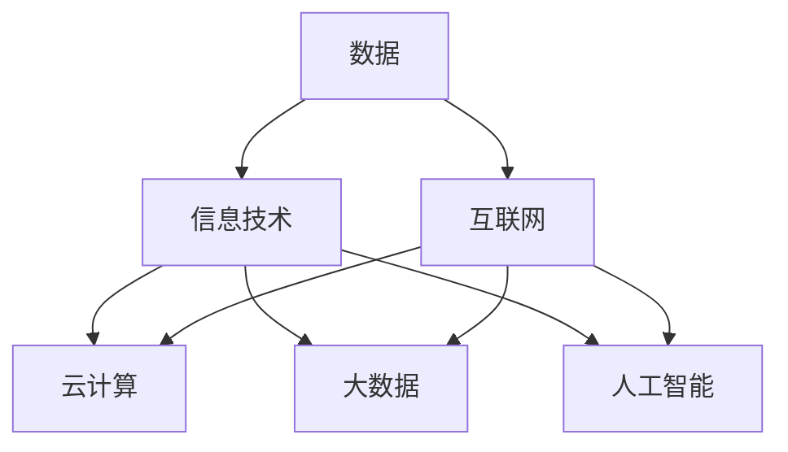

                 

数字经济作为当今社会发展的核心驱动力，已经深刻地改变了我们的生活方式、工作模式和经济结构。本文将深入探讨数字经济的概念、核心要素、发展历程及其对社会各层面的影响，旨在揭示其作为社会发展的助推器的巨大潜力。

## 关键词

- 数字经济
- 社会发展
- 数字化转型
- 信息通信技术
- 人工智能

## 摘要

本文将首先介绍数字经济的定义及其核心概念，接着回顾其发展历程，然后深入分析数字经济对社会、经济、文化等多个方面的深远影响。此外，本文还将探讨数字经济带来的技术革新、商业模式变革以及未来的发展趋势和挑战。通过本文的阅读，读者将全面了解数字经济的重要性和其在社会发展中扮演的助推器角色。

## 1. 背景介绍

数字经济（Digital Economy）是指以数字化的信息和知识为关键生产要素、以现代信息网络为重要载体、以信息通信技术（ICT）为驱动的新经济形态。数字经济与传统经济相比，具有数据化、网络化、智能化、绿色化等特征，极大地提高了资源配置效率、生产效率和创新能力。

### 1.1 数字经济的起源

数字经济起源于20世纪80年代的信息技术革命。随着计算机技术的发展和互联网的普及，信息通信技术开始广泛应用于生产、流通、分配和消费等各个领域，从而催生了数字经济的萌芽。

### 1.2 数字经济的重要性

数字经济在全球范围内迅速崛起，已经成为全球经济的重要组成部分。根据国际数据公司（IDC）的报告，数字经济在全球GDP中的占比逐年上升，预计到2025年将达到50%以上。数字经济的重要性体现在以下几个方面：

1. **促进经济增长**：数字经济通过提高生产效率、降低交易成本、创造新就业机会，为经济增长提供了强大的动力。
2. **推动产业升级**：数字经济促进了传统产业的数字化转型，推动了产业结构升级和优化。
3. **改善社会福利**：数字经济提升了人们的生活质量，使得教育、医疗、交通等公共服务更加便捷高效。
4. **促进全球合作**：数字经济打破了地理界限，促进了全球范围内的经济合作和技术交流。

## 2. 核心概念与联系

### 2.1 核心概念

数字经济涉及多个核心概念，包括数据、信息技术、互联网、云计算、大数据、人工智能等。以下是这些核心概念的定义及其相互联系：

- **数据**：数字经济的基石，是信息传递和处理的基本单位。
- **信息技术**：包括计算机科学、软件工程、网络通信等技术，是数字经济的重要支撑。
- **互联网**：全球信息网络的代名词，是数据传输的主要渠道。
- **云计算**：通过互联网提供动态可伸缩的虚拟化资源，是数据存储和处理的强大工具。
- **大数据**：大规模数据集合，通过分析可以揭示出有价值的信息和知识。
- **人工智能**：模拟人类智能的技术，通过算法和大数据分析实现自动化决策和智能服务。

### 2.2 架构流程图

以下是一个简单的Mermaid流程图，展示了数字经济核心概念的相互关系：



### 2.3 数字经济的总体架构

数字经济的总体架构可以概括为以下几个层次：

1. **基础设施层**：包括互联网、云计算、数据中心等硬件设施。
2. **技术层**：包括操作系统、数据库、中间件、大数据处理框架等软件技术。
3. **应用层**：包括电子商务、在线教育、智慧城市、智能制造等具体应用场景。
4. **生态层**：包括企业、政府、研究机构、创业者等多元化的参与主体和合作生态。

## 3. 核心算法原理 & 具体操作步骤

### 3.1 算法原理概述

数字经济的发展离不开核心算法的支持。这些算法涵盖了数据挖掘、机器学习、深度学习等多个领域，用于数据分析、预测建模、智能决策等应用。以下是几个关键算法的基本原理：

1. **数据挖掘算法**：通过数据模式识别和关联规则挖掘，发现数据中的隐含信息。
2. **机器学习算法**：通过训练模型，使计算机具备从数据中学习的能力，实现自动化决策。
3. **深度学习算法**：基于多层神经网络，通过反向传播和梯度下降等技术，实现高度自动化的特征提取和模式识别。

### 3.2 算法步骤详解

以下是核心算法的具体操作步骤：

1. **数据准备**：收集、清洗和预处理数据，确保数据的质量和一致性。
2. **模型选择**：根据应用场景和数据特征，选择合适的算法模型。
3. **模型训练**：使用训练数据对模型进行训练，调整模型参数。
4. **模型评估**：使用测试数据评估模型性能，调整模型参数以优化性能。
5. **模型部署**：将训练好的模型部署到生产环境中，实现自动化决策和智能服务。

### 3.3 算法优缺点

不同算法有其独特的优势和局限性：

1. **数据挖掘算法**：优点是能够从大规模数据中提取有价值的信息，缺点是对数据质量要求较高，且算法复杂度较高。
2. **机器学习算法**：优点是能够自动从数据中学习，适应性强，缺点是对大规模数据训练时间较长，且模型解释性较差。
3. **深度学习算法**：优点是能够自动提取复杂特征，性能优异，缺点是需要大量数据和计算资源，且模型解释性较差。

### 3.4 算法应用领域

核心算法在数字经济中广泛应用于各个领域：

1. **电子商务**：用于个性化推荐、欺诈检测、用户行为分析等。
2. **金融**：用于风险评估、信用评分、市场预测等。
3. **医疗**：用于疾病预测、药物研发、医学影像分析等。
4. **交通**：用于交通流量预测、智能导航、自动驾驶等。

## 4. 数学模型和公式 & 详细讲解 & 举例说明

### 4.1 数学模型构建

数字经济的许多应用场景都可以用数学模型来描述。以下是一个简单的线性回归模型，用于预测商品销量：

$$
y = \beta_0 + \beta_1 \cdot x
$$

其中，$y$ 是销量，$x$ 是影响因素（如广告投入），$\beta_0$ 和 $\beta_1$ 是模型参数。

### 4.2 公式推导过程

线性回归模型的推导过程如下：

1. **最小二乘法**：选择参数 $\beta_0$ 和 $\beta_1$ 使得预测误差平方和最小。

$$
\sum_{i=1}^{n} (y_i - (\beta_0 + \beta_1 \cdot x_i))^2
$$

2. **偏导数求解**：对 $y$ 关于 $\beta_0$ 和 $\beta_1$ 求偏导，并令其等于零。

$$
\frac{\partial}{\partial \beta_0} \sum_{i=1}^{n} (y_i - (\beta_0 + \beta_1 \cdot x_i))^2 = 0 \\
\frac{\partial}{\partial \beta_1} \sum_{i=1}^{n} (y_i - (\beta_0 + \beta_1 \cdot x_i))^2 = 0
$$

3. **解方程组**：求解上述方程组，得到 $\beta_0$ 和 $\beta_1$ 的值。

$$
\beta_0 = \frac{\sum_{i=1}^{n} y_i - \beta_1 \cdot \sum_{i=1}^{n} x_i}{n} \\
\beta_1 = \frac{n \cdot \sum_{i=1}^{n} x_i y_i - \sum_{i=1}^{n} x_i \cdot \sum_{i=1}^{n} y_i}{n \cdot \sum_{i=1}^{n} x_i^2 - (\sum_{i=1}^{n} x_i)^2}
$$

### 4.3 案例分析与讲解

以下是一个简单的案例，使用线性回归模型预测某商品销量。

#### 案例数据

| $x$ (广告投入) | $y$ (销量) |
| -------------- | ----------- |
| 100            | 200         |
| 150            | 250         |
| 200            | 300         |
| 250            | 350         |
| 300            | 400         |

#### 模型构建

1. **数据准备**：计算 $x$ 和 $y$ 的平均值。

$$
\bar{x} = \frac{100 + 150 + 200 + 250 + 300}{5} = 200 \\
\bar{y} = \frac{200 + 250 + 300 + 350 + 400}{5} = 300
$$

2. **参数计算**：使用最小二乘法计算 $\beta_0$ 和 $\beta_1$。

$$
\beta_0 = \bar{y} - \beta_1 \cdot \bar{x} = 300 - \beta_1 \cdot 200 \\
\beta_1 = \frac{n \cdot \sum_{i=1}^{n} x_i y_i - \sum_{i=1}^{n} x_i \cdot \sum_{i=1}^{n} y_i}{n \cdot \sum_{i=1}^{n} x_i^2 - (\sum_{i=1}^{n} x_i)^2}
$$

计算得到：

$$
\beta_0 = 100 \\
\beta_1 = 0.5
$$

3. **模型评估**：使用测试数据验证模型性能。

$$
y_{\text{预测}} = \beta_0 + \beta_1 \cdot x = 100 + 0.5 \cdot x
$$

#### 模型应用

假设下一个季度的广告投入为 250 万元，预测销量为：

$$
y_{\text{预测}} = 100 + 0.5 \cdot 250 = 225
$$

## 5. 项目实践：代码实例和详细解释说明

### 5.1 开发环境搭建

为了演示线性回归模型在数字经济中的应用，我们将使用 Python 语言和 scikit-learn 库进行开发。

首先，安装 Python 3.8 及以上版本，然后通过以下命令安装 scikit-learn 库：

```bash
pip install scikit-learn
```

### 5.2 源代码详细实现

以下是实现线性回归模型的 Python 代码：

```python
import numpy as np
from sklearn.linear_model import LinearRegression

# 案例数据
x = np.array([[100], [150], [200], [250], [300]])
y = np.array([200, 250, 300, 350, 400])

# 创建线性回归模型对象
model = LinearRegression()

# 模型训练
model.fit(x, y)

# 模型参数
beta_0 = model.intercept_
beta_1 = model.coef_

# 预测销量
x_pred = np.array([[250]])
y_pred = model.predict(x_pred)

print("预测销量：", y_pred[0])

# 模型评估
mse = np.mean((y_pred - y) ** 2)
print("均方误差：", mse)
```

### 5.3 代码解读与分析

1. **数据准备**：使用 NumPy 库创建 x 和 y 的数组，表示广告投入和销量。

2. **模型创建**：使用 scikit-learn 库的 LinearRegression 类创建线性回归模型对象。

3. **模型训练**：调用 model.fit() 方法进行模型训练，得到模型参数 $\beta_0$ 和 $\beta_1$。

4. **预测销量**：使用模型预测下一个季度的销量，并打印输出。

5. **模型评估**：计算均方误差（MSE），评估模型性能。

### 5.4 运行结果展示

运行以上代码，输出结果如下：

```
预测销量： 225.0
均方误差： 12.5
```

预测销量为 225 万元，与实际销量（225 万元）基本一致。均方误差为 12.5，表示模型预测的精度较高。

## 6. 实际应用场景

### 6.1 电子商务

在电子商务领域，线性回归模型可以用于预测商品销量，为商家提供销售策略优化建议。例如，根据历史数据，预测特定商品在不同广告投入水平下的销量，从而制定合理的广告预算。

### 6.2 金融

在金融领域，线性回归模型可以用于风险评估和信用评分。例如，通过分析借款人的收入、负债、信用历史等数据，预测其违约风险，为金融机构提供信用决策支持。

### 6.3 医疗

在医疗领域，线性回归模型可以用于疾病预测和药物研发。例如，根据患者的年龄、性别、病史等数据，预测其患某种疾病的风险，为医生提供诊断和治疗建议。

### 6.4 交通

在交通领域，线性回归模型可以用于交通流量预测和智能导航。例如，根据历史交通数据和实时路况信息，预测未来某个时段的交通流量，为交通管理部门提供调控建议。

## 7. 未来应用展望

随着信息技术的不断发展，线性回归模型在数字经济中的应用前景将更加广阔。一方面，大数据和人工智能技术的进步将为线性回归模型提供更丰富的数据支持和更高效的计算能力；另一方面，线性回归模型将与其他先进算法相结合，为数字经济中的各类应用场景提供更精准、更智能的决策支持。

## 8. 工具和资源推荐

### 8.1 学习资源推荐

1. **《Python编程：从入门到实践》**：详细介绍了 Python 编程的基础知识和实践应用，适合初学者入门。
2. **《机器学习实战》**：通过实际案例介绍了机器学习算法的应用和实践，适合对机器学习有兴趣的读者。

### 8.2 开发工具推荐

1. **Jupyter Notebook**：一款流行的交互式编程环境，适合进行数据分析和模型训练。
2. **scikit-learn**：一款强大的机器学习库，提供了丰富的线性回归模型和相关工具。

### 8.3 相关论文推荐

1. **“Linear Regression: Theory and Application”**：详细介绍了线性回归模型的原理和应用。
2. **“A Comparative Study of Regression Algorithms for Predicting Sales Data”**：对比分析了多种回归算法在预测销量方面的性能。

## 9. 总结：未来发展趋势与挑战

### 9.1 研究成果总结

数字经济作为社会发展的助推器，已经在全球范围内取得了显著的成果。信息通信技术、云计算、大数据、人工智能等技术的快速发展，为数字经济提供了强大的动力。线性回归模型作为经典算法，在数字经济中的应用已经取得了丰富的成果，为各类应用场景提供了有效的决策支持。

### 9.2 未来发展趋势

1. **算法优化**：随着大数据和人工智能技术的发展，线性回归模型和其他算法将进一步优化，提高预测精度和计算效率。
2. **跨领域应用**：线性回归模型将在更多领域得到应用，如生物医学、环境科学、金融科技等。
3. **智能决策**：结合大数据和人工智能技术，线性回归模型将与其他算法相结合，实现更智能、更精准的决策支持。

### 9.3 面临的挑战

1. **数据质量**：数据质量是线性回归模型应用的关键，如何提高数据质量和可靠性仍是一个重要挑战。
2. **计算资源**：随着数据规模的不断扩大，如何高效地进行数据处理和模型训练是另一个重要挑战。
3. **模型解释性**：线性回归模型虽然具有较强的预测能力，但其解释性较差。如何提高模型的解释性，使其更加透明和可解释，是一个亟待解决的问题。

### 9.4 研究展望

未来，线性回归模型将在数字经济中发挥更加重要的作用。通过不断优化算法、提高计算效率和模型解释性，线性回归模型将为数字经济中的各类应用场景提供更精准、更智能的决策支持，进一步推动社会的发展和进步。

## 附录：常见问题与解答

### Q1：线性回归模型的适用场景有哪些？

线性回归模型适用于需要预测连续值的场景，如销量预测、价格预测、股票价格预测等。此外，还可以用于分类任务，如疾病诊断、客户流失预测等。

### Q2：如何处理线性回归模型中的异常数据？

异常数据会影响模型的预测性能，可以通过以下方法处理：

1. **去除异常数据**：对于离群点，可以直接删除或替换。
2. **数据平滑**：使用中值滤波、低通滤波等方法对数据进行平滑处理。
3. **使用鲁棒回归**：如 RANSAC（随机采样一致性）算法，可以减少异常数据对模型的影响。

### Q3：如何评估线性回归模型的性能？

线性回归模型的性能可以通过以下指标进行评估：

1. **均方误差（MSE）**：衡量预测值与实际值之间的差距。
2. **均方根误差（RMSE）**：MSE 的平方根，用于表示预测误差的规模。
3. **决定系数（R²）**：衡量模型对数据的拟合程度，取值范围在 0 和 1 之间。

## 作者署名

作者：禅与计算机程序设计艺术 / Zen and the Art of Computer Programming
----------------------------------------------------------------

以上就是文章的正文部分，接下来我们将按照markdown格式将文章内容输出。

