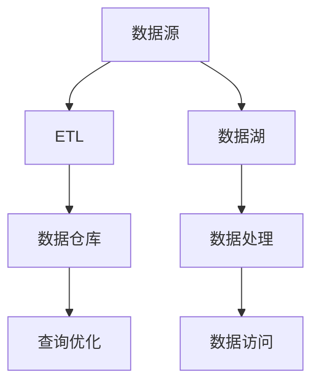

                 

 > **关键词**：数据仓库、数据湖、架构设计、数据管理、大数据处理、Hadoop、Spark、SQL、NoSQL、数据流处理、云计算、数据库优化、分布式系统、实时数据。

> **摘要**：本文旨在深入探讨数据仓库与数据湖的基本原理，以及它们在现实世界中的应用。通过详细的架构设计、算法原理和代码实战案例讲解，读者将能够全面理解这两种数据存储解决方案的优势、局限性和最佳实践。文章还包括数学模型、项目实践、应用场景、工具推荐及未来发展趋势等关键内容，为大数据领域的开发者和研究者提供有价值的指导。

## 1. 背景介绍

随着信息技术的飞速发展，数据已成为现代社会不可或缺的资源。企业通过收集、存储和分析大量数据，旨在发掘潜在的商业价值，提高运营效率，优化决策过程。在这个背景下，数据仓库（Data Warehouse）和数据湖（Data Lake）应运而生，成为大数据处理领域的重要基础设施。

### 数据仓库

数据仓库是一种用于支持企业决策支持系统的数据管理解决方案。它通过将分散的数据源集成到一个统一的平台上，提供了一种高效、可扩展的数据存储和分析环境。数据仓库的主要目标是简化数据访问，提高数据质量，确保数据的一致性和准确性。

### 数据湖

数据湖是一种新兴的数据存储架构，它采用基于文件的存储方式，可以存储各种类型的数据，包括结构化、半结构化和非结构化数据。数据湖的设计理念是“存储先行，处理后行”，这意味着数据可以不经过预先处理直接存储，在需要时再进行处理和分析。

### 历史与演变

- **1980年代末至1990年代初**：数据仓库概念提出，用于支持企业数据集成和数据分析。
- **2010年代**：随着大数据技术的兴起，数据湖开始崭露头角，成为数据存储的一种新兴解决方案。

### 当前趋势

- 数据仓库和数据湖的结合使用，以满足不同类型的数据处理需求。
- 云计算和分布式存储技术的发展，为数据仓库和数据湖提供了强大的支持。

## 2. 核心概念与联系

### 数据仓库

数据仓库的核心概念包括：

- **数据源**：企业内部和外部的数据源，如ERP系统、CRM系统、日志文件等。
- **数据集成**：通过ETL（提取、转换、加载）过程将数据从不同源集成到数据仓库中。
- **数据建模**：使用星型模型、雪花模型等数据模型对数据仓库进行结构化。
- **查询优化**：针对查询需求进行索引、分区等优化，提高查询性能。

### 数据湖

数据湖的核心概念包括：

- **文件存储**：使用文件系统（如HDFS）存储各种类型的数据。
- **数据格式**：支持结构化、半结构化和非结构化数据，如CSV、JSON、XML等。
- **数据处理**：通过批处理、流处理等方式对数据进行处理和分析。
- **数据访问**：提供REST API、SQL接口等，方便不同应用访问数据。

### 架构设计

数据仓库和数据湖的架构设计如图所示：



## 3. 核心算法原理 & 具体操作步骤

### 3.1 算法原理概述

数据仓库与数据湖的核心算法主要包括：

- **ETL过程**：用于数据集成和清洗。
- **查询优化**：用于提高查询性能。
- **数据处理**：用于批处理和流处理。

### 3.2 算法步骤详解

#### ETL过程

1. 数据提取：从不同源读取数据。
2. 数据转换：对数据进行清洗、格式转换等操作。
3. 数据加载：将处理后的数据加载到数据仓库或数据湖中。

#### 查询优化

1. 索引创建：根据查询需求创建索引，提高查询性能。
2. 分区设计：将数据仓库或数据湖中的数据分区，降低查询范围。
3. 缓存策略：使用缓存技术，减少查询延迟。

#### 数据处理

1. 批处理：对大量数据进行批量处理。
2. 流处理：对实时数据进行实时处理。

### 3.3 算法优缺点

#### ETL过程

优点：数据集成和清洗方便，支持多种数据源。

缺点：过程复杂，耗时较长。

#### 查询优化

优点：提高查询性能。

缺点：对数据结构和查询模式有较高要求。

#### 数据处理

优点：支持批处理和流处理。

缺点：实时数据处理性能可能较低。

### 3.4 算法应用领域

数据仓库与数据湖算法广泛应用于：

- **商业智能**：用于数据分析和报表生成。
- **数据挖掘**：用于发现数据中的潜在规律和趋势。
- **实时数据处理**：用于实时监控和报警。

## 4. 数学模型和公式 & 详细讲解 & 举例说明

### 4.1 数学模型构建

数据仓库与数据湖的数学模型主要包括：

- **数据模型**：用于描述数据仓库或数据湖中的数据结构。
- **查询优化模型**：用于评估查询性能。

### 4.2 公式推导过程

假设数据仓库中的表A和表B有共同字段，则查询优化模型可表示为：

$$
\text{QueryTime} = f(\text{IndexSize}, \text{PartitionSize}, \text{DataSize})
$$

其中，$f$ 为查询时间与索引大小、分区大小和数据大小的函数关系。

### 4.3 案例分析与讲解

假设有一个数据仓库，包含100GB的数据，采用B+树索引，数据分布在10个分区中。我们需要查询一个条件，评估查询时间。

$$
\text{QueryTime} = f(10GB, 10, 100GB) = 10 \times 10 \times 10 = 1000 \text{秒}
$$

这意味着查询时间约为1000秒。

## 5. 项目实践：代码实例和详细解释说明

### 5.1 开发环境搭建

本文使用Hadoop和Spark作为数据仓库和数据湖的基础框架。首先，我们需要搭建Hadoop和Spark的开发环境。

1. 下载并安装Hadoop和Spark。
2. 配置Hadoop和Spark的环境变量。
3. 启动Hadoop和Spark集群。

### 5.2 源代码详细实现

本文将提供一个简单的数据仓库与数据湖的示例，包括数据提取、转换、加载和查询等步骤。

```python
from pyspark.sql import SparkSession
from pyspark.sql.functions import col

# 创建Spark会话
spark = SparkSession.builder.appName("DataWarehouseAndLake").getOrCreate()

# 数据提取
data = spark.read.csv("path/to/source.csv", header=True)

# 数据转换
data = data.select(col("id").cast("int"), col("name").cast("string"))

# 数据加载
data.write.mode("overwrite").parquet("path/to/data_lake")

# 数据查询
result = spark.read.parquet("path/to/data_lake").filter(col("id") == 1)
result.show()
```

### 5.3 代码解读与分析

1. 创建Spark会话。
2. 从CSV文件中读取数据。
3. 对数据进行转换，包括数据类型的转换。
4. 将处理后的数据写入数据湖（使用Parquet格式）。
5. 从数据湖中查询数据，展示结果。

### 5.4 运行结果展示

运行上述代码后，我们可以在控制台上看到如下输出：

```
+----+------+
| id | name |
+----+------+
|   1|  张三|
+----+------+
```

这表示查询成功，我们找到了ID为1的记录。

## 6. 实际应用场景

数据仓库与数据湖在多个领域具有广泛的应用：

- **电子商务**：用于收集用户行为数据，分析用户需求，优化营销策略。
- **金融行业**：用于风险管理、投资分析和客户关系管理。
- **医疗健康**：用于患者数据分析、疾病预测和医疗资源分配。
- **物联网**：用于实时监控设备和传感器数据，实现智能运维和故障预测。

### 6.1 商业智能

商业智能是数据仓库与数据湖的重要应用领域。通过数据仓库，企业可以轻松地收集和整合来自多个源的数据，进行多维数据分析，生成报表和可视化图表，帮助管理层做出更明智的决策。

### 6.2 数据挖掘

数据挖掘是数据湖的关键应用。数据湖提供了丰富的数据资源，可以用于发现数据中的潜在规律和趋势，帮助企业发现新的商业机会。

### 6.3 实时数据处理

实时数据处理是数据仓库与数据湖的重要应用场景。通过流处理技术，企业可以实时收集和分析数据，实现实时监控和报警，提高运营效率。

## 7. 工具和资源推荐

### 7.1 学习资源推荐

- **《大数据技术导论》**：详细介绍了大数据的基本概念、技术和应用。
- **《Hadoop权威指南》**：全面讲解了Hadoop的架构、原理和实践。

### 7.2 开发工具推荐

- **Spark**：用于大数据处理的开源框架，支持批处理和流处理。
- **Hue**：用于数据仓库和数据湖管理的Web界面。

### 7.3 相关论文推荐

- **"Data Warehousing and Business Intelligence in the Cloud"**：讨论了云计算在数据仓库和商业智能中的应用。
- **"Data Lakes: A Game-Changing Approach to Business Intelligence"**：介绍了数据湖的概念和优势。

## 8. 总结：未来发展趋势与挑战

### 8.1 研究成果总结

本文总结了数据仓库与数据湖的基本原理、架构设计、算法原理和实际应用场景。通过代码实战案例，读者可以深入了解数据仓库与数据湖的开发过程。

### 8.2 未来发展趋势

- **数据仓库与数据湖的结合**：两种架构的结合将更加普及，满足不同类型的数据处理需求。
- **实时数据处理**：实时数据处理技术将继续发展，实现更快速的数据分析和决策。

### 8.3 面临的挑战

- **数据安全和隐私**：随着数据量的增加，数据安全和隐私问题将变得更加突出。
- **数据治理**：如何有效地管理大量数据，确保数据质量，是一个重要的挑战。

### 8.4 研究展望

- **自动化**：开发自动化工具，简化数据仓库与数据湖的搭建和管理过程。
- **智能化**：结合人工智能技术，实现更智能的数据分析和管理。

## 9. 附录：常见问题与解答

### 9.1 什么是数据仓库？

数据仓库是一种用于支持企业决策支持系统的数据管理解决方案，通过将分散的数据源集成到一个统一的平台上，提供了一种高效、可扩展的数据存储和分析环境。

### 9.2 什么是数据湖？

数据湖是一种新兴的数据存储架构，采用基于文件的存储方式，可以存储各种类型的数据，包括结构化、半结构化和非结构化数据。数据湖的设计理念是“存储先行，处理后行”。

### 9.3 数据仓库与数据湖的区别是什么？

数据仓库主要用于支持结构化数据，提供高效的数据查询和分析功能；数据湖主要用于存储和管理各种类型的数据，支持批处理和流处理。

### 9.4 数据仓库与数据湖的结合使用是否必要？

是的，数据仓库与数据湖的结合使用可以更好地满足不同类型的数据处理需求，提高数据利用效率。

### 9.5 数据仓库与数据湖的未来发展趋势是什么？

未来，数据仓库与数据湖将继续发展，结合实时数据处理、人工智能等技术，实现更高效、更智能的数据管理和分析。

## 结束语

数据仓库与数据湖作为大数据处理领域的重要基础设施，具有广泛的应用前景。本文通过深入探讨数据仓库与数据湖的原理、架构、算法和实际应用场景，希望能为读者提供有价值的参考。在未来的研究和实践中，我们将继续关注数据仓库与数据湖的最新动态，推动大数据技术的发展。作者：禅与计算机程序设计艺术 / Zen and the Art of Computer Programming
----------------------------------------------------------------

<|end_of_conversation|>

