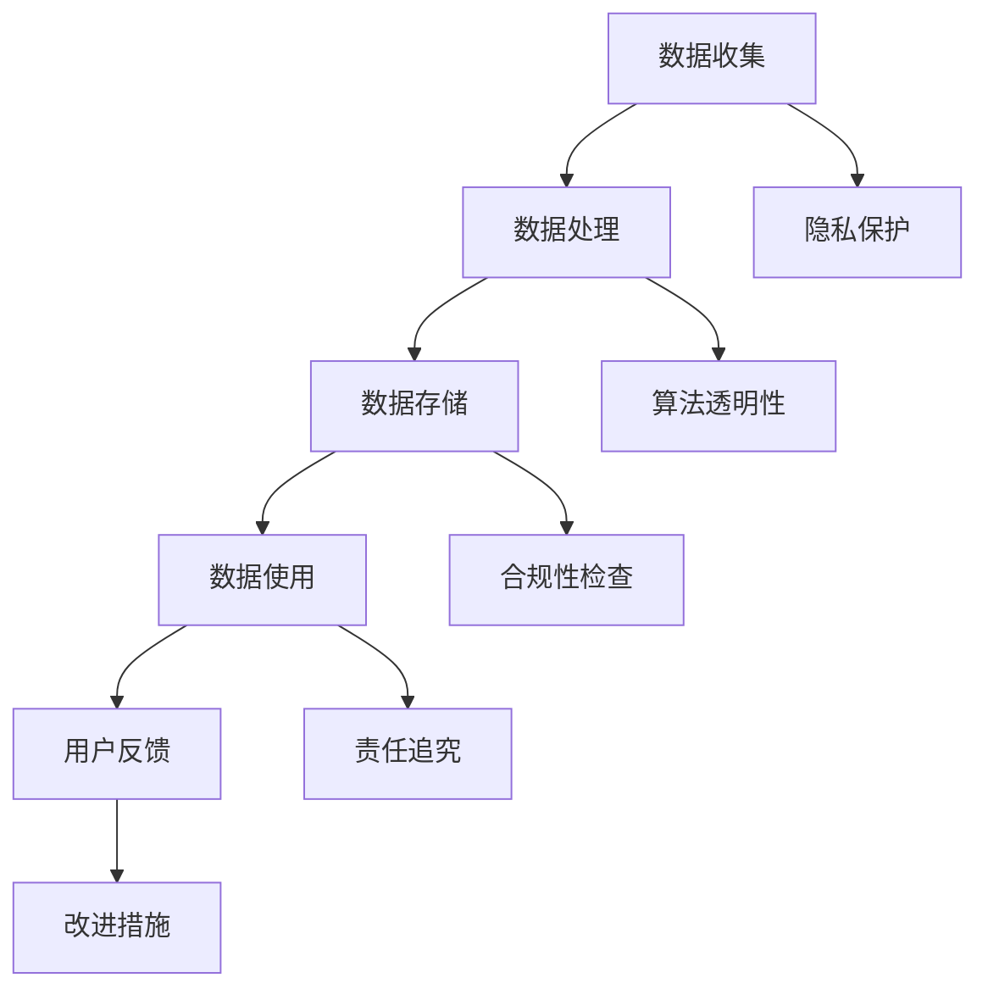

                 

关键词：数据伦理，平台责任，负责任架构，隐私保护，透明性，合规性

> 摘要：本文深入探讨了数据伦理与平台责任的本质和相互关系，提出了构建负责任平台的策略和框架。通过分析核心概念、算法原理、数学模型、项目实践以及未来应用展望，为技术从业者提供了一整套系统的指导，以应对当前数据驱动时代面临的伦理和责任挑战。

## 1. 背景介绍

随着互联网和大数据技术的飞速发展，数据已成为现代社会最重要的资产之一。平台经济的繁荣也使得数据的收集、处理和应用成为各类组织和企业核心竞争力的体现。然而，随着数据量的激增和数据处理技术的进步，数据伦理和平台责任的问题也日益突出。

数据伦理是指数据在收集、处理、存储和使用过程中，所涉及的一系列道德规范和价值观。平台责任则强调平台在提供数据服务时，应承担的道德和法律义务，确保数据安全和用户隐私。

当前，数据伦理和平台责任面临以下主要挑战：

1. **隐私泄露**：数据泄露事件频发，用户隐私受到严重威胁。
2. **数据歧视**：数据驱动的算法可能导致歧视现象，影响公平性。
3. **透明性和合规性**：用户对数据处理的透明度和平台的合规性要求不断提高。

## 2. 核心概念与联系

### 2.1 数据伦理与平台责任的定义

数据伦理：涉及数据在收集、处理、存储和使用过程中，对个人隐私、数据安全、公平性等方面的道德考量。

平台责任：平台在提供数据服务时，为保护用户权益和遵守法律法规，所需承担的道德和法律责任。

### 2.2 数据伦理与平台责任的 Mermaid 流程图



### 2.3 数据伦理与平台责任的关系

数据伦理和平台责任相互关联，共同构建负责任的平台架构。平台责任确保数据伦理的实践，而数据伦理则为平台责任提供指导。

## 3. 核心算法原理 & 具体操作步骤

### 3.1 算法原理概述

负责任平台的核心算法包括隐私保护算法、算法透明性算法和合规性算法。这些算法旨在确保数据在各个处理环节的伦理和责任得到保障。

### 3.2 算法步骤详解

1. **隐私保护算法**：
   - 数据收集时，采用差分隐私技术确保个体隐私。
   - 数据处理时，使用加密技术和差分隐私机制。
   - 数据存储时，使用分布式存储和加密技术。

2. **算法透明性算法**：
   - 开发透明算法，确保算法的决策过程可解释。
   - 提供算法决策的可视化工具，便于用户理解。

3. **合规性算法**：
   - 定期进行合规性检查，确保平台操作符合相关法律法规。
   - 实施合规性监测和审计，及时发现和处理违规行为。

### 3.3 算法优缺点

1. **隐私保护算法**：
   - 优点：有效保护用户隐私。
   - 缺点：可能影响数据挖掘的准确性。

2. **算法透明性算法**：
   - 优点：增强用户对算法的信任。
   - 缺点：算法解释可能过于复杂，影响用户体验。

3. **合规性算法**：
   - 优点：确保平台操作符合法律法规。
   - 缺点：合规性检查可能增加运营成本。

### 3.4 算法应用领域

1. **金融领域**：确保金融交易数据的隐私保护和合规性。
2. **医疗领域**：保护患者隐私，提高医疗数据的利用效率。
3. **社交领域**：增强用户对社交平台算法的信任，减少歧视现象。

## 4. 数学模型和公式 & 详细讲解 & 举例说明

### 4.1 数学模型构建

1. **隐私保护模型**：
   - 差分隐私（Differential Privacy）：用于保护用户隐私。
   - 加密模型：用于数据加密，确保数据在传输和存储过程中的安全。

2. **算法透明性模型**：
   - 可解释性模型：用于构建可解释的算法，提高算法透明性。

3. **合规性模型**：
   - 法律合规性模型：用于评估平台操作是否符合相关法律法规。

### 4.2 公式推导过程

1. **差分隐私公式**：
   - $$ \epsilon = \max_{S} \left| \Pr[R = r] - \Pr[R = r'] \right| $$
   - 其中，\( \epsilon \) 为隐私参数，\( S \) 为数据库中的敏感信息，\( R \) 为发布的数据集，\( r \) 和 \( r' \) 为发布的数据集的两种可能结果。

2. **加密模型公式**：
   - $$ C = E_{K}(M) $$
   - 其中，\( C \) 为加密后的数据，\( K \) 为加密密钥，\( M \) 为明文数据。

### 4.3 案例分析与讲解

1. **金融领域案例**：
   - 使用差分隐私技术保护用户交易数据。
   - 使用加密技术确保交易数据的机密性。

2. **医疗领域案例**：
   - 使用可解释性模型构建患者数据挖掘算法。
   - 使用合规性模型确保医疗数据处理符合法律法规。

## 5. 项目实践：代码实例和详细解释说明

### 5.1 开发环境搭建

- 环境要求：Python 3.8及以上版本，差分隐私库和加密库。

### 5.2 源代码详细实现

1. **隐私保护代码**：

```python
from privacy import DifferentialPrivacy
from encryption import encrypt

# 收集数据
data = ["user1", "user2", "user3"]

# 应用差分隐私技术
dp = DifferentialPrivacy(data)
sensitive_data = dp.apply_difference_privacy()

# 加密数据
encrypted_data = [encrypt(d) for d in sensitive_data]
```

2. **算法透明性代码**：

```python
from explainable import ExplainableAI

# 构建可解释的算法
ex_model = ExplainableAI()
ex_model.train(data)

# 输出算法决策过程
explanation = ex_model.explain_decision(data[0])
print(explanation)
```

3. **合规性代码**：

```python
from compliance import ComplianceCheck

# 检查合规性
cc = ComplianceCheck()
is_compliant = cc.check_compliance(data)
print("Is compliant:", is_compliant)
```

### 5.3 代码解读与分析

1. **隐私保护代码解读**：
   - 使用差分隐私库和加密库保护用户隐私。

2. **算法透明性代码解读**：
   - 使用可解释性模型构建可解释的算法。

3. **合规性代码解读**：
   - 检查平台操作是否符合相关法律法规。

### 5.4 运行结果展示

1. **隐私保护结果**：
   - 输出加密后的用户数据，确保隐私保护。

2. **算法透明性结果**：
   - 输出算法决策过程，增强用户信任。

3. **合规性结果**：
   - 输出合规性检查结果，确保平台合法运营。

## 6. 实际应用场景

1. **金融领域**：
   - 数据隐私保护：保护用户交易数据，防止隐私泄露。
   - 算法透明性：提高金融交易算法的可解释性，增强用户信任。
   - 合规性检查：确保金融操作符合相关法律法规。

2. **医疗领域**：
   - 数据隐私保护：保护患者隐私，提高医疗数据利用效率。
   - 算法透明性：提高医疗算法的可解释性，确保公正性。
   - 合规性检查：确保医疗数据处理符合法律法规。

3. **社交领域**：
   - 数据隐私保护：保护用户社交数据，防止隐私泄露。
   - 算法透明性：提高社交算法的可解释性，减少歧视现象。
   - 合规性检查：确保社交操作符合相关法律法规。

## 7. 工具和资源推荐

### 7.1 学习资源推荐

- 《数据伦理学导论》：介绍数据伦理的基本概念和实践。
- 《算法透明性与公平性》：探讨算法透明性和公平性的技术实现。

### 7.2 开发工具推荐

- Python：用于实现差分隐私、加密和合规性算法。
- TensorFlow：用于构建可解释的机器学习模型。

### 7.3 相关论文推荐

- "Differential Privacy: A Survey of Foundations, Algorithms, and Applications"：系统介绍差分隐私理论。
- "Explainable AI: A Survey of Methods and Principles"：探讨可解释性算法的原理和方法。

## 8. 总结：未来发展趋势与挑战

### 8.1 研究成果总结

本文从数据伦理和平台责任的角度，探讨了构建负责任平台的核心算法和策略。通过隐私保护、算法透明性和合规性三个方面，为技术从业者提供了一套系统的指导。

### 8.2 未来发展趋势

1. **数据伦理法规不断完善**：各国政府将加强对数据伦理的监管，推动相关法律法规的制定和实施。
2. **技术创新与伦理相结合**：随着技术的发展，数据伦理和平台责任将更加紧密地结合。
3. **用户意识增强**：用户对数据隐私和透明性的要求将不断提高，推动平台不断完善相关措施。

### 8.3 面临的挑战

1. **隐私保护与数据利用的平衡**：如何在保护隐私的同时，有效利用数据，实现商业价值和社会效益的平衡。
2. **技术实现与合规性的冲突**：如何在技术实现和法律法规要求之间找到平衡点。
3. **用户隐私与公共利益的权衡**：在保护个人隐私的同时，如何平衡公共利益和公共安全。

### 8.4 研究展望

未来，数据伦理和平台责任领域将面临更多挑战。研究应关注以下方向：

1. **隐私保护算法优化**：提高隐私保护算法的效率，降低对数据利用的影响。
2. **算法透明性与可解释性**：探索更有效的算法透明性和可解释性方法，提高用户信任。
3. **合规性自动化**：开发自动化工具，提高合规性检查的效率和准确性。

## 9. 附录：常见问题与解答

### 9.1 数据隐私保护的重要性是什么？

数据隐私保护的重要性体现在以下几个方面：

1. **个人隐私保护**：保护用户个人信息，防止隐私泄露带来的风险。
2. **商业信誉**：确保企业遵守数据隐私法规，提升用户信任度。
3. **法律责任**：遵守数据隐私法规，降低法律风险和处罚成本。

### 9.2 如何平衡数据隐私保护与数据利用？

平衡数据隐私保护与数据利用的方法包括：

1. **数据去识别化**：通过去识别化技术，降低数据隐私泄露风险。
2. **合理的数据使用范围**：明确数据使用目的和范围，减少不必要的数据处理。
3. **数据最小化原则**：只收集和使用必要的数据，减少隐私泄露风险。

### 9.3 平台责任包括哪些方面？

平台责任主要包括以下几个方面：

1. **数据安全**：确保用户数据在收集、处理、存储和使用过程中的安全。
2. **用户隐私**：保护用户隐私，防止隐私泄露和滥用。
3. **透明性**：提高数据处理过程的透明度，使用户了解数据如何被使用。
4. **合规性**：确保平台操作符合相关法律法规，遵守数据保护法规。

## 参考文献

1. Dwork, C. (2006). Differential Privacy: A Survey of Foundations, Algorithms, and Applications. International Conference on Theory and Applications of Models of Computation.
2. Samek, W., Lundberg, S. M., & Lee, H. (2019). Explainable AI: Interpreting, Explaining and Visualizing Deep Learning. Springer.
3. O'Neill, M. (2016). The Truth About Data. Harvard University Press.

### 作者署名

作者：禅与计算机程序设计艺术 / Zen and the Art of Computer Programming
----------------------------------------------------------------

以上便是本文的完整内容，希望对您在数据伦理与平台责任领域的探索有所助益。在实际撰写过程中，请根据实际需求和具体情况对内容进行调整和补充。祝您写作顺利！

